[이 글](https://www.witch.work/blog-lower-bandwidth/)에서 블로그의 bandwidth를 감당하기 위해 proxy를 설정한 과정을 기록하였다. 하지만 이런 노력에도 불구하고 cloudflare proxy를 통해 들어오는 접속은 많지 않았고 vercel의 bandwidth는 늘어나기만 했다. 

최근에는 계속 bandwidth가 늘어날 시 내 free plan 계정이 차단될 수 있다는 이메일을 받았다.

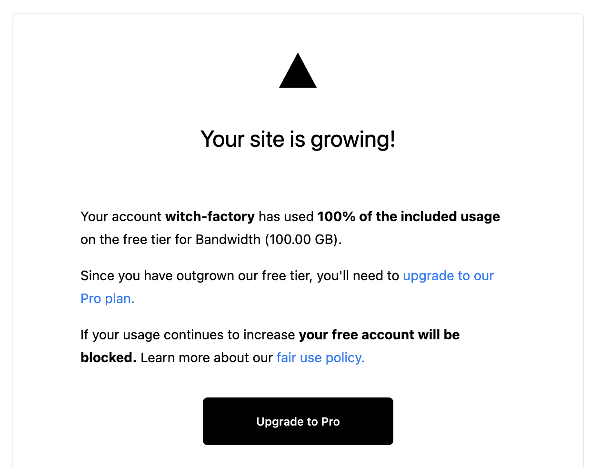

대체 어디서 이렇게 접속을 많이 하는 걸까 의문이 들지만 일단 bandwidth를 감당하는 게 먼저이므로 블로그를 cloudflare pages로 옮기기로 결정하였다.

# 1. Cloudflare Page 배포

[Cloudflare get started](https://developers.cloudflare.com/pages/get-started/)를 보면 cloudflare page를 통해 어떻게 내 사이트를 배포하는지 나와 있다.

vercel과 같이 cloudflare pages도 Github, GitLab과 연동할 수 있다. 내 블로그는 github에 올라가 있으므로 이걸 연결하면 된다.

cloudflare dashboard에 가서 좌측 메뉴 > Pages > Create a project > Connect to Git를 클릭하면 github과 연동할 수 있다.

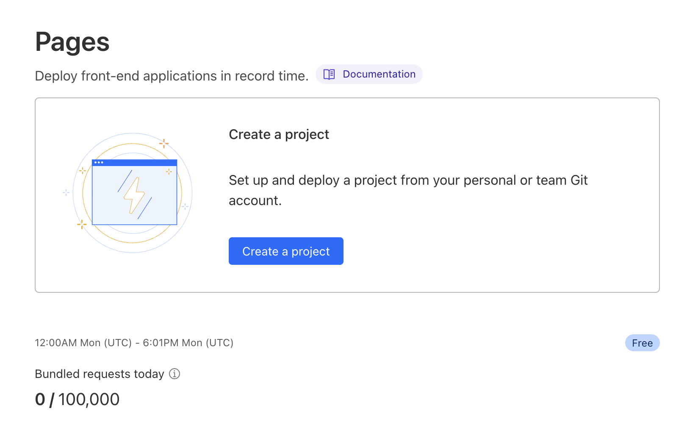

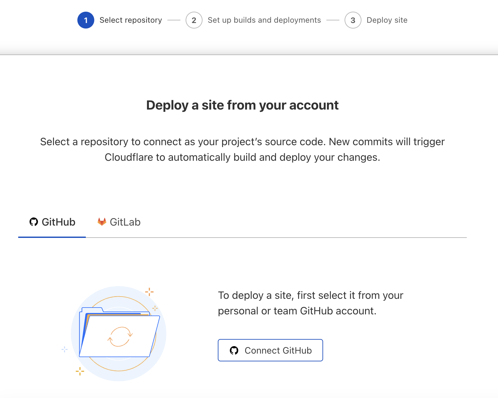

그리고 github의 repository중 내 블로그 레포지토리를 선택하면 된다. 잘 선택하고 나면 다음과 같은 화면이 뜨는데 스크롤을 내려서 Begin setup을 클릭하자.

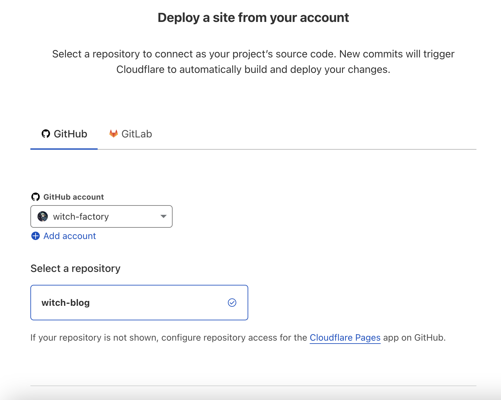

그 다음에는 빌드 세팅을 해야 한다. project name은 배포하고자 하는 프로젝트 이름을 뭘로 할 것인지 원하는 것으로 설정한다. 도메인에 들어가게 되는 이름이다. 그리고 배포할 브랜치도 선택한다. 나는 vercel에서 배포하던 것 그대로 했다.

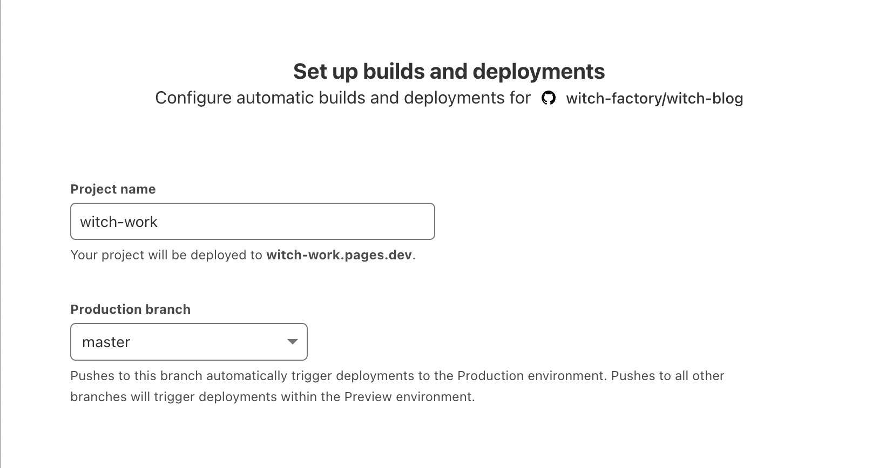

내 블로그는 gatsby 기반이므로 빌드 세팅에서 gatsby 프리셋을 선택하면 빌드 커맨드와 output directory를 자동으로 설정해준다.

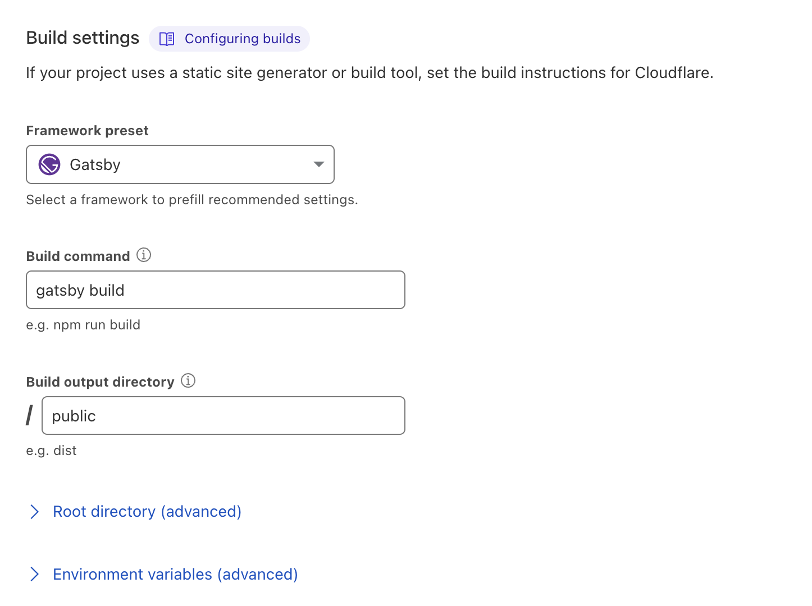

이렇게 하고 다음으로 넘어가면 배포가 진행된다.

## 1.1. 오류 해결

그런데 프로젝트 빌드 과정에서 패키지를 설치하면서 에러가 발생한다. 에러 메시지는 다음과 같다.

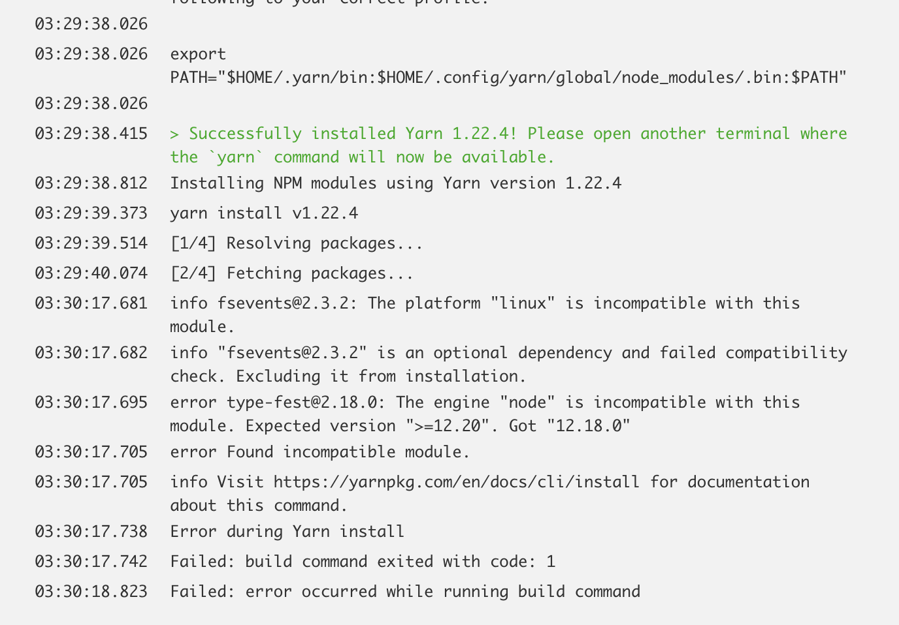

읽어 보면 type-fest라는 라이브러리가 node의 12.20 버전 이상을 요구하는데 cloudflare에서 빌드할 땐 12.18.0을 사용하기 때문에 빌드에 실패한다고 한다.

[노드 최신 LTS 버전](https://nodejs.org/ko/download)이 지금 18.15.0인데 12.18.0을 사용한다니..[cloudflare bulid configuration](https://developers.cloudflare.com/pages/platform/build-configuration/)을 확인해 보니 cloudflare의 빌드 환경은 기본적으로 12.18.0을 사용한다고 한다. 하지만 `NODE_VERSION`환경 변수를 통해 이 버전을 변경할 수 있다.

프로젝트 화면에 들어가서 방금 배포한 `witch-work`프로젝트를 선택하고 settings에 들어간다. 그러면 메뉴에서 `Environment variables`에 들어갈 수 있다.

거기서 Add variable을 클릭하고 변수명에 `NODE_VERSION`를 입력하고 `17.9.1`을 입력하면 된다. cloudflare에서 node 17.x버전까지는 모두 지원하기 때문이다.

그러면 다음과 같이 추가된다.

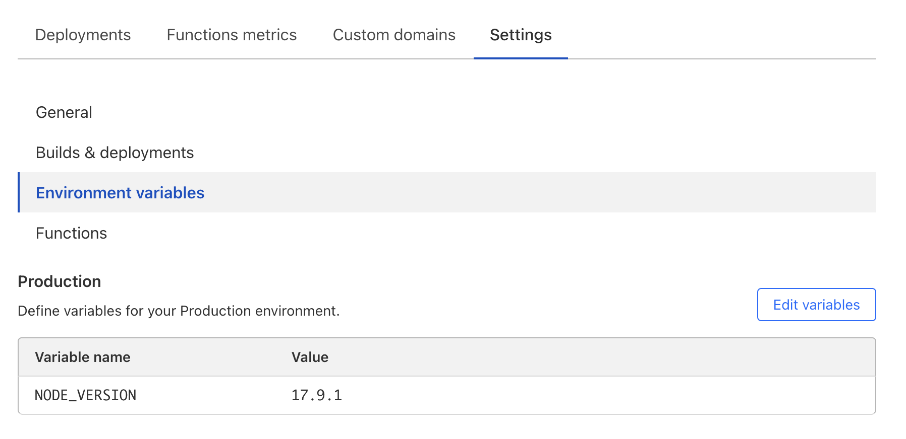

이렇게 node 버전을 올려 준 결과 다음과 같이 빌드가 성공적으로 완료되고 배포도 잘 되는 것을 확인할 수 있었다.

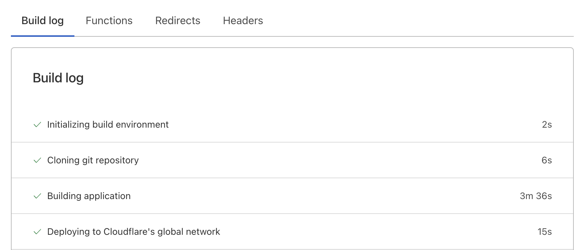

[witch-work.pages.dev](https://witch-work.pages.dev/)도메인으로 배포되었다.

# 2. 커스텀 도메인 연결

vercel로 배포된 블로그에도 원래 `witch.work` 도메인이 연결되어 있었다. 이를 cloudflare쪽으로 옮겨보자.

먼저 cloudflare dashboard로 들어간다. 그리고 좌측 메뉴에서 Pages 선택 -> 내가 배포한 프로젝트(나는 witch-work) 선택 -> 상단 메뉴의 Custom domains 선택

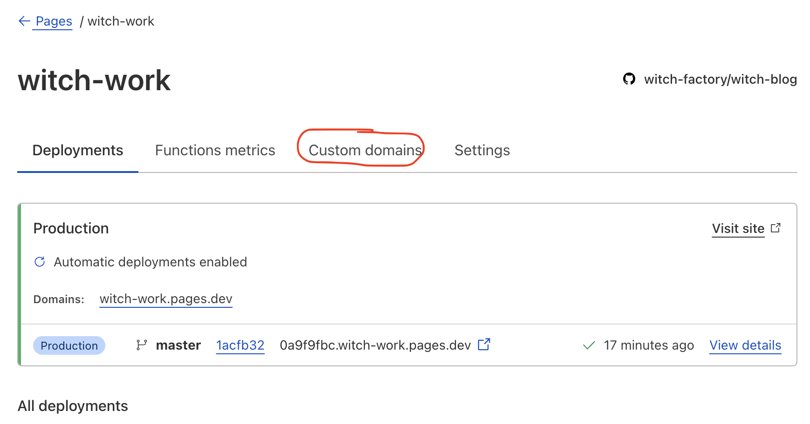

그러면 다음과 같은 화면이 나오는데 Set up a custom domain을 클릭하자.

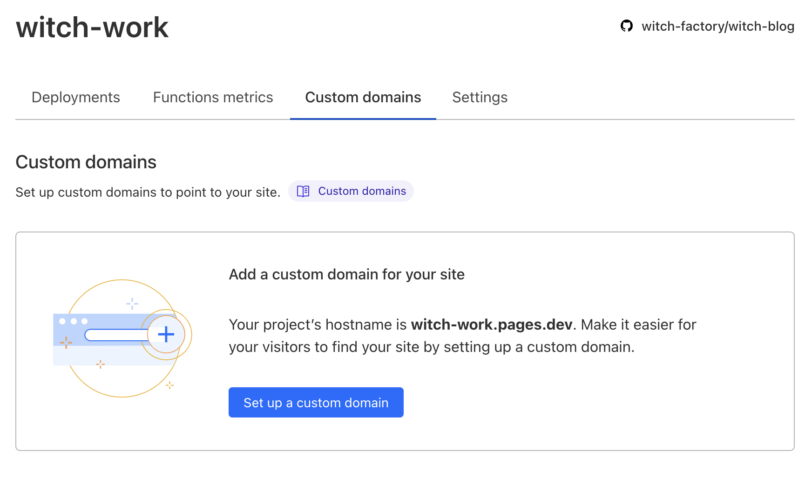

내가 가진 도메인을 입력하라고 해서 `witch.work`를 입력하고 다음으로 넘어간다. 그러면 알아서 DNS 레코드 설정을 바꾸어 준다.

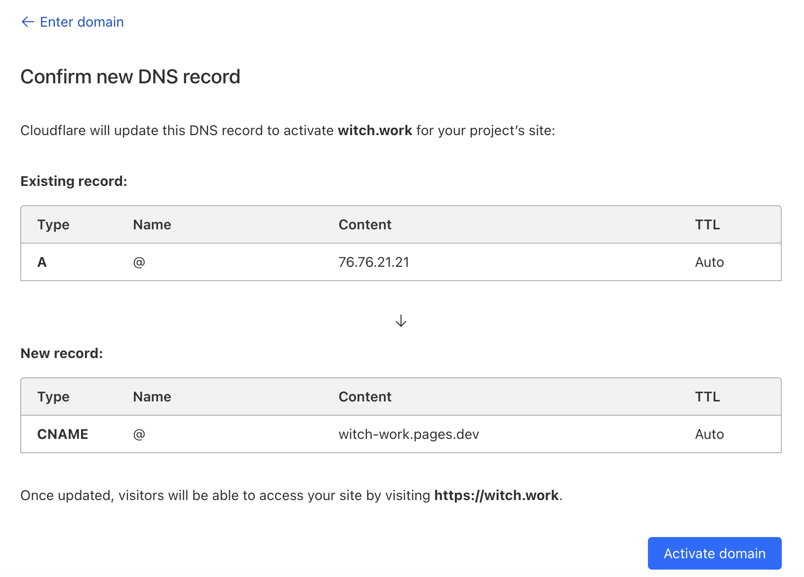

# 3. apex domain 설정(네임서버 바꾸기)

그런데 apex domain 즉 서브도메인이 붙지 않은 도메인으로 배포할 시 더 해줘야 할 작업이 있다고 한다. 

지금은 딱히 내 사이트에서 실용적으로 사용하는 서브도메인이 없지만, 일단 `/about`페이지도 만들어져는 있고 언젠가 쓸 수도 있으니 이를 설정하자.

cloudflare 문서에 의하면 내 사이트를 cloudflare zone에 추가하고 네임서버 설정을 해줘야 한다고 한다.

cloudflare에서 내 사이트의 DNS 레코드를 관리할 수 있도록 하는 것이다. 내 사이트로의 접속 요청을 cloudflare에서 받아서 DNS 역할을 해주도록 하는 것이다.

## 3.1. 시작하기 전에

도메인 네임서버 업데이트 전에 다음과 같은 준비가 필요하다.

도메인을 보유하고 있어야 한다. 나는 `witch.work`를 godaddy에서 구입해서 가지고 있다.

Cloudflare 계정이 필요한데 당연히 있다.

그리고 [DNSSEC](https://www.cloudflare.com/ko-kr/dns/dnssec/how-dnssec-works/)이 비활성화되어 있어야 한다. 나같은 경우 [GoDaddy - Add a DS record](https://ph.godaddy.com/help/add-a-ds-record-23865)를 따라함으로써 확인할 수 있었다.

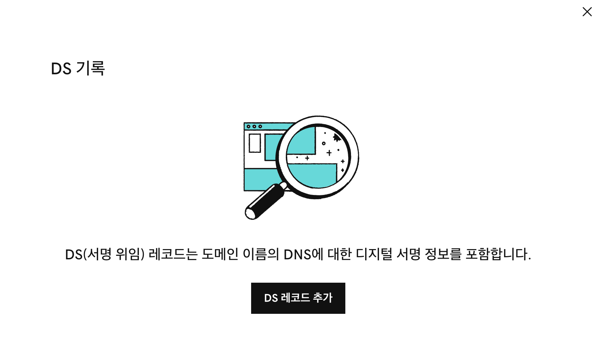

DS 레코드고 뭐고 아무것도 없는 듯 하니 DNSSEC는 비활성화되어 있다고 생각했다. 모든 준비는 이미 끝나 있었다..

## 3.2. Cloudflare에 사이트 추가

cloudflare에 사이트를 추가하려면 cloudflare 내부에 새 도메인을 생성하고 그 도메인을 활성화하기 위한 절차들을 밟아야 한다.

난 이미 [이전 글](https://witch.work/blog-lower-bandwidth/#32-%EC%82%AC%EC%9D%B4%ED%8A%B8-%EC%B6%94%EA%B0%80%ED%95%98%EA%B8%B0)에서 이를 한 바 있다. 따라서 사이트는 잘 추가되어 있다.

## 3.3. DNS 레코드 확인하기

cloudflare 네임서버를 사용하기 시작하면 cloudflare가 내 사이트의 주요한 DNS 제공자가 될 것이다. 그 말은 cloudflare의 내 DNS 레코드가 정확해야 내 도메인이 잘 작동할 거라는 뜻이다.

이전에 cloudflare에 내 사이트를 추가할 때 cloudflare가 자동으로 DNS 레코드를 추가해줬다. 그게 잘 되었는지 확인해 보자.

cloudflare dashboard에서 내 사이트(`witch.work`)를 선택하고 좌측 메뉴에서 DNS 선택 -> DNS Records 선택

나는 이전에 cloudflare를 처음 사용할 때 확인하긴 했기 때문에, 여전히 잘 추가되어 있었다. `witch.work`가 `witch-work.pages.dev`로 연결되는 것도 잘 확인할 수 있었다.

그리고 원래는 apex domain에 CNAME 레코드는 쓸 수 없는데 cloudflare에서는 [CNAME flattening](https://developers.cloudflare.com/dns/cname-flattening/)을 사용하기 때문에 CNAME 레코드를 추가해도 잘 동작한다. 

DNS 쿼리가 도착하면 cloudflare에서 CNAME 레코드를 주는 대신 해당 CNAME이 가리키는 IP 주소를 찾아서 CNAME 레코드 대신 IP 주소를 반환해주는 원리라고 한다.

# 4. www 서브도메인 추가

www.witch.work 로도 내 블로그에 접속할 수 있도록 해보자. vercel에서는 가능했는데 여기서는 아직 안된다.

CNAME 레코드를 하나 더 추가하면 된다. Name은 내가 원하는 서브도메인으로, 그리고 Content는 cloudflare에서 배포한 내 페이지 주소, 즉 `witch-work.pages.dev`로 설정하면 된다.

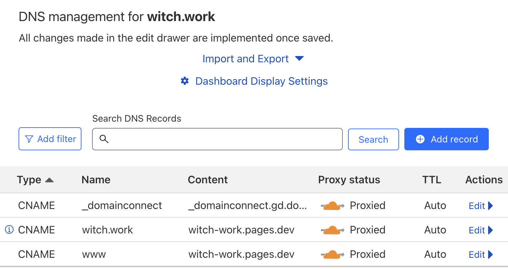

Name이 그냥 www로 표시되는 것을 볼 수 있는데 이는 내 사이트가 이미 cloudflare zone에서 관리되고 있기 때문에 www 이후에 자동으로 CNAME 레코드가 추가되기 때문이다.

## 4.1. 522 error 해결

이렇게 하고 나니 www.witch.work 로 접속하면 522 error가 뜬다. 참고로 이렇게 서브도메인을 추가해 주기 전에는 www.witch.work 접속시 404 error가 떴다. 

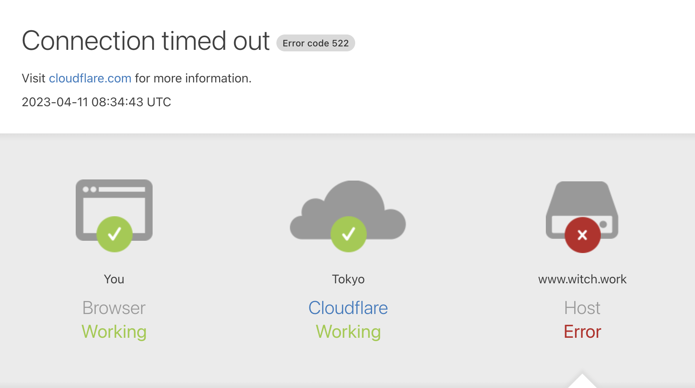

다행히 바로 아래에 해결법이 있었다. 

```
To ensure a custom domain is added successfully, you must go through the Add a custom domain process described above. Manually adding a custom CNAME record pointing to your Cloudflare Pages site - without first associating the domain (or subdomains) in the Cloudflare Pages dashboard - will result in your domain failing to resolve at the CNAME record address, and display a 522 error
```

요약해보면, 먼저 Cloudflare Page Dashboard에서 내 cloudflare page와 서브도메인을 연결해 주는 작업을 하기 전에 CNAME 레코드를 추가하면 522 error가 뜬다는 것이다.

따라서 내 dashboard로 이동한 후 좌측 메뉴에서 Pages 선택 -> 내 사이트 선택 -> 메뉴에서 Custom Domains 선택 -> Set up a custom domain에서 `www.witch.work` 추가의 과정을 거치자.

그러면 Custom domains 메뉴에 다음과 같이 2개의 도메인이 표시된다.

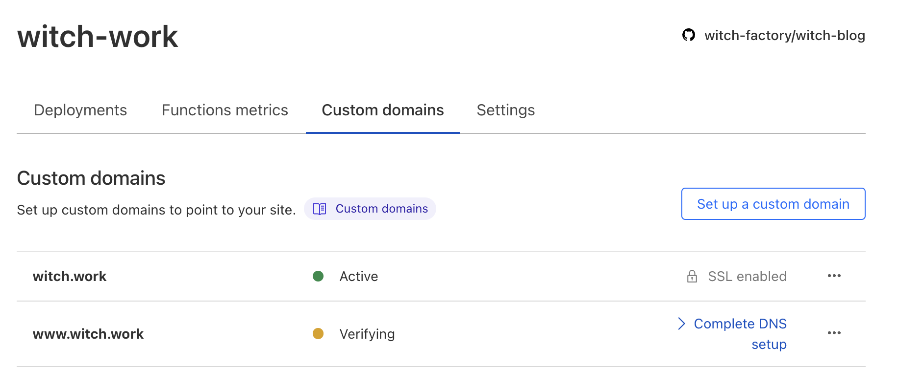

둘 다 Active가 되고 난 후 www.witch.work에 접속하면 정상적으로 내 블로그로 접속된다.

# 5. 끝

이제 vercel에서 기존 도메인을 삭제하면 된다.

# 참고

https://developers.cloudflare.com/pages/migrations/migrating-from-vercel/

https://developers.cloudflare.com/pages/get-started/

https://developers.cloudflare.com/pages/platform/custom-domains/

https://dev.dwer.kr/2020/04/zone-apex-root-domain-naked-domain.html

https://developers.cloudflare.com/dns/zone-setups/full-setup/setup/

https://ph.godaddy.com/help/add-a-ds-record-23865

https://www.cloudflare.com/ko-kr/learning/dns/dns-security/