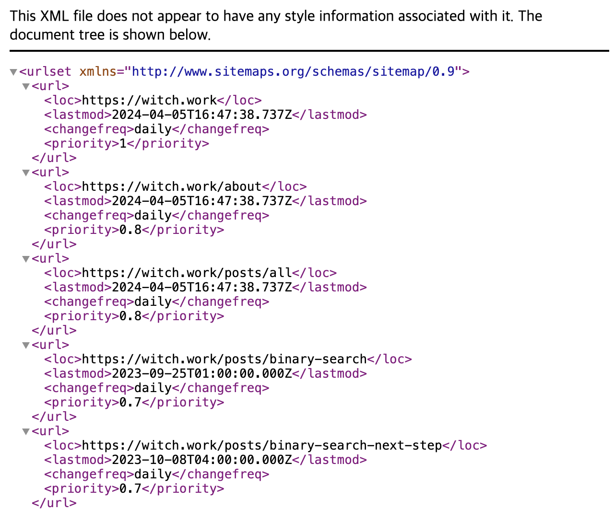

# 시작

최근에 글또의 프론트 반상회에서 [기술 블로그를 위한 SEO](https://wormwlrm.github.io/2023/05/07/SEO-for-Technical-Blog.html)발표를 들었다. 거기의 발표 내용 중 블로그의 사이트맵을 추가하라는 조언이 있었다.

나도 [next-sitemap](https://www.npmjs.com/package/next-sitemap)으로 하고 있다고 생각했는데 어느 순간부터 이게 잘 작동하지 않았다.

그래서 다시 한 번 사이트맵을 추가해보기로 했다. 그렇게 Next.js로 만들어진 이 블로그에 사이트맵을 추가하는 방법을 알아보자.

[next-sitemap](https://www.npmjs.com/package/next-sitemap)이라는 라이브러리가 있지만 이번에는 Next.js 공식 문서에 나와 있는 방법을 따라보기로 했다.

메타데이터를 위한 공식 API가 있는데 굳이 라이브러리를 쓸 필요는 없다고 생각했고 공식 API가 꽤나 간단했기 때문이다.

# 1. 정적 사이트맵 생성

간단한 사이트의 경우 `app` 폴더에 `app/sitemap.xml` 파일을 만들어서 사이트맵을  정적으로 생성할 수 있다. 사이트 주소를 넣으면 사이트맵을 생성해 주는 [xml-sitemaps](https://www.xml-sitemaps.com/) 같은 사이트도 있다.

예를 들어 이 블로그에 메인 페이지와 `/about` 페이지만 있다고 하자. 그러면 `app/sitemap.xml` 파일을 다음과 같이 만들 수 있다.

```xml
<urlset xmlns="http://www.sitemaps.org/schemas/sitemap/0.9">
  <url>
    <loc>https://witch.work</loc>
    <lastmod>2024-04-05T16:47:38.737Z</lastmod>
    <changefreq>daily</changefreq>
    <priority>1</priority>
  </url>
  <url>
    <loc>https://witch.work/about</loc>
    <lastmod>2024-04-05T16:47:38.737Z</lastmod>
    <changefreq>daily</changefreq>
    <priority>0.8</priority>
  </url>
</urlset>
```

사이트가 작고 사이트맵에 추가되어야 할 새로운 라우터가 적거나 없는 편이라면 이런 식으로 정적으로 사이트맵을 생성해 주는 것도 좋겠다.

# 2. 동적 사이트맵 생성

## 2.1. 기본적인 생성 방법

`app/sitemap.ts`(`.js`도 가능)를 이용하면 사이트맵을 동적으로 생성해 줄 수 있다. URL들의 정보를 담은 객체의 배열을 만들어서 리턴하는 함수를 만들면 된다. 그리고 그 함수를 `export default`로 내보내면 된다.

```typescript
// app/sitemap.ts
import { MetadataRoute } from 'next'

export default function sitemap(): MetadataRoute.Sitemap {
  return [
    {
      url: 'https://witch.work',
      lastModified: new Date(),
      changeFrequency: 'daily',
      priority: 1,
    },
    {
      url: 'https://witch.work/about',
      lastModified: new Date(),
      changeFrequency: 'daily',
      priority: 0.8,
    }
  ]
}
```

Next.js에서 사이트맵 객체를 위한 `MetadataRoute.Sitemap` 타입도 제공한다. 위에서도 사용했는데, 이 타입은 다음과 같이 정의되어 있다. 여기 맞추어 객체 배열을 만들어 주면 된다.

```typescript
type SitemapFile = Array<{
    url: string;
    lastModified?: string | Date;
    changeFrequency?: 'always' | 'hourly' | 'daily' | 'weekly' | 'monthly' | 'yearly' | 'never';
    priority?: number;
}>;
```

만약 지역별로 다르게 사이트맵을 만들고 싶다면 `app/sitemap.ts` 에서 리턴하는 배열의 객체에 `alternates` 속성을 추가하면 된다.

```typescript
// app/sitemap.ts
import { MetadataRoute } from 'next'

export default function sitemap(): MetadataRoute.Sitemap {
  return [
    {
      url: 'https://witch.work',
      lastModified: new Date(),
      changeFrequency: 'daily',
      priority: 1,
      alternates: {
        languages: {
          es: 'https://witch.work/es',
          en: 'https://witch.work/en',
        }
      }
    },
    // ...
  ]
}
```

이렇게 만든 동적 사이트맵은 `public/sitemap.xml`이 명시적으로 있을 경우 무시되기 때문에 주의하자.

## 2.2. 블로그 적용

아주 큰 사이트의 경우 사이트맵을 라우트별로 만드는 방식으로 분할해서 관리할 수 있다. 하지만 내 블로그의 경우 그렇게 크지 않기 때문에 `app/sitemap.ts` 파일에 모든 라우터를 넣어서 관리하기로 했다.

먼저 다음과 같이 기본적으로 사이트맵에 들어가야 할 라우트들을 넣은 배열을 만들었다.

```typescript
// app/sitemap.ts
const defaultSiteMap: MetadataRoute.Sitemap = [
  {
    url: 'https://witch.work',
    lastModified: new Date(),
    changeFrequency: 'daily',
    priority: 1,
  },
  {
    url: 'https://witch.work/about',
    lastModified: new Date(),
    changeFrequency: 'daily',
    priority: 0.8,
  },
  {
    url: 'https://witch.work/posts/all',
    lastModified: new Date(),
    changeFrequency: 'daily',
    priority: 0.8,
  },
];
```

그리고 글의 제목, URL 등이 담긴 `postMetadata` 배열에서 URL을 가져와서 앞서 만든 `defaultSiteMap` 배열과 합쳐 주었다.

```typescript
export default function sitemap(): MetadataRoute.Sitemap {
  const sitemapFromPosts: MetadataRoute.Sitemap = postMetadata.map((post) => {
    return {
      url: 'https://witch.work' + post.url,
      lastModified: new Date(post.date),
      changeFrequency: "daily",
      priority: 0.7,
    };
  });
  return [...defaultSiteMap, ...sitemapFromPosts];
}
```

이렇게 하면 [https://witch.work/sitemap.xml](https://witch.work/sitemap.xml)에서 사이트맵을 확인할 수 있게 된다.



내 블로그의 경우에는 그렇지 않았지만 만약 서버에 있는 데이터를 이용해서 사이트맵을 만들어야 할 경우 `sitemap` 함수를 `async` 함수로 만들어서 데이터를 가져오는 부분을 비동기로 처리해 주면 된다.

# 3. 사이트맵 여러 개 생성하기

내 블로그 같은 경우에는 동적 URL로 생성되는 부분이 블로그 글밖에 없다. 따라서 사이트맵 전체를 한 번에 만들어도 큰 문제가 없다.

하지만 만약 기본적인 라우트 갯수도 많고 동적으로 생성되는 URL의 종류도 많은 대규모 웹 애플리케이션의 경우 이 방법으로 사이트맵을 만들기에는 무리가 있다.

사이트맵을 한 파일에서 전부 생성하면 코드 로직 관리도 힘들고, 사이트맵 파일이 너무 커져서 검색 엔진이 사이트맵을 읽는 데 시간이 오래 걸릴 수도 있다.

따라서 Next.js에서는 사이트맵을 여러 개로 나눠서 생성할 수 있도록 지원한다.

## 3.1. 라우트 폴더 이용하기

사이트맵을 여러 개로 나누어 생성하는 방법 중 하나는 라우트 폴더 내부에 `sitemap.(xml|js|ts)` 형태의 파일을 만들어서 사이트맵을 생성하는 것이다. 예를 들어서 내 블로그에 있는 글들에 대해서는 사이트맵을 따로 생성하고 싶다면 `pages/posts/sitemap.ts` 파일을 만들어서 사이트맵을 생성할 수 있다. 형식은 다음과 같이 똑같다.

```typescript
// pages/posts/sitemap.ts
export default function sitemap(): MetadataRoute.Sitemap {
  return postMetadata.map((post)=>{
    return {
      url:blogConfig.url + post.url,
      lastModified:new Date(post.date),
      changeFrequency:'daily',
      priority:0.7,
    };
  });
}
```

이렇게 할 경우 `https://witch.work/posts/sitemap.xml`에서 글들에 대한 사이트맵을 확인할 수 있다. 구글 서치 콘솔 등에서 해당 사이트맵의 주소도 등록해 주면 된다.

## 3.2. generateSitemaps 이용하기

앞서 설명한 방법과 함께 사용할 수 있는 방법인데, 하나의 라우트에서 여러 개의 사이트맵을 생성하는 방법이다. `generateSitemaps` 함수를 이용하면 여러 개의 사이트맵을 생성할 수 있다.

먼저 `sitemap.ts`의 `generateSitemaps` 함수를 `id` 속성을 갖는 객체들의 배열을 리턴하는 함수로 만든다.

```typescript
// app/sitemap.ts
export function generateSitemaps(): { id: number }[] {
  return [
    { id: 1 },
    { id: 2 },
  ];
}
```

이는 `sitemap` 함수의 인자로 들어가게 된다. `id` 속성을 갖는 객체를 인자로 받게 된 `sitemap` 함수를 `id`에 따라 다른 사이트맵을 리턴하게 만들면 된다.

```typescript
// app/sitemap.ts
export default async function sitemap({
  id
}:{
  id: number
}): Promise<MetadataRoute.Sitemap> {
  const serverData = await fetch(`https://example.com/api/sitemap/${id}`);

  return serverData.map((data)=>{
    return {
      url: data.url,
      lastModified: new Date(data.date),
      changeFrequency: 'daily',
      priority: 0.7,
    };
  });
}
```

이렇게 하면 `/sitemap/1.xml`, `/sitemap/2.xml` 등 `generateSitemaps`에서 리턴한 id에 해당하는 주소로 사이트맵을 확인할 수 있다.

이 방법은 앞서 설명한 라우트 폴더마다 사이트맵을 생성하는 방법과 같이 사용할 수도 있다. 예를 들어 내 블로그에 글이 매우 많아서 글들에 대한 사이트맵을 여러 개로 나눠서 생성하고 싶다면 `generateSitemaps` 함수를 이용할 수 있는 것이다.

다음과 같이 100개 단위로 나눠서 사이트맵을 생성할 수 있다. 이렇게 하면 블로그의 `/posts/sitemap/1.xml`, `/posts/sitemap/2.xml` 등으로 사이트맵을 확인할 수 있다.

```typescript
// app/sitemap.ts
export function generateSitemaps(): { id: number }[] {
  const sitemapCount = Math.ceil(postMetadata.length / 100);
  return Array.from({ length: sitemapCount }, (_, i) => ({ id: i + 1 }));
}

export default async function sitemap({
  id
}:{
  id: number
}): Promise<MetadataRoute.Sitemap> {
  const start = (id - 1) * 100;
  const end = id * 100;
  const sitemapFromPosts: MetadataRoute.Sitemap = postMetadata.slice(start, end).map((post) => {
    return {
      url: 'https://witch.work' + post.url,
      lastModified: new Date(post.date),
      changeFrequency: "daily",
      priority: 0.7,
    };
  });
  return sitemapFromPosts;
}
```

# 참고

Next.js의 sitemap.xml 공식 문서

https://nextjs.org/docs/app/api-reference/file-conventions/metadata/sitemap

generateSitemaps Next.js 문서

https://nextjs.org/docs/app/api-reference/functions/generate-sitemaps

Next.js에서 XML Sitemap 만들기

https://taedonn.tistory.com/40