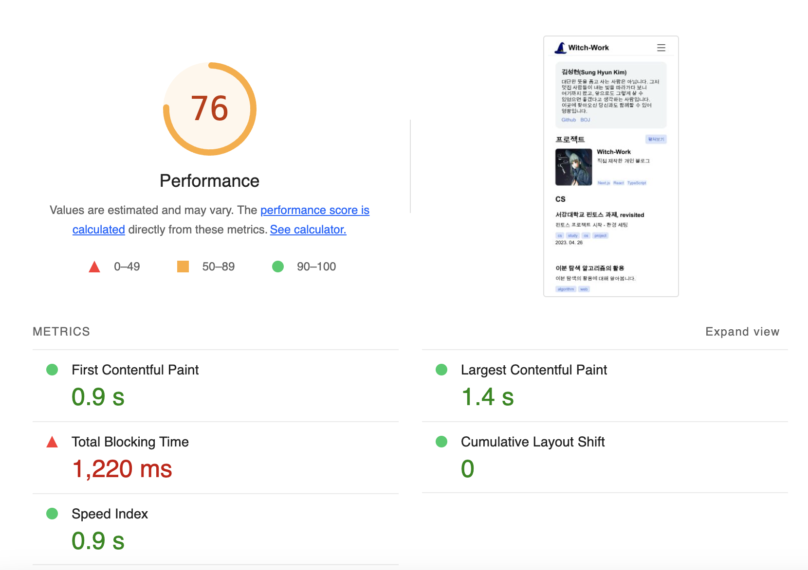
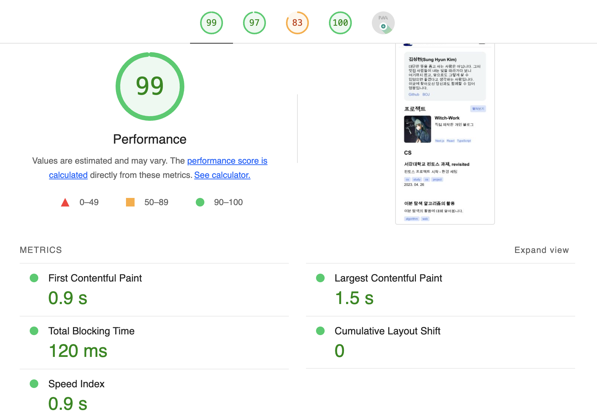
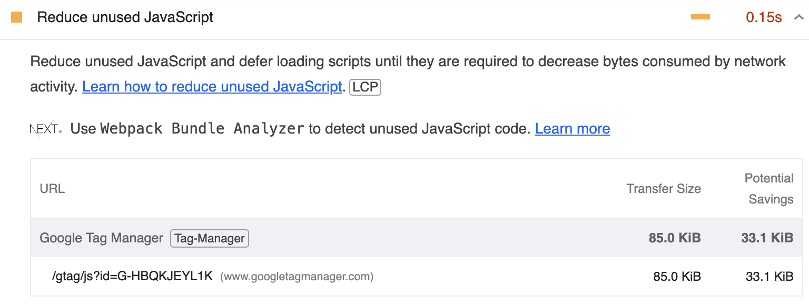

# 0. 개요

블로그의 많은 기능이 완성되었다. 하지만 배포한 페이지에 들어가 보면 여전히 페이지가 꽤 느린 것을 알 수 있다. 따라서 이를 최적화하여 누가 봐도 빠른 페이지를 만들어 보는 작업을 시작하려 한다.

예전에 카카오톡에서 빠른 속도를 위해 서버 기술 혁신을 하는 프로젝트에 붙였던 이름인 [겁나 빠른 황소 프로젝트](https://www.kakaocorp.com/page/detail/9350)의 이름을 따서 이 작업을 `겁나 빠른 마녀`로 명명하였다.

# 1. Lighthouse 검사

먼저 웹 페이지의 품질을 검사하는 구글의 유명한 오픈소스 Lighthouse로 내 페이지를 진단해 보았다. [크롬 익스텐션](https://chrome.google.com/webstore/detail/lighthouse/blipmdconlkpinefehnmjammfjpmpbjk)을 설치하고 나서 간단하게 진단 보고서를 얻을 수 있었다.

대충 접근성과 SEO는 괜찮고(최고다 next-seo!), 성능은 별로이며 Best Practice도 미흡하다. PWA도 아직 멀었다고 한다. 특히 성능과 같은 경우 나머지 요소는 다 괜찮은데 Total blocking time(사용자가 페이지와 상호작용할 수 있기까지 걸리는 시간)이 1220ms로 처참하다. [TBT가 200ms 아래로 내려와야 좋은 점수를 받을 수 있는데](https://developer.chrome.com/docs/lighthouse/performance/lighthouse-total-blocking-time/?utm_source=lighthouse&utm_medium=lr#how-lighthouse-determines-your-tbt-score) 그 6배 이상 걸리는 것이다.

따라서 성능 최적화를 열심히 하자. 생각나는 대로 최적화한 기록을 순서대로 쓴다. 어떻게 최적화하는지 몰라서 하나하나 찾아가며 했기 때문에 순서는 좀 뒤죽박죽이다.

# 2. getStaticProps로 연산 이동

메인 페이지를 보면 지금 `Home` 컴포넌트 내에서 계속 `getSortedPosts`를 호출하고 있다. 이 부분은 빌드 이후에 특별히 바뀌는 부분이 아니므로 `getStaticProps`로 이동시키자. 이렇게 하면 빌드 시에만 호출되기 때문에 빌드 시간이 좀 늘어날 수도 있겠지만, 빌드된 페이지는 빠르게 로딩될 것이다.

또한 저장된 글들의 정보 중 글 목록 렌더링에 필요한 정보들만 넘기도록 하자.

일단 `src/pages/index.tsx`의 `Home`컴포넌트에서 `getSortedPosts`를 호출하는 부분을 지우고, `src/pages/index.tsx`의 `getStaticProps`를 다음과 같이 수정한다.

