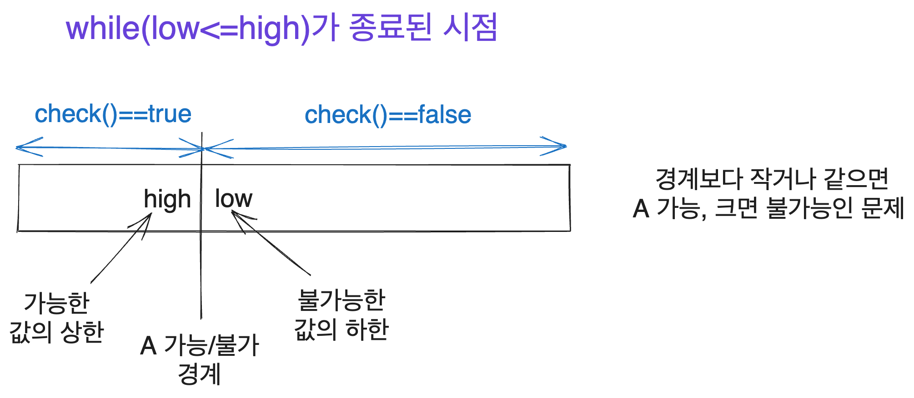

# The Importance of Binary Search?

> I feel like writing nonsense. I hope you don’t take this article too seriously.
>
> There are algorithms I’ve heard of but do not understand (and how many have I not even heard of yet).
>
> - Li-Chao Segment Tree
> - Lazy Segment Tree
> - `O(n)/O(1)` range maximum query
> - Self-balancing trees excluding treap
> - Link-Cut Tree
> - Wavelet Tree
> - Merge Sort Tree
> - Binomial Heap
> - Fibonacci Heap
> - (And many other obscure algorithms that are not worth mentioning)
>
> If you know at least three of these yet your Codeforces rating isn't red, you are doing something wrong. Stop learning useless algorithms, go solve some problems, and learn how to perform binary search.
>
> Source: [Um_nik's post](https://codeforces.com/blog/entry/92248) from 2021 (Um_nik has been a stable Legendary Grandmaster since 2017)

# Introduction

This is City. I have been involved in algorithms for quite a while, and someone asked me how to understand the principles of binary search and how to approach relevant problems, which led me to write this follow-up to my previous article on [the application of binary search](https://witch.work/posts/binary-search).

In this article, I aim to explore various implementation methods of binary search and delve into its intricate workings for a better understanding.

The illustrations used in this article were created by me using [Excalidraw](https://excalidraw.com/).

# 0. Background

The first time I thoroughly understood binary search was when I implemented it with `while(low<=high)` and grasped what values `low` and `high` represent. This realization occurred when I saw a diagram similar to the one below shared by [Yun](https://blog.yuni.dev/). Anyone with experience in binary search will likely find something familiar in this illustration.



However, I later realized that many people implement binary search with different approaches, such as `while(low<high)` or `while(low!=high)`. There are several other implementations, and I learned that these approaches can be applied differently as well.

Like many others, I learned binary search a few months after starting algorithms. Though I thought I quickly grasped the concept since it didn’t seem difficult, it took considerable time to use binary search effectively and achieve a deeper understanding. This process is still ongoing. I am still inadequate, but I will leave my insights here.

# 1. Problem Definition

I will reuse the problem definition I used in my previous article on [the application of binary search](https://witch.work/posts/binary-search). Since this article doesn’t cover the basics of binary search, I will write it briefly. It’s similar to the [BOJ 1654 Cut a Cable](https://www.acmicpc.net/problem/1654) problem.

We consider an interval `[low, high]`. There is a problem that can be represented by the `check(number)` function, where for a specific natural number `x` ($low \le x \le high$), `check(k)` is true for natural numbers `k` that are less than or equal to `x`, and false for natural numbers greater than `x`. We aim to find the boundary `x` where the results of `check` transition.

The code I typically use to solve this problem is as follows. In this case, it is the code to find the maximum value for which `check` results in true. The explanation will follow in the next section.

```cpp
while (low <= high) {
  int mid = (low + high) / 2;
  // If check is true at mid, search larger values
  if (check(mid)) {
    low = mid + 1;
  } else {
    high = mid - 1;
  }
}
return high;
```

# 2. Various Implementations - Differences in Intervals

Binary search fundamentally involves narrowing down a set region to find some condition. The implementation can differ based on how the searching interval is defined, which affects when to terminate the search and which values to use to adjust the next search interval.

The widely used method for defining this interval usually involves a closed interval `[low, high]`, a half-open interval `[low, high)`, or an open interval `(low, high)`. I will explain these different types of intervals. Each requires different termination conditions and updates for `low` and `high`.

## 2.1. Closed Interval Search

This is the implementation from earlier. It is the method I generally use.

```cpp
while (low <= high) {
  int mid = (low + high) / 2;
  // If check is true at mid, search larger values
  if (check(mid)) {
    low = mid + 1;
  } else {
    high = mid - 1;
  }
}
return high;
```

What interval does this code search and where does it lead?

The goal and operation of this code are as follows.

Assuming the natural number range from which the search starts is `[start_low, start_high]`, the desired condition is to end the search with the valid interval `[start_low, high]` where `check` is true and the interval `[low, start_high]` where `check` is false. Here, `low==high+1`.

If `check(mid)` is true, then `low` must be at least greater than `mid` so that it can be the lower bound of the closed interval where the result is false. Thus, we update with `low = mid + 1`. The same reasoning applies to when `check(mid)` is false.

By assuming that all searching intervals are closed intervals, one can understand the updates of the intervals.

## 2.2. Half-Open Interval Search

Another implementation is based on searching a half-open interval `[low, high)`.

```cpp
while (low < high) {
  int mid = (low + high) / 2;
  // A is possible at mid
  if (check(mid)) {
    low = mid + 1;
  } else {
    high = mid;
  }
}
```

What interval does this code search and where does it lead?

The objective and operational mechanism of this code are as follows.

Assuming the natural number range from which the search starts is `[start_low, start_high)`, the intended outcome is the closure of the search ending in the interval `[start_low, high)` where `check` is true and the interval `[low, start_high)` where `check` is false. Here, `low==high`.

To reach this condition, if it is known that the boundary we are searching within `[low, high)` contains the value we seek, then if `check` is true at `mid`, we will continue the search in `[mid+1, high)` or, if false, restrict to `[low, mid)`.

Unlike before, we update `low` to `mid+1` and `high` to `mid`.

The logic concerning these values follows the explanations above. During the termination of the search, both `low` and `high` will be positioned at the boundaries defining the truthfulness of the `check` function. Here, `high` will represent the upper limit of the half-open interval where `check` is true, and `low` will signify the lower limit of the half-open interval where `check` is false.

Thus, when searching within a closed interval, one of either `low` or `high` would serve as an answer. Conversely, with a half-open interval, at the end of the search, `low` will equal `high`, meaning one must output either `low` or `low-1` (or similarly `high` or `high-1` based on the conditions). I think the lack of concern in deciding between `low` or `high` is an advantage of this approach.

Some implementers choose to define this half-open interval using `while(low!=high)`, however, I believe this variation is too minor to warrant explanation.

## 2.3. Open Interval Search

I do not generally use this method, but it can be done, as recognized in an implementation from [jinhan814](https://www.acmicpc.net/user/jinhan814). This is also quite common, though I had neglected to include it until someone provided feedback.

This, like before, involves finding the boundary of a region where `check` is typically true below and false above it, with the result being produced as `low` or `high-1` (since both are equal).

```cpp
// Adjust to encompass the original search interval entirely
low--;
high++;
while (low + 1 < high) {
  int mid = (low + high) / 2;
  if (check(mid)) {
    low = mid;
  } else {
    high = mid;
  }
}
```

The goal of this implementation is similar to the above; when the search begins within the interval `(start_low, start_high)`, the process should terminate within `(start_low, high)` where `check` is true and `(low, start_high)` indicating it to be false. Here, `low+1==high`.

Thus, when `check(mid)` results in true, `(low, start_high)` would need to be false, so `low` is updated to `mid`.

Conversely, if `check(mid)` results in false, then `high` must serve as the upper limit of the true region, meaning it must remain at least less than or equal to `mid`, so `high` is indeed updated to `mid`.

Once the search completes, the goal is to determine the upper limit for which `check` is true, resulting in `high-1`. Given the termination condition indicates `low==high-1`, it is acceptable to return `low` as the output.

The advantage of this implementation lies in the greater intuitive selection between `low` and `high` for output. However, we know that the statement remains that `high` is always greater than `low`.

We defined true and false regions as `(start_low, high)` and `(low, start_high)` respectively, but considering the natural numbers involved, it may equally be noted that the true interval of `check` is `(start_low, low]` while the false region is `[high, start_high)`.

In essence, the upper limit of the comparatively smaller true interval is `low`, while the lower limit of the relatively larger false interval is `high`. This understanding allows for a more intuitive identification of the values we seek.

### 2.3.1. Points of Caution

Since I personally do not use this implementation, I have not felt the need to reach the realizations, but it has been noted that care must be taken to ensure that `low` and `high` always represent the range of correct answers. Given the open interval context for implementation, the true search range is `[low + 1, high - 1]`.

The preceding corrections of `low--` and `high++` are intended to accommodate this matter.

```cpp
// Review of the implementation
// Adjust to encompass the original search interval entirely
low--;
high++;
while (low + 1 < high) {
  int mid = (low + high) / 2;
  if (check(mid)) {
    low = mid;
  } else {
    high = mid;
  }
}
```

## 2.4. Which is superior?

Which method is better? There is no definitive answer here. Generally, people tend to continue with the method they first learned. Statistically speaking, certain implementations may be more prevalent, yet both methods are beloved by numerous seasoned programmers.

The other implementations described and various minor versions have their own support from experienced users. Being proficient, these individuals can understand different methods. However, unless there’s compelling reason to adopt a new approach, the way one learned will often sustain.

I personally find searching with a closed interval intuitively more straightforward in most scenarios. Yet when searching through an array of length `n`, expressing the searching range as `[0, n-1]` seems less straightforward than using `[0, n)`.

Ultimately, as this has never been a contentious issue, individuals are free to choose whichever manner they find most comfortable. It is evident that more programmers implement structures like segment trees using closed intervals, but I have yet to see anyone criticize those implementing half-open intervals.

Thus, after reading this and consulting many reference materials while solving numerous problems, feel free to adopt the approach that you can understand best.

# 3. Various Implementations - Differences in Approaches

## 3.1. Binary Jumping

This implementation is noted in a comment by [dohoon](https://www.acmicpc.net/blog/view/109#comment-588) on Jinhan814’s post. Friends have mentioned that this style occasionally appears in top-tier programmers’ codes found in AtCoder.

```cpp
int cur = low - 1;
for (int step = high - low + 1; step >= 1; step /= 2) {
  while (cur + step <= high && check(cur + step)) {
    cur += step;
  }
}
```

In this code, the idea is to ensure `cur` becomes the upper bound of the interval where `check` results in true. Unlike the previous approach of gradually narrowing the search, this code progressively increases `cur` as long as the `check` condition holds.

The conceptual framework of this approach is as follows. We can assume there exists a discrepancy `x` between the initial value `cur` set to `low-1` and the answer we seek, which can be expressed as `cur+x`. Since it's guaranteed that our sought value lies within the range `[low, high]`, we can assert this is valid.

Thus, we iteratively seek to maximize `cur+x` starting from the maximum allowable `step` to expand `cur` while checking `check(cur+step)` for true. If it is indeed true, `cur` increases. If false, we merely decrease the `step` by half.

Repeating this process, `cur` should reach the maximum upper bound satisfying `check` returning true.

Conversely, should we encounter the search query concerning the upper limit of a region constituted by `[F, F, ..., F, T, ..., T]`, it can easily be inverted by adapting the conditional from `check` to `check(cur + step)` to `!check(cur + step)`.

This modification results in:

```cpp
int cur = low - 1;
for (int step = high - low + 1; step >= 1; step /= 2) {
  // Changed to !check(cur + step) 
  while (cur + step <= high && !check(cur + step)) {
    cur += step;
  }
}
```

Initially using `step` to arrive at the `high` point was set as `high-low+1`, but actually, `step` can be initialized to `high`, as the number decreases naturally while moving forward according to what is achievable.

```cpp
int cur = low - 1;
for (int step = high; step >= 1; step /= 2) {
  while (cur + step <= high && check(cur + step)) {
    cur += step;
  }
}
```

In this case, the `for` loop continues iterating while simply adjusting `step`, which may lead to better compiler loop unrolling optimizations, sometimes improving performance by approximately 25% as indicated by benchmarking results. [With the preprocessing of constants expressed as power of 2, an adaptation concludes faster execution—showcased in the benchmark data.](https://codeforces.com/blog/entry/96699)

The binary jumping concept also finds application in other advanced algorithms, such as Fenwick Trees or LCA (Lowest Common Ancestor), making it a useful technique to familiarize oneself with.

## 3.2. Recursion

It is also possible to implement binary search via recursion. Many of us have seen this in data structure courses at least once.

```cpp
int binary_search(int arr[], int n, int target) {
  int mid = n / 2;
  if (arr[mid] == target) {
    return mid;
  } else if (arr[mid] > target) {
    return binary_search(arr, mid, target);
  } else {
    return binary_search(arr + mid + 1, n - mid - 1, target);
  }
}
```

Those adept at recursion can easily transform this into parametric search. The following demonstrates a half-open interval search, yet I have yet to observe anyone who realistically implements it this way, perhaps due to recursion generally performing slower than iterative implementations, or possibly because the iterative code is not exceptionally unintuitive.

```cpp
int binary_search(int low, int high) {
  if (low == high) {
    return low;
  }
  int mid = (low + high) / 2;
  if (check(mid)) {
    return binary_search(mid + 1, high);
  } else {
    return binary_search(low, mid);
  }
}
```

# 4. Useful Insights

## 4.1. Defining `mid=low+(high-low)/2`

Many implementations define `mid` using the following common method:

```c
int mid = (low+high)/2;
```

However, an alternative definition is also utilized in sources such as the [Topcoder tutorial on binary search](https://www.topcoder.com/thrive/articles/Binary+Search):

```c
int mid = low + (high - low) / 2;
```

This serves a dual purpose: one, to prevent overflow. If `high` were to reach a maximum value of around $2^{62}$ (and thus `low`, `high`, etc., would naturally be declared as long long), calculating `(low + high) / 2` could result in an overflow. To address this, we redefine it as `low + (high - low) / 2`.

The second rationale pertains to handling scenarios where `low + high` could yield a negative value. In binary search, we generally desire the result of `/2` to round down. In many languages, integer division typically yields this behavior for positive numbers (e.g., `5 / 2` results in 2).

For negative numbers, however, this is uncertain; for example, `-5 / 2` would round down as `-3` yet might yield `-2` in many languages like C++.

Consequently, restructuring `mid` as `low + (high - low) / 2` ensures that `/2` consistently rounds down.

[C++ offers the `std::midpoint` function which effectively implements this redefinition.](https://en.cppreference.com/w/cpp/numeric/midpoint)

Of course, this approach often suffices since the boundaries for problems related to binary search generally fall within positive constraints, with `high` named as long long comfortably defined within the order of `2e18`. Most issues show ranges concluding around `1e18`.

Thus, it is unusual to see the `mid` computed in this manner throughout the entirety of competitive programming.

## 4.2. Tips for Floating-Point Binary Search

Thanks to feedback from [Lawali](https://solved.ac/profile/Lawali) and [YunGoon](https://solved.ac/profile/yungoon), I’ve added this section.

Similarly as with natural number ranges, floating-point binary search is viable, such as accurately locating the roots of monotonic function equations where solutions exist. Here, `low`, `high`, and `mid` are also defined as `double`, and the search proceeds similarly to previous methods.

However, due to the limitations of floating-point precision, exact comparisons can become unattainable. Thus, it is common to conclude binary search based on whether the difference between `low` and `high` remains sufficiently minor, often under a threshold of `1e-9`, designated as `eps` (denoting epsilon).

```cpp
double low = 0, high = 1e9;
double eps = 1e-9;
while (high - low > eps) {
  double mid = (low + high) / 2;
  if (check(mid)) {
    low = mid;
  } else {
    high = mid;
  }
}
```

However, this methodology risks entering an infinite loop as the precision issues may prevent `high - low` from ever falling below `eps`, potentially leading to timeouts.

Instead, it’s advisable to execute the binary search only for a fixed number of iterations with 200 typically being sufficient.

```cpp
double low = 0, high = 1e9;
double eps = 1e-9;
for (int iter = 0; iter < 200 && high - low > eps; iter++) {
  double mid = (low + high) / 2;
  if (check(mid)) {
    low = mid;
  } else {
    high = mid;
  }
}
```

## 4.3. Cache Optimizations

Though we often execute parametric searches on various values stored in memory, certain techniques can enhance performance via cache optimization as detailed in this [article on binary search caching.](https://en.algorithmica.org/hpc/data-structures/binary-search/)

Those reading this likely have experience employing `lower_bound` in C++, enabling you to find the first index where a specified value exceeds the target in a given array.

This implementation traditionally executes:

```cpp
int lower_bound(int arr[], int n, int target) {
  int low = 0, high = n;
  while (low < high) {
    int mid = (low + high) / 2;
    if (arr[mid] < target) {
      low = mid + 1;
    } else {
      high = mid;
    }
  }
  return high;
}
```

While it property returns iterators rather than indices (for versatility across types), those distinctions aren't essential here.

During the course of code execution, the compiler employs caching considering spatial and temporal locality concepts, which we will not delve into here. However, the above example shows that `mid` changes frequently over larger steps without reusing previous values.

Enhancing this method draws from concepts shared in structures like segment trees, where a root node is designated to an explicit index—both `k` child nodes are subsequently built using `2*k` and `2*k+1`. A familiar pattern emerging, indicative of what appears frequently in binary search.

Thus, we can represent the array indices in the following structure. The innovative implementation, referred to as the Eytzinger method (named after Michaël Eytzinger) aligns array indices by facilitating binary search under restructured conditions.


The function to create such an indexed arrangement appears as follows. Though it utilizes recursion leading to apprehension about speed, the method is efficient due to all memory reads operating over continuous indices, significantly leveraging cache spatial locality.

```cpp
const int MAX_N = 1e5;
int a[MAX_N], b[MAX_N+1];

int eytzinger(int i = 0, int k = 1) {
    if (k <= n) {
        i = eytzinger(i, 2 * k);
        b[k] = a[i++];
        i = eytzinger(i, 2 * k + 1);
    }
    return i;
}
```

Based on this restructured array, one can now create a `lower_bound` function returning the first index where values meet or exceed a certain number. Such an arrangement improves upon index access, enhancing cache spatial locality.

```cpp
int search(int x) {
    int k = 1;
    while (k <= n) {
        if (b[k] >= x)
            k = 2 * k;
        else
            k = 2 * k + 1;
    }
    k >>= __builtin_ffs(~k);
    return b[k];
}
```

This approach relates indices more closely than previously established, resulting in better cache locality. Additionally, regarding the inclusion of `if` statements, it prompts the compiler to predict branches, potentially leading to extra cycles if inaccurate.

To methodically avoid such issues, consider the code below, which eliminates explicit conditionality.

```cpp
int search(int x) {
    int k = 1;
    while (k <= n) {
        k = 2 * k + (b[k] < x);
    }
    k >>= __builtin_ffs(~k);
    return b[k];
}
```

By removing `if` statements, this alternative sidesteps additional cycles due to branch prediction failures, yielding performance enhancements with specific larger-scale arrays. Yet, it's noted that such implementations may sometimes perform slower, particularly when the values involved prompt the compiler to prefetch crucial, high-throughput analyses.

You may familiarize yourself with the use of `__builtin_prefetch` to initiate prefetch operations even without `if` statements:

```cpp
int search(int x) {
    int k = 1;
    while (k <= n) {
        __builtin_prefetch(&b[2 * k + (b[k] < x)]);
        k = 2 * k + (b[k] < x);
    }
    k >>= __builtin_ffs(~k);
    return b[k];
}
```

Executing binary search through this method not only fosters familiarity with such techniques but also can yield impressively fast results with large arrays. Benchmarking images can be found in provided reference materials.

Reference materials:
https://algorithmica.org/en/eytzinger

https://en.algorithmica.org/hpc/data-structures/binary-search/


# 5. Additional Information

A few additional algorithms related to binary search are introduced. My understanding of these is quite basic, and I feel these diverge significantly from an in-depth comprehension of binary search. However, they might be intuitive, which is the aim of this introductory outline.

## 5.1. Ternary Search

This algorithm can be useful when locating extrema or maximum and minimum values within a convex function.

While binary search serves to find the maximum value for which the output is true in established conditions `[T, T, T,..., T, F, ..., F]`, this can extend to identifying intersections with a monotonically increasing function:


Thus, if the values at `f(low)` and `f(high)` present differing signs, then there exists a root within `[low, high]` confirmed by binary search. It can also provide a means to define a decision problem regarding `f(x) < 0`.

Conversely, the concept can readily be adapted to convex functions (unimodal functions); this slight variation in approach is termed a ternary search:


When searching for a specific extremum, given bounds, we can leverage comparisons between the endpoints and the midpoints to optimize the search range down to 1/3.

For those curious about ternary search, I recommend referring to kks227’s article.
https://blog.naver.com/kks227/221432986308

### 5.1.1. Alternative Interval Division

Ultimately, what binary search's objective demonstrates is efficient narrowing toward sought values, with interval reductions made in constant proportions to yield logarithmic time complexities.

Should seasoned programmers exhibit interest in such variations, [An alternative and very interesting approach to binary search](https://codeforces.com/blog/entry/76182) elucidates the division technique, presenting ratio formulations not restricted to 1:1, marking a distinct impact on time complexity.

## 5.2. Parallel Binary Search

A concept worth exploring extends beyond the usual binary search, capable of supporting multiple queries simultaneously—referred to as parallel binary search.

Instances where general decision problems can be denoted by a `check` function, might require substantial time complexity to evaluate. For instance, the [BOJ 1300 K-th Element Problem](https://www.acmicpc.net/problem/1300) faces challenges in calculating whether the number of values less than or equal to `mid` exceeds `K`, presenting considerable computation time, perhaps marked as `f(N)`.

In this case, one-time determination of a value using binary search results in `f(N)logN`. With `Q` such assessments posed, resolutions within traditional binary search involve `Qf(N)logN`.

Had we derived a method to handle the results iteratively across all decision problems with an upfront cost of evaluating `f(N)logN`, subsequent operations would simply entail the binary search execution, yielding a resource-efficient maximum of `(f(N) + Q)logN` to resolve the issue.

This implementation diverges subtly, fostering unfamiliarity and I do not possess great familiarity with this approach, although interested readers could find further insights in kks227’s writing. [Najeonghui’s post](https://justicehui.github.io/hard-algorithm/2020/02/24/pbs/) also presents vast information.

## 5.3. Segment Tree Binary Search

This concept would lend itself well to occurrences illustrated in problems such as [BOJ 2243 Candy Box](https://www.acmicpc.net/problem/2243). Segment trees recursively traverse both child nodes over given queries, modifying their duties by adjusting conducted operations based on the `check` function's outcomes.

When addressing K-th value determinations via segment trees tracking frequencies, the retrieval of K-th values can easily be implemented similarly.

```cpp
int kth(int cur, int s, int e, int k){
    // Returns the kth element
    if(s==e){return s;}
    int mid=(s+e)/2;
    if(k<=tree[cur*2]){
        return kth(cur*2, s, mid, k);
    }
    else{
        return kth(cur*2+1, mid+1, e, k-tree[cur*2]);
    }
}
```

# References

Binary search implementation without mistakes:
https://blog.fiene.dev/2023/01/16/binary-search.html

jinhan814's article on binary search (to avoid confusion): https://www.acmicpc.net/blog/view/109

jinhan814's blog post on binary search: https://blog.naver.com/jinhan814/222607789392

`[Tutorial]` Binary search and other "halving" methods: https://codeforces.com/blog/entry/96699

Topcoder's article on binary search: https://www.topcoder.com/thrive/articles/Binary+Search