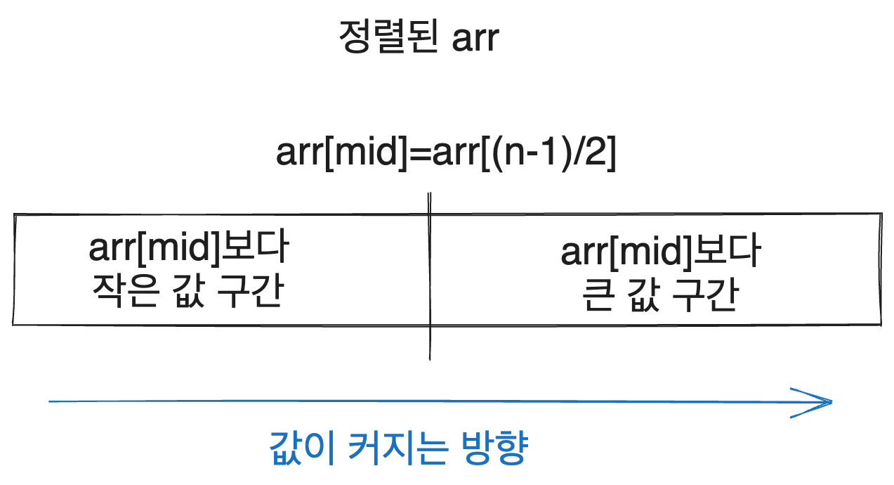

This is a post by [city](https://solved.ac/profile/city). I have been working with algorithms for quite some time, and someone asked me how to understand the principles of binary search and its approach to application problems, so I decided to write this article.

Many basic parts are omitted. Therefore, I recommend checking out good reference materials such as [kks227’s blog](https://blog.naver.com/kks227/220777333252).

The drawings used in this article were created by me using [excalidraw](https://excalidraw.com/).

# 1. Basics of Binary Search

Binary search is fundamentally an algorithm for finding a specific element among sorted elements.

## 1.1. Code

To find a `target` value in a sorted array `arr`, the code can be written as follows, based on C++. Of course, the logic remains the same in other languages.

```cpp
while(low <= high) {
  int mid = (low + high) / 2;
  if(arr[mid] == target) {
    return mid;
  } else if(arr[mid] > target) {
    high = mid - 1;
  } else {
    low = mid + 1;
  }
}
```

## 1.2. Principle

The core idea is that we reduce the search interval by half, where the target value may exist.

Consider when we begin the search. If the size of `arr` is n, the potential interval for the target value is from `arr[0]` to `arr[n-1]`. According to the above algorithm, we will compare `arr[(n - 1) / 2]` with `target`.

Since the array is sorted, all values in the array can be divided into two intervals through comparison with `arr[mid]`.

(You might wonder to which interval the `mid` index belongs. It can be skipped for now, but in the closed interval implementation like above, it does not belong to either, whereas in the later open interval implementation `[s,e)`, it will belong to the right part.)



Thus, by comparing whether `target` is less than or greater than `arr[mid]`, we can halve the interval where `target` could exist. If `target` is less than `arr[mid]`, it must exist in an index lower than `mid`, and if greater, it must exist in an index higher than `mid`.

If `target == arr[mid]`, we have found the target and can return `mid` immediately.

In a sorted array, we can search for the target by continually halving the interval where the target may exist. Hence, the key idea of binary search is that we can find a value in the array with a time complexity of `O(logN)`.

In summary, we will be exploring situations like the following.


How do we specifically narrow down the search interval? The above binary search code narrows the search interval by adjusting `low` or `high` based on the two cases explained.

If `target` is less than `arr[mid]`, we need to search the left interval of `arr[mid]`, thus reducing the upper bound `high`. Conversely, if `target` is greater than `arr[mid]`, we explore the right interval of `arr[mid]` by increasing the lower bound `low`.

By repeating this process, we will eventually find `target` or determine that it does not exist in the search interval.

# 2. Extension of the Principle

## 2.1. Idea of Parametric Search

However, simply finding one element quickly in an array is a very limited case. In real life or problem-solving, such simple cases are rare.

To expand this idea, it is important to focus on the fact that we leveraged the sorted property of the array to establish that 'on one side of the `mid` index is the `target`, and on the other side, it is not,' which allowed us to halve the search space.

Conversely, if there is some task where we can halve the search interval based on a criterion, binary search might be applicable. This introduces the idea of parametric search.

For example, consider we are not searching for the `target` value itself in the array indices from 0 to n-1, but rather the index of the first element that is greater than `target`. This problem covers a broader range than simply searching for an element.

We can think of `arr` as being divided into two parts.


Then, by determining only whether a certain value in `arr` is less than or greater than `target`, we can know whether that value is to the left or right of the index of the first element greater than `target`.

Utilizing this, we can halve the search interval and thereby apply the binary search idea to solve the problem.

```
This method of solving problems is known as parametric search. It can be elegantly stated as transforming optimization problems into decision problems, but I do not consider this phrasing as significant as the principle itself.
```

## 2.2. Parametric Search

Let's generalize this a bit. We consider an interval `[low, high]`, and suppose we have a decision problem for specific natural numbers `x` ($low \leq x \leq high$), where it returns true for natural numbers less than or equal to `x`, and false for those greater than `x`. We want to find this `x`.


We can determine if the value we are looking for is smaller or larger than `mid` based on whether `check(mid)` is true.

If `check(mid)` is false, we may find ourselves in the situation depicted below.


From the figure, we can ascertain that `x` is to the left of `mid`. Conversely, if `check(mid)` is true, `x` will be to the right of `mid`. We will utilize this to update the search interval. We will discuss this further in the next section.

## 2.3. Detailed Look with Code

Looking at it with code, we can approximate the condition of finding the boundary line. Assuming `low` as the lower bound and `high` as the upper bound, the code for finding the upper boundary where `check(i) == true` would look something like this.

```cpp
while(low <= high) {
  int mid = (low + high) / 2;
  // A is possible at mid
  if(check(mid)) {
    low = mid + 1;
  } else {
    high = mid - 1;
  }
}
return high;
```

If A is possible at `mid`, meaning `check(mid)` is true, `x` will be to the right of `mid`. We would be in a situation like this.


Thus, we update `low` to `mid + 1` to enable searching the right interval. Consequently, the next search interval will be halved.

On the other hand, if `check(mid)` is false, `x` must be to the left of `mid`. This can only be the case in the situation depicted below.


Hence, we will update `high` to `mid - 1` for searching the left interval.

By repeating this process, we will be able to find `x`!

# 3. Understanding More Deeply

There are many materials on binary search, so this level of understanding is reasonable for many people. However, the most confusing aspects often arise from issues like these, which can cause a difference of one in the answer referred to as `off by one`.

```
while(low <= high) vs while(low < high)
Output low vs Output high
(While some people use different variable names like lower and upper, l and r, s and e, etc., I will refer to them as low and high since they convey the same meaning.)
```

Like many others, it took me more than a year to deeply understand these distinctions after first learning binary search a few months into starting algorithms.

Now, I will explain how I address these points using my approach. In the next article, I will introduce alternative methods.

## 3.1. Understanding Implementation

Although it varies slightly by problem conditions, my common code for finding either the maximum or minimum of the interval where `check` is true is as above.

```cpp
while(low <= high) {
  int mid = (low + high) / 2;
  if(check(mid)) {
    low = mid + 1;
  } else {
    high = mid - 1;
  }
}
```

When will this `while` loop terminate? The loop executes while `low <= high`, so when it terminates, it means that `low > high`.

Since the length of the search interval continues to shrink, it will eventually reach a point where the difference between `low` and `high` becomes 1.

The next illustration shows the situation where `low == high + 1`, indicating the loop has ended.


Therefore, at the termination point of the search, `high` will represent the upper bound of the interval where `check(i) == true`, and `low` will represent the lower bound.

## 3.2. Thinking in Terms of Problems

Let’s examine a well-known parametric search problem: [Problem 1654 – Cutting the Cable](https://www.acmicpc.net/problem/1654).

If the length is less than or equal to a specific boundary number, it meets the problem conditions, while if it is greater, it does not. The task requires cutting K cables into the same length to produce N cables and finding the maximum cable length that can achieve this.

If it is `possible` to create N cables from K cables of length X, then it is obviously also possible to do so from any length shorter than X; conversely, if it is not possible to cut them into Y length cables, it will also not be possible for any length greater than Y.

Suppose there exists some length L such that we can create N cables of length L to meet the problem requirements. It is intuitively evident that we can also create N cables of any length shorter than L. This premise reflects the condition of the problem, making it valid.

Thus, the problem demonstrates a scenario where lengths less than or equal to a certain boundary are possible, while lengths exceeding that boundary are not, and we are tasked with finding the maximum value in that permissible interval.

In this case, it suffices to output “high,” the upper value of the possible interval (the problem even kindly states, "Find the maximum value").


If we isolate the portion pertaining to binary search from the cable cutting problem excluding the input, it would look like this: just output `high`.

```cpp
while(low <= high) {
    ll mid = (low + high) / 2;
    if(check(mid)) {
        low = mid + 1;
    } else {
        high = mid - 1;
    }
}
cout << high << "\n";
```

Conversely, in a problem like [Problem 1072 – Game](https://www.acmicpc.net/problem/1072), which asks, "How many more games must be played until Z changes?" we need to find the minimum value of the possible interval, hence `low` should be printed.

## 3.3. Additional Notes

The idea of narrowing down intervals opens the door to many possibilities. It can be applied by utilizing the odd/even characteristics of interval sums for binary search, or by employing ternary search for finding extrema, or even applying binary search for real numbers while treating them as sorted.

Moreover, while assessing the feasibility of certain conditions, I merely referred to them as a `check` function. However, developing a suitable condition for these checks can be an immensely challenging point in problem-solving. It’s not always easy to immediately think of binary search when looking at problems like [Problem 1637 – Sharp Eyes](https://www.acmicpc.net/problem/1637), and formulating the criteria for such checks can also prove difficult. I will aim to discuss these aspects in future opportunities.

## 3.4. A Different Variation of Implementation

While I will address other implementations in detail in the next article, I would like to present a simple variation here.

This approach does not change the method of assessing intervals but instead updates potential answer values throughout the process as follows.

```cpp
ll ans = min_value;
while(low <= high) {
    ll mid = (low + high) / 2;
    if(check(mid)) {
        low = mid + 1;
        ans = max(ans, mid);
    } else {
        high = mid - 1;
    }
}
cout << ans << "\n";
```

Thus, `ans` will invariably hold the maximum of the possible interval. During the binary search, the upper boundary value must appear at least once in `ans`, as it reflects the maximum among the values added.

If the conditions are reversed, adapt to `ans = min(ans, mid)` and modify the position accordingly. With thoughtful consideration of the principle, this can be done easily. I have seen a few people adopting this method, and I believe it can aid in comprehending the principle behind narrowing intervals.

# 4. Conclusion

The key to applying binary search in problem-solving lies in recognizing that 'on one side of the interval something exists, while on the other side it does not. Therefore, knowing the feasibility of a value determines which interval we search.' 

As we narrow down the search interval, we eventually seek a boundary line. Examining when the while loop terminates helps us understand which value between high and low is necessary. This holds true whether implementing closed or open intervals.

While approaching binary search, consider what possibilities we are evaluating, and under what conditions the while loop will conclude.

Conversely, whenever a value serves as a boundary indicating a shift in feasibility (for instance, it can be met with values less than or equal to x, but not with values greater than x), consider applying binary search!


# References

https://codeforces.com/blog/entry/96699