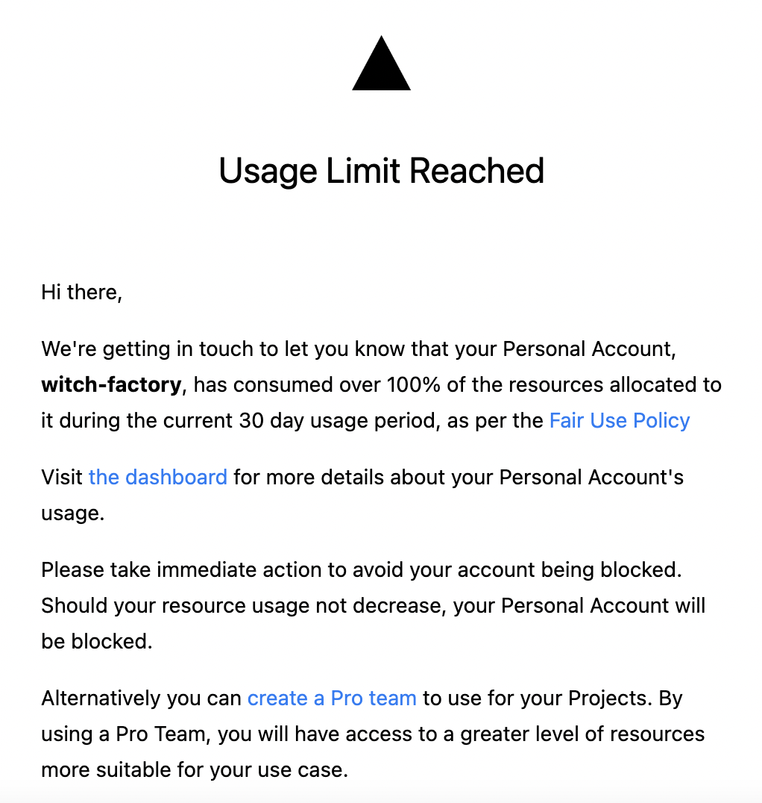

# 1. Exceeding Bandwidth Limit

Currently, this blog is deployed as a static site via Vercel. However, I have recently received emails indicating that my blog is consuming too many resources.

I was surprised to find out that my blog was using so many resources, so I logged into the dashboard.

Upon checking the bandwidth for my blog project, I found that approximately 109GB of data was exchanged.

Bandwidth refers to the amount of data transferred to and from the site I have deployed. [Source](https://vercel.com/docs/concepts/limits/usage#bandwidth) The majority of my blog's bandwidth was outgoing, which indicates the amount of data sent from my site to users. About 3GB of data was delivered to users daily.

Additionally, the site was receiving about 13,000 to 15,000 requests per day. While I am committed to my blog, this level of requests seemed excessive, indicating a potential issue.

However, as I couldn't view the logs or perform any actions, I decided to reduce bandwidth usage first and then integrate Google Analytics for further analysis.

Let's try to reduce the bandwidth by referring to [this article](https://medium.com/@capJavert/save-bandwidth-on-vercel-with-cloudflare-462bec444865).

# 2. The Problem

From the request data above, an astonishing 95.6% were cached requests, while 4.4% were uncached requests.

This cache is managed by the [Vercel Edge Network](https://vercel.com/docs/concepts/edge-network/overview#caching), which acts as an intermediary between my deployed site and the internet. It operates similarly to a CDN.

The Edge Network serves a caching function; if the requested data is stored on the Edge, it is delivered immediately. If not, a request is sent to my site, and the retrieved data is stored on the Edge.

In any case, 95.6% of the requests to my blog are stored on the Vercel Edge Network, but the issue is that Vercel includes both cached and uncached requests in the bandwidth calculation.

# 3. Using Cloudflare as a Proxy

However, Cloudflare offers a more generous free tier. There is effectively no bandwidth limit, and they will only contact you if traffic escalates to problematic levels. [They state that even using around 20TB won’t get you contacted.](https://community.cloudflare.com/t/cdn-bandwidth-limits/300965/3)

Therefore, I decided to use Cloudflare as a proxy for my Vercel deployment. The [tutorial page](https://developers.cloudflare.com/fundamentals/get-started/setup/) provides detailed instructions.

## 3.1. Sign Up

Let's sign up on the [Sign-Up Page](https://dash.cloudflare.com/sign-up).

## 3.2. Adding a Site

I own the domain witch.work. First, I changed the nameservers for this domain to Cloudflare. I followed the instructions [here](https://developers.cloudflare.com/fundamentals/get-started/setup/add-site/).

First, I added the site in the dashboard.

I clicked "Add site" and entered the root domain of my page (in my case, witch.work). Then, I was prompted to choose a plan, and since I don't have any money, I selected Free.

Cloudflare automatically checked the DNS records for my domain. Once the root domain and subdomains appeared, I continued. There are occasions when manual addition of DNS records is necessary, but it worked out for me.

## 3.3. Changing Nameservers

Since I purchased the domain through GoDaddy, I changed the nameservers there.

In GoDaddy, I navigated to DNS and scrolled down to change the nameservers. I input the nameservers provided by Cloudflare and saved the changes.

It took a little while, but about 15 minutes later, I received an email confirming my site was successfully added to the Cloudflare Free plan.

Next, I followed the instructions [here](https://vercel.com/guides/using-cloudflare-with-vercel#with-proxy), entered the Cloudflare dashboard, accessed the SSL/TLS settings, and changed the SSL/TLS encryption to full in the overview section.

The article I referenced also included cache settings; however, that cache feature has now transitioned to a paid service on Cloudflare. Thus, I only configured the proxy. I will monitor whether this helps in reducing bandwidth.

# References

https://vercel.com/guides/lower-usage#bandwidth-usage

https://vercel.com/guides/using-cloudflare-with-vercel#with-proxy

https://medium.com/@capJavert/save-bandwidth-on-vercel-with-cloudflare-462bec444865