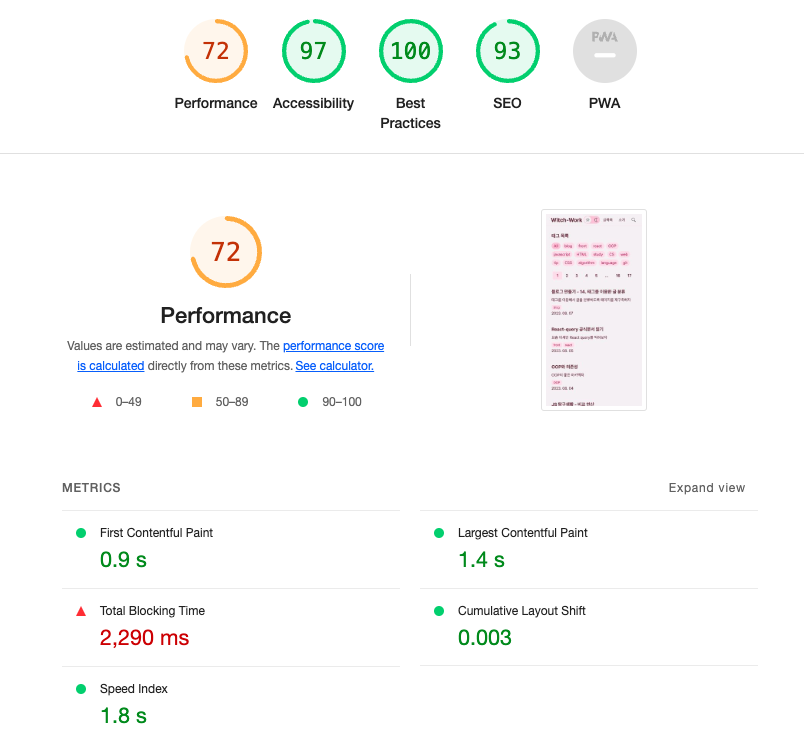

# Blog Creation Series

|Title|Link|
|---|---|
|1. Basic Settings|[https://witch.work/posts/blog-remake-1](https://witch.work/posts/blog-remake-1)|
|2. HTML Design of Main Page|[https://witch.work/posts/blog-remake-2](https://witch.work/posts/blog-remake-2)|
|3. Structural Design of Post Detail Page|[https://witch.work/posts/blog-remake-3](https://witch.work/posts/blog-remake-3)|
|4. Enabling Relative Paths for Images|[https://witch.work/posts/blog-remake-4](https://witch.work/posts/blog-remake-4)|
|5. Minor Page Composition Improvements and Deployment|[https://witch.work/posts/blog-remake-5](https://witch.work/posts/blog-remake-5)|
|6. Layout Design of Page Elements|[https://witch.work/posts/blog-remake-6](https://witch.work/posts/blog-remake-6)|
|7. Component Design of Main Page|[https://witch.work/posts/blog-remake-7](https://witch.work/posts/blog-remake-7)|
|8. Design of Post List/Content Page Components|[https://witch.work/posts/blog-remake-8](https://witch.work/posts/blog-remake-8)|
|9. Automatic Thumbnail Generation for Posts|[https://witch.work/posts/blog-remake-9](https://witch.work/posts/blog-remake-9)|
|10. Design Improvements for Fonts, Cards, etc.|[https://witch.work/posts/blog-remake-10](https://witch.work/posts/blog-remake-10)|
|11. Adding View Count to Posts|[https://witch.work/posts/blog-remake-11](https://witch.work/posts/blog-remake-11)|
|12. Page Theme and Post Search Functionality|[https://witch.work/posts/blog-remake-12](https://witch.work/posts/blog-remake-12)|
|13. Improvements to Theme Icons and Thumbnail Layouts|[https://witch.work/posts/blog-remake-13](https://witch.work/posts/blog-remake-13)|
|14. Changing Post Classification to Tag-Based|[https://witch.work/posts/blog-remake-14](https://witch.work/posts/blog-remake-14)|
|Optimization of Main Page Operations|[https://witch.work/posts/blog-opt-1](https://witch.work/posts/blog-opt-1)|
|Creating Pagination for Post List|[https://witch.work/posts/blog-opt-2](https://witch.work/posts/blog-opt-2)|
|Uploading Images to CDN and Creating Placeholders|[https://witch.work/posts/blog-opt-3](https://witch.work/posts/blog-opt-3)|
|Implementing Infinite Scroll on Search Page|[https://witch.work/posts/blog-opt-4](https://witch.work/posts/blog-opt-4)|

# 1. Problem Occurrence

While checking the blog, I noticed something unusual about the view count. It seemed that the view counts stored in the database were grouped. Upon checking the table in Supabase, I found that all view counts were being received as `undefined`.

Additionally, there were errors when uploading thumbnails to the CDN. However, since the free plan for Cloudinary, which is currently being used as the CDN, is quite strict about uploads, fixing this issue repeatedly was not easy. Therefore, I decided to temporarily save all thumbnails locally and proceed with other tasks. I will also address this issue in this article.

# 2. View Count Counter Error

Upon checking, there was no issue with the `ViewCounter`. The view count is used in the post detail page, where the slug is created and passed as a prop to the `ViewCounter` component, which then generates a database key based on the received slug.

The problem originated from the code that created the slug as follows:

```tsx
const slug=post._raw.flattenedPath.split('/')[1];
```

This was a remnant from when `post._raw.flattenedPath` had the format `[category]/[slug]`. Currently, the `flattenedPath` of post points only to the slug. Therefore, this needs to be corrected to:

```tsx
const slug=post._raw.flattenedPath;
```

# 3. Thumbnail Upload Error

Strangely, the upload to Cloudinary worked fine when I executed `yarn run build` on Vercel, but it did not work properly on my local machine. A typical error message was as follows:

```bash
"binary-search/index.md": UnexpectedMarkdownError: Must supply api_key
```

I printed the environment variables, and indeed, the environment variables were not being recognized properly on the local setup, despite being correctly entered in `.env.local`.

This was resolved later during the process of deploying the blog on a home server. [Refer to the article on deploying to a home server.](https://witch.work/posts/blog-home-server-3)

# 4. Optimization

Now, I noticed that the blog had significantly slowed down. Lighthouse scoring revealed a drop into the 70s.



At one point, the score had been in the high 90s... Although Lighthouse scores are not everything, the loading experience had tangibly worsened.

The images may be a problem, but even in the case of the post list page on mobile, where no images are present, it was still slow. While other aspects were still relatively okay, the Total Blocking Time, the time it took for users to see content, had increased too much. Let's analyze the root cause.

Since I couldn't examine the entire build process, I had to conduct painful optimization experiments one by one. If someone knows a better method, please let me know.

## 4.1. Cause Analysis

Vercel preserves all the sites I have previously deployed. I'm not sure if this information is retained permanently, but it's been a short time since the blog's performance began to decline, which sufficiently aids tracking. Somewhere among these numerous logs lies the change that caused the performance degradation.


Days ago, prior to restructuring the blog pages based on tags, I took a reading of the main page's Lighthouse score, which came in at 100. The recent page, of course, scored lower.

Now I am going to [binary search the logs to identify where performance began to decline.](https://witch.work/posts/binary-search) Although I feel ashamed of this algorithm, it can be quite helpful. Let's find out from which point the total blocking time started to increase.

Upon tracking, it seemed that the addition of the `tagFilter` component had caused the issue. But what precisely was the problem? Initially, I suspected that the process of creating the `tagList` array used by this component was the cause of the performance decline, thinking that the array was being recreated every time, thus slowing down the post list scanning.

```ts
// Suspected problematic code
export const tagList: string[]=['All', ...getAllPostTags(),];
```

However, I couldn't immediately think of how to fix this performance degradation. Eventually, I learned that this was indeed the issue, and I'll describe how I addressed it in the subsequent section.

So, was the `tagFilter` indeed the culprit? Since this is my site, I can freely try things out, such as completely removing the component to see if the performance changes. Let’s take out `tagFilter` from all pages and recheck the Lighthouse score.


`TagFilter`, you are guilty! But this component, despite being labeled as a tag filter, merely compiles links to category pages based on each tag. Since its internal elements can be generated perfectly at build time, the presence of the `tagFilter` component itself should not degrade performance.

## 4.2. Analysis with Developer Tools

So what could truly be the problem? Debugging isn't just about adding and removing components, so let’s try various approaches. First, I reinstated the tag filter on the site and measured Lighthouse again.

Upon entering the Lighthouse score tab, it kindly provided diagnostics.


One of the insights was to "Reduce initial server response time," something that had occasionally shown extended duration even when Lighthouse scores were high. Moreover, the server was running on Vercel, wasn't it? Unless I set up my home server, there was no way to improve this speed. Additionally, it had nothing to do with the tag filter.

Moreover, the code mentioned under "Reduce unused JavaScript" came from Google Tag Manager. Therefore, there was nothing concerning in this opportunities section.

Lighthouse diagnostic results indicated recommendations to "Minimize main-thread work" and "Reduce JavaScript execution time." Analyzing main-thread work showed that script analysis, parsing, and compilation consumed most of the time. Thus, the JavaScript execution time was the core issue.

Upon examining the running chunk files, I discovered that somehow, the content that should be in `allDocument` was included in the JS file of the page with the `TagFilter` component. After spending time analyzing the code structure, I realized some parts of the code were not being utilized effectively.

Since I cannot realistically understand Next.js' entire build logic, I experimented with each piece of code related to `tagFilter` to see how it affected performance, running builds iteratively with Next.js.

## 4.3. Various Attempts

I suspected that the links provided by [next/link prefetch the link URLs](https://stackoverflow.com/questions/74293043/how-can-i-stop-next-js-from-loading-other-chunks-from-another-page), but it was not the case. Even removing the Link component completely still impacted performance due to the presence of the TagFilter component.

I also considered the `getAllPostTags` function that extracts tags from all posts, but that function was already well-utilized elsewhere and did not cause performance degradation. Attempting to build the tag list statically instead also produced no difference.

[What if I put the tagList array in a new file? Exported variables behave like references, which means they will not be recreated every time upon import.](https://yceffort.kr/2021/07/deep-dive-to-export)

```ts
// Create something like src/utils/postTagArray.ts
export const tagList: string[]=['All', ...getAllPostTags(),];
```

However, that didn't help either. After further contemplation, I came up with a new approach.

## 4.4. Solution

How about this? [ESM statically constructs a module graph at build time.](https://witch.work/posts/import-and-require) Thus, when using `tagList` as shown above, the existence of `getAllPostTags()` is also made known through the module graph. The `getAllPostTags()` function utilizes the `getSortedPosts()` function for retrieving all posts.

```ts
// src/utils/postTags.ts - principle remains the same, slightly modified
export const getAllPostTags = (): string[] => {
  const allTags=new Set<string>(getSortedPosts().map((post: DocumentTypes)=>post.tags).flat());
  return Array.from(allTags);
};
```

This way, if the Next.js bundler aims to resolve everything statically, it can bundle all the results for the functions in this call chain instead of calling them repeatedly.

To validate this somewhat, I created a new file where I inserted the tags directly without using `getAllPostTags`, confirming that no performance degradation occurred.

What should be done now? Having confirmed that the tag filter is innocent, I will restore it to its previous state. [The original code from the prior article on creating the tag filter can be referenced.](https://witch.work/posts/blog-remake-14#5.2.-%ED%83%9C%EA%B7%B8%EB%A5%BC-%ED%86%B5%ED%95%9C-%ED%95%84%ED%84%B0%EB%A7%81) (Of course, I could pull it from GitHub, but that seems tedious...)

Instead of placing the tag list separately, I will statically generate it directly within `getStaticProps`.

```tsx
export const getStaticProps: GetStaticProps = async () => {
  /* Code omitted for brevity. Code to fetch posts suitable for the page */

  const allTags=['All', ...getAllPostTags()];

  return {
    props: {
      allTags,
      pagePosts:pagePostsWithThumbnail,
      totalPostNumber,
      currentPage:FIRST_PAGE,
    },
    revalidate: 60 * 60 * 24, // <--- ISR cache: once a day
  };
};
```

In this case, the previously created `makeTagURL` function should remain in `postTags.ts`, since using it as a prop in the `TagFilter` component would cause the `getAllPostTags` in `postTags.ts` to be bundled with the result of `getSortedPosts`. Thus, it will be separated into a different file, `src/utils/makeTagURL.ts`.

```ts
// src/utils/makeTagURL.ts
export const makeTagURL = (tag: string): string=>{
  if (tag==='All') {
    return '/posts/all';
  }
  else {
    return `/posts/tag/${tag}`;
  }
};
```

It's quite the manual optimization of code splitting... There must be a better approach, but this is where I currently stand.

In any case, I will apply the newly created tag filter to each page.

```tsx
<TagFilter
  tags={allTags}
  selectedTag={'All'}
  makeTagURL={makeTagURL}
/>
```

Upon deployment, after applying this method, I could see the site had returned to its previous speed levels as measured by Lighthouse.


# 5. Minor Image Optimization

There are still more optimizations possible. When entering the page via an incognito window without image caching, performing a Lighthouse test reveals a higher metric for Cumulative Layout Shift, which measures how much the layout experienced by the user changes. A high score indicates user discomfort and degrades browser performance.

This particular facet is critical for new visitors to my blog. While it may not feel slow since it's being fetched from the CDN, a fast site is always preferable.


To address this, I believe offering blur images is the most effective solution. Although using width and height props from `next/image` to specify image sizes in advance is also possible, the design of the current page requires a showing of the project's aspect ratio, making it more user-friendly and visually appealing to display a blur image.

Thus, using the previously created `getBase64ImageUrl` function, I simply generated the blur URL for the project images as follows:

```tsx
for (const project of projectList) {
  console.log(project);
  if (project.image.blurURL) {continue;}
  project.image.blurURL=await getBase64ImageUrl(project.image.cloudinary);
}
```

To send the blur URL along with the image, I modified the type that the `projectImage` component receives.

```tsx
// src/components/projectCard/image/index.tsx
interface ImageSrc{
  local: string;
  cloudinary: string;
  blurURL?: string;
}

function ProjectImage({title, image}: {title: string, image: ImageSrc}) {
  return (
    <div className={styles.container}>
      <Image
        className={styles.image}
        src={image[blogConfig.imageStorage]} 
        alt={`${title} project image`}
        width={300}
        height={300}
        sizes='(max-width: 768px) 150px, 300px'
        placeholder={image.blurURL ? 'blur' : 'empty'}
        blurDataURL={image.blurURL}
      />
    </div>
  );
}
```

Making these changes resulted in the Lighthouse score for Cumulative Layout Shift dropping to below 0.1, typically around 0.07 to 0.09. While examining trace details and rendering processes, it appeared that the CDN was so fast that images loaded almost instantaneously after the blur URL was generated, making the impact of the blur URL on layout shift appear minimal.

Nevertheless, small accumulations can lead to significant outcomes, and I believe that optimizations like this will contribute to creating a very fast blog in the future.

# References

next-bundle-analyzer https://velog.io/@leehyunho2001/nextbundle-analyze