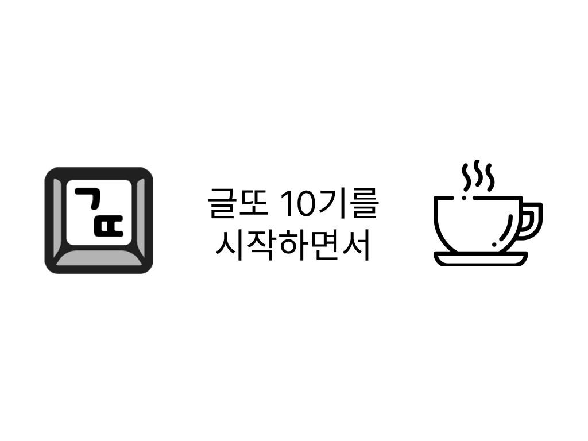

# 시작

나는 2023년 2월 졸업을 했다. 2023년 8월 첫 직장이 생겼고 2024년 9월 퇴사를 했다. 그 중간, 2023년 11월부터 4월까지 글또 9기에 참여했고 이번에 10기를 시작한다.

학교, 회사, 글또, 동호회, 커피챗, 그리고 거기 딸려왔던 사람들과 수많은 고민들. 그 중간중간 내게 그였던 감정과 생각의 선들을 토대로 글또 10기, 약 6개월에 걸친 시간을 어떻게 보낼지에 대해 생각해본다.

# 글또 10기의 시작

작년에 친구의 추천으로 글또 9기에 참여했다. 패스 없이 모든 글을 제출했고 커피챗도 많이 했다. 반상회에서 들은 발표나 다른 분들의 글(아쉽게도 몇 개 못 읽긴 했지만)에서도 도움을 많이 받았다. 개인적으로 느끼게 된 것도 많았다. 당연히 매우 좋은 기억들이다.

글또 9기에서 만났던 분들 중 몇몇을 몇 달 전 다시 한번 커피챗으로 뵈었다. 자연스럽게 "글또 10기 하실 건가요?"라는 질문을 받았다. 그때까지 별 생각이 없었는데도 불구하고 그 질문을 받자 자연스럽게 "당연히 10기도 해야죠~"라는 답이 반사적으로 나왔다. 그만큼 좋은 활동이었고, 좋은 분들이었다.

또 블로그는 어차피 내가 굉장히 공을 들이는 곳 중 하나다. 안 그래도 관리해야 하는 거, 글또로 강제성을 부여하면 더 좋지! 퇴사도 했으니 글을 많이 써내야겠다. 같은 생각도 있었고 말이다.

그렇게 이번 기수를 시작하면서 다짐을 써본다. 지난 기수도 열심히 한다고 했지만 어쩐지 중구난방이었던 느낌이 들어서 이번에는 좀더 생각을 가지고 행동해 보려고 한다. 또 글또의 [어떤 분](https://mildstrong.tistory.com/2)이 말씀하시길, 글또 회고 글 중에 "다짐글을 쓰는 게 글쓰기 활동에 도움이 된다"고 한다!

# 다짐 - 넓이보다는 깊이

이번 글또 기간 동안의 다짐을 한마디로 요약한다면 `넓이보다는 깊이`라고 할 수 있겠다.

## 사람에 대하여

나는 지난 기수에 글또에서 커피챗을 많이 했다. 지금 생각해 보면 회사 그리고 내가 소속되어 있는 집단들이 온전한 소속감을 주지는 못했기에 더 밖으로 돌았던 것 같다. 하지만 발단이야 어쨌건 정말 많은 훌륭한 분들을 만나볼 수 있었다.

각자의 이야기를 들을 수 있었다. 또 내 생각과 그분들의 생각을 충돌시켜 볼 수도 있었다. 좀더 앞선 고민을 하시는 분들 혹은 내가 했던 고민이라도 조금 다른 방식으로 바라보는 분들도 많았다. 누구나가 자신의 세상에서 힘겨운 싸움을 해나가고 있고, 커피챗에서 뵌 분들은 그렇게 자신의 싸움에서 얻은 것들을 내게 기꺼이 나눠주셨다.

다만 그 과정에서 사람을 무작정 많이 보는 걸로 내가 뭔가를 얻기는 힘들겠구나, 하는 생각을 했다. 공식 기록으로는 내가 커피챗을 제일 많이 했기 때문에 "내가 커피챗을 덜 해봐서 그런가?"하는 생각이 들지는 않았다. 나는 사람을 많이 알기보다는 깊이 알고 친밀해지기를 원했던 거였다. 또한 나 자신보다는 상대방에 대해 알고 싶었다는 걸 깨달았다.

물론 이것조차도 많이 만나보지 않았으면 깨닫지 못했을 것이기 때문에 그간 만났던 것들이 헛되게 느껴지지는 않지만 이걸 조금 더 일찍 알았으면, 하는 아쉬움은 남는다.

사람을 많이 만나는 건 좋은 일이다. 하지만 그건 세상 모든 일이 그렇듯이 트레이드오프가 있다.

일단 너무 많은 커피챗을 했던 기간을 떠올려 보면 나 스스로도 솔직히 기계적인 질문답변을 하고 있지 않나 하고 느낄 때도 있었다. 당연하지만 그것도 커피챗을 안 한 것보다는 나았을 거라고 생각한다. 하지만 내가 만난 누구라도, 비슷하게 반복되는 질문답변으로 흘려보내기에는 너무 아까운 분들이었다.

또한 나도 대인관계력(?)의 총량이 정해져 있는 사람이다. 따라서 사람을 많이 만나게 되면 자연스럽게 깊이는 줄어든다. 일회성 만남이 아니기를 늘 바라지만 솔직히 사람이 많아지다 보면 대부분이 그렇게 갈 수밖에 없는 것 같다. 그래서 대부분의 커피챗에서 상대방 그 자체보다는 상대방의 모습에 그리고 생각에 비춘 나 자신을 더 많이 돌아보게 되었다고 생각한다.

이번에도 물론 커피챗을 웬만큼은 하려고 할 것이다. 하지만 좀더 깊이있는 대화를 나누기 위해 노력하려고 한다. 따라서 다음과 같은 행동을 취하고자 한다. 정량적인 목표를 짜기 위해 노력했다.

- 커피챗 하기 전에 상대의 삶의 지도(비공개면 어쩔 수 없다)와 함께 최소한 글 3개 이상 읽기
- 매 커피챗마다 대화를 생각나는 대로 복기/기록하고, 매 커피챗마다 새로운 질문 하나 이상씩 하기
- 단순히 밥을 먹고 커피 한잔도 좋지만 같이 어떤 컨텐츠를 즐기는 걸 3번 이상 하기
- 2번 이상 만나뵌 분을 3명 이상 만들기

## 글에 관하여

가장 먼저 추구해야 할 것은 패스 없이 모든 글 제출하기이다. 이전 기수에 느꼈지만 뭔가 완성되었다고 스스로 느낄 만한 글을 2주에 하나씩 써내는 건 생각보다 쉽지 않은 작업이다. 따라서 이번 시즌에도 최소한 그거라도 달성하면 1차적인 성공이라고 생각하려고 한다.

그리고 언제 다음 직장이 구해질지 모르겠지만 그때까지는 회사에 다닐 때에 비해 상당히 여유 시간이 많은 편이다. 그러니 글쓰기에 좀 더 많은 시간을 할애해 보려고 한다.

글의 주제에 관해서도 깊이를 더하려고 한다. 저번 기수에도 꽤나 딥다이브했다. 어떻게 그렇게 깊이 파고드냐는 얘기를 커피챗에서 들었을 때는 솔직히 자랑스럽기도 했다. 하지만 그간을 돌아보면 딥다이브 그 자체에만 너무 집중하지 않았나 하는 생각을 했다.

나도 안다. 나는 숲 전체를 보는 걸 잘하는 사람이 아니다. 또한 숲의 나무 하나를 미친듯이 뜯어서 해체해 볼 수 있는 건 분명 내가 가진 능력이다. 하지만 깊이있게 파고드는 것도 좋지만 내가 뜯어본 그 지식이 체계 하에서 어떤 줄기를 차지하고 있고 어떤 역할이며 다른 것과 어떤 관계를 맺고 있는지 알고 있는, 좀더 체계 하에서 깊이를 추구하는 시도를 해보려고 한다.

또한 그렇게 글을 쓰다 보면 그 주제들 그리고 거기 관련된 곁가지 글에 대해서 좋은 글들이 북마크에 엄청나게 쌓이게 된다. 이것들이 늘 밀려 있는데 그걸 읽고 정리해 나가려고 한다. 이를 위해 글또에 내가 "글읽었또" 채널도 만들었다.

여기서 나온 목표는 다음과 같다.

- 패스 쓰지 않고 글 전부 제출하기
- 어떤 개념에 대해 단순한 지식적 딥다이브가 아니라 맥락과 체계를 갖춘, 숲을 본다고 여겨지는 글 3개 이상 쓰기(같은 주제에서 뻗어나온 건 1개로 친다).
  - 지금 생각하는 건 클로저, 그리고 JS의 비동기 처리, 리액트의 내부구조 관련된 글을 쓰면 좋을 것 같다. 네트워크의 계층들 관련 글도 좋을 듯 한데 글로 써낼 수 있을지는 모르겠다. JWT 시리즈도 완성하면 좋겠다.
  - 보관함에 남아 있는 쓰다 만 글 주제들 3개 이상 빼서 완성하기
- 내가 만든 "글읽었또" 채널에 주 3회 이상 글 읽고 공유하기

## 블로그에 관하여

블로그도 좀 고치려고 한다. 기본 기능을 바꾸려는 것은 아니고, 다음과 같은 기능 추가를 생각하고 있다. 확실히 영어 컨텐츠를 갖추는 게 좋을 것 같아서.

- 다국어 지원(메타데이터뿐 아니라 한글/영어 둘 다 볼 수 있는 UI를 지원)
- 글 자동 번역을 플러그인 혹은 CI/CD에서 처리할 수 있도록 하기
  - 내가 번역한 글은 그걸 보여주고, 아닌 글은 자동으로 ChatGPT등의 번역 결과물을 보여주도록 할 것으로 예상
- 블로그 도메인에 포트폴리오 추가하기

# 생각

많은 사람이 그렇듯이 나도 커리어 그리고 삶에서 무엇을 추구할지에 대한 고민을 많이 한다. 게다가 나는 소속된 회사라는 게 없는 입장이니 더욱 더 이런저런 생각이 든다. 나는 뭘 하고 싶을까? 어떤 회사에 가야 할까? 내가 무엇을 해야 할지 생각하는 건 언제나 한 치 앞도 알 수 없는 안개 속을 촛불보다 희미한 빛을 들고 헤치는 기분이다.

복잡하고 비대해진 코드는 분류하고 쪼개서 생각해야 한다. 이렇게 생각이 많아지는 상황에서도 작은 영역의 다짐들을 세우고 기록하고 지켜 나가는 게 의미있을 거라고 믿는다.

저번 글또 기간 동안을 생각해 보면 그땐 "나"라는 존재가 퍼진 넓이를 넓히는 데에 집중하려고 했다. 그걸 명시적으로 목표로 삼았던 건 아니지만 돌아보니 그랬다. 글에서 딥다이브하는 데에 공을 들여서 "아무도 제대로 정리하지 않은 어떤 걸 내가 이렇게 했다!"는 느낌의 글을 쓰려고 했다. 어그로를 끌려고 이것저것 해보기도 했고, 여러 사람을 바쁘게 만나고 다녔다. 글또 활동 이외에도 발표를 했고 번역을 했고 개발 기록도 꾸준히 남기려고 했다.

하지만 그렇게 넓이에 집중하는 것으로 내가 원하는 무언가를 얻기는 힘들다는 생각이 들었다. 또한 안 맞는 옷을 억지로 입고 있다는 생각도 가끔은 지울 수 없었다. 그러니 이번 10기의 시간 동안은 좀더 느긋하게 마음을 먹고, 바쁘게 몇 걸음 더 나아가려고 노력하기보다는 한 걸음씩 깊이있는 발자국을 남기고 싶다.

## 여유를 가져야 한다

회사에 다녔던 지난 3월쯤 어느 봄날 스크럼 때, 한 팀원이 "오늘 꽃이 정말 예쁘게 폈다"고 했다. 나는 못 본 것 같아서 어디에 꽃이 폈냐고 묻자 나도 거의 매일 지나다니는 길이었다. 나중에 그곳에 가보니 정말 꽃이 펴 있었다. 나도 몇 번은 그 꽃 앞을 지났을 텐데 나는 한번도 위를 올려다보지 않은 것이다.

작은 데에서 행복을 찾는 게 중요하다고 다들 말한다. 무슨 꽃 하나 보고 말고가 엄청나게 중요한 건 아니다. 하지만 같은 삶을 살더라도 그렇게 좀더 많은 걸 눈에 담을 수 있고 위 한번 올려다볼 수 있고 같은 걸 보더라도 좀더 다양한 면을 보고 느끼려고 하는 데에서 작은 행복이라는 게 시작하는 거 아닐까 생각한다.

뭔가 잘하고, 성공적이고 유명하고 인정받는 사람이 되고 싶다는 생각으로 그런 걸 놓치면서 빨리 가는 데 집중했던 것 같다. 안타깝지만 나는 누구보다 빨리 달려나갈 수 있는 그런 타고난 스프린터는 아니었다. 어쩌면 토끼가 쉴 동안 꾸준히 죽어라고 달려서 앞지르는 거북이같은 재능도 없을지도 모른다. 하지만 그러면 어떤가? 빠르게 달려나가는 것만이 내가 하고 싶은 건 아니다.

왜 잘하고 성공하고 싶은가? 인정받고 싶어서. 그럼 모두가 날 인정해야 하는가? 아니지, 내가 소중하게 생각하는 사람들만 옆에 있으면 된다. 그럼 왜 그렇게 빨리 달려나가려는가? 마음을 느긋하게 먹고 내가 할 수 있는 걸 하고, 내 주변에 좀더 깊은 발자국들을 남기려고 노력해야 할 것이다.

- 마음의 여유 가지기. 도저히 정량적인 목표로 어떻게 해야 할지 알 수 없다.
  - "이것도 해야 하고 저것도 해야 하고..." 같은 생각이 들 때마다 의식적으로라도, 그런 목표 따위보다 내가 사는 지금 순간순간이 훨씬 중요하다는 것을 자각하자
