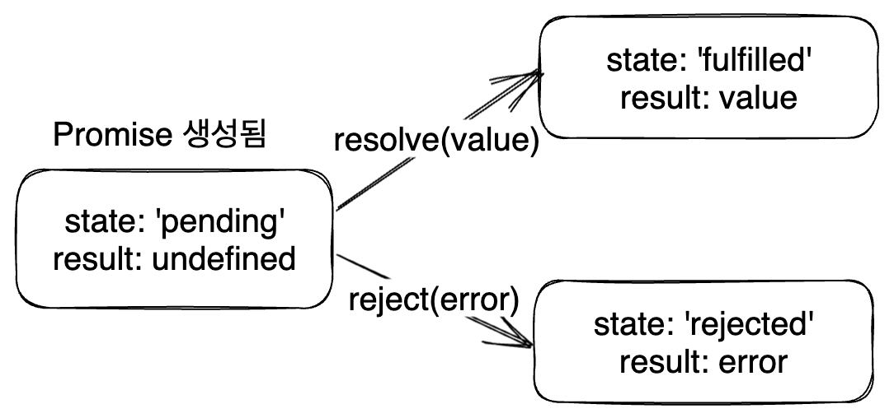

# 0. 시작

Javascript는 싱글스레드 언어이다. 그 말은 작업을 처리할 수 있는 콜스택이 하나뿐이라는 말과 같다.

이는 언어 설계에서부터 의도된 것이다. 먼저 초기에 JS는 웹브라우저에서 동적인 부분을 처리하기 위한 목적으로만 만들어진 작은 언어였기에 싱글스레드로도 충분할 때가 많았고 비동기를 진지하게 지원하려고 하지도 않았다.

또한 이런 구현의 장점도 있었다. JS는 싱글스레드 언어가 됨으로써 언어 설계자에게도 사용자에게도 간단한 구현을 할 수 있게 해주었다. 멀티스레드 환경에서 고려해야 하는 데드락이나 경합 상태와 같은 수많은 동시성 관련 이슈들을 고려하지 않아도 되었기 때문이다.

하지만 JS로 하는 일은 점점 많아졌고 `fetch`로 HTTP 요청을 만들어 서버와 통신하거나 일정 시간 이후에 특정 작업이 실행되도록 예약하는 등 꽤 많은 작업이 비동기를 요구하게 되었다. 성능 관련 이슈도 있고 말이다.

그래서 JS는 비동기를 지원하기 위해 여러가지 방법을 제공하고 내부적으로는 이벤트 루프를 통해 비동기 작업을 처리하도록 했다. 

gc와 같은 부분들도 싱글스레드 작업에 방해되지 않도록 여러 처리를 했다. 이런 부분들을 차근차근 알아보자.

# 1. 비동기 작업의 필요성

다음과 같은 HTML을 짜보자.

```html
<!DOCTYPE html>
<html lang="en-us">
  <head>
    <meta charset="utf-8">
    <meta http-equiv="X-UA-Compatible" content="IE=edge,chrome=1">
    <meta name="viewport" content="width=device-width">
    <title>오~~래 걸리는 작업</title>
  </head>
  <body>
    <label>
      <span>소수의 개수</span>
      <input type="text" value="1000000">
    </label>
    <button id="generate">소수 생성 시작</button>
    <button id="reload">재시작</button>
    <div id="result"></div>
    <textarea>소수 생성 동안 이곳은 사용 불가능해진다.</textarea>

    <script>
      function generatePrimes(q){
        function isPrime(n){
          for(let c=2;c*c<=n;c++){
            if(n%c===0){
              return false
            }
          }
          return true;
        }

        const primes=[];
        const mx=1000000;

        while(primes.length<q){
          const n=Math.floor(Math.random()*(mx+1));
          if(isPrime(n)){
            primes.push(n);
          }
        }
        return primes;
      }

      document.getElementById('generate').addEventListener('click',function(){
        const q=document.querySelector('input').value;
        const primes=generatePrimes(q);
        const result=document.getElementById('result');
        document.getElementById('result').textContent=`소수 ${q}개 생성 완료`;
      })

      document.getElementById('reload').addEventListener('click',function(){
        location.reload();
      })
    </script>
  </body>
</html>
```

이를 브라우저에서 켜보면 다음과 같은 창이 생성된다.


소수 생성 시작 버튼을 누르면 input에 입력된 갯수만큼의 소수를 생성하는 작업이 시작되는데, 이 작업이 끝나기 전까지는 밑의 텍스트 입력 창을 사용하지 못하는 것을 볼 수 있다. 괜히 저런 문구를 `<textarea>`에 써 놓은 게 아니다.

하지만 논리적으로는 소수 생성과 밑의 텍스트 입력창은 별 상관이 없다. 굳이 소수 생성이 끝나야 사용할 수 있게 될 필요가 없다. 이런 것을 해결하기 위해서는 해당 함수가 작업하는 동안 다른 이벤트에 응답이 가능하도록 하는 비동기가 필요하다.

그럼 JS에서는 이런 비동기를 어떻게 처리하고 있을까? 구체적인 동작 방식은 뒤에서 다루겠지만 방법만 보면 JS에서 비동기 작업을 처리하는 방법들은 콜백 함수, Promise, async/await 그리고 최근에 나온 Worker 정도가 있다.

# 2. 콜백 함수를 이용한 비동기 처리

바닐라 JS를 좀 해본 사람이라면 이벤트 핸들러의 비동기 처리 방식을 생각할 수 있다. 콜백을 사용하는 것이다. 비동기 작업을 완료하는 이벤트가 발생시키는 신호를 받았을 때 어떤 콜백을 실행하는 방식이다.

초기의 비동기 API는 이런 방식을 사용하고는 했다. `fetch` API 이전에 HTTP 요청을 보낼 때 쓰이던 `XMLHttpRequest`가 이를 사용하던 대표적인 객체였다. `XMLHttpRequest` 객체의 `loadend`이벤트가 발생하면 특정 콜백을 실행하도록 한 것이다.

```js
const xhr=new XMLHttpRequest();

xhr.addEventListener('loadend',()=>{
  // HTTP 요청이 끝나면 실행되는 콜백 내용
  console.log('loadend');
});
```

하지만 이렇게 콜백을 이용할 경우, 비동기 작업이 순서대로 일어나도록 처리하기 어렵다. 이전에 진행되던 비동기 작업의 맥락을 유지해 줘야 하기 때문이다. 서버에 요청한 데이터가 도착하면 렌더링을 하는 등 비동기 작업의 순서를 강제해 줘야 할 때가 많았기에 이런 상황이 만드는 콜백의 중첩은 개발자들을 매우 힘들게 했다.

이건 [콜스택과 비동기 프로그래밍 글의 관련 부분](https://witch.work/posts/callstack-and-async#2.1.-%EB%B9%84%EB%8F%99%EA%B8%B0-%EC%9E%91%EC%97%85%EC%9D%98-%EB%A7%A5%EB%9D%BD-%EC%9C%A0%EC%A7%80)을 참고할 수 있다. 하지만 이 글을 탐구하지 않더라도 그냥 콜백이 중첩되어서 매우 힘들어진다는 것 정도는 알아두자.

이런 콜백 중첩을 콜백 지옥이라고들 부르는데, [MDN에서 제시하는 간단한 콜백 지옥 예시는 다음과 같다. 실제로 쓰이는 콜백 지옥 코드라면 에러 핸들링 콜백까지 들어가서 더욱 복잡했을 것이다.](https://developer.mozilla.org/ko/docs/Learn/JavaScript/Asynchronous/Introducing)

```js
function doStep1(init, callback) {
  const result = init + 1;
  callback(result);
}

function doStep2(init, callback) {
  const result = init + 2;
  callback(result);
}

function doStep3(init, callback) {
  const result = init + 3;
  callback(result);
}

function doOperation() {
  doStep1(0, (result1) => {
    doStep2(result1, (result2) => {
      doStep3(result2, (result3) => {
        console.log(`result: ${result3}`);
      });
    });
  });
}

doOperation();
```

이를 개선한 게 다음에 볼 Promise이다.

# 3. Promise

## 3.1. 소개

Promise는 새로운 비동기 프로그래밍 방법이다. 비동기 작업 순서를 좀더 편하게 정할 수 있게 해주고 에러 발생시 에러를 깔끔하게 처리할 수 있게 한다. 작업이 완료되거나 실패할 때 콜백이 실행되는 구조이므로 언제 작업이 완료될지를 보장하지는 않는다.

어떤 작업을 비동기로 실행한다면, 그 비동기 작업을 하는 코드가 있고 그 작업이 끝나면 실행되어야 할 코드가 있다. 서버에서 데이터를 받아오는 작업을 하는 코드와 그 데이터로 무언가를 하는 코드를 예시로 들 수 있을 것이다.

Promise는 이 둘을 연결시켜 주는 작업을 한다. 비동기 작업을 실행하고, 실행 완료시 어떤 코드가 실행되도록 신호를 전달하는 것이다. `then`을 이용해서 작업이 완료되었을 때 실행할 콜백을 연쇄적으로 등록할 수 있고, `catch`를 이용해서 에러 발생시 실행할 콜백을 등록할 수 있다.

```js
fetch(url)
  .then((response) => {
    // HTTP 요청이 성공적으로 끝났을 때 실행
    // response는 HTTP 응답 객체
    console.log(response);
    return response.json();
  })
  .catch((error) => {
    // HTTP 요청이 실패했거나 앞의 then에서 에러가 발생했을 때 실행
    console.log(error);
    errorCallback(error);
  });
```

또한 then 내에서 반환된 값은 다음에 오는 then 콜백 함수의 인수로 전달된다. 이를 이용하면 then 체인을 이어서 작성할 수도 있다. 그리고 이 모든 `then`블럭에서 발생하는 에러를 하나의 `catch`로 처리할 수 있다. 다음 코드가 이해를 도울 수 있다.

```js
new Promise((resolve, reject) => {
  resolve(1);
}).then((value) => {
  // resolve의 인수가 value로 들어옴(1)
  console.log(value);
  return value + 1;
}).then((value) => {
  // 앞에서 리턴한 값이 value로 들어옴(2)
  console.log(value);
  return value + 1;
}).then((value) => {
  // 앞에서 리턴한 값이 value로 들어옴(3)
  console.log(value);
  return value + 1;
}).then((value) => {
  // catch로 넘어가기 위해 에러 발생시키기
  throw new Error("일부러 에러 발생");
}).catch((error) => {
  // 에러 메시지 출력(Error: 일부러 에러 발생)
  console.log(error);
});
```

앞의 then에서 리턴한 값이 콜백 함수의 인수로 들어오기 때문에 이를 이용해 어떤 연쇄 작업을 진행할 수도 있다.

Promise 객체는 한번에 성공 혹은 실패 중 하나의 결과만 가지며 이미 성공한 작업이 실패로 돌아가거나 실패한 작업이 다시 성공할 수는 없다. 그리고 여러 번 실행될 수 있는 이벤트 리스너와 달리(`onclick` 이벤트 리스너 콜백은 클릭 이벤트 발생시마다 호출된다) Promise의 then은 딱 한번만 실행된다.

그리고 Promise가 성공하거나 실패한 이후에 성공/실패 콜백을 더해도 맞는 콜백이 실행된다. 이런 특성은 비동기 작업을 다루는 데에 매우 유용했다. 언제 작업이 완료되는지에 신경쓰지 않고 결과가 나왔을 때 반응하는 데에만 관심을 둘 수 있게 해주었기 때문이다.

## 3.2. Promise 객체

Promise는 다음과 같이 만들어진다.

```js
const promise=new Promise((resolve, reject)=>{
  // 비동기 작업
  // 작업이 완료되면 resolve(결과)를 호출
  // 에러 발생시 reject(에러)를 호출
})
```

이때 Promise 생성자에 전달되는 함수는 `executor`라고 한다. 이는 Promise가 만들어질 때 자동으로 실행되며 비동기 작업을 맡는다. 이렇게 executor 함수가 실행되고 아직 완료되지 않은 상태는 성공도 아니고 실패도 아닌 중간 상태이며 `pending`상태라 한다.

executor는 `resolve`, `reject` 2개의 인수를 받는데 이는 JS에서 제공하는 콜백이다. 그리고 executor에서는 인수로 넘겨준 이 콜백 둘 중 하나는 반드시 호출해야 한다.

`resolve`/`reject` 둘 중 하나가 호출되어 Promise executor가 끝난 상태는 결과에 상관없이 통틀어서 `resolved`라 부르며 fulfilled, rejected의 두 가지 경우가 있다.ㄴ

`resolve`는 작업이 성공적으로 끝났을 때 fulfilled로 넘어가기 위해서 호출하는 함수이다. `resolve`에 넘겨주는 인수는 그대로 다음 `then`블록 콜백의 인수가 된다.

다음과 같은 코드를 실행해 보면 Promise 내에서 2초 후에 `resolve`가 호출되고 그 인수가 then 블럭에서 호출되는 것을 볼 수 있다.

```js
const timeoutPromise = new Promise((resolve, reject) => {
  setTimeout(function () {
    resolve("Promise 안의 타임아웃");
  }, 2000);
})

// 2초 후에 "Promise 안의 타임아웃"이 출력된다
timeoutPromise.then(console.log);
```

반대로 `reject`는 작업이 실패했을 때 호출하며 Promise를 rejected 상태로 만든다. 그리고 `reject`의 인수는 `catch`블록 콜백의 인수가 된다.

ㄴ

이렇게 resolve, reject를 활용해서 사용자 정의 Promise를 만들 수도 있다. 

그리고 비동기 코드에서는 기존에 사용하던 try...catch가 작동하지 않으며 Promise의 then, catch를 이용해 에러를 처리해야 한다.

`finally`도 있는데, 이는 Promise가 성공하든 실패하든 실행되는 콜백 함수를 받는다. 이 콜백 함수는 then, catch에 들어가는 함수와 달리 따로 인수를 받지 않는다. Promise가 이행되었는지 거부되었는지 판단할 수 없기 때문이다.
다만 상대적으로 최신의 브라우저에서 지원된다.

```js
myPromise
  .then((response) => {
    doSomething(response);
  })
  .catch((e) => {
    returnError(e);
  })
  .finally(() => {
    runFinalCode();
  });
```

## 3.3. Promise.all

모든 Promise가 성공해서 fulfilled일 경우 어떤 코드를 실행하고 싶을 수 있다. 이런 기능은 `Promise.all`메서드를 사용해서 만들 수 있다. 이를 이용하면 Promise로 이루어진 배열을 인수로 받아서 비동기로 실행하고 모든 Promise가 fulfilled일 경우 실행할 코드를 지정할 수 있다. 매개변수로 받은 배열의 Promise 작업들을 모두 하나의 Promise로 묶인 것처럼 실행하는 것이다.

그리고 각 Promise의 결과값을 담은 배열이 then 콜백 함수의 인수로 전달된다.

```js
Promise.all([PromiseA, PromiseB, PromiseC]).then((values) => {
  // PromiseA, PromiseB, PromiseC가 모두 fulfilled일 경우 실행
  // values는 각 Promise의 결과값을 담은 배열
  console.log(values);
}).catch((error) => {
  // PromiseA, PromiseB, PromiseC 중 하나라도 rejected일 경우 실행
  console.log(error);
});
```

이때 각각의 Promise는 then과 catch 블럭을 각자 가진 Promise이다. 따라서 각각의 Promise가 성공하든 실패하든 각각의 then, catch 블럭은 실행된다. 

Promise는 우리가 어떤 함수의 리턴값을 모르거나 얼마나 걸릴지 모를 때 그것에 의존하는 코드를 실행하게 해준다. 또한 콜백 없이도 비동기 작업을 처리하도록 해준다. 대부분의 모던 WebAPI는 Promise 기반이며 비동기 작업은 점점 중요해지고 있으므로 이를 잘 이해해 놓아야 한다.

## 3.4. Promise API

많은 API가 프로미스 기반이다. 하지만 우리가 직접 프로미스를 반환하는 API를 만들 수도 있다. 보통 이벤트나 메시지를 전달하는 비동기 작업을 래핑하는 데 쓴다.

예를 들어 사람 이름과 지연 시간을 받아서, 지연 시간 이후에 사람 이름을 넣어서 깨우는 메시지를 출력하는 함수를 만들 수 있다.

```js
function alarm(person, delay){
  return new Promise((resolve, reject) => {
    if(delay<0){
      throw new Error("Negative delay");
    }
    setTimeout(() => {
      resolve(`${person}! Wake up!`)
    }, delay);
  });
}
```

이렇게 만든 Promise를 사용하면 다음과 같다.

```js
alarm("SungHyun", 2000).then((message) => {
  console.log(message);
}).catch((error) => {
  console.log(error);
});
```

이러면 alarm이 반환한 Promise의 executor가 즉시 실행된다. 그리고 2초 뒤에 alarm에서 resolve에 전달한 메시지가 출력된다. 만약 전달했던 delay가 음수일 경우 에러가 발생하고 catch에서 잡아낸다.

# 4. async, await

`async`, `await`을 이용하면 Promise를 좀더 쉽게 사용할 수 있다. 

`async`는 함수 앞에 붙여서 함수가 항상 Promise를 반환하도록 한다. Promise가 아닌 값을 반환해도 resolved promise로 값을 감싸서 반환시킨다.

그리고 `await`은 뒤에 오는 Promise가 처리될 때까지 기다렸다가 결과를 반환한다. 이를 이용하면 Promise를 then으로 연결하는 것보다 좀더 직관적으로 코드를 작성할 수 있다.

예를 들어 다음과 같이 하면 프로그램이 실행된지 1초 이후에 "PromiseA"가 콘솔에 출력된다.

```js
let PromiseA = new Promise((resolve, reject) => {
  setTimeout(() => {
    resolve("PromiseA");
  }, 1000);
});

async function foo(){
  let result = await PromiseA;
  console.log(result);
}

foo();
```

`await`으로 Promise 처리를 위해 함수 실행을 잠시 중단한 동안 엔진은 다른 스크립트를 실행하거나 이벤트를 처리하는 등 다른 일을 할 수 있다.

# 참고

데이비드 허먼 지음, 김준기 옮김, "이펙티브 자바스크립트", 인사이트

콜스택과 비동기 프로그래밍 https://witch.work/posts/callstack-and-async

JS는 왜 싱글스레드면서 논블로킹일 수 있는가 https://www.geeksforgeeks.org/why-javascript-is-a-single-thread-language-that-can-be-non-blocking/

https://miracleground.tistory.com/entry/%EC%9E%90%EB%B0%94%EC%8A%A4%ED%81%AC%EB%A6%BD%ED%8A%B8%EB%8A%94-%EC%99%9C-%EC%8B%B1%EA%B8%80-%EC%8A%A4%EB%A0%88%EB%93%9C%EB%A5%BC-%EC%84%A0%ED%83%9D%ED%96%88%EC%9D%84%EA%B9%8C-%ED%94%84%EB%A1%9C%EC%84%B8%EC%8A%A4-%EC%8A%A4%EB%A0%88%EB%93%9C-%EB%B9%84%EB%8F%99%EA%B8%B0-%EB%8F%99%EA%B8%B0-%EC%9E%90%EB%B0%94%EC%8A%A4%ED%81%AC%EB%A6%BD%ED%8A%B8-%EC%97%94%EC%A7%84-%EC%9D%B4%EB%B2%A4%ED%8A%B8%EB%A3%A8%ED%94%84

JS 비동기 소개 https://developer.mozilla.org/ko/docs/Learn/JavaScript/Asynchronous/Introducing

JS Promise https://developer.mozilla.org/ko/docs/Learn/JavaScript/Asynchronous/Promises

https://medium.com/tooploox/callback-hell-promises-bluebird-and-es7-async-await-to-the-rescue-56c45e23efcb

https://ko.javascript.info/async-await

JS Promises #3: Garbage collection and memory leaks

https://dev.to/xnimorz/js-promises-3-garbage-collection-and-memory-leaks-2oi7