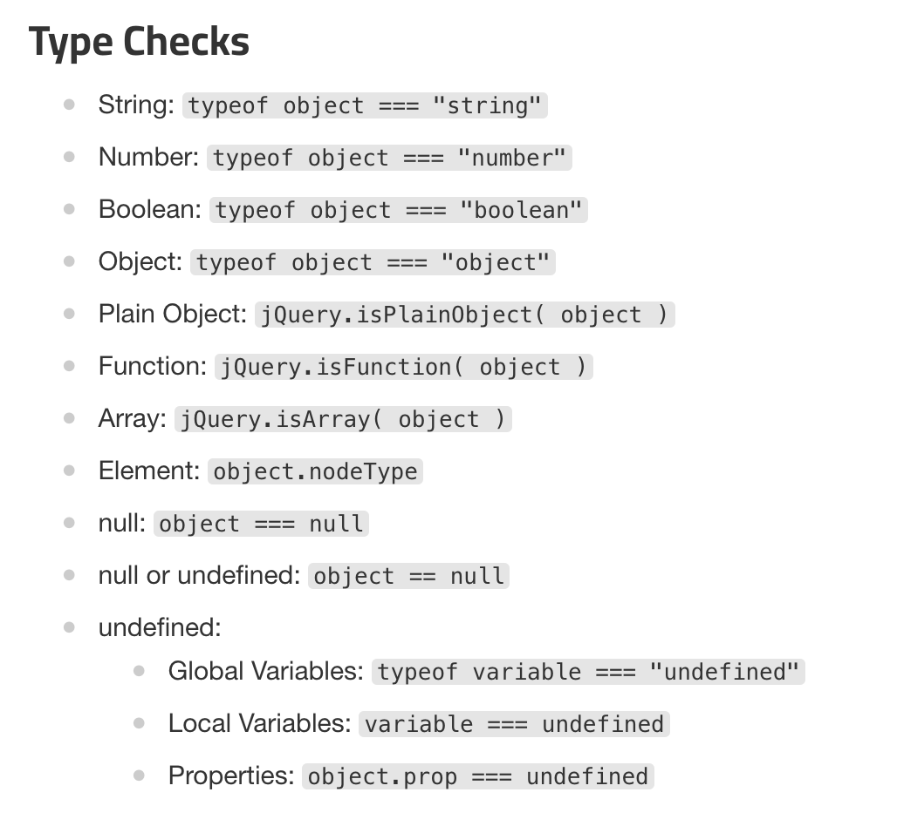

# 1. 시작

JS를 쓰다 보면 특정 변수가 `undefined`인지 판정해야 할 때가 있다. 함수 선언에 명시된 인자가 넘어왔는지를 판단할 때, 브라우저 호환성 문제에 대응하기 위해 특정 키워드나 메서드가 존재하는지 확인할 때 등이다.

이때 단순히 `===` 연산자를 사용해서 `undefined`와 비교하는 방식으로 판정할 수 있다. 예를 들어서 함수에 첫번째 인자가 넘어왔는지 확인하는 코드를 이렇게 짤 수 있다.

```js
function foo(a) {
  if (a === undefined) {
    // 함수에 인자 a가 넘어오지 않았을 때의 처리
  }
  else {
    // 함수에 인자 a가 넘어왔을 때의 처리
  }
}
```

이런 경우 `if (!a)` 등으로도 판정할 수 있다. 하지만 `null`이나 빈 문자열 등도 조건문을 통과하는 것을 막기 위해서는 명시적으로 `undefined`와 비교하는 것이 낫다. 여기까지는 일반적인 이야기이다.

그런데 옛날 코드들을 보면 다른 방식들을 볼 수 있다. 예를 들어서 `typeof a === 'undefined'` 나 `a === void 0` 등이다. 이런 방식들은 어떤 이유로 사용되었을까?

이는 ES3까지는 전역 객체 프로퍼티 `undefined`가 수정 가능했기 때문이다. 즉 전역에서의 `undefined`라는 이름을 다른 값으로 덮어쓸 수 있었다. `undefined`는 JS의 예약어도 아니기 때문에 가능했다. 그래서 이렇게 덮어씌워진 `undefined`와 비교되는 것을 피하기 위해서 앞서 언급한 다른 비교 방식들을 사용하였다.

그럼 이 말이 무슨 의미가 있는지, 이제부터는 좀 더 깊이 알아보자. 이런 것들을 보려고 한다.

- 왜 `undefined` 판정에 `===` 연산자만으로는 부족했는가
- 이전에 쓰였던 `undefined` 판정 방식들
- 각 방식의 장단점

# 2. 왜 `=== undefined` 만으로 부족했는가

왜 `undefined` 판정에 `===` 연산자를 통한 단순 비교 외의 방식들이 사용되었을까? 앞서 이야기했듯 ES3까지 `undefined`가 전역에서 수정 가능했기 때문이다. 이 이야기는 `undefined`에 관한 현재와 과거의 명세를 비교해 봄으로써 알 수 있다.

## 2.1. undefined의 현재 명세

먼저 현재의 명세에서 `undefined`를 어떻게 정의하고 있는지 살펴보자.

[ECMAScript 명세](https://tc39.es/ecma262/)에서는 `undefined` 값을 아직 값을 할당하지 않은 변수에 쓰이는 값으로 정의하고 있다.[^1]

> 4.4.13 undefined value
> 
> primitive value used when a variable has not been assigned a value

그리고 바로 다음 섹션에서 `undefined` 타입이란 `undefined` 값 하나만을 가지는 타입이라고 정의한다. 이 `undefined` 타입은 ECMAScript 명세에서 정의하는 타입으로도 나와 있다.

> 6.1.1 The Undefined Type
> 
> The Undefined type has exactly one value, called undefined. Any variable that has not been assigned a value has the value undefined.

그럼 우리가 쓰는 이 `undefined` 값은 어디서 오는 걸까? 이는 전역 객체의 프로퍼티이다. 

```js
> Object.getOwnPropertyDescriptor(globalThis, 'undefined')
{
  value: undefined,
  writable: false,
  enumerable: false,
  configurable: false
}
```

전역 객체의 프로퍼티에 대한 명세에서 `undefined`는 `undefined` 값을 가지는 프로퍼티로 정의되어 있다.

> 19.1 Value Properties of the Global Object
> 
> (생략)
> 
> 19.1.4 undefined
> 
> The value of undefined is undefined (see 6.1.1). This property has the attributes { [[Writable]]: false, [[Enumerable]]: false, [[Configurable]]: false }.

즉 `undefined`는 undefined 타입이 포함하는 유일한 값이며 전역 객체의 `undefined` 프로퍼티를 통해서 접근할 수 있는 값이다. 이 프로퍼티는 `[[Writable]]`, `[[Enumerable]]`, `[[Configurable]]` 설명자가 모두 `false`로 정의되어 있다. 따라서 프로퍼티의 수정이나 삭제가 불가능하고 설명자 수정도 불가능하다는 것을 알 수 있다.

따라서 지금 ES5에서는 전역 프로퍼티 `undefined`의 수정이 불가능하다. 그럼 ES3까지는 어땠을까?

## 2.2. undefined가 수정 가능하던 시절

[ES3의 명세](https://www-archive.mozilla.org/js/language/e262-3.pdf)에서는 전역 객체 프로퍼티 `undefined`를 다음과 같이 정의했다.

> 15.1.1 Value Properties of the Global Object 
> 
> (생략)
> 
> 15.1.1.3 undefined
> 
> The initial value of undefined is undefined (section 8.1). This property has the attributes { DontEnum, DontDelete }. 

이때 지금의 `[[Writable]]`설명자에 해당하는 `[[ReadOnly]]` 라는 property attribute가 있었다. 그런데 당시의 `undefined`는 명세상 해당 어트리뷰트를 갖고 있지 않은 걸 볼 수 있다. 지금으로 따지면 `[[Enumerable]]`와 `[[Configurable]]`는 `false`이고 `[[Writable]]`는 `true`였던 것이다.

따라서 이 시절에는 `undefined` 전역 객체 프로퍼티를 다른 값으로 덮어쓸 수 있었다.

```js
// ES3 시절에는 이런 코드가 가능했다
var undefined = 123;
console.log(undefined); // 123
console.log(undefined === 123); // true
```

`undefined`라는 이름을 코드 상에서 쓰게 되면 전역 객체 프로퍼티 `undefined`라는 key를 통해 `undefined`값에 접근하게 되는데, 이 key가 다른 값에 할당되어 있어서 `undefined`값이 아닌 다른 값이 반환되는 상황이 가능했던 것이다.

이는 특정 값이 `undefined`인지를 판정할 때 `a === undefined`와 같이 비교한다면 문제가 될 수 있었다. `undefined`가 다른 값일 수 있었으니까. 앞서 보았던 `typeof a`를 활용하는 등의 방식으로 이를 피할 수 있었다.

## 2.3. undefined의 수정 가능성

앞서 ES3까지는 전역 프로퍼티 `undefined`를 수정할 수 있었다는 걸 보았다. 그런데 이런 일이 일어날 가능성은 있었을까?

`undefined`를 실수로 수정하게 되는 상황이 정말 일어나기 힘든 일이었다면 앞서 설명한 `undefined` 판정 방식들이 필요 없었을 것이다.

그런데 이는 실수로 흔히 일어날 수 있는 일이었다[^2]. 다음과 같이 `this`의 프로퍼티에 값을 할당하는 함수가 있다고 하자.

```js
function assign(key, value) {
  this[key] = value;
}
```

그런데 이 함수가 전역 스코프에서 호출된다면? `this`는 전역 객체를 가리키게 된다. 이때 `key`가 `undefined`라면 전역 `undefined` 프로퍼티에 값이 할당되어 버린다.

물론 `assign('undefined', 1)`과 같이 개발자가 명시적으로 `undefined`를 넘기려고 할 일은 잘 없을 것이다.

하지만 `obj['foo']`를 `assign`의 `key`인수로 넣었는데 `obj`에 `foo` 프로퍼티가 없는 경우 등 실수로 `undefined`를 인수로 넘길 수 있는 가능성은 많다. 

```js
var obj={
  name: 'foo',
}

assign('abc', 1); // windiw.abc === 1
assign(obj.foo, 'bar'); // window.undefined === 'bar'
```

이런 경우 전역 객체 프로퍼티 `undefined`의 값을 덮어쓰게 되면서 코드 전체에 영향을 미칠 수 있었다. 따라서 이런 상황에 대처하기 위해 `undefined`를 판정할 때 `===` 연산자만으로는 부족했던 것이다. 이제 그때 쓰였던 방식들을 살펴보자.

# 3. 이전의 방식들

`undefined`가 전역에서 수정될 수 없도록 한 건 ES5부터이다. 그래서 ES5가 널리 쓰이기 전의 자료들을 보면 다양한 `undefined` 판정 방식을 볼 수 있다.

## 3.1. typeof 연산자 사용

현재 실행 환경에 특정 기능의 메서드나 프로퍼티가 존재하는지 판정하기 위해 `undefined`와 비교하는 예제에서 이런 방식을 볼 수 있다[^3].

```js
// Javascript Patterns, 215p
if(typeof document.attachEvent !== 'undefined') {
  document.attachEvent('onclick', console.log);
}
```

앞서 제시한 코드의 출처 말고도 다양한 도서들[^4]에서 `typeof`를 이용한 `undefined` 판정 방식을 볼 수 있다.

도서 외에도 jQuery의 기여 가이드[^5]의 스타일 가이드에서 전역 변수에 대해서는 `typeof`를 이용한 판정을 권장하는 등 여러 곳에서 이 방식을 볼 수 있다.



`typeof`는 전역 객체 `undefined` 프로퍼티가 갖고 있는 값과 상관없이 작동하여 값이 `undefined`인지 판정할 수 있었기에 이런 방식이 쓰였다.

## 3.2. void 연산자 사용

`void 0`이나 `void(0)`과의 비교도 자주 쓰이던 방식이다. `void`는 피연산자를 평가하고 `undefined`를 반환하는 연산자이기 때문에 이를 이용해서 `undefined` 값을 얻은 후 이용하는 것이다.

babel의 소스 코드 등에서 이를 찾을 수 있다. 다음은 클래스 관련 코드를 babel로 변환했을 때, 생성자를 처리하기 위한 코드의 일부이다[^6]. `self`가 `undefined`인지 판정할 때 `void 0`과 비교하는 코드를 볼 수 있다.

```js
helpers.assertThisInitialized = helper("7.0.0-beta.0")`
  export default function _assertThisInitialized(self) {
    if (self === void 0) {
      throw new ReferenceError("this hasn't been initialised - super() hasn't been called");
    }
    return self;
  }
`;
```

이 외에도 해당 파일의 다른 babel 헬퍼 함수들에서도 `void 0`과의 비교를 통한 `undefined` 판정을 볼 수 있다.

`void 0`은 전역 `undefined` 프로퍼티와 상관없이 동작했다. 또 `void`는 연산자였고 예약어였기 때문에 기능 수정 같은 게 불가능했고 따라서 늘 확실하게 `undefined` 값을 얻을 수 있었다.

## 3.3. 변수 shadowing[^7]

`undefined`는 ES3까지 전역에서 값을 덮어쓸 수 있었다. 하지만 이렇게 덮어쓴 전역의 `undefined`도 다른 스코프에서는 또 shadowing될 수 있었다.

이를 이용해 `undefined`를 덮어쓰고 비교하여 판정하는 방식도 있다. 다음은 이런 방식을 사용한 예제이다. 일부러 즉시 실행 함수의 인자 이름을 `undefined`로 하고 인자를 넘기지 않음으로써 전역 `undefined`를 덮어쓴 후 `undefined`를 판정하는 코드이다.

```js
// undefined를 전역 변수 선언으로 덮어쓸 수 있었던 ES3까지의 코드
var undefined = 1;

function check(a){
  var result=(function(undefined){
    return a === undefined;
  })();

  return result;
}
```

따라서 `check` 함수는 `a`가 진짜 `undefined`일 때 `true`를 반환한다. backbonejs 등에서도 이 방식을 볼 수 있다고 한다.[^8]

# 4. 각 방식의 장단점

현재 기준으로는 `===`를 이용해서 `undefined`와 단순 비교를 통해 판정하는 게 가장 간단하고 직관적이다. 하지만 지금은 ES3 시절 전역 객체 프로퍼티 `undefined`를 덮어쓸 수 있었던 문제를 극복하기 위해 나왔던 방식들을 다루고 있다. 따라서 당시의 방식들에 대해 이야기한다.

## 4.1. typeof 방식

앞서 언급한 다른 방식들과 `typeof`를 이용한 방식이 다른 게 하나 있다. 이 방식은 아직 선언되지 않은 변수에 대해서도 오류 발생 없이 작동한다는 것이다. 다른 방식의 경우 `undefined` 판정 시도 시 ReferenceError가 발생한다.

```js
typeof undeclaredVariable === 'undefined'; // true
undeclaredVariable === undefined; // ReferenceError
undeclaredVariable === void 0; // ReferenceError
```

이는 경우에 따라 장점일 수 있다. 예를 들어 브라우저에 특정 기능이 있는지 판단하는 feature detection을 할 경우 브라우저에 따라 스코프에 해당 이름이 존재하지 않을 수도 있다. 이럴 경우 `typeof`를 이용한 판정이 목적에 맞고 더 안전하다.

예를 들어 commonJS 환경인지 판정할 때 다음과 같은 코드를 볼 수 있다. 이 경우 `module`이라는 이름이 아예 스코프에 없을 수도 있기에 `typeof`를 이용한 판정이 적절하다.

```js
if (typeof module !== 'undefined' && module.exports) {
  // commonJS 환경
}
```

그런데 `typeof`를 이용하는 방식의 이런 점은 대부분의 경우에는 모호할 수 있다는 단점이 될 수 있다. 다음과 같은 코드를 보자. 다음과 같은 조건문은 `foo`가 아예 선언되어 있지 않을 때와 `foo`가 선언되어 있지만 `undefined`일 때를 구분하지 못한다.

```js
if (typeof foo === 'undefined') {
  // 조건문이 참일 때
}
```

만약 오타로 인해 조건문을 잘못 써서 아예 선언되지 않은 변수를 판정하려고 했을 때, 이런 실수를 찾아내기 어려울 수 있다.

```js
if (typeof fooo === 'undefined') {
  // foo가 아닌 fooo를 적어 버렸지만 이 조건문은 참이 되어버린다
}
```

작은 차이가 하나 더 있는데 `document.all`이라는 특이한 객체에 대해서도 `typeof`를 이용한 판정이 가능하다. `document.all`은 페이지의 모든 요소를 배열로 가지고 있는 객체인데, 이 객체는 IE에서 쓰였고 호환성을 위해 남아 있다.

이 객체는 실제로 `undefined`가 아니기 때문에 `document.all === undefined`는 `false`를 반환한다. 하지만 `typeof document.all === 'undefined'`는 `true`를 반환한다. 이런 사실은 `document.all`이 있는지를 통해 IE를 판정하는데 쓰일 수 있다. 물론 `document.all`이 거의 묻힌 지금은 큰 의미 없다.

또한 이 방식에는 피연산자의 타입을 판정하는 과정이 있기 때문에 느릴 '수도' 있지만 일반적인 엔진에서는 큰 차이가 없다. 

## 4.2. 다른 방식들

변수 shadowing 방식은 코드도 길고 가독성도 떨어졌다. 그리고 역시 함수 스코프 내에서는 `undefined`를 덮어쓸 수 있었기 때문에 그렇게까지 안전한 방식도 아니었다. 따라서 다른 방식들에 비해 떨어지는 점이 많았고 쓰이는 예시도 거의 찾을 수 없었다.

`void 0`을 이용한 방식은 값이 `undefined`인지를 판정한다는 점에서는 가장 안전하고 명확했다. `void`는 연산자이고 예약어여서 수정 불가능했고 언제나 안전하게 `undefined`를 얻을 수 있게 해주었다.

`void 0`과의 비교는 '값을 다른 어떤 값이랑 비교한다'는 것도 명확히 보여주었다. 하지만 `undefined`를 써서 비교하는 것보다는 직관성이 덜하기는 했다. 따라서 `isUndefined`와 같이 이름을 통해 목적을 드러내주는 함수들을 만드는 방식도 쓰였다.

# 5. 여담

## 5.1. undefined는 지금도 shadowing 가능하다

ES5부터는 전역 프로퍼티 `undefined`가 수정할 수 없게 되었다. 하지만 이는 전역 스코프에서만 해당하는 일이다. `undefined`라는 이름은 여전히 예약어가 아니기 때문에 다른 스코프에서는 여전히 `undefined`라는 이름을 덮어쓸 수 있다.

```js
// 함수 스코프로는 이렇게
function foo() {
  var undefined = 123;
  console.log(undefined); // 123
}

foo();

// 블록 스코프로는 이렇게 중괄호만 이용해도 된다
{
  let undefined = 123;
  console.log(undefined); // 123
}
```

[^1]: 흔히 같이 묶이는 `null`은 어떤 객체 값이 의도적으로 없음(intentional absence of any object value)을 나타내는 값이라고 명세에서 정의하고 있다.

[^2]: https://2ality.com/2013/04/check-undefined 의 WebReflection의 댓글

[^3]: 스토얀 스테파노프 지음, 김준기, 변유진 옮김, "Javascroipt Patterns, 자바스크립트 코딩 기법과 핵심 패턴", 인사이트, 2011

[^4]: 데이비드 허먼의 "이펙티브 자바스크립트", 악셀 라우슈마이어의 "자바스크립트를 말하다" 등

[^5]: jQuery 기여 가이드의 Type Checks https://contribute.jquery.org/style-guide/js/#type-checks

[^6]: https://github.com/rubennorte/babel/blob/738060ebfa7ac133d7dd6a2590835acaa08f15f3/packages/babel-helpers/src/helpers.js#L645

[^7]: "자바스크립트를 말하다"등의 저자인 악셀 라우슈마이어의 블로그 https://2ality.com/2013/04/check-undefined

[^8]: https://phuoc.ng/collection/this-vs-that/variable-undefined-vs-typeof-variable-undefined/


# 참고

variable === undefined vs. typeof variable === "undefined" https://stackoverflow.com/questions/4725603/variable-undefined-vs-typeof-variable-undefined

Checking for undefined: === versus typeof versus falsiness https://2ality.com/2013/04/check-undefined

The void operator in JavaScript https://2ality.com/2011/05/void-operator.html

MDN undefined https://developer.mozilla.org/ko/docs/Web/JavaScript/Reference/Global_Objects/undefined

ECMAScript 3 명세 https://www-archive.mozilla.org/js/language/e262-3.pdf

How can I check for "undefined" in JavaScript? https://stackoverflow.com/questions/3390396/how-can-i-check-for-undefined-in-javascript

Detecting an undefined object property https://stackoverflow.com/questions/27509/detecting-an-undefined-object-property

What does "javascript:void(0)" mean? https://stackoverflow.com/questions/1291942/what-does-javascriptvoid0-mean

JavaScript `undefined` vs `void 0` https://stackoverflow.com/questions/5716976/javascript-undefined-vs-void-0