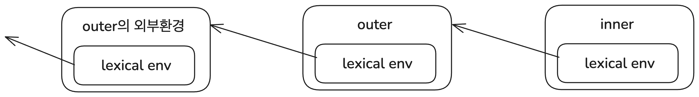
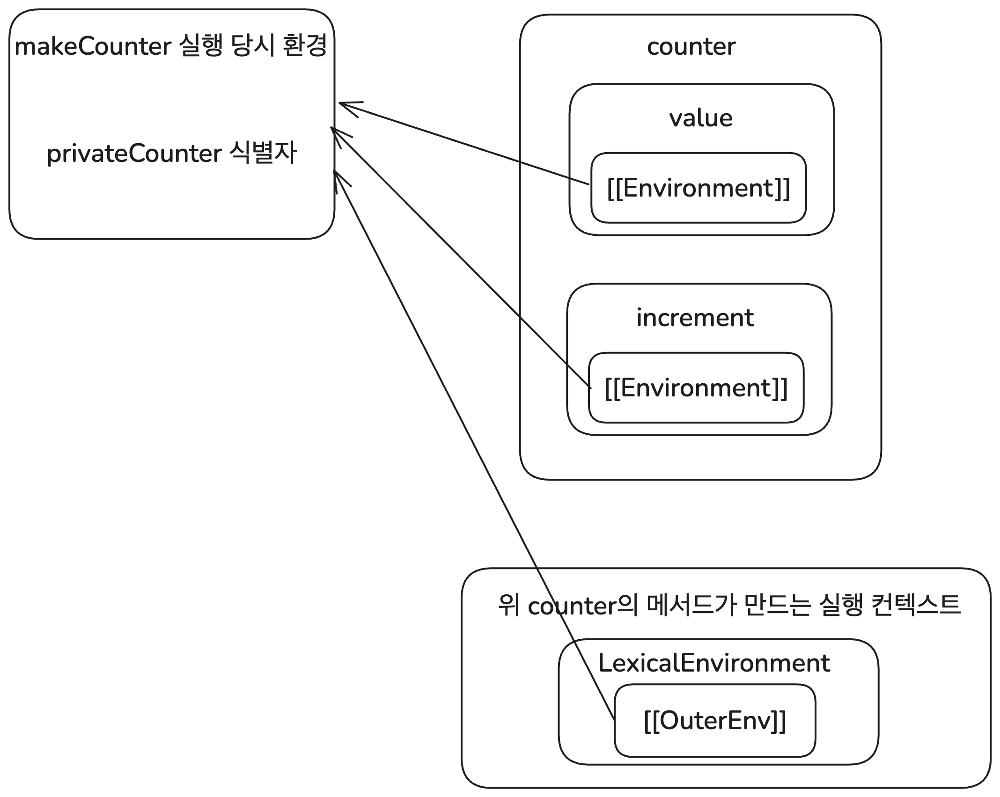

# 클로저 탐구 시리즈

- [클로저 연대기 1. 클로저의 개념과 응용](https://witch.work/posts/javascript-closure-deep-dive-application)
- [클로저 연대기 2. 클로저의 역사](https://witch.work/posts/javascript-closure-deep-dive-history)

> 클로저는 렉시컬 환경에 대한 참조와 함께 묶인 함수의 조합이다.
>
> MDN Web Docs, Closures

JavaScript를 공부하다 보면 클로저라는 말을 한번쯤 듣게 된다. 굉장히 중요하다는 말이 따라올 때도 많다. 그런데 시간이 지나고 클로저에 대해 들은 횟수가 늘어가면서 두 가지 질문이 생겼다.

- 클로저는 무슨 의미이고 무엇을 할 수 있는 걸까?
- 클로저는 대체 어디서 나왔고 어떻게 JavaScript까지 들어가서 이렇게 유명해졌을까?

이 두 가지 질문에 대해 할 수 있는 한 많은 것을 찾아보고 정리하여 두 개의 글을 쓴다. 클로저가 무엇이고 뭘 할 수 있는지에 관해 하나, 클로저의 역사에 관해 하나다. 실용적인 내용은 첫번째 글에 더 많겠지만 개인적으로는 두번째 글에 훨씬 더 많은 시간과 관심을 쏟았다.

- 글에서 사용되는 코드는 특별한 언급이 없는 한 모두 JavaScript로 작성되었다. 단 개념의 설명을 위해 실제 JavaScript 문법과는 다르게 의도된 코드가 있을 수 있는데 이 경우 별도의 설명으로 표시하였다.

# 시작

클로저에 대한 수많은 설명과 정의가 있다. 하지만 나는 내가 배우고 이해한 것들을 토대로 JavaScript의 클로저를 이렇게 설명하고자 한다. MDN의 정의를 조금 일반화한 것이다. 또한 역사적으로 클로저라는 용어를 처음 쓴 피터 랜딘 또한 비슷한 정의를 사용했다[^1].

**"클로저는 일급 객체 함수와 렉시컬 스코프를 사용하는 언어에서 표현식의 평가 결과로서 표현식, 그리고 표현식이 평가된 렉시컬 환경에 대한 참조의 묶음이다"**

JavaScript 또한 이 정의에 들어맞고 클로저를 사용한다. 그로 인해 JavaScript에서 표현식의 평가 결과는 외부 렉시컬 환경에 대한 정보를 유지하고 접근할 수 있는 객체가 된다. 이것이 클로저의 다양한 활용으로 이어졌다. 이 글에서는 다음과 같은 순서로 이를 더 자세히 다루려고 한다.

- 클로저의 개념
  - 클로저가 등장한 배경을 알아보고 앞서 설명한 정의를 다룬다.
- JavaScript 명세상의 클로저
  - JavaScript의 공식 문서인 ECMA-262 명세의 개념들이 해당 정의와 어떻게 연관되는지 다룬다.
- 클로저의 활용
  - JavaScript 코드에서 클로저의 활용 예시와 그 동작원리를 다룬다.

# 클로저의 정의에 대하여

앞서 클로저를 이렇게 설명했다.

> "클로저는 일급 객체 함수와 렉시컬 스코프를 사용하는 언어에서 표현식의 평가 결과로서 표현식, 그리고 표현식이 평가된 렉시컬 환경에 대한 참조의 묶음이다"

클로저에 대한 다른 많은 정의가 있고 각자의 의미가 있다. 그렇기에 "클로저의 정의가 반드시 이것이어야 하는 이유"를 다룰 수는 없다. 하지만 왜 이런 정의가 나왔는지 알아보고 나름의 의미를 찾아보자. 어째서 표현식의 평가 결과가 이런 형태가 되어야 할까?

## 표현식의 평가

클로저는 표현식의 평가 결과라고 했다. 그럼 표현식의 평가란 기본적으로 어떻게 이루어지는가? 표현식은 값으로 평가될 수 있는 코드 조각이고 이를 평가한다는 건 이 표현식이 만드는 값을 계산하는 것이다. 예를 들어 이런 표현식은 `15`로 평가된다.

```js
10 + 2 + 3
```

그런데 일반적으로 프로그래밍을 하면서 사용하는 표현식들은 이보다 훨씬 복잡하다. 많은 함수와 다른 표현식들을 사용한다. 예를 들어 이 표현식을 보자. 이 표현식이 그 자체로 값이 결정될 수 있을까?

```js
b = a + 1;
```

이 표현식은 앞서 보았던 `10 + 2 + 3`과 달리 그 자체로 값이 확정될 수 없다. 기존에 `a`의 값이 어떻게 정의되었는지에 따라 달라지기 때문이다. 따라서 위의 표현식의 결과가 나왔다면 그건 그 식 자체의 값이라고 하기 힘들다. 표현식이 평가될 당시의 주변 환경과 함께 평가된 결과로 보아야 한다.

더 일반적으로 말해서, 표현식의 평가 결과는 표현식만이 아니라 평가된 환경과 함께 묶여야 한다. 그리고 이렇게 묶인 것이 바로 앞서 말한 클로저이다.

## 클로저의 필요성

그런데 굳이 클로저를 사용해서 표현식을 평가할 필요가 있을까? 표현식을 그때그때 평가할 때 외부 환경을 고려하고 값을 확정할 수 있지 않을까? 클로저가 없는 언어에서도 이렇게 외부 환경에 의존하는 표현식은 있다. 예를 들어 C언어에서도 `a + 1`은 외부 환경에 따라 값이 달라진다.

```c
// 앞서 본 코드의 역할을 똑같이 하는 C 코드
int a = 1, b;
printf("%d\n", b = a + 1); // 2
a = 5;
printf("%d\n", b = a + 1); // 6
```

그런데 생각해 보면 클로저의 정의에서 아직 설명하지 않은 부분이 있다. 바로 "일급 객체 함수와 렉시컬 스코프를 사용하는 언어"라는 말이다. 이게 바로 클로저가 존재하는 이유이며 C와 달리 JavaScript가 클로저를 사용하는 이유이다.

일급 객체 함수와 렉시컬 스코프란 무엇인지부터 정리하고 넘어가자.

- 일급 객체 함수는 함수를 정수 등 다른 기본적인 값들처럼 자유롭게 다룰 수 있는 것을 의미한다. 일급 객체 함수를 지원하는 언어에서는 함수를 변수에 할당하거나 자료구조에 저장하고 다른 함수의 인수로 전달하거나 다른 함수의 반환값으로 사용할 수 있다.
- 렉시컬 스코프는 코드가 선언된 위치에 따라 스코프가 정적으로 정해지는 것을 뜻한다. 즉 앞서 언급한 "표현식을 평가할 때의 외부 환경"으로 표현식이 선언된 위치를 사용한다는 것이다.

렉시컬 스코프에 따라서 함수는 어디에서 호출되었는지와 상관없이 자신이 선언된 위치의 외부 환경을 사용한다. 다음 코드를 보면 `f`는 `g` 내부에서 호출되었지만 자신이 선언된 전역 스코프의 `a`를 사용한다.

```js
let a = 2;
function f(){
  console.log(a);
}

function g(){
  let a = 37;
  f();
}
// g 내부에서 f를 호출하더라도 f는 자신이 선언된 전역 스코프의 a를 사용한다.
g(); // 2
```

그럼 일급 객체 함수와 렉시컬 스코프를 사용하는 언어에서는 일반적인 표현식의 평가를 어떻게 해야 할까? 물론 표현식이 선언된 위치의 외부 환경을 사용하면 된다. 하지만 이를 프로그래밍 언어에서 구현하려면 2가지 문제를 해결해야 한다.

현재 거의 모든 언어는 스택 기반으로 메모리를 관리한다. 그런 언어에서 어떤 환경에 접근하기 위해서는 해당 환경을 갖는 함수의 스택 프레임에 접근해야 한다. 이때 스택 프레임이란 매개변수, 지역 변수 등 함수의 실행에 필요한 여러 환경 정보들이 저장되는 영역이며 함수의 호출이 완료되면 메모리에서 사라진다.

그런데 렉시컬 스코프에 대해 설명했던 코드를 다시 보자.

```js
let a = 2;
function f(){
  console.log(a);
}

function g(){
  let a = 37;
  f();
}
// g 내부에서 f를 호출하더라도 f는 자신이 선언된 전역 스코프의 a를 사용한다.
g(); // 2
```

여기서 `g`를 호출하면 `g`가 호출되고 `g` 내부에서 `f`가 호출된다. 그리고 `f`는 자신의 코드를 실행하면서 자신이 선언된 전역 스코프의 `a` 식별자 값을 가져와서 콘솔에 출력하게 된다. 그런데 `f`의 코드는 어떻게 전역 스코프 환경에 접근했을까?

물론 스택 프레임에서 콜스택 상위에 있는 스택 프레임의 포인터를 가지고 있으면 된다. 


하지만 외부 환경을 사용하는 함수와 외부 환경을 가지고 있는 함수의 스택 프레임 간 거리가 너무 길다면 이런 접근은 비효율적이다. 함수가 다른 함수의 인수로 전달될 경우 충분히 있을 수 있는 경우이다. 더 나쁜 경우도 있다. 함수가 다른 함수의 반환값으로 사용될 때는 아예 외부 함수의 환경을 갖고 있는 스택 프레임이 사라져 버린다.

```js
// 함수를 다른 함수의 반환값으로 사용하는 코드
function outer(){
  let a = 1;
  function inner(){
    let b = 2;
    return a;
  }
  return inner;
}
const inner = outer();
console.log(inner()); // 1
```

앞서 설명한 상황들의 콜스택을 그림으로 나타내면 다음과 같을 것이다.


앞서 보았던 C언어에서는 일급 객체 함수를 지원하지 않기 때문에 이런 문제가 없다. 하지만 일급 객체 함수를 지원하며 거기서 파생되는 표현식의 평가에 렉시컬 스코프를 사용해야 하는 JavaScript와 같은 언어에서는 이런 문제가 생기고, 어떻게든 해결해야 한다. 이는 funarg problem이라 불렸는데 이 문제를 해결하기 위해 클로저가 등장했다.

## 클로저의 등장

앞서 설명한 문제는 결국 각 표현식을 평가할 때 해당 표현식이 선언된 환경에 어떻게 접근할지에 대한 문제다. 현재 스택 프레임에서 접근하기 힘든, 혹은 이미 콜스택에서 없어진 환경에 어떻게 접근할 것인가? 이 문제를 해결하기 위해 표현식을 평가할 때 해당 표현식이 선언된 환경에 대한 참조를 함께 저장한 것이 바로 클로저다.

가령 위에서 보았던 함수를 다른 함수 반환값으로 사용하는 코드를 보자. 표현식의 평가 결과를 클로저로 저장하면 이 코드는 어떻게 해석될까?

```js
function outer(){
  let a = 1;
  function inner(){
    let b = 2;
    return a;
  }
  return inner;
}
const inner = outer();
```

먼저 `outer`가 호출되면 `outer`의 환경이 생성되고 `a`와 `inner` 식별자가 생긴다. 이때 `inner`의 평가 결과는 함수 코드와 자신이 선언된 환경인 `outer` 호출 당시의 환경에 대한 참조의 묶음이다. 이건 힙에 저장되기 때문에 `outer`가 `inner`를 반환하면서 종료되어도 `inner`를 호출할 때 `outer`의 환경에 접근할 수 있다.

이렇게 만들어진 `outer`의 환경은 `outer`가 호출될 때마다 새로 생성되기 때문에 같은 `outer` 함수를 여러 번 호출하더라도 각각의 `inner`는 서로 다른 환경을 가지게 된다.



여기서 만약 `inner` 함수가 단독으로 선언되었다면 어땠을까? 이런 코드를 말한다.

```js
function inner(){
  let b = 2;
  return a;
}
```

이 함수를 호출 시 에러가 발생할 것이다. 식별자 `a`가 정의되어 있지 않기 때문이다. 따라서 `inner` 함수의 평가 결과는 `inner` 함수 선언과 `inner` 함수가 선언된 환경(`a` 식별자를 가지고 있어야 할 것이다)에 대한 참조의 묶음이어야 한다. 이것이 바로 클로저이다.

앞서 말했던 것처럼 클로저는 표현식의 평가 결과로서 표현식과 표현식이 평가된 렉시컬 환경에 대한 참조의 묶음이다. 이게 힙에 저장됨으로써 스택 프레임이 없어져도 외부 환경에 대한 정보를 유지할 수 있게 한다.

이는 일급 객체 함수와 렉시컬 스코프를 사용하는 언어에서 표현식의 평가에 대한 문제를 해결하는 방법이다. 표현식을 클로저로 평가함으로써 표현식에 묶인 외부 환경의 관리를 스택 프레임이 아니라 가비지 컬렉터에 맡기는 것이다.

참고로 이렇게 외부 환경에 의존하는 값을 "free"하다고 하며 이렇게 free한 값이 있는 표현식을 "open", free한 값이 없는 표현식을 "closed"라고 한다. 이때 표현식의 평가 결과가 open 상태라면 이를 closed 상태로 만들어 준다는 뜻으로 클로저(closure, 폐쇄)라는 용어를 사용하는 것이다.

# JavaScript 명세상의 클로저

클로저는 JavaScript의 공식 명세인 ECMA-262에 직접적으로 언급되어 있는 개념은 아니다. 하지만 앞서 설명한 클로저의 개념을 ECMA-262에서도 어느 정도 찾아볼 수 있다. 표현식의 평가 결과를 어떻게 나타내며 어떻게 렉시컬 환경에 대한 접근을 하는지를 보면 된다.

먼저 다음과 같은 질문과 답으로 시작해 볼 수 있겠다.

- JavaScript에서 표현식의 평가 결과는 클로저인가?

그렇다. ECMA-262 명세에서 표현식에 있는 식별자의 평가 결과는 해당 식별자의 이름과 식별자가 속한 렉시컬 환경에 대한 참조를 가지고 있다. 이는 앞서 설명한 클로저의 정의와 일치한다.

- 그럼 식별자의 평가 결과는 어떻게 만들어지는가?

실행 중인 실행 컨텍스트의 환경에서 시작해서 렉시컬 스코프 체인을 따라 올라가면서 식별자를 찾고, 식별자를 찾으면 해당 환경과 식별자를 묶어 리턴한다.

- 그때 쓰이는 스코프 체인의 외부 렉시컬 환경 참조는 어디에 저장되는가?

새로운 스코프를 만드는 표현식이 평가될 때는 환경이 새로 생성되며, 외부 스코프에 대한 참조가 이 환경의 내부 슬롯에 저장된다. 그리고 함수 객체나 모듈 객체는 자신이 생성된 환경에 대한 참조를 내부 슬롯에 저장한다.

정리하자면 ECMA-262 명세 상에서도 표현식의 평가 결과는 표현식과 평가 환경의 묶음이며 이 환경은 렉시컬 스코프를 따라간다. 앞서 보았던 클로저의 원리와 정의에 대한 내용과 일치한다!

그럼 다시 처음으로 돌아가서 실행 컨텍스트에 관한 내용부터 다시 되짚어 올라와보자.

**글의 주제를 너무 벗어나지 않기 위해 명세에 서술된 모든 부분을 설명하지는 않았다. 생략된 부분에 대해서는 주석의 명세 링크들을 참고할 수 있다.**

## 실행 컨텍스트와 환경 레코드

먼저 실행 컨텍스트와 환경 레코드에 대해 알아보자. 실행 컨텍스트에 관해서만 해도 많은 내용이 있지만 여기서는 오로지 글의 주제인 클로저에 관련된 부분만 다룬다.

실행 컨텍스트는 JavaScript 엔진이 실행할 코드에 대한 환경 정보를 가지고 코드의 런타임 평가를 추적하기 위해 사용하는 객체이다. 함수 호출 시 함수 실행에 필요한 정보를 가지고 스택에 쌓이는 스택 프레임과 비슷하다고 볼 수 있다[^3].

이때 콜스택의 최상위에서 실행되고 있는 실행 컨텍스트를 "실행 중인 실행 컨텍스트(running execution context)"라고 한다. 함수 호출 등으로 인해 새로운 실행 컨텍스트가 생성되면 그게 콜스택의 최상위에 올라가서 실행 중인 실행 컨텍스트가 된다.

그리고 실행 컨텍스트의 구성 요소 중에는 LexicalEnvironment라는 게 있다[^4]. 다른 구성요소들은 [Execution Context의 명세](https://tc39.es/ecma262/#sec-execution-contexts)에서 볼 수 있다.


LexicalEnvironment는 실행 컨텍스트 내에서 실행되는 코드의 식별자 참조를 분석할 때 사용하는 환경 레코드이다. 그럼 환경 레코드는 무엇일까?

환경 레코드는 렉시컬 스코프 구조에 따라 식별자와 그 식별자가 가리키는 값을 기록해 주는 명세 타입이다. 함수 선언 등 스코프를 생성하는 구문을 평가할 때(함수 선언이 평가된다는 말은 함수의 코드가 실행될 때이므로 함수가 호출될 때를 가리킨다) 생성된다. 또한 `[[OuterEnv]]` 내부 슬롯을 통해 외부 렉시컬 스코프에 대한 참조를 가지고 있다. 이때 `[[OuterEnv]]`가 `null`인 환경 레코드는 전역 환경 레코드이다[^5].

그럼 우리가 글의 주제인 클로저에 관해 가장 신경써야 하는 대상인 함수에 초점을 맞춰 이 섹션에서 다룬 내용을 정리해 보자. 함수가 실행되면 콜스택에 새로운 실행 컨텍스트가 생성된다. 이때 생성된 실행 컨텍스트는 함수가 선언된 렉시컬 환경에 기반한 환경 레코드를 가지고 있다.

### 함수의 렉시컬 환경을 기억하는 법

그런데 실행 컨텍스트와 환경 레코드만으로는 설명하기 힘든 부분이 있다. 환경 레코드는 분명 함수를 호출할 때 생성된다고 했다. 이때 생성된 환경 레코드는 어떻게 함수가 처음 선언된 렉시컬 환경을 기억할 수 있을까?

이 요구사항을 좀 더 엄밀하게 말하면 함수가 호출될 때 만들어진 실행 컨텍스트의 `LexicalEnvironment`의 `[[OuterEnv]]`가 함수가 선언된 렉시컬 환경을 가리켜야 한다. 이 요구사항은 함수 객체가 자신이 선언된 환경의 환경 레코드에 대한 참조를 내부 슬롯 `[[Environment]]`(ES3까지는 `[[Scope]]`)에 가지고 있음으로써 해결된다.

이 과정은 다음과 같다.

JavaScript 엔진은 함수 선언을 인식하고(함수 선언을 평가하지는 않는다. 그건 함수가 호출될 때 일어나는 일이다) 함수 객체를 생성할 때 현재 실행 중인 실행 컨텍스트의 렉시컬 환경의 참조를 내부 슬롯 `[[Environment]]`에 저장한다[^6]. 이때 환경을 복사해 저장하는 것이 아니라 참조를 저장하는 것이기 때문에 해당 외부 환경이 변화하면 이를 그대로 반영한다.

이후 함수가 호출될 때는 해당 함수 객체를 이용해 새로운 실행 컨텍스트와 환경 레코드를 생성한다. 그리고 함수 호출 시 생성된 환경 레코드의 `[[OuterEnv]]`는 함수 객체의 `[[Environment]]`를 참조하도록 한다[^7].

즉 함수 객체는 자신이 생성된 환경을 기억하며 함수 호출 시 이를 이용해 새로운 환경을 생성한다. 이를 통해 함수는 호출되어 실행되면서 자신이 생성된 환경에 접근할 수 있다. 또한 해당 렉시컬 환경을 생성한 함수의 스택 프레임이 콜스택에서 사라져도 함수 객체가 여전히 그 렉시컬 환경에 대한 참조를 가지고 있기 때문에 렉시컬 환경은 가비지 컬렉팅 대상이 되지 않는다.

## 표현식의 평가

표현식을 평가하는 데 쓰일 환경이 JavaScript 명세 상에서 어떻게 구성되는지 알아보았다. 그럼 클로저의 핵심, 표현식의 평가가 어떻게 이루어지는지 알아봐야 한다.

표현식은 식별자와 연산자들로 구성된다. 이때 연산자의 평가는 종류도 많고 일반적으로 주변 환경과 큰 연관이 없으므로 생략한다. 클로저와 관련된 건 식별자의 평가다.

식별자의 평가는 명세의 `ResolveBinding`을 통해 이루어진다. 이때 인수로는 식별자의 문자열 값(변수명, 함수명 등)이 들어간다[^8]. 명세에서 식별자의 평가를 나타내는 문장은 다음과 같다.

```
ResolveBinding(StringValue of Identifier)
```

이렇게 값을 찾아낼 식별자가 전달된 `ResolveBinding`이 실행하는 과정을 정리하면 다음과 같다[^9]. 전달된 식별자명을 `name`이라고 하자.

1. 현재 실행 중인 실행 컨텍스트의 LexicalEnvironment를 `env`로 한다.
2. 만약 `env` 환경에 `name` 바인딩이 있다면 다음과 같은 형태의 Reference Record를 반환한다.
```js
{
  [[Base]]: env,
  [[ReferencedName]]: name
}
```
3. `env`에 `name` 바인딩이 없을 경우 `env.[[OuterEnv]]`를 `env`로 하고 2단계로 돌아가서 다시 시도한다.

`ResolveBinding`은 값이 정상적으로 평가되었을 경우 Reference Record를 포함하는 Completion Record를 반환한다. 이 Record들은 다음과 같은 의미를 가진다.

- Completion Record: 평가 결과를 나타내는 명세 타입이며[^10] 평가의 완료 상태(정상, 예외, 중단 등)를 나타내는 `[[Type]]` 필드와 평가된 표현식의 결과를 나타내는 `[[Value]]` 필드를 가진다[^11].
- Reference Record: 평가된 식별자의 바인딩을 나타내는 데 쓰인다. 식별자 바인딩을 가지고 있는 값이나 환경 레코드인 `[[Base]]`와 평가된 식별자의 이름인 `[[ReferencedName]]` 필드를 가진다[^12].

즉 ECMA-262 명세에서도 표현식의 평가 결과는 단순히 값으로 나오지 않는다. 표현식을 이루는 식별자들의 평가 결과가 식별자 이름과 식별자에 대한 바인딩을 가지고 있는 환경의 묶음으로 나타나기 때문이다. 앞서 보았던 클로저이다.

참고로 식별자에 바인딩된 구체적인 값을 찾기 위해서는 Reference Record의 `GetValue` 연산을 사용한다. 이는 `[[Base]]` 환경 레코드에서 해당 식별자 바인딩을 찾는 방식으로 실제 값을 찾아낸다[^13].

## 표현식의 평가 과정 총정리

지금까지 보았던 ECMA-262 명세상의 표현식의 평가 과정과 이를 통해 나오는 클로저를 정리해보자.

1. 표현식의 식별자에 대한 평가는 실행 중인 실행 컨텍스트의 LexicalEnvironment에서 시작
2. 해당 환경에서 식별자에 대한 바인딩을 탐색
3. 바인딩을 찾으면 해당 환경과 식별자의 이름을 Reference Record로 묶어 반환
  - 이 Reference Record란 식별자의 이름과 식별자 바인딩을 가지고 있는 환경 레코드에 대한 참조로 구성됨
4. 해당 환경에서 식별자를 찾지 못하면 `[[OuterEnv]]`로 이동하여 다시 식별자 바인딩 탐색
  - 이 `[[OuterEnv]]`는 함수 객체의 내부 슬롯 등을 통해 렉시컬 환경을 따라감
5. 이러한 과정을 통해 표현식의 평가 결과는 Reference Record를 포함하는 Completion Record로 나타남
  - 즉 평가 결과는 표현식과 표현식(을 이루는 식별자)이 평가된 렉시컬 환경에 대한 참조의 묶음이고 앞서 정의한 클로저와 같음

## JavaScript 코드 예시

그럼 이걸 기반으로 앞서 보았던 코드를 다시 보자. 이 코드는 어떤 과정을 거쳐 평가될까?

```js
function outer(){
  let a = 1;
  function inner(){
    return a;
  }
  return inner;
}

const inner = outer();
console.log(inner()); // 1
```

먼저 전역 실행 컨텍스트가 만들어지고 실행된다. 이때 식별자 `outer`가 등록되고 `outer` 함수 객체와 연결된다. 이 함수 객체는 자신이 생성된 렉시컬 환경을 `[[Environment]]`에 저장한다.

`outer` 함수가 호출되면 새로운 실행 컨텍스트가 생성된다. 여기서 식별자 `a`와 `inner`가 등록되고 `a`의 바인딩이 1로 설정된다. 그리고 `inner` 함수 객체가 생성되고 이 함수 객체 또한 자신이 생성된 렉시컬 환경(`outer` 내부의 환경)을 `[[Environment]]`에 저장한다. 그리고 `inner` 함수 객체가 반환된다.

`outer`가 종료되면서 `outer`의 실행 컨텍스트는 스택에서 사라진다. 하지만 `outer`에서 리턴한 함수 객체가 여전히 해당 렉시컬 환경을 참조하고 있기 때문에 `outer`의 렉시컬 환경은 가비지 컬렉팅 대상이 되지 않는다.

그다음 `outer`에서 리턴한 `inner` 함수 객체가 `inner` 변수에 할당되고 호출된다. 여기서 생성되는 `inner` 함수의 실행 컨텍스트의 LexicalEnvironment는 `inner`의 `[[Environment]]`를 `[[OuterEnv]]`로 가지게 된다. 그리고 이를 통해 `a`의 바인딩을 찾아 1을 반환한다.

# 클로저의 활용

앞서 클로저는 표현식의 평가 결과이며 표현식과 렉시컬 환경에 대한 참조의 묶음이라고 했다. 그리고 이것이 일급 객체 함수와 렉시컬 스코프를 사용하는 언어에서 필요한 개념이며 JavaScript의 ECMA-262 명세에서도 엿볼 수 있는 개념이라는 것을 보았다.

이 점은 클로저의 활용에도 영향을 미친다. 어떤 표현식의 결과로 나온 객체를 사용할 때 해당 객체가 선언된 렉시컬 환경에 대한 참조를 함께 사용할 수 있다는 뜻이기 때문이다. 즉 클로저를 활용한다는 것은 어떤 표현식을 사용할 때 해당 표현식이 평가된 렉시컬 환경의 정보를 어떤 방식으로든 사용한다는 뜻이다. 이 방식들을 나름대로 분류해 보면 다음과 같다.

- 정보 은닉

표현식이 평가된 외부 렉시컬 환경을 만든 함수가 이미 종료되었을 경우, 해당 환경에 접근할 수 있는 건 그 렉시컬 환경을 기억하고 있는 표현식뿐이다. 이를 이용해서 외부로 노출되지 않아야 하는 정보를 숨기는 데 사용할 수 있다.

- 정보 전달

다른 함수의 내부에 있는 함수는 평가될 때 외부 렉시컬 환경을 기억하고 있다. 여기에는 함수의 인수나 상태 등이 포함된다. 이를 이용해서 특정 환경을 기억하고 있는 함수를 만들 수 있다. 고차 함수, 커링 등이 여기에 해당한다.

- 정보 추적

앞선 정보 전달의 연장선상에 있다. 함수의 실행 횟수나 순서, 상태 등 내부적으로 추적해야 하는 정보를 클로저에 저장해 두는 방식이다.

그럼 이 섹션에서는 이러한 활용들을 실제 JavaScript 코드를 통해 살펴보고, 클로저가 어떻게 사용된 것인지 알아본다.

## 정보 은닉

클로저를 이용하면 외부 스코프에서 접근할 수는 없지만 내부 함수를 통해서는 접근 가능한 데이터를 만들 수 있다. 예를 들어 다음의 `makeCounter`는 외부에서 직접 접근할 수는 없는 상태를 가진 카운터를 만든다[^14].

```js
const makeCounter = function () {
  let privateCounter = 0;
  return {
    increment() {
      privateCounter += 1;
    },

    value() {
      return privateCounter;
    },
  };
};

const counter = makeCounter();
```

`makeCounter`에서 반환한 `counter` 객체는 자신이 만들어질 당시의 `makeCounter` 환경에 대한 참조를 가지고 있다. 구체적으로는 객체의 `increment`, `value`에 연결된 함수 객체의 `[[Environment]]` 내부 슬롯을 통해서이다. 그리고 이 렉시컬 환경은 해당 객체의 각 메서드들이 실행될 때 만들어지는 환경 레코드의 `[[OuterEnv]]` 필드에 연결된다.



하지만 `makeCounter`는 이미 종료되었다. 따라서 해당 함수가 반환한 객체를 통해서만 `privateCounter`에 접근할 수 있다. 이때 이 `makeCounter`가 만드는 환경은 `makeCounter`가 호출되어 실행 컨텍스트가 생성될 때마다 새로 만들어진다. 때문에 각각의 카운터 객체는 서로 다른 `privateCounter`를 가지게 된다.

이렇게 private와 같은 기능을 흉내내기 위해 클로저를 사용하는 것을 모듈 디자인 패턴을 따른다고 한다. 클로저를 이용해 외부에 노출되지 않아야 하는 정보를 이미 종료된 함수의 환경에 숨기는 것이다. ES6이 나오기 이전 시기, JavaScript에 클래스도 없었고 비공개 프로퍼티를 선언할 수 있는 방법도 없었던 시절 클로저를 이용해 정보를 은닉하는 방법을 많이 사용했다.

작은 문제가 있는데, 이렇게 하더라도 반환된 객체를 여전히 편집할 수 있다는 것이다. 메서드를 덮어씌우는 등의 방식으로 객체를 변형할 수 있다. 이를 막기 위해서는 리턴하는 객체에 getter만 정의하고 객체를 `Object.freeze`로 변경 불가능하게 만드는 방법을 사용할 수 있다.

```js
const makeCounter = function () {
  let privateCounter = 0;
  return Object.freeze({
    increment() {
      privateCounter += 1;
    },

    get value() {
      return privateCounter;
    },
  });
};
```

좀 더 심화된 모듈 패턴에 대해서는 참고 섹션의 JavaScript 도서들을 참고할 수 있다.

## 정보 전달

클로저는 표현식이 평가된 환경에 대한 참조를 기억한다고 했다. 여기에는 외부 함수가 받았던 인자나 가지고 있던 상태 등이 포함된다. 이는 함수에서 파생된 다른 함수를 만들거나 함수에서 다른 함수로 정보를 전달할 때 유용하다.

대표적인 예시로 부분 적용 함수를 들 수 있다. 부분 적용 함수란 N개의 인자를 받는 함수에 미리 M개의 인자만 넘겨 기억시킨 함수이다. 부분 적용 함수가 사용될 때는 (N-M)개의 인자만 넘겨주면 된다. 함수에 전달한 인자를 클로저에 저장한 형태로 새로운 함수를 만들어낸 것이다. 비슷한 동작을 하는 다양한 함수를 만들어야 할 경우에 유용하다.

특정 케이스의 부분 적용 함수를 만들어 볼 수도 있겠지만 좀 더 일반적으로 부분 적용 함수를 만들어주는 함수를 만들어보자. 함수와 부분 적용할 인자들을 받아서 해당 인자들을 미리 적용해 놓은 함수를 반환한다. 이는 매우 간략한 버전이기 때문에 좀 더 다양하게 응용할 수 있는 `partial`의 구현은 `es-toolkit`의 `partial` 함수를 참고하자[^15].

```js
function partial(func, ...partialArgs) {
  return function (...providedArgs) {
    const args = [...partialArgs, ...providedArgs];
    return func.apply(this, args);
  };
}
```

`partial`이 실행될 때마다 생기는 환경은 `partial`이 받은 인수를 포함한다. 그리고 이 환경은 반환되는 함수 객체의 `[[Environment]]` 내부 슬롯에 저장된다. 따라서 `partial`이 반환한 함수를 실행하면 해당 함수는 클로저에 저장된 `partial`이 받았던 인수들과 자신이 받은 인수들을 합쳐서 실행한다.

또다른 정보 전달의 예시로는 커링이 있다. 이 또한 원리는 똑같다. 커링은 여러 개의 인자를 받는 함수를 하나의 인자만 받는 함수로 나눠서 순차적으로 호출될 수 있게 구성한 것이다. JavaScript는 커링을 언어 문법으로 지원하지는 않기 때문에[^16] 클로저를 이용해 직접 구현할 수 있다.

```js
function curry(func) {
  return function curried(...args) {
    if (args.length >= func.length) {
      return func(...args); // 인자가 모두 채워지면 실행
    } else {
      return function (...nextArgs) {
        return curried(...args, ...nextArgs); // 인자가 부족하면 계속해서 함수 반환
      };
    }
  };
}
```

부분 적용 함수와 마찬가지로, 함수 객체가 자신이 선언된 환경을 기억하는 걸 이용했다. 커링을 사용하면 중간 과정상의 함수는 다음 인자를 받기 위해 대기할 뿐이므로, 모든 인자가 들어왔을 때 최종 결과를 반환하는 방식의 지연 실행이 필요할 때 사용할 수 있다.

사실 고차 함수나 커링뿐 아니라 스코프가 중첩되는 곳 어디든지 이렇게 클로저를 통한 정보 전달이 가능하다. JavaScript는 블록 스코프를 사용하며 모듈 또한 자신의 스코프를 갖기 때문에 블록과 모듈에서도 가능하다. 예를 들어서 다음과 같이 블록에서 클로저를 통해 정보를 전달할 수 있다.

```js
let getX;
{
  let x = 1;
  getX = function () {
    return x;
  };
}
console.log(getX()); // 1
console.log(x); // ReferenceError: x is not defined
```

## 정보 추적

앞서 다룬 정보 전달의 연장선상에서, 내부적으로 추적해야 하는 정보를 클로저에 저장해 둘 수도 있다.

함수 객체는 자신이 선언된 환경을 기억한다고 했다. 그런데 이는 환경에 대한 참조이기 때문에 해당 환경의 변화를 반영한다. 앞서 보았던 `makeCounter`가 만든 객체의 `value` 메서드가 `increment`의 실행으로 인해 변한 `privateCounter`의 값을 반환하는 것도 이러한 원리이다.

그럼 반대로, 함수가 실행될 때 자신이 선언된 렉시컬 환경에 변화를 일으키도록 만드는 것도 가능하다. 이를 이용하여 함수 실행에 대한 정보를 만들거나 저장할 수 있다. 이를 활용하는 라이브러리는 꽤 많지만 어떤 복잡한 정보를 추적하는 게 중요한 게 아니라 클로저를 이용해 내부 상태를 추적하는 방식 자체가 중요한 것이므로 여기서는 간단한 예시만 다룬다[^17].

가장 간단한 것 중 하나는 함수의 실행 횟수를 제한하는 것이다. 예를 들어 `once`라는 고차 함수를 통해 주어진 함수의 기능을 하면서 딱 한 번만 실행되는 함수를 만들 수 있다[^18].

```js
export function once(func) {
  let called = false, cache;

  return function (...args) {
    if (!called) {
      called = true;
      cache = func(...args);
    }

    return cache;
  };
}
```

비슷한 예시로 클로저에 인스턴스를 저장하고 생성자를 재정의하는 방식으로 싱글톤 패턴을 구현할 수도 있다.

```js
function Singleton() {
  let instance;
  Singleton = function () {
    return instance;
  };
  Singleton.prototype = this;
  instance = new Singleton();
  instance.constructor = Singleton;
  // 이외의 생성자 초기화 코드
  return instance;
}
```

## 클로저의 주의사항 - 스코프

클로저에 대한 이야기를 할 때 흔히 주의해야 한다고 언급되는 게 있다. ES6 이전의 JavaScript에서는 함수 스코프를 사용한다는 것이다. 다음과 같은 코드를 보자.

```js
function createCounters() {
  const counters = [];
  
  for (var i = 0; i < 3; i++) {
    // setTimeout을 사용하는 예시도 있지만 동기인지 비동기인지가 중요한 건 아니다.
    // 함수는 자신이 선언된 환경에 대한 "참조"를 기억한다는 원리에 있어서 결국 똑같은 예시다.
    counters.push(function() {
      return i;
    });
  }
  
  return counters;
}

const counters = createCounters();
console.log(counters[0]()); // 예상 값: 0, 실제 값: 3
console.log(counters[1]()); // 예상 값: 1, 실제 값: 3
console.log(counters[2]()); // 예상 값: 2, 실제 값: 3
```

물론 ES6의 `let`이나 `const`를 사용하면 이런 문제가 없다는 건 잘 알려져 있다. 하지만 이런 문제는 대체 왜 발생하며 왜 블록 스코프를 사용하는 ES6 구문을 사용하면 해결되는지가 훨씬 더 중요하다. 그리고 그건 사실 "함수 스코프를 사용한다"는 앞선 언급에 이미 답이 있다. 이 말은 `var`를 사용하는 구문에서는 블록 구문이 새로운 환경을 만들지 않는다는 것이다.

위 코드에서 `counters` 배열에 저장되는 함수들이 기억하는 렉시컬 환경이 어떤 것일지 생각해 보자. 나를 포함해 블록 스코프에 익숙한 사람들은 `counters` 배열의 각 함수들이 `i` 식별자가 각각 0, 1, 2인 환경을 기억하고 있기를 기대한다. `let`을 사용했다면 이렇게 동작할 것이다.


하지만 위처럼 `var`를 사용할 경우 블록 구문은 새로운 환경을 생성하지 않는다. 따라서 `counters` 배열의 함수들이 기억하는 렉시컬 환경은 `createCounters`가 만든 함수 스코프이다. 그리고 이 스코프에서 `i`의 값은 `for`문의 실행에 따라 최종적으로 3으로 변한다. 따라서 `counters` 배열의 각 함수들이 호출되는 시점에서는 그 함수들이 기억하는 렉시컬 환경에서 `i`의 값은 모두 3이다.


이러한 문제를 해결하기 위해서는 어떤 방법을 써서든 `for` 문의 반복에 따라 변하는 각각의 `i` 값을 기억하는 환경을 새로 만들도록 하면 된다. 블록 구문이 새로운 환경을 만들도록 하는(정확히는 식별자 탐색에 LexicalEnvironment를 사용하도록 하는) `let`이나 `const`를 사용하는 게 하나의 방법이다.

`var`를 사용할 경우 즉시 실행 함수를 사용하여 새로운 함수 스코프를 만들어 줄 수 있다.

```js
function createCounters() {
  const counters = [];
  
  for (var i = 0; i < 3; i++) {
    (function (i) {
      counters.push(function() {
        return i;
      });
    })(i);
  }
  
  return counters;
}
```

## 클로저의 주의사항 - 메모리

클로저가 메모리 누수를 일으킬 수 있다는 것 또한 많이 알려진 사실이다. 하지만 이는 클로저의 문제라기보다는 클로저의 정의상 당연한 것이며 개발자가 인지하고 적절히 관리해야 하는 문제이다.

클로저는 표현식을 평가할 때 표현식과 함께 외부 환경에 대한 참조를 함께 묶어 결과로 내놓은 것이다. 이 말은 클로저를 만든 표현식이 남아 있는 한 해당 표현식의 외부 환경도 남아 있다는 뜻이다.

그럼 이 환경들의 정보는 언제 가비지 컬렉팅을 통해 메모리에서 삭제될까? 당연히 해당 환경의 식별자를 참조하는 표현식이 없다면 해당 환경은 가비지 컬렉팅 대상이 된다. 물론 JavaScript는 참조 카운팅 방식이 아닌 도달 가능성을 기반으로 가비지 컬렉팅을 수행하기는 한다. 하지만 해당 환경의 식별자를 사용하는 표현식이 있는지를 기준으로 환경이 메모리에 남아 있는지가 결정되는 원리는 같다.

단 이는 개발자가 신경쓰지 않으면 의도치 않게 메모리 누수를 일으킬 수 있는 건 맞다. 더 이상 사용하지 않는 표현식, 특히 외부 환경의 식별자를 사용하는 표현식을 메모리에 남겨 두게 되면 해당 환경이 사용하는 외부 환경 또한 메모리에 남게 되기 때문이다.

그런데 메모리 최적화의 관점에서, 모든 외부 환경이 표현식과 묶여서 메모리에 남아야 하는 것은 아니다. 다음과 같은 코드를 보자.

```js
function makeAddFunction() {
  const makeLog = "add 함수가 만들어졌습니다.";
  console.log(makeLog);
  return function add(a, b) {
    return a + b;
  };
}
```

`makeAddFunction`이 반환하는 함수에서는 `makeAddFunction`의 환경을 사용하지 않는다. 따라서 `makeAddFunction`이 반환하는 함수 객체는 원칙적으로 자신이 만들어진 환경을 기억해야 하지만 이는 사실상 메모리 낭비다. 따라서 V8, SpiderMonkey 등 최신 JavaScript 엔진에서는 사용되지 않는 환경은 최적화를 통해 메모리에서 제거하고 외부 환경의 식별자도 사용되는 식별자만 남기는 등의 최적화를 시행한다[^19].

여러 문서에서 클로저를 "이미 종료된 함수의 환경에 접근할 수 있는 현상" 혹은 "언젠가 자신이 실행될 때 사용할 변수만을 기억하여 유지시키는 함수" 등으로 설명하고 있는데, 이렇게 이후 사용될 환경만을 남기는 메모리 최적화까지 감안하여 나온 정의가 아닐까 생각한다. 물론 이런 메모리 최적화를 감안하더라도 더 이상 사용하지 않는 외부 환경을 기억하는 클로저가 있다면 개발자가 신경써 주어야 하는 것은 마찬가지다.

# 마무리

이번 글에서는 클로저가 무엇이며 왜 일급 객체 함수와 렉시컬 스코프가 있는 언어에서 클로저가 필요한지에 대해 알아보았다. 그리고 클로저의 개념을 JavaScript에서 어떻게 구현되었고 어떻게 활용할 수 있는지도 보았다. 클로저에는 일급 객체 함수, 렉시컬 스코프, 실행 컨텍스트, 가비지 컬렉팅까지 살짝 엮여 있었다.

그럼 다음 글에서는 클로저가 어떤 역사적 배경 속에서 등장했고 어떻게 JavaScript까지 영향을 미치게 되었는지를 알아볼 것이다. 또한 이 글에서는 클로저를 중심으로 설명하기 위해 클로저에 연관된 다른 개념들과 라이브러리 코드들은 간단히만 다루었다. 기회가 되는 대로 그 각각을 좀 더 깊이 다룬 글도 작성해 볼 생각이다.

# 참고

- 도서/논문

D. A. Turner, "Some History of Functional Programming Languages", 2012

https://www.cs.kent.ac.uk/people/staff/dat/tfp12/tfp12.pdf

Joel Moses, "The Function of FUNCTION in LISP, or Why the FUNARG Problem Should be Called the Environment Problem", 1970

https://dspace.mit.edu/handle/1721.1/5854

P. J. Landin, "The mechanical evaluation of expression", 1964

https://www.cs.cmu.edu/~crary/819-f09/Landin64.pdf

정재남, "코어 자바스크립트", 위키북스

https://product.kyobobook.co.kr/detail/S000001766397

이웅모, "모던 자바스크립트 Deep Dive", 위키북스, 23장 - 24장

https://wikibook.co.kr/mjs/

스토얀 스테파노프 지음, 김준기, 변유진 옮김, "자바스크립트 코딩 기법과 핵심 패턴", 인사이트

https://product.kyobobook.co.kr/detail/S000001032919

- ECMA-262 명세/MDN/Wikipedia 등 공식에 가까운 문서

MDN Web Docs, 클로저

https://developer.mozilla.org/ko/docs/Web/JavaScript/Closures

MDN Web Docs, 표현식과 연산자

https://developer.mozilla.org/ko/docs/Web/JavaScript/Guide/Expressions_and_operators

Wikipedia, First-class function

https://en.wikipedia.org/wiki/First-class_function

Wikipedia, Scope (computer science)

https://en.wikipedia.org/wiki/Scope_(computer_science)

ECMA 262 9.1 Environment Records 명세

https://tc39.es/ecma262/#sec-environment-records

ECMA 262 9.4 Execution Contexts 명세

https://tc39.es/ecma262/#sec-execution-contexts

- 이외 온라인상의 자료

Stack Frame과 Execution Context는 같은 개념일까?

https://onlydev.tistory.com/158

함수는 어디까지 접근 가능한가? - Closure와 this 이해하기

https://www.oooooroblog.com/posts/90-js-this-closure

Lexical Environment로 알아보는 Closure

https://coding-groot.tistory.com/189

TOAST UI, 자바스크립트의 스코프와 클로저

https://ui.toast.com/weekly-pick/ko_20160311

자바스크립트 실행 컨텍스트와 클로저. 실행 컨텍스트와 환경 레코드의 명세 그리고 구체적인 코드와 여러 토막 지식까지 정리된 좋은 글

https://jaehyeon48.github.io/javascript/execution-context-and-closure/

이도경 님의 블로그 "Execution Context" 실행 컨텍스트에 대한 더 자세한 명세와 시간에 따른 변화가 기술되어 있다.

https://velog.io/@shroad1802/Execution-Context-19pf2k6t

자바스크립트의 실행 컨텍스트 톺아보기. 약간 예전 정보를 담고 있지만 실행 컨텍스트를 자세히 다루고 있는 글 중 하나

https://velog.io/@ctdlog/%EC%9E%90%EB%B0%94%EC%8A%A4%ED%81%AC%EB%A6%BD%ED%8A%B8%EC%9D%98-%EC%8B%A4%ED%96%89-%EC%BB%A8%ED%85%8D%EC%8A%A4%ED%8A%B8

[React Query] useQuery 동작원리(1)

https://www.timegambit.com/blog/digging/react-query/01

Does LexicalEnvironment’s `[[outerEnv]]` refer to the VariableEnvironment(of same Execution Context)

https://stackoverflow.com/questions/70279115/does-lexicalenvironment-s-outerenv-refer-to-the-variableenvironmentof-same

[번역] 심층 분석: React Hook은 실제로 어떻게 동작할까?

https://hewonjeong.github.io/deep-dive-how-do-react-hooks-really-work-ko/

[^1]: P. J. Landin, "The mechanical evaluation of expression", 1964

[^2]: 사실 실행 컨텍스트와 스택 프레임이 완전히 같은 건 아니다. 함수 호출에 따라서 쌓이는 스택 프레임과 달리 실행 컨텍스트는 ES6부터 블록에 의해서도 생성된다. 그 외에도 저장되는 정보에 약간의 차이가 있다. [Stack Frame과 Execution Context는 같은 개념일까?](https://onlydev.tistory.com/158) 등의 자료를 참고할 수 있다.

[^3]: ECMA-262, 실행 컨텍스트의 추가적인 구성 요소 표 https://tc39.es/ecma262/#table-additional-state-components-for-ecmascript-code-execution-contexts

[^4]: 더 자세한 내용은 ECMA-262, 9.1 Environment Records https://tc39.es/ecma262/multipage/executable-code-and-execution-contexts.html#sec-executable-code-and-execution-contexts

[^5]: ECMA-262 명세의 "10.2.11 FunctionDeclarationInstantiation", "8.6.1 Runtime Semantics: InstantiateFunctionObject", "10.2.3 OrdinaryFunctionCreate" 등 참고

[^6]: ECMA-262 명세의 "10.2.1.1 PrepareForOrdinaryCall", "9.1.2.4 NewFunctionEnvironment" 참고

[^7]: ECMA-262 13.1 Identifiers - 13.1.3 Runtime Semantics: Evaluation https://tc39.es/ecma262/#sec-identifiers-runtime-semantics-evaluation

[^8]: ECMA-262 9.4.2 ResolveBinding(name[, env]) https://tc39.es/ecma262/#sec-resolvebinding, ECMA-262 9.1.2.1 GetIdentifierReference(env, name, strict) https://tc39.es/ecma262/#sec-getidentifierreference

[^9]: ECMA-262 8.1 Runtime Semantics: Evaluation https://tc39.es/ecma262/multipage/syntax-directed-operations.html#sec-evaluation

[^10]: ECMA-262 6.2.4 The Completion Record Specification Type https://tc39.es/ecma262/multipage/ecmascript-data-types-and-values.html#sec-completion-record-specification-type

[^11]: ECMA-262 6.2.5 The Reference Record Specification Type https://tc39.es/ecma262/#sec-reference-record-specification-type

[^12]: ECMA-262 6.2.5.5 GetValue(V) https://tc39.es/ecma262/#sec-getvalue

[^13]: https://developer.mozilla.org/en-US/docs/Web/JavaScript/Closures#emulating_private_methods_with_closures 원래 출처는 더글라스 크록포드, "자바스크립트 핵심 가이드", 2008

[^14]: es-toolkit의 partial 공식 문서, https://es-toolkit.slash.page/ko/reference/function/partial.html

[^15]: ML 계열 언어들이나 Haskell처럼 상대적으로 최신의 함수형 언어들은 커링을 기본 문법에서 지원한다.

[^16]: 클로저를 이용해 상태 변경, 실행 순서 관리 등 복잡한 정보를 관리하는 예시는 꽤 있지만 [[React Query] useQuery 동작원리(1)](https://www.timegambit.com/blog/digging/react-query/01), [심층 분석: React Hook은 실제로 어떻게 동작할까?](https://hewonjeong.github.io/deep-dive-how-do-react-hooks-really-work-ko/), 도서 "리액트 훅을 활용한 마이크로 상태 관리"등을 참고할 수 있다. 이후 다른 글에서 다룰수도 있다.

[^17]: es-toolkit의 once 공식 문서, https://es-toolkit.slash.page/ko/reference/function/once.html

[^18]: 정재남, "코어 자바스크립트" 120p, 자바스크립트 실행 컨텍스트와 클로저 https://jaehyeon48.github.io/javascript/execution-context-and-closure/