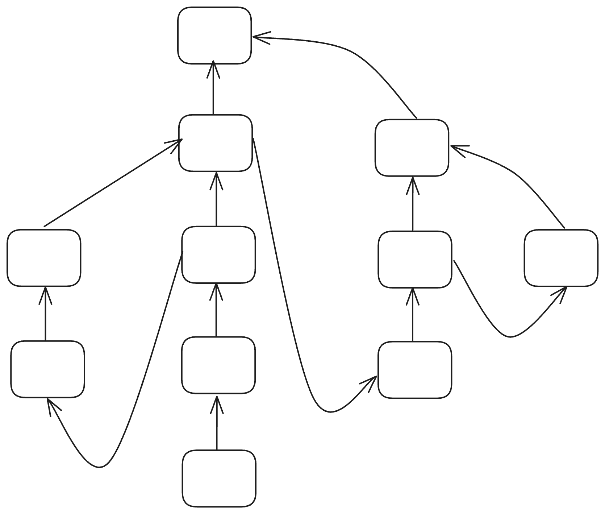
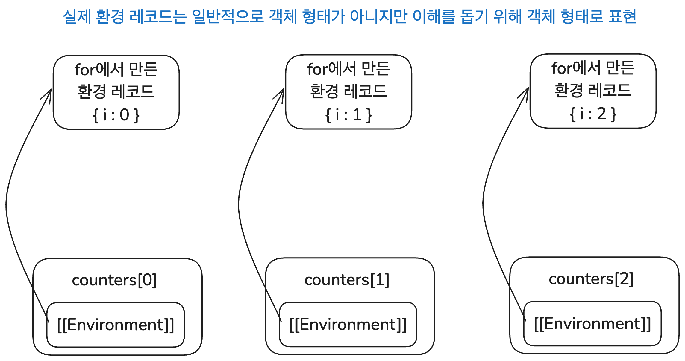
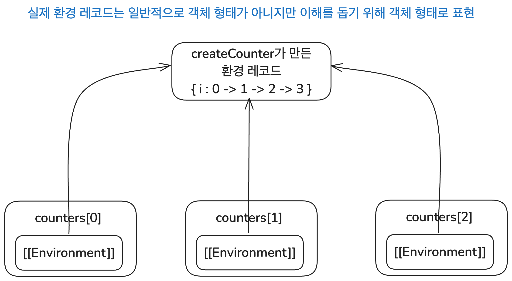

# 이 글은 작성 중입니다.


# 클로저 탐구 시리즈

- [클로저 연대기 1. 클로저의 개념과 응용](https://witch.work/posts/javascript-closure-deep-dive-application)
- [클로저 연대기 2. 클로저의 역사](https://witch.work/posts/javascript-closure-deep-dive-history)

## 시리즈 소개 

> 클로저는 렉시컬 환경에 대한 참조와 함께 묶인 함수의 조합이다.
>
> MDN Web Docs, Closures

JavaScript를 공부하다 보면 클로저라는 말을 한번쯤 듣게 된다. 굉장히 중요하다는 말이 따라올 때도 많다. 그런데 시간이 지나고 클로저에 대해 들은 횟수가 늘어가면서 두 가지 질문이 생겼다.

- 클로저는 무슨 의미이고 무엇을 할 수 있는 걸까?
- 클로저는 대체 어디서 나왔고 어떻게 JavaScript까지 들어가서 이렇게 유명해졌을까?

이 두 가지 질문에 대해 할 수 있는 한 많은 것을 찾아보고 정리하여 두 개의 글을 쓴다. 클로저가 무엇이고 뭘 할 수 있는지에 관해 하나, 클로저의 역사에 관해 하나다. 실용적인 내용은 첫번째 글에 더 많겠지만 개인적으로는 두번째 글에 훨씬 더 많은 시간과 관심을 쏟았다.

- 글에서 사용되는 코드는 특별한 언급이 없는 한 모두 JavaScript로 작성되었다. 단 개념의 설명을 위해 실제 JavaScript 문법과는 다르게 의도된 코드가 있을 수 있는데 이 경우 별도의 설명으로 표시하였다.

# 시작

클로저에 대한 수많은 설명과 정의가 있다. 서문에도 MDN 문서의 정의를 써 놓았으며 많은 JavaScript 책에서도 각자의 정의를 내놓는다. 하지만 나는 내가 배우고 이해한 바를 토대로 JavaScript의 클로저를 이렇게 설명하고자 한다. MDN의 정의를 조금 일반화한 것이다. 또한 역사적으로 클로저라는 용어를 처음 쓴 피터 랜딘 또한 비슷한 정의를 사용했다[^1].

**"클로저는 일급 객체 함수와 렉시컬 스코프를 사용하는 언어에서 표현식의 평가 결과로서 표현식, 그리고 표현식이 평가된 렉시컬 환경에 대한 참조의 묶음이다"**

JavaScript가 바로 일급 객체 함수와 렉시컬 스코프를 사용하는 언어 중 하나이다. 따라서 JavaScript에서도 표현식의 평가 결과는 외부 렉시컬 환경에 대한 참조와 함께 묶인 클로저로 나타난다. 이는 JavaScript의 명세에 의해서도 뒷받침된다.

그리고 표현식이 이렇게 클로저로 평가되기 때문에 표현식은 외부 렉시컬 환경에 대한 정보를 유지하며 접근할 수 있는 객체 혹은 함수가 된다. 이것이 클로저의 다양한 활용으로 이어진다.

이 글에서는 앞서 설명한 내용들을 다룬다. 정리해 보면 다음과 같다.

- 클로저의 개념
  - 클로저가 등장한 배경을 알아보고 앞서 설명한 정의를 다룬다.
- JavaScript 명세상의 클로저
  - JavaScript의 공식 문서인 ECMA-262 명세의 개념들을 토대로 클로저를 설명한다.
- 클로저의 활용
  - JavaScript 코드에서 클로저의 활용 예시와 그 동작원리를 다룬다.

# 클로저의 개념

앞서 나온 정의를 토대로 여러 질문과 답을 해볼 수 있다. 이 섹션에서는 이 답들을 더 자세히 다룰 것이다.

- 어째서 표현식의 평가 결과가 표현식과 렉시컬 환경 참조의 묶음, 즉 클로저가 되어야 하는 것인가?

표현식의 평가를 위해서는 외부 렉시컬 환경에 대한 정보가 필요하기 때문이다.

- 그럼 외부 렉시컬 환경에 대한 정보를 왜 표현식의 평가 결과와 함께 묶을까? 표현식의 값을 확정해 버릴 수는 없을까?

렉시컬 스코프를 사용하는 언어에서 표현식의 평가는 식별자가 "정의된 위치"에 따라 결정된다. 그런데 일급 객체 함수를 지원하는 언어에서는 외부 함수의 렉시컬 환경이 콜스택에서 사라져 버릴 수 있으므로 표현식의 평가 결과와 함께 묶어 저장해 놓아야 한다.

- 그렇다면 클로저의 정보는 어디에 저장될까?

힙에 저장되며 해당 클로저를 외부 렉시컬 환경으로 하는 표현식이 존재하지 않으면 가비지 컬렉팅 대상이 된다.

이 문단에서는 이러한 질문들에 답하고자 한다.

## 표현식의 평가와 클로저

앞서 클로저를 이렇게 설명했다.

> "클로저는 일급 객체 함수와 렉시컬 스코프를 사용하는 언어에서 표현식의 평가 결과로서 표현식, 그리고 표현식이 평가된 렉시컬 환경에 대한 참조의 묶음이다"

클로저는 어떤 표현식의 평가 결과로 만들어지는 대상이라는 것이다. 이 문장의 설명을 위해서는 먼저 표현식의 평가에 대해 생각해 봐야 한다. 잠시 클로저의 정의를 잊고, 표현식을 어떻게 평가할지 생각해 보자.

표현식은 값으로 평가될 수 있는 코드 조각이다. 표현식의 평가란 이 표현식이 만들어내는 값을 계산하는 것이다. 예를 들어 이런 표현식은 `15`로 평가된다.

```js
10 + 2 + 3
```

그런데 정말 이걸로 충분할까? 일반적으로 프로그래밍을 하면서 사용하는 표현식들은 이보다 훨씬 복잡하다. 많은 함수와 다른 표현식들을 사용한다. 앞서 본 `10 + 2 + 3`처럼 그 자체로 값이 나오는 표현식은 오히려 드물다.

예를 들어 이 표현식을 보자. 이 표현식은 그 자체로 값이 결정될 수 있을까?

```js
b = a + 1;
```

이 표현식은 앞서 보았던 `10 + 2 + 3`과 달리 그 자체로 확정된 값을 가질 수 없다. 이 값은 기존에 `a`의 값이 어떻게 정의되었는지에 따라 달라진다. `a`가 1이었다면 표현식의 평가 결과는 2가 될 것이고 JavaScript 기준으로 `a`가 빈 객체였다면 표현식의 평가 결과는 `'[object Object]1'`가 될 것이다.

따라서 위의 표현식의 결과가 나왔다면 그건 그 식 자체의 값이라고 하기 힘들다. `a`가 어떻게 정의되었는지 즉 표현식이 평가될 당시의 주변 환경과 함께 평가된 값으로 봐야 한다. 더 일반적으로 말해서, 표현식의 평가 결과는 일반적으로 표현식만이 아니라 평가된 환경과 함께 묶여야 한다. 그리고 이렇게 묶인 개념이 바로 앞서 말한 클로저이다.

## 클로저의 필요성

클로저가 외부 환경과 함께 묶여서 평가된 표현식의 결과라고 하자. 그런데 굳이 클로저를 사용해서 표현식을 평가할 필요가 있을까? 표현식을 그때그때 평가할 때 외부 환경을 고려하면 되지 않는가?

가령 클로저 같은 게 없는 C언어에서도 외부 환경을 고려해 값을 확정하는 이런 코드를 작성할 수 있다.

```c
// 앞서 본 코드의 역할을 똑같이 하는 C 코드
int a = 1, b;
printf("%d\n", b = a + 1); // 2
a = 5;
printf("%d\n", b = a + 1); // 6
```

시작하며 내렸던 클로저의 정의에서 아직 설명하지 않은 부분이 있다. 바로 "일급 객체 함수와 렉시컬 스코프를 사용하는 언어"라는 말이다. 이게 바로 클로저가 존재하는 이유이며 C와 달리 JavaScript가 클로저를 사용하는 이유이다.

### 일급 객체 함수와 렉시컬 스코프란

일급 객체 함수와 렉시컬 스코프가 무엇인지부터 정리하고 넘어가자.

일급 객체 함수는 프로그래밍 언어 상에서 함수를 다른 데이터 타입 값들처럼 자유롭게 다룰 수 있는 것을 의미한다. 일급 객체 함수를 지원하는 언어에서는 함수를 변수에 할당하거나 자료구조에 저장하고 다른 함수의 인수로 전달하거나 다른 함수의 반환값으로 사용할 수 있다.

렉시컬 스코프는 코드(특히 함수)가 선언된 위치에 따라 스코프가 정적으로 정해지는 것을 뜻한다. 즉 앞서 언급한 "표현식을 평가할 때의 외부 환경"으로 코드가 선언된 위치를 사용한다는 것이다.

다음 코드를 보자. `f`는 어디에서 호출되거나 상관없이 자신이 선언된 위치의 외부 환경인 전역 스코프의 `a` 값을 사용한다.

```js
let a = 2;

function f(){
  console.log(a);
}

function g(){
  let a = 37;
  f();
}
f(); // 2
// g 내부에서 f를 호출하더라도 f는 자신이 선언된 전역 스코프의 a를 사용한다.
g(); // 2
```

### 일급 객체 함수와 렉시컬 스코프가 만드는 문제

그럼 이렇게 일급 객체 함수와 렉시컬 스코프를 사용하는 언어에서는 일반적인 표현식의 평가를 어떻게 해야 할까? 물론 위에서 했던 것처럼 렉시컬 환경을 쓰면 된다. 하지만 단순하게 구현하기에는 2가지 문제가 있다.

현재 거의 모든 언어는 스택 기반으로 메모리를 관리하는데, 이런 언어에서 외부 환경에 접근하기 위해서는 해당 환경을 갖는 함수의 스택 프레임에 접근해야 한다. 이때 스택 프레임이란 매개변수, 지역 변수 등 함수의 실행에 필요한 여러 정보들이 저장되는 영역이며 함수의 호출이 완료되면 메모리에서 사라진다.

그럼 다시 렉시컬 스코프에 대해 설명했던 코드를 보자.

```js
let a = 2;

function f(){
  console.log(a);
}

function g(){
  let a = 37;
  f();
}

f(); // 2
g(); // 2
```

여기서 `g`를 호출하면 `g`가 호출되고 `g` 내부에서 `f`가 호출된다. 그리고 `f`는 자신의 코드를 실행하면서 자신이 선언된 전역 스코프의 `a` 식별자 값을 가져와서 콘솔에 출력하게 된다. 그런데 `f`의 코드는 어떻게 전역 스코프 환경에 접근했을까?

이 문제는 콜스택에서 상위 스택 프레임의 포인터를 가지고 있어서 접근이 가능하다고 하면 해결된다.


하지만 함수가 다른 함수의 인수로 전달될 때는? 혹은 재귀 함수일 때는? 만약 인수로 전달된 함수를 사용하는 함수와 인수로 전달된 함수가 갖는 스택 프레임간의 거리가 너무 길다면 이런 식의 접근은 비효율적이다. 더 나쁜 경우도 있다. 함수가 다른 함수의 반환값으로 사용될 때는 아예 외부 함수의 환경을 갖고 있는 스택 프레임이 사라져 버린다.

JavaScript에서 이런 문제를 보여주는 코드 예시는 다음과 같은 걸 들 수 있다.

```js
// 함수를 다른 함수의 인수로 전달하는 코드
let a = 1;
function f(x){
  console.log(x);
  if(a===0){ return "zero"; }
  return "not zero";
}

function g(callback){
  let a = 0;
  // g와 callback의 스택 프레임간 거리를 멀리 벌리는 코드들이 있다고 생각하자
  return callback();
}

console.log(g(f)); // not zero

// 함수를 다른 함수의 반환값으로 사용하는 코드
function outer(){
  let a = 1;
  function inner(){
    return a;
  }
  return inner;
}
const inner = outer();
console.log(inner()); // 1
```

이런 상황의 콜스택을 그림으로 나타내면 다음과 같을 것이다.


앞서 보았던 C언어에서는 일급 객체 함수를 지원하지 않기 때문에 이런 문제가 없다. 하지만 일급 객체 함수를 지원하며 거기서 파생되는 표현식의 평가에 렉시컬 스코프를 사용해야 하는 JavaScript와 같은 언어에서는 이런 문제가 생기고, 어떻게든 해결해야 한다.

이는 역사적으로 funarg problem이라 불리는 문제였고 두번째 글에서 더 자세히 다루겠지만 표현식의 자유 변수를 어떻게 바인딩할지에 대한 여러 논의를 만들었다. 아무튼 이렇게 일급 객체와 렉시컬 스코프를 사용하는 언어에서 표현식의 평가에 대한 문제를 해결한 게 바로 클로저이다.

## 클로저의 등장

클로저를 사용하면 표현식의 평가 결과로 표현식과 렉시컬 환경에 대한 참조의 묶음을 저장한다. 가령 위에서 보았던 함수를 다른 함수 반환값으로 사용하는 코드를 보자.

```js
function outer(){
  let a = 1;
  function inner(){
    return a;
  }
  return inner;
}
```

`inner` 함수 선언 또한 표현식이다. 클로저를 사용하면 이 `inner` 선언을 평가할 때 `inner`와 `inner`가 선언된 환경인 `outer`의 환경에 대한 참조를 함께 저장한다. 이건 힙에 저장되기 때문에 `inner` 함수가 반환되고 `outer` 함수 호출이 종료되어도 `inner`를 호출할 시 `inner`의 내부에서는 `outer`의 환경에 접근할 수 있다.

여기서 만약 `inner` 함수가 단독으로 선언되었다면 어땠을까? 이런 코드를 말한다.

```js
function inner(){
  return a;
}
```

이 함수를 호출 시 에러가 발생할 것이다. 식별자 `a`가 정의되어 있지 않기 때문이다. 따라서 `inner` 함수의 평가 결과는 `inner` 함수 선언과 `inner` 함수가 선언된 환경(`a` 식별자를 가지고 있어야 할 것이다)에 대한 참조의 묶음이어야 한다. 이것이 바로 클로저이다.

앞서 말했던 것처럼 클로저는 표현식의 평가 결과로서 표현식과 표현식이 평가된 렉시컬 환경에 대한 참조의 묶음이다. 이게 힙에 저장됨으로써 스택 프레임이 없어져도 외부 환경에 대한 정보를 유지할 수 있게 한다. 이는 일급 객체 함수와 렉시컬 스코프를 사용하는 언어에서 표현식의 평가에 대한 문제를 해결하는 방법이다. 표현식을 클로저로 평가함으로써 표현식에 묶인 외부 환경의 관리를 스택 프레임이 아니라 가비지 컬렉터에 맡기는 것이다.

참고로 이렇게 외부에 의존하는 값을 "free"하다고 하며 이렇게 free한 값이 있는 표현식을 "open", free한 값이 없는 표현식을 "closed"라고 한다. 이때 표현식의 평가 결과가 open 상태라면 이를 closed 상태로 만들어 준다는 뜻으로 클로저(closure, 폐쇄)라는 용어를 사용하는 것이다.

## 클로저와 메모리 관리

앞서 클로저는 힙에 저장된다고 했다. 그런데 메모리 상에서는 클로저를 어떻게 관리해야 할까?

클로저로 인한 환경들 간의 연결은 트리와 같은 구조를 하고 있을 것이다. 같은 외부 환경을 공유하는 표현식이 여러 개 있을 수 있기 때문이다. 표현식 간에 같은 외부 환경을 공유하는 가장 단순한 예시로 내부에 중첩 함수가 2개 선언된 함수를 생각해 볼 수 있을 것이다. 물론 반대로 여러 외부 환경에 대한 참조를 갖고 있는 표현식도 있을 수 있다.

아무튼 환경들 간에 연결 예시로 다음과 같은 트리 구조를 생각해 볼 수 있다. 트리의 노드는 각 환경이며, A 환경의 표현식이 다른 외부의 B 환경의 식별자를 사용한다면 A 환경은 B 환경으로 가는 간선(참조)을 갖는다[^2].



이때 이 트리를 이루는 각 환경들의 정보를 언제 가비지 컬렉팅할지는 간단하다. 해당 환경의 식별자를 참조하는 표현식이 없다면 해당 환경은 가비지 컬렉팅 대상이 된다. 해당 객체를 참조하는 곳이 있는지 알기 위한 구현상의 편의를 위해 참조하는 외부 환경으로 향하는 "위쪽 방향" 포인터뿐 아니라 외부 환경이 자신의 식별자를 사용하는 환경으로 향하는 "아래쪽 방향" 포인터도 가질 수 있다.

JavaScript는 참조 카운팅 방식이 아닌 도달 가능성을 기반으로 가비지 컬렉팅을 수행하기는 한다. 하지만 원리는 똑같다. 결국 해당 환경의 식별자를 사용하는 표현식이 있다면 그 환경은 가비지 컬렉팅 대상이 아니게 된다는 건 같기 때문이다.

클로저는 표현식을 평가함으로써 외부 환경에 대한 참조가 유지되도록 한다. 이 표현식이 남아 있는 한 해당 표현식의 외부 환경도 JavaScript 가비지 컬렉터 입장에선 "도달 가능"하게 된다(원리상으로는 외부 환경 전체가 저장되는 것이 맞기는 하다. 다만 V8, SpiderMonkey 등 최신 JavaScript 엔진에서는 외부 환경 전체가 아니라 외부 환경 중 사용되는 식별자만 저장하는 등 최적화를 시행한다).

단 이는 의도치 않게 메모리 누수를 일으키는 원인이 될 수 있다. 더 이상 사용하지 않는 표현식, 특히 외부 환경의 식별자를 사용하는 표현식을 메모리에 남겨 두게 되면 해당 환경이 사용하는 외부 환경 또한 메모리에 남게 되기 때문이다. 다만 이렇게 메모리를 사용하는 것 자체는 클로저의 특성이며, 클로저를 사용하는 개발자가 이를 인지하고 적절히 관리해야 한다.

# JavaScript 명세상의 클로저

이런 개념은 JavaScript 명세인 ECMA-262에도 어느 정도 나타나 있다. 스코프 체인을 이용해서 어떻게 외부 환경에 대한 접근을 하는지 그리고 그 결과로 무엇을 반환하는지를 보면 된다.

물론 이제부터 설명할 실행 컨텍스트나 환경 레코드 등의 객체들은 실제 코드에서 접근할 수는 없기에 실제 클로저의 활용과 연관은 없다. 하지만 모든 JavaScript 구현체가 지켜야 하는 명세상의 정보에도 앞서 본 것과 같은 클로저가 존재한다는 것을 알 수 있다.

이번에도 꼬리무는 질문으로 시작해본다.

- JavaScript에서 표현식의 평가 결과는 클로저인가?

그렇다. ECMA-262 명세에서는 표현식에 있는 식별자 값을 평가할 때 `ResolveBinding`을 사용하며 그 결과는 해당 식별자의 이름과 식별자가 속한 환경에 대한 참조를 가지기 때문이다. 이는 앞서 내린 클로저에 대한 정의와 일치한다.

- 그럼 식별자의 평가 결과는 어떻게 만들어지는가?

환경 레코드와 식별자를 인수로 받는 `GetIdentifierReference`를 이용해 만들어진다. 이는 주어진 환경 레코드에서 렉시컬 스코프 체인을 따라 올라가면서 식별자를 찾고, 식별자를 찾으면 해당 환경과 식별자를 묶어 리턴한다.

- 그때 쓰이는 스코프 체인의 외부 렉시컬 환경 참조는 어디에 저장되는가?

함수 선언 등 새로운 스코프를 만드는 표현식이 평가될 때는 환경 레코드가 새로 만들어진다. 여기의 `[[OuterEnv]]` 필드에 해당 스코프의 외부 렉시컬 환경 참조가 저장된다. 함수 객체가 사용하는 렉시컬 환경의 경우 `[[Environment]]` 내부 슬롯에 저장된다.

- 그럼 이것은 어떻게 사용되는가?

식별자 평가 시, 실행 중인 실행 컨텍스트의 LexicalEnvironment에서 시작해서 `[[OuterEnv]]`를 따라 올라가며 식별자를 탐색한다.

정리하자면, ECMA-262 명세 상에서도 표현식의 평가 결과는 식별자의 평가 결과에 포함된 렉시컬 환경 참조를 포함한다. 외부 렉시컬 환경에 대한 참조도 내부 슬롯을 통해 유지된다. 앞서 보았던 클로저의 원리와 정의에 대한 내용과 일치한다!

그럼 다시 처음으로 돌아가서 실행 컨텍스트에 관한 내용부터 다시 되짚어 올라와보자.

**글의 주제를 너무 벗어나지 않기 위해 명세에 서술된 모든 부분을 설명하지는 않았다. 생략된 부분에 대해서는 주석의 명세 링크들을 참고할 수 있다.**

## 실행 컨텍스트와 환경 레코드

먼저 실행 컨텍스트와 환경 레코드에 대해 알아보자.

실행 컨텍스트에 관해서만 해도 많은 내용이 있다. 하지만 여기서는 호이스팅, `this` 등을 생략하고 오로지 글의 주제인 클로저에 관련된 부분만 다룬다.

실행 컨텍스트는 JavaScript 엔진이 실행할 코드에 대한 환경 정보를 가지고 코드의 런타임 평가를 추적하기 위해 사용하는 객체이다. 명세상 실행 컨텍스트가 스택 프레임과 완전히 똑같은 건 아니지만[^3] 글의 주제에 관한 부분에 대해서는 함수 호출시 함수에 필요한 정보를 가지고 스택에 쌓이는 스택 프레임과 비슷하다고 볼 수 있다.

이때 콜스택의 최상위에서 실행되고 있는 실행 컨텍스트를 "실행 중인 실행 컨텍스트(running execution context)"라고 한다. 에이전트(브라우저 탭과 같은 걸 생각할 수 있다)당 코드를 실행하고 있는 실행 컨텍스트는 하나만 존재할 수 있다. 그리고 함수 호출 등으로 인해 새로운 실행 컨텍스트가 생성되면 스택의 최상위에 올라가서 실행 중인 실행 컨텍스트가 된다.

그리고 실행 컨텍스트가 가지고 있는 정보들 중 클로저에 관련된 것은 다음과 같다[^4]. 실행 컨텍스트가 갖는 다른 정보들은 [Execution Context의 명세](https://tc39.es/ecma262/#sec-execution-contexts)에서 볼 수 있다.


우리가 중요하게 봐야 할 것은 LexicalEnvironment이다. 클로저는 결국 외부 렉시컬 환경에 대한 참조를 표현식과 묶어서 평가한다는 것일 뿐이고, 이때 이 외부 렉시컬 환경에 대한 참조를 담당하는 것이 LexicalEnvironment이기 때문이다.

- LexicalEnvironment: 실행 컨텍스트 내에서 실행되는 코드의 식별자 참조를 분석할 때 사용하는 환경 레코드

그럼 환경 레코드란 뭘까?

환경 레코드는 렉시컬 스코프 구조에 따라 식별자와 값의 바인딩 정보를 기록하는 명세 타입이다. 함수 선언 등 스코프를 생성하는 구문을 평가할 때 생성되며 당연히 렉시컬 환경을 사용한다. 그리고 모든 환경 레코드는 `[[OuterEnv]]` 필드를 가지고 있고 이는 `null`이거나 외부 환경 레코드에 대한 참조이다. `[[OuterEnv]]`가 `null`인 환경 레코드는 전역 환경 레코드이다. 더 자세한 설명은 [ECMA-262, 9.1 Environment Records](https://tc39.es/ecma262/multipage/executable-code-and-execution-contexts.html#sec-executable-code-and-execution-contexts) 명세를 참고하자.

지금까지 다룬 내용을 함수에 대해서만 보자. 실행 컨텍스트는 함수가 호출될 때 생성되어 콜스택의 최상위에 쌓인다. 함수가 호출되면서 생성된 실행 컨텍스트가 가지고 있는 환경 레코드 정보는 해당 함수 선언이 처음 평가될 때의 렉시컬 환경에 기반한다.

### 환경 레코드와 함수

그런데 의문이 든다. 환경 레코드는 분명 함수를 호출할 때 생성된다고 했다. 하지만 이때 생성된 환경 레코드는 `[[OuterEnv]]`로 함수가 정의된 렉시컬 환경을 가지고 있어야 한다. 어떻게 이게 가능할까?

이는 함수 객체가 자신이 정의된 환경의 레코드에 대한 참조를 내부 슬롯 `[[Environment]]`에 가지고 있기 때문이다(ES3까지는 `[[Scope]]`였다). 함수 호출 시 생성되는 환경 레코드가 `[[OuterEnv]]`를 갖는 과정은 다음과 같다.

JavaScript 엔진은 함수 선언문을 평가하여 함수 객체를 생성할 때 현재 실행 중인 실행 컨텍스트의 렉시컬 환경을 내부 슬롯 `[[Environment]]`에 저장한다[^5]. 달리 말하면, 자신이 선언된 환경에 대한 참조를 내부적으로 저장한다. 이때 환경을 복사해 저장하는 것이 아니라 참조를 저장하는 것이기 때문에 해당 외부 환경이 변화하면 이를 그대로 반영한다.

이후 함수가 호출될 때는 해당 함수 객체(`F`라고 하자)를 이용해 새로운 실행 컨텍스트와 환경 레코드를 생성한다. 이때 생성된 환경 레코드의 `[[OuterEnv]]`는 `F`의 `[[Environment]]`를 참조한다[^6].

즉 함수 객체는 생성될 때 자신이 생성된 환경을 기억하며, 함수 호출 시 이를 이용해 새로운 환경 레코드를 생성한다. 이렇게 함수 객체는 호출되어 실행되면서 자신이 생성될 때의 렉시컬 환경을 참조할 수 있게 된다. 또한 해당 렉시컬 환경을 생성한 실행 컨텍스트가 스택에서 사라져도 함수 객체가 여전히 그 렉시컬 환경에 대한 참조를 가지고 있기 때문에 렉시컬 환경은 가비지 컬렉팅 대상이 되지 않는다.

참고로 클로저의 개념을 설명할 때 같은 외부 환경을 공유하는 표현식이 여러 개 있을 수 있다고 했는데 이는 JavaScript 명세에서도 마찬가지다. 하나의 실행 컨텍스트 맥락에서 여러 함수가 정의되어 있다면 이들은 같은 외부 환경을 공유한다.

## 표현식의 평가 결과

어떻게 환경 레코드 간의 연결을 하는지 알아보았다. 그럼 명세상에서 표현식의 결과를 어떤 형식으로 설명하며 어떻게 표현식을 평가해서 해당 결과를 얻는지 알아봐야 한다. 이게 클로저의 핵심이기 때문이다.

표현식의 평가는 명세에서 `EvaluateXXX`함수 혹은 각 개념 섹션에서 `Runtime Semantics: Evaluation`파트에 나와 있다. 이때 모든 표현식의 평가 결과는 Completion Record라는 객체로 나타낸다[^7]. 그리고 이 객체는 표현식의 평가에 쓰였을 경우 평가의 완료 상태(정상, 예외, 중단 등)인 `[[Type]]` 필드와 평가된 표현식의 결과를 나타내는 `[[Value]]` 필드를 가진다[^8].

그리고 표현식을 구성하는 요소 중 식별자의 평가 결과는 `ResolveBinding`을 통해 나오는데 이 결과는 Reference Record를 `[[Value]]` 필드로 포함하는 Completion Record이다[^9]. Reference Record란 분석된 식별자나 프로퍼티 바인딩을 나타내는 데 사용되는 타입이며 다음과 같은 필드를 가진다[^10].

- `[[Base]]`: 식별자 바인딩을 가지고 있는 값 혹은 환경 레코드
- `[[ReferencedName]]`: 분석된 식별자 이름

즉 ECMA-262 명세에서도 식별자의 평가 결과는 단순히 값으로 나오는 게 아니라 식별자 이름 그리고 식별자에 대한 바인딩을 가지고 있는 환경의 묶음으로 나타난다.

구체적인 값을 찾기 위해서는 Reference Record의 `GetValue` 연산을 사용한다. 이는 `[[Base]]` 환경 레코드에서 해당 식별자 바인딩을 찾는 방식으로 실제 값을 찾아낸다[^11].

## 표현식의 평가

그럼 이런 대상들을 이용하여, 표현식 그 중에서도 식별자의 평가는 구체적으로 어떻게 이루어질까? 

ECMA-262 명세에서 식별자는 `ResolveBinding`을 사용해 평가된다. 이때 인수로는 식별자의 문자열 값(변수명, 함수명 등)이 들어간다[^12]. 명세의 문장은 다음과 같다.

```
ResolveBinding(StringValue of Identifier)
```

이렇게 식별자의 문자열 값이 전달된 `ResolveBinding`은 다음과 같은 과정을 거쳐 식별자의 바인딩을 찾아낸다[^13][^14]. 값이 정상적으로 평가되었을 경우 Reference Record를 포함하는 Completion Record를 반환한다.

1. 현재 실행 중인 실행 컨텍스트의 LexicalEnvironment를 `env`로 한다.
2. `env`와 식별자의 이름인 `name`을 인수로 `GetIdentifierReference`를 호출한다.
3. 만약 `env` 환경 레코드에 `name`의 바인딩이 있을 경우 다음과 같은 형태의 Reference Record를 반환한다.
```js
{
  [[Base]]: env,
  [[ReferencedName]]: name
}
```
4. `env`에 `name` 바인딩이 없을 경우 `env.[[OuterEnv]]`를 `env`로 하고 2단계로 돌아가서 다시 시도한다.

## 정리

지금까지 보았던 ECMA-262 명세상의 표현식의 평가 과정과 이를 통해 나오는 클로저를 정리해보자.

1. 표현식의 식별자에 대한 평가는 실행 중인 실행 컨텍스트의 LexicalEnvironment에서 시작
2. 해당 환경에서 식별자에 대한 바인딩을 탐색
3. 바인딩을 찾으면 해당 환경과 식별자의 이름을 Reference Record로 묶어 반환
  - 이 Reference Record란 식별자의 이름과 식별자 바인딩을 가지고 있는 환경 레코드에 대한 참조로 구성됨
4. 해당 환경에서 식별자를 찾지 못하면 `[[OuterEnv]]`로 이동하여 다시 식별자 바인딩 탐색
  - 이 `[[OuterEnv]]`는 함수 객체의 내부 슬롯 등을 통해 렉시컬 환경을 따라감
5. 이러한 과정을 통해 표현식의 평가 결과는 Reference Record를 포함하는 Completion Record로 나타남
  - 즉 평가 결과는 표현식과 표현식(을 이루는 식별자)이 평가된 렉시컬 환경에 대한 참조의 묶음이고 앞서 정의한 클로저와 같음

## JavaScript 코드

그럼 이걸 기반으로 앞서 보았던 코드를 다시 보자. 이 코드는 어떤 과정을 거쳐 평가될까?

```js
function outer(){
  let a = 1;
  function inner(){
    return a;
  }
  return inner;
}

const inner = outer();
console.log(inner()); // 1
```

먼저 전역 실행 컨텍스트가 만들어지고 실행된다. 이때 식별자 `outer`가 등록되고 `outer` 함수 객체가 생성된다. 이 함수 객체는 자신이 생성된 렉시컬 환경을 `[[Environment]]`에 저장한다.

`outer` 함수가 호출되면 새로운 실행 컨텍스트가 생성된다. 여기서 식별자 `a`와 `inner`가 등록되고 `a`의 바인딩이 `1`로 설정된다. 그리고 `inner` 함수 객체가 생성되고 이 함수 객체 또한 자신이 생성된 렉시컬 환경(`outer` 내부의 환경)을 `[[Environment]]`에 저장한다. 그리고 `inner` 함수 객체가 반환된다.

`outer`가 종료되면서 `outer`의 실행 컨텍스트는 스택에서 사라진다. 하지만 `outer`에서 리턴한 함수 객체가 여전히 해당 렉시컬 환경을 참조하고 있기 때문에 `outer`의 렉시컬 환경은 가비지 컬렉팅 대상이 되지 않는다.

그다음 `outer`에서 리턴한 `inner` 함수 객체가 `inner`에 할당되고 `inner` 함수가 호출된다. 그럼 `inner` 함수의 실행 컨텍스트가 생성되고 `inner`의 함수 객체가 기억하고 있던 렉시컬 환경을 이용해 `a`의 바인딩을 찾아내어 `1`을 반환한다.

# 클로저의 활용

앞서 클로저는 표현식의 평가 결과이며 표현식과 렉시컬 환경에 대한 참조의 묶음이라고 했다. 그리고 이것이 일급 객체 함수와 렉시컬 스코프를 사용하는 언어에서 필요한 개념이며 JavaScript의 ECMA-262 명세에서도 엿볼 수 있는 개념이라는 것을 보았다.

이 점은 클로저의 활용에도 영향을 미친다. 어떤 표현식의 결과로 나온 객체를 사용할 때 해당 객체가 선언된 렉시컬 환경에 대한 참조를 함께 사용할 수 있다는 뜻이기 때문이다. 즉 클로저를 사용한다는 것은 어떤 표현식을 사용할 때 해당 표현식이 평가된 렉시컬 환경의 정보를 사용한다는 뜻이다.

이를 이용하는 방법은 몇 가지 있다.

- 정보 은닉

표현식이 평가된 외부 렉시컬 환경을 만든 함수가 이미 종료되었을 경우, 해당 환경에 접근할 수 있는 건 그 렉시컬 환경을 기억하고 있는 표현식뿐이다. 이를 이용해서 외부로 노출되지 않아야 하는 정보를 숨기는 데 사용할 수 있다.

- 정보 전달

다른 함수의 내부에 있는 함수는 평가될 때 외부 렉시컬 환경을 기억하고 있다. 여기에는 함수의 인수나 상태 등이 포함된다. 이를 이용해서 특정 환경을 기억하고 있는 함수를 만들 수 있다. 고차 함수, 커링 등이 여기에 해당한다.

- 정보 추적

함수의 실행 횟수나 순서, 상태 등 내부적으로 추적해야 하는 정보를 클로저에 저장해 두는 방식이다.

그럼 이 섹션에서는 이러한 활용들을 실제 코드를 통해 살펴보고, 클로저가 어떻게 사용된 것인지 알아본다.

## 정보 은닉

클로저를 이용하면 외부 스코프에서 접근할 수는 없지만 내부 함수를 통해서는 접근 가능한 데이터를 만들 수 있다. 예를 들어 다음의 `makeCounter`는 외부에서 직접 접근할 수는 없는 상태를 가진 카운터를 만든다[^15].

```js
const makeCounter = function () {
  let privateCounter = 0;
  function changeBy(val) {
    privateCounter += val;
  }
  return {
    increment() {
      changeBy(1);
    },

    decrement() {
      changeBy(-1);
    },

    value() {
      return privateCounter;
    },
  };
};
```

이 함수에서 반환한 객체의 `increment`, `decrement`, `value` 식별자에 연결된 함수 객체는 `[[Environment]]` 내부 슬롯을 통해 `makeCounter` 함수가 실행될 때의 렉시컬 환경을 참조한다. 이 렉시컬 환경은 각 메서드들이 실행될 때 만들어지는 환경 레코드의 `[[OuterEnv]]` 필드에 연결된다. 따라서 `privateCounter`에 접근할 수 있다.

하지만 `makeCounter`는 이미 종료되었다. 따라서 해당 함수가 반환한 객체를 통해서만 `privateCounter`에 접근할 수 있다. 또한 `makeCounter` 함수가 실행될 때마다 실행 컨텍스트가 새로 만들어지고 따라서 렉시컬 환경도 새로 만들어지기 때문에 각각의 카운터 객체는 서로 다른 `privateCounter`를 갖게 된다.

private와 같은 기능을 흉내내기 위해 클로저를 사용하는 것을 모듈 디자인 패턴을 따른다고 한다. 이렇게 클로저를 이용해 외부에 노출되지 않아야 하는 정보를 숨기는 것이다. ES6이 나오기 이전 시기, JavaScript에 클래스도 없었고 비공개 프로퍼티를 선언할 수 있는 방법도 없었던 시절 클로저를 이용해 정보를 은닉하는 방법을 많이 사용했다.

### 외부 접근 막기

문제는 이렇게 하더라도 반환된 객체의 메서드를 덮어씌움으로써 다른 동작을 하도록 할 수 있다는 것이다. 이를 막기 위해서는 리턴하는 객체에 getter만 정의하고 객체를 `Object.freeze`로 불변하게 만드는 방법을 사용할 수 있다.

```js
const makeCounter = function () {
  let privateCounter = 0;
  function changeBy(val) {
    privateCounter += val;
  }
  return Object.freeze({
    increment() {
      changeBy(1);
    },

    decrement() {
      changeBy(-1);
    },

    get value() {
      return privateCounter;
    },
  });
};
```

좀 더 심화된 모듈 패턴에 대해서는 참고 섹션의 JavaScript 도서들을 참고할 수 있다.

## 정보 전달

TODO: 내부 동작 설명

클로저가 기억하는 렉시컬 환경에는 외부 함수가 받았던 인자, 상태 등이 포함된다. 이를 이용해서 함수가 실행될 때 필요한 정보를 전달할 수 있다. 이는 함수가 실행될 때마다 같은 정보를 전달해야 하는 경우에 유용하다.

### 고차 함수

고차 함수는 함수를 인자로 받거나 연산의 결과로 함수를 반환하는 함수이다. 클로저를 이용해서 정보를 저장하는 것의 또다른 대표적인 예시라고 할 수 있다.

이는 비슷한 동작을 하는 다양한 이벤트를 만들어야 하는 웹 프로그래밍에서 활용될 수 있다. 예를 들어서 색상을 받아서 화면 배경을 해당 색상으로 바꾸는 이벤트를 만드는 함수를 만들어야 한다고 하자.

```js
const makeColorChanger = function (color) {
  return function () {
    document.body.style.backgroundColor = color;
  };
};

const changeToRed = makeColorChanger('red');
const changeToBlue = makeColorChanger('blue');
// 버튼에 이벤트 리스너를 달아서 클릭할 때마다 배경색이 바뀌도록 한다.
document.getElementById('redButton').addEventListener('click', changeToRed);
document.getElementById('blueButton').addEventListener('click', changeToBlue);
```

`makeColorChanger`가 실행될 당시의 환경에는 전달된 인수 `color`가 있다. 그리고 반환된 함수는 클로저에 저장된 `color`에 접근할 수 있다. 생성되는 함수에 특정 정보를 전달하기 위한 용도로 클로저를 사용한 것이다.

고차 함수뿐 아니라 스코프가 중첩되는 곳 어디든지 이렇게 클로저를 통한 정보 전달이 가능하다. JavaScript는 블록 스코프를 사용하며 모듈 또한 자신의 스코프를 갖기 때문에 블록과 모듈에서도 가능하다. 예를 들어서 다음과 같이 블록에서 클로저를 통해 정보를 전달할 수 있다.

```js
let getX;
{
  let x = 1;
  getX = function () {
    return x;
  };
}
console.log(getX()); // 1
console.log(x); // ReferenceError: x is not defined
```

### 부분 적용 함수와 커링

이게 활용되는 대표적인 예시로 부분 적용 함수가 있다. 부분 적용 함수란 N개의 인자를 받는 함수에 미리 M개의 인자만 넘겨 기억시킨 함수이다. 부분 적용 함수가 사용될 때는 (N-M)개의 인자만 넘겨주면 된다. 다음은 유명한 오픈소스인 `es-toolkit`의 부분 적용 함수이다[^16].

```js
export function partial<F extends (...args: any[]) => any>(func: F, ...partialArgs: any[]): F {
  return function (this: any, ...providedArgs: any[]) {
    const args: any[] = [];

    let startIndex = 0;
    for (let i = 0; i < partialArgs.length; i++) {
      const arg = partialArgs[i];

      if (arg === partial.placeholder) {
        args.push(providedArgs[startIndex++]);
      } else {
        args.push(arg);
      }
    }
    for (let i = startIndex; i < providedArgs.length; i++) {
      args.push(providedArgs[i]);
    }

    return func.apply(this, args);
  } as any as F;
}

const partialPlaceholder: unique symbol = Symbol('partial.placeholder');
partial.placeholder = partialPlaceholder;
```

`partial`을 통해서 만들어지는 함수는 자신이 만들어질 때의 렉시컬 환경을 기억하고 있고, 여기에는 `partial`이 받았던 인수들이 포함된다. 따라서 `partial`이 리턴한 함수가 실행될 때는 자연스럽게 클로저가 기억하는 렉시컬 환경을 통해 `partial`이 받았던 인수들을 사용할 수 있다.

`partial.placeholder`를 통해 미리 제공된 인자가 사용될 위치를 결정할 수 있는 것도 볼 수 있다.

또다른 예시로는 커링이 있다. 커링은 여러 개의 인자를 받는 함수를 하나의 인자만 받는 함수로 나눠서 순차적으로 호출될 수 있게 구성한 것이다. 이때 중간 과정상의 함수는 다음 인자를 받기 위해 대기할 뿐이다. 따라서 필요한 정보가 들어올 때마다 함수에 전달하고, 모든 인자가 들어오면 최종 결과를 반환하는 방식의 지연 실행이 필요할 때 사용할 수 있다.

## 정보 추적

앞서 다룬 정보 전달의 연장으로, 함수에 대해 내부적으로 추적해야 하는 정보를 클로저에 저장해 둘 수 있다. 대부분 고차 함수를 다루는 경우이다.

함수 객체는 자신이 생성될 때의 렉시컬 환경을 기억하는데 이는 환경에 대한 참조이기 때문에 해당 환경의 변화를 반영하는 걸 이용한다. 함수가 실행될 때 해당 환경을 사용하도록 하고, 또한 함수 실행이 특정 조건을 만족할 시 해당 환경에 변화를 일으키도록 하여 함수에 대한 메타 정보를 저장할 수 있다.

### 실행 제한

가장 간단한 예시로는 함수의 실행 횟수를 제한하는 것이다. 예를 들어 `once`라는 고차 함수를 통해 주어진 함수의 기능을 하면서 딱 한 번만 실행되는 함수를 만들 수 있다[^17].

```js
export function once(func) {
  let called = false, cache;

  return function (...args) {
    if (!called) {
      called = true;
      cache = func(...args);
    }

    return cache;
  };
}
```

비슷한 예시로 클로저에 인스턴스를 저장하고 생성자를 재정의하는 방식으로 싱글톤 패턴을 구현할 수도 있다.

```js
function Singleton() {
  let instance;
  Singleton = function () {
    return instance;
  };
  Singleton.prototype = this;
  instance = new Singleton();
  instance.constructor = Singleton;
  // 이외의 생성자 초기화 코드
  return instance;
}
```

### 상태 추적

TODO: react-query의 createNotifyManager, react의 useState 등 상태 관리 라이브러리에서도 클로저를 이용해 내부 상태를 추적하는 방식을 사용한다.

진짜 상태 관리 라이브러리인 zustand 등에서도 마찬가지

## 클로저의 주의사항

클로저에 대한 이야기를 할 때 흔히 주의해야 한다고 언급되는 지점이 있다. ES6 이전의 JavaScript에서는 함수 스코프를 사용한다는 것이다. 다음과 같은 코드를 보자.

```js
function createCounters() {
  const counters = [];
  
  for (var i = 0; i < 3; i++) {
    counters.push(function() {
      return i;
    });
  }
  
  return counters;
}

const counters = createCounters();
console.log(counters[0]()); // 예상 값: 0, 실제 값: 3
console.log(counters[1]()); // 예상 값: 1, 실제 값: 3
console.log(counters[2]()); // 예상 값: 2, 실제 값: 3
```

`let`이나 `const`를 사용하면 이런 문제가 없다는 사실은 잘 알려져 있다. 그런데 그보다는 이런 문제는 대체 왜 발생하는 것일까? "함수 스코프를 사용한다"는 앞선 언급에 답이 있다. `var`를 사용하는 구문에서는 블록 구문이 새로운 환경을 만들지 않는다는 것이다.

위 코드에서 `counters` 배열에 저장되는 함수들이 기억하는 렉시컬 환경이 어떤 것일지 생각해 보자. 블록 스코프를 기반으로 생각한다면 우리는 `counters` 배열의 각 함수들이 `i` 식별자가 각각 0, 1, 2인 환경을 기억하고 있기를 기대한다. `let`을 사용했다면 이렇게 동작할 것이다.



하지만 위처럼 `var`를 사용할 경우 `counters` 배열의 함수들이 기억하는 렉시컬 환경은 `createCounters`가 만든 함수 스코프이다. 그리고 이 스코프에서 `i`의 값은 `for`문의 실행에 따라 최종적으로 3으로 변한다. 따라서 `counters` 배열의 각 함수들이 기억하는 `i`의 값은 모두 3이 된다.



이러한 문제를 해결하기 위해서는 의도한 대로 `i`값을 기억하도록 하면 된다. 앞서 언급한 `let`이나 `const`를 사용하는 방법 외에도 방법은 있다. `var`를 사용할 경우 즉시 실행 함수를 사용하여 새로운 함수 스코프를 만들어 줄 수 있다.

```js
function createCounters() {
  const counters = [];
  
  for (var i = 0; i < 3; i++) {
    (function (i) {
      counters.push(function() {
        return i;
      });
    })(i);
  }
  
  return counters;
}
```

# 참고

- 도서/논문

D. A. Turner, "Some History of Functional Programming Languages", 2012

https://www.cs.kent.ac.uk/people/staff/dat/tfp12/tfp12.pdf

Joel Moses, "The Function of FUNCTION in LISP, or Why the FUNARG Problem Should be Called the Environment Problem", 1970

https://dspace.mit.edu/handle/1721.1/5854

P. J. Landin, "The mechanical evaluation of expression", 1964

https://www.cs.cmu.edu/~crary/819-f09/Landin64.pdf

정재남, "코어 자바스크립트", 위키북스

https://product.kyobobook.co.kr/detail/S000001766397

이웅모, "모던 자바스크립트 Deep Dive", 위키북스, 23장 - 24장

https://wikibook.co.kr/mjs/

스토얀 스테파노프 지음, 김준기, 변유진 옮김, "자바스크립트 코딩 기법과 핵심 패턴", 인사이트

https://product.kyobobook.co.kr/detail/S000001032919

- ECMA-262 명세/MDN/Wikipedia 등 공식에 가까운 문서

MDN Web Docs, 클로저

https://developer.mozilla.org/ko/docs/Web/JavaScript/Closures

MDN Web Docs, 표현식과 연산자

https://developer.mozilla.org/ko/docs/Web/JavaScript/Guide/Expressions_and_operators

Wikipedia, First-class function

https://en.wikipedia.org/wiki/First-class_function

Wikipedia, Scope (computer science)

https://en.wikipedia.org/wiki/Scope_(computer_science)

ECMA 262 9.1 Environment Records 명세

https://tc39.es/ecma262/#sec-environment-records

ECMA 262 9.4 Execution Contexts 명세

https://tc39.es/ecma262/#sec-execution-contexts

- 이외 온라인상의 자료

Stack Frame과 Execution Context는 같은 개념일까?

https://onlydev.tistory.com/158

함수는 어디까지 접근 가능한가? - Closure와 this 이해하기

https://www.oooooroblog.com/posts/90-js-this-closure

Lexical Environment로 알아보는 Closure

https://coding-groot.tistory.com/189

TOAST UI, 자바스크립트의 스코프와 클로저

https://ui.toast.com/weekly-pick/ko_20160311

자바스크립트 실행 컨텍스트와 클로저. 실행 컨텍스트와 환경 레코드의 명세 그리고 구체적인 코드와 여러 토막 지식까지 정리된 좋은 글

https://jaehyeon48.github.io/javascript/execution-context-and-closure/

이도경 님의 블로그 "Execution Context" 실행 컨텍스트에 대한 더 자세한 명세와 시간에 따른 변화가 기술되어 있다.

https://velog.io/@shroad1802/Execution-Context-19pf2k6t

자바스크립트의 실행 컨텍스트 톺아보기. 약간 예전 정보를 담고 있지만 실행 컨텍스트를 자세히 다루고 있는 글 중 하나

https://velog.io/@ctdlog/%EC%9E%90%EB%B0%94%EC%8A%A4%ED%81%AC%EB%A6%BD%ED%8A%B8%EC%9D%98-%EC%8B%A4%ED%96%89-%EC%BB%A8%ED%85%8D%EC%8A%A4%ED%8A%B8

[React Query] useQuery 동작원리(1)

https://www.timegambit.com/blog/digging/react-query/01

Does LexicalEnvironment’s `[[outerEnv]]` refer to the VariableEnvironment(of same Execution Context)

https://stackoverflow.com/questions/70279115/does-lexicalenvironment-s-outerenv-refer-to-the-variableenvironmentof-same

[번역] 심층 분석: React Hook은 실제로 어떻게 동작할까?

https://hewonjeong.github.io/deep-dive-how-do-react-hooks-really-work-ko/

[^1]: P. J. Landin, "The mechanical evaluation of expression", 1964

[^2]: Joel Moses, "The Function of FUNCTION in LISP, or Why the FUNARG Problem Should be Called the Environment Problem", 1970, 11p Figure 4 참고

[^3]: 함수 호출에 따라서 쌓이는 스택 프레임과 달리 실행 컨텍스트는 ES6부터 블록에 의해서도 생성된다. 그리고 스택 프레임은 콜스택 관리를 위한 정보, 예를 들어 함수 호출이 끝난 뒤 돌아갈 리턴 주소값 등이 저장되지만 실행 컨텍스트는 오로지 코드의 실행을 위한 정보만 담기는 등의 차이가 있다. [Stack Frame과 Execution Context는 같은 개념일까?](https://onlydev.tistory.com/158) 등의 자료를 참고할 수 있다.

[^4]: https://tc39.es/ecma262/#table-additional-state-components-for-ecmascript-code-execution-contexts

[^5]: ECMA-262 명세의 "10.2.11 FunctionDeclarationInstantiation", "8.6.1 Runtime Semantics: InstantiateFunctionObject", "10.2.3 OrdinaryFunctionCreate" 등 참고

[^6]: ECMA-262 명세의 "10.2.1.1 PrepareForOrdinaryCall", "9.1.2.4 NewFunctionEnvironment" 참고

[^7]: ECMA-262 8.1 Runtime Semantics: Evaluation https://tc39.es/ecma262/multipage/syntax-directed-operations.html#sec-evaluation

[^8]: ECMA-262 6.2.4 The Completion Record Specification Type https://tc39.es/ecma262/multipage/ecmascript-data-types-and-values.html#sec-completion-record-specification-type

[^9]: ECMA-262 9.4.2 ResolveBinding(name[, env]) https://tc39.es/ecma262/#sec-resolvebinding

[^10]: ECMA-262 6.2.5 The Reference Record Specification Type https://tc39.es/ecma262/#sec-reference-record-specification-type

[^11]: ECMA-262 6.2.5.5 GetValue(V) https://tc39.es/ecma262/#sec-getvalue

[^12]: ECMA-262 13.1 Identifiers - 13.1.3 Runtime Semantics: Evaluation https://tc39.es/ecma262/#sec-identifiers-runtime-semantics-evaluation

[^13]: ECMA-262 9.4.2 ResolveBinding(name[, env]) https://tc39.es/ecma262/#sec-resolvebinding

[^14]: ECMA-262 9.1.2.1 GetIdentifierReference(env, name, strict) https://tc39.es/ecma262/#sec-getidentifierreference

[^15]: https://developer.mozilla.org/en-US/docs/Web/JavaScript/Closures#emulating_private_methods_with_closures 원래 출처는 더글라스 크록포드, "자바스크립트 핵심 가이드", 2008

[^16]: es-toolkit의 partial 공식 문서, https://es-toolkit.slash.page/ko/reference/function/partial.html

[^17]: es-toolkit의 once 공식 문서, https://es-toolkit.slash.page/ko/reference/function/once.html