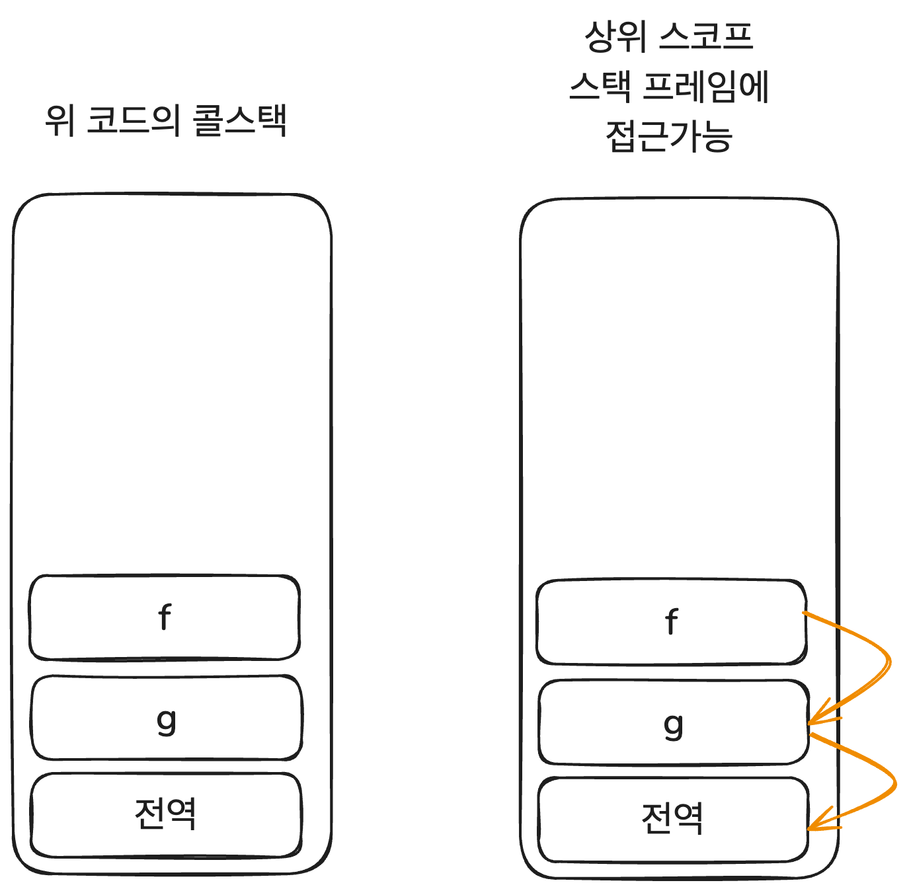
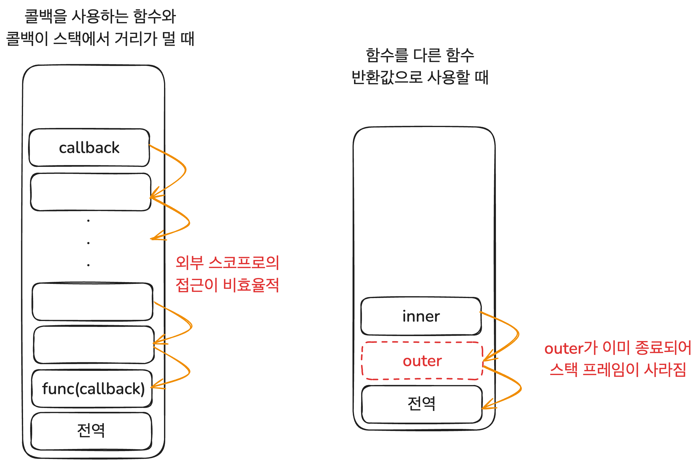
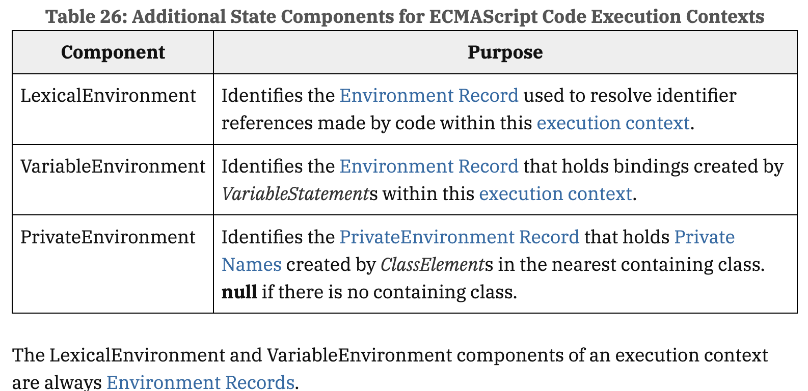

# 이 글은 작성 중입니다.


# 클로저 탐구 시리즈

- [클로저 연대기 1. 클로저의 개념과 응용](https://witch.work/posts/javascript-closure-deep-dive-application)
- [클로저 연대기 2. 클로저의 역사](https://witch.work/posts/javascript-closure-deep-dive-history)

# 서문

> 클로저는 렉시컬 환경에 대한 참조와 함께 묶인 함수의 조합이다.
>
> MDN Web Docs, Closures

JavaScript를 공부하다 보면 클로저라는 말을 한번쯤 듣게 된다. 굉장히 중요하다는 말이 따라올 때도 많다. 그런데 시간이 지나고 클로저에 대해 들은 횟수가 늘어가면서 두 가지 질문이 생겼다.

- 클로저는 무슨 의미이고 무엇을 할 수 있는 걸까?
- 클로저는 대체 어디서 나왔고 어떻게 JavaScript까지 들어가서 이렇게 유명해졌을까?

이 두 가지 질문에 대해 할 수 있는 한 많은 것을 찾아보고 정리하여 두 개의 글을 쓴다. 클로저가 무엇이고 뭘 할 수 있는지에 관해 하나, 클로저의 역사에 관해 하나다. 실용적인 내용은 첫번째 글에 더 많겠지만 개인적으로는 두번째 글에 훨씬 더 많은 시간과 관심을 쏟았다.

- 글에서 사용되는 코드는 특별한 언급이 없는 한 모두 JavaScript로 작성되었다. 단 개념의 설명을 위해 실제 JavaScript 문법과는 다르게 의도된 코드가 있을 수 있는데 이 경우 별도의 설명으로 표시하였다.

# 시작

클로저에 대한 수많은 설명과 정의가 있다. 서문에도 MDN 문서의 정의를 써 놓았으며 많은 JavaScript 책에서도 각자의 정의를 내놓는다. 하지만 나는 내가 배우고 이해한 바를 토대로 JavaScript의 클로저를 이렇게 설명하고자 한다. 클로저라는 용어를 처음 쓴 피터 랜딘 또한 비슷한 정의를 사용했다[^1].

**"클로저는 일급 객체 함수와 렉시컬 스코프를 사용하는 언어에서 표현식의 평가 결과로서 표현식, 그리고 표현식이 평가된 렉시컬 환경에 대한 참조의 묶음이다"**

JavaScript가 바로 일급 객체 함수 그리고 렉시컬 스코프를 사용하는 언어이므로 표현식을 평가하기 위해서는 외부 렉시컬 외부 렉시컬 환경에 대한 참조를 유지해야 한다. 이것이 JavaScript에서 클로저의 다양한 활용을 만들었다는 것도 같이 설명하고자 한다.

이 글에서는 그래서 다음과 같은 내용을 다룬다.

- 클로저의 개념
  - 앞서 설명한 클로저에 대한 설명을 더 자세히 다루고 정당화한다.
- JavaScript 명세상의 클로저
  - ECMA-262 명세들의 개념을 토대로 클로저를 설명한다.
- 클로저의 활용
  - JavaScript 코드에서 클로저를 어떻게 활용할 수 있는지를 알아본다.

# 클로저의 개념

## 표현식의 평가

앞서 클로저를 이렇게 설명했다.

> "클로저는 일급 객체 함수와 렉시컬 스코프를 사용하는 언어에서 표현식의 평가 결과로서 표현식, 그리고 표현식이 평가된 렉시컬 환경에 대한 참조의 묶음이다"

클로저는 어떤 표현식의 평가 결과로 만들어지는 대상이라는 것이다. 이 문장의 설명을 위해 먼저 표현식과 그 평가에 대해 알아보자.

표현식은 어떤 값을 만들어내는 코드 조각이다. 표현식의 평가란 이 표현식이 만들어내는 값을 계산하는 것이다. 예를 들어 이런 표현식은 `15`로 평가된다.

```js
10 + 2 + 3
```

## 스코프 체인

하지만 일반적으로 프로그래밍을 하면서 사용하는 표현식들의 값을 만들어내는 과정은 이보다 훨씬 복잡하다. 다양한 함수와 다른 표현식들을 사용하여 값을 만들어내는 것이 흔하다. 그리고 이 과정에서 스코프 체인을 이용해서 외부 스코프의 값을 사용하기도 한다. 다음과 같은 코드를 보자.

```js
let a = 1;
function f(x){
  return a + x;
}
console.log(f(2)); // 3
```

`f(2)`는 어떻게 평가되어서 3이 된 걸까? 당연히 매개변수로 전달된 2와 외부 스코프에 있는 `a`의 값인 1을 더해 평가된 것이다.

그런데 그러면 우리는 이제 `f(2)`라는 표현식을 3으로 평가할 수 있는 걸까? 그렇지 않다. 위 코드의 바로 다음에 `a`를 5로 바꾸고 `f(2)`를 평가하면 7이 된다.

```js
a = 5;
console.log(f(2)); // 7
```

`a` 식별자의 값을 가져오는 외부 스코프(전역 실행 컨텍스트)에서 `a`의 값이 5로 바뀌었기 때문에 이런 결과가 나온다.

즉 표현식 `f(2)`은 앞서 본 단순한 표현식 `10 + 2 + 3`처럼 그 자체로 값을 가지는 것이 아니라 외부 스코프와 같이 묶여서 평가된다. 값의 평가에 표현식 그 자체만이 아니라 연관된 스코프 체인이 영향을 미치는 것이다. 이렇게 외부와 묶여서 평가된 표현식을 클로저라고 부른다.

## 일급 객체 함수, 렉시컬 스코프 그리고 클로저

그런데 클로저가 이렇게 외부 스코프와 함께 묶여서 평가된 표현식의 결과일 뿐이라면, 굳이 클로저를 사용할 필요가 있을까? 이 정도는 클로저 같은 게 없는 C언어에서도 가능하다. 다음은 위에서 봤던 JavaScript 코드의 동작을 똑같이 하는 C언어 코드이다.

```c
#include <stdio.h>

int a = 1;

int f(int x) {
    return a + x; 
}

int main(void) {
    printf("%d\n", f(2)); // 3
    a = 5;
    printf("%d\n", f(2)); // 7
    return 0;
}
```

그런데 시작하며 내렸던 클로저의 정의에서 아직 설명하지 않은 부분이 있다. 바로 "일급 객체 함수와 렉시컬 스코프를 사용하는 언어"라는 말이다. 이게 바로 클로저가 존재하는 이유이다. JavaScript가 일급 객체 함수와 렉시컬 스코프를 사용하는 언어이기 때문에 외부 스코프에 대한 참조일 뿐인 클로저가 의미를 가지는 것이다.

그럼 일급 객체 함수 그리고 렉시컬 스코프란 뭘까?

- 일급 객체 함수: 함수를 다른 데이터 타입 값들처럼 자유롭게 다룰 수 있는 것을 의미한다. 함수를 변수에 할당하거나 자료구조에 저장하고 다른 함수의 인수로 전달하거나 다른 함수의 반환값으로 사용할 수 있다.
- 렉시컬 스코프: 코드(특히 함수)가 정의된 위치에 따라 스코프가 정적으로 정해지는 것을 뜻한다. 다음 코드를 보면 `f`는 어디에서 호출되거나 상관없이 정의된 위치에 따라 전역 스코프의 `a` 값을 사용하는 걸 볼 수 있다.
  ```js
  let a = 2;

  function f(){
    console.log(a);
  }

  function g(){
    let a = 37;
    f();
  }
  f(); // 2
  g(); // 2
  ```

그럼 이렇게 일급 객체 함수와 렉시컬 스코프를 사용하는 언어에서 일반적인 표현식의 평가를 어떻게 해야 할까? 위에서 했던 것처럼 외부 스코프를 참조하면 되겠다고 적당히 생각해 볼 수 있겠지만 그러면 2가지 문제가 생긴다.

렉시컬 스코프에 대해 설명했던 코드를 보자.

```js
let a = 2;

function f(){
  console.log(a);
}

function g(){
  let a = 37;
  f();
}

f(); // 2
g(); // 2
```

여기서 `g`를 호출하면 `g`가 호출되고 `g` 내부에서 `f`가 호출된다. 그리고 `f`는 전역 스코프의 `a` 식별자 값을 가져와서 콘솔에 출력하게 된다. 그런데 함수 호출에 따라 스택 프레임이 쌓이는 걸 생각해보자. 콜스택에는 전역 프레임이 쌓이고 그 위에 `g` 함수의 스택 프레임, 그 위에 `f`의 스택 프레임이 쌓였을 텐데 `f`는 어떻게 전역 스코프 프레임에 접근한 걸까?

물론 이 문제는 콜스택에서 상위 스택 프레임의 포인터를 가지고 있어서 접근이 가능하다고 하면 해결된다.



하지만 함수가 다른 함수의 인수로 전달될 때는? 만약 인수로 전달된 함수를 사용하는 함수와 인수로 전달된 함수간에 스택 프레임간 거리가 너무 길다면 이런 식의 접근은 비효율적이다. 더 극단적으로는 함수가 다른 함수의 반환값으로 사용될 때는 어떻게 해야 할까?

```js
// 함수를 다른 함수의 인수로 전달하는 코드
let a = 1;
function f(x){
  console.log(x);
  if(a===0){ return "zero"; }
  return "not zero";
}

function g(callback){
  let a = 0;
  return callback();
}

console.log(g(f)); // not zero

// 함수를 다른 함수의 반환값으로 사용하는 코드
function outer(){
  let a = 1;
  function inner(){
    return a;
  }
  return inner;
}
const inner = outer();
console.log(inner()); // 1
```

함수가 다른 함수 인수로 전달될 때의 문제는 비효율적이나마 어떻게든 할 수 있지만, 함수가 다른 함수의 반환값으로 사용될 때는 아예 접근해야 할 스택 프레임이 사라져 버린다.



하지만 JavaScript는 일급 객체 함수와 렉시컬 스코프를 지원하므로 위와 같은 코드는 당연히 허용되어야 하고 표현식 평가 시 렉시컬 스코프의 체인도 유지되어야 한다. 이를 위해 사용되는 게 바로 클로저이다.

표현식의 평가 결과로 표현식과 렉시컬 환경에 대한 참조의 묶음을 저장하는 것이다. 가령 위에서 보았던 함수를 다른 함수 반환값으로 사용하는 코드를 보자.

```js
function outer(){
  let a = 1;
  function inner(){
    return a;
  }
  return inner;
}
```

`inner` 함수를 선언하는 표현식이 평가될 때 `inner` 함수와 `inner` 함수가 선언된 환경인 `outer` 함수의 렉시컬 환경에 대한 참조를 함께 저장하는 것이다. 이건 힙에 저장되기 때문에 `inner` 함수가 반환되고 `outer` 함수가 종료되어도 `inner` 함수가 `outer` 함수의 렉시컬 환경에 접근할 수 있게 된다.

이게 바로 클로저가 하는 일이다. 표현식의 평가 결과로 표현식과 표현식이 평가된 렉시컬 환경에 대한 참조의 묶음을 저장하고 스택 프레임이 없어져도 외부 스코프를 사라지지 않게 하며, 외부 스코프에 있는 식별자의 관리를 스택 프레임이 아니라 가비지 컬렉터에 맡기는 것이다.

## 클로저와 가비지 컬렉터

https://web.archive.org/web/20170706125408/ftp://publications.ai.mit.edu/ai-publications/pdf/AIM-199.pdf 

12페이지의 트리 모델

# JavaScript 명세상의 클로저

그럼 이런 개념이 JavaScript 명세인 ECMA-262에는 어떻게 나타나 있을까? 실행 컨텍스트, 그리고 스코프 체인이 어떻게 정의되어 있는지를 보면 된다.

물론 여기서 설명하는 실행 컨텍스트나 환경 레코드 등의 객체들은 실제 코드에서 접근할 수는 없다. 하지만 모든 JavaScript 구현체가 지켜야 하는 명세상의 정보를 기반으로 클로저가 어떤 역할을 하는지 알 수 있다.

## 실행 컨텍스트

실행 컨텍스트는 JavaScript에서 중요하게 다뤄지는 것 중 하나인 만큼 이에 대해서만 써도 많은 내용이 있다. 하지만 여기서는 호이스팅, `this` 등을 생략하고 오로지 글의 주제에 관한 부분만 다룬다.

실행 컨텍스트는 Javascript 엔진이 코드의 런타임 평가를 추적하기 위해 쓰이는 객체이다. 실행할 코드에 제공할 환경 정보를 가지고 있다.

명세상 실행 컨텍스트가 스택 프레임과 완전히 똑같은 건 아니지만[^2] 글의 주제에 관한 부분에 대해서는 함수 호출시 함수에 필요한 정보를 가지고 스택에 쌓이는 스택 프레임과 비슷하다고 볼 수 있다.

실행 컨텍스트가 가지고 있는 정보들 중 클로저에 관련된 것은 다음과 같다[^3].



실행 컨텍스트가 갖는 다른 정보들은 [Execution Context의 명세](https://tc39.es/ecma262/#sec-execution-contexts)에서 볼 수 있다.

이중 우리가 중요하게 봐야 할 것은 LexicalEnvironment이다. 클로저는 결국 외부 렉시컬 환경에 대한 참조를 표현식과 묶어서 평가한다는 것일 뿐이고, 이때 이 외부 렉시컬 환경에 대한 참조를 담당하는 것이 LexicalEnvironment이기 때문이다.

- LexicalEnvironment: 실행 컨텍스트 내에서 실행되는 코드의 식별자 참조를 분석할 때 사용하는 환경 레코드 

그럼 이제는 환경 레코드가 무엇인지 알아보자.

## 환경 레코드

환경 레코드(Environment Record)는 JavaScript 코드의 렉시컬 스코프 구조에 따라 식별자와 특정 변수 및 함수를 연결하는 데 사용되는 명세 유형이다. 즉 식별자들이 어떤 값 혹은 함수와 연결되어 있는지를 기록하는 역할을 한다. 이때 모든 환경 레코드는 `[[OuterEnv]]` 필드를 가지고 있고 이는 `null`이거나 외부 환경 레코드에 대한 참조이다.

이때 주의해서 봐야 할 건 명세의 이 부분이다.

> 일반적으로 환경 레코드는 ECMAScript 코드의 특정 구문 구조, 예를 들어 함수 선언, 블록 구문, try 문의 catch 절과 연관된다. 이와 같은 코드가 평가될 때마다 해당 코드에 의해 생성된 식별자 바인딩을 기록하기 위해 새로운 환경 레코드가 생성된다.

즉 환경 레코드는 코드가 사용되는 부분이 아니라 처음 평가될 때(가령 함수 선언) 생성되고 따라서 거기 속한 `[[OuterEnv]]`도 함수가 생성된 곳의 맥락을 따라간다는 것이다.

그리고 함수를 일급 객체로 다루는 특성 상 하나의 환경 레코드가 여러 함수의 외부 환경 역할을 할 수도 있다. 예를 들어 중첩 함수가 있다면 각각의 중첩 함수의 환경 레코드는 해당 둘러싸는 함수의 현재 평가 환경 레코드를 외부 환경 레코드로 가지게 된다.

-> 이건 클로저가 트리 형태로 뻗어나갈 수 있는 것에 대응한다.

## 스코프 체인의 구성

앞서 표현식의 평가에 스코프 체인이 영향을 미치며 실행 컨텍스트의 LexicalEnvironment가 이를 구성한다고 했다. 다음 예시 코드를 보자.

```js
function outer(){
  let a = 1;
  function inner(){
    console.log(a);
  }
  inner();
}
outer(); // 1
```

`outer` 함수에서 선언된 `inner` 함수가 외부 함수의 `a` 식별자에 접근해서 1을 출력한다. 그럼 위 코드에서 `inner`는 `a`의 값을 어디서 가져온 걸까? 물론 내부 스코프는 외부 스코프에 접근할 수 있기 때문이다. 더 정확히는 내부 스코프의 LexicalEnvironment에서 외부 스코프의 LexicalEnvironment에 접근할 수 있기 때문이다.

그런데 어떻게? 이는 LexicalEnvironment가 현재 실행 컨텍스트가 생성될 당시의 LexicalEnvironment에 대한 참조를 가지고 있기 때문이다. 이를 통해 스코프 체인을 구성하고 표현식의 평가에 영향을 미친다.


# 클로저의 활용


```js
var a = 1;
var outer = function(){
  var b = 2;
  var inner = function(){
    console.log(b);
    console.dir(inner);
  }
  inner();
}

outer();
```


# 참고

D. A. Turner, "Some History of Functional Programming Languages", 2012

https://www.cs.kent.ac.uk/people/staff/dat/tfp12/tfp12.pdf

Joel Moses, "The Function of FUNCTION in LISP, or Why the FUNARG Problem Should be Called the Environment Problem", 1970

https://dspace.mit.edu/handle/1721.1/5854

MDN Web Docs, 클로저

https://developer.mozilla.org/ko/docs/Web/JavaScript/Closures

MDN Web Docs, 표현식과 연산자

https://developer.mozilla.org/ko/docs/Web/JavaScript/Guide/Expressions_and_operators

Wikipedia, First-class function

https://en.wikipedia.org/wiki/First-class_function

Wikipedia, Scope (computer science)

https://en.wikipedia.org/wiki/Scope_(computer_science)

정재남, "코어 자바스크립트", 위키북스

https://product.kyobobook.co.kr/detail/S000001766397

Stack Frame과 Execution Context는 같은 개념일까?

https://onlydev.tistory.com/158

함수는 어디까지 접근 가능한가? - Closure와 this 이해하기

https://www.oooooroblog.com/posts/90-js-this-closure

ECMA 262 9.1 Environment Records 명세

https://tc39.es/ecma262/#sec-environment-records

ECMA 262 9.4 Execution Contexts 명세

https://tc39.es/ecma262/#sec-execution-contexts

Lexical Environment로 알아보는 Closure

https://coding-groot.tistory.com/189

TOAST UI, 자바스크립트의 스코프와 클로저

https://ui.toast.com/weekly-pick/ko_20160311

[^1]: P. J. Landin, "The mechanical evaluation of expression", 1964

[^2]: 함수 호출에 따라서 쌓이는 스택 프레임과 달리 실행 컨텍스트는 ES6부터 블록에 의해서도 생성된다. 그리고 스택 프레임은 콜스택 관리를 위한 정보, 예를 들어 함수 호출이 끝난 뒤 돌아갈 리턴 주소값 등이 저장되지만 실행 컨텍스트는 오로지 코드의 실행을 위한 정보만 담기는 등의 차이가 있다. [Stack Frame과 Execution Context는 같은 개념일까?](https://onlydev.tistory.com/158) 등의 자료를 참고할 수 있다.

[^3]: https://tc39.es/ecma262/#table-additional-state-components-for-ecmascript-code-execution-contexts