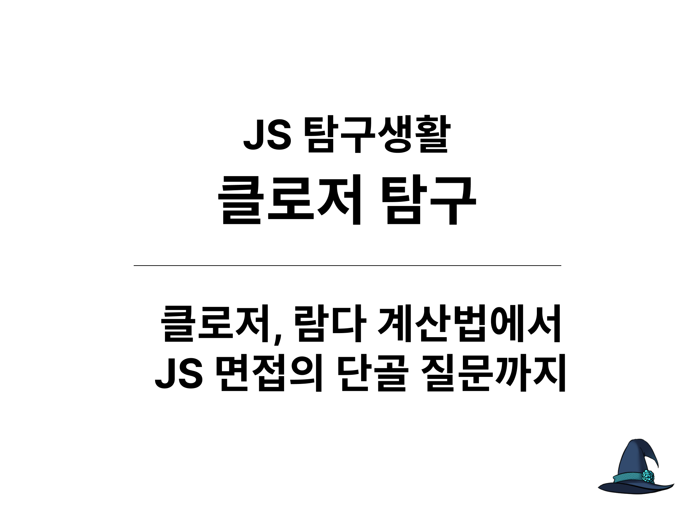
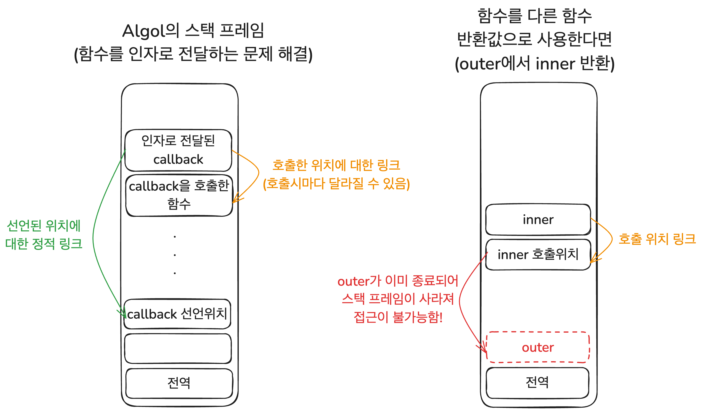

| **클로저 탐구 시리즈**                                      | **링크** |
|-----------------------------------------------|----------|
| [클로저 시리즈 1. 클로저란 무엇인가?](https://witch.work/posts/javascript-closure-deep-dive-application) | [https://witch.work/posts/javascript-closure-deep-dive-application](https://witch.work/posts/javascript-closure-deep-dive-application) |
| [클로저 시리즈 2. 수학자들의 꿈에서 JS의 스타가 되기까지](https://witch.work/posts/javascript-closure-deep-dive-history) | [https://witch.work/posts/javascript-closure-deep-dive-history](https://witch.work/posts/javascript-closure-deep-dive-history) |

---

> 클로저는 렉시컬 환경에 대한 참조와 함께 묶인 함수의 조합이다.
>
> MDN Web Docs, Closures

JavaScript를 공부하다 보면 클로저라는 말을 한번쯤 듣게 된다. 굉장히 중요하다는 말이 따라올 때도 많다. 그런데 시간이 지나고 클로저에 대해 들은 횟수가 늘어가면서 두 가지 질문이 생겼다.

- 클로저는 무슨 의미이고 무엇을 할 수 있는 걸까?
- 클로저는 대체 어디서 나왔고 어떻게 JavaScript까지 들어가서 이렇게 유명해졌을까?

이 두 가지 질문에 대해 할 수 있는 한 많은 것을 찾아보고 정리하여 두 개의 글을 쓴다. 클로저가 무엇이고 뭘 할 수 있는지에 관해 하나, 클로저의 역사에 관해 하나다. 실용적인 내용은 첫번째 글에 더 많겠지만 개인적으로는 두번째 글에 훨씬 더 많은 시간과 관심을 쏟았다.

- 글에서 사용되는 코드는 특별한 언급이 없는 한 모두 JavaScript로 작성되었다. 단 개념의 설명을 위해 실제 JavaScript 문법과는 다르게 의도된 코드가 있을 수 있는데 이 경우 별도의 설명으로 표시하였다.

# 시작

이 글에서는 클로저의 역사적 맥락에 대해 다루며, 기본적인 JavaScript 지식을 상정하므로 클로저가 대략적으로 무엇인지 안다고 가정한다.

클로저가 무엇인지 모른다면 기본적인 부분을 다룬 이전 글인 [클로저 연대기 1. 클로저, 대체 무엇이고 어디에 쓸까?](https://witch.work/posts/javascript-closure-deep-dive-application)을 참고할 수 있다. 이전 글에서는 클로저를 이렇게 정의했었다.

> 클로저는 일급 객체 함수와 렉시컬 스코프를 사용하는 언어에서 표현식의 평가 결과로서 표현식, 그리고 표현식이 평가된 렉시컬 환경에 대한 참조의 묶음이다.

그럼 클로저가 무엇인지 알았다고 하자. 하지만 표현식을 환경과 묶어서 평가하는 게 왜 그리 중요한 맥락을 차지하고 있을까? 그만큼 많이 쓰이고 응용되어서 그렇다고 간단히 대답할 수도 있다. 하지만 생각하기에 따라 수많은 질문과 대답을 꼬리물어볼 수도 있다.

- 왜 JavaScript에서 클로저가 이렇게 중요하게 다루어질까?

클로저가 있는 다른 메이저 언어들과 달리 JavaScript는 처음부터 함수형의 영향을 받아 만들어졌다. 그리고 멀티 패러다임 언어답지 않게 class를 비롯한 객체지향 관련 문법도 오랫동안 없었다. 그래서 대부분의 개발 패러다임 구현에 클로저를 많이 사용했기 때문이다.

- 그럼 왜 JavaScript에는 클로저가 들어갔을까?

JavaScript 제작자 브랜든 아이크의 결정에 의해 Scheme의 영향을 받았기 때문이다. Scheme은 함수형 프로그래밍 언어였으며 클로저를 도입한 언어 중 하나였다.

- Scheme은 왜 클로저를 썼을까?

Scheme은 Lisp의 한 가지 방언으로 액터 모델이라는 걸 구현하려는 목적이었다. 그런데 액터 모델은 람다 계산법과 거의 비슷했다. 그래서 람다 계산법을 구현하기 위해 클로저를 썼다.

- 클로저라는 건 왜 나왔을까?

람다 계산법[^1]을 프로그래밍 언어에서 구현하는 과정에 발생한 funarg problem이라는 문제를 해결하려고 나왔다. 클로저라는 이름조차도 람다 계산법의 "closed"라는 개념에서 비롯되었다.

- 왜 람다 계산법을 프로그래밍 언어로 구현해야 했을까?

모든 기계적인 계산을 해내는 프로그래밍 언어를 만들기 위한 한 가지 방법이었기 때문이다.

- 왜 모든 기계적인 계산을 해내야 했을까?

그것이 바로 컴퓨터의 역할이며 프로그래밍 언어로 해야 하는 일이었니까.

클로저에서 시작해 이야기가 많이 부풀어올랐다. 그럼 이제 다시 돌아가서 오래전부터 시작해보자. 수학으로부터 프로그래밍 언어와 컴퓨터가 만들어지던 시절로 돌아갔다가 클로저가 JavaScript 진영의 스타가 되기까지 가보는 것이다. 이야기처럼 풀어내기 위해 노력하였다.

# 수학에서 프로그래밍까지

프로그래밍 언어, 컴퓨터, 이런 것들은 어디서부터 시작했을까? 생각하기에 따라 주판부터, 혹은 천문학의 관측 결과에 대한 계산부터 아니면 논리학자들의 업적부터 시작할 수도 있다. 하지만 이 글에서는 20세기 초의 수학자들이 모든 것을 자동으로 계산하는 기계 그러니까 컴퓨터를 직접적으로 꿈꾸던 시절로부터 시작한다.

## 수학계의 꿈과 그 좌절

> 우리는 마음속에서 영원한 속삭임을 듣는다: 여기 문제가 있다. 그 풀이를 찾아라. 너는 순수한 이성으로 그것을 찾을 수 있다. 왜냐면 수학에는 해결할 수 없는 문제란 없기 때문이다.
>
> David Hilbert, "Mathematical problems", Bulletin of the American Mathematical Society, vol 8 (1902), pp. 437-479[^2]

1928년, 당시 수학계를 이끌던 거물이었던 힐베르트는 대담한 생각을 했다. 수학자들이 해온 것을 보니 기존의 사실들에 몇 개의 추론 규칙을 반복해서 적용하는 게 다인 것 같았다.

그럼 "추론 규칙의 기계적인 적용"만으로 수학자들이 알아내야 할 모든 것을 알아낼 수 있지 않을까? 추론 규칙을 모두 찾고 이를 기존의 사실들에 계속 적용해 나가기만 하면 수학의 모든 사실을 만들어낼 수 있지 않을까? 그대로 따르기만 하면 수학자들이 알아내야 하는 모든 것을 자동으로 척척 알아낼 수 있도록 하는 어떤 과정이나 규칙이 있지 않을까?

하지만 쿠르트 괴델이 발표한 "불완전성 정리"로 인해 이 꿈은 좌절되었다. 괴델은 규칙을 계속 적용하는 기계적인 방식으로는 참인 명제를 모두 찾아내는 게 불가능하다는 걸 증명했다.

이는 수학자들에게 큰 충격을 주었다. 수학을 모순 없는 토대 위에 쌓으려고 하던 힐베르트 프로그램도 타격을 받았다. 하지만 이 과정에서 나온 "기계적인 방식의 계산"이라는 아이디어는 컴퓨터 과학의 발전에 큰 영향을 주었다.

## 기계, 그리고 람다 계산법

> 프로그래밍 언어는 사실, 컴퓨터라는 기계가 세상에 나오기 전부터 이미 있었다. (...) 역사적으로 프로그래밍 언어가 먼저라고 할 수 있기 때문이다. 1930-40년대에 이미 논리학자와 수학자들은 기계적으로 계산가능한 것이 무엇인지를 고민하기 시작했다.
>
> 이광근, SNU 4190.310 Programming Languages Lecture Notes, 121쪽[^3]

불완전성 정리로 인해서 모든 참인 명제를 기계적으로 찾아낼 수 없다는 건 알았다. 그런데 방금 "기계적으로" 라고 하지 않았나? 컴퓨터의 개념은 불완전성 정리의 징검다리에 불과한 것처럼 언급된 이 "기계적인 계산"이라는 단어의 의미에서 시작한다.

"기계적인 계산"이란 대체 무엇인가? 어떤 조건을 만족해야 기계적인 방식으로 계산 가능하다고 할 수 있으며 자동으로 그 계산을 하는 걸 꿈꿀 수 있을까? 당연하지만 불완전성 정리를 처음 증명한 괴델이 이에 대해 가장 먼저 정의했다. 괴델은 1931년 불완전성 정리를 증명하면서 부분 재귀 함수라는 것을 정의하고 "부분 재귀 함수 꼴로 정의되는 함수"를 기계적인 방식으로 계산 가능하다고 했다.

그리고 불완전성 정리의 증명에 대한 리뷰 강의를 들은 케임브리지 대학교의 앨런 튜링은 1936년 불완전성 정리를 다른 방식으로 증명한다. 그 과정에서 튜링은 5종류의 부품으로 구성된 단순한 기계, "튜링 기계"를 정의하고 "튜링 기계가 실행 가능한 것들"을 계산 가능하다고 정의했다. 이 튜링 기계가 현재의 컴퓨터의 이론적 원형이다.

그 비슷한 시기, 프린스턴 대학교의 알론조 처치가 람다 계산법을 통해 계산 가능성을 정의한다. 원래 이는 기존 수학 체계 구성에 많이 쓰였던 집합 대신 함수를 이용해서 새로운 논리 체계를 구성하려는 시도였다. 처치는 이 체계가 기존 체계보다 훨씬 간단하며 러셀이 기존 체계에 제기했던 역설도 피할 수 있을 거라고 생각했다. 하지만 1930년대 초 처치 자신의 제자였던 클레이니와 로서는 처치의 체계가 논리적인 결점을 품고 있다는 걸 밝혀냈다[^4].

하지만 처치는 좌절하지 않았고 거기서 건질 수 있는 것을 건져냈다. 그리고 그가 맞았다. 완벽히 일관적인 논리 체계 구성은 실패했지만 함수에 관한 탄탄한 계산 이론이 남았기 때문이다. 그렇게 목표를 좀 더 줄여 수정한 체계를 만든 것이 람다 계산법이다. 처치는 "람다 계산법으로 계산될 수 있는 것들"을 계산 가능하다고 정의했다.

곧 밝혀졌지만 괴델, 튜링, 처치가 각자 내린 이 세 정의는 모두 동치이다. 셋 중 하나의 "계산 가능" 정의만 구현하면 대부분의 프로그래밍 언어가 목표로 하는 "튜링 완전"하다고 할 수 있다. 달리 말하면 이 세 정의 중 어떤 것을 써도 현재 존재하는 프로그램을 전부 표현할 수 있다는 것이다. 물론 이 셋 외에도 계산 가능성을 정의하는 방법이 여러 가지 있지만 이 셋이 가장 대표적이다.

이 중 괴델의 정의는 실제 계산의 수행과는 거리가 조금 있다. 그래서 나머지 두 개인 튜링 기계와 람다 계산법이 프로그래밍 언어의 두 가지 기원이 되었다. 그리고 튜링 기계를 현실에 구현하기 위한 노력이 컴퓨터의 발전으로 이어졌고 극초기의 명령형 프로그래밍 언어들을 만들었다. 반면 람다 계산법에서 올라온 언어들은 함수를 중심으로 하는 함수형 프로그래밍 언어의 기반이 되었다.

클로저는 이 람다 계산법을 기반으로 한 함수형 프로그래밍 언어를 구현하는 과정에서 나타났다. 하지만 아직 클로저가 나타나기에는 중간 단계가 되는 역사들이 좀 더 있다.

## 컴퓨터의 등장과 언어

> 언어는 생각을 표현하는 도구일 뿐 아니라 인간이 사유하기 위한 장치이다.
>
> Kenneth E. Iverson(1979년 튜링상 수상), 튜링 상 기념 강연 중

클로저는 함수형 언어의 핵심이 되는 개념 중 하나이다. 그런데 컴퓨터의 초기 시대에는 함수를 프로그래밍의 중심에 둔다는 생각을 아무도 하지 않았다. 최초의 함수형 언어라고 할 수 있는 Lisp를 만든 매카시조차도 오랫동안, 프로그래밍을 단계별로 실행되는 알고리즘의 설계만으로 생각했다.

이는 최초의 컴퓨터가 어떻게 등장했는지의 영향이 크다. 초기 컴퓨터가 튜링 기계를 기반으로 했기 때문이다. 튜링 기계에 관해 자세히 설명하는 것은 이 글의 범위를 벗어나지만, 작동규칙에 따라 작동하는 단순한 기계라고 볼 수 있다. 오늘날 명령형 프로그래밍이라고 불리는 것과 비슷하다고 보면 된다.

이 튜링 기계를 통해서 모든 계산 가능한 것을 계산할 수 있고 현재 존재하는 모든 프로그램을 표현할 수 있다. 그리고 1937년 클로드 섀넌이 자신의 석사 논문에서 전기 스위치로 튜링 기계를 만들 수 있다는 가능성을 보였다. 그리고 이게 실현되어 1948년 맨체스터 대학에서 맨체스터 마크 원이 만들어졌고 1952년 폰 노이만이 EDVAC을 만들었다. 즉 최초의 컴퓨터들은 튜링 기계 이론을 기반으로 한 명령어를 알아듣는 기계였다.

물론 람다 계산법도 똑같은 능력을 가지고 있다. 만약 람다 계산법을 기반으로 한 명령을 알아듣는 기계가 최초의 컴퓨터로서 만들어졌다면 프로그래밍 언어의 역사는 많이 달랐을지도 모른다. 하지만 최초의 컴퓨터는 튜링 기계 기반이었다. 당연히 초기 프로그래밍 언어도 튜링 기계의 명령어와 사고방식을 기반으로 만들어졌다. 최초의 컴퓨터가 생기던 시절은 함수형 프로그래밍과 관련된 개념인 클로저가 나올 수 있는 환경이 아니었던 것이다.

람다 계산법을 기반으로 하는 언어의 경우에는 기계에게 이해시키기 위해 번역을 거쳐야 했다. 이 기술은 몇 년 뒤에야 나온다. 또한 지금도 람다 계산법 기반의 명령어를 사용하는 컴퓨터는 없다.

# 람다 계산법에 대해서

> 누군가가 계산을 하고 있다면, 다른 누군가는 꿈을 꾸어도 좋지 않겠는가?(At a time where so many scholars are calculating, is it not desirable that some, who can, dream?)
>
> Rene Thom(1958년 필즈상 수상), Structural Stability and Morphogenesis

이제 람다 계산법을 프로그래밍 언어로 구현하기까지의 역사를 알아보려고 한다. 그런데 이 과정에서 람다 계산법의 개념들을 어느 정도 언급할 것이다. 따라서 역사를 보기 전에 우선 람다 계산법에 대해 간단히 알아보자.

## 람다 계산법의 형식

앞서 보았다시피 람다 계산법은 "기계적으로 계산 가능한 것"을 정의한다. 그런데 정말로 기계적으로 정의를 표현하는 튜링 기계와 달리 람다 계산법은 함수(=추상화)를 기반으로 한다.

다음 3가지 요소가 람다 계산법의 전부이며, 이 3가지만으로 기계적으로 계산 가능한 모든 것을 표현할 수 있다. 따라서 현재 존재하는 모든 프로그램도 표현할 수 있다.

- 변수(variable): $x$와 같은 변수
- 추상화(abstraction): 어떤 입력을 받아서 그에 따른 출력을 반환하는 개념. $\lambda x.y$와 같은 형태로 표현한다. 이 경우 $x$를 받아 $y$를 반환하는 추상화이다.
- 적용(application): $(x\,y)$와 같은 형태로 표현한다. 이 경우 $y$에 $x$를 적용한 것이다.

이 3가지만으로 참/거짓 값이나 자연수도 표현할 수 있고 우리가 알고 있는 `if`와 같은 분기도 표현할 수 있으며 Y combinator라는 것을 통해 재귀를 실현하여 반복도 표현할 수 있다[^5].

변수와 그걸 이용해서 뭔가를 하는 추상화, 그리고 추상화를 적용하는 것. 우리가 기존에 프로그래밍을 하면서 함수를 정의하고 인수를 넣어 호출하는 방식과 비슷하다. 함수의 인자를 정의하고 그에 따른 결과를 반환하는 것이다. 예를 들어 $x$를 받아 $x+1$을 반환하는 함수는 JavaScript에서 다음과 같이 정의할 수 있다.

```js
function addOne(x) {
  return x + 1;
}
```

이를 람다 계산법의 추상화로 다시 쓰면 이렇게 쓸 수 있다. 이런 방식으로 말이다.

$$
\lambda x.x+1
$$

## 일반적인 함수의 표현 그리고 bound와 free

추상화는 앞서 말했듯 프로그래밍하며 흔히 다루는 함수와 비슷하다. 그런데 문제가 있다. 추상화의 형식상, 추상화가 받는 인자는 하나뿐이다! 이걸로 어떻게 인자가 여러 개인 일반적인 함수를 표현할 수 있을까?

추상화를 중첩해서 쓰면 된다[^6]. 예를 들어 2개의 인자를 받아 더하는 다음과 같은 함수를 만들고 싶다고 하자.

```js
function add(x, y) {
  return x + y;
}
```

같은 것을 람다 계산법의 추상화를 이용한다면 이렇게 할 수 있다. $x$를 받는 추상화가 $y$를 받는 추상화를 반환하고 반환된 추상화에서는 $x$와 $y$를 더해서 반환한다.

$$
\lambda x.\lambda y.x+y
$$

이렇게 여러 개의 인자를 받는 함수를 하나의 인자만 받는 함수로 나눠서 순차적으로 호출될 수 있게 구성하는 것을 수학자 하스켈 커리의 이름을 따서 커링(Currying)이라고 한다. 최신의 함수형 언어들에서는 문법적으로 지원하며 JavaScript로도 가능하다.

```js
const add = x => y => x + y;
```

추상화를 중첩해서 쓰는 걸 보았으니 마지막으로 람다 계산법의 bound variable과 free variable에 대해 알아보자. 간단히 설명하면 람다 계산법의 표현식 내에서 값을 찾을 수 있으면 bound variable이고 그렇지 않으면 free variable이라고 할 수 있다. 이제 추상화 대신 더 일반적인 함수라는 용어를 사용할 것이다.

람다 계산법에서는 함수 $\lambda x.y$ 에서 $y$ 표현식 내에서 $x$가 나타나면 bound라고 한다. 또한 이렇게 $x$와 $y$를 연관시켜주는 $\lambda x.$를 "binder"라고 한다. 예를 들어 $\lambda x.x+1$에서 $x$는 bound variable이다.

반면 함수 인자도 아니고 함수 내부의 지역 변수도 아닌 변수, 즉 함수 내부에서 값을 찾을 수 없는 변수를 해당 함수의 관점에서 free variable이라고 한다. 앞서 보았던 $\lambda x.\lambda y.x+y$ 의 경우 내부 함수 $\lambda y.x+y$ 의 관점에서 $x$ 는 함수 인자도 지역 변수도 아니다. 따라서 내부 함수의 관점에서 $x$는 free variable이다.

표현식 내의 모든 variable이 bound variable이라면 "closed"라고 한다. 그렇지 않은 경우 "open"이라고 한다. $\lambda x.\lambda y.x+y$ 는 closed이고, $\lambda y.x+y$ 는 open이다. 이때 free variable $x$의 바인딩은 함수가 호출된 곳이 아니라 해당 함수가 정의된 곳을 따라간다.

# 프로그래밍 초기에서 클로저까지

람다 계산법이 등장한 배경도 알았고, 람다 계산법의 내용이 뭔지도 알았다. 그럼 이제 그걸 컴퓨터로 구현하면서 클로저로 가기까지의 여정을 알아보자.

## Lisp와 함수 인수 문제

> 가장 중요하고 흥미로운 컴퓨터 언어 가운데 하나는, Algol이 만들어진 시기에 함께 만들어진 존 매카시의 언어 LISP이다.
>
> Douglas Hofstadter, "Godel, Escher, Bach: an Eternal Golden Braid", 1979

프로그래밍이 처음 싹을 틔우던 1950년대 후반, 아무도 함수를 프로그래밍의 중심으로 생각하지 않았다. 함수의 개념은 있었지만 언어 내장 함수들이 있었을 뿐 사용자가 함수를 정의할 수 있는 기능조차 없었다.

훗날 Lisp를 만든 존 매카시는 그때 인공지능을 연구하고 있었다. 그는 1955년 이전부터 인공지능 연구에서 프로그래밍 언어가 얼마나 중요한지 느끼고 있었고 표현식들의 결합으로 나타낼 수 있는 수학적이고 논리적인 언어를 꿈꿨다.

그는 처음에 포트란을 확장하는 방식으로 이를 시도했다. 당시 포트란의 최신 버전에서 1줄짜리 사용자 정의 함수를 만들 수 있는 기능이 나왔던 걸 이용했다. 이후에도 그는 포트란에 여러 제안을 했고 이런저런 프로그램을 만들어서 어느 정도 성공을 거두었다.

하지만 그가 설계하던 시스템에서 필요한 재귀 함수, 함수 인수 등을 지원하기 위해서는 완전히 새로운 언어가 필요하다는 것이 점점 명확해졌다. 마침 설립된 MIT 인공지능 프로젝트의 지원을 받아 매카시는 1958년 최초의 함수형 프로그래밍 언어 Lisp를 만든다.

Lisp는 S-표현식과 M-표현식을 사용했다. S-표현식은 `X`, `Y`와 같은 atom과 atom들을 괄호와 점으로 연결하는 걸로 이루어졌다. 다음과 같은 형식이다.

```lisp
((X.Y).Z)
(ONE.(TWO.(THREE.NIL)))
```

M-표현식은 S-표현식을 이용한 계산을 나타냈다. 다만 M-표현식 또한 S-표현식을 이용해 만들 수 있었기 때문에 의도와 달리 대부분의 사람들은 S-표현식만을 사용했다. 이게 반영되어 이후에는 S-표현식만이 Lisp의 표준이 되었다.

단 이 당시 Lisp는 일급 객체 함수를 지원하기는 커녕 고차 함수 자체를 다루지 않았다. Lisp는 람다 계산법이 아니라 클레이니의 1차 재귀 함수 이론을 기반으로 했기 때문이다. 당연히 함수를 인자로 전달하거나 결과로 반환할 수 있는 기능도 없었다.

그런데 사실은 초기의 Lisp에서도 함수를 다른 함수의 인자로 전달할 수 있었다. quote 키워드를 사용해 함수를 선언하면 표현식을 평가하지 않고 일종의 데이터 취급을 할 수 있었고 따라서 인자로 전달도 가능했다. 오늘날의 메타 프로그래밍과 비슷한 기능이었다.

문제는 이렇게 하면 외부에 의존하는 변수의 바인딩이 제대로 이루어지지 않았다는 거였다. 함수가 정의된 곳을 기준으로 하는 렉시컬 스코프가 아니라, 함수가 호출된 곳을 기준으로 하는 동적 스코프가 사용된 것이다.

물론 quote가 만드는 동적 스코프는 오늘날 일반적으로 말해지는 동적 스코프의 의미와는 약간 차이가 있다(자세한 의미에 대해서는 부록의 [Lisp의 quote](https://witch.work/posts/javascript-closure-deep-dive-history#lisp%EC%9D%98-quote)를 참고하자). 하지만 그게 정확히 어떤 의미이건 간에 합리적이라고 여겨지던 렉시컬 스코프 방식으로 동작하지 않았다는 건 마찬가지다.

처음에 이건 단순한 버그로 간주되었다. 하지만 이후에 이건 좀더 근본적인 문제라는 게 밝혀진다. quote를 사용해서 메타 프로그래밍을 하는 것은 고차 함수를 다루는 것과 다르다는 것이 문제였다. 고차 함수를 렉시컬 스코프로 다루기 위해서는 현재 실행되고 있는 함수와 관련이 없는 다른 함수(인자로 전달된 함수 등)의 스택 프레임 혹은 이미 종료된 함수의 스택 프레임에 접근할 수 있어야 했고 이건 당시의 Lisp에서는 불가능했다.

이렇게 스택 기반으로 메모리를 관리하는 언어에서 고차 함수를 렉시컬 스코핑으로 구현하려고 할 때 발생하는, 즉 다른 함수의 스택 프레임에 접근해야 할 때 발생하는 문제들을 funarg problem이라고 했다. 다음과 같이 2가지가 존재했다[^7].

- upward funarg problem: 함수를 반환하는 함수에서, 반환된 함수에서 사용하는 외부 변수는 어디에 저장되어야 하는가?
- downward funarg problem: 함수를 인자로 전달할 때 그 함수가 외부 변수를 사용한다면 그 외부 변수는 어떻게 탐색되어야 하는가?

물론 C나 초기의 Lisp처럼 고차 함수를 금지하면 이런 문제가 발생하지 않는다. 하지만 람다 계산법을 기반으로 만드는 함수형 언어에서는 이 문제를 마주해야만 했다. 함수는 인자로 전달되거나 결과로 반환될 수 있어야 했고(일급 객체 함수) 렉시컬 스코프를 사용해야 했기 때문이다.

이를 해결하기 위해 여러 방법들이 등장했었다. 하지만 Scheme 이전의 Lisp 계열 언어들은 이 문제를 제대로 해결하지 못했다. 물론 오늘날에는 이 문제의 답 중 하나가 클로저라는 것도 잘 알려져 있다.

## 문제 하나를 해결한 Algol

> 처치, 커리, 매카시 그리고 ALGOL 60의 저자들은 그들의 각 분야에서 너무 큰 역사적인 역할을 했기 때문에 세부적인 공로를 모두 언급하는 것은 불완전하고 아마도 적절치 못할 것이다.
>
> P. J. Landin, "The mechanical evaluation of expressions", 1964, 320p

Algol은 최초의 상용 프로그래밍 언어였던 포트란에 대항해서 유럽에서 만들어진 프로그래밍 언어로 요즘은 거의 쓰이지 않는다. 또한 구체적인 언어라기보다는 일종의 언어 명세에 가깝기 때문에 구현체도 중구난방 여러가지다. 위 인용문의 "ALGOL 60"또한 Algol의 유명한 구현체 중 하나이다.

하지만 지금 쓰이지 않더라도 Algol은 지금도 쓰이는 수많은 프로그래밍 개념의 원조이다. 렉시컬 스코프(당시 Lisp 등 많은 언어들이 동적 스코프를 사용하고 있었다)의 도입, BNF를 이용한 문법 구조 정의 등 많은 개념이 Algol에서 처음 나왔다. **그리고 Algol은 downward funarg problem을 해결했다.**

이 Algol은 일반적으로 함수형 언어로 분류되지는 않지만 함수에 관련된 규칙과 변수 바인딩은 람다 계산법과 관련이 있다[^8]. 특히 렉시컬 스코프를 사용했고 중첩 함수와 함수를 인자로 전달하는 것도 공식적으로 지원했다. 아쉽게도 함수를 결과로 반환하는 건 불가능했다.

렉시컬 스코프를 사용하며 함수를 다른 함수의 인자로 전달하는 걸 허용함으로써 Algol도 (downward) funarg problem을 마주했다. Algol은 이 문제를 어떻게 해결했을까? 인자로 전달된 함수가 사용하는 free variable을 어떻게 탐색했을까?

Algol은 함수를 호출하면 생기는 스택 프레임에 함수를 호출한 위치의 참조뿐 아니라 함수를 선언한 곳에 대한 정적 참조도 추가했다. 인자로 전달된 함수 내의 free variable이 쓰일 땐 그 함수의 스택 프레임에 정적 링크로 연결된 스코프를 따라가서 변수 식별자를 찾으면 됐다. 이는 잘 작동했다.

이게 온전히 Algol의 영향이라고 할 수는 없겠지만 이 방식 자체는 지금도 쓰인다. JavaScript에서 함수 객체가 생성될 때 `[[Environment]]` 내부 슬롯에 함수를 선언한 환경의 참조를 저장하고 그 함수가 호출될 때 이 환경을 참조하여 변수를 찾는 방식이다. 물론 오늘날의 언어에서 이게 제대로 동작하기 위해서는 클로저의 개념이 필요하다.

클로저가 없음에도 이런 방식이 잘 작동한 것은 앞서 언급했듯 Algol에서는 함수를 결과로 반환하는 기능이 없었기 때문이다. Algol에서는 함수가 다른 함수에 인자로 전달되더라도 인자로 전달된 함수를 선언한 스코프의 스택 프레임은 늘 콜스택에 살아 있었다. 그래서 언제나 메모리 상에 남아 있는 해당 함수의 스택 프레임에 접근할 수 있었기에 이런 방식이 가능했다.

하지만 함수를 일급 객체로 다룸으로써 람다 계산법을 완전히 구현하기까지는 큰 산이 하나 남아 있었다. 함수를 다른 함수의 결과로 반환할 수도 있어야 했다. 그리고 그걸 위해서는 downward보다 어려운 upward funarg problem을 풀어야 했다. 이 upward funarg problem은 단순히 스택 프레임에 링크를 추가하는 걸로는 해결할 수 없었다. 함수가 반환되고 종료된 후에는 스택 프레임이 사라지는 구조 자체가 문제였기 때문이다.



이 문제를 해결하기 위해 드디어 클로저가 등장한다. 이제야 함수가 일급 객체가 될 수 있겠다.

## 클로저가 모든 것을 해결하다

> Landin(1964)은 이 문제를 그의 SECD machine에서 해결했다. 함수는 클로저로 표현되고 클로저는 함수 코드와 자유 변수에 대한 환경으로 구성된다. 이 환경은 이름-값 쌍으로 이루어진 링크드 리스트이다. 클로저는 힙에 저장된다.
>
> D. A. Turner, "Some History of Functional Programming Languages", 8p

앞서 설명했던 funarg problem을 깔끔하게 해결한 것이 바로 클로저이다. downward funarg problem은 Algol이나 Lisp 등에서도 해결되어 있었다. 하지만 upward funarg problem을 제대로 해결한 건 클로저가 처음이었다.

1964년 피터 랜딘은 클로저의 개념을 처음 제시한 논문[^9]을 발표한다. 이 논문에서는 다음 2가지의 관점을 다룬다.

- 프로그래밍 언어에서 사용하는 표현식들을 람다 계산법 형식으로 모델링하는 법
- 그러한 표현식들을 기계적으로 평가하여 값을 계산하는 법

랜딘은 프로그래밍 언어에서 쓰이는 식들을 표현하기 위해 "응용 표현식(Applicative Expression, AE)"을 정의한다. 식별자, 람다 계산법 형식, 연산자로 구성된 표현식이었다. 랜딘은 또 프로그래밍에서 발생하는 리스트, 조건문, 재귀적 정의와 같은 구조들을 이 응용 표현식으로 만들어낼 수 있음을 보인다.

그리고 이런 응용 표현식들을 어떤 규칙에 따라 평가할지를 이야기한다. 그러면서 표현식을 평가할 때 외부 환경을 고려해야 한다는 당연한-하지만 렉시컬 스코프를 사용한다면 사실 그렇게까지 당연하지는 않은-사실을 이야기하고 이를 형식화한다.

표현식 $X$를 평가할 때 $X$가 평가되는 환경에 따라 $X$의 free variable 값이 달라지고 따라서 결과도 달라진다. 그러므로 표현식 $X$의 평가 결과는 일반적으로 외부 환경 $E$에 대해 $X$를 평가한 결과 그러니까 $val(E)(X)$로 나타나야 한다는 것이다.

그리고 응용 표현식의 평가를 기계적으로 수행할 수 있도록 형식화한다. 이때 표현식의 값은 표현식과 표현식이 평가된 환경의 묶음으로 정의되어야 한다고 주장하며 이를 **클로저**라고 정의한다. 그가 정의한 방식을 이해하기 위해 간단한 고차 함수의 경우를 생각해보자.

```js
function parent(x) {
  return function child(y) {
    return x + y;
  }
}

let a = 1, b = 2;
const middle = parent(a);
const result = middle(b);
```

`result`가 최종적으로 나오기 전에 `middle`이라는 중간 단계를 만들었다. `middle`의 값은 무엇일까? `a` 값이 1로 바인딩된 전역 환경과 `parent` 함수 본문이 함께 평가된 결과이다.

좀더 형식화해서 말해보자. `a`가 1로 정의된 전역 환경을 $E$라고 할 때 `middle`은 $E$에서 `parent`를 평가한 결과이다. 그리고 `middle`이 인수를 받아 호출된 결과를 평가한다는 건 $E$에서 `a`값이 고정됨으로써 파생된 새로운 환경 $E\prime$에서 `child`를 평가하는 것이다. 랜딘은 이를 일반화해 표현식의 평가 결과를 표현식과 환경의 묶음인 클로저로 정의한다.

그리고 환경 $E$에 대해 표현식 $X$의 평가 결과를 다음과 같은 형식으로 쓴다. $E$에 존재하는 $X$의 bound variable($bvX$)를 $E$에 따라 평가하고 그렇게 구축된 새로운 환경 내에서 $X$의 본문을 평가하는 것이다.

$$
constructclosure((E, bvX),\, unitlist(bodyX))
$$

예를 들어 $\lambda x.\lambda y.x+y$를 평가할 때 $x=1$인 환경에서 평가한다면 먼저 $x$가 1로 평가되었으며 $y$를 free variable로 갖는 새로운 환경을 생성하고 그걸 클로저로 하여 $\lambda y.1+y$($x$가 1로 대체됨)를 평가하는 것이다. 오늘날의 클로저 방식과 똑같다. 랜딘은 이런 방식으로 자신이 정의한 응용 표현식이 잘 평가될 수 있음을 보인다.

클로저는 free variable이 있는 "open"된 표현식에 렉시컬 환경을 제공함으로써 free variable을 바인딩하고 표현식을 점점 값이 확정된 "closed" 상태로 만들어 간다. 이렇게 표현식을 closed로 만든다는 의미로 이름을 클로저(closure, 폐쇄)라고 한 것이다.

랜딘의 이 논문에선 클로저가 어떤 요소를 가져야 하는지도 정의한다. 클로저는 다음과 같은 요소들로 이루어진다. 여기서 환경은 환경이 담고 있는 식별자와 그 값의 쌍들을 저장한 리스트로 나타낸다.

- 표현식이 평가된 환경
  - 외부 환경(outer reference)
  - 환경에서 정의된 식별자의 목록
- 표현식의 내용

즉 최초의 클로저는 표현식과 표현식이 평가된 환경의 조합이었다. 또 함수도 표현식이므로 환경과 함께 평가되었다. 그리고 구현상 클로저는 힙에 저장되었다. 이는 외부 함수가 종료된 이후에도 거기서 반환된 함수가 자신이 선언된 외부 환경에 접근할 수 있었다는 뜻이다. **upward funarg problem이 해결되었다!**

같은 논문에서 랜딘은 이런 표현식을 클로저를 통해 기계적으로 평가하는 방법을 수학적으로 기술한 SECD Machine을 제시한다. 1966년의 다른 논문[^10]에서는 이를 기반으로 한 이론적인 언어 모델인 ISWIM(If you See What I Mean)을 제안한다. SECD Machine과 ISWIM에 영향을 받아서 프로그래밍 언어론 교육을 위한 언어이며 일급 객체 함수를 지원한 PAL이 나오지만 교육을 위한 언어였기에 실용적인 언어의 계보를 만들지는 못했다.

# 클로저에서 JavaScript까지

그럼 이렇게 나온 클로저는 어떻게 JavaScript로 이어졌을까? 이는 Lisp의 유명한 방언인 Scheme에서 클로저를 받아들였고 JavaScript가 Scheme의 영향을 받았기 때문이다.

## Algol에서 Scheme까지

> SIMULA와 Smalltalk에서 영감을 받아 칼 휴이트는 "액터"를 중심으로 한 계산 모델을 개발했다. (...) 제리 서스만과 나는 칼 휴이트의 그 지적인 아이디어를 이해하고 싶었다. 하지만 우리는 그 복잡함과 표기법을 극복하고 "실제로 어떻게 동작하는 건지" 파악할 수 없었다.
> 그래서 우리는 "장난감" 액터 언어를 구현해 보기로 했다.
>
> Guy L. Steele, "The History of Scheme" 발표 슬라이드, JAOO Conference, 2006

1962년 노르웨이의 달과 뉘고르는 Algol 60을 확장하여 이산적인 이벤트 시스템을 시뮬레이션하기 위한 특수 목적 언어인 Simula I을 만들었다. 이후 클래스와 같은 객체 지향 프로그래밍의 기본 개념들을 도입하여 Simula 67을 만들었다[^11]. 최초의 객체 지향 프로그래밍 언어였다.

Simula는 오늘날의 객체지향 프로그래밍과 비슷한 개념을 제시했다. 모든 것이 객체이며 이 객체들이 메시지를 주고받는 패턴을 통해 원하는 구조를 모델링한다는 개념 말이다. 이건 1972년 앨런 케이가 또 다른 객체지향 언어인 Smalltalk을 만드는 데에 큰 영향을 주었다.


또한 1960년대 후반에 MIT의 인공지능 연구실에서 박사 과정을 밟고 있던 칼 휴이트도 메시지를 주고받는 것으로 구조를 형성하는 방식에 영감을 받아 지식 추론 시스템인 Planner를 구상했다. 이 Planner는 이후 유명한 인공지능 언어인 Prolog의 탄생에 영향을 미치기도 했다.

이렇게 비슷한 뿌리에서 Smalltalk을 만든 케이와 Planner를 만든 휴이트는 1970년대 초 서로 교류하면서 각자의 지식을 발전시켜 나간다. 그런데 Planner는 너무 방대하고 복잡했고 당시 컴퓨터 환경에서는 한계가 있는 기능도 있었다.

Planner의 이런 문제를 해결하기 위해 휴이트와 그의 제자들은 Simula와 Smalltalk의 구조에서 영감을 받아 "액터 모델"을 고안했다. 모든 데이터를 추상화해서 액터로 보는 거였다. 모든 계산 주체와 데이터는 액터이며 관계를 맺고 있는 다른 액터들(acquaintance라고 했다)이 있다. 그리고 이런 액터들이 메시지를 주고받는 방식으로 계산을 진행한다. 이러한 메시지 통신은 비동기적으로 이루어진다.

매우 어려워 보이는 내용이다. 그러나 이 글의 주요 주제는 액터 모델이 아니며 이 글에서 이를 깊게 이해할 필요도 없다. 중요한 건 MIT 대학원생이었던 가이 스틸과 그의 지도교수 제럴드 서스만에게도 액터 모델은 이해하기 어려운 개념이었다는 점이다.

그들은 이 액터 모델을 이해하고 싶었으나 쉽지 않았다. 그래서 오늘날에도 많은 개발자들이 라이브러리를 익히기 위해 토이 프로젝트를 해보듯이, 그들은 액터 모델을 구현하는 작은 장난감 언어를 만들어 보기로 했다. 이 작업이 Scheme의 시작이었다.

## Scheme이 나오고 클로저를 퍼뜨리기까지

> 스킴이 그전까지의 리스프와 중요한 차이를 보인 것은 람다에 대한 중요성을 부각시키고 람다의 행동에 대한 엄밀한 분석을 이룬 것이다.
>
> 안윤호, "해커 문화의 뿌리를 찾아서 Part 1: 리스프가 탄생하기까지", 2007

스틸과 서스만은 작은 Lisp 인터프리터에 액터를 생성하는 기능, 메시지를 보내는 기능 2가지만 추가한 언어를 만들기로 했다. 당시 제럴드 서스만이 학교에서 Algol 60을 가르치고 있었기에 그 영향으로 렉시컬 스코프를 사용하게 되었다.

언어를 만들고 칼 휴이트와 토론하는 과정에서 스틸과 서스만은 액터 모델과 람다 계산법을 이용한 표현식이 거의 동일한 개념임을 깨달았다. 같은 대상을 어떤 관점에서 바라보는지의 차이일 뿐이었다. 이 사실을 깨닫고 나자 그들에게 남은 건 그 과정에서 만든, 몇 가지 좋은 특성을 가진 작은 Lisp 방언이었다.

1975년 가이 스틸과 제럴드 서스만은 그때까지의 결과를 모아 Scheme을 발표한다. 당시 인공지능 언어들의 이름이 "-er"로 끝나던 경향에 따라 "Schemer"로 이름짓고자 했지만 당시 그들이 쓰던 운영체제의 파일명 길이 제한이 6자였기에 "Scheme"이라는 이름이 붙었다.

시작이야 어쨌든 이제 이 언어는 확실하게 람다 계산법을 기반으로 하고 있었다. 언어의 튜토리얼 문서 제목부터가 "Scheme: An Interpreter for Extended Lambda Calculus"였다.

당연히 Scheme에는 람다 표현식에 대한 평가가 포함되어야 했다. 좀더 오늘날에 익숙한 표현으로 하면 일급 객체 함수를 지원해야 했다. 그리고 Algol에서 이어받은 렉시컬 스코프도 사용해야 했다. 즉, 중첩된 람다 표현식의 free variable을 평가할 때 표현식의 렉시컬 환경을 찾을 수 있어야 했다. Scheme은 이를 위해 클로저를 도입했고 더 나아가 람다 표현식의 평가 결과 자체를 클로저, 그러니까 표현식과 그 표현식이 평가될 때의 환경의 묶음으로 정의했다.

언어 정의 문서[^12]에서는 다음과 같은 예시를 보여준다.

```scheme
(((LAMBDA (X) (LAMBDA (Y) (+ X Y))) 3) 4)
```

이 표현식을 평가하여 최종 결과를 얻으려면 `(+ X Y)`를 평가할 때 `X`는 3, `Y`는 4로 바인딩되어야 한다. 이를 위해서는 먼저 `X`가 3으로 바인딩된 환경과 함께 외부 람다 표현식을 평가해야 한다. 이게 선행되어야 내부 표현식 `(LAMBDA (Y) (+ X Y))`이 `X`가 3인 상태에서 `Y = 4`와 함께 평가될 수 있다. 이런 동작을 위해서는 표현식의 평가 결과로 클로저가 필요하다.


Scheme 문서에서 클로저를 도입하는 부분을 보면 funarg problem에 관한 조엘 모세스의 논문[^13]을 언급한다. 그리고 모세스는 해당 논문에서 클로저라는 용어를 처음 제시한 인물로 피터 랜딘을 지목한다.

이외에도 스틸과 서스만은 전통적인 Lisp에 대한 의문 제기와 프로그래밍 언어론적 고찰을 많이 했다. 이는 [람다 페이퍼](https://en.wikisource.org/wiki/Lambda_Papers)라는 논문 모음집으로 정리되어 있다.

이렇게 Scheme을 통해 클로저 그리고 람다 페이퍼라는 불꽃을 쏘아올린 이후 가이 스틸은 박사 졸업 후 산업계로 진출했다. 반면 제럴드 서스만은 학계에 남아 강의와 연구를 계속했다[^14]. 서스만이 가르친 자료들과 람다 페이퍼 등을 바탕으로 쓴 것이 그 유명한 마법사책, SICP(Structure and Interpretation of Computer Programs)이다.

이외에도 Lisp로 수많은 책들이 쓰여졌고 Scheme 혹은 다른 Lisp 방언으로 진행되는 프로젝트나 강의도 많았다. 이렇게 점점 인기를 얻은 Scheme은 클로저를 널리 퍼뜨렸고 다른 언어에도 영향을 주었다. 그 중 하나가 JavaScript이다.

## Scheme에서 JavaScript로

> 내가 여러 번 말해왔고 Netscape의 다른 사람들도 확인해 줄 수 있는 사실인데, 나는 브라우저에서 "Scheme을 구현하는" 일을 할 거라는 약속을 받고 Netscape에 합류했다. (...) 사용할 언어가 Scheme이어야 하는지는 논쟁의 여지가 있었지만 내가 Netscape에 합류할 때의 미끼는 Scheme이었다. 이전에 내가 SGI에 있을 때 닉 톰슨이 내게 SICP를 소개해 주었다. (...) 아주 자랑스럽지는 않지만 Scheme과 같은 일급 함수와 Self와 같은 프로토타입(하나뿐이긴 하지만)을 JavaScript의 주요 요소로 선택한 것에 만족한다.
>
> JavaScript의 창시자 Brendan Eich, "Popularity"[^15]

1991년 팀 버너스 리가 HTML을 만들었고 자신이 만든 브라우저인 WorldWideWeb을 배포했다. 이후 웹은 급속도로 발전했다. 화면에 이미지를 삽입할 수 있게 되었고 스타일 기능이 추가되었고 속도도 점차 빨라졌다.

그 시기에 걸쳐 1993년에는 모자이크, 1994년에는 넷스케이프 네비게이터가 만들어졌다. 시간이 갈수록 웹의 인기는 폭발적으로 증가했고 웹으로 향하는 통로였던 브라우저에는 점점 더 많은 기능이 들어갔다.

이제 산업계에선 사용자가 페이지와 상호작용하고 또 애플리케이션을 직접 만들 수 있도록 하기 위한 스크립트 언어의 필요성을 느꼈다. JavaScript의 창시자 브랜든 아이크가 이를 위해 1995년 4월 넷스케이프에 합류한다. 네트워크 작업을 위한 작은 특수목적 프로그래밍 언어를 만들어본 경험 덕분이었다.

아이크는 이때 브라우저에서 Scheme을 구현하게 해주겠다는 약속을 받았다. 앞서 Scheme 섹션의 끝자락에서 언급한 SICP 때문이었다. 그가 처음 일을 시작했던 회사의 동료가 SICP를 소개해 주었는데 그걸 매우 인상깊게 읽어서 그랬다고 한다.

하지만 이후 웹 시장의 복잡한 상황 전개와 여러 현실적인 문제로 인해 브라우저에 Scheme을 그대로 구현하는 것은 포기해야만 했다[^16]. 대신 브라우저에는 Java가 도입되었고 Java Applet을 통한 브라우저 애플리케이션 개발 방식이 제안되었다.

그 상황에서 아이크가 할 수 있었던 건 Java의 보조 언어로 쓰일 작은 스크립트 언어를 만드는 것뿐이었다. 심지어 시간도 촉박했다. JavaScript의 첫 버전, 당시에는 Mocha라고 불렸던 프로토타입 구현체는 열흘만에 급하게 구현되었다.

하지만 일정 압박과 몇몇 제약을 제외하면 아이크에게는 상당한 재량권이 주어졌다. 비록 Scheme을 구현할 수는 없었지만 아이크는 여전히 일급 함수 개념에 매력을 느꼈고 이를 JavaScript에 도입했다. 함수는 일급 객체로 취급되었고, 람다 표현식의 구현은 시간이 없어서 연기되었지만 예정되어 있었다. 또한 몇 가지 버그는 있었지만 렉시컬 스코프도 적용되었다. 이런 결정들은 자연스럽게 클로저를 JavaScript에 들여왔다.

## 클로저, JavaScript의 스타가 되다

> 다른 언어에서는 네임스페이스나 모듈 패키지, 비공개 프로퍼티, 스태틱 멤버 등의 기능이 익숙하고 당연할지 몰라도, 자바스크립트에는 이런 것들을 위한 별도의 문법이 거의 없다.
>
> 스토얀 스테파노프 지음, 김준기, 변유진 옮김, "자바스크립트 코딩 기법과 핵심 패턴", 2011, 103p

JavaScript는 웹에서 사용자와 상호작용하기 위해 만들어졌다. 그리고 극심한 일정 압박과 인원 부족 속에서 개발되었다. 또한 "Java의 보조 언어"로서 Java와 비슷해 보여야 하고 초보자도 쉽게 쓸 수 있어야 한다는 요구사항도 있었다.

이러한 상황 속에서 아이크도 여러 실수를 했다. 하지만 그는 적어도 짧은 기간 내에 많은 것을 하겠다는 욕심을 부리지 않았다. 그는 스스로 생각하는 중요한 핵심 사항을 빼면 나머지는 매우 유연하게 만들고 거의 모든 것을 수정 가능하게 만들었다.

그렇게 해 놓으면 내장 라이브러리와 같은 부분은 날림으로 만들거나 생략하더라도 다른 개발자들이 쉽게 수정하고 확장해서 사용하리라 생각했다.

그리고 열흘간의 촉박한 프로토타이핑 기간 동안 아이크가 고수한 그 "핵심 사항" 중 하나가 바로 Scheme에서 가져온 일급 객체 함수 개념이었다. 나머지 하나는 Self에서 온 프로토타입 기반 상속이었다.그 외의 부분들은 멀티 패러다임 언어로 설계되었다고 당당히 말할 수도 없을 만큼 날림인 게 많았다.

Date 클래스는 Java의 `java.util.Date`를 대충 가져온 거였고 `==`나 `with`는 버그를 펑펑 터뜨렸다. 프로토타입은 단일 상속만 지원했고 접근 제한자, getter, setter 같은 정보 은닉 기능도 없었다. 클래스, 모듈, 네임스페이스 등 객체지향 기능도 부족했고 그렇다고 함수형 프로그래밍이나 비동기 관련 지원이 많은 것도 아니었다.

그런데 시간이 지나면서 JavaScript는 본의 아니게 웹의 주류 언어가 되었고 웹이, 그러니까 개발자들이 JavaScript로 해야 할 일은 점점 많아졌다. 하지만 언어 표준에 새로운 기능이 도입되기까지는 시간이 오래 걸린다. 개발자들은 이러한 언어의 한계를 극복하기 위해 다양한 방법을 찾았는데 많은 경우에 클로저와 함께였다.

개발자들은 객체를 리턴하는 함수를 만들고 변수들을 함수 스코프 내에 숨겨 정보 은닉을 구현했다. 네임스페이스와 모듈을 구현하기 위해 코드를 즉시 실행 함수(IIFE)에 넣는 방식을 사용했다. 당연히 클로저를 활용한 거였다. 클로저는 디자인 패턴 구현, DOM 조작, 이벤트 핸들러 처리 등에도 쓰였고 함수의 실행과 같은 메타 정보를 추적하는 데 쓰기도 했다. 프로토타입 상속의 부족한 점을 보완하는 보조 함수에도 클로저가 쓰였다.

당시 쓰이던 다른 언어들에도 클로저는 있었다. 하지만 JavaScript에서의 클로저는 단순한 지식 그 이상이었다. 클로저는 함수형 흉내를 내던 JavaScript 설계의 핵심이었고 JavaScript의 여러 부족함을 메우고 기능을 구현하는 훌륭한 도구였다. 이런 과정을 거치면서 클로저는 JavaScript에서 매우 중요한 개념 중 하나로 자리 잡게 되었다.

# 마무리

클로저는 물론 중요하지만 엄청나게 어렵거나 복잡한 개념은 아니다. 프로그래밍의 사고방식에 익숙하다면 오히려 자연스럽게 느껴질지도 모른다. 하지만 이는 프로그래밍의 역사에 깊이 닿아 있다.

컴퓨터는 기계적인 계산을 구현하기 위해 튜링 기계를 기반으로 설계되었다. 람다 계산법은 연산 중심의 튜링 기계와 달리 함수로 계산 가능성을 표현하는 하나의 방식이었다.

당시의 인공지능 연구자들은 람다 계산법의 함수 중심 사고를 프로그래밍의 세계로 끌어들였다. Lisp를 만들었고 Algol을 만들었다. Algol에서 뻗어나가 Simula, Smalltalk, 액터 모델 같은 실험적 시도들이 나타났고 어떤 개념들은 서로 같았다는 것이 밝혀졌고 어떤 것들은 새로운 계보의 출발점이 되었다. IPL, SASL과 같이 오늘날 이름조차 거의 사라진 언어들도 이 역사의 일부였다.

이 여정 속에서 함수는 람다 계산법에서와 같이 "일급 객체" 그러니까 함수의 인수도 될 수 있고 함수의 결과로 반환될 수도 있고 다른 모든 것과 똑같이 취급될 수 있는 지위로 끌어올려졌다. 이를 프로그래밍 언어에 적용하면서 나타난 funarg problem을 해결하며 클로저가 생겼다.

Algol에서부터 비롯해 몇 단계를 거쳐 나온 개념인 액터 모델을 공부하던 인공지능 연구실 사람들이 Scheme을 만들며 클로저를 도입했다. 그리고 그 언어가 담고 있던 연구와 아이디어들이 SICP라는 고전과 여러 문서들로 이어졌다. 이는 클로저를 널리 퍼뜨렸고 JavaScript에도 영향을 주었다.

Java의 보조 언어로 시작한 JavaScript는 급하게 만들어진 탓에 많은 것이 부족했다. 그 빈자리를 채운 큰 벽돌 중 하나가 클로저였다. 클래스, 모듈, 네임스페이스, 정보 은닉 같은 객체지향 기능들이 클로저로 구현되었고 JavaScript 생태계는 클로저의 힘을 빌려 여러 중요한 기능들을 제공할 수 있었다. 그렇게 클로저는 JavaScript에서 빼놓을 수 없는 개념으로 자리 잡았다.

이제 끝이다. 클로저란 무엇인가? 첫번째 글에서 이야기했듯 표현식과 표현식이 평가된 환경의 묶음일 뿐이다. 하지만 이렇게 건조한 정의로 마무리하기에는 어쩐지 너무 묵직한 이야기들이 묻어버린 느낌이다. 그러니까, 기계적 계산 가능성을 꿈꾸던 수학자들, 그 좌절이 깃든 컴퓨터와 람다 계산법과 거기서 비롯한 Lisp와 Algol과 함수형 프로그래밍의 발전과 그 과정에서 드러난 표현식 평가의 문제와 깔끔한 해결책, 이어지는 Scheme의 탄생을 거쳐 Lisp와 Scheme으로 쓰인 수많은 고전을 이어 JavaScript까지 이어진 이 흐름이 남긴 커다란 발자국, 수많은 학자와 시도와 실패와 작은 성공들이 엮여 다듬어진 이걸 오늘날 우리는 클로저라 부른다[^17].

# 부록

## Lisp의 quote

Lisp의 quote는 함수를 선언할 때 표현식의 평가를 생략하고 일종의 데이터로 다룰 수 있게 해주는 기능이다. 그래서 오늘날 일반적으로 말하는 동적 스코프와는 약간 다르다. 그것보다는 함수를 선언할 때 `eval`로 평가할 문자열, 이를테면 `(x) => "(y) => x + y"`를 문자열 형태로 그대로 선언하는 것에 가깝다.

quote로 선언된 함수는 일종의 데이터로 취급되어 표현식의 평가를 생략한 채 그대로 쓰일 수 있다. 함수에 인자로 전달하는 것도 가능했다. 함수를 문자열로 나타내고 인자로 전달한 후 `eval`로 평가하는 것과 비슷하다. 렉시컬 스코프나 일반적인 동적 스코프와도 차이를 보이는 부분을 lisp 문법으로 간략히 볼 수 있는 코드이다[^18].

```lisp
;; quote를 사용하여 함수 코드의 평가를 생략하고 일종의 데이터처럼 그대로 다루도록 한다.
;; quote를 쓰면 함수를 데이터로 취급하고 function을 쓰면 함수 객체로 취급한다.
(defun outer (x)
  (quote (lambda (y) (+ ,x y))))

(defun foo (quotation y)
  ;; quotation 인자를 통해 전달된 문자열을 코드로 가정해서 그대로 평가한다.
  (let ((inner-function (eval quotation)))
    ;; y를 인자로 전달해 호출한다.
    (funcall inner-function y)))

"outer가 받는 인수에 3이 들어가서 inner가 y => 3 + y가 되고
y 자리에 2가 들어가서 결과 5를 반환하기를 기대한다.
이는 렉시컬 스코프를 사용하거나 콜스택을 거슬러 올라가면서 식별자를 찾는 방식의 동적 스코프를 사용하더라도 마찬가지다.
하지만 quote는 다르다.
quote를 쓰면 함수를 데이터 그대로 취급하는 특성상 y => x + y가 그대로 전달되고 inner는 (y => x + y)(y)가 된다.
그리고 inner(2)는 (y => x + y)(2), 즉 x + 2로 평가되는데 이 스코프에 x는 없으므로 에러가 발생한다."
(let ((inner (outer 3)))
  (foo inner 2)) ;; x is not defined 에러 발생
```

하지만 Lisp에서 동작하던 동적 스코프가 정확히 어떤 의미이건, 당시에도 합리적이라고 여겨지던 렉시컬 스코프 방식으로 동작하지 않았다는 것은 분명하다. 

# 참고

- 전체적인 참고

전체 문단에서 전반적으로 참고한 문서들이다. 해당 문서들은 전체적으로 글 작성에 필요한 내용들을 제공했고 필요한 키워드나 추가적인 문서를 찾는 단서가 되었다. 따라서 거의 모든 섹션의 내용에 직접적으로 연관되어 있거나 영향을 미쳤다.

D. A. Turner, Some History of Functional Programming Languages

https://kar.kent.ac.uk/88959/1/history.pdf_nocoversheet

마틴 데이비스 지음, 박상민 옮김, "오늘날 우리는 컴퓨터라 부른다", 인사이트

https://product.kyobobook.co.kr/detail/S000208490185

이광근, "컴퓨터과학이 여는 세계 : 세상을 바꾼 컴퓨터, 소프트웨어의 원천 아이디어 그리고 미래", 인사이트, 2021

https://product.kyobobook.co.kr/detail/S000001033013

이광근, SNU 4190.310 Programming Languages Lecture Notes

https://ropas.snu.ac.kr/~kwang/4190.310/11/pl-book-draft.pdf

Herbert Stoyan, Early LISP History (1956 - 1959)

https://dl.acm.org/doi/pdf/10.1145/800055.802047

안윤호, "해커 문화의 뿌리를 찾아서"

https://github.com/black7375/ReadabilityDocs/tree/master/%ED%95%B4%EC%BB%A4%20%EB%AC%B8%ED%99%94%EC%9D%98%20%EB%BF%8C%EB%A6%AC%EB%A5%BC%20%EC%B0%BE%EC%95%84%EC%84%9C

Wikipedia, Closure (computer programming)

https://en.wikipedia.org/wiki/Closure_(computer_programming)

Wikipedia, Lambda calculus

https://en.wikipedia.org/wiki/Lambda_calculus

- 수학에서 프로그래밍까지

불멸의 힐버트 1: 좋은 문제는 한 번 풀리지 않는다

https://horizon.kias.re.kr/15610/

위키백과, "힐베르트 프로그램"

https://ko.wikipedia.org/wiki/%ED%9E%90%EB%B2%A0%EB%A5%B4%ED%8A%B8_%ED%94%84%EB%A1%9C%EA%B7%B8%EB%9E%A8

Wikipedia, Functional programming

https://en.wikipedia.org/wiki/Functional_programming

SNUON_컴퓨터과학이 여는 세계_15.1 프로그래밍 언어의 두 기원_이광근

https://www.youtube.com/watch?v=NLND6AgMOBA

- 람다 계산법에 대해서

Lambda Calculus And Closure

https://www.kimsereylam.com/racket/2019/02/06/lambda-calculus-and-closure.html

Wikipedia, Free variables and bound variables

https://en.wikipedia.org/wiki/Free_variables_and_bound_variables

Kurly Tech Blog, Lambda Calculus에 대해 알아보자

https://helloworld.kurly.com/blog/lambda-calculus-1/

- 프로그래밍 초기에서 클로저까지

Joel Moses, The Function of FUNCTION in LISP, or Why the FUNARG Problem Should be Called the Environment Problem. 스택 프레임 기반 언어에서 어떻게 외부 환경에 접근하는지에 대한 어려움을 다룸. upward든 downward든 현재 실행되고 있는 함수가 아닌 다른 함수의 스택 프레임에 접근하는 데 있어 생기는 어려움이 바로 funarg problem이었다.

https://dspace.mit.edu/handle/1721.1/5854

P. J. Landin, "The mechanical evaluation of expressions"

https://www.cs.cmu.edu/~crary/819-f09/Landin64.pdf

P. J. Landin, "The Next 700 Programming Languages"

https://www.cs.cmu.edu/~crary/819-f09/Landin66.pdf

L. FOX, "ADVANCES IN PROGRAMMING AND NON-NUMERICAL COMPUTATION"(인터넷에 pdf가 떠돌아다님)

https://www.sciencedirect.com/book/9780080113562/advances-in-programming-and-non-numerical-computation

Gerald Jay Sussman, Guy Lewis Steele Jr., "Scheme: An Interpreter For Extended Lambda Calculus" 초창기 Lisp 연구자들의 언어학 고찰이 담긴 논문들 모음인 [Lambda Papers](https://research.scheme.org/lambda-papers/)에서 찾을 수 있다.

https://dspace.mit.edu/bitstream/handle/1721.1/5794/AIM-349.pdf

위 Scheme 문서의 텍스트로 된 버전 https://en.wikisource.org/wiki/Scheme:_An_Interpreter_for_Extended_Lambda_Calculus/Whole_text

Arthur Evans Jr., "PAL - a language designed for teaching programming linguistics"

https://dl.acm.org/doi/pdf/10.1145/800186.810604

LISP 1.5 Programmer's Manual

https://www.softwarepreservation.org/projects/LISP/book/LISP%201.5%20Programmers%20Manual.pdf

what the fuck is a closure

https://whatthefuck.is/closure

Wikipedia, John McCarthy (computer scientist)

https://en.wikipedia.org/wiki/John_McCarthy_(computer_scientist)

Wikipedia, Function (computer programming)

https://en.wikipedia.org/wiki/Function_(computer_programming)

Wikipedia, Funarg problem

https://en.wikipedia.org/wiki/Funarg_problem

Wikipedia, Scheme (programming language)

https://en.wikipedia.org/wiki/Scheme_(programming_language)

Wikipedia, Scope (computer science)

https://en.wikipedia.org/wiki/Scope_(computer_science)

Wikipedia, History of programming languages

https://en.wikipedia.org/wiki/History_of_programming_languages

Wikipedia, PAL (programming language)

https://en.wikipedia.org/wiki/PAL_(programming_language)

PAL - a language designed programming linguistics for teaching

https://dl.acm.org/doi/pdf/10.1145/800186.810604

ES3 ECMA-262-3 Closure. funarg problem 관련해서 참고하였다.

https://seonhyungjo.github.io/Javascript-Book/ES3/6-Closure.html

The secret lives of JavaScript closures

https://dev.to/ziizium/the-secret-lives-of-javascript-closures-2o46

유튜브의 "Computerphile" 채널의 Lambda Calculus 영상

https://www.youtube.com/watch?v=eis11j_iGMs

When to use ' (or quote) in Lisp?

https://stackoverflow.com/questions/134887/when-to-use-or-quote-in-lisp

- 클로저에서 JavaScript까지

OOP Before OOP with Simula

https://twobithistory.org/2019/01/31/simula.html?source=post_page-----b4e4954d901c--------------------------------

Guy Steele, The History of Scheme, 2006.10, Sun Microsystems Laboratories에서 발표

https://web.archive.org/web/20230302184733/http://www-mips.unice.fr/~roy/JAOO-SchemeHistory-2006public.pdf

스토얀 스테파노프 지음, 김준기, 변유진 옮김, "자바스크립트 코딩 기법과 핵심 패턴", 인사이트, 2011

https://product.kyobobook.co.kr/detail/S000001032919

Allen Wirfs-Brock, Brandan Eich, JavaScript: the first 20 years

https://dl.acm.org/doi/10.1145/3386327

Brendan Eich, "Popularity"

https://brendaneich.com/2008/04/popularity/

Why is closure important for JavaScript?

https://softwareengineering.stackexchange.com/questions/88392/why-is-closure-important-for-javascript

MDN Web Docs, Closures

https://developer.mozilla.org/en-US/docs/Web/JavaScript/Closures

Wikipedia, History of the Scheme programming language

https://en.wikipedia.org/wiki/History_of_the_Scheme_programming_language

Wikipedia, Simula

https://en.wikipedia.org/wiki/Simula

Wikipedia, Carl Hewitt

https://en.wikipedia.org/wiki/Carl_Hewitt

Wikipedia, Guy L. Steele Jr.

https://en.wikipedia.org/wiki/Guy_L._Steele_Jr.

Wikipedia, Actor model

https://en.wikipedia.org/wiki/Actor_model

Wikipedia, Planner (programming language)

https://en.wikipedia.org/wiki/Planner_(programming_language)

[^1]: Lambda Calculus를 람다 계산법으로 번역하는 것은 서울대학교 이광근 교수님의 "컴퓨터과학이 여는 세계"의 표기를 따랐다.

[^2]: 불멸의 힐버트 1: 좋은 문제는 한 번 풀리지 않는다(https://horizon.kias.re.kr/15610/)에서 인용

[^3]: SNU 4190.310 Programming Languages Lecture Notes https://ropas.snu.ac.kr/~kwang/pl-book-draft.pdf

[^4]: 클레이니-로서 역설, https://en.wikipedia.org/wiki/Kleene%E2%80%93Rosser_paradox

[^5]: 구체적인 방식은 참고문헌의 "Some History of Functional Programming Languages", 서울대학교 Programming Languages 강의록 등을 참고

[^6]: 집합 $A, B, C$ 에 대해 $(A \times B) \rightarrow C$ 와 $A \rightarrow (B \rightarrow C)$ 가 일대일 대응이기 때문에 가능하다.

[^7]: 더 자세한 설명은 [ECMA-262-3 in detail. Chapter 6. Closures.](http://dmitrysoshnikov.com/ecmascript/chapter-6-closures/), [자바스크립트 실행 컨텍스트와 클로저, funarg 문제 섹션](https://jaehyeon48.github.io/javascript/execution-context-and-closure/#funarg-%EB%AC%B8%EC%A0%9C) 등에서 볼 수 있다.

[^8]: P. J. Landin, "A Correspondence Between ALGOL 60 and Church's Lambda Notation: Part I"

[^9]: P. J. Landin, "The mechanical evaluation of expression"

[^10]: P. J. Landin, "The Next 700 Programming Languages"

[^11]: C.A.R. Hoare가 “Record Handling”이라는 문서에서 처음으로 오늘날의 클래스와 같은 개념을 제시하였다. 이게 Simula에 큰 영향을 미쳤다.

[^12]: Gerald Jay Sussman, Guy Lewis Steele Jr., "Scheme: An Interpreter For Extended Lambda Calculus", 1975.12, 21p

[^13]: Joel Moses, The Function of FUNCTION in LISP, or Why the FUNARG Problem Should be Called the Environment Problem

[^14]: 가이 스틸은 Scheme 컴파일러에 대한 논문을 쓰고 박사과정을 졸업한 후 Thinking Machines, Sun을 거쳐 지금은 Oracle에서 일하고 있다. 그렇다고 학계에 남은 제럴드 서스만과 반대의 길을 갔다고 보기에도 어렵다. 가이 스틸은 이후에도 Common Lisp 드래프트에도 기여하는 등 Lisp의 역사에 큰 발자취를 남겼기 때문이다. 이외에도 C, 자바의 표준안에 기여했거나 위원회 주요 멤버이다.

[^15]: Popularity, https://brendaneich.com/2008/04/popularity/

[^16]: JavaScript의 급한 탄생에 대한 더 많은 배경은 Allen Wirfs-Brock, Brandan Eich, "JavaScript: the first 20 years"를 참고할 수 있다.

[^17]: 마틴 데이비스, "오늘날 우리는 컴퓨터라 부른다"의 제목에서 따온 말이다.

[^18]: [신비롭고 아름다운 Lisp 이야기](https://bbconfwebdav.vulcan.site/bbconf/2024-summer/%eb%a8%b8%eb%a6%ac_LispStory.pdf)를 발표한 이정연 님이 도움을 주셨다.