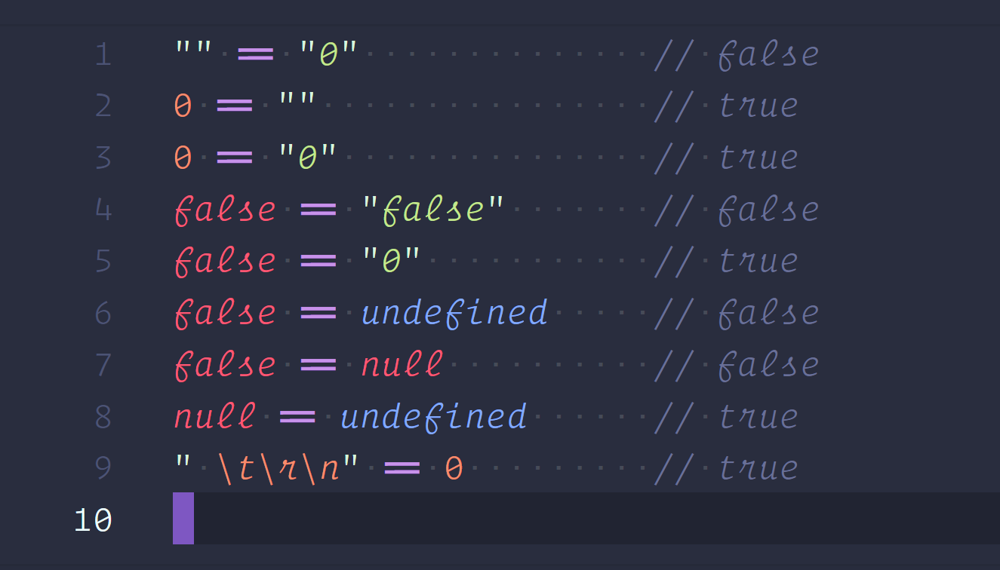

# 썸네일



# JS의 소리를 찾아서 시리즈

|시리즈|
|---|
|[JS의 소리를 찾아서 - 시작하면서](https://witch.work/posts/javascript-history-start)|
|[JS의 소리를 찾아서 - Javascript의 탄생](https://witch.work/posts/javascript-history-the-birth)|
|[JS의 소리를 찾아서 - Javascript의 초기 실수와 선택들](https://witch.work/posts/javascript-history-initial-decisions)|

이 글에서는 다음과 같은 내용을 다룬다. 다만 기술적인 부분보다는 좀더 역사적인 사실들에 집중하여 다룰 것이다.

- Javascript 역사의 간단한 요약
- Javascript의 초기의 실수들
- Javascript의 초기의 선택들
- Javascript에 영향을 준 기타 언어들

# 1. 간단한 역사

> 이미 잘 알려져 있겠지만 1995년 5월, 나는 '자바와 비슷해야 하고', '초보자에게도 쉬워야 하며', '넷스케이프 브라우저 내의 거의 모든 것을 제어할 수 있어야 한다'는 강압적이고도 강제적인 관리 명령하에 열흘 만에 자바스크립트를 만들었다.
>
> 데이비드 허먼 저, 김준기 옮김, '이펙티브 자바스크립트'에 실린 브랜든 아이크의 추천사

Javascript는 1995년 브랜든 아이크에 의해서 열흘만에 급하게 만들어졌다. 처음에는 이렇게 새로운 언어를 만들기보다는 기존 언어, 특히 Scheme 언어를 브라우저에 넣으려고 했다.

하지만 당시 아이크를 고용했던 넷스케이프가 브라우저 시장에서 마이크로소프트를 이기기 위해 썬 마이크로시스템즈(Java를 만든 그곳)와 동맹을 맺게 되면서 그럴 수 없어졌다. 브라우저에는 동맹사 제품인 Java가 들어가야 했기 때문이다.

그래서 브라우저에는 Java와 Java를 보조하기 위한 간단한 스크립팅 언어가 들어가기로 했다. 아이크는 이 'Java를 보조하는 간단한 스크립팅 언어'를 만들게 되었다. 

하지만 시간이 없었다. 이런 결정이 난 것은 1995년 5월이었는데 넷스케이프는 9월에는 브라우저를 출시해야 했다.

이렇게 시간에 쫓기면서 아이크는 10일만에 Javascript의 프로토타입(당시의 이름은 Mocha)을 만들었다. Java를 보조하기 위한 언어이므로 '자바와 비슷해 보여야 하고 초보자에게도 쉬워야 한다'는 요구사항과 함께였다.

Javascript의 대부분의 실수들은 방금 말한 3가지가 맞물려 가며 생겼다.

- 10일의 촉박한 시간
- Java와 비슷해 보여야 한다는 요구사항
- 초보자도 쉽게 쓸 수 있는 언어여야 한다는 요구사항

그럼 이제 Javascript의 실수들부터 그 와중에도 이루어진 선택들 그리고 이외의 영향들에 대해서 차례로 알아보자.

만약 Javascript의 초기 역사가 더 자세하게 궁금한 사람들은 [JS의 소리를 찾아서 - Javascript의 탄생](https://witch.work/posts/javascript-history-the-birth)을 참고하길 바란다.

# 2. Javascript 초기의 실수들

> "저에게 시간과 예산이 조금만 더 있었더라면..."
>
> 니트로 박사

브랜든 아이크에게는 시간이 없었고 일손도 없었다. Javascript는 언제나 바쁜 일정으로 만들어졌고 초기 Javascript 제작의 대부분 기간 동안 아이크는 거의 혼자 작업했다.

Javascript의 역사를 다룬 글들을 읽어 보면 'xx가 이런 부분을 도와주었다'나 'xx가 이런 부분을 만들어 주었다'라는 문구는 있어도 'xx와 같이 일했다'는 말은 도무지 찾아볼 수가 없다.

이런 상황 속에서 만들어진 Javascript에 허술한 부분이 있는 건 어쩌면 당연했다. 문제는 그 실수들이 지금까지도 남아서 우리를 괴롭히고 있다는 것이다. 이제부터 살펴볼 `var`의 호이스팅, 기묘한 `Date`클래스, `==`연산자의 형변환 규칙 등은 JS를 공부하면서 한번쯤 보게 되는 것들인데, 이 모든 것들이 초기의 실수에서 시작되었다.

## 2.1. var 호이스팅

> 끌어올림이란 '스코프 맨 앞으로 이동'이라는 뜻입니다. 함수 선언은 완벽히 끌어올려지며, 변수 선언은 부분적으로 끌어올려집니다.
>
> 악셀 라우슈마이어 저, 한선용 옮김, '자바스크립트를 말하다' 263쪽

`var` 변수 선언과 함수가 스코프의 최상단으로 끌어올려지는 현상인 호이스팅은 Javascript의 특이한 동작으로 많이 언급된다. 호이스팅이 무엇이고 어떤 의미가 있는지는 글의 주제를 벗어난다. 여기서는 그게 왜 만들어졌는지를 다룬다.

호이스팅은 순전히 기술적 이유 때문에 탄생했다. 함수의 호이스팅은 함수를 어디서든 사용할 수 있게 함으로써 스코프 내에서 프로그램을 탑다운식으로 분해하여 볼 수 있도록 해주었다. 그리고 선언 이전의 호출도 가능하게 했다.

그리고 호이스팅은 재귀 함수에서 값을 스코프에 바인딩하는 [`let rec`](https://stackoverflow.com/questions/16530534/scheme-when-to-use-let-let-and-letrec)을 추가적인 비용 없이 할 수 있게 해주었다.

하지만 이렇게 나름의 이유가 있었던 함수 호이스팅과 달리 `var`로 선언된 변수의 호이스팅은 원래 의도가 아니었다. Javascript가 급하게 만들어지면서 생긴, 함수 호이스팅의 의도되지 않은 부작용이다. 10일간의 촉박한 기간 동안 Javascript를 만들면서 생긴 실수라고 할 수 있겠다.

## 2.2. typeof

`typeof` 연산자는 피연산자의 타입을 식별하는 문자열을 반환한다. 그런데 이 연산자에는 많은 실수들이 있다.

예를 들어서 문자열 리터럴과 `String` 생성자로 만들어진 문자열 객체의 타입이 다르다고 나온다.

```js
typeof "hello world" // "string"
typeof new String("hello world") // "object"
```

또한 null에 대해서도 `typeof`를 적용해 보면 `object`라는 값이 나온다.

```js
typeof null // "object"
```

이는 Java에서 원시값과 객체로 값을 구분하는 방식을 따른 것이다. 하지만 정적 타입이 있어서 타입을 통해 값을 구분할 수 있었던 Java와 달리 Javascript는 동적 타입이라서 타입을 통해 값을 구분할 수 없었다.

그래서 타입을 쓰지 않고 억지로 값을 구분하려다 보니 위와 같은 결과가 나온 것이다. Java와 비슷하게 만들면서도 10일간의 촉박한 기간 동안 작업하면서 충분한 고려를 하지 못했다고 할 수 있다.

`typeof null`에 대한 더 깊은 탐구는 [JS 탐구생활 - JS의 typeof null은 왜 object일까?](https://witch.work/posts/javascript-why-typeof-null-is-object)에서 볼 수 있다.

## 2.3. Date 클래스

Javascript 1.0의 `Date`는 Java의 `java.util.Date`를 거의 그대로 가져온 것이다. 그런데 열흘 안에 급하게 옮기느라 버그나 이상한 특성까지 옮겨왔다.

예를 들어서 1970년 1월 1일을 0으로 표현하는 것, month만 0에서 11까지로 표현하는 것, 그리고 Y2K 버그가 옮겨왔다(Y2K 버그는 얼마 안 지나 고쳐지기는 했다).

이외에도 우리가 `Date`객체를 사용하면서 느낀 이상한 부분들은 대부분 Java의 `java.util.Date`에서 옮겨온 것이다. 시간이 흐르고 Java는 Java 8을 기점으로 현대적인 시간/날짜 관리 패키지인 `java.time`을 추가하면서 `java.util.Date`와 멀어졌지만 JavaScript는 아직까지 `Date`를 사용하고 있다.

즉 `Date`의 기묘한 점들은 촉박한 시간 동안 Java의 `Date`클래스를 옮겨오면서 생긴 실수라고 할 수 있다. 문제는 이 실수가 아직까지 남아 있다는 것이지만.

참고로 `java.util.Date`를 옮겨올 때 `equals`, `before`, `after` 메서드는 빠졌다. 이들은 Javascript의 자동 형변환으로 인해 숫자에 쓰이는 연산자를 Date 객체에 직접 사용할 수 있었기 때문에 필요없어서 제외되었다.

## 2.4. 자동 형변환과 == 연산자

```js
1 + '1' === '11' // true
```

피연산자들에 대해 이루어지는 자동 형변환은 Javascript가 초보자들도 쉽게 쓸 수 있는 간단한 스크립트 언어를 목적으로 만들어지던 시절 언어의 진입 장벽을 낮추기 위해 만들어졌다. 초보자도 쉽게 쓸 수 있는 언어로 만들려다가 생긴 실수라고 할 수 있다.

그러나 Javascript가 점점 범용 언어로 발전하면서 이 자동 형변환은 혼란과 많은 버그의 원인이 되었다.

또한 `==`연산자의 형변환이 만들어진 데에는 역사적인 이유가 하나 더 있다. 이런 자동 형변환은 Javascript(당시에는 Mocha)가 10일만에 프로토타이핑된 후 넷스케이프 내부의 알파 유저들의 요청에 대응하여 만들어진 것이다.

예를 들어 문자열 `"404"` HTTP 코드를 숫자 `404`와 `==` 연산자로 비교했을 때 결과가 참으로 나와야 한다는 요구사항이 있었다. 그리고 HTML 폼의 빈 필드에 대해서 기본값을 제공하기 위해 빈 문자열은 숫자 맥락에서 `0`으로 해석되도록 해 달라는 요구사항도 있었다. 

당시에 이 요구사항들은 아예 터무니없는 것은 아니었고 Javascript와 HTTP/HTML의 용이한 통합을 위해서였다. 하지만 결국 이런 요구사항들은 `==` 연산자의 이해하기 힘든 형변환 규칙이 만들어지는 데에 기여하게 되었다.

## 2.5. this

`this`는 여러 언어들에서 일반적으로, 메서드가 호출되었을 때 해당 메서드를 호출한 객체를 가리키는 키워드이다. 하지만 Javascript에서는 이 `this`가 많은 프로그래머들에게 혼란을 주었다.

`this`가 객체의 메서드에서 쓰였을 때와 객체에서 독립적인 일반 함수로 쓰였을 때, 생성자 함수로 쓰였을 때 등 `this`가 쓰인 맥락에 따라 `this`가 가리키는 객체가 달라지기 때문이다. 함수가 객체 메서드라면 `this`는 메서드를 호출한 객체를, 일반 함수라면 `this`는 전역 객체를 가리킨다. 생성자 함수라면 함수가 생성할 객체를 가리킨다.

HTML에서도 Javascript 코드를 메서드 형식으로 호출된 함수처럼 변환해 주는 경우가 있기 때문에 이런 혼란이 더 커진다. 예를 들어서 다음과 같은 코드가 있다고 하자.

```html
<button name="B" onclick="alert(this.name + " clicked")>Click me</button>
```

이 버튼을 클릭했을 시 버튼의 `onclick`메서드가 호출되는데 이때 `this`는 버튼 객체를 가리킨다. 그래서 `this.name`은 버튼의 `name` 프로퍼티가 된다.

이 혼란스러운 `this`는 원래 Java에서 빌려온 키워드이다. 그런데 Java에서는 함수가 무조건 클래스에 속해 있는 메서드의 형태이기 때문에 문제가 없었다. 하지만 Javascript에는 객체 메서드뿐 아니라 개별적인 함수, 생성자 함수까지 있었는데 `this`가 그 모든 함수에서 비슷한 용법으로 쓰임으로써 혼란을 주었다.

Java와 비슷하게 만들면서도 10일간의 촉박한 기간 동안 작업하면서 충분한 고려를 하지 못했다고 할 수 있다.

## 2.6. with

`with`는 객체의 속성에 접근할 때 객체 이름을 생략하여 간편함을 제공할 목적으로 만들어졌다. '간편함'이라는 말에서 알 수 있듯 이는 원래 '초보자도 Javascript를 사용하기 쉽도록'하기 위해 만들어졌다.

요즘은 거의 쓰이지 않는 문법이기에 간단히 설명하면 `with`의 블럭 내에서는 `with`가 지정한 객체의 프로퍼티를 변수처럼 사용할 수 있다. 예를 들어 다음과 같은 `with` 블럭 내에서는 `obj`의 프로퍼티인 `a`와 `b`에 접근할 때 `obj`를 생략할 수 있다.

```js
with (obj) {
  a = b;
}
```

하지만 이는 다음과 같이 해석된다. 매우 혼란스러운 코드이다.

```js
if (obj.a === undefined) {
    a = (obj.b === undefined) ? b : obj.b;
} else {
    obj.a = (obj.b === undefined) ? b : obj.b;
}
```

a와 b가 둘 다 obj의 속성일 수 있기 때문에 이런 일이 발생한다. 이는 제대로 해석하기 매우 어렵다. 또한 단순한 가독성 문제뿐 아니라 `with`는 변수명의 어휘적 바인딩을 어렵게 만들어 프로세서 속도를 느리게 만들고 버그의 원인이 된다.

이 `with` 또한 10일만에 급하게 언어를 만들면서도 초보자가 쉽게 쓸 수 있도록 만들려다가 설계를 충분히 검토하지 못해 생긴 실수라고 할 수 있다.

# 3. Javascript 초기의 선택들

> 아주 자랑스럽지는 않지만 Scheme과 같은 일급 함수와 Self와 같은 프로토타입(하나뿐이긴 하지만)을 자바스크립트의 주요 요소로 선택한 것에 만족한다. Java의 영향, 특히 y2k 버그, 원시값과 객체의 구분(예를 들어 string과 String)과 같은 부분은 아쉬운 부분이다.
>
> [Brendan Eich, Popularity](https://brendaneich.com/2008/04/popularity/)

앞서 언급했듯 아이크는 1995년 5월, 단 10일만에 Javascript의 프로토타입(당시 이름은 Mocha)을 만들었다. 매우 촉박한 시간이었다.

그래서 아이크는 본인이 생각하는 중요한 사항을 빼면 나머지는 매우 유연하게 만들었다. 아이크는 자신이 Javascript를 이렇게 유연하게 만들어 놓으면 내장 라이브러리 등은 날림으로 해두어도 다른 개발자들이 수정하리라고 생각했다. 실제로 Javascript의 내장 라이브러리는 초기에 날림으로 만들어진 게 많다.

여담이지만 이런 이유로 Javascript는 빌트인 객체를 포함해서 모든 객체들의 수정을 거의 허용한다. `Object.prototype`과 같은 객체들을 수정할 수 있는 것도 이런 설계 때문이다. 이는 폴리필을 만들 수 있는 기반이 되기도 한다.

그런데, 그럼 아이크가 언어를 만들 때 생각했다는 그 '중요한 사항'들은 무엇인가? 열흘간의 촉박한 프로토타이핑 기간 속에서도 양보할 수 없었던 건 무엇이었을까? 그 중요한 사항 2가지는 Self의 프로토타입 기반의 객체지향 시스템과 Scheme에서 온 일급 객체 함수의 개념이었다. 

이 두 가지는 Javascript 창시자 브랜든 아이크의 여러 인터뷰와 발표에서도 'Javascript에서 잘 만든 부분'으로 자주 언급된다(물론 급하게 만드는 과정의 실수는 있었다고 인정하지만). 그럼 이 두 가지에 대해 알아보자.

이외에도 Javascript는 여러 언어들에서 영향을 받았지만 그 부분에 대해서는 다음 섹션 `#4`에서 다룬다.

## 3.1. 프로토타입

> 객체는 다른 객체로부터 상속된다. 모든 객체는 어떤 다른 객체, 즉 프로토타입과 연관되어 있다.
>
> 데이비드 허먼 저, 김준기 옮김, '이펙티브 자바스크립트', 109쪽

프로토타입은 Javascript에서 객체지향을 구현하는 방식이다. 클래스 언어를 사용해본 사람들에게 이는 매우 낯선 부분이다. 그래서 이후 ES6에서 클래스가 추가되기도 했다.

하지만 프로토타입은 분명 그 당시로서는 Javascript에 들어갈 만한 기능이었다. 프로그래밍 초보자를 위한 언어였던 Javascript의 목적성에 비해 클래스 기반의 객체지향은 너무 복잡했기 때문이다.

프로토타입의 철학적 배경에 관해서는 [자바스크립트는 왜 프로토타입을 선택했을까](https://medium.com/@limsungmook/%EC%9E%90%EB%B0%94%EC%8A%A4%ED%81%AC%EB%A6%BD%ED%8A%B8%EB%8A%94-%EC%99%9C-%ED%94%84%EB%A1%9C%ED%86%A0%ED%83%80%EC%9E%85%EC%9D%84-%EC%84%A0%ED%83%9D%ED%96%88%EC%9D%84%EA%B9%8C-997f985adb42)라는 아주 유명한 글이 있다.

다 맞는 이야기는 아니지만, 철학적 배경에 대해서는 앞의 글을 참고할 수 있다. 여기서는 좀더 실질적인 이야기를 해보려고 한다.

### 3.1.1. 클래스 모델링의 어려움

클래스는 Simula라는 언어에서 객체지향을 모델링하는 방식으로 처음 도입되었다. 그리고 이후 Smalltalk, C++, Java 등의 언어에서도 사용되었다.

하지만 문제는 클래스를 사용하는 게 본래부터 어렵다는 것이었다. 지금도 클래스 모델링이 얼마나 많은 사람들의 머리를 아프게 하고 있을지 상상도 가지 않는다. 왜냐 하면 클래스를 모델링한다는 것은 `이 객체의 본질이 무엇인가?`라는 질문을 던지도록 하기 때문이다.

만약 이 질문에 대해 잘못된 결정을 내려서 클래스를 잘못 모델링했는데 이미 많은 인스턴스가 만들어져 있다면 그걸 고치기가 매우 어렵다. 따라서 처음부터 여러 가지를 고려하여 클래스를 잘 모델링해야 한다.

이는 절대 쉬운 일이 아니고 초보자를 위한 언어였던 Javascript에 이런 클래스 기반의 객체지향을 넣는 것은 좋지 않았다. 그래서 아이크는 프로토타입 기반의 객체지향을 선택했다. 프로토타입을 사용하면 이런 문제를 해결하거나 최소한 쉽게 가릴 수 있다.

### 3.1.2. 프로토타입의 도입

프로토타입은 상위 클래스의 상속이라기보다는 다른 객체에 동작을 '위임'하는 방식으로 작동한다. 따라서 프로토타입이 새 객체에 적합하지 않다면 프로토타입 객체를 런타임에 수정함으로써 먼저 그 객체가 사용된 코드에 영향을 주지 않고도 수정할 수 있다.

뭔가가 잘못되면 바로 수정할 수 있고 처음부터 객체를 잘 모델링하기 위한 추상적인 생각을 하지 않아도 된다. 프로토타입 기반의 객체지향이 클래스 기반의 객체지향보다 상대적으로 '바로 사용하기' 쉽다고 할 수 있겠다.

Javascript는 초보자를 위한 언어로 만들어졌기 때문에 이렇게 쉽게 사용할 수 있어야 했다. 따라서 상대적으로 쉽게 사용할 수 있는 프로토타입 기반 객체 모델이 도입되었다.

구체적인 구현에 관해서는 프로토타입 기반의 객체지향을 구현한 Self라는 언어의 영향을 받았다. Self도 Javascript의 프로토타입 체인과 같은 방식으로 동작한다. Self에서도 각 객체가 프로토타입 객체의 참조를 가지고 있었고 그 참조를 통해 프로토타입 객체의 기능을 사용할 수 있었다.

물론 Javascript는 Java를 보조하는 언어로 포지셔닝되었었기 때문에 Javascript의 초기 문서에는 이런 프로토타입 기반의 객체지향 이야기가 나오지 않는다. 하지만 Javascript 생성자 함수의 `prototype` 프로퍼티의 작명 등에서 Self와 프로토타입 기반 객체 모델의 영향을 엿볼 수 있다.

### 3.1.3. Java와의 충돌 방지

Javascript가 보조해야 할 언어였던 Java가 이미 클래스 기반이었다. 때문에 Javascript도 클래스 기반의 객체지향을 사용한다면 Java와 같은 영역에서 경쟁하게 되었을 것이다.

프로토타입 기반의 객체지향을 사용하면 Java와 클래스 구현에 대해 경쟁하지 않고도 Java의 보완재 역할을 할 수 있었다.

### 3.1.4. 시간의 부족

계속 언급되었듯이 아이크에게는 시간이 얼마 없었다. 그런데 프로토타입은 클래스에 비해서 언어 제작자가 구현하기 쉬웠다.

또한 수많은 내장 라이브러리들과 빌트인 메서드 또한 프로토타입을 통해 작동하도록 하면 사용자가 직접 원하는 메서드들을 만들고 또 수정할 수 있게 된다. `Object.prototype`등의 빌트인 프로토타입을 수정하면 되었다. 이는 Javascript 언어에서 지원해야 하는 기능을 최소화할 수 있게 해주었다.

그래서 Javascript는 이렇게 구현하기도 쉽고, 여러 작업들을 사용자에게 맡겨 버릴 수도 있는 프로토타입 기반의 객체 모델로 시작한다.

## 3.2. 일급 객체 함수와 클로저

> A closure is a procedure that records what environment it was created in.
>
> An Introduction to Scheme and its Implementation, The University of Texas at Austin


> 자바스크립트의 함수는 어휘적 유효범위를 가진 일급 객체입니다. 또한 주류가 된 첫번째 람다 언어며, 좀더 깊이 들어가면, 이름처럼 자바에 가깝기보다는 Lisp 언어 그리고 Scheme 언어와 더 많은 공통점이 있습니다. 자바스크립트는 C의 옷을 입은 Lisp이라고 할 수 있습니다.
>
> 더글러스 크록포드 저, 김명신 옮김, '자바스크립트 핵심 가이드', 14쪽

Javascript에서는 함수를 프로그램의 다른 객체와 똑같이 취급한다. 이 개념을 일급 객체 함수라고 하는데 이는 앞서 언급한 프로토타입과 함께 브랜든 아이크가 Javascript에서 잘 만들었다고 자부하는 기능이다.

지금은 Python, Ruby, Kotlin 등의 언어에서도 일급 객체 함수와 클로저를 지원하고 일급 객체 함수 개념도 유명해졌다. 하지만 당시에 이런 개념은 그렇게 대중적이지 않았다. 그럼 왜 당시 Javascript는 이 개념을 도입했을까?

### 3.2.1. 일급 객체 함수와 Scheme

Javascript의 일급 객체 함수 개념은 Scheme에서 왔다. Scheme은 거의 처음으로 일급 객체 함수 개념을 도입한 언어였다.

브랜든 아이크의 원래 목표는 앞서 언급했듯 Scheme을 브라우저에 구현하는 것이었다. 상황상 그렇게 할 수 없었지만 아이크는 Scheme에서 제시한 일급 객체 함수 개념이 좋다고 여전히 생각했다. 그래서 일급 객체 함수를 Javascript에 도입했다.

### 3.2.2. 여파

일급 객체 함수 도입은 Scheme에 있는 다른 개념들도 Javascript에 같이 가져왔다. 다만 구문상의 영향은 거의 없었다. 딱 일급 객체 함수와 거기서 파생된 클로저 등 몇몇 개념에만 영향을 주었다.

일급 객체 함수가 도입됨으로써 함수가 일반적인 다른 객체들과 같이 다루어지는 것이 가능해졌고 클로저, 함수를 인수로 넘기는 것, 객체 메서드, 이벤트 핸들러 등이 가능해졌다. 함수 표현식 또한 일급 객체 함수 덕분에 가능해졌다.

클로저도 일급 객체 함수를 통해서 가능해졌다. 일급 객체 함수 개념을 통해 함수가 다른 함수의 반환값이 되는 게 가능해졌고 그래서 함수가 자신이 생성된 환경을 기억할 수 있게 된 것이다.

다음의 `makeCounter` 함수에서 반환하는 함수는 클로저에 들어간 `count` 변수를 기억하고 증가시키는 기능을 한다.

```js
function makeCounter() {
    var count = 0;
    return function() {
        return count++;
    };
}
```

만약 함수가 일급 객체가 아니라서 다른 함수에서 값처럼 반환될 수 없었을 테고, 함수가 자신이 만들어진 주변 환경을 기억하고 거기 접근할 수 있는 클로저도 없었을 것이다.

클로저가 React 등 현대의 프론트엔드 프레임워크에서 중요한 역할을 하는 것을 생각하면 이는 실제로 좋은 선택이었다. 이 클로저에 관해서는 이후에 다른 글을 하나 더 쓸 예정이다.

# 4. Javascript에 영향을 준 다른 언어들

또 Javascript는 여러 언어들에서 영향을 받았다. 이는 "Java와 비슷해야 한다"는 요구사항을 제외하면 아이크에게 다른 언어적 세부사항들을 정할 수 있는 권한이 있었고 사실 Javascript의 고유한 무언가를 제대로 만들 시간도 없었기 때문이다. 

따라서 Javascript는 Scheme, Self, Java, HyperTalk, Perl, Awk, Python등 여러 언어의 영향을 받았다.

## 4.1. Scheme

앞서 말했듯 Scheme의 일급 객체 함수 개념은 Javascript에 영향을 주었다. 그리고 앞서 언급했던 클로저, 함수를 인수로 넘기기, 객체 메서드, 이벤트 핸들러, 함수 표현식 등에도 Scheme의 영향이 있다.

하지만 구문상의 영향은 거의 없었다. 딱 '일급 객체로서의 함수'와 거기서 파생된 클로저 등 몇몇 개념에만 영향을 주었다.

## 4.2. Self

Javascript(당시에는 Mocha)가 객체 기반의 언어가 되어야 한다고 당시에는 모두 생각했다. 하지만 그것이 클래스 모델을 통해서 이루어지면 안됐다. 클래스가 있으면 구현도 오래 걸리고 같은 클래스 모델을 사용하는 Java와 경쟁해야 했을 것이기 때문이다.

따라서 아이크는 프로토타입 기반의 객체지향 시스템을 만들기로 했고 이는 Self에서 영향을 받았다. 그렇게 Javascript는 Self와 같이 단일 프로토타입을 기반으로 하며 프로토타입 체인을 통한 위임을 사용하는 언어로 시작한다.

## 4.3. Java

Javascript의 전신인 Mocha가 만들어질 때 마크 앤드리슨은 Mocha가 누구나 HTML 문서에 몇 줄쯤 직접 작성할 수 있을 정도로 쉬워야 한다고 했지만 또 Java와 비슷해 보여야 한다고 계속 강조했다. 그러면서 BASIC같은 언어의 영향은 명시적으로 배제했다.

이런 Java와 비슷해 보여야 하는 외형적인 요구사항은 Javascript에 Java의 동작 또한 녹아들게 했다. 예를 들어서 boolean, int, double, string과 같은 원시 타입의 의미는 Java의 영향이다. 물론 Javascript에는 클래스가 없었으므로 용법은 달랐고 키워드만 빌려온 것이다.

## 4.4. HyperTalk

Javascript가 브라우저에 결합되는 방식에는 애플의 HyperCard라는 제품에 들어가 있던 HyperTalk라는 언어가 영향을 줬다.

HyperTalk는 제품 내에서 컴포넌트에 접근하거나 컴포넌트를 제어할 수 있도록 하는 언어였다. 현재 HTML 태그가 `onclick`같은 이벤트 핸들러 속성을 갖는 건 이 HyperTalk의 영향이다.

## 4.5. Perl

Perl은 Javascript의 문자열과 배열, 정규 표현식 처리에 영향을 주었다. 예를 들어서 배열의 `push`, `pop`, `shift`, `unshift`, `splice`메서드는 Perl의 배열 메서드에서 이름을 가져온 것이다. 문자열의 `match`, `replace`, `substr`도 Perl에서 왔다.

정규식과 문자열 매칭 관련 문법도 Perl에서 가져왔다. `&&`과 `||`와 같은 논리 연산자가 true, false가 아니라 피연산자의 실제 값을 반환하는 것도 Perl의 스타일이다.

## 4.6. awk

Javascript의 함수는 awk의 영향을 받았다. `function`키워드가 바로 awk에서 가져온 것이다.

# 5. 정리

## 5.1. Javascript 제작자는 최선을 다했다

> var hoisting was thus unintended consequence of function hoisting, no block scope, Javascript as a 1995 rush job. 
>
> 브랜든 아이크, Javascript 창시자

Javascript의 기이해 보이는 면들은 대부분 초기 설계에 기반한다. Javascript는 아주 촉박한 시간 내에 만들어졌고 모든 것을 신경쓸 여유가 없었다. 허술하나마 그렇게 설계한 이유가 있었던 것도 있었지만 그 구체적인 구현은 충분한 고려 없이 이루어졌다.

하지만 프로토타입과 일급 객체 함수 등 나름의 이유가 있고 탄탄한 기능들도 있었다. 프로토타입은 초보자들이 Javascript를 용이하게 사용할 수 있도록 하기 위해서였고 지금도 프로토타입 기반 객체지향의 지지자들이 꽤 존재한다. 일급 객체 함수는 당시로서는 꽤 선진적인 기능의 도입이었으며 클로저 등 일급 객체 함수에서 파생된 기능과 패턴들은 지금도 엄청나게 많이 쓰인다.

그리고 부족한 시간 내에서도 여러 언어들에서 많은 개념을 빌려와서 합침으로써 10일만에 만든 것 치고는 아주 괜찮은 언어를 만들어냈다. Java의 보조 언어 격이었던 작은 언어가 이렇게 웹을 지배하는 언어가 되었다는 사실 자체가 언어의 기본 설계는 괜찮았다는 것을 보여준다고 생각한다.

## 5.2. 실수들은 해결되고 있다

> 표준을 제정하는 위원회가 언어의 나쁜 점들을 제거하기는 어렵습니다. 왜냐하면 위원회가 나쁜 점을 제거하게 되는 경우 기존에 그 나쁜 점을 사용하여 개발된 프로그램들에 영향을 미치기 때문입니다. 그러므로 위원회는 보통 기존의 불완전함 위에 더 많은 기능을 추가하는 것 외에는 힘이 없습니다. 설상가상으로 새로 추가한 기능들이 기존 기능들과 조화를 이루지 못하는 경우도 있기 때문에, 언어의 나쁜 점이 가중되는 결과를 낳기도 합니다.
>
> 더글러스 크록포드 저, 김명신 옮김, '자바스크립트 핵심 가이드', 12쪽

지금까지 살펴보았듯이, 언어의 기본 설계는 괜찮았더라도 자잘한 문제들이 있기는 했다. 호이스팅이나 `==` 연산자, `Date`와 같은 것들 말이다.

하지만 이런 문제들은 지금도 해결되고 있다. `let`, `const`와 같이 TDZ를 이용해 호이스팅 문제를 회피하고 블록 스코프를 사용하는 변수 선언 키워드가 생겼고 이제는 `typeof`대신 아예 타입스크립트가 쓰인다. `==`연산자와 `with`는 ESLint를 통해 사용하지 않도록 설정할 수 있다. 기묘한 `Date`는 [Temporal API 프로포절](https://xo.dev/articles/js-temporal-api)을 통해 극복되려고 하고 있다.

이렇게 실수들은 해결되어 가고 있으며, 요즘 Javascript의 새로운 기능들이나 프로포절을 보면 Javascript가 만들어지던 시절과 달리 매우 많은 것이 고려된다. 브랜든 아이크 또한 JSConf 발표에서 이런 새로운 흐름들이 언젠가는 `eval`, 전역 객체, `with`와 같은 Javascript의 '악'들을 없애줄 것이라고 말한다.

ES3이 있었고, ES5와 ES6이 있었다. 최근에도 ES2023 개정으로 몇 가지 메서드가 추가되었다. 이렇게 하다 보면, 언젠가 우리는 Javascript가 만들어지던 시절의 실수들을 모두 시간의 뒤로 밀어낼 수 있을 것이다. 하지만 이전에는 무엇이 있었는지, 이 글을 통해 내가 아는 것들을 모아 남겨 놓는다.

# 참고 문헌

['JS는 왜 그 모양일까? - 참고 문헌'에서 볼 수 있다](https://witch.work/posts/javascript-history-references#JS%EC%9D%98-%EC%86%8C%EB%A6%AC%EB%A5%BC-%EC%B0%BE%EC%95%84%EC%84%9C---Javascript%EC%9D%98-%EC%B4%88%EA%B8%B0-%EC%8B%A4%EC%88%98%EC%99%80-%EC%84%A0%ED%83%9D%EB%93%A4)

