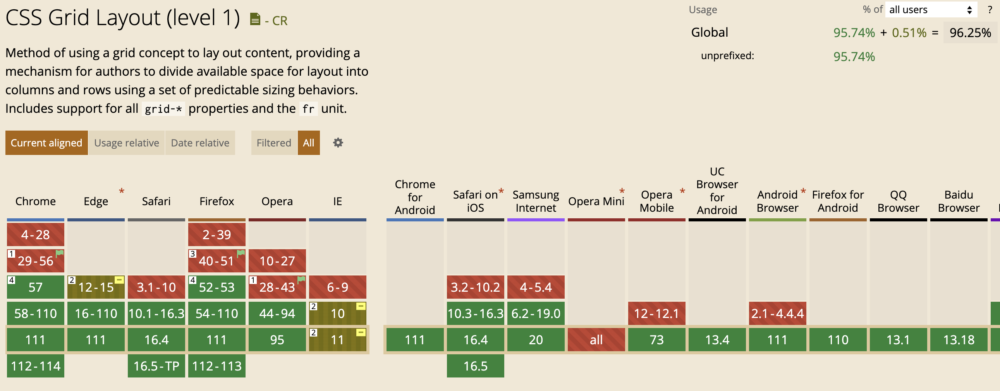
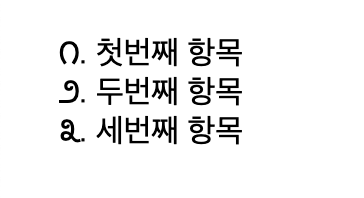

CSS는 Cascading Style Sheets의 약자로 웹 페이지의 스타일을 지정하는 언어이다. CSS를 통해 HTML에 스타일을 지정할 수 있다. 프론트의 장벽 중 하나이기도 하다. 이를 MDN 튜토리얼을 통해 공부해보자.

# 1. CSS란?

CSS는 사용자에게 문서를 표시하는 방법을 지정한다. 폰트의 크기라든가, 문서의 배경색이라든가 하는 것들을 말한다. 이때 문서라는 건 보통 마크업 언어로 구성된 텍스트 파일이다. HTML일 수도 있고 SVG나 XML일 수도 있다.

## 1.1. CSS 구문

CSS는 selector를 통해 특정 요소나 요소의 그룹을 선택하고 그 요소에 스타일을 적용한다. 이때 selector는 요소의 이름이나 클래스, 아이디 등을 사용할 수 있다. 그리고 스타일은 속성과 값으로 구성된다. 예를 들어 다음과 같다.

```css
h1 {
  color: red;
  font-size: 5em;
}
```

h1 요소들을 선택하고 `속성:값;` 형태로 스타일을 지정했다. 이때 각 스타일의 구분은 `;`로 한다. 이때 이 속성은 CSS 프로퍼티라고 하는데 각 프로퍼티에 따라 허용되는 값이 있다. color 프로퍼티에는 색상만 올 수 있는 식이다.

## 1.2. CSS 사양

다른 웹 표준 기술과 마찬가지로 CSS 또한 표준 조직이 있다. W3C의 CSS Working Group에서 만들고 있다. 새로운 CSS 기능도 여기서 개발한다.

하지만 새로운 기능을 개발할 땐 언제나 하위 호환성이 고려된다. 오래된 웹사이트도 브라우저에서 잘 작동하도록 하기 위해서이다.

## 1.3. 브라우저 지원

브라우저에 따라서 CSS를 지원하는 정도가 다르다. 브라우저에 구현되지 않은 CSS를 사용하면 화면에 출력되지 않는다. 최신 사양의 경우 브라우저에 따라 구현된 브라우저와 안 된 브라우저가 있다.

이렇게 브라우저가 특정 CSS를 구현했는지를 [caniuse.com](https://caniuse.com/)에서 확인할 수 있다. 예를 들어서 `grid`를 검색하면 다음과 같이 나온다.



# 2. CSS 시작하기

CSS는 HTML 문서에 적용된다. HTML 문서에 CSS를 적용하는 방법은 여러 가지가 있는데 가장 일반적인 방법으로 해보자. HTML 문서에 CSS를 연결하는 방법이다.

CSS 파일을 HTML 문서와 같은 위치에 만들고 HTML 문서의 head 태그 내에 다음을 추가하자. CSS 파일 이름은 `index.css`라 하자.

```html
<link href="index.css" rel="stylesheet" type="text/css" />
```

이제 CSS 파일에 스타일을 추가해보자. 다음과 같이 하면 된다.

```css
h1 {
  color: aqua;
}
```

그리고 HTML 문서에 h1태그를 하나 추가해 보자. 다음과 같이 `index.html`을 작성한다.

```html
<!DOCTYPE html>
<html lang="ko-KR">
  <head>
    <meta charset="utf-8" />
    <meta name="viewport" content="width=device-width" />
    <title>CSS 시작하기</title>
    <link href="index.css" rel="stylesheet" type="text/css" />
  </head>
  <body>
    <h1>안녕하세요.</h1>
  </body>
</html>
```

이제 `index.html`을 브라우저에서 열어보면 "안녕하세요"라는 글씨가 aqua 색(쨍한 하늘색)으로 나온다.

## 2.1. 여러 가지 셀렉터

### 2.1.1. 전체 셀렉터

`*`을 사용하면 전체 요소를 선택할 수 있다.

```css
* {
  color: aqua;
}
```

### 2.1.2. id 셀렉터

id 셀렉터는 `#id`와 같이 `#`을 사용한다. 문서 전체에서 특정 id를 가진 요소는 하나뿐이어야 하므로 id 셀렉터는 하나의 요소만 선택할 수 있다.

```css
#title {
  color: aqua;
}
```

## 2.1.3. class 셀렉터

HTML 요소 전체를 선택하여 스타일링하는 것은 한계가 많다. 클래스를 사용하면 된다. CSS에서 `.클래스명`과 같이 온점을 쓰면 클래스를 선택하여 스타일링할 수 있다.

```css
.space-list {
  list-style-type: kannada;
}
```

이제 li 태그에 `class="space-list"`를 추가하면 된다. 그러면 다음과 같이 리스트가 표시될 것이다.



그리고 특정 태그 중 특정 클래스를 가진 요소를 선택할 수도 있다. `태그.클래스명`과 같이 쓰면 된다.

```css
li.space-list {
  color: red;
}
```

그리고 하나의 요소가 여러 class값을 가질 수 있기 때문에(공백으로 구분한다) HTML 요소는 이미 스타일링된 클래스를 지정하는 것만으로 스타일을 갖다 쓸 수 있다.

## 2.1.4. 속성 셀렉터

특정 속성을 가진 요소를 선택할 수 있다. `셀렉터[속성]`과 같이 쓰면 그 셀렉터가 선택한 요소 중 특정 속성을 가진 요소를 선택할 수 있다. 다음과 같이 쓰면 a태그 중 target 속성을 가진 요소만 선택할 수 있다.

```css
a[target] {
  color: aqua;
}
```

`셀렉터[속성="값"]`은 속성의 값까지 일치하는 요소들을 선택한다.

`셀렉터[어트리뷰트~=”값”]`은 어트리뷰트가 지정된 값을 공백으로 분리된 단어로 포함하는 요소를 선택한다. 예를 들어서 `h1[title~="first"]`라고 썼다면 title 속성이 "heading-first"인 요소는 선택되지 않고 "heading first"인 요소는 선택된다. first가 단어로 분리되어 있는 것만 선택하기 때문이다.

그리고 만약 속성값들을 대소문자 상관없이 대조하고 싶다면 닫는 대괄호 바로 이전에 `i`를 붙여주자. 

```css
/* 대소문자 구분을 안 하므로 attr 속성이 A 혹은 a인 것을 선택한다. */
li[attr="a" i]
```

이외에도 셀렉터+어트리뷰트의 조건으로 선택하는 셀렉터들이 여럿 있는데 필요해지면 [poiemaWeb](https://poiemaweb.com/css3-selector)에서 찾아보자.

### 2.1.5. 복합 셀렉터

후손 셀렉터는 `parent desc`와 같이 쓰면 된다. parent 셀렉터가 선택한 요소의 모든 후손 중 desc 셀렉터에 해당하는 요소들을 선택한다.

다음과 같이 쓰면 div 태그의 후손인 p 태그를 모두 선택한다.

```css
div p {
  color: aqua;
}
```

그런데 후손이 아니라 직접 자식인 요소만 선택하고 싶다면 자식 셀렉터를 사용하면 된다. `parent > child`와 같이 쓰면 된다. parent 셀렉터가 선택한 요소의 직접 자식 중 child 셀렉터에 해당하는 요소들을 선택한다.

`A + B`와 같이 쓰면 A셀렉터 바로 뒤에 위치하는 B셀렉터 요소를 선택한다. 인접 셀렉터라 한다.

`A ~ B`와 같이 쓰면 A셀렉터 뒤에 위치하는 모든 B셀렉터 요소를 선택한다. 형제 셀렉터라 한다.

### 2.1.6. 가상 클래스 셀렉터

pseudo-class 셀렉터는 요소의 상태, 즉 마우스가 올라와 있거나 포커스가 되어 있는 상태 등의 스타일링을 할 수 있다. 이 지정에는 `:`를 사용하며 `셀렉터:가상클래스명`과 같이 쓴다.

다음과 같이 쓰면 a태그에 마우스 호버 상태일 때 a태그 텍스트가 아쿠아색이 된다.

```css
a:hover {
  color: aqua;
}
```

먼저 링크 셀렉터는 다음과 같다. 방문한 링크일 땐 `a:visited`이고, 방문하지 않은 링크일 땐 `a:link`이다.

동적 셀렉터는 다음과 같다. `selector:active`는 클릭한 상태, `selector:focus`는 포커스가 되어 있는 상태이다. `selector:hover`는 마우스가 올라와 있는 상태이다.

UI 상태 셀렉터는 `selector:enabled`는 셀렉터가 사용 가능하게 활성화된 상태, `selector:disabled`는 비활성화된 상태이다. `selector:checked`는 체크박스나 라디오 버튼이 체크된 상태이다.

이는 다른 셀렉터와 결합해 쓸 수 있는데 예를 들어서 `input:enabled + div`처럼 쓰면 활성화된 input 바로 뒤에 있는 div를 선택할 수 있다.

구조 가상 클래스는 해당 셀렉터가 어떤 위치를 차지하고 있는지에 따라 선택된다.

`selector:first-child`는 셀렉터 요소 중 첫째 자식인 요소를 선택한다. `selector:last-child`는 셀렉터 요소 중 마지막 자식인 요소를 선택한다.

`selector:nth-child(n)`는 셀렉터 요소 중 n번째 자식인 요소를 선택한다. `selector:nth-last-child(n)`는 셀렉터 요소 중 뒤에서부터 n번째 자식인 요소를 선택한다. 

이때 n이 0과 음수인 경우는 생략된다. 따라서 `li:nth-child(2n-1)`은 홀수 번째 자식인 li요소를 선택한다.

`selector:first-of-type`는 형제 요소 중 selector에 해당하는 가장 처음 요소를 선택한다. `selector:last-of-type`는 형제 요소 중 selector에 해당하는 가장 마지막 요소를 선택한다.

`selector:nth-of-type(n)`는 형제 요소 중 selector 조건에 해당하는 n번째 요소를 선택한다. `selector:nth-last-of-type(n)`는 형제 요소 중 selector에 해당하는 뒤에서부터 n번째 요소를 선택한다.

부정 셀렉터도 있다. `selector:not(A)`는 A selector에 해당하는 요소를 제외한 나머지 요소를 선택한다.

정합성 셀렉터 `:valid`는 input이나 form 요소의 정합성 검증이 성공했을 때 선택한다. `:invalid`는 검증이 실패했을 때 선택한다. 이런 정합성 검증은 required, pattern 등의 속성을 통해 할 수 있다.

### 2.1.7. 가상 요소 셀렉터

가상 요소는 요소의 특정 부분, 예를 들어서 특정 요소의 앞 등에 스타일링을 적용하기 위해 사용된다. `::`를 사용해 표현하며 CSS 표준에 정의된 이름을 사용해야 한다.

`::first-letter`는 요소 내용의 첫 번째 글자를 선택한다. `::first-line`은 요소 내용의 첫 번째 줄을 선택한다. 

`::before`는 요소의 앞에 위치하는 공간을 선택한다. `::after`는 요소의 내용 뒤에 위치하는 공간을 선택한다. 그리고 `::selection`은 드래그한 콘텐츠를 선택한다.

```css
::selection{
  background-color: aqua;
}
```

### 2.1.8 셀렉터 표

위에서 살펴본 셀렉터들을 표로 정리하면 다음과 같다.

| 셀렉터 | 예제 |
| --- | --- |
| 전체 셀렉터 | `* {}` |
| 태그 셀렉터 | `h1 {}` |
| 아이디 셀렉터 | `#my-id {}` |
| 클래스 셀렉터 | `.my-class {}` |
| 속성 셀렉터 | `a[target] {}` |
| 의사 클래스 셀렉터 | `a:link {}` |
| 의사 요소 셀렉터 | `::first-line {}` |
| 후손 셀렉터 | `div p {}` |
| 자식 셀렉터 | `div > p {}` |
| 인접 형제 셀렉터 | `h1 + p {}` |
| 일반 형제 셀렉터 | `h1 ~ p {}` |

## 2.2. 셀렉터 결합

동일한 CSS를 쓰는 항목이 2개 이상인 경우 `,`를 사용하여 선택자를 결합할 수 있다. 

```css
h1, h2, h3{
  color: aqua;
}
```

위처럼 하면 h1, h2, h3에 스타일이 모두 적용된다. 이때 주의할 점은 이렇게 결합한 선택자 중 하나라도 유효하지 않은 경우 전체 규칙이 무시된다는 것이다.

```css
h1, ..my-class, h2{
  color: aqua;
}
```

위와 같이 하면 `..my-class`가 유효하지 않은 선택자이므로 전체 규칙이 무시된다.

# 3. CSS의 구조

CSS의 언어 구조를 좀더 깊이 살펴보자.

## 3.1. CSS 적용하기

CSS 파일을 HTML 문서에 적용하는 방법은 여러 가지가 있다. 첫째는 link 요소를 사용하는 것이다. link 요소의 href 속성에 css 파일 경로를 넣어주면 된다.

```html
<link rel="stylesheet" href="./styles.css">
```

둘째는 head 태그 내부의 style 요소를 사용하는 것이다. 

```html
<head>
  <style>
    h1{
      color: aqua;
    }
  </style>
</head>
```

셋째는 인라인 스타일을 쓰는 것이다. 인라인 스타일은 HTML 요소의 style 속성에 직접 스타일을 문자열 형태로 작성하는 것이다.

```html
<h1 style="color:blue;">안녕하세요.</h1>
```

하지만 이렇게 인라인 스타일을 사용하는 건 HTML과 CSS 정보를 섞어서 가독성을 떨어뜨리고, CSS의 재사용을 불가능하게 한다.

## 3.2. CSS 셀렉터 우선순위

두 선택자가 동일한 요소를 선택하는 경우가 있을 수 있다. 이때의 우선순위는 나중에 더 자세히 다루겠지만 기본적으로 더 구체적인 게 우선순위가 높다.

```css
h1 {
  color: red;
}

.hi {
  color: aqua;
}
```

그리고 HTML 요소를 다음과 같이 작성한다.

```html
<h1 class="hi">클래스</h1>
```

이렇게 하면 클래스에 대한 CSS가 더 구체적이므로 클래스에 적용된 스타일이 적용된다.

## 3.3. 함수

CSS에서는 몇 가지 함수를 사용할 수 있다. 예를 들어서 calc 함수는 수식을 계산해주는 함수이다.

```css
width: calc(100% - 20px);
```

위와 같이 쓰면 100% 너비에서 20px를 뺀 것을 너비로 해준다. 그 외에 transform 속성에 쓰이는 rotate등의 함수도 있다.

## 3.4. at-rules

@-규칙은 at기호(@)에서 시작해서 세미콜론 또는 다음 CSS 블록까지를 포함하는 규칙이다. 일반적으로 다음과 같은 형태를 띤다.

```css
@IDENTIFIER RULE;
```

추가 스타일 시트를 가져오는 `@import`나 미디어 쿼리에 쓰이는 `@media` 등이 있다.

```css
@media (max-width: 600px) {
  h1 {
    color: red;
  }
}
```

이외에도 스타일시트에 사용되는 문자 집합을 정의하는 `@charset`, 온라인 폰트를 사용할 때 쓰이는 `@font-face`등 다양한 rule이 있다.

브라우저가 주어진 기준을 만족하면 해당 콘텐츠를 적용하는 `@supports`, CSS 애니메이션의 중간 양상을 설명하는 `@keyframes`도 꽤 쓰인다.

## 3.5. 주석

CSS 주석은 `/* */`로 표현한다.

# 4. CSS 작동 방식

브라우저가 웹페이지를 만드는 과정을 살펴본다.

브라우저는 먼저 HTML을 로드한다. 그리고 HTML을 노드 트리 형태의 DOM으로 만든다. 이때 HTML에 연결된 리소스와 CSS를 가져오지는 않는다.

DOM 만들기 작업이 끝난 후에 HTML 문서에 연결된 이미지 등의 리소스와 CSS를 가져온다. 이렇게 가져온 CSS를 분석한 후 셀렉터의 유형별로 다른 규칙들을 정렬한다. 그리고 각각의 노드에 어떤 규칙을 적용할지 결정하고 스타일을 첨부해서 렌더 트리를 만든다.

렌더 트리는 규칙이 적용된 후 최종적으로 화면에 표시되는 노드들의 집합이다. 이렇게 만들어진 렌더 트리를 기반으로 브라우저가 화면에 표시한다.

만약에 브라우저가 인식하지 못하는 CSS가 있다면 브라우저는 해당 규칙을 무시하고 다음 단계로 넘어간다.

# 참고

CSS 셀렉터 https://poiemaweb.com/css3-selector