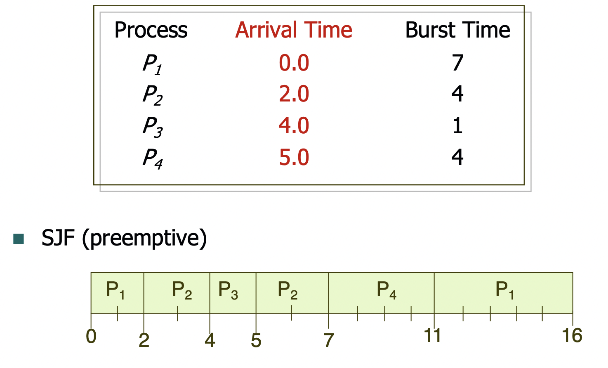
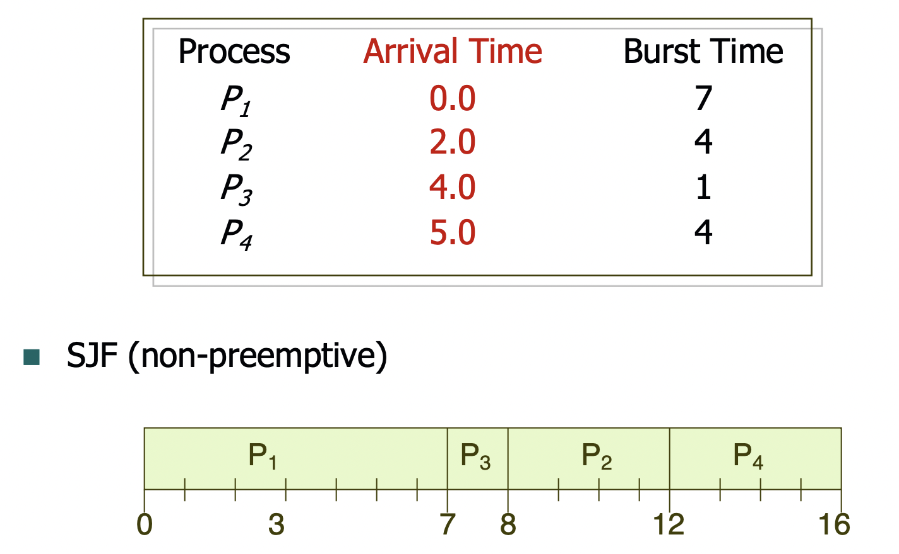
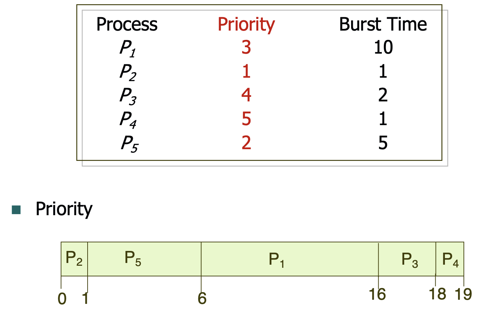

운영체제 5단원, CPU 스케줄링 부분을 정리한다.

# 1. 기본 개념들

## 1.1 CPU 스케줄링이란

우리는 하나의 프로세서(CPU)에 여러 개의 프로세스를 올려서 멀티프로그래밍을 한다. 이것의 가장 큰 목적은 프로세서가 항상 실행 중인 프로세스를 가지게 해서 CPU 이용률을 최대화하는 것이다. 따라서 어떤 프로세스가 입출력 작업 등으로 인해 대기해야 할 경우 운영체제는 프로세서를 다른 프로세스에 양도한다. 이런 것이 바로 스케줄링이다.

사실 최신 운영체제에서는 프로세스가 아니라 커널 스레드를 스케줄링한다. 하지만 프로세스 스케줄링, 스레드 스케줄링이라는 용어가 섞여서 쓰인다. 따라서 우리는 스레드에 한정된 개념을 설명할 때만 스레드 스케줄링이라는 용어를 사용하기로 한다.

이런 스케줄링이 필요한 또다른 이유는 다음과 같다. 프로세스들은 CPU의 실행과 입출력 대기의 사이클로 이루어진다. CPU 실행 -> 입출력 대기 -> CPU 실행...순으로 이루어지는 것이다. 그러나 대부분의 프로세스가 CPU 실행 시간은 짧고 입출력 대기 시간은 상대적으로 긴 I/O bound 프로세스이다. 이런 I/O 처리 시간에 프로세서가 다른 프로세스를 처리할 수 있도록 하는 게 스케줄러이다.

## 1.2 CPU 스케줄러

프로세서가 유휴 상태가 될 때마다 운영체제의 스케줄러는 레디 큐의 프로세스 중 하나를 선택해 거기에 CPU를 할당하고 실행한다. 그럼 이런 선택은 어느 상황에 이루어지는가?

1. 프로세스가 실행 상태에서 대기 상태로 전환된다.(I/O 요청 등)

2. 프로세스가 실행 상태에서 준비 상태로 전환된다.(인터럽트 등)

3. 프로세스가 대기 상태에서 준비 상태로 전환된다(I/O 완료 등)

4. 프로세스 종료

1,4의 상황에서는 스케줄러의 선택이 무조건 필요하다. 새로운 프로세스가 선택되어서 실행되어야 한다. 하지만 2,3의 경우 스케줄링을 할지 안 할지 선택할 수 있다. 이 선택에 따라 선점 스케줄링과 비선점 스케줄링이 나뉜다.

1,4의 경우에만 스케줄링이 일어날 경우 이를 비선점(non-preemptive)스케줄링이라 한다. CPU가 한 프로세스에 할당되면 프로세스가 종료되거나 대기 상태가 될 때까지 그 프로세스가 CPU를 점유한다.

반면 1,4를 제외한 다른 경우 스케줄링이 일어날 경우 선점(preemptive)스케줄링이라 한다. 한 프로세스가 실행 중에 다른 프로세스가 와서 끼어들고 CPU를 선점하는 게 가능하다는 뜻이다.

단 선점 스케줄링의 경우, 프로세스들이 특정 데이터를 공유할 때 문제가 생길 수 있다. A 프로세스가 데이터를 수정 중에 있는데 B 프로세스가 와서 CPU를 선점하고 그 데이터를 읽으면 데이터 일관성이 깨질 수 있는 것이다. 이 문제는 mutex등을 이용해 해결할 수 있는데 이것과 관련해서는 6장에서 자세히 다룬다.

## 1.3 디스패처

CPU 스케줄링에 관련된 다른 요소로 디스패처가 있다. 디스패처는 스케줄러가 선택한 프로세스에 CPU의 제어를 넘기는 기능을 한다.

- 한 프로세스에서 다른 프로세스로 컨텍스트 스위칭

- 사용자 모드로 전환

- 프로그램 재시작을 위해 사용자 프로그램의 적절한 위치로 점프

이때 기존에 실행되던 프로세스를 정지하고 PCB를 다른 곳에 저장한 후 새로운 프로세스의 PCB를 불러와 새 프로세스를 실행하는 데까지 걸리는 시간을 dispatch latency라고 한다. 당연히 가능한 한 빨라야 한다.

## 1.4 스케줄링 평가 기준

그럼 스케줄링 알고리즘들의 좋은 정도는 어떻게 판단하는가? 다음과 같은 기준들이 있다.

- CPU 이용률

- 처리량(throughput) : 단위 시간 당 처리 작업 수. 당연히 많으면 좋다.

- 총 처리 시간(turnaround time) : 프로세스가 CPU를 썼다가 사용 안 하게 될 때까지 걸리는 시간. 즉 프로세스가 처음 CPU를 점유하고 종료할 때까지 걸리는 시간이다. 중간중간 waiting time이나 다른 프로세스가 선점하고 들어와 수행되는 시간까지를 포함한다. 짧으면 좋다.

- waiting time : 프로세스가 레디 큐에서 대기한 시간들의 합.

- response time : 하나의 요청 제출 후 첫 응답이 나오기까지 걸리는 시간. 응답이 시작되기까지 걸리는 시간이지 응답을 출력하는 데 걸리는 시간은 포함하지 않는다.

CPU 이용률과 처리량은 당연히 크면 좋고, 나머지는 작으면 좋다. 따라서 일반적으로는 각 기준들의 평균값을 최대/최소로 하려고 한다.

하지만 대화형 시스템 같은 경우 응답 시간의 편차를 줄이는 것이 응답 시간의 평균값 최소화보다 중요할 수 있다. 이런 상황 등에서 꼭 평균값의 최적화만이 답은 아닐 수 있다.

# 2. 스케줄링 알고리즘

본격적으로 스케줄링 알고리즘에 대해 알아보자. 설명의 편의를 위해 스케줄링할 처리 코어는 하나뿐이라고 가정한다. 다음과 같은 알고리즘들을 알아본다.

- FCFS(First Come First Served)

- SJF(Shortest Job First)

- Priority Scheduling

- RR(Round-Robin)

- Multilevel Queue Scheduling

- Multilevel Feedback Queue Scheduling

## 2.1 FCFS

이름답게 먼저 온 프로세스부터 먼저 실행하는 방식이다. 당연히 가장 쉽고 구현하기도 쉽다. 그냥 FIFO 큐를 이용해 구현하면 되기 때문이다. 그러나 평균 대기 시간이 길 때가 많고 시분할 시스템(각 프로세스가 규칙적으로 CPU를 얻는 게 중요)에서 특히 좋지 않다. **비선점 스케줄링이다.**

여기서 참여한 각 프로세스의 시작 시간, 종료 시간을 포함해 스케줄링 결과를 표시하는 간트 차트Gantt Chart를 이용해서 알고리즘을 검토하자. 다음과 같은 프로세스들이 도착한다고 하자. Burst time 단위는 ms이다.

| Process | Burst Time |
| ------- | ---------- |
| P1      | 24         |
| P2      | 3          |
| P3      | 3          |

그러면 Gantt Chart는 다음과 같이 그려진다.

```
+----+----+----+----+----+----+----+----+----+----+----+
|                     P1                     | P2 | P3 |
+----+----+----+----+----+----+----+----+----+----+----+
0                                            24   27  30
```

평균 대기시간은 (0 + 24 +27)/3=17ms이다. 대기 시간이 매우 길다...앞에서 언급했듯이 FCFS가 평균 대기 시간이 길다는 것을 보여준다.

그러나 만약 P2, P3, P1순으로 프로세스가 실행되면 평균 대기 시간은 (6+0+3)/3=3ms가 된다. 아까는 실행시간이 긴 P1이 다른 모든 프로세스들을 기다리게 해서 대기 시간이 길어진 것이다. 이렇게 수행 시간이 큰 프로세스가 먼제 들어와서 그 뒤의 프로세스들이 불필요하게 기다리게 하는 것을 convoy effect라 한다. 이는 FCFS 스케줄링에서 긴 CPU burst를 가지고 있는 프로세스가 있으면 CPU 이용률이 낮아지는 결과를 낳는다.

## 2.2 SJF

각 프로세스에 다음 CPU 버스트 길이를 연관시킨다. 그리고 CPU가 이용 가능해지면 이를 가장 작은 next CPU burst를 가지는 프로세스에 할당한다. 그러니까 가장 빠르게 끝낼 수 있는 작업부터 실행하는 것이다.

SJF는 주어진 프로세스 집합에 대해 최소의 평균 대기 시간을 가진다는 사실을 증명할 수 있다. 하지만 다음 CPU 버스트의 길이를 아는 것은 불가능하다. 따라서 지난 CPU 버스트의 길이를 이용해서 예측을 해야 한다. 다만 이 근사 알고리즘은 여기서 크게 중요한 부분은 아니고, 그런 이유로 실질적인 구현이 어렵다는 것만 알아두자.

SJF는 선점형, 비선점형 2가지가 있다. 선점형은 CPU를 할당받은 프로세스가 CPU burst를 끝내기 전에 실행 시간이 더 짧은 다른 프로세스가 도착하면 그 프로세스가 CPU를 빼앗을 수 있다. 비선점형은 CPU를 할당받은 프로세스가 CPU burst를 끝낼 때까지 CPU를 빼앗을 수 없다.

또한 같은 CPU burst를 가지는 프로세스가 여러 개 있을 때는 어떤 프로세스를 먼저 실행할지 정해야 한다. 이는 FCFS로 간단히 해결할 수 있다.

### 2.2.1 선점형 SJF

선점형 SJF의 예시는 다음과 같다.



각 프로세스의 대기 시간은 다음과 같이 계산된다.
P1 : 11 - 0(도착 시간) - 2(11ms시점에 이미 수행한 시간) = 9
P2 : 5 - 2(도착시간) - 2(이미 수행한 시간) = 1
P3 : 4 - 4(도착시간) = 0 (도착과 동시에 바로 수행되어 끝나기 때문에 대기 0)
P4 : 7 - 5(도착시간) - 0(이미 수행한 시간) = 2

평균 대기 시간 (9 + 1 + 0 + 2) / 4 = 3

### 2.2.2 비선점형 SJF

선점형 SJF의 예시는 다음과 같다.



P1이 수행되는 동안 실행 시간이 더 짧은 P2, P3이 도착하지만 비선점형이라 CPU를 빼앗지 못하는 것을 볼 수 있다. 그리고 각 프로세스의 대기 시간 계산 시 도착 시간을 빼주어야 하는 것을 기억하자. 대기시간은 레디 큐에 들어가서부터 계산해야 하기 때문이다.

평균 대기 시간 (0 + 6 + 3 + 7) / 4 = 4
평균 turnaround time (7 + 10 + 4 + 11) / 4 = 8

SJF의 문제는 긴 CPU 버스트 시간을 갖는 프로세스가 있고 그 뒤로 계속 짧은 버스트 프로세스가 도착하면 긴 버스트를 갖는 프로세스는 starvation에 시달릴 수 있다는 것이다.

## 2.3 Priority Scheduling

각 프로세스는 우선순위를 가지며 우선순위가 높은 프로세스가 먼저 CPU를 할당받는다. 우선순위가 같은 프로세스가 동시에 도착하면 FCFS로 처리한다.

우선순위 값이 큰 것이 더 빨리 실행되어야 하는지, 혹은 우선순위 값이 작은 것이 더 빨리 실행되어야 하는지는 운영체제마다 다르다. 그저 정해진 우선순위 순서대로 실행되는 것만이 중요하다.

이 알고리즘의 문제 역시 starvation이다. 우선순위가 높은(즉 먼저 실행되어야 하는) 프로세스가 계속해서 도착하면 우선순위가 낮은 프로세스는 starvation에 시달릴 수 있다.

일반적으로 이렇게 starvation이 계속되면 시스템의 부하가 적어진 시점에 그 프로세스가 실행되거나 컴퓨터 시스템이 결국 크래시되어 아직 끝나지 않고 starvation에 시달리던 프로세스를 모두 잃어버린다.

해결책 하나는 aging이다. 시간에 따라 레디 큐에서 대기 중인 프로세스의 우선순위를 점차 높여주는 것이다.

Priority Scheduling은 비선점형, 선점형 2가지 방식이 모두 가능한데 비선점형의 예시는 다음과 같다.



평균 대기 시간 (6+0+16+18+1)/5=8.2

## 2.4 RR(Round Robin)

각 프로세스는 일정 시간(time quantum)만큼 CPU time을 할당받고 그 시간이 지나면 다시 레디 큐의 끝에 가서 대기한다. 이런 방식으로 CPU를 할당받는다. **당연히 선점 스케줄링 방식이다**

프로세스가 N개 있고 time quantum이 Q라고 하면 모든 프로세스는 (N-1)Q 이상은 기다리지 않는다. 일반적으로 SJF에 비해 더 긴 평균 대기 시간을 가진다. 하지만 모든 프로세스가 일정 시간 이상은 기다리지 않고 한 번씩 CPU를 할당받으므로 반응성이 좋다.

이때 time quantum을 정하는 것이 중요하다. time quantum이 너무 크면 모든 프로세스가 time quantum이 다 지나기 전에 종료되어 버려서 FCFS와 같아진다. 반면 너무 작으면 context switching이 너무 많아져 overhead가 커진다.

만일 time quantum이 너무 작다면 각 프로세스는 1/N(N은 프로세스 개수)성능의 프로세서를 가진 것과 비슷해지게 된다.

일반적으로 80%의 CPU버스트가 time quantum보다 작을 정도로 time quantum을 설정해야 좋다고 한다.

## 2.5 Multilevel Queue

레디 큐를 여러 개로 나누어서 우선순위를 다르게 준다. 예를 들어 레디 큐를 3개로 나누고 우선순위가 높은 큐부터 차례대로 CPU를 할당한다. 이렇게 하면 우선순위가 높은 프로세스가 더 많은 CPU time을 할당받을 수 있다.

예를 들어서 대화형 작업을 우선순위가 높은 큐에 할당하고 계산 위주의 batch job을 우선순위가 낮은 큐에 할당하는 식이다. 이렇게 하면 대화형 작업이 더 많은 CPU time을 할당받을 수 있다.

그리고 각 큐는 다른 스케줄링 알고리즘을 사용할 수 있다. 예를 들어 우선순위가 높은 큐는 SJF, 우선순위가 낮은 큐는 FCFS를 사용할 수 있다.

또한 큐들 사이의 스케줄링도 필요하다. 각 큐들 간의 우선순위를 미리 정해두는 fixed priority 방식을 사용할 수 있고 이 경우 starvation문제가 발생할 수 있다. 반면 각 큐에 CPU time의 일정 부분을 할당하는 time slice 방식을 사용할 수 있다. 80%의 CPU time을 우선순위가 높은 큐에 할당하고 20%의 CPU time을 우선순위가 낮은 큐에 할당하는 식이다.

## 2.6 Multilevel Feedback Queue

Multilevel Queue의 문제점을 해결하기 위해 나온 방식이다. Multilevel Feedback Queue에서는 큐 사이에서 프로세스가 이동하는 것을 허용한다. 예를 들어 너무 오래 걸리는 프로세스는 우선순위가 낮은 큐로 이동한다든지 하는 식이다.

Multilevel Feedback Queue 스케줄러는 다음과 같은 매개 변수에 의해 정의된다.

- 큐 개수
- 각 큐의 스케줄링 알고리즘
- 프로세스를 상위 큐로 승격시키는 기준
- 프로세스를 하위 큐로 강등시키는 기준
- 프로세스가 도착할 시 어떤 기준으로 어떤 큐에 넣을지를 결정하는 기준

## 2.7 스케줄링 알고리즘의 평가

스케줄링 알고리즘을 평가하는 방법들은 다음과 같은 게 있다.

- 결정론적 모델링

기존에 정의된 특정 프로세스 워크로드들을 정하고 각 알고리즘들이 그 워크로드들을 처리하는 시간을 측정하여 그 시간으로 알고리즘들을 비교한다.

- Queueing Model

Little's formula를 사용하여 각 알고리즘들의 평균 대기 시간을 계산한다.

- 시뮬레이션

실제 시스템 모델을 실행하고 각 이벤트들을 기록하여 각 알고리즘들의 평균 대기 시간을 계산한다. 이때 시스템을 모니터링하여 이벤트들의 순서를 기록하는 것을 trace tape라고 한다.

- Implementation

스케줄링 알고리즘 평가에 가장 정확한 방법이다. 실제 운영체제에 각 스케줄링 알고리즘을 넣고 실행해 봄으로써 비교하는 것이다. 하지만 이 방법은 시스템을 구현하는 것이기 때문에 시간이 오래 걸린다.

# 참고

박성범 님의 블로그, 공룡책으로 정리하는 운영체제 Ch.5 https://parksb.github.io/article/9.html
