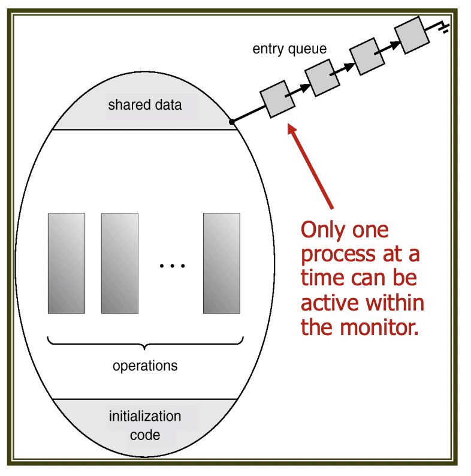

운영체제 6단원, 동기화 도구에 관해 정리한다.

# 1. 동기화 도구의 배경

앞서 프로세스끼리 영향을 주고받는 방법에는 공유 데이터와 메시지 전달이 있다고 했다. 그런데 공유 데이터를 사용할 때는 동기화 문제가 발생할 수 있다. 예를 들어 A 프로세스가 공유 데이터에 쓰고 있는데 B 데이터도 공유 데이터에 접근해서 쓰기를 시도한다면 어떤 데이터가 공유 데이터에 쓰여질지 알 수 없다.

이렇게 여러 프로세스가 동일한 데이터에 접근하여 조작하고 실행 결과가 접근의 특정 순서와 어떤 프로세스가 먼저 종료되는지에 따라 달라지는 상황을 race condition이라 한다. 이런 문제를 해결하기 위해 동기화가 필요하다.

동기화에 요구되는 것은 원자적인 연산인데 원자적 연산이란 연산이 실행되는 동안에는 다른 프로세스가 해당 연산을 실행할 수 없는 연산을 말한다. 예를 들어 공유 데이터에 쓰기를 하는 연산이 원자적이라면 하나의 프로세스가 공유 데이터에 write를 하는 동안 다른 프로세스가 공유 데이터에 쓰기를 시도할 수 없다.

또한 다중 스레드 환경이 일반적이 되어감에 따라 동기화 문제가 발생할 수 있는 상황이 더 많아졌다. 그래서 동기화 도구의 필요성은 더 증가하고 있다.

# 2. 임계 구역 문제

임계 구역(critical section)은 둘 이상의 프로세스가 동시에 접근해서는 안 되는 공유 데이터 영역에 접근하는 코드를 이야기한다. 즉 하나의 프로세스가 임계 구역을 수행하는 동안에는 다른 프로세스들이 그 프로세스의 임계 구역에 접근할 수 없다.

그리고 임계구역 문제(critical section problem)은 프로세스들이 각자의 활동을 동기화할 때 사용할 수 있는 프로토콜을 설계하고 임계 구역에서 하나의 프로세스만 실행되도록 하는 문제를 말한다.

## 2.1 문제 해결의 조건

임계 구역 문제를 해결하는 방법은 여러 가지가 있다. 그러나 어떤 방법이든 다음 조건을 충족해야 한다.

1. 상호 배제(mutual exclusion) : 임계 구역에는 하나의 프로세스만 접근할 수 있다.
2. 진행(progress) : 자신의 임계구역에서 실행되고 있는 프로세스가 없고 각자의 임계구역에 진입하고자 하는 프로세스들이 있다면 그 임계구역에 진입하고자 하는 프로세스의 선택은 무기한 연기될 수 없다. 이 말은 임계 구역에서 작업중인 프로세스가 없고 거기에 진입하고자 하는 프로세스가 있다면 그 프로세스는 무기한 연기되지 않고 임계 구역에 진입할 수 있어야 한다는 것이다.
3. 한정된 대기(bounded waiting) : 특정 프로세스가 자신의 임계 구역에 진입하고자 하는 요청을 한 이후 그 요청의 허용까지, 다른 프로세스들이 각자의 임계 구역에 진입하도록 하는 횟수에 제한이 있어야 한다. 즉 임계구역에 진입하고자 하는 프로세스를 무한정 기다리게 해선 안된다.

## 2.2 용어 정리

critical section과 관련된 용어들을 정리한다.

- entry section : 각 프로세스는 자신의 임계구역으로 진입하기 위해 진입 허가를 요청한다. 임계 구역에 진입하기 위한 이런 요청을 보내는 부분을 entry section이라고 한다.
- exit section : 임계 구역에서 실행을 마치고 나가기 위해 임계 구역을 떠나는 부분을 exit section이라고 한다.
- remainder section : entry section, critical section, exit section을 제외한 나머지 부분을 remainder section이라고 한다.

일반적인 프로세스의 구조는 다음과 같다.

```c
while(true){
  entry section;
  critical section;
  exit section;
  remainder section;
}
```

## 2.3 생각할 수 있는 해결책

Peterson's Algorithm이라는 해결책이 있지만 먼저 단순하게 생각할 수 있는 해결책을 생각해보자.

프로세스는 P0, P1 2가지밖에 없다고 생각하자. 그럼 먼저 다음과 같은 해결책을 생각할 수 있다.

### 2.3.1 첫번째 시도

turn이라는 변수를 두어서, 초기에는 turn=0이고 만약 turn==i이면 Pi, 즉 i번 프로세스가 임계 구역에 진입할 수 있다고 가정하자. 그럼 다음과 같은 코드를 i번 프로세스에서 실행하는 해결책을 생각할 수 있다.

```c
do{
  while(turn != i);
  // critical section
  turn = j;
  // remainder section
}while(1);
```

프로세스 0이 시작하고 임계 구역에서 작업하고, 그게 끝나고 나면 다른 프로세스(여기서는 넘길 프로세스가 1뿐)에 임계 구역을 넘기고 하면서 잘 작동할 것처럼 보인다.

하지만 이는 progress 조건을 위배한다. turn==0이고 P1이 준비 상태가 되어 임계 구역에 진입하려고 하면 turn!=1이기 때문에 P1은 계속해서 while문을 돌게 된다. 그러면 P1은 계속해서 임계 구역에 진입할 수 없게 된다.

### 2.3.2 두번째 시도

프로세스 개수만큼의 원소를 갖는 boolean flag[N]를 선언한다. 여기서는 프로세스가 2개이므로 flag[2] 이다. 초기값은 모두 false로 한다. 그리고 flag[i]가 true이면 i번 프로세스가 준비된 것이라고 가정하자. 그럼 다음과 같은 코드를 i번 프로세스에서 실행하는 해결책을 생각할 수 있다.

```c
do{
  flag[i] = true;
  while(flag[j]);
  // critical section
  flag[i] = false;
  // remainder section
}while(1);
```

이 코드는 상호 배제를 만족하지만 역시 progress에서 안된다. P0에서 flag[0]이 true가 되고 P0이 critical section에 진입하기 전에 P1에서 flag[1]을 true로 만들게 되면(flag[0], flag[1] 모두 true) 아직 임계 구역에는 아무 프로세스도 진입하지 않았는데 P0, P1 모두 무한히 대기하게 된다.


### 2.3.3 세번째 시도(Peterson's Algorithm)

turn, flag 모두 사용한다. turn==i이면 i번째 프로세스가 임계 구역에 진입할 수 있다고 가정하자. 그리고 flag[i]가 true이면 i번 프로세스가 준비된 것이라고 가정하자. 그럼 다음과 같은 코드를 i번 프로세스에서 실행하는 해결책을 생각할 수 있다.

```c
do{
  flag[i] = true;
  turn = j;
  while(flag[j] && turn == j);
  // critical section
  flag[i] = false;
  // remainder section
}while(1);
```

i번 프로세스는 임계 구역으로 진입하기 위해 먼저 flag[i]를 true로 만들고 turn을 j로 지정한다. 만약 j번 프로세스가 준비가 된다면 프로세스에 진입할 수 있도록 하기 위해서이다.

두 프로세스가 동시에 진입을 원한다고 해도 결국 turn이 어떤 값이 되는지에 따라서 임계 구역에 진입하는 프로세스가 결정될 것이다.

이 방식은 앞의 3가지 조건을 모두 만족한다. 하지만 최신 컴퓨터 아키텍처에서는 컴파일러가 종속성 없는 읽기/쓰기 작업의 순서를 변경할 가능성이 있기 때문에 Peterson's Algorithm은 최신 컴퓨터 아키텍처에서의 동작을 보장할 수 없다.

또다른 상호 배제 알고리즘으로 Dekker's Algorithm이 있다. 여기 관심 있다면 다음 링크를 참고한다. [Peterson's Algorithm, Dekker's Algorithm difference](https://cs.stackexchange.com/questions/12621/contrasting-peterson-s-and-dekker-s-algorithms), [crocus 블로그의 Dekker's Algorithm](https://www.crocus.co.kr/1370)

하지만 앞서 살펴본 알고리즘들은 모두 최신 컴퓨터 아키텍처에서의 동작을 보장할 수 없다. 따라서 우리는 앞으로 설명할 적절한 동기화 도구를 사용해야 한다. 이 동기화 도구는 하드웨어적인 지원부터 고수준 API까지 다양하다. 하나씩 보자.

# 3. 동기화를 위한 하드웨어 지원

## 3.1 Memory Barrier

앞서 보았던 Peterson's Algorithm의 문제는 시스템이 명령어 순서를 재정렬할 수 있다는 점에서 온다. 즉 한 프로세스의 메모리 변경 사항이 다른 프로세스에게 즉시 반영되지 않을 수 있다는 것이다. 이러한 문제를 해결하기 위해 하드웨어적으로 지원하는 동기화 기능이 바로 Memory Barrier이다.

Memory Barrier 명령어는 시스템에서 후속으로 오는 load, store 연산이 실행되기 전에 현재 프로세스에서 진행되고 있는 저장 작업이 메모리에서 완료되도록 한다. 그래서 그 후의 load, store 연산이 메모리에 반영된 최신 값을 읽거나 쓸 수 있도록 한다.

즉 한 프로세서의 메모리 변경 결과가 다른 프로세서들에게 모두 보이도록 하여 메모리를 동기화하는 것이다.

## 3.2 하드웨어 명령어

현대의 시스템들은 인터럽트되지 않고 원자적으로 연산을 해주는 특별한 하드웨어 명령어를 제공한다. 이런 명령어를 사용하면 임계 구역 문제들을 간단하게 해결할 수 있다. 이 명령어들을 이용해서 lock을 조작해 주는 방식이다. 대표적으로 TestAndSet, Swap 명령어를 들 수 있다.

이런 명령은 예를 들어서 C++의 atomic 헤더에서 제공된다. 이 헤더는 원자적 변수나 플래그 타입도 제공하는데 이 변수, 타입들을 조작하는 것이다. 예를 들어 `atomic_flag_test_and_set`과 같은 함수들이 제공된다. [이를 알려준 사람](http://fienestar.tistory.com/)

### 3.2.1 Test and Set

TestAndSet 명령은 한 워드의 내용을 검사하고 변경한다.

```c
// 다음 연산은 원자적으로 진행된다.
int TestAndSet(int *target) {
    int rv = *target;
    *target = TRUE;
    return rv;
}
```

중요한 건 이 명령이 atomic하게 실행된다는 것이다. 따라서 TestAndSet 명령을 이용해서 lock을 구현하면 상호 배제를 쉽게 구현할 수 있다.

```c
do{
  while(TestAndSet(&lock));
  // critical section
  lock = FALSE;
  // remainder section
} while(TRUE);
```

임계 구역 접근이 끝나고 나면 lock 변수를 FALSE로 바꾸어 다른 프로세스가 접근할 수 있도록 한다. 단 이 코드는 lock 변수가 TRUE일 경우 프로세스가 준비되어도 계속해서 대기하게 된다. 즉 bounded waiting은 만족하지 못한다.

### 3.2.2 Swap

Swap 명령은 두 워드의 내용을 교환한다.

```c
void Swap(bool *x, bool *y) {
    bool tmp = *x;
    *x = *y;
    *y = tmp;
}
```

Swap 명령을 이용해서 lock을 조작해 상호 배제를 구현하면 다음과 같다.

```c
//lock은 초기에 false로 설정되어 있다.
do{
  key=TRUE;
  while(key==TRUE){
    Swap(&key, &lock);
  }
  // critical section
  lock=FALSE;
  // remainder section
} while(TRUE);
```

이 역시 lock 변수가 TRUE일 경우 프로세스가 준비되어도 계속해서 대기하게 된다. 즉 bounded waiting은 만족하지 못한다. bounded waiting까지 만족하는 코드는 waiting 배열까지 사용하여 다음과 같이 작성할 수 있다.

waiting 배열의 초기값과 lock 변수의 초기값은 모두 FALSE로 설정한다. 다음 코드는 i번 프로세스에서 실행되는 코드이다.

```c
do{
  waiting[i]=TRUE; key=TRUE;
  while(waiting[i]==TRUE && key==TRUE){
    Swap(&key, &lock);
  }
  waiting[i]=FALSE;
  // critical section
  j=(i+1)%n;
  while(j!=i && waiting[j]==FALSE) j=(j+1)%n;
  if(j==i) lock=FALSE;
  else waiting[j]=FALSE;
  // remainder section
} while(TRUE);
```

이 프로세스가 임계구역에 진입하는 건 waiting[i]==FALSE거나 key==FALSE일 때이다. 그리고 key는 Swap 명령어를 통해서만 FALSE가 될 수 있다. 그리고 waiting[i]가 FALSE가 되는 것은 다른 프로세스가 임계구역을 떠날 때뿐이다. 즉 딱 하나의 프로세스의 waiting[i]만이 FALSE일 수 있다. 따라서 상호 배제가 보장된다.

그리고 다음 코드를 보자.

```c
while(j!=i && waiting[j]==FALSE) j=(j+1)%n;
```

이 코드는 하나의 프로세스가 임계 구역을 떠날 때 실행되는데 이 코드는 waiting 배열을 순회하며 waiting이 TRUE인 첫 프로세스를 찾는다. 그리고 그 프로세스의 waiting을 FALSE로 바꾸어 다음 프로세스가 임계 구역에 진입할 수 있도록 한다.

따라서 임계구역에 들어가고자 하는 프로세스는 n회 내에 언젠가는 임계구역에 진입할 수 있다. bounded waiting이 보장된다.

## 3.3 Atomic Variable

어떤 시스템에서는 원자적 연산을 제공하는 변수인 원자적 변수(Atomic Variable)를 제공한다. 이 변수에 대한 연산은 원자적으로 수행된다.

하지만 보통 임계 구역 문제를 해결하는 데에 쓰이기보다는 공유 데이터 한 개의 원자적 갱신을 보장하는 데에 많이 쓰인다.

# 4. 소프트웨어 도구들

## 4.1 Mutex lock

임계 구역 문제를 해결하기 위한 좀 더 추상화된 소프트웨어 도구들이 있다. 가장 간단한 도구가 바로 mutex lock이다. 이 mutex 는 mutual exclusion의 약자로 상호 배제를 의미한다.

프로세스가 임계 구역에 진입하고자 할 때 lock을 획득하고, 임계 구역을 떠날 때 lock을 반환한다. 이 때 lock을 획득하고 반환하는 동작은 원자적으로 수행되어야 한다.

lock을 얻는 acquire, 반환하는 release 함수가 있다고 하자. 이 함수들은 다음과 같이 구현할 수 있다.

```c
acquire(){
  while(available==FALSE); // busy waiting
  available=FALSE;
}

release(){
  available=TRUE;
}
```

다른 프로세스가 임계구역을 점유하고 있으면 임계 구역에 들어가려고 하는 다른 프로세스들은 계속 acquire를 호출하면서 기다린다. 이를 busy waiting이라고 한다.

이러한 busy waiting을 하는 락 유형을 스핀 락이라고도 한다. 락을 사용할 수 있을 때까지 프로세스가 돌고(spin)있기 때문이다. 이 방식은 다른 프로세스가 생산적으로 사용할 수 있는 연산 능력을 낭비할 가능성이 있다. 그러나 프로세스가 임계 구역에 진입할 수 있게 되면 컨텍스트 스위칭 없이 바로 임계 구역에 진입할 수 있다는 장점이 있다.

따라서 잠깐 동안 락을 유지해야 하는 경우(락이 잠깐만 걸릴 거라고 기대될 때) 스핀 락을 사용하는 경우가 많다. 그리고 멀티프로세서 시스템에서 자주 사용된다.

## 4.2 Semaphore

세마포어는 뮤텍스와 비슷하지만 busy waiting이 필요없는 도구이다.

세마포어 S는 wait, signal 2개의 원자적 연산으로만 접근 가능한 정수 변수이다.

```c
wait(S){
  while(S<=0); // busy waiting
  S--;
}

signal(S){
  S++;
}
```

세마포어는 네덜란드 사람인 Edsger Dijkstra가 고안했다. 따라서 wait은 검사를 의미하는 네덜란드어 Proberen에서 따서 P(S), signal은 증가를 의미하는 네덜란드어 Verhogen에서 따서 V(S)라고도 한다.

### 4.2.1 세마포어 종류

카운팅 세마포어(counting semaphore)는 세마포어가 가질 수 있는 값에 제한이 없다. 이 세마포어는 임계 구역에 들어갈 수 있는 프로세스의 수를 제한하는 데 쓰일 수 있다.

이진 세마포어(binary semaphore)는 세마포어가 가질 수 있는 값이 0, 1뿐이다. 카운팅 세마포어보다 구현이 간단하며 mutex lock과 유사하다.

### 4.2.2 세마포어의 활용

먼저 N개의 프로세스가 임계 구역을 놓고 경쟁한다고 생각하자. 그러면 초기값 1을 가지는 mutex semaphore를 사용하면 된다.

```c
do{
  wait(mutex); // mutex<=0 이면 대기
  // 임계 구역
  signal(mutex); //mutex++
  // 나머지 구역
} while(1);
```

좀더 일반적인 동기화 문제에도 사용 가능하다. 만약 i번 프로세스의 A 작업이 반드시 끝난 후에 j번 프로세스의 B 작업을 진행하고 싶다고 하자. 그러면 초기값이 0인 flag semaphore를 사용하면 된다.

```c
Pi{
  ...
  A작업
  signal(flag); //A작업이 끝나고 나서야 flag를 사용 가능 상태로 만든다.
}

Pj{
  ...
  wait(flag); //flag가 1이 될때까지 기다리고 나서 B 작업을 시작한다
  B작업
}
```

세마포어의 좀더 구체적인 구현은 다음 블로그에 있다. [Rebro님 블로그](https://rebro.kr/176?category=504670)

# 5. 모니터

세마포어나 뮤텍스 락을 이용해서 임계 구역 문제를 해결할 때, 프로그래머의 잘못으로 인해 오류가 쉽게 발생할 수 있다. 이를 방지하기 위해 모니터라는 도구를 사용한다. 모니터는 동시 수행 중인 프로세스들 간 추상 데이터의 안전한 공유를 보장한다. 모니터 안에 항상 하나의 프로세스만 활성화되는 것을 보장하기 때문이다.



모니터 내부에서 어떤 프로세스의 동기화를 제공하기 위해서는 condition 구조체가 제공된다. condition x, y; 와 같이 선언될 수 있다.

이 condition 변수에는 오직 wait, signal 함수만이 제공된다. 예를 들어 x.wait()을 호출한 프로세스는 다른 프로세스가 x.signal()을 호출할 때까지 일시 중지되는 식으로 사용할 수 있다.

그리고 x.signal()의 호출은 딱 하나의 일시 중지된 프로세스를 재개한다. 만약 일시 중지된 프로세스가 없다면, x.signal()은 아무런 일도 하지 않는다. x,y는 모니터 내부의 세마포어 같은 역할을 하는 것이다. 단 세마포어의 signal 연산과는 달리 아무 일도 하지 않을 가능성이 있다는 점이 차이이다.

## 5.1 모니터에서의 Signal 관련 문제

모니터 내의 프로세스 P에서 x.signal() 이 호출되었다고 하자. 그리로 x.wait()에 의해 중지되었던 모니터 내의 다른 프로세스 Q가 있다. x에 의해 중지된 프로세스는 Q 하나라고 하자. 그러면 P는 기존에 실행 중이었는데 x.signal()에 의해 Q 또한 재개되어야 한다. 하지만 모니터 내에서는 단 하나의 프로세스 활성화만 허용한다.

2가지 방법이 있다.

- Signal and Wait : P는 Q가 모니터를 떠날 때까지 기다린다. 그러면 Q가 모니터를 떠나면 P가 다시 활성화된다.
- Signal and Continue : Q는 P가 모니터를 떠날 때까지 기다린다.

P가 이미 모니터 내에서 실행되고 있었기 때문에 signal and continue 방법이 더 합리적인 것 같다. 따라서 이게 pthread 등에서 널리 사용되는 방법이다.

하지만 signal and continue에선 P에서 Q가 기다리고 있는 어떤 논리적인 조건을 바꿔 버릴 수도 있기 때문에 signal and wait도 나름의 장점이 있다.

# 6. Liveness Problem

Liveness는 프로세스가 무한정 기다리지 않고, 언젠가는 무언가를 하게 되는 것을 의미한다. 예를 들어 무한루프로 인해 프로세스가 영원히 실행되지 못하는 것은 liveness failure이다. 다음과 같은 예시들이 있다.

## 6.1 Deadlock

2개 이상인 프로세스들이 대기 중이며 대기 중인 프로세스들 중 하나에 의해서만 발생할 수 있는 이벤트가 발생할 때 까지 무한정 기다리는 것이다.

2개의 프로세스 P0, P1이 있고 1로 초기화된 세마포어 S,Q에 접근한다고 하자.

```c
P0
wait(S);
wait(Q);
...
signal(S);
signal(Q);

P1
wait(Q);
wait(S);
...
signal(Q);
signal(S);
```

P0이 wait(S)를 실행하고 P1이 wait(Q)를 실행한다. 각자 다음 wait으로 넘어가기 위해서는 다른 프로세스에서 signal을 호출해 줘야 한다. 이런 게 deadlock(교착)이다.

## 6.2 Starvation

프로세스가 무한히 block되는 것이다. 중단된 상태로 영원히 세마포어의 웨이팅 리스트에서 제거되지 못하는 것을 말한다. 예를 들어 락을 다시 획득할 때 락을 기다리고 있던 프로세스들 중에서 우선순위가 가장 높은 프로세스가 락을 획득한다고 하자.

그리고 락의 웨이팅 리스트에는 계속 새로운 프로세스가 추가되고 있다고 하자. 그러면 락의 웨이팅 리스트에 있는 프로세스 중 우선순위가 낮은 프로세스는 무한에 가깝게 기다리게 될 수 있다. 이런 게 starvation이다.

## 6.3 Priority Inversion

우선순위가 높은 프로세스가 우선순위가 낮은 프로세스들에 의해 접근되고 있는 커널 데이터(락이 걸려 있음)를 접근해야 할 때 스케줄링에 발생하는 어려움이다.

예를 들어서 프로세스 A, B, C가 있고 우선순위는 `A<B<C`라고 하자. 그리고 C는 A에서 접근하고 있는 커널 데이터에 접근해야 한다. 그러면 커널 데이터엔 락이 걸려 있으므로 C는 A의 데이터 접근이 끝날 때까지 기다리게 된다.

하지만 B가 나타나서 A를 선점해 버렸다고 하자. 그러면 C는 B보다 우선순위가 높음에도 불구하고 B가 끝날 때까지 기다려야 한다. 이런 게 priority inversion이다.

A가 데이터 접근중 -> C는 A를 기다림 -> B가 A를 선점 -> C는 A가 끝나기를 기다리기 위해 우선순위가 더 낮은 B를 기다림

# 참고

박성범 님의 블로그, 공룡책으로 정리하는 운영체제 Ch6 https://parksb.github.io/article/10.html

C++ atomic 헤더 레퍼런스 페이지 https://en.cppreference.com/w/cpp/header/atomic
