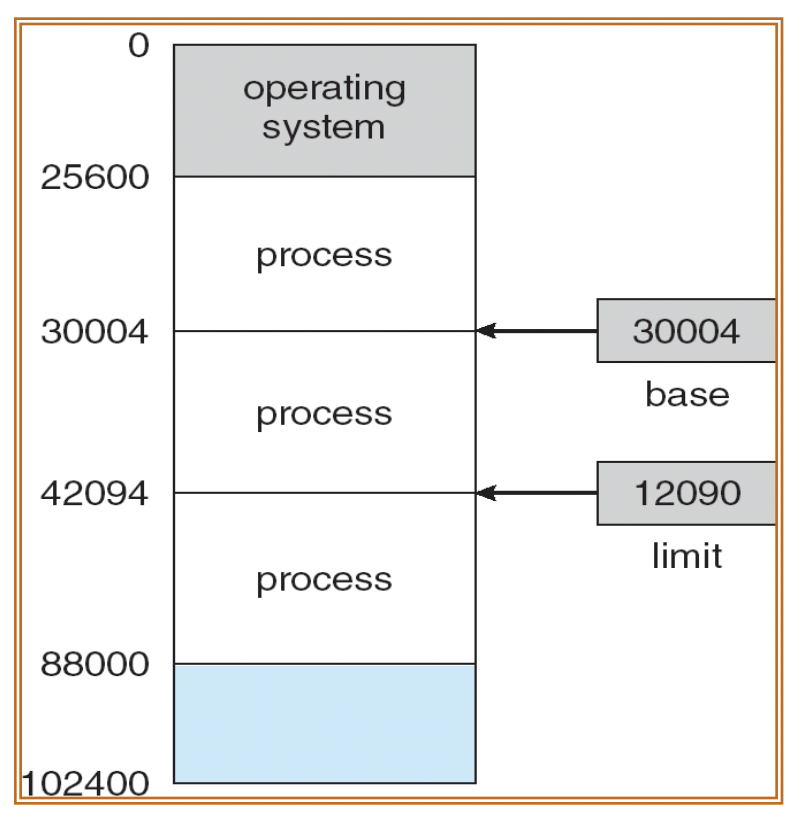
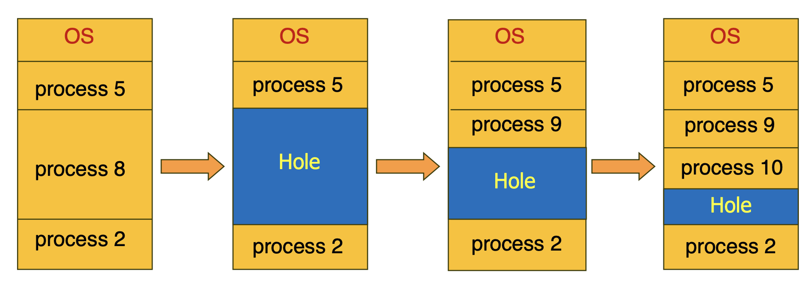
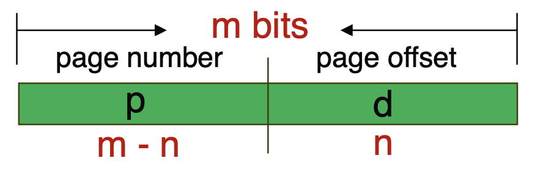
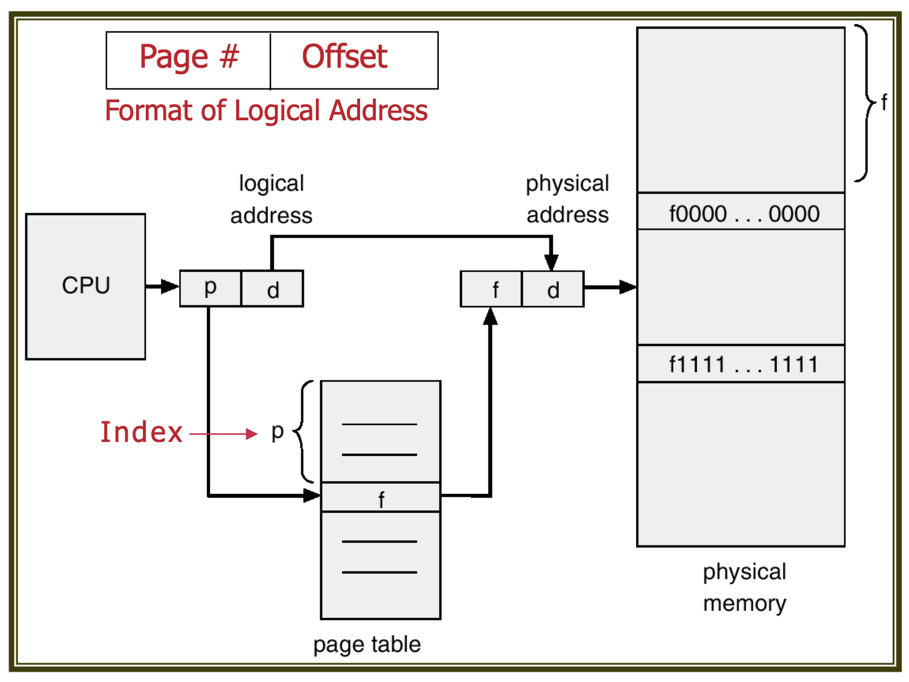
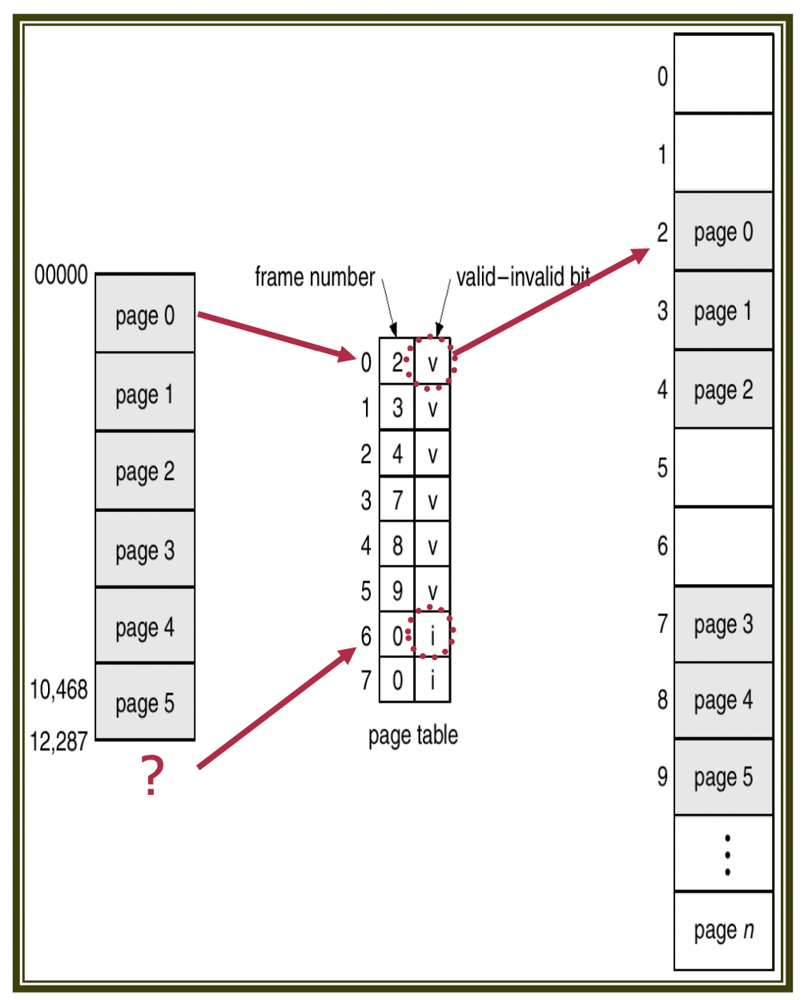
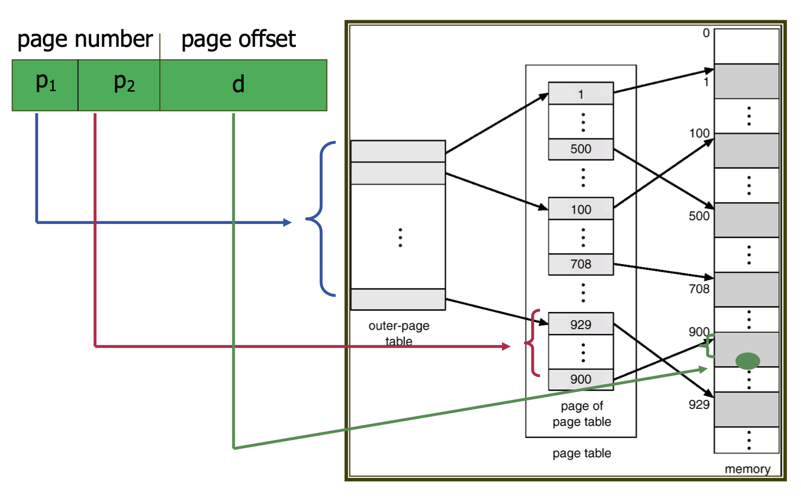
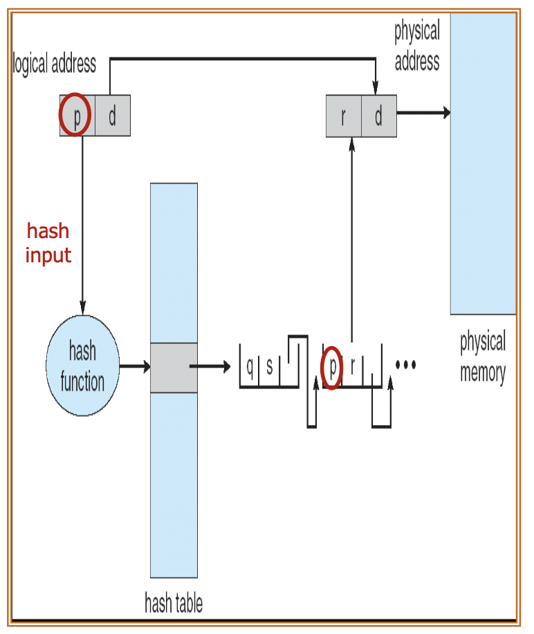
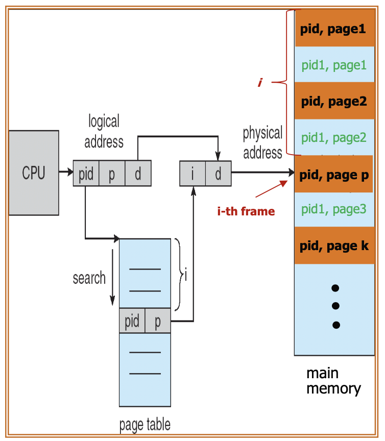

운영체제 9단원, 메인 메모리에 관하여 정리한다. 주로 메모리를 관리하는 다양한 방법에 대해 설명한다.

# 1. 배경

프로그램은 기본적으로 메모리에 올라간 코드이다. 그리고 다음과 같은 과정을 거쳐서 실행된다.

메모리에서 명령어 하나를 가져온다(fetch)
명령어를 해독한다(decode)
필요한 경우 메모리에서 피연산자를 가져온다(operation fetch)
피연산자를 이용하여 연산을 수행한다(execute)
연산 결과를 메모리에 저장한다(store)

이때 메모리는 주소에 의해서 접근되는데, 이런 메모리는 어떻게 관리되는가?

## 1.1. 기본 하드웨어

CPU는 레지스터와 메인 메모리에 직접 접근할 수 있다. 디스크에는 직접 접근할 수 없다. 따라서 모든 명령어와 사용되는 데이터는 메모리에 올라와 있어야 한다.

하지만 레지스터의 접근은 1사이클만에 가능한 데 반해 메인 메모리에 접근하는 것은 훨씬 더 많은 사이클이 소요된다. 따라서 메인 메모리를 사용하는 명령의 경우 필요한 데이터가 아직 메인 메모리에서 로드되지 않아서 명령어의 실행이 지연되는 현상이 나타난다. 이를 stall이라 한다.

이를 해결하는 방법으로는 CPU와 메인 메모리 사이에 캐시 메모리를 추가하는 방법이 있다.

## 1.2. 메모리 보호

시스템의 올바른 동작을 위해서는 메모리에 있는 프로그램이 다른 프로그램의 메모리에 접근하지 못하도록 해야 한다. 이를 위해서 각 프로세스가 독립된 공간을 가지도록 한다.

이 독립된 공간은 다음과 같이 base와 limit를 통해서 정의된다. 특정 프로세스에 대해 legal한 메모리라 함은 base에서 base+limit까지이다.

이 base, limit는 커널 모드에서 정해지며 사용자 프로그램은 이를 변경할 수 없다. 또한 다른 프로세스의 메모리에 접근하게 되면 운영체제는 이를 오류로 감지하고 트랩(소프트웨어 인터럽트)을 발생시킨다. 이렇게 해서 현재 실행중인 프로그램이 운영체제나 다른 사용자 프로그램에 접근하는 것을 막을 수 있다.

## 1.3. 주소 바인딩

프로세스는 메모리의 어느 위치에 올라가게 되는가? 원시 프로그램에서 주소는 실제 메모리 주소가 아니라 심볼 형태로 표현된다. 컴파일러가 이를 relocatable address로 바인딩하고 링커가 이를 absolute address로 바인딩한다. 이렇게 하나의 주소 공간을 다른 주소 공간으로 매핑하는 걸 주소 바인딩이라 한다.

이때 명령어와 데이터의 바인딩이 어느 시점에 이루어지는지에 따라 다음과 같이 나눠진다.

- compile time : 컴파일 시점에 물리 주소가 정해진다. 프로세스가 메모리 내에서 들어갈 위치를 컴파일 시간에 미리 알 수 있다. 따라서 absolute code를 생성할 수 있다. 그러나 주소를 완전히 고정해 버리기 때문에 비효율 혹은 충돌이 발생할 수 있다.
- load time : 컴파일 타임에 메모리 위치를 알 수 없다면 이진 코드는 재배치 가능한 코드로 만들어진다. 그리고 이 코드는 프로그램이 메인 메모리로 적재되는 시점에 메모리에 올라가는 위치에 따라서 주소가 바인딩된다.
- Execution time : 주소 바인딩이 런타임까지 미루어지고, MMU(Memory Management Unit)가 실행 시간에 논리 주소를 물리 주소로 변환해 준다.

어떻게 바인딩이 이루어지든 사용자 프로그램은 언제나 논리 주소(logical address, virtual address)만 다룬다. 사용자 프로그램은 절대 물리 주소에 직접 접근하지 않는다.

## 1.4. 동적 라이브러리, 정적 라이브러리

라이브러리는 정적 라이브러리, 동적 라이브러리가 있다.

### 1.4.1. 정적 라이브러리

프로그램이 실행되기 전 컴파일 타임에 링커가 정적 라이브러리 내용을 실행 파일에 포함시킨다. 그러나 프로그램이 실행되는 동안에는 라이브러리의 내용을 변경할 수 없다. 그리고 실행 파일 크기가 커질 수 있다.

### 1.4.2. 동적 라이브러리

사용자 프로그램이 실행되는 시점(런타임)에 프로그램에 연결되는 라이브러리이다. 프로그램이 동적 라이브러리에 있는 코드를 참조하는 시점에 로더가 DLL파일을 찾아서 필요한 경우 메모리에 올린다.

당연히 라이브러리가 있는 주소로 계속 점프하기 때문에 성능 저하가 발생한다. 하지만 메모리가 적게 들고 실행 파일 크기가 작아지며 라이브러리 갱신이 쉽다. 동적으로 링킹되기 때문에 DLL파일 하나만 수정하면 그 파일을 사용하는 모든 실행 파일에서 수정된 DLL을 사용할 수 있다. 또한 동적 라이브러리는 여러 프로그램에서 공유할 수 있으므로 DLL 인스턴스가 메인 메모리에 하나만 있을 수 있다.

## 1.5. Dynamic Loading, Dynamic Linking

### 1.5.1. Dynamic Loading

동적 적재는 loading, linking을 실행 시점까지 미룬다. 그리고 특정 루틴이 필요해지면 그 루틴이 메모리에 있는지를 먼저 검사한다. 만약 그 루틴이 메모리에 적제되지 않은 상태라면 relocatable linking loader가 그 루틴을 메모리에 적재한다. 그리고 그 루틴을 호출한다. 이렇게 하면 프로세스 전체가 미리 메모리에 올라와 있지 않아도 되므로 메모리 사용량이 줄어든다.

POSIX의 dlopen(), window의 LoadLibrary()가 이를 지원하는 API이다.

### 1.5.2. Dynamic Linking

동적 링킹은 실행시에 linking을 하는 것이다. 실행 파일은 메모리에서 적절한 라이브러리 루틴으로 이동하는 코드를 가지고 있고 OS가 이를 실행시에 해석한다. 실행 파일에 들어 있지 않은 루틴과 동적 라이브러리 루틴을 운영체제가 연결한다.

## 1.6. Swapping

실제 물리 메모리보다 크기가 큰 프로세스를 실행하는 등의 이유로 메모리가 부족하면 메모리에 있는 프로세스 중 일부를 디스크로 내보내는 것을 swapping이라고 한다. 예를 들어서 [메인 메모리보다 큰 파일을 정렬하는 경우](https://yuni.vercel.app/external-sorting/)와 같은 일을 할 수 있다.

표준 스와핑은 메인 메모리와 디스크 간에 전체 프로세스를 이동시킨다. 디스크 크기는 당연히 저장 및 다시 불러와야 하는 프로세스 크기에 상관없이 모두 수용할 수 있을 만큼 커야 한다. 프로세스와 관련된 자료구조, 그리고 다중 스레드 프로세스의 경우 모든 스레드의 데이터구조도 디스크에 저장되어야 한다. 디스크에 저장된 프로세스의 메타데이터는 운영체제에 의해 유지된다.

Swap에 걸리는 시간 대부분은 디스크로 전송하는 시간이라고 한다. 또한 우선순위가 낮은 프로세스를 밀어내고 우선순위가 높은 프로세스를 메모리에 올리는 Swap을 roll out, roll in이라고도 한다.

# 2. 연속 메모리 할당

메모리는 일반적으로 운영체제를 위한 것과 사용자 프로세스를 위한 것으로 나누어진다. 여기선 운영체제가 인터럽트 벡터와 함께 low memory에 배치되고 사용자 프로세스가 high memory에 배치된다고 하겠다.

메모리를 여러 고정 크기 파티션으로 나누고 각 프로세스별로 파티션을 하나씩 할당하는 방식도 있다. 이를 multiple partition allcation이라 하는데 요즘은 거의 쓰이지 않는 방식이다.

아무튼, 각 프로세스들에 메모리를 어떻게 할당할 것인가? 먼저 프로세스를 메모리의 가변 크기 파티션에 할당하는 것이다. 가용 메모리 블록을 hole로 생각하고 프로세스가 도착하면 그 프로세스를 수용 가능한 hole에 배치하는 것이다. 그 프로세스가 끝나면 공간은 반납된다. 다음과 같은 방식이다.

만약 여기서 프로세스 5가 끝나서 그 공간이 비게 되면 hole이 2개가 된다. 이런 식으로 진행되면 hole들은 메모리의 여러 부분에 흩어져 있는 상태가 된다. 여기서 생기는 2가지 문제가 있다. dynamic storage allocation problem과 fragmentation problem이다.

## 2.1. Dynamic Storage Allocation Problem

n바이트 공간이 요구될 때 어떤 가용 공간을 할당해서 이를 만족시킬 것인가의 문제이다.

First-fit : 탐색하면서 만나는 hole 중 n바이트보다 큰 첫번째 hole을 할당한다.
Best-fit : n바이트보다 큰 hole 중 가장 크기가 작은 것을 할당한다. 만약 hole이 크기순으로 정렬되어 있지 않다면 모든 리스트를 탐색해야 한다.
Worst-fit : n바이트보다 큰 hole 중 가장 크기가 큰 것을 할당한다. 역시 hole이 크기순으로 정렬되어 있지 않다면 모든 리스트를 탐색해야 한다.

first-fit, best-fit이 시간과 메모리 이용 측면에서 worst-fit보다 낫다고 알려져 있다. 그리고 first-fit이 일반적으로 best-fit보다 속도 면에서 더 빠르다고 알려져 있다.

만약 요구되는 공간을 충족할 만큼의 메모리가 없다면? 프로세스를 거부하고 적절한 오류를 띄우거나 프로세스를 대기 큐에 넣는 방식이 있다. 메모리가 나중에 해제되면 운영체제가 대기 큐를 검사해서 메모리가 충분해지면 프로세스를 실행시키는 방식이다.

## 2.2. Fragmentation Problem

### 2.2.1. External Fragmentation

hole들은 메모리의 여러 부분에 흩어져서 존재한다. 따라서 모든 hole들을 합치면 요구되는 공간을 만들 수 있지만 hole들이 흩어져 있어서 적절한 공간을 찾기 어려운 경우가 생길 수 있다. 이를 external fragmentation이라고 한다.

일반적으로 N개 블록이 할당시 0.5N개 블록이 단편화 때문에 손실될 수 있다는 50% rule이 있다.

### 2.2.2. Internal Fragmentation

메모리 할당을 할 때 특정 size 단위로 할당하게 된다. 그런데 프로세스가 그 size보다 작은 메모리를 요구할 수도 있다. 이 때 할당된 메모리의 일부가 낭비되는데 이를 internal fragmentation이라고 한다.

예를 들어서 4바이트 단위로 메모리가 할당되는 상황에서 프로세스가 3바이트를 요구하면 1바이트가 낭비된다.

## 2.3. Compaction

외부 단편화의 해법 중 하나로 메모리의 모든 프로세스를 한 군데로 모으는 방법이다. 이렇게 하면 모든 hole들이 한쪽으로 모여서 메모리를 효율적으로 사용할 수 있다.

그러나 비용이 매우 많이 들고 프로세스 재배치가 실행 시간에 이루어지는 경우에만 가능하다.

# 3. 비연속 메모리 할당

프로세스의 물리 주소 공간이 연속되지 않아도 되는 기법이다. 이 방식으로 외부 단편화를 해결할 수 있다.

## 3.1. Paging

논리 메모리를 고정된 사이즈의 페이지들로 나눈다. 그리고 물리 메모리도 페이지와 같은 크기를 갖는 프레임들로 나눈다. 이때 페이지와 프레임의 크기는 보통 2의 제곱수 중 하나로 하드웨어적으로 지원된다.

그리고 페이지 테이블을 이용해서 논리 주소와 물리 주소를 매핑한다. 페이징을 하면 외부 단편화는 발생하지 않지만 내부 단편화는 발생할 수 있다. 늘 프레임 크기의 정수배만큼 메모리가 할당되기 때문이다.

### 3.1.1. Address Translation

CPU의 모든 주소는 page number, page offset으로 이루어진다. page number는 페이지 테이블의 인덱스로 사용되고 page offset은 참조되는 프레임 내의 주소로 사용된다. 주소가 다음과 같이 나뉘는 것이다.

page offset이 n비트라면 페이지 크기는 $2^n$이고 페이지 테이블의 크기는 $2^{m-n}$이다. m-n비트로 표현할 수 있는 경우의 수만큼의 페이지 개수를 가질 수 있기 때문이다.

페이지 테이블을 통해 page number와 매핑된 frame에 접근한 후 offset을 더해서 물리 주소를 만든 것이 해당 페이지 주소에 해당하는 물리 주소이다.

### 3.1.2. Fragmentation in Paging

페이징을 하면 외부 단편화는 발생하지 않지만 내부 단편화는 발생할 수 있다. 늘 프레임 크기의 정수배만큼 메모리가 할당되기 때문이다. 그렇다면 페이지 하나를 작게 만들면 내부 단편화를 줄일 수 있지 않을까? 그렇다.

하지만 페이지 하나를 작게 만들면 페이지 테이블의 크기가 커지고 페이지 테이블을 찾는 시간이 길어진다는 단점이 있다.

### 3.1.3. Memory Loading

프로세스가 실행되기 위해 도착하면 그 프로세스 크기에 몇 개의 페이지가 필요한지를 조사해야 한다. 그리고 필요한 프레임들을 할당해야 한다.

그러기 위해서는 모든 가용 프레임들을 추적하고 있어야 한다. 그렇게 프레임들이 프로세스에 할당되고 나면 프로세스의 페이지가 할당된 프레임 중 하나에 적재된 후 페이지 테이블을 업데이트하는 것이 반복된다.

### 3.1.4. 운영체제의 관리

사용자는 메모리가 하나의 연속적인 공간인 것처럼 프로그램을 올려 사용하지만 사실 프로그램은 여러 곳에 프레임 단위로 분산되어 있다. 프로그램을 사용자가 사용할 때는 그 부분의 주소가 MMU에 의해 물리 주소로 변환되어 사용된다.

운영체제는 이런 부분의 구현을 위해 물리 메모리의 정보를 파악하고 있다. 이는 프레임 테이블이라는 시스템에 하나뿐인 자료구조로 관리하고, 여기에는 각 프레임이 비어있는지, 어느 프로세스의 어느 페이지에 할당되었는지에 대한 정보가 모두 들어 있다.

또한 운영체제는 모든 프로세스의 주소를 실제 주소로 사상하기 위해 각 프로세스의 페이지 테이블 사본을 유지한다.

### 3.1.5. 페이지 테이블 관리

페이지 테이블은 프로세스마다 하나씩 있어야 한다. 그러나 실행 중인 프로세스의 페이지 테이블만이 레지스터에 올라와 있어야 한다. 이를 어떻게 구현할 것인가?

페이지 테이블 전체를 레지스터에 올리는 방법을 생각할 수 있고 이 방법은 매우 빠른 페이지 주소 변환을 제공한다. 하지만 페이지 테이블이 커지면 레지스터에 올릴 수 있는 공간이 부족해지고 컨텍스트 스위칭 시간도 늘어난다.

따라서 Page Table Base Register(PTBR)와 Page Table Length Register(PTLR)를 사용해서 페이지 테이블을 관리한다. 컨텍스트 스위칭 시 이 레지스터만 변화시키면 된다.

### 3.1.6. TLB

위와 같은 방식으로 페이지 테이블을 관리한다고 하자. 그러면 데이터 액세스마다 2번의 메모리 접근이 필요하다. 한번은 PTBR을 사용해서 페이지 테이블을 찾고, 다른 한번은 페이지 테이블을 사용해서 실제 주소를 찾는 것이다. 이는 매우 비효율적이다.

이를 해결하기 위해 TLB(Translation Lookaside Buffer)를 사용한다. TLB는 페이지 테이블의 일부분만을 저장하는 캐시와 같다. 또한 TLB 내의 key-value 검색은 동시에 이루어지고 성능에 손해를 미치지 않는다.

어떤 논리 주소에 접근하게 되면 먼저 TLB를 검색한다. TLB에 해당 페이지 주소가 있으면(TLB hit) 즉시 해당 프레임 주소에 접근한다. 그렇지 않으면(TLB miss) 페이지 테이블을 검색하고 TLB에 새로운 key-value 쌍을 추가한다.

Effect Access Time(EAT)은 다음과 같이 나타난다.

$$EAT = (1+\epsilon)\alpha + (2+\epsilon)(1-\alpha)$$

$\epsilon$은 TLB에서 탐색하는 데 걸리는 시간이고 $\alpha$는 TLB hit rate이다. TLB hit시 TLB 탐색시간 + 메모리에 1번 접근 만큼 시간이 걸리고 miss시 TLB 탐색시간 + 메모리에 2번 접근 만큼 시간이 걸리는 것을 나타낸 것이다.

### 3.1.7. 메모리 보호

메모리 보호를 위해서 각 페이지에는 보호 비트가 붙어 있다. 이 비트는 페이지가 읽기, 쓰기, 실행 가능한지를 나타낸다. 보호 비트는 페이지 테이블에 저장되어 있다.

페이지 테이블 엔트리에는 valid bit도 있다. 이 비트는 해당 페이지가 프로세스의 논리 주소 공간에 매핑되어 있는지를 나타낸다. 즉 이 비트가 invalid이면 페이지 테이블의 해당 엔트리가 프로세스의 논리 주소 공간에 없다는 뜻이다.

혹은 앞에서 본 것과 같이 Page Table Length Register를 사용해서 메모리를 보호하는 방법도 있다. 프로세스가 제시한 주소가 유효 범위 안에 있는지 판단하기 위해 PTLR과 비교하는 것이다.

### 3.1.8. 공유 페이지

실행중에 변경되지 않는 읽기 전용 코드와 같은 경우 다른 프로세스들 간에 공유될 수 있다. 각 프로세스의 페이지 테이블에서 같은 물리적 주소(프레임)를 가리키게 하면 된다.

# 4. 페이지 테이블 구조

## 4.1 Hierarchical Paging

주소 공간이 너무 커지면 페이지 테이블도 너무 커질 수 있다. 이를 해결하기 위해 페이지 테이블을 계층적으로 구성하는 게 Hierarchical Paging이다.

예를 들어서 2단계 페이징을 한다고 생각하자. 페이지 테이블들을 페이징시키는 것이다.

32비트 주소는 20비트 page number, 12비트 offset으로 구성되어 있다. 그리고 20비트를 10비트씩 나누어서 2단계 페이징을 한다고 하면 10비트는 outer page table의 인덱스, 10비트는 inner page table에서의 offset이다.

단 64비트 주소공간을 사용하는 경우 비트가 너무 많기 때문에 3단계 이상의 페이징을 사용해야 하고 그 경우 너무 많은 메모리 접근이 필요하다. 따라서 64비트 주소 공간에선 계층적 페이징은 적절하지 못하다.

## 4.2 Hashed Page Table

32비트 이상의 주소 공간에서 많이 사용한다.

페이지 테이블을 해시 테이블로 구성한다. 페이지 번호를 해싱해서 나온 해시값 인덱스에 해당하는 페이지 테이블 엔트리에 페이지를 저장한다. 그리고 충돌은 chaining으로 관리한다. 그 번호로 해시되는 페이지들이 모두 같은 페이지 테이블 엔트리에 연결 리스트로 연결되는 것이다.

페이지 번호가 오면 해시 함수에 넣는다. 그리고 그 해시값에 해당하는 페이지 테이블 엔트리를 찾는다. 그리고 그 페이지 테이블 엔트리에 연결된 페이지들을 순회하면서 페이지 번호가 같은 페이지를 찾는다. 그리고 그 페이지의 물리적 주소를 찾아서 리턴한다.

비슷하게 클러스터 페이지 테이블이란 것도 있는데 이는 해시 페이지 테이블의 각 엔트리가 여러 프레임에 매핑되는 것이다. 

## 4.3 Inverted Page Table

물리적인 페이지, 즉 메모리 프레임마다 하나의 항목을 할당한다. 각 항목은 그 프레임에 올라와 있는 페이지 주소와 페이지를 소유한 프로세스의 pid를 저장한다. 그러면 시스템에는 하나의 페이지 테이블만이 존재하게 된다.

어떤 페이지를 찾을 땐 pid, 페이지 번호 쌍을 역 페이지 테이블에서 검색한다. 그리고 일치하는 것이 i번째 엔트리에서 발견되면 i번째 프레임의 주소를 탐색한다.

역 페이지 테이블의 문제 하나는 역 페이지 테이블이 물리 주소 기준으로 정렬되어 있는데 탐색은 가상 메모리 주소를 탐색하므로 탐색 시간이 오래 걸린다는 것이다. 따라서 보통 해시 테이블을 사용한다.

또한 물리 프레임에 페이지 하나가 매핑되는 방식이기에 하나의 물리 페이지가 2개 이상의 가상 주소에 매핑될 수 없다. 따라서 공유 페이징을 사용할 수 없다.

# 5. 세그멘테이션

고정되지 않은 크기의 메모리 블록을 사용하는 방식이다. 논리 주소 공간을 가변 크기의 세그먼트로 나누고 각 세그먼트를 물리 메모리의 연속된 블록에 매핑한다.

주소의 변환은 세그먼트 테이블에 의해서 이루어지는데, 이 테이블은 각 세그먼트의 base address와 limit을 저장한다. 그리고 논리 주소는 세그먼트 번호와 offset으로 이루어진다. 세그먼트 번호는 세그먼트 테이블의 인덱스가 되고 offset은 세그먼트 내에서의 주소가 된다.

그리고 세그먼트 테이블의 정보를 나타내는 레지스터도 있다. Segment Table Base Register(STBR), Segment Table Limit Register(STLR)다. 각각 세그먼트 테이블의 시작 위치와 길이를 저장한다.

# 참고

[박성범 님의 블로그, 공룡책으로 정리하는 운영체제 Ch8](https://parksb.github.io/article/12.html)
