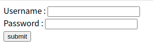

# 1. Passport 는

Express를 이용해서 백엔드 클론코딩을 하고 있는데, 회원가입과 로그인을 구현하는 데 있어 passport라는 미들웨어를 사용하기로 하였다. 굉장히 골치아팠던 끝에 이뤄낸 코드와 이해였기에 부족하지만 이곳에 흔적을 남긴다. 주로 passport 공식 문서를 기반으로 내가 이해한 내용이다.

유저로부터 입력을 받아서 이 유저가 DB에 존재하는 유저인지 확인하고 아이디와 패스워드를 대조해서 로그인 성공 혹은 실패를 알려주고 싶다고 하자. 

이는 우리가 흔히 사용하는 사이트에 당연히 있는 기능이다. 어딘가에 내 정보가 저장되어 있고 내가 아이디와 비밀번호를 입력하면 맞는 입력일 때 또는 틀린 입력임에 따라 특정 동작을 해 주는 것이다.(보통 로그인 성공시에는 보고 있던 원래 페이지에서 로그인만 성공한 상태로 리다이렉트된다)

그러면 이것을 실제로 구현하려면 어떻게 할까.

가장 단순한 방식은, post 메서드를 이용하여 사용자가 클라이언트에서 보낸 요청(req)에 들어 있는 아이디와 비밀번호를 유저 DB에서 조회하는 방식을 생각할 수 있다.(`SELECT * FROM USER WHERE ID=req.body.id and PASSWORD=req.body.password `) 

DB에 유저 정보가 암호화된 상태로 저장되어 있다면 `req.body` 의 정보를 salting+hashing 해준 후에 조회해주어야 하겠지만 기본 로직은 같을 것이다.

그러나 이런 방식은 그다지 좋지 않다.

가령 다음과 같은 코드를 작성한다고 하자.

```javascript
app.post("/login", (req, res)=>{
    /* 유저가 입력한 정보를 DB에 쿼리를 날려 검증하고
     로그인 성공/실패시에 해줄 동작을 작성해 준다 */
})
```

그러면 유저 입력에 대응되는 쿼리를 DB에 날리고 성공/실패에 따라 특정 동작을 해주는 것이 하나의 콜백 함수 안에서 모두 이루어진다. 이는 난잡하고 좋지 않다. 따라서 나온 것이 Passport이다. 페이지에서 온 요청에 대한 인증과 그 결과에 따라 실행되는 콜백을 분리해 주는 것이다.

즉, Passport는 Node.js에서 인증을 위해 쓰이는 미들웨어이다(http://www.passportjs.org/docs/ 공식 문서에서 발췌) . 다음 코드와 같이 사용된다.

```javascript
app.post('/login',
  passport.authenticate('local'),
  //'local' 인수가 무슨 뜻인지는 글 뒤쪽에 다룬다
  function(req, res) {
    // 인증이 성공했을 시에 이 콜백이 호출된다
  });
```

위 코드의 주석에 써 있다시피 authenticate 가 성공하면 다음 라우트 핸들러(콜백함수)가 호출된다. 그럼 만약 실패하면? 401에러(자격 증명 없음)가 응답되고 라우트 핸들러는 실행되지 않는다. 포스트 메서드는 401에러로 끝나버린다.

이렇게 바로 post 요청을 처리하기 전에, 인증을 거쳐주는 미들웨어가 passport인 것이다. 정확히는 인증을 해주는 strategy(아이디/비밀번호로 인증하는 방식, 구글/페이스북 따위로 인증하는 방식 등이 있다. 페이지에 온 요청에 대해 어떻게 인증할 것인지를 결정해 준다고 생각하면 된다)에 연결시켜 준 후 그 결과를 받아오는 것이다.


# 2. 인증 결과 다루기

passport는 post메서드로 온 요청을 authenticate strategy로 연결해 주고 그 결과를 받아오는데, 그 결과를 다루는 몇 가지 방법들도 제공하고 있다.

## 2.1 리다이렉션

가령 로그인 인증이 성공하면 홈 페이지로, 실패하면 다시 로그인 페이지로 돌아가게 하는 리다이렉션을 생각해 볼 수 있다.

```javascript
app.post('/login',
  passport.authenticate('local', { successRedirect: '/',
                                   failureRedirect: '/login' }));
```

그건 위와 같이 처리할 수 있다. 직관적이지 않은가? 인증이 성공하면 successRedirect의 페이지로, 실패하면 failureRedirect의 페이지로 이동하는 것이다.

## 2.2 플래시 메시지

성공 혹은 실패했을 시에 한번 뜨고 사라지는 플래시 메시지를 띄워 주는 것도 가능하다.

로그인할 때 오타 따위로 정보를 잘못 입력해서 `아이디 혹은 비밀번호가 틀렸습니다` 따위의 경고창이 뜨는 걸 누구나 한번쯤 겪어 봤을 것이다. 혹은 로그인이 성공했을 때 `환영해요!` 같은 메시지를 띄워 주는 것 등 말이다. 바로 그런 창을 띄워 주는 기능이다.

이는 `authenciate` 함수의 두번째 인자로 주는 객체에 `successFlash`, `failureFlash` 옵션을 주는 것으로 가능하다. 

```javascript
app.post('/login',
  passport.authenticate('local', { successRedirect: '/',
                                   failureRedirect: '/login',
                                   successFlash: '환영합니다!',
                                   failureFlash: true })
);
```

`successFlash` 에는 `환영합니다!` 라는 커스텀 메시지를, `failureFlash`에는 단순한 true 옵션을 주었다. 이렇게 `failureFlash`에 true옵션만 주면 passport에서 인증을 위해 연결한 strategy의 인증 콜백에서 나온 에러 메시지를 출력해 주는 코드가 된다.

각 strategy에서 사용하는 인증 콜백에서 나온 에러 메시지가 가장 정확하므로 이런 식으로 Flash 옵션에 true만 주는 것이 제일 무난한 방식이다.

단 최신 익스프레스에서는 플래시 메시지를 띄워 주는 기능이 분리되었으므로 `connect-flash` 미들웨어를 설치해야 사용할 수 있다.

passport에서 제공해 주는 이런 빌트인 리다이렉션 기능들을 사용하면, 성공시에 라우트 핸들러로 넘어가는 동작은 실행되지 않는다.

## 2.3 세션 사용하지 않기

보통 한번 로그인하면 로그인한 정보는 세션에 저장된다. 그러나 어떤 정보는 매우 민감하여 거기에 접근할 때마다 인증을 거쳐야 한다든지 하는 경우 이렇게 세션에 로그인 정보를 저장해 놓는 것은 불필요하다. 그럴 땐 `authentiacate` 함수에 세션을 사용하지 않는 옵션을 줄 수 있다.

```javascript
passport.authenticate('basic', { session: false })
//세션을 사용하지 않는다
```

## 2.4 인증 결과를 커스텀 콜백으로 다루기

passport에서 기본적으로 제공하는 이런 옵션들이 마음에 들지 않을 경우, 인증 결과(성공/실패)에 따라 특정 동작을 하게 하는 커스텀 콜백함수를 직접 짤 수도 있다.

```javascript
app.get('/login', (req, res, next) => {
  passport.authenticate('local', (err, user, info) => {
    if (err) { return next(err); }
      //만약 어떤 예외가 발생할 시 err에 특정 값이 들어갈 것이다. 예외가 없을 시 null
    if (!user) { return res.redirect('/login'); }
      //인증 실패시에 user는 false로 설정될 것이다.
    req.logIn(user, (err) => {
      if (err) { return next(err); }
      return res.redirect('/users/' + user.username);
    });
  })(req, res, next);
});
```

이때 `authenticate` 함수는 라우트 미들웨어로 들어간 게 아니라 라우트 핸들러에 들어 있다. 이는 `authenticate` 함수 내에서 호출하는 콜백에서 `req`와 `res`에 접근할 수 있게 해 준다.

그리고 커스텀 콜백을 사용하게 되면 위의 코드에서 `req.logIn` 을 사용하는 것과 같이, 세션을 다루는 것을 따로 코드로 작성해줘야 한다.

# 3. Passport를 쓰기 위한 설정하기

Passport를 어떤 인증을 위해 사용하려면 3가지가 필요하다.

1. 인증 strategy(Provider)
2. 어플리케이션 미들웨어
3. 세션(필수는 아님)

하나하나 살펴보자.

## 3.1 Strategy

passport는 사실 그 자체만으로는 특별한 기능이 없다. 다른 무언가-인증을 제공하는 provider-로 중개해 주는 역할을 할 뿐인 미들웨어이기 때문이다. 이때 passport가 중개해서 인증을 받아오는 provider를 strategy라고 부른다. 이런 strategy는 우리가 흔히 사용하는 것과 같은 아이디와 비밀번호를 입력해 인증하는 local strategy(`passport-local`), 구글/페이스북/카카오 등을 통해 로그인하는 strategy(`passport-facebook` 등)등이 있다.

정말 너무 많은 strategy가 있기 때문에 다 댈 수는 없고 관심이 있는 사람은 이곳에서 보도록 하자. (http://www.passportjs.org/packages/)

따라서 우리는 passport를 통해 인증을 처리해 주기 전에, passport에서 어떤 strategy를 이용해서 인증을 처리할 것인지 지정해 줘야 한다.

strategy 설정은 `passport.use()`함수를 통해 할 수 있다. 예를 들어 내가 `passport-local`, 즉 username과 password를 이용해서 인증하는 strategy를 사용하기 위해 작성한 코드는 다음과 같다. 공식 문서에 있는 코드를 약간 변경하였다.

```javascript
import passport from "passport";
import passportLocal from "passport-local";
import userList from "./userList.js";

const LocalStrategy=passportLocal.Strategy;

passport.use(
    new LocalStrategy(
        //verify callback
        (username, password, done)=>{
            const result=userList.filter((user)=>user.username===username);

            if(result.length>0){
                const user=result[0];
                if(user.password===password){
                    return done(null, user);
                }
                else{
                    return done(null, false, {message:"틀린 비밀번호입니다"});
                }
            }
            else{
                return done(null, false, {message:"존재하지 않는 유저입니다"});
            }
        }
    )
);
```

```javascript
app.post('/login', 
  passport.authenticate('local', { failureRedirect: '/login' }),
  (req, res) => {
    //인증이 성공시에 이 콜백으로 온다
    res.redirect('/');
  }
);
```


조금은 허술한 코드이다. 하지만 DB 연결 등을 하기 전에도 작동하게 만들기 위한 일이다. 대략적인 로직은 다음과 같다.

먼저 `passport-local`의 strategy를 import한 후에 strategy에 인증을 위한 콜백(verify callback이라 한다)을 넣어 준다. 이 콜백의 목적은 자격을 갖춘 사용자(혹은 요청)인지 검증하는 것이다. 즉 passport에서 받아서 어플리케이션에 전달해 줘야 하는 '인증'을 주는 역할이라는 것이다. 비밀번호가 맞는지 틀린지, 적절한 요청인지, 요청을 처리할 때 에러는 없는지, 그런 것들 말이다.

그럼 이 인증 콜백이 어떻게 작동하는지 보자.

passport는 요청에 대한 검증을 할 때, 요청에 포함되어 있는 자격들을 가져온다. 일반적인 express 라우트 핸들러에서 `req.body `의 내용을 가져오는 것과 비슷하다. 여기서는 username과 password를 가져왔다.

그러면 우리는 이 값들을 가지고 이 username과 password가 정말 존재하는 사용자의 것인지 검증해야 한다. 지금은 일단 단순한 배열을 사용하였다. `userList.js`에 현재 존재하는 자격있는 사용자들의 username, password가 든 객체들을 담은 배열이 있다.

```javascript
//userList.js
const userList=[
    {
        username:"test",
        password:"testpw"
    },
    {
        username:"test1",
        password:"testpw1"
    },
    {
        username:"test2",
        password:"testpw2"
    },
];

export default userList;
```

다시 인증 콜백으로 돌아가면, javascript filter함수를 사용하여, post를 통해 받은 요청에 있는 username과 같은 username을 가진 자격있는 사용자가 있는지 검증한다. 그리고 만약 그런 사용자가 있을 경우 패스워드에 대해서도 검사하는 것이다. 그리고 이런 검사들이 실패하거나 성공함에 따라 적절한 `done`을 적용한다.

### 3.1.1 done에 대하여

이 문단 참고 자료 : zerocho님 블로그 포스트 https://www.zerocho.com/category/NodeJS/post/57b7101ecfbef617003bf457

그럼 `done`은 무엇인가? 무슨 역할을 하는가? 만약 요청이 유효하면 인증 콜백은 `done` 콜백을 호출해서 passport에 인증한 결과를 전달한다. 이때의 유효한 요청이란 꼭 자격있음이 검증되었다는 의미가 아니라 서버 에러나 인증 콜백 실행에 에러가 없었고 자격 검증의 성공이든 실패든 결과가 정상적으로 나올 수 있었던 요청이라는 의미이다.

그리고 done이 호출되면 done을 호출한 strategy 콜백은 종료되고 다시 `authenticate` 단으로 돌아가서 `done` 콜백이 전달한 결과에 따라 다르게 동작한다.

정리하면 이렇다.

---

`app.post`의 도메인에서 요청을 전달받음 -> `passport.authenticate`함수를 호출하고 그 인자에 따라 다른 strategy 콜백을 호출함. 위의 코드에서는 `LocalStrategy`의 콜백을 호출한다 -> `LocalStrategy`의 콜백 함수 속에서 인증이 진행되고 어떤 조건에 의해 `done` 이 호출됨 -> `done` 은 인증을 시도한 결과에 대한 정보를 리턴하고 이 정보는 `LocalStrategy` 에서 인증을 시도한 결과로서 `authenciate`의 리턴값이 됨 -> 이 리턴값에 따라 `app.post`에서는 특정 동작을 취해 주거나 다른 콜백을 호출함

---

그럼 `done` 이 받는 3개의 인자는 무슨 뜻일까?

먼저 첫번째 인자는 위의 코드에서는 언제나 null인데, 서버 에러를 넣는 곳이다. 현재는 JS배열에 유저 정보들을 저장하고 있는데 만약 DB를 사용한다면 DB를 연결하다가 에러가 발생할 수 있다. 그런 에러들을 넣는 곳이다. 따라서 위의 경우에는 언제나 null이라고 할 수 있다.

그러나 DB 연결 실패 등의 서버 에러가 만약 발생했을 시에는 done은 다음과 같이 호출된다. 

```javascript
return done(err);
//express에서 DB에 연결할 때 쓰는 콜백에는 보통 err가 인수 중 하나로 들어간다
```

두번째 인자는 인증이 성공했을 시에 passport에 전달해줄, 인증된 값에 대한 정보이다. 인증이 성공했을 시에는 인증이 성공한 user의 정보를 담고 있는 객체를 passport에 전달한다.

그런데 만약 비밀번호가 틀리거나 존재하지 않는 아이디라는 등의 이유로 인증이 실패하면 `done`의 두번째 인자는 false로 주어져야 한다. 인증이 실패했다는 것을 알리기 위해서이다.

세번째 인자는 실패 이유에 대한 것을 나타낼 수 있는 에러 메시지를 전달해 주는 데에 쓰인다. 이는 인증이 실패했을 시에 플래시 메시지 등을 띄워주고자 할 시에 유용하다. 가령 `존재하지 않는 회원입니다` 와 `비밀번호가 틀렸습니다` 는 둘 다 인증 실패이지만, 다른 메시지를 사용자에게 보여주고자 할 수 있다. 그런 경우에 `done`의 세번째 인자를 통해 추가적인 정보를 전달할 수 있다.

이런 방식을 통해 얻는 것이 무엇이냐면, passport는 실제 인증에 쓰이는 strategy와 무관하게 작동할 수 있다는 것이다. passport단에서는 어떻게 유저 정보가 저장되고 인증이 진행되는지 전혀 알 수 없다. 그저 들어온 요청을 passport에 연결된 어떤 strategy로 보내줄 뿐이다. 이는 반대로 말하면 passport단에서는 인증의 진행에 대해 어떤 제한을 걸 수 없고, 따라서 인증을 진행하는 단계는 매우 자유롭게 진행될 수 있다는 것이다.


## 3.2 어플리케이션 미들웨어

express에서 passport를 사용하려고 하면 미들웨어를 사용해 줘야 한다. 일단 passport를 시작하기 위해 `passport.initialize()` 를 사용해야 하고, 로그인 유지를 위해 세션을 사용한다면 `passport.session()` 도 사용해야 한다.

이때 미들웨어란 post등의 방법을 통해 도메인에 요청이 들어왔을 때 실제 `post` 혹은 `get` 등에 도달하기 전까지 거치게 되는 콜백들을 뜻한다. 물론 공식 문서를 보면 직접 미들웨어를 만들어서 사용할 수도 있다. 다만 `(req, res)` 외에도 `next` 인수를 꼭 넣어 주어서 다음 미들웨어로 넘어갈 수 있도록 하는 것에 주의해야 한다. 미들웨어에 관해서는 나중에 따로 정리할 예정이다. 지금은 어플리케이션에 도달하는 요청(`req`)이 거쳐가게 되는 콜백 함수 정도로 생각하면 된다.


나는 `/login` 이라는 도메인의 라우터에서 로그인을 진행했기에 라우터에 미들웨어를 달아 줬는데, passport 를 사용하기 위해 달아준 미들웨어는 다음과 같다.

```javascript
router.use(session({
    resave:false,
    saveUninitialized:false,
    secret:process.env.SESSION_SECRET
    //.env를 이용해서 session의 비밀 키 관리(dotenv 사용)
}));

router.use(express.urlencoded({extended:false}));
router.use(passport.initialize());
router.use(passport.session());
```

만약 인증을 원하는 사용자로부터의 요청이 온다면 위에서 `router.use()` 로 달아준 미들웨어들을 모두 거치고 난 후에 다음 코드에 도달하여 인증을 거칠 것이다.

```javascript
app.post('/', 
  //여기 도달한 req는 모두 위의 미들웨어를 거친 후에 오는 것이다
  passport.authenticate('local', { failureRedirect: '/login' }),
  (req, res) => {
    //인증이 성공시에 이 콜백으로 온다
    res.redirect('/');
  }
);
```


## 3.3 세션

보통의 웹사이트에서는 한 번 로그인을 하면 그 브라우저를 닫을 때까지 로그인이 유지된다. 어떤 사이트에 로그인해서 글을 하나 보려고 다음 페이지로 넘어가는 순간 다시 로그인을 해야 한다면 얼마나 귀찮겠는가?

따라서 거의 모든 웹사이트에서는 브라우저에서 접속할 때 한 번만 자격 증명(즉, 로그인)을 요구한다. 그리고 만약 로그인이 성공하면 세션이 만들어진다. 이 세션은 브라우저를 통해 유지되면서 브라우저를 닫을 때까지 로그인을 지속시켜준다. 

정확히는 클라이언트로부터 온 유효한 로그인 요청을 서버에서 받았을 때, 로그인 요청이 성공 시 그 아이디를 세션에 저장하고 응답헤더에 `set-cookie: sessionid`를 넣어서 응답하는 것이다. 그렇게 하면 클라이언트는 이후 서버로 보내는 요청(가령 다른 페이지로 이동한다든지)을 할 때 쿠키를 통해 `sessionid`를 자동으로 넣어서 요청하게 된다. 그럼 그 요청을 받은 서버에서는 요청에 들어 있는 `sessionid` 값을 유효한지 확인 후 요청을 처리한다.

인증에 이런 로그인 세션을 쓸 수 있게 하기 위해 passport에서는 `serializeUser` 와 `deserializeUser` 를 제공한다. 

```javascript
passport.serializeUser((user, done)=>{
    done(null, user);
});

passport.deserializeUser((user, done)=>{
    //id는 req.session.passport.user 에 저장된 값
    done(null, user);
});
```

`serializeUser` 는 로그인 성공 시 실행되는 `done(null, user)` 에서 `user`를 전달받아서 세션에 저장한다. 그리고 `deserializeUser`는 서버로 요청이 들어올 때마다 세션에 들어 있는 정보를 실제의 데이터와 비교한다. 이때 `deserializeUser`의 `done`에서 받는 `user`는 `serializeUser` 에서 `done`으로 넘겨준 `user` 와 타입이 같아야 한다.

왜냐 하면 `serializeUser`에서 `user` 를 세션에 저장하는데 `deserializeUser` 에서 받은 `user`는 세션에 들어 있는 것과 대조되어서 확인을 받기 때문이다. 만약 둘의 타입이 다르면, 가령 `serializeUser`는 `user.id` 만 저장했는데 `deserializeUser`는 `user` 전체가 세션에 있는지 확인한다면 무조건 인증은 실패할 것이다. 저장한 정보의 양과 인증 상태를 알기 위해 확인하라고 지시된 정보의 양이 다르기 때문이다.

세션을 다루는 이 두 메서드는 꼭 있어야 passport가 작동한다.


# 4. Passport-local로 로그인 구현하기

우리가 흔히 사용하는, 아이디와 비밀번호 입력을 통해 구현하는 로그인 strategy가 바로 `passport-local` 이다. 이를 사용하기 위해서는 `passport-local` 모듈이 필요하다.

```
yarn add passport-local
```

터미널에서 설치해 주자.

그리고 로그인 인증을 위한 코드를 짜 주기 전에 먼저 간단한 로그인 폼을 구현해 준다. 물론 postman 등으로 시험해 보아도 상관없지만 시각적인 효과가 있는 편이 좋다.

```html
<!-- loginView/index.html -->
<!DOCTYPE html>
<html lang="en">
<head>
    <meta charset="UTF-8">
    <title>Login Form</title>
</head>
<body>
<form action="/login" method="post">
    <div>
        <label>Username : </label>
        <input type="text" name="username"/><br/>
    </div>
    <div>
        <label>Password : </label>
        <input type="password" name="password"/><br/>
    </div>
    <input type="submit" value="submit"/>
</form>
</body>
</html>
```

이렇게 하고 브라우저로 열어 보면 초라하지만 흔히 볼 수 있는 것과 뼈대는 같은 로그인 창이 만들어진다.



이곳에 아이디와 패스워드를 입력하고 제출하면 그것을 담은 요청이 `/login` 으로 전달될 것이다.

그럼 이제 이걸 처리해주기 위한 passport 설정을 해주자.

먼저 passport를 사용하기 위해 필요한 미들웨어들을 설정해 준다. 그리고 로그인 성공시에 보여줄 간단한 페이지를 만들어 주겠다.

```javascript
router.use(session({
    resave:false,
    saveUninitialized:false,
    secret:process.env.SESSION_SECRET
    //.env를 사용한 세션 비밀 키
}));

router.use(express.urlencoded({extended:false}));
router.use(passport.initialize());
router.use(passport.session());

router.use("/", express.static(__dirname+"/server/loginView/index.html"));
router.use("/success", express.static(__dirname+"/server/loginView/success.html"));

```

```html
<!-- loginView/success.html -->
<!DOCTYPE html>
<html lang="en">
<head>
    <meta charset="UTF-8">
    <title>Title</title>
</head>
<body>
    <h1>LOGIN SUCCESS</h1>
</body>
</html>
```

이때 흔히 사용하는 `app.use` 가 아니라 `router.use` 인 까닭은 express router를 사용하여 홈 페이지가 아니라 따로 사용되는 로그인 페이지에서 로그인을 하도록 만들고자 했기 때문이다. 만약 홈 페이지에서 로그인을 해도 된다면 위의 `router.use` 를 `app.use` 로 바꾸면 된다.(사실 router인지 app인지 변수명이 중요하다기보다는 `express()` 와 `express.Router()` 의 차이이다)

그럼 이제 passport에 strategy를 넣어주자.

단 필요한 라이브러리와 검증에 사용되는 정보(추후에 DB를 연결하여 검증하도록 할 계획이지만 현재는 `userList.js` 에 저장된 배열)를 먼저 import해줘야 한다.

```javascript
import passport from "passport";
import passportLocal from "passport-local";
import userList from "./userList.js";

const LocalStrategy=passportLocal.Strategy;
```

그 다음에 strategy와 `serializeUser`, `deserializeUser`를 넣어준다.

```javascript
passport.use(
    new LocalStrategy(
        (username, password, done)=>{
            const result=userList.filter((user)=>user.username===username);

            if(result.length>0){
                const user=result[0];
                if(user.password===password){
                    return done(null, user);
                }
                else{
                    return done(null, false, {message:"틀린 비밀번호입니다"});
                }
            }
            else{
                return done(null, false, {message:"존재하지 않는 유저입니다"});
            }
        }
    )
);

passport.serializeUser((user, done)=>{
    done(null, user.username);
});

passport.deserializeUser((username, done)=>{
    //id는 req.session.passport.user 에 저장된 값
    done(null, username);
});
```

마지막으로, 우리가 아까 HTML로 만들었던 로그인 폼은 `post` 메서드를 통해서 지정한 도메인에 전달되므로 그 요청을 받아 주도록 하자.

```javascript
router.post("/", passport.authenticate("local",
    { successRedirect: "/login/success",
    failureRedirect: "/login",
    failureFlash: "로그인 실패" })
);
```

첫번째 인수로 준 도메인("/")에서 요청을 받으면 이 요청의 body는 `passport.authenticate` 콜백으로 넘어간 후 `LocalStrategy` 로 위임되어 거기서 처리하게 된다. 그리고 `LocalStrategy` 에서 요청을 검사한 결과는 성공 혹은 실패로써 다시 `passport.authenticate` 단계로 전달된다. 이는 `passport.authenticate` 의 두번째 인수로 들어와 있는 처리 방법으로 연결된다. 가령 성공시에는 `/login/success` 로 리다이렉트된다.

## 4.1 LocalStrategy에서 다른 이름의 자격 사용하기

`LocalStrategy` 는 기본적으로 `username` 과 `password` 라는 이름의 자격을 사용하여 인증하도록 되어 있다.  그런데 여기서 다른 이름의 자격을 사용하고 싶을 수도 있다. 예를 들어 유저의 아이디가 아니라 이메일을 이용해 로그인하도록 되어 있는 경우도 많다. 이럴 경우 유저의 이름 입력란에 `username` 보다는 `email` 을 넣는 게 더 적절한 선택일 것이다. 그럴 경우 `LocalStrategy` 에 다음과 같은 설정을 주는 것으로 가능하다.

```javascript
passport.use(new LocalStrategy({
    usernameField: 'email',
    passwordField: 'password'
  },
  //LocalStrategy의 첫번째 인수를 통해서 바꿀 자격증명 이름을 설정
  (username, password, done) => {
    // ...
  }
));
```


다음 글에서는 사용자들의 정보를 담고 있는 DB에 연결해서 사용자를 인증하는 로직을 짜 보고, 간단하게 회원가입을 하는 부분을 만들어 보도록 하겠다.


참고

공식 문서 http://www.passportjs.org/docs/

passport-local http://www.passportjs.org/packages/passport-local/

zerocho님 블로그 포스트 https://www.zerocho.com/category/NodeJS/post/57b7101ecfbef617003bf457

2G Dev 블로그 포스트 https://dev-dain.tistory.com/73?category=858558

https://stackoverflow.com/questions/26164837/difference-between-done-and-next-in-node-js-callbacks

express 미들웨어 공식 문서 https://expressjs.com/ko/guide/writing-middleware.html

jennyLee.log 블로그 https://velog.io/@wjddnjswjd12/node.js-express-%EB%AF%B8%EB%93%A4%EC%9B%A8%EC%96%B4%EB%9E%80

serialize와 deserialize https://velog.io/@mollang/20.01.17-backend-serializeUser-%EC%99%80-deserializeUser

웹의 쿠키와 세션 https://chrisjune-13837.medium.com/web-%EC%BF%A0%ED%82%A4-%EC%84%B8%EC%85%98%EC%9D%B4%EB%9E%80-aa6bcb327582

패스포트 동작 원리와 인증 구현 https://jeonghwan-kim.github.io/dev/2020/06/20/passport.html