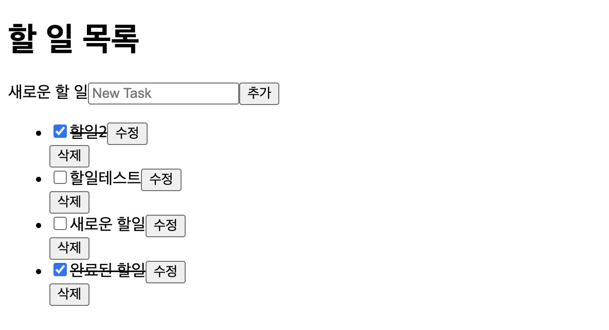
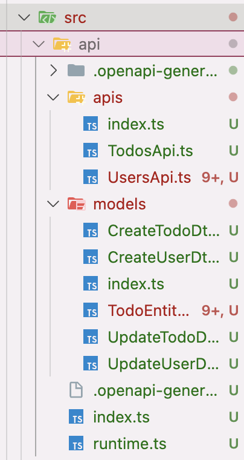

# 이 글은 작성 중입니다.

# 시작

[이전 글에서는 pnpm workspace를 이용하여 모노레포의 정말 기초적인 세팅을 진행해보았다.](https://witch.work/posts/pnpm-workspace-monorepo-1-setting) 이 글에서는 TodoList를 구현해 보고 모노레포를 활용하는 방법을 알아보도록 하겠다.

모노레포를 사용해서 좋은 점이 무엇인가? 물론 많이 댈 수 있겠지만 하나로 요약한다면 결국 여러 프로젝트를 한 번에 관리하고 프로젝트 간 공유하는 코드도 쉽게 관리할 수 있다는 것이다. 따라서 이 글에서는 TodoList를 다음과 같은 부분들과 함께 구현해보려고 한다.

- DB를 사용하는 기본적인 TodoList 구현
- API 문서화 및 타입 자동 생성
- 공유 폴더 모듈 제대로 구현하기

그리고 다음 글들에서는 사용자 인증, 테스트, 배포 등의 주제를 다루어보려고 한다.

# TodoList 구현

기본적인 TodoList의 기능을 구현할 것이다. 

## API 설계

현재 prisma 데이터 모델은 다음과 같이 짜여 있다. User와 Todo 모델이 있으며 User는 여러 Todo를 가질 수 있다.

```prisma
model User {
  id        Int      @id @default(autoincrement())
  username     String   @unique
  password  String
  todos     Todo[]   // 1:N 관계 - 한 회원이 여러 할 일을 가질 수 있음
  createdAt DateTime @default(now())
  updatedAt DateTime @updatedAt
}

model Todo {
  id        Int      @id @default(autoincrement())
  title     String
  completed Boolean  @default(false) // 기본값은 완료되지 않음
  userId    Int      // User와의 관계를 나타내는 외래 키
  user      User     @relation(fields: [userId], references: [id])
  createdAt DateTime @default(now())
  updatedAt DateTime @updatedAt
}
```

애플리케이션의 사용자가 있고 각 사용자는 할 일을 가질 수 있는 기본적인 구조다. 사용자가 로그인을 하면 해당 사용자의 할 일 목록을 볼 수 있고, 할 일을 추가하거나 수정, 삭제할 수 있는 애플리케이션이 될 것이다.

하지만 로그인, 사용자 인증 등의 기능은 그 자체로 복잡해서 다음 글에서 다룰 예정이다. 따라서 이 글에서는 사용자 관련해서는 최소한의 기능만 구현하도록 하고 TodoList에 집중하도록 하겠다.

따라서 이 글에서는 다음과 같이 todo list에 대한 API만 만들 것이다. 사용자 관련 API는 다음 글에서 온전히 다루고, 여기서는 seed 데이터로 미리 생성해둔 사용자 정보만 쓸 것이다.

- POST `/todos`: 할 일 생성
- GET `/todos?userId=1`: 쿼리스트링으로 받은 userId에 해당하는 사용자의 할 일 목록 조회
- PATCH `/todos/:todoId`: 할 일 수정
- DELETE `/todos/:todoId`: 할 일 삭제

## 데이터베이스 시드 넣기

먼저 사용자를 생성할 시드 파일을 만들자. `pnpm prisma migrate dev`를 앞서 실행해 놓았다면 prisma 폴더가 마이그레이션 파일이 든 채로 생성되어 있을 것이다. `prisma/seed.ts` 파일을 만들고 다음과 같이 사용자를 생성하는 코드를 작성하였다.

```typescript
// apps/todo-server/prisma/seed.ts
const prisma = new PrismaClient();

async function main() {
	// User 데이터 생성
	const user1 = await prisma.user.create({
		data: {
			username: "user1",
			password: "password123", // 실제 서비스에서는 해시된 비밀번호 사용
			todos: {
				create: [{ title: "공부하기" }, { title: "책 읽기", completed: true }],
			},
		},
	});

	const user2 = await prisma.user.create({
		data: {
			username: "user2",
			password: "password456",
			todos: {
				create: [{ title: "운동하기" }, { title: "발표 자료 준비" }],
			},
		},
	});

	console.log("시드 데이터 생성 완료:", { user1, user2 });
}

main()
	.catch((e) => {
		console.error(e);
		process.exit(1);
	})
	.finally(async () => {
		await prisma.$disconnect();
	});
```

이제 이 시드 파일을 실행하여 사용자와 할 일 데이터를 생성하자. 다음과 같이 seeding 커맨드를 package.json에 추가하고 실행하면 된다.

```json
// apps/todo-server/package.json
{
  "scripts": {
    "seed": "ts-node prisma/seed.ts"
  }
}
```

```shell
pnpm prisma db seed
```

그럼 시드 파일에 들어 있는 사용자와 각 사용자의 할 일 데이터가 DB에 들어간다.

## Prisma 연동

prisma를 사용할 Nest.js 서버를 만들어보자. 먼저 서버 폴더에 prisma client를 설치한다.

```shell
pnpm add @prisma/client
```

prisma client를 관리할 서비스를 만들어보자. `src/prisma.service.ts` 파일을 만들고 다음과 같이 prisma client를 연결하는 코드를 작성한다.

```typescript
// apps/todo-server/src/prisma.service.ts
import { Injectable, type OnModuleInit } from "@nestjs/common";
import { PrismaClient } from "@prisma/client";

@Injectable()
export class PrismaService extends PrismaClient implements OnModuleInit {
	async onModuleInit() {
		await this.$connect();
	}
}
```

이 서비스를 모듈에 프로바이더로 주입하면 모듈의 다른 곳에서 prisma client를 사용할 수 있다. 이를 사용할 모듈을 만들어 주자. Nest에서는 CRUD를 위한 컨트롤러, 서비스, DTO, 엔티티를 한 번에 만들어주는 명령어가 있다. 이를 이용하여 우리가 사용할 Todo 모듈을 만들어 보자.

```shell
# --no-spec 옵션을 주면 테스트 파일을 생성하지 않음
nest generate resource todos --no-spec
```

이 명령어를 실행하면 `src/todos` 폴더가 생성되고 그 안에 컨트롤러, 서비스, 모듈, DTO, 엔티티 폴더까지 생성된다. 만들어진 모듈에 앞서 만든 `PrismaService`를 주입하여 서비스를 이용해 prisma client를 사용할 수 있도록 하자. `src/todos/todos.module.ts` 파일을 열어 다음과 같이 수정한다.

```typescript
// import문은 생략
// apps/todo-server/src/todos/todos.module.ts
@Module({
	controllers: [TodosController],
	providers: [PrismaService, TodosService],
})
export class TodosModule {}
```

prisma와의 연결을 위한 다른 방법도 있다. `prisma.module.ts`를 만들어서 prisma를 사용할 수 있는 기능을 모듈로 감싸는 것이다. 다른 모듈에서 `imports`에 추가하여 사용하거나 `@Global`을 사용하여 전역으로 사용하면 된다.

그렇게 하면 관리도 쉬워지고 prisma를 사용하는 기능이 명확히 분리되는 등의 장점이 있다. 그러나 그렇게 큰 프로젝트가 아니고 이후 전환할 수도 있기 때문에 여기서는 생략하고 `PrismaService`를 직접 사용하도록 하겠다.

## Nest.js로 API 구현

todo를 관리하기 위한 서비스 메서드들을 구현하도록 하자. `src/todos/todos.service.ts` 파일을 열어 다음과 같이 서비스를 구현한다. `PrismaService`를 주입해서 prisma client를 사용하였고 todo에 대한 CRUD 그리고 사용자 id를 받아서 해당 사용자의 todo 목록을 조회하는 메서드를 구현했다. 타입은 일단 Prisma에서 생성한 타입을 사용하였다.

```typescript
@Injectable()
export class TodosService {
	constructor(private prisma: PrismaService) {}

	createTodo(data: Prisma.TodoCreateInput) {
		return this.prisma.todo.create({ data });
	}

	findTodosByUser(userId: number) {
		return this.prisma.todo.findMany({
			where: {
				userId,
			},
		});
	}

	findTodo(todoId: number) {
		return this.prisma.todo.findUnique({
			where: {
				id: todoId,
			},
		});
	}

	updateTodo(todoId: number, updateData: Prisma.TodoUpdateInput) {
		return this.prisma.todo.update({
			where: {
				id: todoId,
			},
			data: updateData,
		});
	}

	removeTodo(todoId: number) {
		return this.prisma.todo.delete({
			where: {
				id: todoId,
			},
		});
	}
}
```

이제 `/todos`로 시작하는 주소의 요청을 처리할 컨트롤러를 만들어보자. 다만 그전에 컨트롤러 입력을 검증하거나 변환할 때 Nest.js의 [Pipe](https://docs.nestjs.com/pipes)를 사용할 것인데 이를 위한 라이브러리들을 설치하자.

```shell
pnpm back add class-validator class-transformer
```

그리고 `src/todos/todos.controller.ts` 파일을 열어 다음과 같이 컨트롤러를 구현한다. `@Get`, `@Post`, `@Patch`, `@Delete` 데코레이터를 이용하여 각각의 요청을 처리하는 메서드를 구현하였다.

```typescript
@Controller("todos")
export class TodosController {
	constructor(private readonly todosService: TodosService) {}

	@Post()
	createTodo(@Body() createTodoDto: Prisma.TodoCreateInput) {
		return this.todosService.createTodo(createTodoDto);
	}

	@Get()
	findTodo(@Query("userId", ParseIntPipe) userId: number) {
		console.log(userId);
		return this.todosService.findTodosByUser(userId);
	}

	@Patch(":todoId")
	updateTodo(
		@Param("todoId", ParseIntPipe) todoId: number,
		@Body() updateTodoDto: Prisma.TodoUpdateInput,
	) {
		return this.todosService.updateTodo(todoId, updateTodoDto);
	}

	@Delete(":todoId")
	removeTodo(@Param("todoId", ParseIntPipe) todoId: number) {
		return this.todosService.removeTodo(todoId);
	}
}
```

Postman 등을 이용해서 각 요청을 테스트해볼 수 있다. 이제 TodoList에 대한 기본적인 CRUD API가 구현되었다.

## TodoList 프론트엔드

todo-client 폴더에 클라이언트를 구현할 것이다. 이전 글에서 Vite의 react-ts 템플릿을 사용해 프로젝트를 만들어놓았다. 기본적인 로그인 페이지, 회원가입 페이지, 할 일 목록 페이지를 만들 것이다. 먼저 페이지 라우팅을 위해 `react-router`를, http 요청을 위해 `axios`를 설치하자.

```shell
# 이전 글에서 만든 todo-client 폴더에 대해 실행
pnpm front add react-router axios
```

`src` 폴더에 `pages` 폴더를 만들고 그 안에 `App.tsx`, `Login.tsx`, `Register.tsx` 파일을 만들어 각 페이지를 구현하였다. 전체 UI 코드는 [레포지토리의 `apps/todo-client/src` 폴더](https://github.com/witch-factory/toy-project-monorepo/tree/main/apps/todo-client/src)에서 확인할 수 있다. 중요한 부분만 간략히 살펴보자.

먼저 `baseURL`을 설정한 axios 인스턴스를 `api.ts`에 만들어서 사용하였다. 이를 이용하여 각 요청을 보내고 받을 수 있다. 이후 서버를 배포하더라도 이 `baseURL`만 변경하면 되기 때문에 편리하다.

```typescript
// apps/todo-client/src/api.ts
export const todoAPI = axios.create({
	baseURL: "http://localhost:3000",
});
```

다음과 같은 식으로 API를 호출하고 데이터를 받아오는 함수를 작성했다. 이는 `App.tsx`에서 사용한 todo 목록을 받아오는 함수이다. `userId`는 현재는 고정값이지만 이후에 로그인 시스템을 만들면서 현재 로그인된 사용자의 ID로 대체할 예정이다.

```typescript
// 현재는 하나의 사용자만을 대상으로 하기 때문에 고정값
// 이후에 로그인 시스템을 만들면서 현재 로그인된 사용자의 ID로 대체할 예정
const userId = 1;

const fetchTodos = useCallback(async () => {
  if (!userId) return;
  try {
    const response = await todoAPI.get(`/todos?userId=${userId}`);
    setTodos(response.data);
  } catch (error) {
    console.error("할 일 목록 조회 실패:", error);
  }
}, []);
```

이외에도 Todo list의 각 항목을 수정하거나 삭제하는 함수도 작성하고 페이지에서 사용하였다. 이렇게 하여 TodoList의 기본적인 기능을 구현하였다. 구체적인 코드는 위의 레포지토리 링크에서 확인할 수 있다.

이렇게 프론트엔드와 연동했을 때 주의할 점이 있는데 바로 CORS 문제다. Nest.js 서버에서는 기본적으로 CORS를 허용하지 않기 때문에 클라이언트에서 서버로 요청을 보낼 때 CORS 에러가 발생할 수 있다. 이를 해결하기 위해 서버에서 CORS를 허용하도록 설정해주자. 서버의 `main.ts` 파일을 열어 프론트엔드의 주소를 cors 설정에 추가하면 된다.

```typescript
// apps/todo-server/src/main.ts
async function bootstrap() {
	const app = await NestFactory.create(AppModule);
	app.enableCors({
		origin: "http://localhost:5173",
	});
  // 기타 코드 생략

	await app.listen(3000);
}
bootstrap();
```

그러면 CSS를 거의 사용하지 않았기에 디자인은 별로지만 기능은 DB와 연동되어 정상적으로 동작하는 TodoList가 다음과 같이 만들어진다.



# API 보강과 문서화

모노레포를 만들고자 한 이유는 타입을 공유하기 위해서였다. 이를 위해서는 여러 가지 방법이 있겠지만 여기서는 먼저 swagger를 이용해서 API 문서를 생성하고, 이를 이용하여 타입을 생성하는 방법을 알아보도록 하겠다.

## API 문서 생성 설정

Nest.js에서는 swagger를 이용하여 OpenAPI 사양을 따르는 API 문서를 생성할 수 있다. 방법에 대해서는 Nest.js의 공식 문서를 보면 친절한 설명이 나와있어서 따라하였다. 먼저 `@nestjs/swagger` 패키지를 설치하자.

```shell
pnpm back add @nestjs/swagger
```

그리고 서버 폴더의 `main.ts`에 있는 bootstrap 함수에 다음과 같이 swagger를 설정한다.

```typescript
async function bootstrap() {
	const app = await NestFactory.create(AppModule);
	app.enableCors({
		origin: "http://localhost:5173",
	});

	// Swagger 설정
	const config = new DocumentBuilder()
		.setTitle("Todo API")
		.setDescription("Todo CRUD API documentation")
		.setVersion("1.0")
		.build();

	const documentFactory = () => SwaggerModule.createDocument(app, config);
	SwaggerModule.setup("api-docs", app, documentFactory);

	await app.listen(3000);
}
bootstrap();
```

이렇게 한 후 서버를 실행하고(`pnpm run start` 등의 스크립트 실행) `http://localhost:3000/api-docs`로 접속하면 Swagger UI가 나타난다. 여기서 api 문서를 확인할 수 있다. 앞서 만들었던 컨트롤러의 엔드포인트들이 나타나는 것을 확인할 수 있고 각 엔드포인트를 직접 테스트해볼 수도 있다.

그리고 이후에 swagger를 더 편하게 사용할 수 있도록 해주는 `@nestjs/swagger` 플러그인을 활성화하자. dto 클래스의 속성을 swagger 문서에 표시하기 위해 사용해야 하는 `@ApiProperty` 데코레이터를 자동으로 붙여주고 주석을 분석하여 API dto나 엔드포인트에 대한 설명을 붙여주는 등 여러 편의를 제공한다. 제공하는 모든 기능은 [Nest.js OpenAPI CLI Plugin 공식 문서](https://docs.nestjs.com/openapi/cli-plugin)를 참고할 수 있다.

여기서는 특별한 옵션 설정 없이 플러그인을 그대로 사용하겠다. 프로젝트는 Nest CLI로 생성되었으므로 서버 폴더 루트에는 `nest-cli.json`이 있고 여기에 플러그인을 추가하면 된다. 다음과 같이 추가하자.

```json
// apps/todo-server/nest-cli.json
{
	"$schema": "https://json.schemastore.org/nest-cli",
	"collection": "@nestjs/schematics",
	"sourceRoot": "src",
	"compilerOptions": {
		"plugins": ["@nestjs/swagger"]
	}
}
```

## 요청 검증과 변환

그런데 아직 문제가 있다. 요청을 보낼 때 요청의 형식이나 데이터 타입을 검증하고 있지 않다. 이런 작업은 Nest.js의 파이프를 통해서 할 수 있는데 이 섹션에서는 이걸 해보도록 하겠다.

앞서 API를 만들면서 몇 가지 처리를 하기는 했다. 예를 들어 `GET /todos?userId=#`의 컨트롤러를 만들 때는 `userId` 쿼리에 대해서 정수 변환을 하는 `ParseIntPipe`를 사용하였었다.

```typescript
// apps/todo-server/src/todos/todos.controller.ts
@Controller("todos")
export class TodosController {
	constructor(private readonly todosService: TodosService) {}
  // ...

	@Get()
	findTodo(@Query("userId", ParseIntPipe) userId: number) {
		return this.todosService.findTodosByUser(userId);
	}

  // ...
}
```

하지만 여전히 검증이나 요청 데이터 변환이 필요한 부분이 많이 있다. 예를 들어 지금은 `POST /todos`의 요청을 보낼 때 `userId`가 문자열 형식이라도 요청이 성공하고, DB에 삽입하는 과정에 다다라서야 오류가 발생한다. `title`이 빈 문자열인 경우에는 상식적으로 생각했을 때 정상적인 todo가 아니지만 요청도 성공하고 DB 삽입까지도 된다. 이런 검증/변환 작업을 파이프를 통해 할 수 있다.

앞서 `class-transformer`와 `class-validator`를 설치하였다. 이를 이용하여 요청 데이터를 변환하고 검증하는 파이프를 만들어보자. 먼저 DTO를 작성하자. 앞서 `nest g resource`를 사용해서 CRUD 보일러플레이트를 만들었기 때문에 `src/todos/dto/create-todo.dto.ts`파일은 이미 생성되어 있을 것이다(같은 경로에 `update-todo.dto.ts`도 있다). 이 파일을 열어 다음과 같이 작성하자. prisma에서 작성한 스키마와 거의 비슷하다.

```typescript
// apps/todo-server/src/todos/dto/create-todo.dto.ts
export class CreateTodoDto {
	title: string;
	completed: boolean;
	userId: number;
}
```

이제 앞서 `Prisma.TodoCreateInput` 타입을 사용했던 부분을 `CreateTodoDto`로 대체하자. 타입과 달리 dto 클래스는 런타임에도 사라지지 않기 때문에 런타임의 값 검증에 사용할 수 있다. 따라서 `class-transformer`, `class-validator`에서 제공하는 데코레이터를 이용하여 `CreateTodoDto`의 검증/변환 규칙을 만들어보자. 나는 다음과 같이 작성하였다.

```typescript
// apps/todo-server/src/todos/dto/create-todo.dto.ts
import {
	IsString,
	IsBoolean,
	IsInt,
	IsNotEmpty,
	IsOptional,
} from "class-validator";
import { Transform, Type } from "class-transformer";

export class CreateTodoDto {
	@IsString()
	@IsNotEmpty({ message: "Title은 비워둘 수 없습니다." })
	title: string;

	@IsOptional()
	@IsBoolean({ message: "Completed는 true 또는 false여야 합니다." })
	@Transform(({ value }) => value === "true" || value === true) // 'true' 문자열도 boolean으로 변환
	completed: boolean;

	@IsInt({ message: "UserId는 정수여야 합니다." })
	@Type(() => Number) // 숫자로 변환
	userId: number;
}
```

`IsString`등 굳이 설명하지 않아도 직관적인 이름의 데코레이터들이다. 이제 컨트롤러에 요청을 검증하고 변환하는 파이프를 달아주면 된다. `UsePipes` 데코레이터를 이용하여 파이프를 사용할 수 있다. 우리는 데이터의 변환도 처리할 것이므로 `ValidationPipe`에 `transform` 옵션을 넘겨주어서 생성한 인스턴스를 사용한다.

파이프 인스턴스가 중복 생성되는 걸 막기 위해서는 따로 이를 처리하는 파이프 클래스를 만들고 클래스 자체를 `@UsePipes`에 넘겨주어야 하지만 여기서는 간단하게 처리하도록 하겠다. 앞서 설명한 대로 파이프를 사용하는 `createTodo` 컨트롤러 메서드는 다음과 같다.

```typescript
@Controller("todos")
export class TodosController {
	constructor(private readonly todosService: TodosService) {}

	@Post()
	@UsePipes(new ValidationPipe({ transform: true }))
	createTodo(@Body() createTodoDto: CreateTodoDto) {
		console.log(createTodoDto);
		return this.todosService.createTodo(createTodoDto);
	}
  // ...
}
```

`TodosService` 클래스에서도 `Prisma.TodoCreateInput` 대신 `CreateTodoDto`를 사용하도록 수정하는 것을 잊지 말자.

이렇게 한 후 `create-todo.dto.ts` 파일에 작성한 규칙에 맞지 않는 요청을 보내면 요청이 실패하고 에러 메시지가 반환된다. 예를 들어 `title`을 빈 문자열로 보내면 다음과 같은 응답이 온다.

```json
{
    "message": [
        "Title은 비워둘 수 없습니다."
    ],
    "error": "Bad Request",
    "statusCode": 400
}
```

todo를 업데이트하는 컨트롤러에 대해서도 같은 작업을 한다. `UpdateTodoDto`를 만들고 이를 사용하여 요청을 검증하고 변환하는 파이프를 달아주는 것이다. 그런데 `create-todo.dto.ts`와 같은 경로에 있는 `update-todo.dto.ts`에 가보면 이미 다음과 같이 작성되어 있다.

```typescript
// apps/todo-server/src/todos/dto/update-todo.dto.ts
import { PartialType } from "@nestjs/mapped-types";
import { CreateTodoDto } from "./create-todo.dto";

export class UpdateTodoDto extends PartialType(CreateTodoDto) {}
```

따라서 todo 업데이트를 수행하는 컨트롤러와 서비스 메서드에서 `UpdateTodoDto`를 사용하도록 수정하고 `ValidationPipe`를 달아주면 된다. 이렇게 하면 요청을 검증하고 변환하는 파이프를 통해 요청을 처리할 수 있다. 다음과 같이 업데이트 메서드들을 수정한다.

```ts
// apps/todo-server/src/todos/todos.controller.ts
@Controller("todos")
export class TodosController {
	constructor(private readonly todosService: TodosService) {}
  // ...
	@Patch(":todoId")
  // 파이프가 요청을 검증하고 변환하도록 함
	@UsePipes(new ValidationPipe({ transform: true }))
	updateTodo(
		@Param("todoId", ParseIntPipe) todoId: number,
		@Body() updateTodoDto: UpdateTodoDto,
	) {
		return this.todosService.updateTodo(todoId, updateTodoDto);
	}
  // ...
}
```

```ts
// apps/todo-server/src/todos/todos.service.ts
@Injectable()
export class TodosService {
	constructor(private prisma: PrismaService) {}
  // ...

  // Prisma.TodoUpdateInput 대신 UpdateTodoDto를 사용
	updateTodo(todoId: number, updateData: UpdateTodoDto) {
		return this.prisma.todo.update({
			where: {
				id: todoId,
			},
			data: updateData,
		});
	}

  // ...
}
```

이렇게 하면 todo를 업데이트하는 경우에도 `title`이 빈 문자열인지 등의 조건에 대한 검증을 하게 된다. 물론 값의 타입 외에 다른 검증이 필요할 수도 있다. 예를 들어서 `updateTodo`에서 업데이트하고자 하는 id를 가진 todo가 존재하는지 확인하고 특정한 에러 메시지를 응답하는 등의 검증이 필요할 수 있다. 이런 검증은 서비스 메서드의 에러 핸들링에서 따로 처리한다.

여기서 하나 더 해야 하는 게 있다. `UpdateTodoDto`는 `CreateTodoDto`를 이용해 정의되었는데, `@nestjs/mapped-types`의 `PartialType`를 사용하면 이에 대한 swagger 문서가 제대로 생성되지 않는다. 실제로 swagger 문서(`localhost:3000/api-docs`)를 확인해보면 `UpdateTodoDto`에 대한 설명이 없는 것을 확인할 수 있다.

따라서 `@nestjs/swagger`의 `PartialType`을 사용하도록 바꿔주자. `update-todo.dto.ts` 파일을 다음과 같이 수정하자.

```ts
// apps/todo-server/src/todos/dto/update-todo.dto.ts
// PartialType import 경로 수정
import { PartialType } from "@nestjs/swagger";
import { CreateTodoDto } from "./create-todo.dto";

export class UpdateTodoDto extends PartialType(CreateTodoDto) {}
```

이제 `UpdateTodoDto`에 대한 swagger 문서가 제대로 생성된다.

## 문서 보강

그런데 이렇게 한 후 swagger 문서(`localhost:3000/api-docs`)를 확인해보면 문서에 부족한 부분이 많이 보인다. 앞서 설정한 `@nestjs/swagger` 플러그인이 dto 속성은 문서에 자동으로 추가해 주었지만 아직 부족하다. 가령 api에 대한 간단한 설명도 있으면 좋겠고 api 응답의 형식도 있으면 좋겠다. 이런 부분들을 직접 보강해보자.

`@ApiTags`를 이용해서 컨트롤러에 태그를 붙인다. 이 데코레이터를 통해 컨트롤러 메서드들의 그룹명을 설정할 수 있다.

```ts 
@ApiTags("todos")
@Controller("todos")
export class TodosController {
  // ...
}
```

API 응답에 대한 타입을 추가해야 한다. 이는 swagger가 API에서 응답하는 타입에 대해 알지 못하기 때문이다. 따라서 이를 swagger에 정보를 추가해주어야 한다. 이를 위해서는 엔티티 클래스를 정의해주는 방법을 사용한다.

앞서 `nest g resource`로 만든 CRUD 보일러플레이트에는 엔티티 폴더와 클래스 파일이 이미 만들어져 있다. 이를 이용하여 todo 엔티티를 만들어보자. Prisma에서 만들어준 스키마 타입을 implements 하는 방식으로 하면 된다.

```ts
// apps/todo-server/src/todos/entities/todo.entity.ts
import { Todo } from "@prisma/client";

export class TodoEntity implements Todo {
	id: number;
	title: string;
	userId: number;
	completed: boolean;
	createdAt: Date;
	updatedAt: Date;
}
```

이를 import해서 컨트롤러 메서드에 `@ApiResponse` 데코레이터를 이용하여 응답에 대한 설명을 추가할 수 있다. 예를 들어 `findTodo` 메서드에 대한 응답에 대한 설명을 추가하고, 응답의 타입을 `TodoEntity`로 지정하면 다음과 같다.

```ts
@Get()
@ApiOkResponse({
  description: "Todo 조회 성공",
  type: [TodoEntity],
})
findTodo(@Query("userId", ParseIntPipe) userId: number) {
  return this.todosService.findTodosByUser(userId);
}
```


이외에도 API에 대한 설명을 추가할 수 있는 `@ApiOperation` 등의 데코레이터들도 있다. API의 쿼리스트링이나 body같은 경우 이미 자동으로 문서에 추가되지만 이를 보완하고 싶다면 `@ApiQuery`, `@ApiBody` 등을 이용하면 된다. 이런 방법으로 컨트롤러에 OpenAPI 문서를 다음과 같이 보강했다.

```ts
// apps/todo-server/src/todos/todos.controller.ts
@ApiTags("todos")
@Controller("todos")
export class TodosController {
	constructor(private readonly todosService: TodosService) {}

	@Post()
	@UsePipes(new ValidationPipe({ transform: true }))
	@ApiOperation({ summary: "새로운 Todo 생성" }) // 메서드 설명
	@ApiBody({ type: CreateTodoDto, description: "Data for the new Todo" }) // 요청 본문 설명
	@ApiCreatedResponse({
		description: "Todo 생성 성공",
		type: TodoEntity,
	}) // 성공 응답
	@ApiBadRequestResponse({ description: "Validation error" }) // 실패 응답
	createTodo(@Body() createTodoDto: CreateTodoDto) {
		console.log(createTodoDto);
		return this.todosService.createTodo(createTodoDto);
	}

	@Get()
	@ApiOperation({ summary: "주어진 사용자의 todo 조회" })
	@ApiQuery({
		name: "userId",
		type: Number,
		description: "Todo를 조회할 사용자 ID",
	})
	@ApiOkResponse({
		description: "Todo 조회 성공",
		type: [TodoEntity],
	})
	findTodo(@Query("userId", ParseIntPipe) userId: number) {
		return this.todosService.findTodosByUser(userId);
	}

	@Patch(":todoId")
	@UsePipes(new ValidationPipe({ transform: true }))
	@ApiOperation({ summary: "todo 수정" })
	@ApiParam({ name: "todoId", type: Number, description: "수정할 Todo의 ID" })
	@ApiBody({ type: UpdateTodoDto, description: "수정할 Todo의 정보" })
	@ApiOkResponse({
		description: "Todo 수정 성공",
		type: TodoEntity,
	})
	@ApiNotFoundResponse({ description: "Todo not found" })
	updateTodo(
		@Param("todoId", ParseIntPipe) todoId: number,
		@Body() updateTodoDto: UpdateTodoDto,
	) {
		return this.todosService.updateTodo(todoId, updateTodoDto);
	}

	@Delete(":todoId")
	@ApiOperation({ summary: "todo 삭제" })
	@ApiParam({ name: "todoId", type: Number, description: "삭제할 Todo ID" })
	@ApiOkResponse({
		description: "Todo 삭제 성공",
		type: TodoEntity,
	})
	@ApiNotFoundResponse({ description: "Todo not found" })
	removeTodo(@Param("todoId", ParseIntPipe) todoId: number) {
		return this.todosService.removeTodo(todoId);
	}
}
```

# 타입 자동 생성

TodoList를 만들었고, 요청을 검증하고 변환하는 파이프를 만들었다. 각 API에 대한 문서도 입력한 설명대로 생성되도록 했다. 이제 TodoList는 더 견고하게 작동하고, 사용자를 위한 문서도 갖췄다. 그런데 우리가 무엇을 하고 있었더라? 모노레포를 만들고 있었다.

왜 모노레포를 만들고 있었는가? 클라이언트와 서버 프로젝트 간에 공유하고 싶은 코드가 있었기 때문이다. 그 중 하나가 타입이다. 이제 이 타입을 자동으로 생성해보자.

## OpenAPI 문서 생성

이를 위해서는 OpenAPI 사양 문서를 생성하고, 여기서 타입을 추출할 것이다. 먼저 서버 폴더의 `main.ts`에서 swagger 문서(OpenAPI 사양 준수)를 파일로 생성하도록 설정한다. `openapi.json` 파일로 저장하도록 하겠다.

```ts
// apps/todo-server/src/main.ts의 bootstrap 함수
async function bootstrap() {
  // ...생략...

	// Swagger 설정
	const config = new DocumentBuilder()
		.setTitle("Todo API")
		.setDescription("Todo CRUD API documentation")
		.setVersion("1.0")
		.build();

	const documentFactory = () => SwaggerModule.createDocument(app, config);
  // Swagger 모듈이 생성한 문서를 파일로 저장
	writeFileSync("./openapi.json", JSON.stringify(documentFactory(), null, 2));
	SwaggerModule.setup("api-docs", app, documentFactory);

	await app.listen(3000);
}
```

이렇게 하면 서버 실행 시 서버 폴더의 프로젝트 루트에 `openapi.json` 파일이 생성된다. 이렇게 OpenAPI 스펙에 맞게 생성된 문서를 이용하여 타입을 생성하는 도구는 여러 가지가 있는데 나는 오로지 타입만 필요하고 OpenAPI 3.0 스펙만 사용하기 때문에 이에 가장 맞다고 판단되는 `openapi-typescript`를 사용하겠다.

## openapi-typescript 사용

비슷한 목적의 다른 오픈소스들 중에 스타도 많고 스폰서도 있으며 GitHub, Firebase 등 믿을 만한 곳들에서 많이 사용하고 있는 openapi-typescript를 택하였다. 그리고 기능도 가장 알맞았다. 빠르고, 런타임 클라이언트가 아니라 타입만 생성해주기 때문이다. 최신 OpenAPI 스펙만 지원하며 역시 최신 JS 문법이 필요하다는 게 단점으로 작용할 수도 있겠지만 여기서는 문제가 되지 않는다.

먼저 `openapi-typescript`를 설치하자.

```shell
pnpm add -D openapi-typescript
```

openapi-typescript에서 타입을 제대로 가져올 수 있으려면 `tsconfig.json`에 다음 설정이 필요하다. 모노레포의 루트에 `tsconfig.json`가 있고 각 프로젝트에서 이를 extend하고 있기 때문에 모노레포 루트의 `tsconfig.json`에 설정을 추가하였다.

```json
{
  "compilerOptions": {
    "module": "ESNext", // or "NodeNext"
    "moduleResolution": "Bundler" // or "NodeNext"
  }
}
```

이제 타입을 생성하는 명령어 형식은 다음과 같다.

```shell  
pnpm openapi-typescript [openapi 파일 경로] -o [결과 파일 경로]
```

설정 파일을 이용해서 더 복잡한 설정도 할 수 있는데 이 부분은 [openapi-typescript CLI 문서](https://openapi-ts.dev/cli)를 참고하자.

나는 다음과 같이 스크립트를 짜서 `typegen` 명령어로 실행할 수 있도록 했다. 결과 파일은 모노레포 프로젝트 루트의 `libs/shared/src/schema.ts` 파일에 저장한다.

```json
// apps/todo-server/package.json
{
  "scripts": {
    "typegen": "openapi-typescript ./openapi.json -o ../../libs/shared/src/schema.ts"
  }
}
```

이제 다음 명령어로 타입을 생성할 수 있다.

```shell
pnpm run typegen
```

이렇게 하면 설정한 경로의 `schema.ts` 파일에 타입이 생성된다. 이제 클라이언트 프로젝트에서 이 타입을 이용하여 API 호출을 하는 코드를 작성해보자.

## 타입 사용

타입은 공유 폴더에 생성되었다. 따라서 공유 폴더의 `index.ts` 파일에 다음과 같이 타입을 export하자.

```typescript
// libs/shared/src/index.ts
export * from "./schema";
```

공유 폴더를 빌드하자. 다시 순서를 보면, openapi 문서가 수정되면 서버가 실행될 때마다 `openapi.json` 파일이 업데이트된다. 그리고 `typegen` 스크립트를 이용해 이 openapi 문서에서 타입을 생성한다. 이를 프로젝트 전반에서 공유 폴더로 사용하기 위해 빌드하는 것이다.

```shell
# libs/shared 폴더에서 실행
pnpm run build
```

그러면 `libs/shared/dist` 폴더에 빌드된 파일이 생성된다. 이제 클라이언트 프로젝트에서 이 타입을 사용할 수 있다. 이제 클라이언트(`todo-client`) 프로젝트에서 이 타입을 사용해보자. 생성된 타입 파일(`schema.ts`)와 [openapi-typescript의 공식 문서](https://openapi-ts.dev/introduction)를 참고할 수 있다.

클라이언트에서 axios 인스턴스를 만들기 위해 생성했던 `api.ts` 파일에서 공유 폴더의 타입을 가져와 사용해보자.

```ts
// apps/todo-client/src/api.ts
import { components, paths } from "@toy-monorepo/shared";

// OpenAPI에서 타입 추출
export type TodoEntity = components["schemas"]["TodoEntity"];
export type CreateTodoDto = components["schemas"]["CreateTodoDto"];
export type UpdateTodoDto = components["schemas"]["UpdateTodoDto"];
// Response 타입을 추출할 수도 있다는 예시
export type FindTodoResponse =
	paths["/todos"]["get"]["responses"][200]["content"]["application/json"];
```

이 타입을 다음과 같이 사용할 수 있다. 예를 들어 `CreateTodoDto`를 이용하여 새로운 todo를 생성하는 함수의 코드는 다음과 같다.

```ts
// apps/todo-client/src/App.tsx
const addTodo = async (e: React.FormEvent) => {
  e.preventDefault();
  if (!userId || !newTodoValue.trim()) {
    alert("할 일을 입력하세요.");
    return;
  }

  try {
    const data: CreateTodoDto = {
      title: newTodoValue.trim(),
      userId,
      completed: false,
    };
    const response = await todoAPI.post<TodoEntity>("/todos", data);
    setTodos([...todos, response.data]);
    setNewTodoValue("");
  } catch (error) {
    console.error("할 일 추가 실패:", error);
  }
};
```

# 다른 타입 생성 도구들

OpenAPI에서 타입을 생성하는 도구는 여러 가지가 있다. openapi-generator, swagger-typescript-api 등이 있고 이외에도 다른 도구들이 있다. 2가지의 도구들을 보고 그것들은 어떻게 사용하고 어떤 방식으로 타입이 생성되는지 알아보자.

## openapi-generator

openapi-generator는 OpenAPI 스펙을 기반으로 여러 언어와 프레임워크에 맞는 클라이언트, 서버, 모델 코드를 생성해준다. 우리가 사용할 TypeScript 외에도 Java, Go 등 다양한 언어를 지원하는 제너레이터가 있다. 전체 제너레이터 목록은 [OpenAPI Generator 문서](https://openapi-generator.tech/docs/generators)에서 볼 수 있다.

이 도구를 사용하기 위해서는 먼저 `openapi-generator-cli`를 설치해야 한다.

```shell
pnpm add -D @openapitools/openapi-generator-cli
```

그리고 서버의 `package.json`에 다음과 같은 타입 생성 스크립트를 추가한다. 이 스크립트는 `openapi.json` 파일과 `typescript-fetch` 템플릿을 이용하여 타입을 생성하며 이를 모노레포 프로젝트 루트의 `libs/shared/src/api` 폴더에 저장하는 스크립트이다.

```json
// apps/todo-server/package.json
{
  "scripts": {
    "typegen": "openapi-generator-cli generate -i ./openapi.json -g typescript-fetch -o ../../libs/shared/src/api"
  }
}
```

위 명령어에서 `-c`(config의 약자) 옵션을 이용하여 따로 설정 파일을 사용할 수도 있다. 만약 그렇게 했다면 `openapi-generator-cli generate -c [설정 파일 경로]`와 같이 사용하면 된다.

그리고 위에서는 `typescript-fetch` 템플릿을 사용하였다. 이 템플릿은 fetch API를 이용하여 API 호출을 하는 코드를 생성한다. axios 클라이언트를 생성해 주는 `typescript-axios` 템플릿도 많이 사용한다. 여기서는 따로 라이브러리 설치가 필요없는 fetch API를 사용하는 `typescript-fetch` 템플릿을 사용하였다.

이제 다음 명령어로 타입을 생성할 수 있다.

```shell
pnpm run typegen
```

이렇게 하면 공유 폴더인 `libs/shared/src/api` 폴더에 `api` 폴더와 `models` 파일이 생기고 각각에 API 호출을 위한 타입과 클라이언트가 생성된다. 이를 이용해서 클라이언트 코드를 작성할 수 있다. 클라이언트의 API 호출에 대한 런타임 검증 또한 지원한다.

단점이라고 한다면 타입이 생성되는 파일이 많고, 이를 이용하여 API 호출을 하는 코드가 복잡하다는 것이다. 또한 타입이 생성되는 파일이 많아지면 타입이 중복되는 경우가 생길 수도 있다. 다음은 이 프로젝트에서 openapi-generator가 생성한 결과 파일들인데 척 봐도 갯수부터 많다. 그리고 API 파일들의 경우 200줄이 넘어간다. API 갯수가 10개를 넘지 않는 아주 간단한 프로젝트임을 생각해 볼 때 생성되는 코드 크기가 상당히 크다.



게다가 워낙 다양한 언어들을 지원하다 보니 상대적으로 각 언어의 대한 지원은 약간 부실하다는 느낌이 있다. 이런 문제를 해결하는 걸로 위에서 본 openapi-typescript나 swagger-typescript-api처럼 상대적으로 경량이며 typescript에 중점을 둔 라이브러리들이 나왔다.

하지만 큰 라이브러리인 만큼 더 구체적인 설정과 기능을 제공하는 면도 있다. 이 부분에 대해서는 [OpenAPI Generator로 API의 안전한 Model과 정형화된 구현코드 자동생성하기](https://velog.io/@kdeun1/OpenAPI-Generator%EB%A5%BC-%EC%82%AC%EC%9A%A9%ED%95%98%EC%97%AC-API%EC%99%80-%EB%8F%99%EC%9D%BC%ED%95%9C-Model%EA%B3%BC-%EC%A0%95%ED%98%95%ED%99%94%EB%90%9C-API%EC%BD%94%EB%93%9C-%EC%9E%90%EB%8F%99%EC%83%9D%EC%84%B1%ED%95%98%EA%B8%B0) 등의 글을 참고할 수 있다.

## swagger-typescript-api

swagger-typescript-api는 OpenAPI 3.0이나 2.0 문서를 기반으로 타입과 API 클라이언트를 생성해준다. 라이브러리를 설치한다.

```shell
pnpm add -D swagger-typescript-api
```

그리고 다음과 같은 스크립트를 추가한다. 이 스크립트는 `openapi.json` 파일을 이용하여 타입을 생성하며 이를 모노레포 프로젝트 루트의 `libs/ts-api.ts` 파일에 저장하는 스크립트이다. 결과 파일의 경로(`-o` 옵션)는 원하는 다른 경로로 바꾸면 된다.

```json
// apps/todo-server/package.json
{
  "scripts": {
    "typegen": "swagger-typescript-api -p ./openapi.json -o ./libs/ts-api"
  }
}
```

앞서 openapi-generator와 같이 다음 명령어로 타입을 생성할 수 있다.

```shell
pnpm run typegen
```

이렇게 하면 `libs/ts-api` 폴더에 타입과 API 클라이언트가 들어 있는 파일이 생성된다. 기본 옵션은 fetch 클라이언트를 생성하지만 스크립트 명령에 `--axios` 옵션을 주면 axios 클라이언트를 생성할 수 있다. 

다른 옵션들도 많다. 예를 들어 `--no-client` 옵션을 주면 API 호출을 위한 클라이언트 코드를 생성하지 않고 타입만 생성할 수도 있다. 전체 옵션은 [swagger-typescript-api 레포지토리의 README](https://github.com/acacode/swagger-typescript-api)에서 확인할 수 있다.

# 공유 폴더 cjs/esm 지원 세팅

[이전 글](https://witch.work/posts/pnpm-workspace-monorepo-1-setting#%EA%B3%B5%EC%9C%A0-%ED%8F%B4%EB%8D%94-%EB%A7%8C%EB%93%A4%EA%B8%B0)에서는 공유 폴더인 `libs/shared`를 세팅하고 코드를 모노레포 프로젝트 전반에 걸쳐 공유 사용할 수 있도록 했다. 그리고 이 글에서는 타입을 공유 폴더에 생성하고 사용도 해보았다.

이제는 공유 폴더의 코드를 CJS/ESM 두 방식 모두로 불러올 수 있도록 설정해보자. 두 모듈 방식의 차이와 둘 모두 지원하는 것의 이점에 대해서는 [토스 블로그의 CommonJS와 ESM에 모두 대응하는 라이브러리 개발하기: exports field](https://toss.tech/article/commonjs-esm-exports-field) 등의 좋은 글을 참고할 수 있다.

## 설계

공유 폴더의 코드를 CJS/ESM 두 방식 모두로 불러올 수 있도록 하기 위해서는 package.json 파일의 `exports` 필드를 사용한다. 이를 이용하면 ESM과 CJS 중 어떤 방식으로 패키지를 가져다 사용했는지에 따라 다른 파일을 불러오도록 함으로써 두 방식을 모두 지원하게 할 수 있다.

그러기 위해서는 ESM을 위한 파일과 CJS를 위한 파일을 따로 생성해 줘야 한다. rollup, tsup 등의 설정 파일을 사용하면(토스의 es-toolkit 등의 코드에서 볼 수 있다) 더 복잡한 처리도 가능하고 중복도 줄일 수 있지만 여기서는 번들러를 사용하지 않고 ESM/CJS 모듈을 따로 생성하는 방식으로 설정해보겠다.

가장 가까운 package.json의 설정에 따라 다른 모듈 로더가 사용될 것이므로, 서로 다른 모듈 로더가 설정된 2개의 빌드 결과물을 만들고 둘이 다른 모듈 설정의 package.json을 사용하도록 하면 된다.

## 폴더 세팅

먼저 CJS 모듈을 위한 파일과 ESM 모듈을 위한 파일을 따로 만들기 위해 다음과 같이 폴더를 만들자.

```shell
# libs/shared 폴더에서 실행
mkdir cjs
mkdir esm
```

그리고 `libs/shared`의 `tsconfig.json`을 다음과 같이 수정한다. `.d.ts` 파일이 생성될 위치를 정하는 `declarationDir` 옵션은 각 모듈 폴더에서 지정하도록 하기 위해 `declarationDir` 옵션을 제거하였다.

```json
// libs/shared/tsconfig.json
{
	"extends": "../../tsconfig.json",
	"compilerOptions": {
		"outDir": "./dist",
		"rootDir": "./src",
		"declaration": true, // .d.ts 파일 생성
		"declarationMap": true, // 소스맵 생성 (선택사항)
		"declarationDir": "./dist" // .d.ts 파일이 생성될 위치
	},
	"include": ["src"],
	"exclude": ["node_modules", "dist"]
}
```

그리고 cjs 폴더에 `tsconfig.json`과 `package.json` 파일을 다음과 같이 작성한다.

```json
// libs/shared/cjs/tsconfig.json
{
	"extends": "../tsconfig.json",
	"compilerOptions": {
		"module": "CommonJS",
		"moduleResolution": "node",
		"outDir": "./",
		"declarationDir": "./types" // .d.ts 파일이 생성될 위치
	}
}

// libs/shared/cjs/package.json
{
	"type": "commonjs"
}
```

비슷하게 esm 폴더에도 `tsconfig.json`과 `package.json` 파일을 다음과 같이 작성한다. `module` 옵션만 제외하고는 cjs 폴더와 동일하다.

```json
{
	"extends": "../tsconfig.json",
	"compilerOptions": {
		"module": "ES2020",
		"moduleResolution": "node",
		"outDir": "./",
		"declarationDir": "./types" // .d.ts 파일이 생성될 위치
	}
}

// libs/shared/esm/package.json
{
  "type": "module"
}
```

그리고 다음과 같이 `libs/shared`의 `package.json` 파일을 수정한다. `exports` 필드를 이용하여 ESM 모듈과 CJS 모듈을 각각 지정한다. 이때 `exports` 필드는 `package.json` 파일의 최상단에 위치해야 한다.

```json
{
	"name": "@toy-monorepo/shared",
	"version": "1.0.0",
	"description": "",
	"main": "./cjs/index.js",
	"module": "./esm/index.js",
	"types": "./cjs/index.d.ts",
	"exports": {
		".": {
			"require": {
				"types": "./cjs/index.d.ts",
				"default": "./cjs/index.js"
			},
			"import": {
				"types": "./esm/index.d.ts",
				"default": "./esm/index.js"
			}
		}
	},
	"scripts": {
		"build:cjs": "tsc --p ./cjs/tsconfig.json",
		"build:esm": "tsc --p ./esm/tsconfig.json",
		"build": "pnpm run build:esm && pnpm run build:cjs",
		"dev": "tsc -w"
	}
}
```

이제 다음과 같이 빌드를 실행하면 cjs와 esm 폴더에 각각 빌드 결과물이 생성된다.

```shell
# libs/shared 폴더에서 실행
pnpm run build
```

이렇게 하면 cjs와 esm 모듈을 모두 지원하는 공유 폴더가 생성된다.

## 트러블슈팅 - ESM 모듈과 확장자

간단한 프로젝트 코드를 생성하여 이를 실험해볼 수 있다. 다음과 같이 `apps/test` 폴더를 만들고 이 안에 `index.js 파일을 만들어서 공유 폴더의 코드를 불러와 보자.

```shell
# 프로젝트 루트에서 실행
mkdir apps/test
cd apps/test
pnpm init
```

생성된 package.json의 의존성에 공유 폴더를 추가하고 `index.js`를 실행하는 명령어를 추가한다.

```json
{
  // ...
	"scripts": {
		"start": "node index.js"
	},
	"dependencies": {
		"@toy-monorepo/shared": "workspace:*"
	}
}
```

프로젝트 루트에서 `pnpm i`를 실행하여 공유 폴더를 설치한다. 그리고 모듈을 정상적으로 불러오는지, 어떤 모듈에서 불러오는지를 알기 위해 공유 폴더의 빌드 결과물에 코드를 조금 추가해보자.

```js
// 다음 코드를 각 경로의 파일에 추가한다.
// libs/shared/cjs/index.js
exports.hello = "CJS Hello World!";

// libs/shared/esm/index.js
export const hello = "ESM Hello World!";
```

그리고 `apps/test/index.js` 파일에 다음과 같이 코드를 작성한다. `apps/test/package.json` 파일에 따로 모듈 형식(`"type":"module"`과 같이 지정)을 지정하지 않았기 때문에 CJS 모듈 로더가 사용될 것이다. 그러니 CJS 모듈을 불러오는 코드를 작성한다.

```js
const { hello } = require("@toy-monorepo/shared");

console.log(hello);
```

이제 `apps/test` 폴더에서 `pnpm start`를 실행하면 `CJS Hello World!`가 출력된다. 이제 ESM 모듈 로더를 사용해서 공유 폴더 코드를 불러와보자. `apps/test/package.json` 파일에 `"type":"module"`을 추가하여 ESM 모듈 로더를 사용하도록 한다.

```json
// apps/test/package.json
{
  "type": "module",
  // ...
}
```

그리고 `apps/test/index.js` 파일을 다음과 같이 수정한다.

```js
import { hello } from "@toy-monorepo/shared";

console.log(hello);
```

이렇게 하고 `apps/test`에서 `pnpm start`를 실행하면 다음과 같은 에러가 발생한다.

```shell
$ pnpm start
> test@1.0.0 start 모노레포파일경로/toy-monorepo/apps/test
> node index.js

node:internal/modules/esm/resolve:257
    throw new ERR_MODULE_NOT_FOUND(
          ^

Error [ERR_MODULE_NOT_FOUND]: Cannot find module '모노레포파일경로/toy-monorepo/libs/shared/esm/schema' imported from 모노레포파일경로/toy-monorepo/libs/shared/esm/index.js
    at finalizeResolution (node:internal/modules/esm/resolve:257:11)
    at moduleResolve (node:internal/modules/esm/resolve:913:10)
    at defaultResolve (node:internal/modules/esm/resolve:1037:11)
    at ModuleLoader.defaultResolve (node:internal/modules/esm/loader:650:12)
    at #cachedDefaultResolve (node:internal/modules/esm/loader:599:25)
    at ModuleLoader.resolve (node:internal/modules/esm/loader:582:38)
    at ModuleLoader.getModuleJobForImport (node:internal/modules/esm/loader:241:38)
    at ModuleJob._link (node:internal/modules/esm/module_job:132:49) {
  code: 'ERR_MODULE_NOT_FOUND',
  url: '모노레포파일경로/toy-monorepo/libs/shared/esm/schema'
}
```

하지만 `index.js`의 hello import 경로를 추적해 보면 import하고 있는 경로에 대한 참조는 잘 되고 있다. 뭐가 문제일까?

CJS와 ESM 모듈의 차이 때문이다. CJS 모듈 로더는 확장자를 생략하고 모듈을 불러올 수 있지만 ESM 모듈 로더는 확장자를 생략할 수 없다. 그런데 ESM 모듈 로더가 불러오고 있을 파일, 그러니까 공유 폴더의 빌드 결과물 중 `esm/index.js` 파일을 보자.

```js 
export * from "./schema";
export function add(a, b) {
	return a + b;
}
export function subtract(a, b) {
	return a - b;
}
// 로딩되는 모듈을 확인하기 위해 임시로 추가한 코드
export const hello = "ESM Hello World!";
```

문제는 이 부분이다. 이 부분을 공유 폴더의 `esm/index.js` 파일에서 지우면 정상적으로 동작한다.

```js
export * from "./schema";
```

그럼 이 문제는 왜 발생했을까?

이건 앞서서 공유 폴더의 `schema.ts`에 자동 생성한 타입을 프로젝트 전반에 걸쳐 공유할 수 있도록 하기 위해 `index.ts`에 포함시키려고 넣은 코드이다. 문제는 ESM 모듈 로더는 확장자를 생략할 수 없다는 것이다. 그런데 타입스크립트 트랜스파일러는 ts -> js 트랜스파일링을 할 때 확장자를 달아줄 수 없다.

이를 해결하는 rollup 등의 옵션도 있겠지만, 일단 문제를 찾았고 또 ESM 모듈 로더를 완벽하게 지원하는 게 중요한 문제가 아니기 때문에 조금 우회적인 방법으로 해결하겠다. 이에 대해서는 이후 좀 더 심화된 글을 작성할 예정이다.

일단 나는 타입을 공유하는 게 목적이었기 때문에 꼭 `schema.ts`와 `index.ts` 파일이 어울릴 필요는 없다. 따라서 `package.json`의 exports 필드의 types를 `schema.ts`의 변환 결과 파일로 따로 지정해 준다. `index.ts`의 `export`문은 지운다.

```json
{
  // ...
	"main": "./cjs/index.js",
	"module": "./esm/index.js",
	"types": "./cjs/schema.d.ts",
	"exports": {
		".": {
			"require": {
				"types": "./cjs/schema.d.ts",
				"default": "./cjs/index.js"
			},
			"import": {
				"types": "./esm/schema.d.ts",
				"default": "./esm/index.js"
			}
		}
	},
  // ...
}
```


# 참고

pnpm과 함께하는 Frontend 모노레포 세팅

https://jasonkang14.github.io/react/monorepo-with-pnpm

react router docs

https://reactrouter.com/start/library/routing

Nest.js docs, Prisma

https://docs.nestjs.com/recipes/prisma

Nest.js docs, Authentication

https://docs.nestjs.com/security/authentication

Nest.js docs, OpenAPI 섹션

https://docs.nestjs.com/openapi/introduction

Monorepo 도입기

https://medium.com/@june.programmer/repository-monorepo-%EB%8F%84%EC%9E%85%EA%B8%B0-3eeea7027119

Building a REST API with NestJS and Prisma

https://www.prisma.io/blog/nestjs-prisma-rest-api-7D056s1BmOL0

prisma docs, Seeding

https://www.prisma.io/docs/orm/prisma-migrate/workflows/seeding

FEConf 2020, OpenAPI Specification으로 타입-세이프하게 API 개발하기: 희망편 VS 절망편

https://www.youtube.com/watch?v=J4JHLESAiFk

매드업 테크 블로그, TypeScript 쓰면서 OpenAPI Generator 는 안 쓴다고?

https://tech.madup.com/openapi-generator/

Swagger 타입 자동 생성기 적용기(feat. swagger-typescript-api)

https://velog.io/@ktw3577/Swagger-%ED%83%80%EC%9E%85-%EC%9E%90%EB%8F%99-%EC%83%9D%EC%84%B1%EA%B8%B0-%EC%A0%81%EC%9A%A9%EA%B8%B0feat.-swagger-typescript-api

Openapi-generator-cli(Swagger Codegen) 적용기

https://velog.io/@ktw3577/Openapi-generator-cliSwagger-Codegen-%EC%A0%81%EC%9A%A9%EA%B8%B0

OpenAPI Generator로 API의 안전한 Model과 정형화된 구현코드 자동생성하기

https://velog.io/@kdeun1/OpenAPI-Generator%EB%A5%BC-%EC%82%AC%EC%9A%A9%ED%95%98%EC%97%AC-API%EC%99%80-%EB%8F%99%EC%9D%BC%ED%95%9C-Model%EA%B3%BC-%EC%A0%95%ED%98%95%ED%99%94%EB%90%9C-API%EC%BD%94%EB%93%9C-%EC%9E%90%EB%8F%99%EC%83%9D%EC%84%B1%ED%95%98%EA%B8%B0

npm swagger-typescript-api

https://www.npmjs.com/package/swagger-typescript-api

openapi-typescript 사이트

https://openapi-ts.dev

편리한 API 제너레이터 swagger-typescript-api

https://yozm.wishket.com/magazine/detail/2387/

CommonJS와 ESM에 모두 대응하는 라이브러리 개발하기: exports field

https://toss.tech/article/commonjs-esm-exports-field

typescript npm패키지를 dual package로 만들기.

https://velog.io/@egoavara/typescript-npm%ED%8C%A8%ED%82%A4%EC%A7%80%EB%A5%BC-dual-package%EB%A1%9C-%EB%A7%8C%EB%93%A4%EA%B8%B0

라이브러리를 만들어 배포해보자 - (2) tsconfig와 ESM, CJS

https://0422.tistory.com/361

typescript handbook, Modules - Theory

https://www.typescriptlang.org/docs/handbook/modules/theory.html

typescript 컴파일러와 모듈 시스템에 대한 이해

https://0422.tistory.com/362


pnpm을 이용한 모노레포 마이그레이션

https://doyu-l.tistory.com/646

프론트엔드 모노레포 구축 삽질기 (1) - 도입 이유, yarn workspaces, berry

https://9yujin.tistory.com/100

모노리포에서 Prisma 사용하기

https://0916dhkim.medium.com/%EB%AA%A8%EB%85%B8%EB%A6%AC%ED%8F%AC%EC%97%90%EC%84%9C-prisma-%EC%82%AC%EC%9A%A9%ED%95%98%EA%B8%B0-fb811c189997

pnpm으로 모노레포 환경 구축하기

https://bepyan.github.io/blog/dev-setting/pnpm-monorepo

Biome Getting Started

https://biomejs.dev/guides/getting-started/

nestjs prisma 세팅 공식 문서

https://docs.nestjs.com/recipes/prisma

CommonJS와 ESM에 모두 대응하는 라이브러리 개발하기: exports field

https://toss.tech/article/commonjs-esm-exports-field