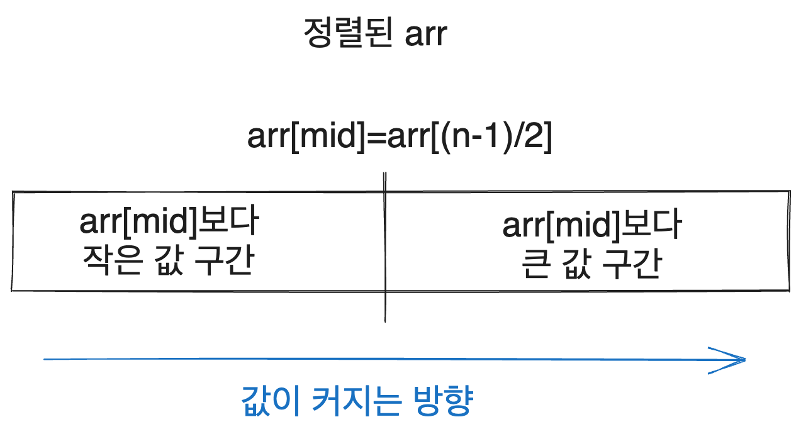
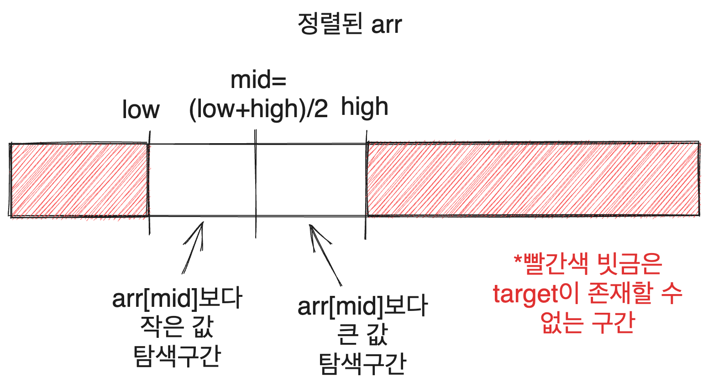
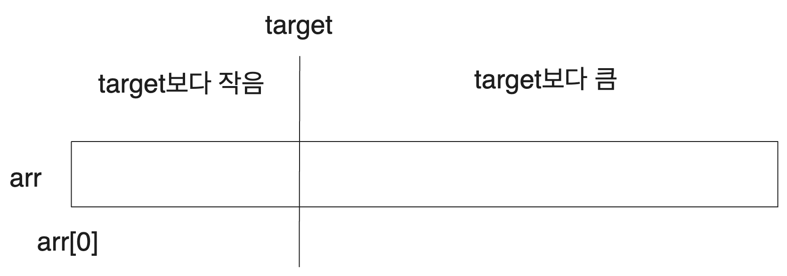
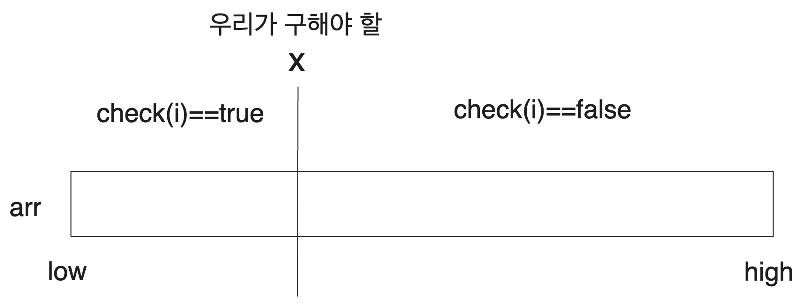
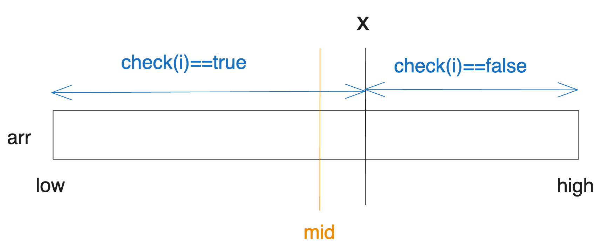
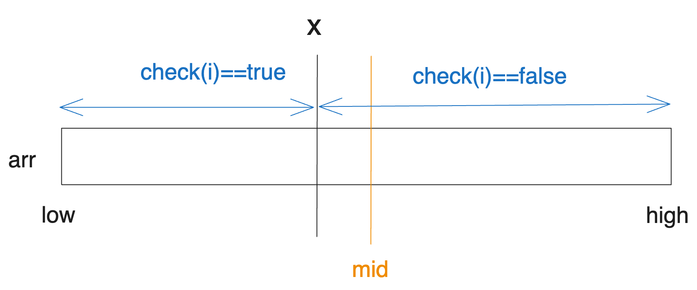
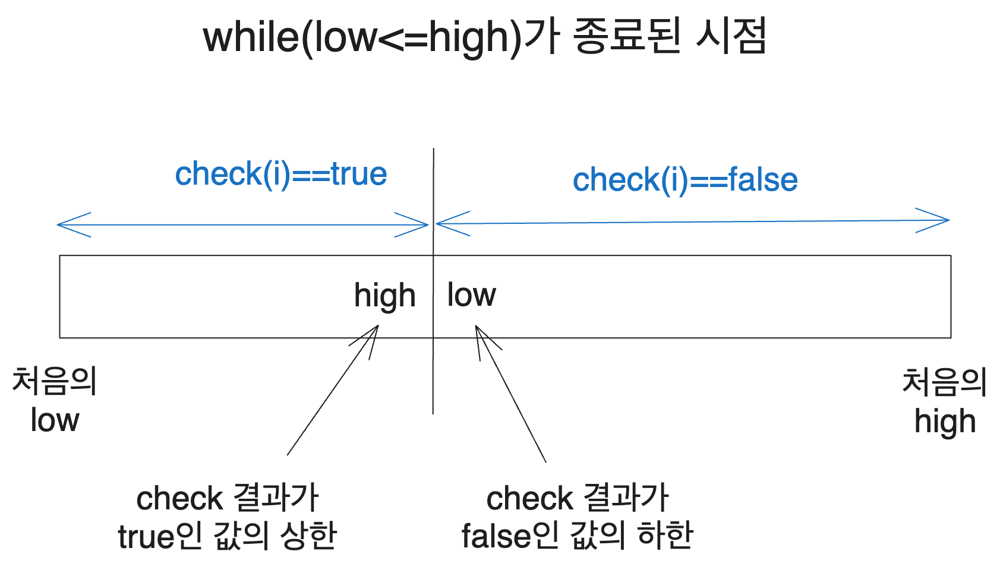

[city](https://solved.ac/profile/city)입니다. 알고리즘을 그럭저럭 오래 해왔는데, 이분 탐색의 원리를 어떻게 이해하는지에 그리고 활용 문제를 접근하는 방식에 대해서 누군가가 물어봐서 써본 글입니다.

기초적인 부분에 대해서는 생략된 부분도 많습니다. 때문에 [kks227님의 블로그 글](https://blog.naver.com/kks227/220777333252)과 같은 좋은 참고자료들이 많으니 같이 보면 좋을 것 같습니다.

글에 사용한 그림들은 [excalidraw](https://excalidraw.com/)를 사용하여 직접 그렸습니다.

# 1. 이분 탐색의 기초

이분 탐색은 기본적으로 정렬된 원소들 사이에서 특정 원소를 찾는 알고리즘입니다.

## 1.1. 코드

정렬된 `arr`배열에서 `target`값을 찾는 코드라면 대략 다음과 같은 코드로 짤 수 있습니다. C++ 기준입니다. 물론 다른 언어라도 논리는 똑같습니다.

```cpp
while(low<=high) {
  int mid = (low+high)/2;
  if(arr[mid]==target) {
    return mid;
  } else if(arr[mid]>target) {
    high = mid-1;
  } else {
    low = mid+1;
  }
}
```

## 1.2. 원리

이것의 핵심 아이디어는 우리가 찾는 값이 존재할 수 있는 탐색 구간을 반씩 줄여 나간다는 것입니다.

처음 탐색을 시작할 때를 생각해 봅시다. `arr`의 크기가 n이라면 우리가 찾는 값이 있을 수 있는 구간은 `arr[0]`부터 `arr[n-1]`까지입니다. 그리고 위의 알고리즘대로라면 `arr[(n-1)/2]`와 `target`을 비교하게 될 것입니다.

그런데 배열이 정렬되어 있다는 것을 생각해 볼 때, 배열의 모든 값은 `arr[mid]`와의 비교를 통해 다음과 같은 두 구간으로 나눌 수 있습니다.

(그럼 `mid`인덱스는 어느 쪽 구간에 속하는지 의문이 들 수 있습니다. 일단 넘어가도 되는 부분이긴 한데 위와 같은 닫힌 구간 구현에서는 둘 중 어디에도 속하지 않고, 이후에 볼 반열림 구간 `[s,e)`로 구현할 시에는 오른쪽 부분에 속하게 됩니다.)



그럼 우리는 찾는 값 `target`이 `arr[mid]`보다 작은지 큰지만 비교하면 `target`이 존재할 수 있는 구간을 반으로 줄일 수 있습니다. `target`이 `arr[mid]`보다 작다면 `mid`인덱스보다 작은 인덱스에 존재할 것이고 크다면 `mid`인덱스보다 큰 인덱스에 존재할 것이기 때문입니다.

만약 `target==arr[mid]`라면 우리는 `target`을 찾은 것이므로 바로 `mid`를 리턴하면 되고요.

정렬된 배열에서는 이런 식으로 `target`이 존재할 수 있는 구간을 반씩 줄여 나가면서 탐색할 수 있습니다. 그래서 시간복잡도 `O(logN)`만에 배열에서 값을 찾을 수 있다는 게 이분 탐색의 핵심 아이디어입니다.

즉 늘 다음과 같은 상황에서 탐색을 진행하게 됩니다.



그럼 탐색 구간을 구체적으로 어떻게 좁히느냐? 위의 이분탐색 코드는 설명한 두 가지 경우에 따라 low를 조절하거나 high를 조절해서 탐색 구간을 좁혀 나갑니다.

만약 `target`이 `arr[mid]`보다 작다면 `target`을 찾기 위해 `arr[mid]`의 왼쪽 구간을 탐색해야 하므로 탐색 구간의 상한인 `high`를 줄이고, `target`이 `arr[mid]`보다 크다면 `arr[mid]`의 오른쪽 구간을 탐색해야 하므로 탐색 구간의 하한인 `low`를 늘려줍니다.

이를 반복하다 보면 언젠가는 `target`을 찾게 되거나 탐색 구간이 더 이상 없어서 `target`을 찾지 못하게 됩니다.

# 2. 원리의 확장

## 2.1. 파라메트릭 서치의 아이디어

하지만 이렇게 배열에서 단순히 하나의 원소를 빠르게 찾아야 하는 경우는 너무 한정적입니다. 실생활이나 문제풀이에서도 이렇게 단순한 경우는 거의 없습니다.

이 아이디어를 좀더 확장해서 활용하기 위해 주목할 것은 우리가 배열이 정렬되어 있다는 것을 활용해서 `mid`인덱스를 기준으로 한쪽에는 `target`이 있고, 한쪽에는 `target`이 없다'라는 것을 알 수 있었고 그로 인해 탐색 공간을 반씩 줄여 나갈 수 있었다는 것입니다.

이 말을 반대로 말하면 탐색 구간을 어떤 기준으로 반씩 줄여 가며 무언가를 찾을 수 있는 작업이라면 이분 탐색을 생각해 볼 수 있다는 이야기입니다. 여기서 파라메트릭 서치의 아이디어가 나옵니다.

가령 `arr`배열의 0번부터 n-1번 인덱스 중 `target`을 찾는 것이 아니라 `target`보다 큰 첫번째 원소의 인덱스를 찾는 문제라고 해봅시다. 이는 원소에 대한 탐색 자체보다 좀 더 넓은 범위를 커버하는 문제입니다.

우리는 그럼 `arr`이 두 부분으로 나누어져 있다고 생각할 수 있습니다.



그럼 우리는 `arr`의 어떤 특정 값이 `target`보다 작은지 큰지만 판정하면 우린 해당 값이 우리가 찾는 '`target`보다 큰 첫번째 원소의 인덱스'보다 왼쪽에 있는지 오른쪽에 있는지를 알 수 있습니다.

이를 이용하면 우리는 경계를 찾아야 하는 탐색 구간을 반씩 줄여 나갈 수 있고 따라서 이분탐색의 아이디어로 문제를 풀 수 있습니다.

```
이렇게 문제를 푸는 방식을 파라메트릭 서치, 즉 매개 변수 탐색이라고도 합니다. 최적화 문제를 결정 문제로 바꿔 푸는 거라고 멋지게 말할 수도 있지만 그 말이 원리만큼 중요하다고 생각하지는 않습니다.
```

## 2.2. 파라메트릭 서치

이를 좀더 일반화해 보겠습니다. 우리는 구간 `[low, high]`에 대해서 생각합니다. 그리고 어떤 결정 문제가 있어서 어떤 특정 자연수 `x`($low \le x \le high$)에 대해서 `x`보다 작거나 같은 자연수들에서는 true이고, `x`보다 큰 자연수들에서는 false라고 해봅시다. 우리는 이 `x`를 구하고자 합니다.



그럼 우리는 우리는 `mid=(low+high)/2`에 대해 `check`이 true인지를 기반으로 우리가 구해야 할 값이 `mid`보다 작은지 큰지를 판단할 수 있습니다.

만약 `mid`에서 `check`가 false라고 해봅시다. 그러면 다음과 같은 상황일 것입니다.


그럼 그림만 보아도, 우리는 `x`가 `mid`보다 작은 쪽에 있다는 것을 알 수 있습니다. 만약 반대로 `mid`에서 `check`가 true라면 `x`는 `mid`보다 큰 쪽에 있을 것입니다. 이를 이용해 탐색 구간을 업데이트해 나갑니다. 다음 섹션에서 더 자세히 보겠습니다.

## 2.3. 코드와 함께 자세히 보기

코드와 함께 보면 다음과 같습니다. 나올 수 있는 자연수의 하한을 low, 상한을 high라고 하면, 경계선을 찾는 코드는 대강 이럴 것입니다. `check(i)==true`인 구간의 상한 `x`를 찾습니다.

```cpp
while(low<=high){
  int mid = (low+high)/2;
  // A가 mid에서 가능하다
  if(check(mid)){
    low = mid+1;
  }else{
    high = mid-1;
  }
}
return high;
```

A가 `mid`에서 가능하다면 즉 `check(mid)`가 true라면 `x`는 `mid`의 오른쪽에 있을 것입니다. 다음과 같은 상황인 거죠.



따라서 오른쪽 구간의 탐색을 위해 low를 mid+1로 업데이트해주는 것입니다. 그러고 나면 다음 탐색 구간은 반으로 줄게 됩니다.

반대로 `check`가 `mid`에서 false라면 `x`는 `mid`의 왼쪽에 있을 수밖에 없습니다. 다음과 같은 상황에서만 `mid`에서 `check`가 false일 수 있기 때문입니다.



따라서 왼쪽 구간의 탐색을 위해 high를 mid-1로 업데이트해주는 것입니다.

이를 반복하다 보면 x를 찾을 수 있습니다!

# 3. 더 깊이 이해하기

이분탐색에 대한 자료는 워낙 많기 때문에 이 정도 이해는 사실 꽤 많은 분들이 하고 계십니다. 하지만 가장 헷갈리는 부분은 이런 거라고 생각합니다. 이로 인해 답에 1차이가 나는 등의 문제를 `off by one`이라고도 하는 것 같습니다.

```
while(low<=high) vs while(low<high)
low 출력 vs high 출력
(lower와 upper, l과 r, s와 e등의 다른 변수명을 쓰는 분들도 있지만 가리키는 건 어차피 똑같으니 low, high로 하겠습니다)
```

많은 분들이 그렇듯이 저도 알고리즘을 처음 시작한 지 몇 달 안 되어 이분 탐색을 배웠지만 이런 것들을 잘 이해하기까지는 1년도 넘게 걸린 것 같습니다.

따라서 먼저 제가 사용하는 방식에서 저런 부분들을 어떻게 다루는지 설명하도록 하겠습니다. 그리고 다음 글에서는 다른 방식도 소개해 보도록 하겠습니다.

## 3.1. 구현 이해하기

문제 조건에 따라 조금씩 달라지지만 어떤 문제 `check`가 true인 구간의 최댓값 혹은 최솟값을 찾는 파라메트릭 서치에 제가 흔히 쓰는 코드는 다음과 같습니다. 위에 쓴 것과 같습니다.

```cpp
while(low<=high){
  int mid=(low+high)/2;
  if(check(mid)){
    low=mid+1;
  }
  else{
    high=mid-1;
  }
}
```

그럼 이 `while`문은 어느 시점에 종료될까요? `while`은 `low <= high`일 때 body를 실행하니까 `while`이 종료되었다는 것은 `low > high`가 되었다는 뜻일 겁니다.

그리고 탐색 구간의 길이는 계속 작아져서 결국 1이 되었을 테니 `low > high`일 때 둘의 차이는 1이 될 것입니다.

다음 그림의 상황은 `low == high+1`이 되어 `while`이 종료된 상황입니다.


즉 탐색이 종료된 시점에서 `high`는 `check(i)==true`인 구간의 상한을, `low`는 `check(i)==true`인 구간의 하한을 나타내게 됩니다.


## 3.2. 문제로 생각해보기

유명한 파라메트릭 서치 문제인 [1654번 랜선 자르기](https://www.acmicpc.net/problem/1654)를 봅시다.

특정 경계 수보다 작거나 같으면 문제의 조건을 만족시킬 수 있고 크면 문제 조건을 만족시킬 수 없습니다. K개의 랜선들을 같은 길이로 잘라서 N개의 랜선을 만들어야 하고 그럴 수 있는 최대 랜선 길이를 구해야 한다는 문제 조건을 생각해 보면 당연합니다.

만약 K개의 랜선을 각각 X 길이로 잘라서 N개의 랜선을 만드는 것이 `가능`하다면 X보다 작은 길이로도 그것이 가능하고, K개의 랜선을 Y 길이로 잘라서 N개의 랜선을 만드는 것이 `불가능`하다면 Y보다 큰 길이로도 그것이 불가능하기 때문입니다.

만약 어떤 길이 L이 있어서 우리가 길이 L의 랜선을 N개 만들어서 문제 조건을 만족시킬 수 있다고 합시다. 그러면 L보다 작은 길이의 랜선을 N개 만드는 건 굳이 수학적 증명이 없이도 가능하다는 걸 쉽게 깨달을 수 있습니다. N개보다 많이 만드는 것도 N개를 만드는 것에 포함된다는 문제 조건이 있기 때문에~

그러므로 이 문제는 경계선을 나타내는 자연수보다 작거나 같으면 가능, 크면 불가능인 상황이고 그 '가능한 구간'의 최댓값을 찾는 문제입니다.

즉 이 문제와 같은 경우 가능한 구간의 상한인 `high`를 출력하면 되는 문제입니다(심지어 문제 설명에도 '최댓값을 구하라'고 친절하게 말해 줍니다).


즉 입력을 제외한 랜선 자르기 문제에서 이분 탐색 부분만 따로 떼어서 적어보면 다음과 같습니다. `high`를 출력하면 됩니다.

```cpp
while(low<=high){
    ll mid=(low+high)/2;
    if(check(mid)){
        low=mid+1;
    }
    else{
        high=mid-1;
    }
}
cout<<high<<"\n";
```

반면 [1072번 게임](https://www.acmicpc.net/problem/1072)과 같은 문제에서는 `게임을 최소 몇 번 더 해야 Z가 변하는지` 즉 가능한 구간의 최솟값을 찾는 문제이므로 `low`를 출력해야 합니다.

## 3.3. 여담

이렇게 구간을 줄여나가는 아이디어를 통해서 할 수 있는 게 정말 많습니다. 구간합의 홀짝성이 달라지는 것을 이용해서 이분탐색을 한다든지, 아예 구간을 3개로 나눠서 극점을 찾는 삼분 탐색을 한다든지 아니면 자연수 대신 실수도 어쨌든 정렬되어 있다고 생각할 수 있으므로 이를 이분탐색한다든지 등등...

또한 가능 여부를 따지는 부분도 중요하지만 위에서는 그냥 check함수로 퉁쳤습니다. 이것도 사실 문제를 풀 때 엄청 어려운 포인트가 될 수도 있습니다. [1637번 날카로운 눈](https://www.acmicpc.net/problem/1637)같은 문제를 보면서 이분탐색을 바로 떠올리기는 쉽지 않고 판정 방식을 떠올리기도 쉽지 않습니다. 이런 부분들도 나중에 기회가 되면 쓰도록 하겠습니다.

## 3.4. 다른 구현 한 가지

다른 구현들에 대해서는 본격적으로 다음 글에서 다룰 것입니다. 하지만 간단한 바리에이션 하나를 여기서 소개합니다.

구간을 따지는 방식을 바꾸는 것은 아니고, 정답이 될 수 있는 값을 계속 업데이트하는 것입니다. 다음과 같이 말입니다.

```cpp
ll ans=min_value;
while(low<=high){
    ll mid=(low+high)/2;
    if(check(mid)){
        low=mid+1;
        ans=max(ans, mid);
    }
    else{
        high=mid-1;
    }
}
cout<<ans<<"\n";
```

이렇게 하면 무조건 가능 구간의 상한이 `ans`에 들어갑니다. 이분탐색 하는 동안 가능 구간의 상한 값이 `ans`에 한 번은 들어갈 수밖에 없고 이는 들어가는 값 중 최댓값이기 때문입니다.

구간의 가능성이 반대라면 적당히 `ans=min(ans, mid)`으로 바꾸고 위치도 변경하면 됩니다. 원리를 생각하면 쉽게 할 수 있습니다. 이렇게 이분탐색을 다루는 분들도 몇 분 보았고 구간이 줄어드는 원리 이해에 도움이 된다고 생각해서 이 글에 소개합니다.

# 4. 정리

이분 탐색을 활용해서 문제를 풀 때의 핵심은 '한쪽 구간은 뭔가가 되고, 한쪽 구간은 안 된다. 따라서 어떤 한 값의 가능 여부를 알면 그 값을 기준으로 어떤 구간을 탐색할지 결정할 수 있다.'라는 것입니다.

그렇게 탐색 구간을 줄여가다 보면 결국 경계선을 찾을 수 있는데요. 이때 경계선을 찾는 while문이 언제 종료되는지를 따져 보면 우리는 high와 low중 어떤 값이 필요한지를 알 수 있습니다. 닫힌 구간으로 구현하건 반열린 구간으로 구현하건 마찬가지입니다.

우리가 어떤 가능성을 따지고 있는지, 그리고 while문이 어떤 조건일 때 종료될지를 생각하며 이분 탐색에 접근합시다.

그리고 반대로, 어떤 값을 경계로 어떤 기준의 가능/불가능 여부가 바뀐다면(x보다 작거나 같은 값에 대해서는 문제 조건이 가능한데, x보다 크면 안 되고 이때의 x값을 찾아라~하는 식, 혹은 문제를 잘 생각해 보면 그런 문제로 환원시킬 수 있는 문제)이분 탐색을 한번 생각해 봅시다.



# 참고

https://codeforces.com/blog/entry/96699