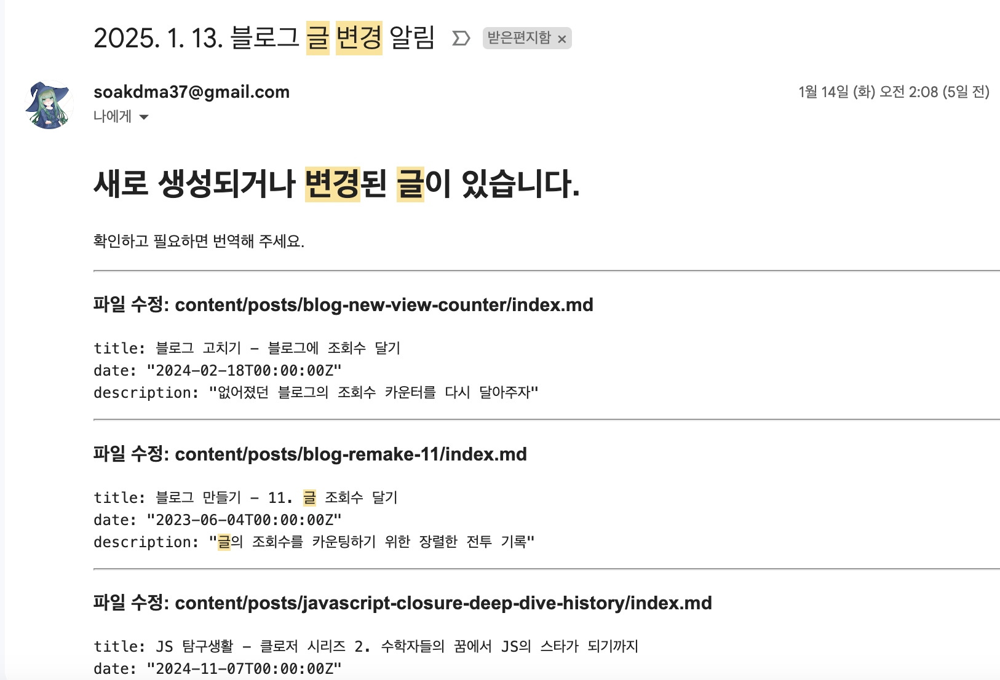

# 시작

블로그를 운영하면서, 더 많은 전 세계 사람들에게 내 콘텐츠를 제공하고 싶다는 생각이 들었다. 언어의 장벽 때문에 내 글이 제한된 독자들에게만 닿을 수밖에 없다는 아쉬움이 컸기 때문이다. 그래서 내가 열심히 쓴 글들을 영어로도 제공할 수 있도록 블로그의 영어 버전을 만들어보기로 했다.

하지만 내가 직접 하나하나 글을 번역하기는 현실적으로 힘들기 때문에 ChatGPT에게 맡겨 보기로 했다. 요즘 GPT API 발전하면서 번역 품질도 높아졌다고 하니, 이를 활용하면 번역 작업이 훨씬 효율적일 것이라는 기대가 들었다.

# 1. ChatGPT API 사용하기

[OpenAI 플랫폼의 Developer quickstart 문서](https://platform.openai.com/docs/quickstart)를 보면 쉽게 시작할 수 있다. 이외에도 OpenAI API를 쓰는 법에 대한 좋은 글은 인터넷에 많기 때문에 참고할 수 있다.

## 1.1. API 실행

OpenAI API를 사용하기 위해서는 API 키가 필요하다. OpenAI developer platform의 [대시보드에서 API 키를 만들 수 있다.](https://platform.openai.com/api-keys) 원격으로 gpt에 요청을 보낼 때 이를 사용한다.

API를 사용하는 비용은 ChatGPT Plus 구독과 별개이다. API를 사용하면 사용한 만큼 비용이 청구되며 OpenAI 플랫폼의 프로필에 있는 Organization - Billing에서 확인할 수 있다. 나는 10달러의 크레딧을 충전해 두었다.

내가 사용할 gpt-4o-mini 모델의 경우 100만 토큰당 0.15달러 정도이다. 그리고 한글의 경우 대략 한 단어, 혹은 2~3글자 정도가 토큰 하나로 취급되는 듯 하다. 따라서 10달러 정도면 내 블로그에 있는 글을 번역하는 데 충분할 것이다. 만약 글 하나가 얼만큼의 토큰을 사용하는지 알고 싶다면 [Tokenizer](https://platform.openai.com/tokenizer)로 확인할 수도 있다.

아무튼 키를 발급받았다면 API를 실행해보자. 나는 pnpm을 사용하므로 JS/TS OpenAI SDK를 설치하자. 나는 번역용 스크립트를 수동으로 실행해서 번역을 하려고 하므로 개발 의존성에만 설치하면 된다.

```bash
pnpm add -D openai
```

이제 다음과 같은 예시 코드를 추가한다. 번역용 스크립트로 쓸 테니 파일명은 `translate.mjs`로 하고 프로젝트 루트에 파일을 두었다.

```javascript
// translate.mjs
import OpenAI from 'openai';

const OPENAI_API_KEY = '여기에 API 키를 넣어주세요';

const openai = new OpenAI({
  apiKey: OPENAI_API_KEY,
});

const completion = await openai.chat.completions.create({
  model: 'gpt-4o-mini',
  messages: [
    { role: 'system', content: 'You are a friendly and playful assistant.' },
    {
      role: 'user',
      content: '나에게 인사를 해줘!',
    },
  ],
});

console.log(completion.choices[0].message);
```

role의 system은 GPT가 어떻게 행동할지 지정한다. 예를 들어서 "너는 전문적인 경력을 가진 번역가야." 등의 역할 지정을 할 수 있다. user는 일반적으로 우리가 사용하는 역할 그러니까 GPT에게 질문하는 사용자이다. assistant도 있는데 명령을 수행하기 위한 사전 지식 등을 전달하는 데 쓴다고 한다.

이렇게 API를 한번 사용해보는 코드를 쓰고 터미널에서 `node translate.mjs`를 실행하면 ChatGPT가 답변을 생성해준다. 실행할 때마다 조금씩 답변이 달라졌지만 대략 이런 답변이 나왔다.

```js
{
  role: 'assistant',
  content: '안녕하세요! 😊 오늘 하루는 어떠신가요? 즐거운 시간 보내고 계신가요?',
  refusal: null
}
```

## 1.2. 번역 스크립트 작성

API를 실행할 수 있게 되었으니 API를 이용해서 번역을 하도록 하자. 번역을 위한 프롬프트를 만들고 문서를 가져와서 번역하고 저장하도록 하는 것이다.

먼저 GPT에게 전달할 프롬프트를 작성했다. 프롬프트 엔지니어링을 잘 하는 편은 아니라서 ChatGPT에게 적당히 프롬프트를 짜달라고 했다. 몇 번 고쳐달라고 하면서 이렇게 만들었다. 당신은 전문 번역가고 한국어 기술 문서를 전문적이고 정확하게 번역하며 추가적인 설명이나 문맥 없이 번역하라고 했다.

```javascript
const systemPrompt = 'You are an expert technical translator. Your goal is to translate the given Korean technical documents into professional and accurate English. Ensure the translation is concise and formal, suitable for professional audiences. Provide only the translation without additional explanation or context.';
```

그리고 이 프롬프트를 사용해서 파일을 영어로 번역하는 함수를 만들었다. `inputFile`에 주어진 경로를 읽어서 번역하고 `outputFile`에 번역된 내용을 쓴다. 만약 주어진 `outputFile` 경로가 존재하지 않을 경우 해당 경로를 생성하도록 했다.

물론 inputFile이 존재하지 않는 경우도 확인하도록 할 수 있다. 하지만 실제로 이 함수를 사용할 때는 이미 존재하는 파일의 경로를 가져와서 번역하도록 할 것이기 때문에 이 부분은 생략했다.

```js
const openai = new OpenAI({
  apiKey: OPENAPI_API_KEY,
});

// ...

// 파일을 영어로 번역하는 함수
const translateFileToEnglish = async (inputFile, outputFile) => {
  const inputContent = readFileSync(inputFile, 'utf-8');
  const outputDir = path.dirname(outputFile);
  
  // 결과 파일의 디렉토리가 없으면 생성한다
  if (!existsSync(outputDir)) {
    mkdirSync(outputDir, { recursive: true });
  }

  try {
    const completion = await openai.chat.completions.create({
      // 상대적으로 경량인 mini 모델 사용
      model: 'gpt-4o-mini',
      messages: [
        { role: 'system', content: systemPrompt },
        { role: 'user', content: inputContent },
      ],
    });

    const translatedContent = completion.choices[0].message.content;

    // 번역된 내용을 outputFile 경로에 쓴다
    writeFileSync(outputFile, translatedContent);
  }
  catch (error) {
    console.error('Failed to translate:', error);
  }
};
```

## 1.3. 파일을 가져와 번역하기

내 블로그의 글은 `content/posts`에 저장되어 있다. 이 디렉토리에 있는 모든 글을 번역해서 새로운 곳에 저장하도록 하자. 번역된 글은 `content/en-posts`에 저장하도록 했다.

하지만 번역할 때마다 API 토큰이 소모되기 때문에 이미 번역된 파일이 있는 경우에는 번역을 건너뛰는 게 좋다. 따라서 다음과 같은 동작을 하는 함수를 작성하자.

- `content/posts` 디렉토리에 있는 한글로 작성된 글들에 대해, 해당 글의 번역본이 있는지 확인
  - `content/en-posts` 디렉토리에 같은 이름의 폴더가 있는지 확인하는 방식
- 번역된 파일이 없다면 ChatGPT API를 사용해서 번역

이를 위해 `fs` 모듈의 함수를 사용해서 디렉토리를 읽고 각 파일에 대해 번역을 진행하도록 했다.

```js
// translate.mjs
const translateAllFiles = async () => {
  const inputDir = path.join(__dirname, 'content', 'posts');
  const outputDir = path.join(__dirname, 'content', 'en-posts');

  const posts = readdirSync(inputDir, { withFileTypes: true })
    .filter((entry) => entry.isDirectory())
    .map((entry) => entry.name);

  // content/posts 디렉토리에 있는 모든 글에 대해 작업 진행
  for (const post of posts) {
    const inputFile = path.join(inputDir, post, 'index.md');
    const outputFile = path.join(outputDir, post, 'index.md');

    if (!existsSync(inputFile)) {
      console.warn(`Source file not found: ${inputFile}`);
      continue;
    }

    // 번역된 파일이 이미 존재하면 건너뛴다
    if (existsSync(outputFile)) {
      console.log(`Translation already exists: ${outputFile}`);
      continue;
    }

    await translateFileToEnglish(inputFile, outputFile);
  }
};
```

이렇게 만든 함수를 실행하는 코드도 넣자.

```js
// translate.mjs
translateAllFiles().then(() => {
  console.log('Translation process completed.');
}).catch((error) => {
  console.error('An error occurred during the translation process:', error);
});
```

터미널에서 `node translate.mjs`를 실행하면 번역이 진행되고, 번역이 완료되면 번역된 파일이 생성되어 `content/en-posts`에 저장된다. 그리고 번역된 파일이 이미 존재하는 경우 번역을 건너뛰는 동작을 잘 하는 것도 확인 가능하다.

## 1.4. 개선 - 병렬 처리와 API 제한 대응

하지만 위에서 짠 코드는 for문의 반복 하나하나마다 `await`을 하고 있다. 따라서 글 하나의 번역이 끝나고 번역된 파일이 생성되고 나서야 다음 글 번역을 시작하는 식이다. 글을 한두 개 번역한다면 이 정도로도 충분할 수 있지만 글이 많아지면 번역 시간이 길어진다.

이때 각 글의 번역을 굳이 순서대로 할 필요는 없기 때문에 한번에 여러 API 요청을 보내도록 할 수 있다. 여러 방법이 있겠지만 나는 번역 작업 각각을 Promise로 만들어서 `Promise.all`로 한 번에 실행하도록 했다. 즉 다음과 같이 `translateAllFiles` 함수를 수정했다.

```js
const translateAllFiles = async () => {
  const posts = readdirSync(inputDir, { withFileTypes: true })
    .filter((entry) => entry.isDirectory())
    .map((entry) => entry.name);

  const translationPromises = posts.map(async (post) => {
    const inputFile = path.join(inputDir, post, 'index.md');
    const outputFile = path.join(outputDir, post, 'index.md');

    if (!existsSync(inputFile)) {
      console.warn(`Source file not found: ${inputFile}`);
      return Promise.resolve(); // Skip missing files
    }

    if (existsSync(outputFile)) {
      console.log(`Translation already exists: ${outputFile}`);
      return Promise.resolve(); // 이미 번역된 파일은 스킵
      // 새로 번역이 필요할 경우 수동 관리
    }

    return translateFileToEnglish(inputFile, outputFile);
  });

  const results = await Promise.all(translationPromises);
};
```

물론 각 번역 작업을 담은 Promise는 생성되자마자 즉시 실행되므로 완전히 동시에 시작하는 병렬이라고 하기에는 무리가 있지만 어쨌든 한 번에 여러 요청을 보낼 수 있다는 건 마찬가지다.

그런데 이렇게 하면 한번에 많은 글을 번역시킬 경우 API 요청이 중간중간 실패하는 경우가 있었다. OpenAI API 요청에 시간당 토큰 제한이 있었기 때문이다. 나의 경우 OpenAI의 사용자 티어 1에 있는데 이 티어에서는 gpt-4o-mini가 "분당 20만 토큰"을 지원한다. 내가 넣는 글은 하나에 5000~1만 토큰 정도 하기 때문에 이렇게 한꺼번에 요청을 하면 제한에 걸리는 것이다.

전체 토큰 제한은 [OpenAI Rate limits](https://platform.openai.com/docs/guides/rate-limits)에서 볼 수 있다.

이런 경우를 대비하는 방법은 여러 가지가 있을 것이다. 하지만 이러한 동시성 제어가 이 글의 메인이 아니므로 여기서는 간단히 요청들을 몇 개씩 묶어서 처리하고, 그 묶음들 간에 딜레이를 주는 방법을 사용했다. 이때 글 하나에 5000토큰짜리도 있고 3만토큰에 가까운 긴 글도 있었기 때문에 넉넉하게 10개씩 묶어서 처리하도록 했다.

실제로 번역 작업을 10개씩의 배치로 묶어 처리하기 위해 작성했던 함수는 다음과 같다.

```js
const delay = (ms) => new Promise((resolve) => setTimeout(resolve, ms));

/**
 * 비동기 작업을 배치로 나누어 처리하고 배치 사이에 딜레이를 추가하는 함수
 * @param {Array<Function>} tasks - 실행할 비동기 작업이 담긴 프로미스를 리턴하는 함수들의 배열
 * @param {number} batchSize - 한 번에 실행할 작업 수
 * @param {number} delayMs - 배치 간 대기 시간 (밀리초 단위)
 */
const processInBatches = async (tasks, batchSize, delayMs) => {
  const results = [];
  for (let i = 0; i < tasks.length; i += batchSize) {
    const batch = tasks.slice(i, i + batchSize);
    console.log(`Processing batch ${Math.floor(i / batchSize) + 1} of ${Math.ceil(tasks.length / batchSize)}...`);

    // 배치 내 모든 작업 실행
    const batchResult = await Promise.allSettled(batch.map((task) => task()));
    results.push(...batchResult);

    // 마지막 배치가 아니면 딜레이 추가
    if (i + batchSize < tasks.length) {
      console.log(`Waiting for ${delayMs / 1000} seconds before next batch...`);
      await delay(delayMs);
    }
  }
  return results;
};
```

그리고 `translateAllFiles` 함수를 다음과 같이 수정하여 이 함수를 사용하도록 했다. 이때 `translationPromises` 배열에는 Promise 그 자체가 아니라 번역 작업을 수행하는 함수의 Promise를 리턴하는 함수들을 담았다. 이렇게 하면 Promise가 생성과 동시에 실행되는 것을 막을 수 있다.

```js
const translateAllFiles = async () => {
  const inputDir = path.join(__dirname, 'content', 'posts');
  const outputDir = path.join(__dirname, 'content', 'en-posts');

  const posts = readdirSync(inputDir, { withFileTypes: true })
    .filter((entry) => entry.isDirectory())
    .map((entry) => entry.name);

  const translationPromises = posts.map((post) => {
    const inputFile = path.join(inputDir, post, 'index.md');
    const outputFile = path.join(outputDir, post, 'index.md');

    if (!existsSync(inputFile)) {
      console.warn(`Source file not found: ${inputFile}`);
      return null; // Skip missing files
    }

    if (existsSync(outputFile)) {
      console.log(`Translation already exists: ${outputFile}`);
      return null; // 이미 번역된 파일은 스킵
      // 새로 번역이 필요할 경우 수동 관리
    }

    // Promise가 생성과 동시에 실행되는 것을 막기 위해 익명 함수로 감싼다
    return () => translateFileToEnglish(inputFile, outputFile);
  }).filter(Boolean);

  // 번역 작업을 배치로 나누어 10초 간격을 두고 처리
  const results = await processInBatches(translationPromises, 10, 10000);
};
```

참고로 이렇게 210개 정도의 글을 번역하는 데에 0.5달러 정도가 들었다. 글당 대략 15000토큰 정도 소모한 꼴이다. 한국어에 비해 영어로 쓰인 글이 얼마나 많은 사람들에게 읽힐 가능성이 있는지 생각하면 이 정도 비용은 꽤나 저렴한 편이라고 생각한다.

# 2. 영어 블로그 만들기

번역된 파일이 생성되었으니 이를 블로그에 적용하면 된다. 내 블로그에서는 마크다운으로 작성된 글을 [velite](https://witch.work/posts/velite-library-introduction)라는 라이브러리를 이용해서 다루고 있다. 여기서 한국어 글을 다루던 그대로 영어 글에 대한 스키마를 하나 더 만들어 주기만 하면 된다.

따라서 단순히 번역 글을 저장하고 다루는 것이 아니라, 블로그 전체에서 다른 언어를 지원할 수 있도록 하는 것에 초점을 맞추어 작업을 진행했다.

## 2.1. 영어 페이지 만들기

인공지능 번역은 어떤 언어로든 가능하기 때문에 일본어나 중국어 등 다른 언어로도 블로그를 지원할 수 있을 것이다. 하지만 일단 영어에 초점을 맞춰서, 한국어 페이지와 영어 페이지를 만들어보기로 했다.

먼저 `app` 폴더의 최상단에 `[lang]` 폴더로 dyamic route를 만들었다. 그리고 기존의 페이지들을 모두 `[lang]` 폴더 안으로 옮겼다. `[lang]` 폴더 안에 있는 모든 페이지와 레이아웃 파일들의 컴포넌트는 props로 `lang`이라는 언어 코드를 받게 될 것이다.

`generateStaticParams`로 가능한 언어들의 동적 경로를 생성하도록 했다.

```js
export function generateStaticParams() {
  return locales.map((lang) => ({
    lang,
  }));
}
```

그리고 모든 페이지 컴포넌트들에서 `lang` props에 따라 해당 언어에 맞는 내용을 보여주도록 했다. 거기에 맞게 다른 함수들도 언어에 따라 동작하도록 수정했다. 예를 들어 홈 페이지는 다음과 같이 바뀌었다. 

현재 이 블로그에서 동작하고 있는 코드 거의 그대로이다. 여러 함수와 컴포넌트에서 `lang`을 props 혹은 인수로 받아 동작하는 것을 볼 수 있다. `content` 객체를 통해 `lang`에 따라 다른 내용을 보여주는 것도 볼 수 있다. 많은 다국어 관련 라이브러리에서는 `t` 함수를 통해 이런 언어별 콘텐츠 렌더링을 지원하지만 언어별 콘텐츠가 많지 않기 때문에 일단 이렇게 직접 구현하였다.

```tsx
type Props = {
  params: { lang: "ko" | "en" };,
};

const content = {
  ko: {
    recentPosts: '최근에 작성한 글',
    recentTranslations: '최근 번역',
  },
  en: {
    recentPosts: 'Recent Posts',
    recentTranslations: 'Recent Translations',
  },
} as const satisfies Record<Language, object>;

function Home({ params }: Props) {
  const { lang } = params;

  const recentPosts = getRecentPosts(lang);
  const recentTranslations = getRecentTranslations();

  return (
    <>
      <Profile lang={lang} />
      <section className={styles.container}>
        <div>
          <h2 className={styles.title}>{content[lang].recentPosts}</h2>
          <AllPostTagList selectedTag="all" lang={lang} />
          <PostList postList={recentPosts} direction="row" />
        </div>
        {/* 중간 생략 */}
      </section>
    </>
  );
}

export default Home;

export function generateStaticParams() {
  return locales.map((lang) => ({
    lang,
  }));
}
```

## 2.2. 기본 라우트를 한국어로 설정하기

기존의 여러 페이지와 함수들을 언어 기반으로 바꾸었다. 이제 `/ko`와 `/en`으로 시작하는 경로를 통해 각각 한국어, 영어 페이지로 이동할 수 있게 되었다.

하지만 원래 내 블로그를 알던 사람들이 있다면 기존의 `/` 경로, 그러니까 `https://witch.work/`로 접속하고자 할 것이다. 이때 이러한 기본 경로에서는 한국어 컨텐츠를 보여주도록 해보자.

정석적으로는 HTTP의 콘텐츠 협상을 통해서 사용자의 언어 설정을 확인하고 그에 맞는 언어로 컨텐츠를 제공해야 한다. 하지만 이러한 다국어 처리는 생각해야 할 게 꽤 있기 때문에 단순히 영어로도 볼 수 있는 블로그를 만들고자 했던 원래 목적을 넘어서는 일이다.

따라서 일단 간단하게 한국어로 설정하고, 사용자가 직접 언어를 선택할 수 있도록 하기로 했다.

기본 경로로 접속했을 때 한국어 페이지를 보여주기 위해서는 언어 정보가 없는 URL로 접속했을 경우 기본 로케일(한국어) 경로로 rewrite해주는 작업을 Next.js 미들웨어를 이용해서 해주었다. 이 미들웨어는 `src/middleware.ts`에 작성했다.

```ts
export function middleware(request: NextRequest) {
  // Check if there is any supported locale in the pathname
  const { pathname } = request.nextUrl;

  // URL 경로에서 로케일 찾기
  const pathnameHasLocale = i18n.locales.some(
    (locale) => pathname.startsWith(`/${locale}/`) || pathname === `/${locale}`,
  );

  if (pathnameHasLocale) {
    // 경로에 이미 로케일이 포함된 경우 추가 작업 없이 통과
    return NextResponse.next();
  }

  // 경로에 로케일이 없는 경우 기본 로케일의 컨텐츠를 보여주도록 rewrite
  request.nextUrl.pathname = `/${i18n.defaultLocale}${pathname}`;
  return NextResponse.rewrite(request.nextUrl);
}
```

여기서 쓰인 `i18n` 객체는 다음과 같이 정의했다. `defaultLocale`이 한국어인 걸 볼 수 있다.

```ts
export const i18n = {
  defaultLocale: 'ko',
  locales: ['ko', 'en'],
} as const;
```

## 2.3. 언어 변경 UI

사용자가 직접 언어를 변경할 수 있는 UI를 만들어보자. 이를 위해서는 언어 변경 버튼을 만들고, 버튼을 누르면 해당 언어로 이동하도록 해야 한다. Next.js에서는 서버 컴포넌트에서 현재 경로를 알 수 있는 기능을 지원하지 않는다. 따라서 이는 클라이언트 컴포넌트여야 한다.

앞서서 한국어 페이지의 경우 경로에 언어가 포함되어 있지 않으므로 이 경우를 고려하여 언어 변경 버튼을 만들었다. 클라이언트 컴포넌트이므로 `usePathname` 훅을 사용해서 현재 경로를 알아내고 `useRouter` 훅을 사용해서 다른 언어로 이동하는 함수를 만들었다. 또한 기존 언어를 `lang` 인수로 받아서, 기존 언어와 새롭게 선택한 언어가 같은 경우에는 무시하도록 했다.

디자인은 그다지 중요하지 않으므로 css를 제외한 로직만 여기 옮긴다.

```tsx
// src/components/LanguageSwitcher.tsx
export default function LanguageSwitcher({ lang }: { lang: Language }) {
  const pathname = usePathname(); // 현재 경로
  const router = useRouter();
  // 언어 교체
  const toggleLanguage = (newLang: Language) => {
    if (lang === newLang) return; // 같은 언어일 경우 무시

    const pathSegments = pathname.split('/').filter(Boolean); // 경로를 '/'로 나누고 빈 값 제거
    const currentLangIndex = locales.includes(pathSegments[0] as Language) ? 0 : -1;

    // 경로에 언어가 없는 경우
    if (currentLangIndex === -1) {
      const newPath = newLang === i18n.defaultLocale ? pathname : `/${newLang}${pathname}`;
      router.push(newPath);
      return;
    }

    // 언어가 있는 경우 기존 언어를 새 언어로 교체
    pathSegments[currentLangIndex] = newLang === i18n.defaultLocale ? '' : newLang;
    const newPath = `/${pathSegments.filter(Boolean).join('/')}`;
    router.push(newPath);
  };

  return (
    <nav className={styles.container}>
      {locales.map((locale) => (
        <button className={`${styles.button} ${locale === lang ? styles.activeButton : ''}`} key={locale} onClick={() => { toggleLanguage(locale); }}>
          {content[locale].flag}
          {' '}
          {content[locale].label}
        </button>
      ))}
    </nav>
  );
}
```

## 2.4. 번역 알림 문구 삽입

각 글에 대해 AI를 이용해 번역본을 생성했다. 그리고 한국어 페이지와 영어 페이지 간의 전환도 가능하게 했다. 하지만 아무리 AI 번역이 발전했다고 해도 완전히 믿을 수는 없다. 또한 내가 하나하나 읽어볼 수도 없는 노릇이라 혹시나 있을 외국어 독자들을 위한 안내문을 넣기로 했다.

다음과 같이 `TranslationNotice`라는 컴포넌트를 만들고 기본 로케일이 아닌 경우에만 표시하도록 했다. "이 글은 AI가 번역했으며 정확하지 않은 부분이 있을 수 있다. 영어로 소통할 수 있으니 필요하면 메일을 달라"는 문구를 삽입하였다.

```tsx
function TranslationNotice({ lang }: Props) {
  // 기본 로케일인 경우에 표시하지 않음
  if (lang === i18n.defaultLocale) {
    return null;
  }
  return (
    <aside
      className={styles.container}
      aria-labelledby="translation-notice-title"
      role="note"
    >
      <h3>
        ⚠️ Notice
      </h3>
      <p>
        This article has been translated by AI(gpt-4o-mini) and may contain inaccuracies. I can communicate in English, so please contact me via
        {' '}
        <a
          style={{
            textDecoration: 'underline',
          }}
          href={`mailto:${blogConfig.en.email}`}
        >
          {blogConfig.en.email}
        </a>
        {' '}
        if needed.
      </p>
    </aside>
  );
}
```

이 안내문 컴포넌트는 영어 글 페이지의 목차 바로 아래에 삽입하도록 했다.

## 2.5. 이미지 경로 문제 해결

이렇게 하고 나면 `content/en-posts` 디렉토리에 번역된 파일이 생성된다. velite의 설정을 좀 만져주면 각 글의 영어 페이지도 잘 생성된다. 그런데 문제는 그렇게 생성된 영어 글 페이지에서 이미지가 제대로 보이지 않는 문제가 발생했다. 문제의 원인은 이렇다.

내 블로그는 Next.js를 사용해서 만들어졌다. [이 프레임워크에서는 이미지와 같은 미디어를 사용할 때 `public` 폴더에 넣어두고 절대 경로로 사용해야 한다.](https://nextjs.org/docs/pages/building-your-application/optimizing/static-assets) 그런데 마크다운으로 쓰인 내 글의 이미지들은 `./image.png`와 같은 상대 경로로 되어 있으며 원본 이미지는 `content/posts`에 저장되어 있다.

따라서 내가 사용하는 [velite 라이브러리에서는 마크다운 파일을 변환할 때 `markdown.copyLinkedFiles`이라는 옵션을 통해서 상대 경로로 표현된 파일의 복사본을 만들고 이미지 경로도 바꿔주는 기능을 제공한다.](https://velite.js.org/reference/config#markdown-copylinkedfiles)

하지만 다국어로 가면 문제가 좀 생긴다. 물론 지원하는 언어를 하나씩 추가할 때마다 이미지의 복사본을 하나씩 더 만들도록 할 수도 있다. 하지만 이미지가 한두개도 아니고 이건 비효율적이기 때문에, 이미지는 `content/posts` 디렉토리에만 원본으로 존재하고 번역된 파일들에서는 그 원본을 복사해서 만든 `public` 디렉토리에 있는 이미지를 사용하는 게 맞다.

그럼 어떻게 하는가? remark 플러그인을 작성하여 번역된 글에서 쓰인 이미지들의 경로를 바꾸면 된다. 현재 디렉토리 구조를 보면 `content/posts`에 원본 글과 이미지가 담긴 각 글의 폴더가 있고 번역된 글은 `content/en-posts`의 각 글을 위한 폴더에 있다. 즉 `content` 폴더에는 다음과 같은 구조로 글과 이미지가 담겨 있다.

```
content
├── posts
│   ├── article1
│   │   ├── index.md
│   │   ├── image11.png # 각 글에 쓰인 원본 이미지들
│   │   ├── image12.png
│   ├── article2
│   │   ├── index.md
│   │   ├── image21.png
│   │   ├── ...
├── en-posts
│   ├── article1
│   │   ├── index.md # 번역 글 폴더에는 이미지가 없다
│   ├── article2
│   │   ├── index.md
```

그러면 `en-posts`에 있는 마크다운 글에서 `./경로`와 같이 쓰인 이미지 경로를 `../../posts/경로`로 바꾸면 된다. 마크다운을 변환할 때 사용하는 remark 플러그인에서 이 작업을 해줄 수 있다. `path` 모듈에 있는 `path.dirname`과 `path.basename`을 이용하면 현재 파일의 경로와 파일명을 알 수 있으므로 이를 이용해서 이미지 경로를 바꿔주면 된다.

[remark 플러그인은 이전에 블로그를 만들면서 이미지 경로를 바꾸는 플러그인을 만든 적이 있는데 그때 정리한 것을 참고하여 작성하였다.](https://witch.work/posts/blog-remake-4#32-remark-%ED%94%8C%EB%9F%AC%EA%B7%B8%EC%9D%B8-%EB%A7%8C%EB%93%A4%EA%B8%B0) 작성한 내용은 다음과 같다.

```js 
import path from 'path';

import { Root } from 'mdast';
import { VFile } from 'vfile';
import { visit } from 'unist-util-visit';

export default function remarkImagePath() {
  return function (tree: Root, file: VFile) {
    const articleSlugPath = path.basename(path.dirname(file.path));
    const updatedDir = `../../posts`;

    visit(tree, 'image', (imageNode) => {
      const fileName = imageNode.url.replace('./', '');
      const updatedPath = `${updatedDir}/${articleSlugPath}/${fileName}`;
      imageNode.url = updatedPath;
    });
  };
}
```

또한 지금 내 블로그에는 글 목록에서 표시하는 용도와 open graph 이미지 용도로 쓰이는 일종의 썸네일에 해당하는 이미지가 글마다 딸려 있다. 이 썸네일의 URL을 생성하는 함수는 velite의 내부 로직을 이용해서 상대 경로로 표현되어 있는 썸네일의 URL을 절대 경로로 바꾸는 동작을 했다.

따라서 여기서도 마찬가지로 번역된 글의 상대 경로를 바꿔주는 작업을 해줘야 한다. 이를 위해서 한국어가 아닌 다른 언어가 인수로 들어오면 이미지 경로를 적절한 상대 경로로 변환해 주는 함수를 만들었다.

```js
// 언어별 이미지 경로 업데이트
function updateImagePathForLanguage(imageURL: string, meta: ZodMeta, lang: Language): string {
  if (lang === 'ko') return imageURL;

  const articleSlugPath = path.basename(path.dirname(meta.path));
  const updatedDir = `../../posts`;
  const fileName = imageURL.replace('./', '');

  return `${updatedDir}/${articleSlugPath}/${fileName}`;
}
```

이를 이용해서 썸네일을 만드는 로직을 다음과 같이 변경했다.

```
- 기존 로직
썸네일 이미지의 상대 경로 추출 -> 상대 경로를 절대 경로로 변환 -> 썸네일을 글과 연관시킴

- 새로운 로직
썸네일 이미지의 상대 경로 추출 -> 언어에 따라서 썸네일 이미지의 상대 경로 변환(updateImagePathForLanguage) -> 상대 경로를 절대 경로로 변환 -> 썸네일을 글과 연관시킴
```

그런데 일부 썸네일이 제대로 표시되지 않는 경우가 발생했다. 만약 글에 이미지가 쓰이지 않아서 썸네일로 쓸 만한 이미지가 글에 없는 경우 `vercel/og` 라이브러리를 사용해서 글의 제목을 이용해 썸네일 이미지를 생성해 주도록 했었다. 그런데 이렇게 자동으로 생성된 썸네일의 경우 블로그 페이지에서 제대로 표시되지 않는 것이었다.

이렇게 자동으로 생성한 썸네일의 경우 썸네일 URL이 `https://witch.work/api/og?title=제목`과 같이 만들어진다. 그리고 나는 블로그에서 썸네일 이미지를 표시할 때 Next.js의 `<Image>` 컴포넌트를 사용하는데 이 컴포넌트를 사용하면 이미지 소스가 자동으로 최적화되고 이 과정에서 뭔가 문제가 있는 듯 했다.

따라서 `<Image>` 컴포넌트의 unoptimized 옵션을 이용하여 썸네일 주소가 이걸로 시작하면 이미지 소스 최적화를 끄도록 하자. 영어 URL에 대해서도 적용해 주는 걸 잊지 말자.

```js
const vercelOGURL = `${blogConfig.ko.url}/api/og?title=`;
const vercelEnOGURL = `${blogConfig.en.url}/api/og?title=`;

function PostThumbnail({ title, thumbnail }: { title: string, thumbnail: PostIntroType['thumbnail'] }) {
  const thumbnailURL = thumbnail?.[blogConfig.ko.imageStorage] ?? thumbnail?.local;
  if (!thumbnail || !thumbnailURL) {
    return null;
  }
  return (
    <div>
      <Image
        className={styles.image}
        style={{ transform: 'translate3d(0, 0, 0)' }}
        src={thumbnailURL}
        unoptimized={thumbnailURL.startsWith(vercelOGURL) || thumbnailURL.startsWith(vercelEnOGURL)}
        alt={`${title} 사진`}
        width={200}
        height={200}
        sizes="200px"
        placeholder={'blurURL' in thumbnail ? 'blur' : 'empty'}
        blurDataURL={thumbnail.blurURL}
      />
    </div>
  );
}
```

이렇게 하면 `vercel/og`를 이용해서 만든 썸네일 이미지도 블로그에 잘 표시된다.

# 3. 글 변경 감지

글을 번역하는 스크립트도 만들었고, 영어 버전의 페이지들도 만들었으며 대부분의 컴포넌트들이 언어 설정 기반으로 작동하게 변경했다. 또한 이미지 등의 미디어도 잘 표시된다.

하지만 아직 문제가 있다. 지금은 한국어 글에 대응되는 번역 글 파일이 존재할 경우 번역을 건너뛰는 식으로 짜여 있다. 하지만 내가 글의 오류를 발견해서 수정했거나 이전에 미완성했던 글을 완성하는 등 글의 변경 사항이 발생한다면? 상식적으로 번역된 글의 내용도 업데이트해야 한다. 하지만 현재는 번역 파일이 존재하는지만 체크하므로 그런 동작이 불가능하다.

그렇다고 매번 모든 글을 번역하는 건 좋지 않다. 중복된 작업이 발생하기도 하고 OpenAI API를 이용하는 건 돈이 들기 때문이다.

GitHub Actions를 이용해서 Git에서 변경이 감지된 파일만 새로 번역을 하는 것도 생각해볼 수 있다. 하지만 이것도 곤란한 부분이 있다.

블로그 글을 쓰다 보면 느끼는 것인데 자잘한 수정이 계속 발생해서 글 하나에 몇십 번의 수정이 생기는 경우도 있다. 이런 자잘한 수정마다 해당 글을 번역하는 것은 낭비다.

가끔 완전히 이상한 번역을 생성하는 등의 가능성을 매번 감수해야 하는 것도 문제다. 제목에 들어가서는 안되는 특수문자(`:`같은 것)가 들어가기도 하고 번역이 제대로 되지 않는 경우도 있기 때문이다. 프롬프트를 여러 번 변경해 봤지만 다 잘 되지 않았기 때문에 제대로 된 번역 형식을 위해서는 최소한의 수동 검수가 있어야 한다는 결론을 내렸다.

따라서 GitHub Actions를 이용하되, 글의 변경이 감지되면 어떤 글이 변경되었는지 나에게 메일을 보내도록 할 것이다. 내가 내용을 보고 새로 번역이 필요하다고 판단할 경우 해당 글의 기존 번역본을 삭제하고 새로 스크립트를 돌려 번역한 후 약간의 검사를 거칠 수 있도록 말이다.

토스 기술 블로그의 [GitHub Actions로 개선하는 코드 리뷰 문화](https://toss.tech/article/25431)라는 글을 인상깊게 보았기 때문에 GitHub Actions를 이용해 변경 감지와 메일 전송을 자동화하기로 했다. Git에서 어떤 파일이 변경되었는지를 정리하여 내게 메일을 보내도록 하는 것이다.

## 3.1. Git 변경사항 가져오기

내가 생각한 대로 구현하기 위해서는 먼저 Git에서 변경된 글들의 정보를 가져와야 한다. `mailer.mjs` 파일을 만들고 먼저 Git의 현재 커밋과 이전 커밋을 비교하여 특정 디렉토리의 변경 사항을 가져오는 함수를 이렇게 작성하였다.

```js
function getGitDiff(directory) {
  try {
    // 이전 커밋과 현재 커밋 사이의 변경 사항을 확인
    const gitStatus = execSync(`git diff --name-status HEAD^ HEAD ${directory}`).toString();
    return gitStatus;
  }
  catch (error) {
    console.error(error);
  }
}
```

그런데 이렇게 하면 어떤 파일이 변경되었는지만 알 수 있다. 나는 좀더 구체적으로 변경된 파일의 제목과 간단한 정보를 알 수 있었으면 한다. 따라서 변경된 파일들의 목록을 인수(`diffOutput`)로 받고 해당 파일들의 front matter에 해당하는 앞 줄들을 읽어서 가져오도록 했다.

다음 로직을 보면 추가되거나 수정된 파일인 경우(status가 `A` 아니면 `D`) 파일의 몇 줄을 읽어서 `content`로 가져온다. `readFileLines` 함수는 스트림을 이용해서 파일의 앞 몇 줄을 가져오는 함수인데 필요하면 [mailer.mjs 파일](https://github.com/witch-factory/witch-next-blog/blob/main/mailer.mjs)에서 볼 수 있다.

```js
async function getChangedFilesContent(diffOutput) {
  const fileChanges = diffOutput.split('\n').map((line) => {
    const [status, filePath] = line.trim().split('\t');
    return { status, filePath };
  });

  const fileContents = await Promise.all(
    fileChanges.map(async ({ status, filePath }) => {
      // 파일이 .md 파일이 아니면 무시
      if (filePath && !filePath.endsWith('.md')) {
        return null;
      }
      switch (status) {
        case 'D':
          return { status, filePath, content: null };
        case 'A':
        case 'M':
          if (fs.existsSync(filePath)) {
            const content = (await readFileLines(filePath)).split('\n').slice(1);
            return { status, filePath, content };
          }
          else {
            console.warn(`File not found: ${filePath}`);
            return null;
          }
      }
    },
    ));

  return fileContents.filter(Boolean);
}
```

## 3.2. 메일 전송하기

메일 전송을 위해서는 `nodemailer` 라이브러리를 사용했다. [nodemailer로 Gmail 보내기(+ 보안문제 해결)](https://www.cckn.dev/dev/2000-9-nodemailer/)글을 주로 참고했다.

앞서 보았던 파일들의 변경 내역, 그러니까 `getChangedFilesContent` 함수의 리턴값을 인수로 받는 `sendEmail` 함수를 다음과 같이 작성하였다.

```js
async function sendMail(changedFiles) {
  if (!changedFiles || changedFiles.length === 0) {
    console.log('변경된 파일이 없습니다.');
    return;
  }

  const transporter = nodemailer.createTransport({
    host: 'smtp.gmail.com',
    port: 465,
    secure: true, // true for port 465, false for other ports
    auth: {
      user: process.env.MAIL_USER,
      pass: process.env.MAIL_PASS,
    },
  });

  const mailOptions = {
    from: '내 이메일',
    to: '내 이메일',
    // 메일 제목
    subject: `${new Date().toLocaleDateString('ko-KR')} 블로그 글 변경 알림`,
  };

  const emailContent = `
    <h1>새로 생성되거나 변경된 글이 있습니다.</h1>
    <p>확인하고 필요하면 번역해 주세요.</p>
    <hr>
    ${changedFiles
      .map(
        ({ status, filePath, content }) => {
          // 메일 컨텐츠 생성 부분은 너무 길어서 생략
          // 필요하면 https://github.com/witch-factory/witch-next-blog/blob/main/mailer.mjs
        },
      )
      .join('<hr>')}
  `;

  try {
    let info = await transporter.sendMail({
      ...mailOptions,
      html: emailContent,
    });
    console.log('Message sent: %s', info.messageId);
  }
  catch (error) {
    console.error(error);
  }
}
```

그리고 메일을 보내는 스크립트는 다음과 같다. `content/posts`의 변경 사항을 감지하고 변경된 파일들의 내용을 가져와서 그 내용을 가공해 메일을 보낸다.

```js
(async () => {
  const targetDirectory = 'content/posts';
  const gitDiff = getGitDiff(targetDirectory);

  if (!gitDiff) {
    console.log('변경된 파일이 없습니다.');
    return;
  }

  const changedFiles = await getChangedFilesContent(gitDiff, targetDirectory);

  await sendMail(changedFiles);
})();
```

이를 `node mailer.mjs`와 같이 실행해보면 Gmail에서 보안 관련 에러 메시지가 발생할 수 있다. 이는 앞서 참고했다고 언급한 글의 [Gmail 보안 관련 에러 메세지](https://www.cckn.dev/dev/2000-9-nodemailer/#gmail-%EB%B3%B4%EC%95%88-%EA%B4%80%EB%A0%A8-%EC%97%90%EB%9F%AC-%EB%A9%94%EC%84%B8%EC%A7%80)섹션을 참고하여 앱 비밀번호를 생성하는 방식으로 해결하였다.

## 3.3. GitHub Actions로 메일 전송하기

이제 이걸 GitHub Actions로 실행하도록 하자. Git에서 push나 PR을 통해 `content/posts` 폴더의 변경사항이 생기면 `mailer.mjs`를 이용해 메일을 보내는 동작이다.

```yml
name: Send Mail on Content Change

on:
  push:
    branches: 
      - main
    paths:
      - 'content/posts/**'
  pull_request:
    branches:
      - main
    paths:
      - 'content/posts/**'

jobs:
  alarm_change:
    runs-on: ubuntu-latest

    steps:
      # 1. 저장소 클론
      - name: Checkout code
        uses: actions/checkout@v4
        with:
          fetch-depth: 2

      - name: Install pnpm
        uses: pnpm/action-setup@v4
        with:
          version: 9
          run_install: false

      - name: Set up Node.js
        uses: actions/setup-node@v4
        with:
          node-version: 20
          cache: 'pnpm'

      - name: Install dependencies
        run: pnpm install

      - name: Run email script
        env:
          MAIL_USER: ${{ secrets.MAIL_USER }}
          MAIL_PASS: ${{ secrets.MAIL_PASS }}
        run: node ./mailer.mjs
```

이때 `actions/checkout@v4`에서 `fetch-depth`를 2로 설정했는데, 이는 최신 커밋과 그 전 커밋을 가져오도록 하는 옵션이다. `mailer.mjs`의 `getGitDiff`를 보면 Git 명령어를 써서 최신 커밋과 그 이전 커밋을 비교하는 방식으로 변경된 파일을 알아내는데, 그러려면 [최신 커밋과 그 전 커밋 즉 최소 2개는 가져와야 하기 때문이다.](https://stackoverflow.com/questions/78276709/github-actions-ambiguous-argument-main-unknown-revision-or-path-not-in-the-w) 만약 `fetch-depth`를 설정하지 않으면 자동으로 가장 최신 커밋만 가져오기 때문에 변경된 파일을 알아낼 수 없다.

이제 이 GitHub Actions 파일을 저장하고 GitHub에 푸시한 후 `MAIL_USER`등 필요한 환경 변수들을 넣어주고 `content/posts`의 글을 변경해 보면 알림 메일이 잘 오는 걸 확인할 수 있다. 이걸 보고 필요한 경우 내가 수동으로 번역 스크립트를 실행해 주면 될 것이다.



# 참고

- ChatGPT API 사용하기

openapi platform Developer quickstart

https://platform.openai.com/docs/quickstart

3차시 수업 ChatGPT로 한국어를 영어로 번역해주는 번역기 만들어보기

https://velog.io/@janequeen/gpt-%EB%B2%88%EC%97%AD%EA%B8%B0

GitLab 기술 문서 번역용 GPT 설계 가이드

https://insight.infograb.net/blog/2024/03/27/gpt-gitlabdocs/

Github Actions: ambiguous argument 'main': unknown revision or path not in the working tree

https://stackoverflow.com/questions/78276709/github-actions-ambiguous-argument-main-unknown-revision-or-path-not-in-the-w

- 영어 블로그 만들기

Next.js docs Internationalization

https://nextjs.org/docs/app/building-your-application/routing/internationalization

- 메일 보내기

Node JS - nodemailer로 구글, 네이버, 다음 카카오 메일 보내기 (Send Emails using nodemailer to Google, Naver, Daum Kakao)

https://bloodstrawberry.tistory.com/1327

깃허브 액션 - Push 될 때 메일 보내기 (Send Email using GitHub Actions)

https://bloodstrawberry.tistory.com/1331

nodemailer로 Gmail 보내기(+ 보안문제 해결)

https://www.cckn.dev/dev/2000-9-nodemailer/

Github Action 사용법 정리

https://zzsza.github.io/development/2020/06/06/github-action/