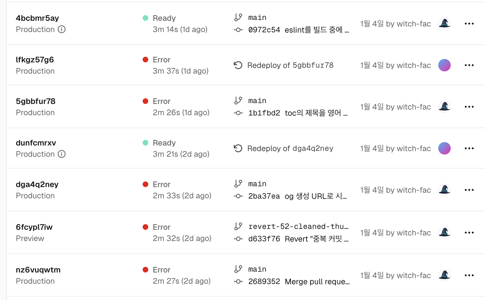
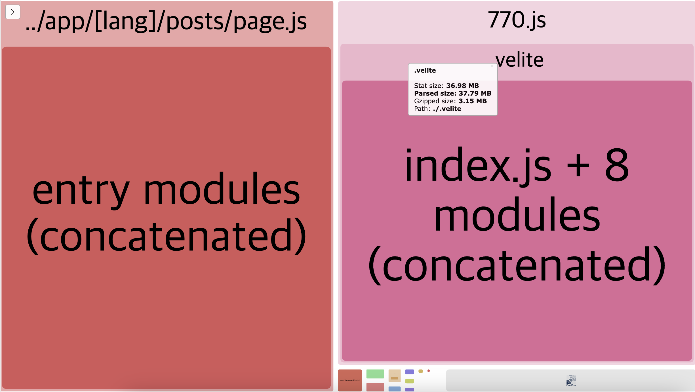
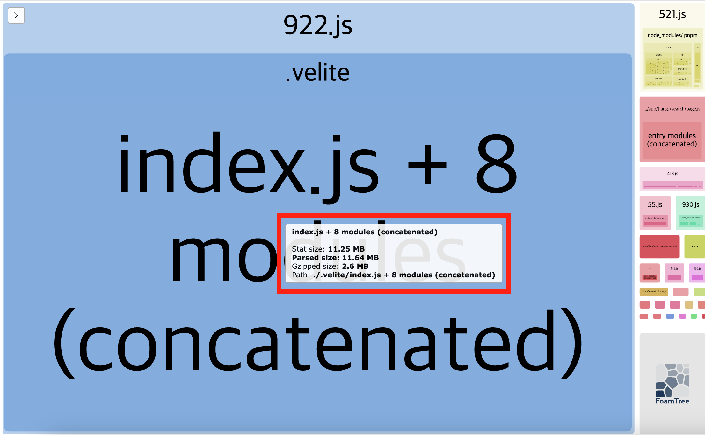
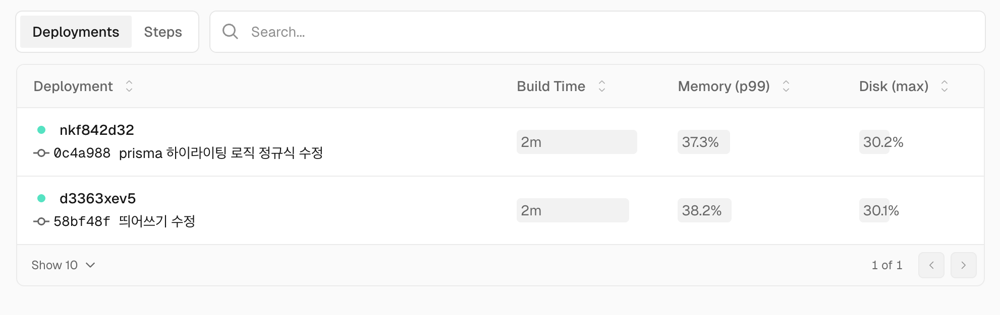

# 시작

1월에 블로그 번들 사이즈를 줄이기 위한 작업을 진행하였는데 이제서야 그 과정을 정리해 남긴다.

이 블로그는 Vercel을 통해서 배포되고 있다. 그런데 1월의 어느 날부턴가 블로그 배포가 자꾸 실패하기 시작했다.



배포의 로그를 들어가 보면 SIGKILL 오류와 함께 빌드가 실패한다. 뭔가 문제가 생긴 것 같다.

```bash
Error: Command "pnpm run build" exited with SIGKILL
```

[마침 Vercel에서 이에 관한 글을 올렸었다.](https://vercel.com/guides/troubleshooting-sigkill-out-of-memory-errors) 이를 보면 Vercel의 빌드 컨테이너에서는 8GB의 메모리를 할당해 주는데 프로젝트가 이를 초과하는 메모리를 사용하면 SIGKILL 오류로 빌드가 실패한다고 한다.

Vercel Observability의 Build Diagnostics을 보니 확실히 빌드 시 메모리 사용량이 (빌드가 성공할 때조차도) 80~90%로 치솟고 있었다.

블로그에서 영어 버전을 지원하기 시작하면서 페이지가 약 650개 정도로 늘었는데 이것 때문인 듯 하다. 이후 블로그가 더 커지면 빌드가 더 어려워질 것 같다. 따라서 이 문제를 해결해 보기로 했다.

위의 Vercel 글을 보면 가능한 여러 원인들을 써놨지만 결국 대부분 너무 큰 데이터를 핸들링하는 게 문제라고 한다. 그래서 번들 사이즈를 줄여보고자 했고, 결과적으로 코드 하이라이팅과 검색 페이지가 문제라는 결론을 내고 여기서 늘어나는 번들 사이즈를 줄였다.

이에 그 문제까지 도달했던 과정과 해결까지 함께 적는다.

# 앞선 시도들

## 번들 분석 도구

Next.js에서는 번들 사이즈를 분석할 수 있는 도구를 제공한다. [공식 문서](https://nextjs.org/docs/app/building-your-application/optimizing/package-bundling)를 참고해서 해보자.

먼저 next 번들 분석기를 설치하자.

```bash
pnpm add @next/bundle-analyzer
```

그리고 next.config.js에 다음과 같이 설정을 추가한다.

```js
const withBundleAnalyzer = require('@next/bundle-analyzer')({
  enabled: process.env.ANALYZE === 'true',
});

module.exports = withBundleAnalyzer(nextConfig)
```

이제 다음과 같이 빌드를 실행하면 번들 분석 결과를 볼 수 있다. 빌드가 완료되면 3개의 브라우저 탭이 떠서 번들 분석 결과를 보여준다. 

```bash
ANALYZE=true pnpm run build # 분석과 함께 빌드
```

나는 이후에도 자주 이런 분석을 실행할 거니까 `package.json`에도 명령어를 만들어줬다. 분석된 결과물을 실행하는 거까지 더해서 만들었다.

```json
{
  "scripts": {
    // ...
    "analyze": "ANALYZE=true pnpm run build && pnpm start"
  },
}
```

빌드가 완료되면 나오는 결과물은 대략 이런 모양이다.



현재 엄청난 비중을 차지하고 있는 항목들은 다음과 같다.

- `app/[lang]/posts/page.js`(검색 페이지)
  - parsed size: 39.2MB
  - gzipped size: 3.16MB
- velite(블로그의 컨텐츠 관리 시스템)에서 생성된 항목
  - parsed size: 38.7MB
  - gzipped size: 3.15MB

이것들을 어떻게든 줄여야 했다.

## 빌드 시 정적 검사 끄기

Next.js에서는 eslint와 typescript 검사를 빌드 시에 시행하고 관련 오류가 발생할 시 빌드를 멈춘다. 그런데 이런 정적 검사는 메모리를 많이 차지할 수 있다. 내 블로그 코드 사이즈가 그렇게 큰 편이 아니기 때문에 크게 의심이 가는 부분은 아니지만 일단 이걸 끄기로 했다.

next.config.js에 다음과 같이 설정을 추가하여 빌드 시에 eslint와 typescript 검사를 꺼보았다.

```js
const nextConfig = {
  // ...
  eslint: {
    ignoreDuringBuilds: true,
  },
  typescript: {
    ignoreBuildErrors: true,
  },
};
```

빌드에 걸리는 시간은 조금 빨라졌지만 번들 사이즈나 Vercel Observability로 확인한 빌드 메모리에는 큰 변화가 없었다.

## 패키지 최적화 옵션

모듈을 가져올 때 뭔가 문제가 생길지도 모른다 싶어서 실제로 사용하는 모듈만 가져오도록 하는 설정을 써봤다. `next.config.js`의 `experimental.optimizePackageImports`를 설정해본다.

```js
const nextConfig = {
  // ...
  experimental:{
    optimizePackageImports: ['react', 'react-dom'],
  }
};
```

다른 의존성 라이브러리들을 넣어보아도 크게 변하는 건 없었다.

## 문제 분석

뭔가 좀 더 근본적인 해결이 필요하겠다 싶어서 다시 생각해 보았다. 현재 번들 사이즈에서 가장 큰 용량을 차지하고 있는 건 뭘까? 블로그 글의 변환 데이터이다. `.velite`에 있는 데이터도, 검색 페이지에서 불러오는 데이터도 근본적으로는 블로그 글에서 온 데이터다.

그럼 블로그 글의 원래 용량은 얼마나 될까? 현실적으로 원래 마크다운으로 저장된 용량 이하로 줄이기는 어려우니까 원래 마크다운 파일이 차지하고 있는 용량을 알면 목표할 만한 수치를 어림잡을 수 있다.

블로그 글은 전부 `.md` 파일로 되어 있으므로 content 폴더에서 다음 명령어를 실행해서 현재 경로에 있는 마크다운 파일들의 크기를 모두 더한 결과를 KB 단위로 출력해보자.

```bash
$ find . -name "*.md" -exec du -k {} + | awk '{total+=$1} END {print total " KB"}'
7256 KB
```

약 7.09MB 정도이다. 따라서 변환된 결과를 줄임에 있어 실질적인 목표는 7MB 미만으로 가기는 힘들고(물론 부호화 등을 한다면 가능할 수 있겠지만 그렇게까지 할 필요는 없다고 생각한다) 최대한 그 근처까지 가는 걸 목표로 해볼 수 있겠다. 현재 40MB이므로 충분히 할 수 있으리라 믿는다.

중요한 건 eslint 같은 게 아니라 이 7MB정도의 용량을 40MB로 부풀린 이유를 찾고 그걸 해결하는 거였다. 의존성 라이브러리 용량 같은 건 이에 비하면 아무것도 아니었다.

# 검색 페이지 번들 사이즈 줄이기

## 고민

검색 페이지의 로직을 생각해 보면 현재는 기존의 모든 글 데이터를 불러와서 검색어를 포함하는 항목을 갖는 글 데이터를 모두 표시하는 식이었다. 이런 식이라면 검색 페이지의 번들 사이즈는 당연히 글 데이터 크기를 따라갈 수밖에 없다.

여기서 2가지 선택지를 생각할 수 있었다.

먼저 첫번째는 검색 로직을 서버로 옮기는 방법이다. 디바운싱 같은 걸 적용해서 검색어 변경에 대응해 적절히 검색 쿼리를 서버에 날리고 라우트 핸들러에서는 이걸 처리해서 응답을 보내는 식으로 짜볼 수 있다. 지금처럼 검색어 변경에 실시간으로 대응하는 게 아니라 검색을 form형태로 만들어서 "검색" 버튼을 눌러야 검색을 실행하도록 한다면, 검색 페이지를 서버 컴포넌트로 짜는 것까지도 가능하다.

하지만 이건 실패했다. 처음에 `flexsearch` 등의 라이브러리를 이용해 서버에서 검색을 실행하려고 했다. 그러나 이렇게 구현해 보니 서버 컴포넌트로 검색 페이지를 만들 수 있는 것까지는 좋았는데 너무 느렸다. Vercel에서 제공하는 라우트 핸들러가 이런 검색을 감당하기에는 너무 약한 듯 했다. algolia같은 검색 툴을 사용하는 방법도 있겠지만 이건 돈이 들었다.

두번째는 검색을 진행하는 데이터 자체를 줄이는 방법이다. 지금 블로그 글은 텍스트만 7MB가 넘는다. 내가 프론트엔드 개발자로서 이 검색을 최적화할 수 있을까? 내 기존 지식으로 하는 건 쉽지 않았다. 따라서 아예 글의 제목과 개요 정도만 검색되도록 하여 검색 페이지에서 다루어야 할 데이터 자체를 줄이기로 했다. 그러면 검색 페이지에서 필요로 하는 데이터는 각 글의 제목과 개요 그러니까 총 몇천 자 정도밖에 되지 않을 거라고 예상했다.

## 새로운 데이터 만들기

블로그 컨텐츠를 관리하는 velite 라이브러리에서, 새로운 데이터 스키마를 만들자. velite의 동작이 여기서 중요한 건 아니므로 '글의 내용이 아닌, 블로그 글에서 제목과 개요 등만 포함하고 있는 간단한 데이터 객체를 생성하도록 하는 구조를 만들었다'정도로 이해하면 좋겠다.

```js
export const metadataObject = s.object({
  slug: postSlug(),
  title: s.string().max(99),
  date: s.string().datetime(),
  description: s.string().max(200),
  thumbnail: s.object({
    local: s.string(),
    cloud: s.string().optional(),
    blurURL: s.string().optional(),
  }).optional(),
});

export const articleMetadataObject = metadataObject.extend({
  tags: s.array(s.string()),
});

export const articleMetadataSchema = defineSchema(() =>
  articleMetadataObject.transform((data) => ({ ...data, url: `/posts/${data.slug}` })),
);
```

그리고 velite 설정 파일에서 이 스키마를 이용해 `.md` 파일에서 데이터를 생성하도록 하자.

```js
const postMetadata = defineCollection({
  name: 'PostMetadata', // collection type name
  pattern: 'posts/**/*.md', // content files glob pattern
  schema: articleMetadataSchema(),
});

// 이후 postMetadata Collection을 defineConfig를 통해 velite 설정에 추가하면 된다
```

## 검색 페이지에 적용

그리고 검색 페이지에서 이 데이터를 이용하도록 하자. 현재 검색 페이지에서 사용하는 검색 데이터는 `getSearchPosts`라는 함수가 담당하고 있었다. 이 함수에서 리턴하는 데이터를 검색어를 이용해 필터링한 게 검색 결과였다. 상식적인 검색 로직이라고 생각하기 때문에 자세한 설명은 생략하겠다.

그러니 `getSearchPosts`에서 리턴하는 데이터를 전체 글 데이터에서 `PostMetadata`로 바꾸기만 하면 된다.

```js
// 변경 이전
export const getSearchPosts = (lang: Locale = 'ko') => {
  const allPosts = sortByDate([...(lang === 'ko' ? posts : enPosts)]);
  return allPosts.map((post) => searchProperty(post));
};

// 변경 이후
export const getSearchPosts = (lang: Locale = 'ko') => {
  const allPosts = sortByDate([...(lang === 'ko' ? postMetadata : enPostMetadata)]);
  return allPosts.map((post) => searchProperty(post));
};
```

아쉽지만 이제 블로그의 검색 페이지에서 글 내용을 통한 검색은 불가능해졌다. 오직 글의 제목과 개요만으로 검색할 수 있다. 하지만 번들 사이즈는? 무려 500KB 미만으로 줄었다.

# 코드 하이라이팅 최적화

이제 블로그 글을 변환한 데이터 사이즈를 줄일 차례다. 사실 검색 페이지의 번들 사이즈도 이 변환 데이터 사이즈를 따라가는 문제일 뿐이었고 이게 진짜 문제다. 7MB의 데이터가 40MB로 변하는 이걸 막기 위해 뭘 할 수 있을까?

## 문제 분석

블로그 컨텐츠 관리에 내가 쓰고 있는 velite(메이저한 라이브러리는 아니다. 궁금하면 내가 쓴 [정적 컨텐츠를 쉽게 다룰 수 있게 해주는 velite를 알아보자](https://witch.work/ko/posts/velite-library-introduction)를 참고할 수 있다)는 블로그 글의 데이터를 `.json`으로 변환해 관리한다.

그러나 그대로 JSON에 집어넣는 건 아니다. 코드 하이라이팅도 해야 하고, LaTeX 문법 같은 것도 변환해 줘야 하고 목차도 만들어줘야 한다. 이건 remark, rehype 플러그인들이 담당하고 있다. 이 플러그인들이 코드 하이라이트, LaTeX 등을 페이지에서 표시할 수 있는 형태로 변환해준다. 이 과정에서 용량이 늘어난 걸 강력히 의심했다.

velite 설정에서 플러그인들을 하나하나 끄고 빌드해 보면서 어떤 플러그인이 번들 사이즈를 가장 늘리는지를 체크해 보았다. 코드 하이라이팅에 관련된 rehype 플러그인을 꺼봤더니 번들 사이즈가 7.2MB정도로 줄었다. 이 정도면 거의 원본 사이즈에 가깝다.

좀 더 검토해 보니 rehype-pretty-code 플러그인이 문제였다. 이 플러그인은 내가 사용하는 모든 테마 색상을 전부 인라인 스타일로 써넣는다. 나는 블로그에서 4개의 테마를 사용하고 있어서 하이라이팅된 키워드가 이런 식으로 표현된다.

```html
<span style="--shiki-light:#E36209;--shiki-pink:#001080;--shiki-dark:#FFAB70;--shiki-darkPink:#FFAB70">index</span>
```

그 이외에도 rehype-pretty-code에서 비효율적으로 들어가는 css 속성들이 좀 있었다. 가령 같은 태그로 감싸서 하이라이팅해줄 수 있는 키워드인데도 단어 하나하나마다 하이라이트를 위한 태그가 들어가는 식이었다.

하지만 그렇다고 기술 블로그에서 코드 하이라이팅을 안 할 순 없다. 코드 예시가 한두개도 아니고. 그러니 코드 하이라이팅을 지원하는 다른 rehype 플러그인인 rehype-highlight를 써보기로 했다. 이걸 사용하여 빌드해 보니 velite 변환 결과물의 사이즈가 11~12MB 정도가 되는데 굉장한 절감이다. 빌드에 걸리는 시간도 50% 이상 줄었다.

rehype-highlight가 장점만 있는 건 아니다. hightlightjs는 정규식 기반으로 동작하기 때문에 코드 하이라이팅이 상대적으로 덜 정확하거나 제대로 들어가지 않을 때가 있다.

예를 들어서 C언어의 신택스 하이라이팅 같은 경우 `#include`가 하나의 키워드라고 할 수 있겠다. 하지만 왜인지 `#`와 `include`가 따로 표시된다. 또한 bash 언어의 하이라이팅도 부족하다 느껴진다. 단순히 코드 하이라이팅을 잘해주는지만 놓고 보았을 때 rehype-pretty-code에 비해 rehype-highlight가 부족한 점은 아주 많다.

하지만 번들 사이즈가 너무 커서 지금 빌드가 터지고 있는데, 이에 비하면 큰 문제는 아니라고 생각한다. 키워드에 관한 하이라이팅은 잘 된다. 또 기술 블로그는 컨텐츠가 중요하지 코드 하이라이팅이 조금 부정확해도 보는 데에 문제는 없다고 생각한다. 그러니 이를 적용해보자.

## rehype-highlight 적용하기

먼저 velite 설정 파일에서 rehype-pretty-code 대신 rehype-highlight를 적용한다.

```js
export default defineConfig({
  // ...
  // 마크다운 변환에 적용할 플러그인을 적는 영역
  markdown: {
    remarkPlugins: [remarkMath, remarkHeadingTree],
    rehypePlugins: [
      // [rehypePrettyCode, rehypePrettyCodeOptions],
      rehypeKatex,
      [rehypeHighlight],
    ],
  },
  // ...
});
```

rehype-highlight는 정규식 기반으로 하이라이팅할 키워드 등을 찾아서 적절한 클래스를 가진 `<span>`으로 감싸준다. 예를 들어 코드블럭에 문자열이 있는 경우 이런 식으로 변환한다.

```html
<span class="hljs-string">'use client'</span>
```

그래도 아직 하이라이팅이 되지는 않는다. 해당 클래스들에 어떤 색상을 줄지 정해지지 않았기 때문이다. 이는 [highlight.js의 styles 폴더에 있는 코드 스타일 테마들](https://github.com/highlightjs/highlight.js/tree/main/src/styles)을 가져옴으로써 해결할 수 있다. 링크에 있는 css 파일에는 각 클래스에 대한 색상 css가 정의되어 있다.

나는 블로그가 어떤 테마인지에 따라 코드 하이라이팅에 다른 테마를 사용해야 했으므로 블로그 테마에 따라 적절한 테마의 하이라이팅이 적용되도록 약간의 가공을 거쳤다. 예를 들어 light 테마일 때 쓰는 css 파일은 이렇게, `lightTheme` 클래스 하위에서만 동작하도록 했다. 이런 파일들은 `src/styles/syntax` 폴더에 두었다.

```js
// src/styles/syntax/github-light.css.ts
globalStyle(`
  ${lightTheme} .hljs`,
{
  color: '#24292e',
});

globalStyle(`
  ${lightTheme} .hljs-doctag, 
  ${lightTheme} .hljs-keyword, 
  ${lightTheme} .hljs-meta .hljs-keyword, 
  ${lightTheme} .hljs-template-tag, 
  ${lightTheme} .hljs-template-variable, 
  ${lightTheme} .hljs-type, 
  ${lightTheme} .hljs-variable.language_`,
{
  color: '#d73a49',
});

// ...
```

light 테마에는 github-light, dark 테마에는 github-dark, pink 테마에는 panda-syntax-light, darkPink 테마에는 panda-syntax-dark 테마를 사용했다.

하지만 아직도 문제가 있다. JavaScript 같은 언어들은 하이라이팅이 잘되는데 몇몇 언어가 제대로 신택스 하이라이팅이 되지 않았다.

알고 보니 rehype-highlight는 37개의 기본 언어를 지원하며 이외의 언어의 하이라이팅을 하려면 [lowlight](https://github.com/wooorm/lowlight)의 기능을 가져와야 했다. lowlight에서 지원하는 언어 목록은 [여기](https://github.com/wooorm/lowlight?tab=readme-ov-file#data)에서 볼 수 있다.

블로그 글에 쓰인 프로그래밍 언어들 중 어떤 언어가 하이라이팅이 안 되고 있는지 전부 조사하였다. 내 블로그 글의 코드 예시에서 쓰인 언어들 중에서 rehype-highlight에서 지원하는 37가지 언어를 벗어난 것은 lisp, nginx, dockerfile, prisma였다. 물론 nginx, dockerfile 같은 건 프로그래밍 언어가 아니지만 신택스 하이라이팅이 되면 좋은 건 사실이니까 사소한 부분은 넘어가도록 하자.

아무튼 lisp, nginx, dockerfile은 다행히 lowlight에서 지원한다. 따라서 [rehype-highlight의 registering 항목](https://github.com/rehypejs/rehype-highlight?tab=readme-ov-file#example-registering)을 참고하여 rehype-highlight에 언어 문법 패키지를 등록해 주면 된다.

lowlight, highlight.js의 파일들을 가져와서 적용하기 위해 먼저 두 라이브러리를 설치한다.

```bash
pnpm add -D lowlight highlight.js
```

그리고 앞서 언급한 언어들을 rehype-highlight 옵션에 등록한다.

```js
// velite.config.ts
import {common} from 'lowlight'
import lisp from 'highlight.js/lib/languages/lisp';
import nginx from 'highlight.js/lib/languages/nginx';
import dockerfile from 'highlight.js/lib/languages/dockerfile';

const rehypeHighlightOptions ={
  languages:{
    ...common, 
    lisp,
    nginx,
    dockerfile
  }
}

export default defineConfig({
  // ...
  // 마크다운 옵션에 rehype-highlight 옵션 추가
  markdown: {
    remarkPlugins: [/* remark 플러그인들 */],
    rehypePlugins: [
      // ...
      [rehypeHighlight, rehypeHighlightOptions],
    ],
  },
});
```

## prisma 하이라이팅 추가하기

하지만 prisma 문법 하이라이팅은 lowlight에서 지원하지 않는다. 찾아보니 [prisma의 하이라이팅을 highlight.js에 추가해 달라는 이슈](https://github.com/prisma/prisma/issues/2337)가 prisma에 올라와 있기도 했다.

하지만 [highlight.js에서는 더 이상 언어 추가 요청을 받지 않는다.](https://highlightjs.readthedocs.io/en/latest/language-requests.html) 원한다면 내가 직접 하이라이팅을 위한 구현을 짜서 서드파티로 만들어야 한다. prisma와 highlight.js의 이슈를 살펴봐도 특별한 진전은 없는 듯 하여 prisma의 하이라이팅을 rehype-highlight를 이용해서 하려면 직접 플러그인을 제작해야 할 것 같았다.

쉽게 할 수 있는 작업은 아니어 보인다. 하지만 이걸 하면 번들 사이즈가 무려 70%, 40MB에서 12MB로 줄어들 수 있다. 이걸 안 하고 넘어가기에는 아쉬운 마음이 너무 크다. 그러니 해보도록 하자. 나는 뭐든 끝까지 가보는 게 중요하다고 생각한다. 이러한 사고방식에 대해서는 내가 쓴 [탐구의 기술 - with문에 대한 문장 하나에서 MDN에 기여하고 논문을 읽어보기까지](https://witch.work/ko/posts/javascript-dance-with-with-statement) 등에 약간 써놓았다.

다행히 prisma의 이슈에 보니 내 작업에 도움이 될 만한 자료들이 있었다. 이를테면 [Prisma vscode 익스텐션에서 사용하는 신택스 파일](https://github.com/prisma/language-tools/tree/main/packages/vscode/syntaxes)과 같은 것들 말이다.

그리고 highlight.js에서는 다음과 같은 자료를 참고할 수 있었다.

- [언어 정의 가이드](https://highlightjs.readthedocs.io/en/latest/language-guide.html)
- [언어 기여자 체크리스트](https://highlightjs.readthedocs.io/en/latest/language-contribution.html)
- [서드파티 기여 가이드](https://github.com/highlightjs/highlight.js/blob/main/extra/3RD_PARTY_QUICK_START.md)
- [`src/language` 폴더의 다른 언어 문법 정의들](https://github.com/highlightjs/highlight.js/tree/main/src/languages)

Prisma를 주로 쓰는 것도 아니었고 highlight.js의 유틸리티도 잘 몰라서 고생을 많이 했다. 하지만 이 글의 핵심은 아니기에 빠르게 넘어가자. 대략 이런 식으로 키워드를 매칭해 주는 정규식들을 작성하고 넣어준 함수 파일을 `src/bin/prisma-highlight.js`에 작성했다.

```js
// src/bin/prisma-highlight.js

/** @type LanguageFn */
export default function highlight(hljs) {
  // ... 생략 ...
  const NUMBER = {
    scope: 'number',
    match:
      /((0(x|X)[0-9a-fA-F]*)|(\+|-)?\b(([0-9]+(?:\.[0-9]*)?)|(\.[0-9]+))((e|E)(\+|-)?[0-9]+)?)(?:[LlFfUuDdg]|UL|ul)?\b/,
  };

  // ... 생략 ...

  const MODEL_BLOCK_DEFINITION = {
    begin: [/(model|type|view)/, /\s+/, /([A-Za-z][\w]*)/, /\s*/, /({)/],
    beginScope: {
      1: 'keyword',
      3: 'title.class',
      5: 'punctuation',
    },
    end: /\s*}/,
    endScope: 'punctuation',
    contains: [COMMENTS, FIELD_DEFINITION, ATTRIBUTE_WITH_ARGUMENT, ATTRIBUTE],
  };

  return {
    name: 'Prisma schema language',
    case_insensitive: true,
    keywords: {
      keyword: KEYWORDS,
      type: TYPES,
      literal: ['true', 'false', 'null'],
    },
    contains: [
      COMMENTS,
      MODEL_BLOCK_DEFINITION,
      CONFIG_BLOCK_DEFINITION,
      ENUM_BLOCK_DEFINITION,
      TYPE_DEFINITION,
    ],
  };
}
```

이러한 플러그인 작성이 정말로 필요하다면 위의 가이드들과 내 블로그의 [src/bin/prisma-highlight.js](https://github.com/witch-factory/witch-next-blog/blob/main/src/bin/prisma-highlight.js) 파일을 참고할 수 있다.

그리고 velite에서 사용하는 rehype-highlight 옵션에 등록해 주면 된다.

```js
import prisma from '@/bin/prisma-highlight'

const rehypeHighlightOptions ={
  languages:{
    ...common, 
    lisp,
    nginx,
    dockerfile,
    // 내가 만든 prisma가 추가됨
    prisma
  }
}

// 나머지는 동일하다
```

자 그럼 어떨까? Prisma 신택스 하이라이팅은 잘 될까? `enum` 같은 부분에서 문제가 있지만 일단 다음과 같은 간단한 스키마는 잘 하이라이팅되는 걸 바로 아래에서 볼 수 있다. 이건 간단한 prisma 스키마 예시다.

```prisma
// Prisma 스키마 정의
generator client {
  provider = "prisma-client-js"
}

datasource db {
  provider = "postgresql"
  url      = env("DATABASE_URL")
}

model User {
  id        Int       @id @default(autoincrement())
  email     String    @unique
  name      String?
  posts     Post[]
  profile   Profile?
  createdAt DateTime  @default(now())
  updatedAt DateTime  @updatedAt
}
```

번들 사이즈는 어떨까? 다시 한번 `pnpm analyze`를 실행해 보자. 검색 페이지의 번들 사이즈는 500KB 미만으로 줄어들었고, 블로그 글의 변환 데이터는 11.64MB 정도로 줄어들었다. 이 정도면 충분히 만족할 만한 결과라고 생각한다.



이제 빌드가 여유롭게 마무리된다. 메모리 사용량도 40% 미만으로 줄어들었다.



그리고 이왕 서드파티를 만들었으니 아예 하이라이팅을 위한 코드의 레포지토리도 분리해서 공개했다. [highlightjs-prisma라는 이름으로 별도 레포](https://github.com/witch-factory/highlightjs-prisma)를 만들었고 따로 사용할 수 있도록 구성해두었다.

실제로 필요한 분이 있을지는 모르겠지만, 나와 비슷한 이슈를 겪거나 highlightjs로 prisma를 하이라이팅하고 싶은 분들께 도움이 되면 좋겠다.

# 결론

빌드 시 너무 많은 메모리를 사용하여 빌드가 SIGKILL로 종료되는 문제를 해결하기 위해 번들 사이즈를 줄이는 작업을 해보았다.

검색 페이지 구조 개선, 코드 하이라이팅 플러그인 변경, 불필요한 데이터 제거 등을 통해 번들 사이즈를 약 40MB(심지어 검색 페이지까지 고려하면 이 2배)에서 총 12MB 정도로 줄일 수 있었다.

고생스러웠다. 새로운 데이터 객체를 만들어야 했고 highlight.js 사용법은 물론이고 서드파티까지 새로 만들어야 했다. 하지만 블로그 빌드는 이제 여유롭고 이전보다 훨씬 빠르게 돌아간다.

기능상에서 잃은 점도 거의 없다. rehype-pretty-code가 제공하는 기능이 훨씬 많기는 했지만 어차피 내 블로그에서는 그런 것들을 쓰고 있지도 않았기에 상관 없다. 그럼, 내가 고생한 이 과정이 누군가에게 작은 도움이 되었길 바란다.

# 참고

Troubleshooting Builds Failing with SIGKILL or Out of Memory Errors

https://vercel.com/guides/troubleshooting-sigkill-out-of-memory-errors

Next.js docs, Optimizing Package Bundling

https://nextjs.org/docs/app/building-your-application/optimizing/package-bundling

Next.js docs, optimizePackageImports

https://nextjs.org/docs/app/api-reference/config/next-config-js/optimizePackageImports

How we optimized package imports in Next.js

https://vercel.com/blog/how-we-optimized-package-imports-in-next-js

lowlight README의 css 섹션

https://github.com/wooorm/lowlight?tab=readme-ov-file#css

rehype-highlight README

https://github.com/rehypejs/rehype-highlight?tab=readme-ov-file

prisma issue #2337, Add Prisma syntax to highlight.js 

https://github.com/prisma/prisma/issues/2337

