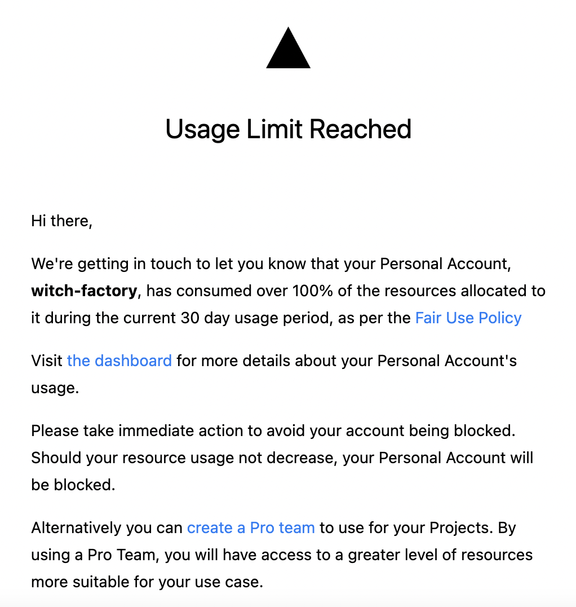
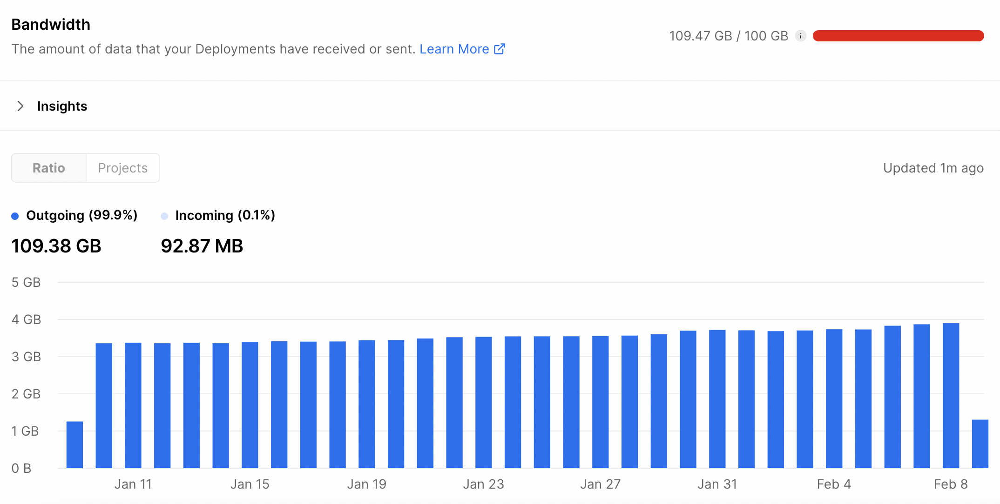
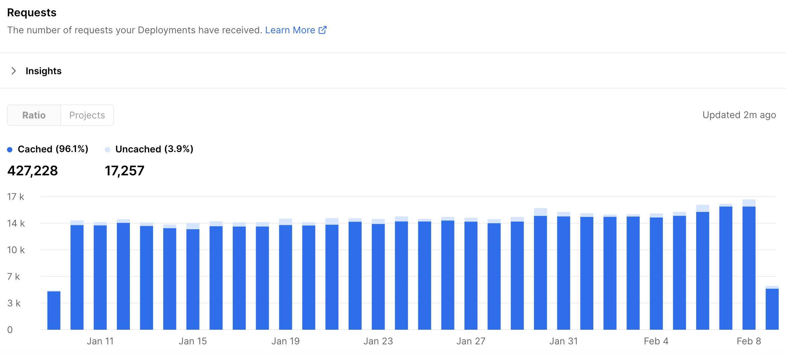
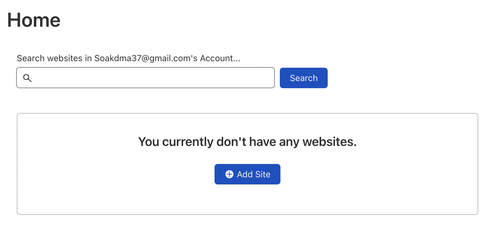

# 1. Bandwidth 한도 초과

현재 이 블로그는 Vercel을 통해 정적 페이지로 배포되어 있다. 그런데 최근에 내 블로그가 자원을 너무 많이 쓰고 있다는 메일이 오고 있다.

내 블로그에서 자원을 많이 쓰고 있다고? 싶어서 dashboard에 들어갔다.

내 블로그 프로젝트에서 Bandwidth를 확인해보니 109GB정도나 되는 데이터를 주고받고 있었다. 

bandwidth는 내가 배포한 사이트가 주고받은 데이터의 양을 뜻한다. [출처](https://vercel.com/docs/concepts/limits/usage#bandwidth) 내 블로그 bandwidth의 대부분은 outgoing이었는데 이는 내 사이트가 유저에게 보낸 데이터의 양을 뜻한다. 하루에 약 3기가의 데이터가 사용자들에게 전달되고 있었다.

그리고 하루에 약 13,000~15,000개의 요청이 사이트에 전달되고 있었다. 블로그를 나름 열심히 한다고 했지만 이 정도의 요청을 받을 곳은 아닌데, 뭔가 문제가 있는 듯 했다.

하지만 로그도 볼 수 없고 뭐 할 수 있는 게 없어서 일단 bandwidth를 줄인 다음 구글 애널리틱스를 달아서 이후의 분석을 진행하려고 한다.

[이 글](https://medium.com/@capJavert/save-bandwidth-on-vercel-with-cloudflare-462bec444865)을 참고하여 bandwidth를 줄여보자.

# 2. 문제

위에서 Request를 보면 무려 95.6%가 캐싱된 요청이고 4.4%가 캐시되지 않은 요청이다.

이 캐시는 [Vercel Edge Network](https://vercel.com/docs/concepts/edge-network/overview#caching)라는 곳에서 관리하는데 배포된 내 사이트와 인터넷 사이에 있다. CDN이라고 생각하면 된다.

그리고 이 Edge Network는 캐싱 역할도 하여 만약 유저가 요청한 데이터가 Edge에 저장되어 있다면 바로 전달해주고, 저장되어 있지 않다면 내 사이트로 요청을 보내고 받은 데이터를 Edge에 저장한다.

아무튼 내 블로그에 오는 요청 중 95.6%가 Vercel Edge Network에 저장되어 있는데, 문제는 Vercel이 캐싱된 요청이든 캐싱되지 않은 요청이든 무조건 Bandwidth에 포함시킨다는 것이다. 

# 3. Cloudfare를 프록시로 사용하기

그런데 Cloudflare에서는 더 관대한 프리티어를 제공하고 있었다. 사실상 Bandwidth 제한이 없으며 특별히 이슈가 발생할 정도의 트래픽이 발생하면 연락이 온다고 한다. [20TB정도 사용해도 연락이 안 올 거라고 한다.](https://community.cloudflare.com/t/cdn-bandwidth-limits/300965/3)

따라서 Vercel 배포의 프록시로 cloudflare를 사용하기로 했다. [튜토리얼 페이지](https://developers.cloudflare.com/fundamentals/get-started/setup/)에서 모든 것을 친절하게 알려주고 있었다.

## 3.1. 회원가입

[회원가입 페이지](https://dash.cloudflare.com/sign-up)에서 회원가입을 하자.

## 3.2. 사이트 추가하기

나는 witch.work 도메인을 가지고 있다. 먼저 이 도메인의 네임서버를 cloudfare로 바꿔준다. [여기](https://developers.cloudflare.com/fundamentals/get-started/setup/add-site/)서 시키는 대로 했다.

먼저 dashboard에서 사이트를 추가한다.

Add site를 누르고 내 페이지의 루트 도메인(나같은 경우 witch.work)를 입력한다. 그리고 plan을 고르라고 하는데 나는 돈이 없으므로 Free를 선택했다.

그러면 자동으로 Cloudfare가 내 도메인의 DNS 레코드를 검사한다. 대충 루트 도메인과 서브도메인이 다 나오면 continue한다. 수동으로 DNS 레코드를 더해 줘야 할 때도 있다는데 나는 잘 되어서 그냥 했다.

## 3.3. 네임서버 변경

나는 goDaddy에서 도메인을 구입해서 사용하고 있으므로 goDaddy에서 네임서버를 변경해 주었다.

여기서 DNS에 들어가서 스크롤을 내리면 네임서버를 변경할 수 있다. cloudflare에서 제공하는 네임서버를 입력하고 저장한다.

시간이 좀 걸린다. 한 15분 정도 기다리자 내 사이트가 cloudflare Free plan에 잘 들어갔다는 메일이 왔다.

그 다음 [여기](https://vercel.com/guides/using-cloudflare-with-vercel#with-proxy)에서 시키는 대로, cloudflare dashboard에서 SSL/TLS 설정에 들어가서 overview에서 ssl/tls encryption을 full로 바꿔준다.

내가 본 글에서는 캐시 설정까지 하는데, 이 캐시 설정은 그새 Cloudflare에서 유료 제공으로 바뀌었다..따라서 프록시만 설정했다. 이게 Bandwidth 줄이기에 도움이 되는지는 추적관찰 예정이다.

# 참고

https://vercel.com/guides/lower-usage#bandwidth-usage

https://vercel.com/guides/using-cloudflare-with-vercel#with-proxy

https://medium.com/@capJavert/save-bandwidth-on-vercel-with-cloudflare-462bec444865