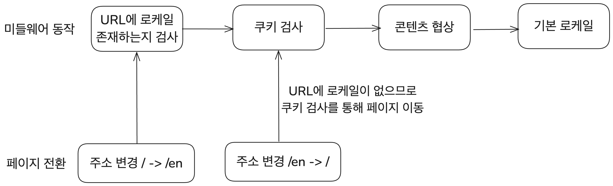
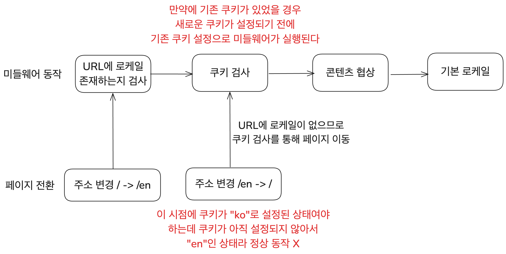
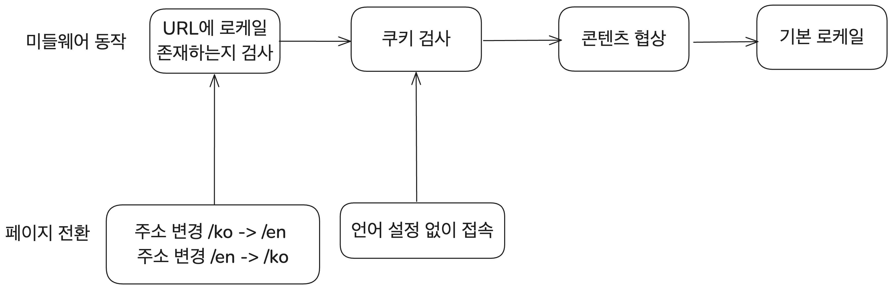

# 시작

전 세계의 사람들에게 내 블로그의 콘텐츠를 제공하고 싶다는 생각이 들었다. 언어의 장벽 때문에 내가 열심히 쓴 글이 제한된 독자들에게만 닿을 수 있다는 데 대한 아쉬움이 컸기 때문이다.

그래서 [이전 글](https://witch.work/posts/blog-auto-translation)에서 AI 번역을 통해 영어로도 볼 수 있는 블로그를 만들었다. AI 번역이므로 다른 언어로 콘텐츠를 제공하는 것도 약간의 코드 추가로 가능해졌다. 하지만 단순히 영어 컨텐츠가 존재하는 것을 넘어서 사용자가 접속한 클라이언트의 설정 언어에 따라 적절한 언어로 컨텐츠를 보여주면 좋겠다.

따라서 이 글에서는 이전 글에 이어서, Next.js의 기능들을 이용해 사용자의 선호 언어에 맞는 페이지를 보여주는 기능을 구현하는 과정을 다룬다. 덧붙여 검색 엔진이 다국어 페이지를 인식하도록 SEO까지 고려하겠다. 이 과정의 최종 결과물만 보여줄 수도 있지만 개발 과정에서 겪었던 고민과 타협들이 결과에도 많은 영향을 미쳤기에 그 과정까지 함께 공유하고자 한다.

# 1. 요구사항과 설계

사용자에게 적절한 언어로 콘텐츠를 보여주기 위해 어떤 요구사항이 있을까? 그리고 이를 어떻게 구현할 수 있을까? 요구사항을 정리하고 구체적인 구현에 대해 고민하는 과정을 먼저 가졌다.

## 1.1. 요구사항 정리

가장 본질적인 요구사항은 단순하다.

- 사용자가 사용하는 언어에 따라 적절한 언어로 컨텐츠를 보여준다.

이를 위해 브라우저가 HTTP 요청에 담아 전달하는 `Accept-Language` 헤더를 활용할 수 있다. 이 헤더는 클라이언트가 선호하는 언어를 나타내기 때문에 기본 언어를 결정하는 데 유용하다. 하지만 이 접근법에는 한계가 있다. `Accept-Language`는 브라우저 설정에 기반할 뿐, 사용자가 실제로 능숙하거나 선호하는 언어를 정확히 알 수 있는 방법은 아니다.

브라우저 설정과 사용자의 실제 선호 언어가 다른 경우는 얼마든지 있을 수 있다. 예를 들어 여행 중이라 우연히 한국어로 설정된 브라우저를 사용하고 있을 수 있다. 따라서 다음 요구사항도 필요하다.

- 사용자가 직접 선택한 언어를 우선한다.
  - 이 선택은 클라이언트가 기억하여 다음 방문 시 유지되도록 한다.

여기서 사용자의 언어 선택이란 다양한 경우를 포함할 수 있다.

1. `/en` 또는 `/ko`처럼 언어 정보가 포함된 URL로 접속한 경우
2. 언어 전환 UI를 통해 언어를 선택한 경우

하지만 2번, 언어 전환 UI를 통한 언어 선택이 사용자의 더 직접적인 선택에 가깝다고 보고 이것만을 클라이언트에 기억하도록 하기로 했다. 물론 1번의 경우에도 이후의 코드들을 이용하면 쉽게 클라이언트에 기억시킬 수 있다.

아무튼 이러한 요구사항을 감안하여 구현을 생각해 보자.

## 1.2. 구현 설계

앞선 요구사항을 구체화해보자. 

사용자가 언어 선택 UI를 통해 언어를 선택한 것은 쿠키를 통해 기억하도록 하고 이를 우선시하자. 그리고 앞서 논의한 다른 사항들을 반영한 언어 결정의 우선순위는 다음과 같다.

1. URL에 언어 정보가 있다면 이를 사용
2. 쿠키에 사용자의 언어 정보가 있다면 이를 사용
3. `Accept-Language` 헤더에 있는 사용자 설정 언어를 사용
4. 기본 언어(여기서는 한국어)를 사용

그렇다면 사용자가 언어 전환 UI를 통해 언어를 변경할 경우 어떤 동작이 필요할까? 다음과 같은 방식으로 처리하도록 설계했다.

1. 쿠키에 새로운 언어 정보를 저장
2. 새로운 언어 콘텐츠가 담긴 URL로 리다이렉트

이를 구현하려면 문제가 하나 있다. 쿠키는 기본적으로 서버가 브라우저에 전달하는 정보이기 때문에 클라이언트 측에서 직접 설정하기는 어렵다. 이를 해결하기 위해 Next.js의 라우트 핸들러를 사용한다.

라우트 핸들러는 다음과 같은 작업을 수행한다.

1. 쿼리스트링을 통해 전달된 새 언어 정보를 쿠키에 저장
2. referer 헤더 정보 + 새 언어 정보를 이용해 언어에 적절한 URL을 생성
3. 생성된 URL로 리다이렉트 응답을 반환

이렇게 라우트 핸들러와 미들웨어의 동작을 설계해봤으니 첫번째 구현을 해보자.

# 2. 라우트 핸들러 구현

바로 전에 설계했던 대로의 작업을 하는 라우트 핸들러부터 구현해보자. 필요한 정보를 가져오는 것부터 시작해서 이를 가공해서 사용하는 것까지 해볼 것이다.

## 2.1. 필요한 정보를 가져오기

`src/[lang]/api/language/route.ts`에 라우트 핸들러를 구현해보자. 이 핸들러는 `/api/language?locale=ko`와 같은 URL의 GET 요청을 받아, 설계대로 동작하도록 만들 것이다.

그럼 먼저 이를 위해 필요한 정보들을 가져오는 것부터 구현해보자. 설계한 동작의 구현을 위해 필요한 정보는 `locale` 쿼리스트링과 `referer` 헤더 정보이다.

쿼리스트링은 [URL Query Parameters](https://nextjs.org/docs/app/building-your-application/routing/route-handlers#url-query-parameters)를 이용해서 가져올 수 있다. `referer` 헤더 정보는 Next.js의 `headers()` 함수를 이용해서 가져온다.

참고로 [headers](https://nextjs.org/docs/app/api-reference/functions/headers) 함수는 Next.js 15부터는 비동기로 바뀌었으므로 `await`을 붙여서 써줘야 한다. 하지만 내 블로그는 아직 Next.js 14를 사용하고 있으므로 그냥 동기함수로 사용해 주었다.

```typescript
// src/[lang]/api/language/route.ts
export function GET(request: NextRequest) {
  const searchParams = request.nextUrl.searchParams;
  const selectedLocale = searchParams.get('locale') as Locale | undefined;

  // 유효하지 않은 로케일이면 406 Not Acceptable 에러
  if (!selectedLocale || !i18n.locales.includes(selectedLocale)) {
    return NextResponse.json(
      { error: 'Invalid locale' },
      { status: 406 },
    );
  }

  const headersList = headers();
  const referer = headersList.get('referer');

  return new Response(JSON.stringify({ selectedLocale, referer }), {
    headers: {
      'Content-Type': 'application/json',
    },
  });
}
```

이렇게 하고 해당 라우트 핸들러에 요청을 보내면 `referer` 헤더와 `locale` 쿼리스트링을 가져와서 JSON 형태로 반환하는 걸 확인할 수 있다.

## 2.2. 라우트 핸들러 동작 구현

이제 설계한 라우트 핸들러의 핵심인, 쿼리스트링으로 전달된 로케일을 쿠키에 저장하고 리다이렉트할 URL을 만드는 동작을 구현해야 한다. 이를 위해 현재 경로와 선택한 로케일을 기반으로 적절한 URL을 반환하는 `generateRedirectPath` 함수를 작성하자.

규칙은 다음과 같다. 기본 로케일의 경우 이후 미들웨어에서 `rewrite`를 사용하도록 할 것이므로 언어 정보를 URL에 추가하지 않는다.

1. URL에 언어 정보가 없다면 추가(예: `/posts` -> `/en/posts`)
2. URL에 언어 정보가 있다면 전달된 언어로 교체(예: `/ko/posts` -> `/en/posts`)
3. 기본 로케일(여기서는 `ko`)의 경우 언어 정보를 URL에 추가하지 않음(예: `/ko/posts` → `/posts`)

아래는 함수를 구현한 코드이다.

```typescript
// src/utils/generateRedirectPath.ts
export const i18n = {
  defaultLocale: 'ko',
  locales: ['ko', 'en'],
} as const;

export type Locale = (typeof i18n)['locales'][number];

function generateRedirectPath(pathname: string, selectedLocale: Locale) {
  const pathSegments = pathname.split('/').filter(Boolean); // 경로를 '/'로 나누고 빈 값 제거
  const currentLangIndex = i18n.locales.includes(pathSegments[0] as Locale) ? 0 : -1;

  // 경로에 언어가 없는 경우 추가
  if (currentLangIndex === -1) {
    // 기본 로케일의 경우 언어 정보를 URL에 추가하지 않음
    return selectedLocale === i18n.defaultLocale ? pathname : `/${selectedLocale}${pathname}`;
  }

  pathSegments[currentLangIndex] = selectedLocale === i18n.defaultLocale ? '' : selectedLocale;
  return `/${pathSegments.filter(Boolean).join('/')}`;
}
```

쿼리스트링으로 전달된 정보, referer 헤더 정보 그리고 방금 만든 `generateRedirectPath`를 이용하고 또 쿠키 설정까지 붙이면 앞서 설계한 라우트 핸들러 동작이 완성된다. 다음과 같이 라우트 핸들러를 작성했다.

라우트 핸들러에 쿼리스트링으로 전달된 로케일 정보와 referer 헤더 정보를 가져올 수 있었다. 그리고 이 정보들을 이용해 리다이렉트할 URL을 만들어주는 함수도 있다. 이들을 이용해서 앞서 설계한 대로 동작하도록 라우트 핸들러를 다음과 같이 작성하였다.

쿠키 설정에도 여러 옵션이 있지만, 언어 설정은 어차피 보안에 크게 영향을 주지 않는다. 따라서 `httpOnly`나 `secure` 같은 옵션은 생략했다.

```typescript
// src/[lang]/api/language/route.ts
export function GET(request: NextRequest) {
  const searchParams = request.nextUrl.searchParams;
  const selectedLocale = searchParams.get('locale') as Locale | undefined;

  // 유효하지 않은 로케일이면 406 Not Acceptable 에러
  if (!selectedLocale || !i18n.locales.includes(selectedLocale)) {
    return NextResponse.json(
      { error: 'Invalid locale' },
      { status: 406 },
    );
  }

  const headersList = headers();
  const refererUrl = new URL(headersList.get('referer') ?? blogConfig.ko.url);
  const { origin, pathname } = refererUrl;

  const newPath = generateRedirectPath(pathname, selectedLocale);
  const redirectUrl = new URL(newPath, origin);

  const response = NextResponse.redirect(redirectUrl);
  // 쿠키에 언어 정보 저장
  response.cookies.set(LOCALE_COOKIE_NAME, selectedLocale, {
    path: '/',
    maxAge: 60 * 60 * 24 * 30, // 1달
    sameSite: 'lax',
  });

  return response;
}
```

## 2.3. 언어 전환 UI에 적용

언어 전환 UI에서 이렇게 만든 라우트 핸들러를 사용하도록 하자. 언어를 전환할 때 먼저 `/api/language?locale=바꿀 언어`로 GET 요청을 보내고 그 결과를 이용해서 리다이렉트하면 된다.

그대로 `LanguageSwitcher` 컴포넌트의 `toggleLanguage` 함수에 적용했다.

```tsx
export default function LanguageSwitcher({ lang }: { lang: Locale }) {
  const router = useRouter();
  // 언어 교체 함수
  const toggleLanguage = async (newLang: Locale) => {
    if (lang === newLang) return; // 같은 언어일 경우 무시

    try {
      const response = await fetch(`/api/language?locale=${newLang}`);
      if (!response.ok) {
        throw new Error('Language change failed');
      }

      const redirectUrl = response.url;
      router.replace(redirectUrl);
    }
    catch (error) {
      console.error('Failed to change language:', error);
    }
  };

  return (
    // UI 코드 생략
  );
}
```

# 3. 사용자의 언어에 맞게 컨텐츠를 보여주는 미들웨어 구현

사용자가 언어를 전환할 때, 라우트 핸들러를 통해 선택한 언어를 쿠키에 저장하도록 했다. 이제 사용자가 내 블로그에 접속했을 때, 적절한 언어로 콘텐츠를 보여주도록 하는 미들웨어를 구현해보자. 앞서 설계한 동작 순서를 기반으로 로직을 작성했다.

1. URL에 언어 정보가 있다면 이를 사용
2. 쿠키에 사용자의 언어 정보가 있다면 이를 사용
3. `Accept-Language` 헤더에 있는 사용자 설정 언어를 사용
4. 기본 언어(여기서는 한국어)를 사용

## 3.1. 콘텐츠 협상을 통한 언어 결정

미들웨어 구현의 핵심은 HTTP 콘텐츠 협상을 통해 사용자의 선호 언어를 결정하는 것이다. 이를 위해 브라우저에서 전달하는 `Accept-Language` 헤더를 활용한다. Next.js의 [Internationalization 문서](https://nextjs.org/docs/app/building-your-application/routing/internationalization) 그리고 [Internationalized Routing 예시 코드](https://github.com/vercel/next.js/tree/canary/examples/i18n-routing)를 참고하여 구현했다.

해당 문서들 그대로 `negotiator`와 `Intl.LocaleMatcher`([현재 stage 1 proposal](https://formatjs.github.io/docs/polyfills/intl-localematcher/))의 폴리필인 `@formatjs/intl-localematcher`를 사용했다.

먼저 패키지를 설치한다.

```bash
pnpm install negotiator @formatjs/intl-localematcher
```

그리고 앞선 설계의 일부를 구현하는 데 필요한 `getUserLocale` 함수를 만들었다. request 객체를 받아서 쿠키에 저장된 언어를 검사하고 그 뒤에 브라우저가 전달하는 `Accept-Language` 헤더를 이용해서 사용자의 언어를 결정하는 방식이다.

```typescript
import { match as matchLocale } from '@formatjs/intl-localematcher';
import Negotiator from 'negotiator';

function getUserLocale(request: NextRequest): string {
  // 사용자의 쿠키 검사 -> 쿠키에 사용자가 설정했던 로케일이 있으면 해당 로케일로 결정
  const cookieLocale = request.cookies.get(LOCALE_COOKIE_NAME)?.value as Locale | undefined;
  if (cookieLocale && i18n.locales.includes(cookieLocale)) {
    return cookieLocale;
  }

  // 쿠키에 로케일이 없으면 브라우저의 Accept-Language 헤더를 기반으로 로케일 결정
  const negotiatorHeaders: Record<string, string> = {};
  request.headers.forEach((value, key) => (negotiatorHeaders[key] = value));

  const languages = new Negotiator({ headers: negotiatorHeaders }).languages(
    i18n.locales,
  );

  // 3. 매칭된 언어 반환 (기본 언어는 'ko')
  const locale = matchLocale(languages, i18n.locales, i18n.defaultLocale);

  return locale;
}
```

여기서 쓰는 `matchLocale`에서는 사용자가 선호하는 언어 목록과 블로그에서 지원하는 언어 목록, 그리고 기본 언어를 이용해서 사용자가 선호하는 언어를 결정한다.

## 3.2. 미들웨어 구현

`getUserLocale`을 활용해 미들웨어를 구현해보자. 미들웨어는 URL이 언어 정보를 포함하고 있는지 검사한다. 만약 없다면 `getUserLocale` 함수로 결정된 로케일을 이용해서 적절한 언어로 리다이렉트한다.

그런데 `getUserLocale` 함수로 결정된 로케일은 사실 100% 사용자에 의해 결정되었다고 보기는 힘들다. 브라우저의 언어 설정을 기반으로 결정했기 때문이다. 심지어 이런 경우도 생각해 볼 수 있다.

- 사용자가 기존에 브라우저를 영어 설정으로 사용하고 있었기에 이를 쿠키에 저장
- 사용자가 브라우저를 한국어 설정으로 변경
- 그러면 사용자는 블로그의 언어 전환 UI를 이용해서 언어를 전환한 게 아니므로 브라우저의 언어 설정을 따라가야 하지만 쿠키에 저장된 기존 언어(이전의 영어 설정)로 결정

따라서 이 함수로 알아낸 사용자 로케일은 쿠키에 저장하지 않았다. 이러한 모든 사항들을 적용하여 미들웨어를 구현하였다.

```typescript
export function middleware(request: NextRequest) {
  const { pathname } = request.nextUrl;

  // 사용자가 접근한 URL에서 로케일을 찾고 있으면 해당 로케일로 결정
  const pathnameHasLocale = i18n.locales.some(
    (locale) => pathname.startsWith(`/${locale}/`) || pathname === `/${locale}`,
  );
  if (pathnameHasLocale) {
    // URL 경로에 이미 로케일이 포함된 경우 추가 작업 없이 통과
    return NextResponse.next();
  }

  const userLocale = getUserLocale(request);

  const newPath = `/${userLocale}${pathname}`;
  const url = request.nextUrl.clone();
  url.pathname = newPath;

  const response = userLocale === i18n.defaultLocale
    ? NextResponse.rewrite(url)
    : NextResponse.redirect(url);

  return response;
}
```

# 4. 동작 최적화

기능 구현을 마친 후 테스트를 진행해 보았다. 동작은 문제없었지만 언어 전환 UI를 사용할 때 발생하는 지연이 예상보다 길었다. 이는 여러 이유가 있지만, 가장 핵심적인 원인은 다음 두 가지였다.

페이지 전환 시 컨텐츠를 불러오는 시간, 그리고 쿠키 설정을 위해 서버에 요청을 날리는 데 걸리는 시간이 그 두 가지다. 따라서 이를 최적화해보기로 했다. 업데이트가 UI 블로킹을 하지 않도록 하고, 서버에서 이루어지는 작업을 간소화하는 등의 작업을 진행한다.

## 4.1. 개선된 동작 설계

현재 다른 언어 페이지로 가는 동작을 보면 `router.replace`를 이용해서 페이지를 전환하고 있다. 그런데 이렇게 페이지의 언어를 전환하는 게 아주 우선순위가 높고 다른 작업을 블로킹해야 하는가 하면 그건 아니다. 따라서 다음과 같은 동작 변경을 할 수 있겠다.

페이지의 언어를 전환하는 게 아주 우선순위가 높고 UI를 블로킹해야 하는 작업인가 하면 그건 아니다. 따라서 다음과 이를 `useTransition`을 이용해서 UI 블로킹 없이 처리하도록 하자.

그리고 페이지 전환 작업은 어차피 클라이언트에서 `router.replace`를 이용해서 처리한다. 따라서 `referer` 헤더를 이용해서 리다이렉트할 URL을 만들 필요가 없다. 이를 클라이언트에서 처리하도록 하자.

그러면 라우트 핸들러는 쿠키 설정만 처리하면 된다. 이렇게 단순해진 라우트 핸들러의 동작을 약간 변경하면 Next.js의 캐싱을 활용할 수 있다. 그리고 서버 요청과 쿠키 설정을 독립적으로 처리하도록 할 수 있다.

이를 정리하면 다음과 같다. 구체적인 설명은 각 항목을 차례로 구현하면서 좀 더 하도록 하겠다.

- 페이지 전환 업데이트를 UI 블록킹 없이 처리
- 리다이렉트 동작을 라우트 핸들러 대신 클라이언트에서 처리
- 라우트 핸들러에서는 쿠키 설정만 처리
- Next.js 라우트 핸들러의 GET 메서드 캐싱을 사용
- 서버 요청과 쿠키의 언어 설정을 독립적으로 처리

## 4.2. UI 블로킹 없이 언어 전환

React의 `useTransition`을 사용하면 상태 업데이트 우선순위를 조정할 수 있다. 이는 우선순위가 낮은 상태 업데이트를 UI 블로킹 없이 처리할 수 있게 해준다. 이를 이용해서 언어 전환 UI의 동작을 최적화해보자.

언어 전환 UI의 `toggleLanguage`를 보면 `router.replace`를 이용해서 페이지를 전환하고 있다. 그런데 [`next/navigation`의 `router.push`와 `router.replace`는 내부적으로 `navigate`를 사용하고 이건 react의 `useReducer`를 사용한다.](https://github.com/vercel/next.js/discussions/54157#discussioncomment-6763231) 따라서 상태 업데이트 우선순위 조정에 쓰이는 `useTransition`을 사용하기 적절하다고 보았다.

또한 여기서 제공하는 `isPending` 상태를 이용하면 사용자가 언어를 전환할 때 로딩 상태를 보여줌으로써 사용자에게 언어 전환 중임을 알려줄 수도 있다는 장점도 있다. 그래서 버튼의 `disabled` 속성에 `isPending`을 넣어서 사용자가 언어 전환 중일 때 버튼을 비활성화했다. 변경된 `toggleLanguage` 함수는 다음과 같다. `startTransition`이 쓰인 걸 볼 수 있다.

```tsx
export default function LanguageSwitcher({ lang }: { lang: Locale }) {
  const router = useRouter();
  const [isPending, startTransition] = useTransition();

  // 언어 교체
  const toggleLanguage = async (newLang: Locale) => {
    if (lang === newLang || isPending) return; // 같은 언어이거나 이미 언어 전환 중인 경우 무시

    try {
      // 언어 전환에 따른 쿠키 설정
      // redirectUrl 생성 로직

      startTransition(() => {
        router.replace(redirectUrl);
      });
    }
    catch (error) {
      console.error('Failed to change language:', error);
    }
  };

  return (
    <nav className={styles.container}>
      {i18n.locales.map((locale) => (
        <button
          className={`${styles.button} ${locale === lang ? styles.activeButton : ''}`}
          key={locale}
          onClick={() => { toggleLanguage(locale); }}
          {/* 접근성을 위한 aria 속성 설정 */}
          aria-label={content[locale].ariaLabel}
          aria-current={locale === lang ? 'page' : undefined}
          disabled={isPending}
        >
          <span role="img" aria-hidden="true">{content[locale].flag}</span>
          {' '}
          {content[locale].label}
        </button>
      ))}
    </nav>
  );
}
```

## 4.3. 라우트 핸들러 캐싱

기존에는 `/[lang]/api/language` 라우트 핸들러에서 쿠키 설정과 referer 헤더를 이용한 리다이렉트 처리를 모두 담당했다. 하지만 어차피 `router.replace`를 이용해서 클라이언트에서 리다이렉트를 처리하므로 라우트 핸들러에서 또 처리할 필요가 없어 보인다.

따라서 앞서 설계한 대로 리다이렉트할 URL을 클라이언트에서 생성해서 URL을 변경하고 라우트 핸들러에서는 쿠키 설정만 처리하도록 하자.

그럼 이 라우트 핸들러를 캐싱할 수는 없을까? [Next.js 라우트 핸들러의 `GET` 메서드는 캐싱할 수 있다.](https://nextjs.org/docs/app/building-your-application/routing/route-handlers#caching) `route.ts`에 다음과 같이 `dynamic` 변수를 지정해 주면 페이지가 정적으로 렌더링되고 캐시된다.

```typescript
export const dynamic = 'force-static';
```

이렇게 하면 앞서 사용했던 `headers()` 함수나 쿼리스트링을 가져오는 등 동적으로 처리했던 동작이 불가능해진다. 정적 렌더링되는 라우트에서는 `cookies`, `headers()`, `useSearchParams()` 함수가 빈 값을 리턴하기 때문이다. 이 또한 약간의 변경으로 해결할 수 있다.

일단 클라이언트에서 리다이렉트를 처리하기로 했으므로 `headers()`를 통해 리퍼러 정보를 가져올 필요는 없어졌다. 하지만 쿼리스트링으로 전달해 주던 로케일은? 이 라우트 핸들러 또한 `[lang]` 동적 라우트의 하위에 있으므로 로케일을 쿼리스트링 대신 동적 라우트 세그먼트로 전달하면 된다.

가령 한국어 로케일로 바꾸고자 한다면 `/ko/api/language`로 요청을 보내고 영어 로케일로 바꾸고자 한다면 `/en/api/language`로 요청을 보내도록 하자. [라우트 핸들러에서도 동적 라우트 세그먼트를 가져올 수 있기 때문에 이를 이용한다.](https://nextjs.org/docs/app/building-your-application/routing/route-handlers#dynamic-route-segments)

그러면 이 라우트 핸들러를 다음과 같이 변경할 수 있다. 요청이 온 URL의 쿼리스트링 대신 동적 라우트 세그먼트를 이용해서 변경할 로케일을 알아내 쿠키에 저장하고, 캐싱을 위해 `dynamic` 변수를 지정해 주었다.

```typescript
export const dynamic = 'force-static';

// /[lang]/api/language의 lang 동적 라우트 세그먼트를 통해서 언어 변경
export function GET(request: NextRequest, { params }: {
  params: { lang: Locale },
}) {
  const selectedLocale = params.lang;

  // 유효하지 않은 로케일이면 406 Not Acceptable 에러
  if (!i18n.locales.includes(selectedLocale)) {
    return NextResponse.json(
      { error: 'Invalid locale' },
      { status: 406 },
    );
  }

  const response = NextResponse.json({ locale: selectedLocale });
  response.cookies.set(LOCALE_COOKIE_NAME, selectedLocale, {
    path: '/',
    maxAge: 60 * 60 * 24 * 30, // 1달
    sameSite: 'lax',
  });
  return response;
}
```

거기에 맞게 `languageSwitcher` 컴포넌트도 다음과 같이 변경한다. 변경할 로케일을 쿼리스트링 대신 동적 라우트 세그먼트로 삽입하여 요청을 보내도록 했다. 또한 리다이렉트할 URL도 앞서 만들었던 `generateRedirectPath`를 이용해 클라이언트에서 생성하여 페이지 전환을 처리하도록 했다.

```tsx
export default function LanguageSwitcher({ lang }: { lang: Locale }) {
  // 코드 생략
  const toggleLanguage = async (newLang: Locale) => {
    if (lang === newLang || isPending) return; // 같은 언어일 경우 무시
    
    const redirectPath = generateRedirectPath(pathname, newLang);
    try {
      // 변경할 로케일을 동적 라우트 세그먼트로 삽입하여 요청
      const response = await fetch(`/${newLang}/api/language`);
      if (!response.ok) {
        throw new Error('Failed to change language');
      }
      
      startTransition(() => {
        router.replace(redirectPath);
      });
    }
    // ...
  };

  return (
    // UI 코드 생략
  );
}
```

## 4.4. 서버 요청 최적화

여기까지 했지만 언어 전환 시 발생하는 지연은 그다지 줄어들지 않았다. 이는 근본적으로 쿠키 설정을 위한 서버 요청이 필요하기 때문이다.

### 4.4.1. 문제 분석

현재 언어 전환 과정은 다음과 같이 이루어진다.

1. 사용자가 언어 전환 UI 클릭
2. 클라이언트에서 fetch를 이용해 `/[lang]/api/language`로 GET 요청
3. 라우트 핸들러에서 쿠키 설정 응답을 보냄
4. 쿠키가 새로운 로케일로 설정됨
5. 클라이언트에서 리다이렉트할 URL을 생성하고 클라이언트 사이드 네비게이션
6. 새로운 URL로 이동하면 미들웨어가 작동하여 URL 경로 혹은 쿠키를 이용해 사용자의 언어를 결정

라우트 핸들러를 통해 쿠키가 설정되고 나서야 페이지가 이동한다. 이 순서는 코드에서 `await`을 이용해 강제되었다. 그런데 그렇게 하면 서버 요청 이후에야 페이지가 이동되기 때문에 지연이 발생한다. 이를 어떻게 해결할 수 있을까?

가장 먼저 생각나는 방식은 `fetch`를 통해 라우트 핸들러에서 쿠키를 설정하는 코드에서 `await`을 지우는 것이다. 페이지 전환 시 쿠키를 설정하는 것과 페이지를 이동하는 것을 독립적으로 처리하는 식이다.

```tsx
// 언어 교체
fetch(`/${newLang}/api/language`).catch((error: unknown) => {
  console.error('Failed to change language:', error);
});

startTransition(() => {
  router.replace(redirectPath);
});
```

그런데 이렇게 하면 제대로 페이지 전환이 이루어지지 않는다. 한국어 페이지의 경로는 `/콘텐츠 경로`이고 영어 페이지의 경로는 `/en/콘텐츠 경로`식이기 때문이다. 왜 이게 문제일까? 현재 페이지 전환 동작을 보면 알 수 있다. 그림으로 나타내면 다음과 같다.



한국어 페이지의 경우 미들웨어에서 쿠키를 검사함으로써 한국어 페이지로 이동하게 되는 걸 볼 수 있다. 내가 지금까지 했던 것처럼 한국어 페이지를 보여줄 때 URL에 로케일 정보 없이(그러니까 `/ko/`같은 prefix 없이) 동작하도록 하고 싶다면 페이지 전환 시 쿠키를 먼저 설정하고 페이지를 이동해야 한다.

이 상황에서 앞에 `await`을 지워버림으로써 서버 요청과 페이지 전환이 독립적으로 일어나도록 하면 다음과 같은 상황이 일어날 수 있다.

1. 언어 교체 코드에서 router.replace가 먼저 실행되어 페이지 이동
2. 그런데 현재 한국어 페이지는 미들웨어에서 `rewrite`로 처리하기로 하여 `/`로 시작하기 때문에 URL에 로케일이 없으므로 미들웨어에서 로케일 결정
3. 미들웨어가 실행되어 쿠키에 저장된 로케일 혹은 사용자의 기본 로케일을 가져와서 페이지 이동
4. 이후에 fetch가 완료되어 쿠키에 새로운 로케일을 저장하지만 이미 기존 쿠키의 로케일에 해당하는 페이지로 이동한 상태

일반적으로 클라이언트 사이드 내비게이션이 서버 요청이 돌아오는 것보다 훨씬 빠르기 때문에 앞서 생각했던 것처럼 `fetch`의 `await`을 그냥 지울 경우 이런 상황이 거의 대부분 발생했다.

이를 그림으로 나타내면 다음과 같다.



즉 사용자가 로케일 정보가 없는 `/`로 접속했을 때 다음 2가지 경우가 있는 게 문제다.

- 사용자가 한국어 컨텐츠를 보고 있는 경우
- 사용자가 그냥 `/`로 처음 접속했기 때문에 콘텐츠 협상으로 로케일을 알아내야 하는 경우

그래서 기존에는 사용자가 한국어 컨텐츠를 의도적으로 볼 경우 쿠키에 로케일을 저장하도록 하여 이 두 가지를 구분했다. 그러나 이렇게 하면 쿠키 저장이 완료된 뒤에야 `/`에서 정상적으로 한국어 컨텐츠를 보여줄 수 있다. 이는 서버 요청과 페이지 전환을 분리할 수 없게 하는 문제를 일으킨다.

### 4.4.2. 해결 방법

사실 해결은 간단하다. 한국어 페이지를 보여줄 경우 URL에 `/ko`를 붙이도록 하면 된다. 

그러면 미들웨어에서는 URL의 로케일 경로를 우선적으로 처리하도록 코드를 작성하였으므로 리다이렉트된 URL의 로케일을 따르게 된다. 또한 사용자가 언어 정보 없이 접근했을 때는 콘텐츠 협상을 통해 `/ko`나 `/en`로 리다이렉트되므로 괜찮다. 기존 링크들도 잘 작동할 것이다. 그림으로 나타내면 다음과 같다.



미들웨어의 코드만 살짝 이렇게 변경해 주면 된다. 함수의 맨 마지막 부분에서 경우에 따라 `rewrite`로 처리하는 부분을 일괄적으로 `redirect`로 변경하였다.

```typescript 
// src/middleware.ts
// getUserLocale 함수는 생략

export function middleware(request: NextRequest) {
  const { pathname } = request.nextUrl;

  // 사용자가 접근한 URL에서 로케일을 갖고 있으면 해당 로케일로 결정
  const pathnameHasLocale = i18n.locales.some(
    (locale) => pathname.startsWith(`/${locale}/`) || pathname === `/${locale}`,
  );
  if (pathnameHasLocale) {
    // 경로에 이미 로케일이 포함된 경우 추가 작업 없이 통과
    return NextResponse.next();
  }

  const userLocale = getUserLocale(request);

  const newPath = `/${userLocale}${pathname}`;
  const url = request.nextUrl.clone();
  url.pathname = newPath;

  // 일괄적으로 redirect로 변경
  return NextResponse.redirect(url);
}
```

이렇게 하면 물론 쿠키가 저장되기 전에 페이지가 이동하기 때문에 일시적으로 쿠키에 저장된 언어와 페이지의 언어가 일치하지 않을 수 있다. 하지만 현재 구현상 쿠키가 매 순간 페이지에 영향을 끼치는 게 아니며, 언어를 전환한 후 쿠키가 아직 변경되기 전의 짧은 순간에 언어 정보가 없는 URL로 접속하는 경우는 드물 것이다. 따라서 이 정도의 문제는 크게 신경 쓰지 않아도 된다고 보았다.

# 5. 검색 엔진 최적화

이렇게 다양한 언어의 페이지를 검색 엔진에 알리기 위한 SEO도 중요하다. 구글 검색 엔진이 SEO의 전부는 아니지만 [Google에 페이지의 현지화된 버전 알리기](https://developers.google.com/search/docs/specialty/international/localized-versions?hl=ko)를 활용해 보았다.

해당 문서에서는 페이지의 현지화 버전을 검색 엔진에 알리기 위해 다음과 같은 방법을 제시한다.

- HTML 태그
- HTTP 헤더
- 사이트맵

이중 Next.js에서 쉽게 사용할 수 있는 건 HTML 태그와 사이트맵을 이용하는 방식이다. 이 세 방식을 모두 활용할 수도 있지만 이 세 가지 방법은 구글의 입장에서 동일하게 취급된다고 한다. 또한 사이트맵을 통해 페이지의 현지화 버전을 알리는 것은 Next.js 14.2.0 버전부터 지원한다.

따라서 이 글에서는 HTML 태그를 이용하는 방식과 사이트맵을 이용하는 방식을 둘 다 소개하겠지만 현재 이 블로그에서는 HTML 태그를 이용하는 방식만을 사용하였다.

## 5.1. HTML 태그를 이용하기

Next.js에서는 메타데이터 객체 혹은 `generateMetadata` 함수를 이용하여 페이지의 메타데이터를 생성할 수 있다. 이 메타데이터 객체의 `alternates` 속성을 활용해 페이지의 현지화 버전을 알릴 수 있다.

나는 다양한 페이지의 메타데이터를 만들어야 했기 때문에 반복되는 부분이 많아서 이미 메타데이터를 생성하는 헬퍼 함수를 만들어 놓았다. 그 함수에서 생성하는 메타데이터를 이렇게 설정한다.

- `canonical`: 페이지의 대표 URL을 설정
- `alternates.languages`: 다음과 같이 페이지의 각 언어별 URL을 설정

이러한 태그 설정은 "현재 페이지는 이러한 URL이고, 같은 콘텐츠를 다른 언어로 쓴 페이지는 이러한 URL이다"라는 의미를 검색 엔진에 전달할 것이다.

```tsx
export const generateBlogLocalMetadata = (config: BlogConfigType, locale: Locale): Metadata => {
  return {
    metadataBase: new URL(config[locale].baseUrl),
    title: config[locale].title,
    description: config[locale].description,
    alternates: {
      // 대표 URL은 언어의 기본 URL로 설정
      canonical: config[locale].url,
      languages: {
        'x-default': config[locale].baseUrl,
        'ko': config.ko.url,
        'en': config.en.url,
      },
    },
    // 생략...
  };
};
```

`x-default` 속성은 페이지의 기본 URL을 나타낸다. 따라서 특정 언어 페이지로 리디렉션되기 전의 기본 URL을 나타내는 `baseUrl`로 설정하였다.

> 특히 언어/국가 선택기 또는 자동으로 리디렉션되는 홈페이지의 경우 다른 페이지와 연결되지 않은 언어를 위한 대체 페이지를 추가하는 것이 좋습니다. x-default 값을 사용합니다.
>
> [Google에 페이지의 현지화된 버전 알리기](https://developers.google.com/search/docs/specialty/international/localized-versions?hl=ko)

이러한 현지화 페이지들을 알리는 태그는 페이지들이 서로를 가리키고 있지 않으면 검색 엔진에 무시된다. 다른 사이트에서 악의적으로 해당 페이지를 alternates 버전으로 지정하여 임의로 페이지를 만드는 걸 방지하기 위함이라고 한다.

따라서 각 언어의 페이지들이 모두 서로를 가리키도록 하기 위해서 `langSwitch` 컴포넌트를 `useRouter` 기반에서 링크 기반으로 변경하였다. `router.replace`에 해당하는 동작도 `Link` 컴포넌트의 `replace` 속성을 이용하여 구현할 수 있었다.

## 5.2. 사이트맵을 이용하기

Next.js에서는 `sitemap.ts`를 통해서 사이트맵을 동적으로 생성하는 기능을 제공한다. 사이트맵 추가에 대한 더 자세한 정보는 이전에 작성했던 [블로그 고치기 - Next.js 페이지에 사이트맵 추가하기](https://witch.work/posts/blog-nextjs-sitemap-generation)를 참고할 수 있다.

사이트맵 생성 함수에서도 `alternates.languages` 속성을 이용하여 페이지의 현지화 버전을 검색 엔진에 알릴 수 있다. Next.js 공식 문서의 예시는 다음과 같다.

```tsx
import type { MetadataRoute } from 'next'
 
export default function sitemap(): MetadataRoute.Sitemap {
  return [
    {
      url: 'https://acme.com',
      lastModified: new Date(),
      alternates: {
        languages: {
          es: 'https://acme.com/es',
          de: 'https://acme.com/de',
        },
      },
    },
    // 같은 형식의 객체들 생략
  ]
}
```

이를 기반으로 아래와 같이 `sitemap.ts`를 작성할 수 있다. 각 글의 URL을 기반으로 각 언어 페이지의 URL을 만들고 `alternates.languages` 속성에 설정했다. 여기서는 `sitemapFromPosts`의 코드만 적었지만 이외의 코드도 같은 형식으로 작성하였다.

```tsx
export default function sitemap(): MetadataRoute.Sitemap {
  // 다른 사이트맵 생성 코드 생략

  const sitemapFromPosts: MetadataRoute.Sitemap = postMetadata.map((post) => {
    return {
      url: blogConfig.baseUrl + post.url,
      lastModified: new Date(post.date),
      changeFrequency: 'daily',
      priority: 0.7,
      alternates: {
        languages: {
          ko: blogConfig.baseUrl + '/ko' + post.url,
          en: blogConfig.baseUrl + '/en' + post.url,
        },
      },
    };
  });

  return [
    ...defaultSiteMap,
    ...sitemapFromPosts,
    ...sitemapFromTranslations,
  ];
}
```

다만 이런 현지화 사이트맵은 Next.js 14.2.0 버전부터 지원한다. 내 블로그는 14.1.3 버전을 사용하고 있어서 이 기능을 사용할 수 없었다. 따라서 지금 이 블로그에서는 앞에서 소개했던 HTML 태그 방식만 사용하였다. 하지만 조만간 블로그의 Next.js 버전도 업데이트할 예정이기에 사이트맵을 이용한 방식도 소개하였다.

# 결론

이렇게 사용자에게 적절한 언어로 콘텐츠를 제공하고 또 그걸 최적화해보았다. 사용자의 브라우저 설정뿐 아니라 사용자의 직접적인 언어 선택도 고려하도록 구현했다. 이 과정에서 Next.js의 미들웨어와 라우트 핸들러를 적절히 활용해 사용자의 언어 환경을 유연하게 처리하고, 성능 문제를 해결하기 위한 최적화 과정도 다뤘다. 

또한 검색 엔진이 이러한 다국어 페이지를 인식하도록 했다. 이제 이 블로그는 다양한 언어의 사용자에게 적절한 언어로 콘텐츠를 제공하고, 검색 엔진에도 이를 알릴 수 있게 되었다. 기회가 되는 대로 더 많은 언어도 지원할 것이며, 언젠가 이런 개선들이 기반이 되어서 내 블로그가 전세계 사람들이 편하게 볼 수 있는 블로그가 되기를 바란다. 또한 이 글도 블로그에서 다국어 콘텐츠를 지원하고자 하는 이들에게 도움이 되었으면 좋겠다.

# 참고

MDN, "Accept-Language"

https://developer.mozilla.org/ko/docs/Web/HTTP/Headers/Accept-Language

Next.js docs, "Internationalization"

https://nextjs.org/docs/app/building-your-application/routing/internationalization

Next.js docs, "Route Handlers"

https://nextjs.org/docs/app/building-your-application/routing/route-handlers

Next.js Issue #54157 "Understanding startTransition() with NextJS Router"

https://github.com/vercel/next.js/discussions/54157

React docs, "useTransition"

https://react.dev/reference/react/useTransition

Google에 페이지의 현지화된 버전 알리기

https://developers.google.com/search/docs/specialty/international/localized-versions?hl=ko

캐노니컬 태그 (Canonical tag)로 검색엔진 최적화하기

https://growthacking.kr/%EC%BA%90%EB%85%B8%EB%8B%88%EC%BB%AC-%ED%83%9C%EA%B7%B8-canonical-tag%EB%A1%9C-%EA%B2%80%EC%83%89%EC%97%94%EC%A7%84-%EC%B5%9C%EC%A0%81%ED%99%94%ED%95%98%EA%B8%B0/

Next.js docs, "generateMetadata"

https://nextjs.org/docs/app/api-reference/functions/generate-metadata

Next.js docs, "sitemap.xml"

https://nextjs.org/docs/app/api-reference/file-conventions/metadata/sitemap

Use canonical and alternate URL correctly?

https://webmasters.stackexchange.com/questions/120947/use-canonical-and-alternate-url-correctly

Can setting canonical to another region subdirectory impact local seo?

https://support.google.com/webmasters/thread/130615008/can-setting-canonical-to-another-region-subdirectory-impact-local-seo?hl=en

Cookie path 설정

https://velog.io/@onerain130/Cookie-path-%EC%84%A4%EC%A0%95

MDN Web Docs, "Accept-Language"

https://developer.mozilla.org/ko/docs/Web/HTTP/Headers/Accept-Language

Designing A Perfect Language Selector UX

https://www.smashingmagazine.com/2022/05/designing-better-language-selector/