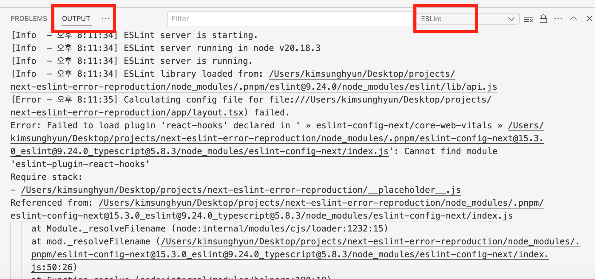

# 시작

Next.js, pnpm, eslint는 널리 사용되는 주류 기술들이다. 이 세 가지를 조합해서 사용하는 경우 역시 많다. 예를 들어 `create-next-app`에서 지원하는 `--use-pnpm` 플래그를 사용하면 자연스럽게 이 조합을 사용하게 된다.

```bash
npx create-next-app@latest --use-pnpm
```

이 블로그도 처음에 이런 명령어로(정확히는 `pnpm create next-app`이었지만) 생성한 프로젝트에서 시작했다.

그런데 pnpm 버전 업데이트 등으로 인해 pnpm v10 이상을 사용하는 경우, 이렇게 프로젝트를 생성한 후 vscode로 실행하면 eslint가 제대로 작동하지 않는다. 이것저것 살펴보다가 하단의 Output 패널을 열어보면 다음과 같은 에러 메시지가 우리를 반긴다.



vscode의 eslint 설정에 문제가 있을 수도 있다. 하지만 설정에 문제가 없는 경우에도 위와 같은 에러가 발생한다. 나도 블로그 프로젝트에서 갑자기 eslint가 동작하지 않는 걸 발견했고 그 원인을 찾아 해결한 경험을 이렇게 정리해본다.

이 글은 eslint의 설정 전반을 다루는 글은 아니다. eslint 설정을 완료했는데도 `eslint-config-next`에서 에러가 발생하는 경우, 특히 위 스크린샷과 같은 에러를 해결하기 위한 글이다. eslint 설정 자체에 대해서는 내가 eslint 설정을 하며 썼던 [블로그에 ESLint 9 적용, 그 삽질과 설정의 기록](https://witch.work/ko/posts/blog-eslint-configuration)을 참고할 수 있다.

## 사용한 환경

비슷한 문제를 겪고 있는 사람에게 도움이 될 수 있도록 내가 글을 쓰며 사용한 환경을 최대한 자세히 밝힌다.

프로젝트는 2025년 04월 15일 기준으로 `npx create-next-app@latest --use-pnpm` 명령어로 생성한 것을 사용했으며 주요 라이브러리 버전은 다음과 같다.

- MacOS Sonoma 14.4.1
- Node.js 22.11.0
- npm 10.9.0
- pnpm 10.8.0
- Next.js 15.3.0
- eslint 9.24.0
- @eslint/eslintrc 3.3.1
- eslint-config-next: 15.3.0
- react: 19.1.0
- react-dom: 19.1.0
- typescript: 5.8.3

# 땜질식 해결

## 오류를 내는 라이브러리 설치

에러 메시지는 그 자체로 우리에게 원인을 알려 줄 때가 많다. 그러니 우선 에러 메시지를 살펴보자.

```
Error: Failed to load plugin 'react-hooks' declared in ' » eslint-config-next/core-web-vitals » /Desktop/projects/eslint-next-test/node_modules/.pnpm/eslint-config-next@15.3.0_eslint@9.24.0_typescript@5.8.3/node_modules/eslint-config-next/index.js': Cannot find module 'eslint-plugin-react-hooks'
```

`eslint-config-next`에서 사용하는 `eslint-plugin-react-hooks`를 찾지 못해서 에러가 발생했다고 한다. 그렇다면 이 플러그인을 설치해주자.

```bash
pnpm add -D eslint-plugin-react-hooks
```

설치 후 다시 vscode를 실행해보자. 이번에는 이런 에러가 발생한다.

```
Error: Failed to load plugin '@next/next' declared in ' » eslint-config-next/core-web-vitals » /Desktop/projects/eslint-next-test/node_modules/.pnpm/eslint-config-next@15.3.0_eslint@9.24.0_typescript@5.8.3/node_modules/eslint-config-next/index.js': Cannot find module '@next/eslint-plugin-next'
```

비슷하다. `@next/eslint-plugin-next` 플러그인을 찾지 못했다고 한다. 역시 설치해주자.

```bash
pnpm add -D @next/eslint-plugin-next
```

다시 vscode를 실행해보자. 다음과 같은 로그가 뜨면서 eslint가 정상 작동하는 걸 확인할 수 있다.

```
ESLint library loaded from: /Desktop/projects/eslint-next-test/node_modules/.pnpm/eslint@9.24.0/node_modules/eslint/lib/api.js
```

## 의문

하지만 여기서 의문이 든다. 왜 이런 플러그인들을 내가 직접 설치해야 할까? 이런 생각이 드는 이유는, 방금 이렇게 설치한 라이브러리들은 사실 `eslint-config-next`의 의존성으로 명시되어 있기 때문이다.

Next.js의 [ESLint Plugin 공식 문서](https://nextjs.org/docs/app/api-reference/config/eslint)에서도 그렇게 이야기하며 [`eslint-config-next` 패키지의 `package.json`을](https://github.com/vercel/next.js/blob/canary/packages/eslint-config-next/package.json) 직접 확인해봐도 내가 설치한 플러그인 패키지들이 `dependencies`에 명시되어 있다.

마찬가지로 프로젝트의 의존성 설치를 진행했을 때 `pnpm-lock.yaml` 파일과 `node_modules/.pnpm` 디렉토리에서도 이 패키지들을 찾을 수 있다.

```yaml
# pnpm-lock.yaml의 일부
eslint-config-next@15.3.0(eslint@9.24.0)(typescript@5.8.3):
    dependencies:
      '@next/eslint-plugin-next': 15.3.0
      # 중간 생략
      eslint-plugin-react-hooks: 5.2.0(eslint@9.24.0)
```

그리고 npm이나 yarn으로 Next.js 프로젝트를 생성하면 이런 문제가 발생하지 않는다. 그럼 왜 하필 pnpm만 이런 문제를 일으킬까? 원인이 무엇이고 어떻게 이런 문제를 깔끔하게 해결할 수 있을까?

# 근본적인 원인

이 섹션에서는 이 문제가 근본적으로 왜 일어났는지를 알아본다. 원인보다는 훨씬 간단하게 설명할 수 있는 해결법에 대해서는 다음 섹션에서 설명한다.

문제 원인을 요약해 설명하면 이렇다. 기존의 eslint 설정 방식에서는 플러그인을 문자열로 지정하면 eslint가 이를 `node_modules`에서 찾아 로딩했다. 이를 위해서 eslint 플러그인들을 `node_modules` 최상위에 존재하도록 하는 설정이 있었다. 그런데 pnpm v10부터 이 설정이 기본값에서 빠졌다. 그 결과로 eslint가 플러그인들을 찾지 못하게 되었고 이런 버그가 발생했다.([pnpm 이슈 #8878](https://github.com/pnpm/pnpm/issues/8878))

하지만 한눈에 알아듣기 힘든 설명이다. 그래서 이 섹션에서는 이걸 약간 풀어서 설명해 보려고 한다. 다만 JavaScript의 패키지 매니저, 모듈 시스템 등에 대한 배경지식이 약간은 필요하다.

## eslint의 플러그인 로딩 방식과 요구사항

이 문제가 발생하는 이유는 eslint에서 플러그인을 로딩하지 못했기 때문이다. 그럼 왜 그럴까? 그걸 알아보기 위해서 eslint에서 어떻게 플러그인을 로딩하는지부터 시작하자.

JavaScript 진영에서는 일반적으로 라이브러리를 불러와서 사용할 때 `import`나 `require`로 불러온다. 물론 이 2가지의 차이나 역사에 관해서도 할 수 있는 이야기가 많다. 하지만 그건 글의 핵심이 아니므로 여기서는 생략한다. 필요할 경우 [JS 탐구생활 - require와 import 그리고 JS의 모듈 시스템](https://witch.work/ko/posts/import-and-require)등의 글을 참고하자.

중요한 건 `import`를 쓰는지 `require`를 쓰는지 같은 게 아니라 사용자가 "직접 라이브러리 모듈의 경로를 명시해서" 로딩을 한다는 것이다. 비록 `node_modules`를 거치기는 하지만 해당 모듈의 위치를 명시적으로 적어준다.

eslint의 최신 설정 형식인 flat config에서도 마찬가지다. `import`로 플러그인을 불러온다. 예를 들어 내 블로그의 eslint 설정 파일에서 플러그인을 불러오는 부분을 보자. 각 플러그인들이 어디에 위치하는지 명시적으로 적어주고 import하고 있다.

```js
import eslint from '@eslint/js';
import stylisticJs from '@stylistic/eslint-plugin';
import unusedImports from 'eslint-plugin-unused-imports';
import tseslint from 'typescript-eslint';

export default tseslint.config({
  eslint.configs.recommended,
  tseslint.configs.strictTypeChecked,
  tseslint.configs.stylisticTypeChecked,
  {
    files: ['src/**/*.{ts,tsx}'],
    plugins: {
      '@stylistic': stylisticJs,
      'unused-imports': unusedImports,
    },
    rules: {
      '@typescript-eslint/consistent-type-definitions': ['error', 'type'],
      // ...
    },
  },
})
```

하지만 eslint에서 flat config를 사용하기 전에는 이런 방식이 아니었다. 이전의 설정 방식을 eslint 공식 문서에서는 "eslintrc" 방식이라고 하므로 이렇게 부르겠다. eslintrc 방식에서는 js뿐 아니라 json이나 yaml 형식으로도 설정 파일을 만들 수 있었다! `.eslintrc.json` 파일을 사용할 경우 대략 이런 식으로 작성했다.

아직 flat config를 정식으로 사용하고 있는 프로젝트가 상대적으로 적기에 이런 eslintrc 방식이 익숙한 사람도 많을 것이다.

```json 
// 출처: eslint의 Configuration Files (Deprecated), Using a configuration from a plugin 섹션
// https://eslint.org/docs/latest/use/configure/configuration-files-deprecated
{
	"plugins": ["react"],
	"extends": ["eslint:recommended", "plugin:react/recommended"],
	"rules": {
		"react/no-set-state": "off"
	}
}
```

그런데 이렇게 문자열로 플러그인을 명시했을 경우 어떻게 플러그인을 불러왔을까? 애초애 js파일이 아니니 `import` 같은 걸 썼을 리는 없다.

eslint가 이 작업을 했다. eslint가 이렇게 문자열로 명시된 플러그인들을 찾아서 로딩했다. `plugins` 배열에 있는 문자열들의 앞에 `eslint-plugin-`를 붙인 뒤 `require`로 불러오는 방식이었다.

위의 설정 파일에서처럼 `plugins`에 `"react"`라고 명시했을 경우 eslint는 `eslint-plugin-react`라는 패키지를 로드했다. `require('eslint-plugin-react')`를 쓴 것과 같은 효과였다.

또한 `extends`를 통해 다른 설정(`eslint-config...`)을 불러올 수 있었는데 여기서 주의할 점이 있었다. `extends`를 통해 불러온 설정에서 필요한 플러그인을 로드하는 경우에도 eslint 설정 파일의 위치를 기준으로 로드한다는 것이다.

말로 설명하면 이해하기 힘들 수 있으니 예시를 들어보자. 예를 들어 `/.eslintrc.json`에 `extends: ['next']`가 있다. `eslint-config-next` 설정을 사용한다는 의미다. 그런데 `eslint-config-next` 패키지에서 `eslint-plugin-react` 플러그인을 사용하고 있다고 하자. 그러면 `eslint-config-next` 패키지의 `node_modules` 디렉토리에서 `eslint-plugin-react`를 찾아야 할 것 같다.

하지만 그렇지 않다! `eslint-config-next` 패키지의 `node_modules` 디렉토리에서 `eslint-plugin-react`를 찾지 않는다. `eslint-config-next`를 사용한 eslint 설정 파일이 있는 경로(보통 프로젝트 루트)의 `node_modules` 디렉토리에서 찾는다.


이 말은 eslint가 제대로 동작하기 위해서는 설정 파일에서 사용하는 플러그인 패키지들이 모두 프로젝트 루트의 `node_modules`의 최상위에 존재해야 한다는 뜻이다. `require`로 모듈을 로딩하는 eslint는 메모리 상에서 `node_modules`의 최상위에 있는 패키지들만 찾기 때문이다.

## pnpm의 문제

npm과 yarn은 패키지를 설치할 때 패키지들의 의존성을 포함한 모든 패키지들을 `node_modules`의 최상위에 설치한다. 이를 호이스팅이라 하며 역사적 맥락이 있지만 여기서는 생략하자.([Performant NPM - PNPM](https://kdydesign.github.io/2023/09/25/pnpm-tutorial/) 참고 가능) 중요한 건 npm과 yarn으로 패키지들을 설치할 경우 `node_modules`의 최상위에 모든 패키지들이 존재한다는 사실이다. eslint가 언제나 플러그인들을 로딩할 수 있다는 뜻이다.

하지만 pnpm은 패키지들을 `node_modules`의 최상위에 설치하지 않는다. 대신 `node_modules/.pnpm` 디렉토리에 저장한 뒤 각 패키지에 필요한 것만 symlink로 연결한다.[^1] 성능과 메모리 절약을 위해서이다. 이런 구조에서는 기본적으로 config 파일에서 사용하는 플러그인 패키지들이 `node_modules`의 최상위에 존재하지 않는다.

구체적으로 말하면 `eslint-config-next`에서 의존성으로 사용하는 플러그인들은 `node_modules/.pnpm`에 존재한다. 따라서 eslintrc 방식으로 설정을 작성한 경우에는 플러그인들을 찾지 못하게 된다.

eslint는 아주 많이 쓰이는 라이브러리였기에 pnpm 진영에서도 이를 알고 있었다. 따라서 pnpm v9까지는 eslint와 prettier(보통 eslint와 함께 쓰이는 라이브러리) 관련 패키지들은 `node_modules`의 최상위에 존재하도록 하는 설정이 기본값이었다. `node_modules` 루트에 설치될 패키지를 설정하는 `public-hoist-pattern` 설정값을 이용한 거였다.

대략 이렇게 `.npmrc`의 기본값을 설정한 거라고 보면 된다. (물론 `pnpm-workspace.yaml` 형식으로도 같은 설정이 가능하다. 거기에 대해서는 [`publicHoistPattern` 문서](https://pnpm.io/settings#publichoistpattern) 참고)

```json
public-hoist-pattern[]=*eslint*
public-hoist-pattern[]=*prettier*
```

그러나 eslint에서 flat config가 도입되었다. flat config에서는 위에서 봤던 것처럼 eslint 플러그인들을 설정 파일의 문자열을 통해서가 아니라 import를 통해 직접 로드한다.

따라서 flat config를 사용하면 eslint가 플러그인들을 찾기 위해 `node_modules`의 최상위에 존재할 필요가 없다. [그래서 pnpm v10에서는 `public-hoist-pattern`의 기본값에 들어 있던 `*eslint*`, `*prettier*`를 없앴다.](https://github.com/pnpm/pnpm/issues/8378)

이제 pnpm의 기본 설정에서는 eslint 관련 패키지들이 `node_modules`의 최상위에 존재하지 않게 되었다!

물론 사용자가 flat config를 사용해서 eslint를 설정하는 경우 아무 문제가 없다. 그러나 이건 사용자만 잘한다고 되는 게 아니다. [Next.js의 eslint 설정 패키지인 `eslint-config-next`에서는 여전히(2025/04/15 기준) flat config를 사용하지 않고 eslintrc 설정을 사용하고 있다.](https://github.com/vercel/next.js/blob/canary/packages/eslint-config-next/index.js) 즉 `eslint-config-next`는 `node_modules`의 최상위에서 플러그인들을 찾는다.

이 둘이 맞물려서, `eslint-config-next`를 pnpm v10 이후 버전의 환경에서 사용하면 문제가 생긴다. `eslint-config-next`의 내부적으로 사용하는 eslint 설정 파일에서는 eslintrc 설정으로 플러그인들을 로드하는데 이를 위해서는 pnpm v10부터 없어진 설정이 필요하기 때문이다.

## eslint-config-next 패키지 살펴보기

확실하게 하기 위하여 `eslint-config-next` 패키지의 코드를 살펴보자. Next.js 프로젝트를 생성하면서 eslint 사용을 설정하면 설치되어 있다. 그럴 때 생기는 eslint 설정 파일은 다음과 같다.

```js
// eslint.config.mjs
import { dirname } from "path";
import { fileURLToPath } from "url";
import { FlatCompat } from "@eslint/eslintrc";

const __filename = fileURLToPath(import.meta.url);
const __dirname = dirname(__filename);

const compat = new FlatCompat({
  baseDirectory: __dirname,
});

const eslintConfig = [
  // js로 설정해서 프로젝트를 생성했을 경우 "next/typescript"는 없다
  ...compat.extends("next/core-web-vitals", "next/typescript"),
];

export default eslintConfig;
```

애초에 여기서 사용하는 `FlatCompat` 자체가 eslintrc 설정을 flat config에서 호환하기 위한 라이브러리 함수이다. 뭔가 eslintrc 설정을 사용한다는 감이 벌써 온다. 그럼 여기서 로드하고 있는 `next/core-web-vitals`는 어떻게 되어 있는지 보자. `eslint-config-next` 패키지의 `core-web-vitals.js`에서 찾을 수 있다.

```js
// next.js/packages/eslint-config-next/core-web-vitals.js
module.exports = {
  extends: [require.resolve('.'), 'plugin:@next/next/core-web-vitals'],
}
```

역시 eslintrc 설정을 쓰고 있다. `@next/next/core-web-vitals` 플러그인의 설정을 불러오고 있으므로 pnpm v10에서는 여기부터 에러가 발생할 것이다. `require.resolve('.')`로 불러오고 있는 `eslint-config-next` 패키지의 `index.js`도 살펴보자. 여기서도 eslintrc 설정을 사용한다.

```js
// next.js/packages/eslint-config-next/index.js
// 기본값 설정을 위한 복잡한 코드들은 생략
module.exports = {
  extends: [
    'plugin:react/recommended',
    'plugin:react-hooks/recommended',
    'plugin:@next/next/recommended',
  ],
  plugins: ['import', 'react', 'jsx-a11y'],
  rules: {
    'import/no-anonymous-default-export': 'warn',
    // ...
  },
  // ...
}
```

따라서 `eslint-config-next` 패키지에서 사용하는 설정 파일들은 flat config를 사용하지 않고 기존의 eslintrc 형식으로 되어 있다. `next/core-web-vitals`만 살폈지만 `next/typescript` 역시 마찬가지다.

그러니 이 `eslint-config-next` 패키지를 사용하게 되면 eslint가 여기 쓰이는 플러그인들을 찾기 위해 `node_modules`의 최상위를 탐색하게 된다. 그러나 pnpm v10부터는 eslint 관련 패키지들이 `node_modules`의 최상위에 존재하지 않게 되었다. 따라서 eslint가 플러그인들을 찾지 못하게 되고 위와 같은 에러가 발생한다는 걸 config 패키지 코드를 통해서도 확인할 수 있었다.

# 해결

문제의 원인을 정확하게 설명하기 위해 길게 썼지만 해결 방법은 간단하다. 문제는 pnpm v10부터 `public-hoist-pattern` 설정이 없어진 것에서 시작했으므로 이를 다시 추가해 주면 된다. 프로젝트 루트에 `.npmrc` 파일을 만들고 다음과 같이 작성한다.

```json
public-hoist-pattern[]=*eslint*
public-hoist-pattern[]=*prettier*
```

패키지 매니저 설정이 바뀌었으니 `node_modules`와 `pnpm-lock.yaml` 파일을 삭제한 뒤 다시 패키지를 설치해 주자.

```bash
rm -rf node_modules
rm -rf pnpm-lock.yaml
pnpm install
```

그럼 이제 `node_modules`의 최상위에 eslint 관련 패키지들이 존재하게 된다. 따라서 eslint가 eslintrc 설정에서 사용된 플러그인들도 찾을 수 있게 되어 에러가 발생하지 않는다.

사실 이런 문제는 `eslint-config-next` 패키지에서 flat config를 사용한다면 발생하지 않는다. 앞서 계속 언급했듯 flat config는 플러그인들이 eslint를 통해서가 아니라 직접 로드되기 때문이다.

하지만 이건 당분간은 힘들어 보인다. [먼저 `eslint-config-next` 에서 의존성으로 사용하는 플러그인들 중 아직 flat config를 지원하지 않는 게 많다.](https://github.com/vercel/next.js/issues/64114#issuecomment-2041022698) 그리고 [이미 관련 PR은 올라와 있으나 breaking change](https://github.com/vercel/next.js/pull/76935#issuecomment-2805257892)이기 때문에 적용될 수 있을지 나로서는 알 수가 없다.

하지만 적용된다고 해도 flat config가 아직 널리 쓰이지는 않아서 바로 실제 프로젝트에서 사용하기는 힘들 걸로 본다. 따라서 위와 같은 설정을 일단은 사용하도록 하자. 혹은 [누군가 만든 flat config preset](https://github.com/vercel/next.js/pull/73873)을 적용해 볼 수도 있겠다.

# 결론

eslint 플러그인은 원래 eslint의 설정 파일에 문자열로 명시된 플러그인들을 eslint가 로딩하는 방식으로 동작했다. 이를 위해서는 eslint가 플러그인들을 `node_modules`의 최상위에서 찾을 수 있어야 한다. pnpm은 이를 위해서 eslint 관련 플러그인 패키지들이 호이스팅되는 걸 기본 설정으로 만들었다.

하지만 eslint flat config가 도입되면서 pnpm은 v10부터 이런 기본 호이스팅 설정을 없앴다. 그런데 `eslint-config-next`는 여전히 eslint flat config를 사용하지 않고 eslintrc 설정 파일을 사용하고 있다. 그래서 eslint가 플러그인들을 찾지 못하게 된 것이다.

그러니 이를 해결하려면 eslint 관련 패키지들이 `node_modules`의 최상위에 위치하도록 `public-hoist-pattern` 설정을 해주면 된다.

문제가 되는 라이브러리들을 순식간에 설치해서 해결할 수도 있었다. 하지만 내 블로그 코드에서 이렇게 대충 해결하고 넘어가고 싶지 않았기에 근본적인 해결을 위해 끝까지 알아보고 이렇게 기록을 남긴다.

# 참고

Next.js 문서 create-next-app

https://nextjs.org/docs/app/api-reference/cli/create-next-app

Next.js 문서 ESLint Plugin

https://nextjs.org/docs/app/api-reference/config/eslint

Next.js eslint-config-next 패키지 코드

https://github.com/vercel/next.js/tree/canary/packages/eslint-config-next

Next.js issue #64114, New ESLint "flat" configuration file does not work with next/core-web-vitals

https://github.com/vercel/next.js/issues/64114

Next.js issue #73968, Failed to load plugin 'react-hooks' declared in ' » eslint-config-next/core-web-vitals » Cannot find module 'eslint-plugin-react-hooks'

https://github.com/vercel/next.js/issues/73968

pnpm 문서, Settings (pnpm-workspace.yaml)

https://pnpm.io/settings#publichoistpattern

pnpm issue #8378, Remove the default option `*eslint*` and `*prettier*` from public-hoist-pattern option in next major version

https://github.com/pnpm/pnpm/issues/8378

pnpm PR #8621, feat!: remove prettier and eslint from the default value of public-hoist-pattern

https://github.com/pnpm/pnpm/pull/8621

pnpm issue #8878, Using public-hoist-pattern breaks ESLint extension?!

https://github.com/pnpm/pnpm/issues/8878

eslint의 Configuration Migration Guide 문서

https://eslint.org/docs/latest/use/configure/migration-guide

eslint의 Configuration Files (Deprecated) 문서

https://eslint.org/docs/latest/use/configure/configuration-files-deprecated

eslint의 Configure Plugins (Deprecated)

https://eslint.org/docs/latest/use/configure/plugins-deprecated

Introducing ESLint Compatibility Utilities

https://eslint.org/blog/2024/05/eslint-compatibility-utilities/

@eslint/eslintrc의 README

https://github.com/eslint/eslintrc

npm, yarn, pnpm 비교해보기

https://yceffort.kr/2022/05/npm-vs-yarn-vs-pnpm

Performant NPM - PNPM

https://kdydesign.github.io/2023/09/25/pnpm-tutorial/

ESLint는 어떻게 코드를 분석할까요?

https://1lsang.vercel.app/posts/eslint-01

[^1]: https://yceffort.kr/2022/05/npm-vs-yarn-vs-pnpm#pnpm-%EB%B9%A0%EB%A5%B4%EA%B3%A0-%ED%9A%A8%EC%9C%A8%EC%A0%81%EC%9D%B8-%EB%94%94%EC%8A%A4%ED%81%AC-%EA%B4%80%EB%A6%AC