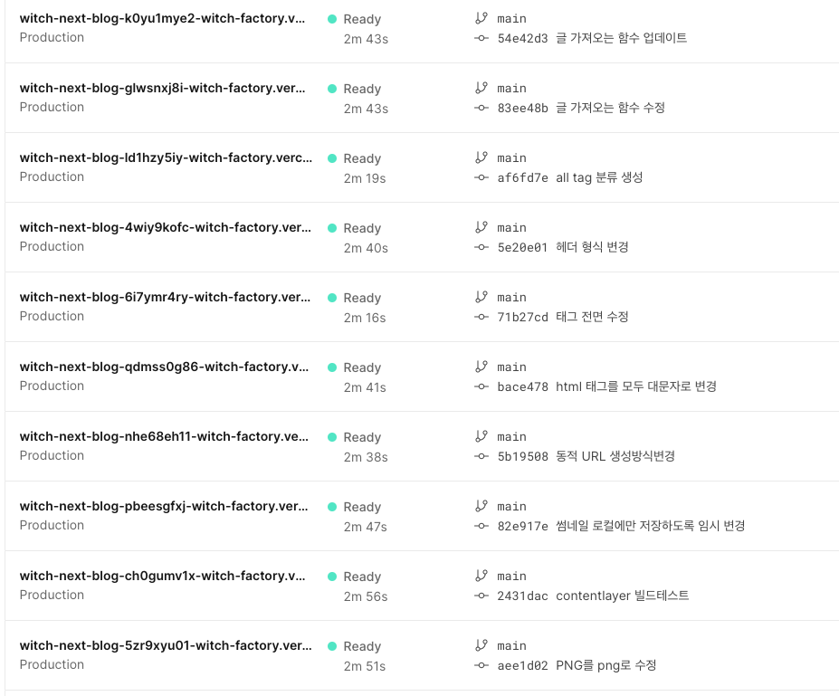
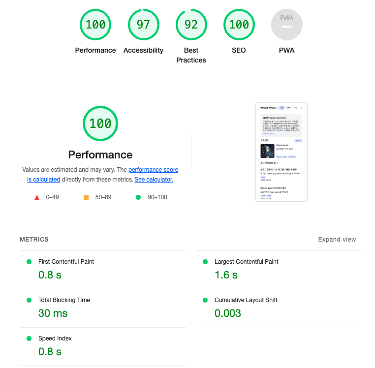
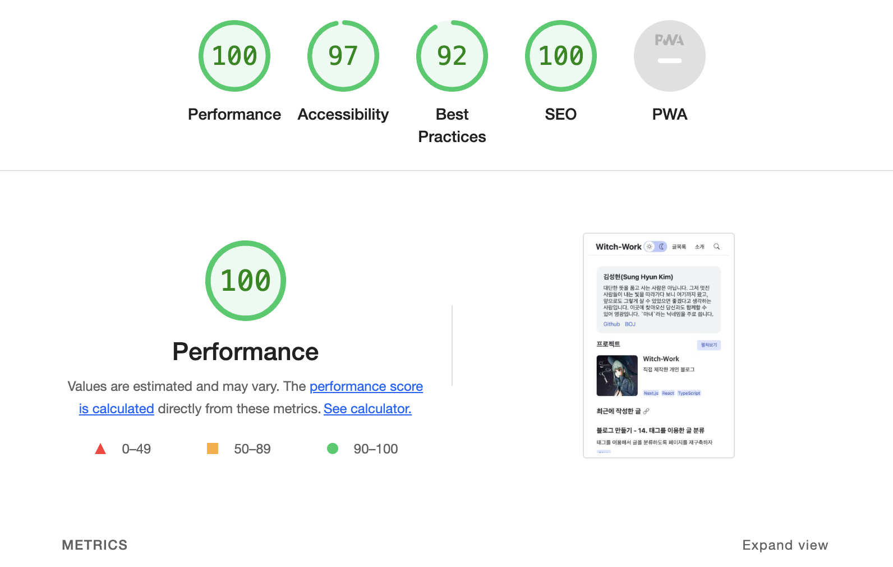
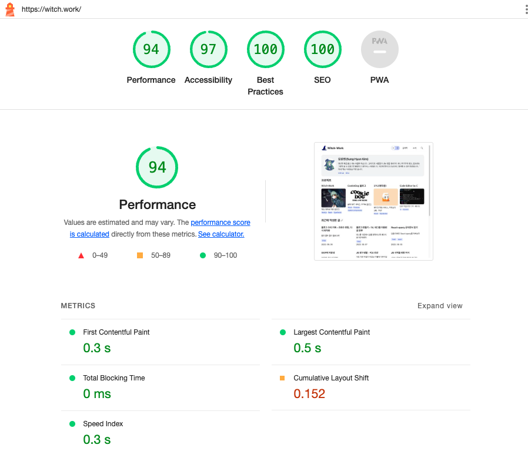

# 블로그 만들기 시리즈

|제목|링크|
|---|---|
|1. 기본 세팅|[https://witch.work/posts/blog-remake-1](https://witch.work/posts/blog-remake-1)|
|2. 메인 페이지의 HTML 설계|[https://witch.work/posts/blog-remake-2](https://witch.work/posts/blog-remake-2)|
|3. 글 상세 페이지의 구조 설계|[https://witch.work/posts/blog-remake-3](https://witch.work/posts/blog-remake-3)|
|4. 이미지를 상대 경로로 쓸 수 있도록 하기|[https://witch.work/posts/blog-remake-4](https://witch.work/posts/blog-remake-4)|
|5. 자잘한 페이지 구성 개선과 배포|[https://witch.work/posts/blog-remake-5](https://witch.work/posts/blog-remake-5)|
|6. 페이지 요소의 배치 설계|[https://witch.work/posts/blog-remake-6](https://witch.work/posts/blog-remake-6)|
|7. 메인 페이지 컴포넌트 디자인|[https://witch.work/posts/blog-remake-7](https://witch.work/posts/blog-remake-7)|
|8. 글 목록/내용 페이지 컴포넌트 디자인|[https://witch.work/posts/blog-remake-8](https://witch.work/posts/blog-remake-8)|
|9. 글 썸네일 자동 생성하기|[https://witch.work/posts/blog-remake-9](https://witch.work/posts/blog-remake-9)|
|10. 폰트, 카드 디자인 등의 디자인 개선|[https://witch.work/posts/blog-remake-10](https://witch.work/posts/blog-remake-10)|
|11. 글에 조회수 달기|[https://witch.work/posts/blog-remake-11](https://witch.work/posts/blog-remake-11)|
|12. 페이지 테마와 글 검색 기능|[https://witch.work/posts/blog-remake-12](https://witch.work/posts/blog-remake-12)|
|13. 테마 아이콘과 썸네일 레이아웃 개선 등|[https://witch.work/posts/blog-remake-13](https://witch.work/posts/blog-remake-13)|
|14. 글 분류를 태그 기반으로 변경|[https://witch.work/posts/blog-remake-14](https://witch.work/posts/blog-remake-14)|
|메인 페이지의 연산 최적화|[https://witch.work/posts/blog-opt-1](https://witch.work/posts/blog-opt-1)|
|글 목록 페이지네이션 만들기|[https://witch.work/posts/blog-opt-2](https://witch.work/posts/blog-opt-2)|
|이미지를 CDN에 올리고 placeholder 만들기|[https://witch.work/posts/blog-opt-3](https://witch.work/posts/blog-opt-3)|
|검색 페이지에 무한 스크롤 구현하기|[https://witch.work/posts/blog-opt-4](https://witch.work/posts/blog-opt-4)|

# 1. 문제 발생

블로그를 보다가 조회수 부분을 유심히 보니 뭔가 이상했다. 현재 DB에 저장되고 있는 조회수가 하나로 묶여서 저장되고 있는 것 같았다. 그래서 supabase에 가서 테이블을 보니 웬 `undefined`값에 조회수가 모두 수신되고 있었다.

그리고 썸네일을 CDN에 업로드하는 데에도 오류가 발생하고 있었다. 하지만 현재 CDN으로 사용하고 있는 cloudinary의 무료 플랜은 업로드에 대해 상당히 빡빡하므로 한번한번 고치기가 쉽지 않았다. 그래서 일단 로컬에 모든 썸네일을 저장해 놓는 걸로 대체한 후 다른 작업들을 먼저 진행하였다. 이 글에서 이 부분도 한번 고쳐 보도록 하겠다.

# 2. 조회수 카운터 오류

확인 결과 `ViewCounter`에서는 문제가 없었다. 이 조회수를 쓰는 곳은 글 상세 페이지였는데 여기서는 slug를 만들어서 `ViewCounter`컴포넌트에 props로 넘겨주었고 해당 컴포넌트에서는 그 props로 받은 slug를 기반으로 DB 키를 만들었다.

문제는 slug를 만드는 코드가 다음과 같았다는 것이다.

```tsx
const slug=post._raw.flattenedPath.split('/')[1];
```

이는 `post._raw.flattenedPath`가 `[category]/[slug]`형식이었을 때의 잔재이다. 현재는 post의 `flattenedPath`가 slug만 가리키도록 수정되었다. 따라서 이를 수정해 주기만 하면 된다.

```tsx
const slug=post._raw.flattenedPath;
```

# 3. 썸네일 업로드 오류

이상한 것은 Vercel에서는 `yarn run build`를 했을 때 이 cloudinary 업로드가 잘 진행되는데 로컬에서는 이게 잘 안되는 것이다. 대략 이런 오류 메시지가 발생했다.

```bash
"binary-search/index.md": UnexpectedMarkdownError: Must supply api_key
```

그래서 환경변수를 한번 출력해 보았더니 역시나, 로컬에서는 환경변수를 제대로 인식하지 못하고 있었다. 분명 `.env.local`에 잘 넣어 줬는데 말이다.

이는 나중에 홈서버로 블로그를 배포하는 과정에서 해결하였다. [홈 서버로 블로그 배포하기 3번 글을 참고하자.](https://witch.work/posts/blog-home-server-3)

# 4. 최적화

그런데 이제 보니 블로그가 상당히 느려졌다. Lighthouse로 점수를 측정해 보니 70점대로 떨어졌다. 


분명 한때는 점수가 90점대 후반이었는데...물론 Lighthouse점수가 전부는 아니지만 실제로 체감상 느려지기도 했다.

이미지가 문제일 수도 있겠지만 모바일에서의 글 목록 페이지와 같은 경우는 이미지가 없는데도 불구하고 느려졌다. 나머지는 여전히 괜찮은 편인데, 사용자가 컨텐츠를 보기까지 걸리는 시간인 Total blocking time이 너무 길어진 게 문제다. 원인을 분석해보자.

빌드 과정을 다 들여다볼 수는 없으니 하나하나 실험해 가면서 고통스러운 최적화를 진행해야 했다. 무언가 더 나은 방법을 아시는 분이 있다면 꼭 알려주시길.

## 4.1. 원인 분석

Vercel에서는 내가 지금까지 배포했던 사이트들을 모두 보존해 놓고 있다. 이게 영원히 보존되는 건지는 모르겠지만 블로그 성능이 떨어진지는 얼마 되지 않았으므로 추적에는 충분하다. 이런 수많은 로그 중 어딘가에 성능을 떨어뜨린 변화가 숨어 있을 것이다.



며칠 전 태그 기반으로 블로그 페이지들을 개편하기 전의 페이지를 적당히 찍어서 메인페이지의 Lighthouse 점수를 찍어 보니 여기서는 100점이 나왔다. 그리고 최근 페이지는 당연히 낮은 점수다. 

이제 [로그들을 이분탐색해서 어디서부터 성능이 떨어졌는지 찾겠다.](https://witch.work/posts/binary-search) 알고리즘은 부끄럽지만 도움이 된다. 어느 시점부터 total blocking time이 높아지는지 찾아보자.

추적해본 결과 뭔가 `tagFilter` 컴포넌트가 들어가면서 문제가 생긴 것 같다. 그럼 어떤 게 문제가 된 걸까? 처음에는 이 컴포넌트에 쓰이는 `tagList`배열을 만드는 과정이 문제인 줄 알았다. 이 배열이 매번 새로 만들어지면서 글 목록을 훑게 되고 거기서 성능 저하가 발생하는 거라고 생각한 것이다.

```ts
// 문제로 추정했던 코드
export const tagList: string[]=['All', ...getAllPostTags(),];
```

하지만 이를 당장 어떻게 고쳐야 성능 저하가 안 될지는 생각나지 않았다. 나중에 알고 보니 이게 정말 문제인 건 맞았고 이후 섹션에서 어떻게 고친지 소개할 것이다.

그럼 `tagFilter`가 문제인 것은 맞을까? 내 사이트이기에 마음대로 해볼 수 있는 것은 이럴 때 해당 컴포넌트를 아예 없애 볼 수도 있다는 것이다. 한번 모든 페이지에서 `tagFilter`를 삭제해 보고 다시 Lighthouse 점수를 찍어보자.



`tagFilter` 네 이놈! 하지만 이 컴포넌트는 말이 태그필터지 사실 각 태그별 분류 페이지로 가는 링크를 모아 놓은 컴포넌트일 뿐이다. 내부 요소들도 빌드 시에 완벽하게 생성할 수 있기 때문에 `tagFilter` 컴포넌트의 존재 자체가 성능을 저하시킬 리는 없다.

## 4.2. 개발자 도구와 함께 분석

그럼 정말로 문제는 무엇일까? 디버깅 방법이 컴포넌트 뺐다꼈다만 있는 건 아니니까 여러 시도를 해보자. 먼저 태그 필터를 다시 사이트에 장착하고 lighthouse 측정을 해보자.

Lighthouse 점수 탭에 들어가 보면 친절하게 진단을 알려준다.


여기서 Reduce initial server response time은 lighthouse 점수가 잘 뜰 때에도 가끔씩은 길게 나오던 부분이다. 게다가 지금 서버는 Vercel에서 돌아가고 있지 않은가? 홈서버라도 돌리지 않는 이상 이 속도를 올릴 방법은 없다. 또한 태그 필터와도 전혀 관련없다.

그리고 Reduce unused JavaScript에서 지적하고 있는 코드는 구글 태그 매니저의 코드이다. 따라서 이 opportunities 부분에서는 문제될 만한 게 없다.

lighthouse의 진단에서는 Minimize main-thread work 그리고 Reduce JavaScript execution time 이라는 진단을 내리고 있는데 main-thread work에 대한 분석을 보면 스크립트 분석, 파싱, 컴파일이 차지하는 시간이 대부분이다. 따라서 Javascript 실행 시간이 핵심 문제다.

그래서 실행되고 있는 청크 파일을 봤더니 어디선가 문제가 생겼는지 `allDocument`에 들어가 있을 내용이 `TagFilter`컴포넌트가 들어 있는 페이지의 JS 파일에 모두 들어가 있었다. 시간을 들여 코드의 구조를 조금이나마 분석해 보니 심지어 실용적으로 쓰이는 코드도 아니었다.

현실적으로 nextjs의 빌드 로직을 모두 알 수 없으니, 하나하나 `tagFilter`관련 코드들을 실험해 보면서 어떻게 되는지 보았다. nextJS에서 계속 빌드를 돌려가면서 찾아보았다.

## 4.3. 다양한 시도

[next/link의 링크는 링크 URL을 프리페칭한다는 이야기가 있어서 그걸 의심해보았으나 아니었다. 아예 링크 컴포넌트를 빼도 TagFilter 컴포넌트의 포함은 성능에 영향을 미쳤다.](https://stackoverflow.com/questions/74293043/how-can-i-stop-next-js-from-loading-other-chunks-from-another-page)

또한 모든 글들의 태그를 추출하는 `getAllPostTags`함수도 의심해 보았으나 해당 함수는 태그 필터 컴포넌트 이외의 다른 곳에서도 이미 잘 쓰이고 있고 전혀 성능 저하를 일으키지 않았다. 그리고 이 함수 대신 정적으로 태그 리스트를 생성해 주어도 성능 저하는 마찬가지였다.

[그럼 아예 tagList 배열을 새로운 파일에 넣어 주면 어떨까? export된 변수는 참조처럼 동작하기 때문에 매번 import할 때마다 새로 만들어지지는 않을 것이다.](https://yceffort.kr/2021/07/deep-dive-to-export)

```ts
// src/utils/postTagArray.ts 와 같이 만들어 보는 것이다.
export const tagList: string[]=['All', ...getAllPostTags(),];
```

하지만 이렇게 해도 소용없었다. 좀더 시간을 들여 고민해 보았다.

## 4.4. 해결

이런 생각은 어떨까? [ESM은 빌드 시점에 정적으로 모듈 그래프를 구성한다.](https://witch.work/posts/import-and-require) 그러면 위와 같이 `tagList`를 참조하는 쪽에서는 `getAllPostTags()`의 존재도 모듈 그래프를 통해 알게 된다. 그리고 `getAllPostTags()`에서는 전체 글을 불러오는 `getSortedPosts()`함수를 사용한다.

```ts
// src/utils/postTags.ts - 원리는 같지만 약간 수정되었다.
export const getAllPostTags = (): string[] => {
  const allTags=new Set<string>(getSortedPosts().map((post: DocumentTypes)=>post.tags).flat());
  return Array.from(allTags);
};
```

그러면 최대한 정적으로 모든 것을 해결하려고 하는 듯한 nextJS 번들러는 이렇게 콜 체인에 들어 있는 모든 함수들의 결과를 같이 번들링해서 매번 호출하는 대신 그 결과를 언제든 쓸 수 있도록 할 수 있도록 하지 않을까?

이걸 약간이나마 검증해 보기 위해 새로운 파일을 만들어서 `tagList`에 `getAllPostTags`를 사용하지 않고 태그들을 직접 넣었더니 성능의 저하가 일어나지 않는 것을 확인할 수 있었다.

그럼 어떻게 해야 할까? 일단 태그 필터는 죄가 없는 것을 확인했으니 원상복구한다. [이전에 태그 필터를 만들 때 썼던 글에 코드가 남아 있다.](https://witch.work/posts/blog-remake-14#5.2.-%ED%83%9C%EA%B7%B8%EB%A5%BC-%ED%86%B5%ED%95%9C-%ED%95%84%ED%84%B0%EB%A7%81)(물론 github에서 가져올 수도 있는데 귀찮으니까...)

그리고 이런 태그 리스트는 어디에 따로 넣어 놓는 게 아니라 `getStaticProps`에서 그냥 정적으로 만들어 주도록 한다.

```tsx
export const getStaticProps: GetStaticProps = async () => {
  /* 앞부분 코드 생략. 대충 페이지에 맞는 포스트 가져오는 코드 */

  const allTags=['All', ...getAllPostTags()];

  return {
    props: {
      allTags,
      pagePosts:pagePostsWithThumbnail,
      totalPostNumber,
      currentPage:FIRST_PAGE,
    },
    revalidate: 60 * 60 * 24, // <--- ISR cache: once a day
  };
};
```

이때 이전 글에서 만들었던 `makeTagURL`함수의 경우에도 그대로 `postTags.ts`에 놔두면 이 함수를 `TagFilter`컴포넌트의 props로 쓰는 순간 `postTags.ts`에 같이 들어 있는 `getAllPostTags`로 인해 `getSortedPosts`의 결과가 같이 번들링되기 때문에 `src/utils/makeTagURL.ts`에 별도로 분리한다. 

```ts
// src/utils/makeTagURL.ts
export const makeTagURL = (tag: string): string=>{
  if (tag==='All') {
    return '/posts/all';
  }
  else {
    return `/posts/tag/${tag}`;
  }
};
```

코드 스플리팅을 손으로 해주는 최적화라니...뭔가 좀더 좋은 방법이 있겠지만...지금의 나는 이게 한계다.

아무튼 이렇게 하고 이렇게 만들어진 태그 필터를 각 페이지에 적용하면 된다.

```tsx
<TagFilter
  tags={allTags}
  selectedTag={'All'}
  makeTagURL={makeTagURL}
/>
```

이 상태에서 배포하고 나서 Lighthouse로 성능을 체크해 보니, 태그 필터를 적용하기 전과 같이 빠른 사이트로 돌아온 것을 볼 수 있었다.



# 5. 작은 이미지 최적화

아직 우리가 할 수 있는 게 있다. 이미지 캐싱이 안 되어 있는 시크릿 창으로 페이지를 들어가서 lighthouse 검사를 하게 되면 Cumulative Layout Shift 즉 사용자가 보는 레이아웃이 얼마나 바뀌는지를 측정하는 지표가 좀 높게 나온다. 이 지표가 높으면 사용자가 불편함을 느끼고 브라우저 성능도 떨어진다.

특히 내 블로그에 처음 오는 사람 같은 경우에 이 부분이 치명적이다. CDN에서 받아 오니까 그렇게 느리지는 않을 거라 생각하지만 사이트는 빠르면 빠를수록 좋다.



여기에 대해 할 수 있는 건 이전에 했던 blur image 제공이 가장 적절하다고 생각된다. 이미지 크기를 `next/image`의 width, height props를 이용해 사전에 전달하는 방법도 있겠지만 프로젝트 이미지의 aspect ratio를 그대로 보여주는 것이 지금 페이지의 디자인이기 때문에 크기를 하나하나 전달하는 것보다는 blur image를 보여주는 게 편의상으로도, UI에도 좋을 것이다.

따라서 기존에 만들어져 있던 `getBase64ImageUrl`함수를 이용해서 다음과 같이 간단하게 프로젝트 이미지의 blurURL을 생성했다.

```tsx
for (const project of projectList) {
  console.log(project);
  if (project.image.blurURL) {continue;}
  project.image.blurURL=await getBase64ImageUrl(project.image.cloudinary);
}
```

그리고 이미지에 쓸 blurURL을 함께 전달해 주기 위해 프로젝트 이미지를 보여주는 `projectImage` 컴포넌트가 이미지를 받는 타입을 변경한다.

```tsx
// src/components/projectCard/image/index.tsx
interface ImageSrc{
  local: string;
  cloudinary: string;
  blurURL?: string;
}

function ProjectImage({title, image}: {title: string, image: ImageSrc}) {
  return (
    <div className={styles.container}>
      <Image
        className={styles.image}
        src={image[blogConfig.imageStorage]} 
        alt={`${title} 프로젝트 사진`}
        width={300}
        height={300}
        sizes='(max-width: 768px) 150px, 300px'
        placeholder={image.blurURL ? 'blur' : 'empty'}
        blurDataURL={image.blurURL}
      />
    </div>
  );
}
```

이렇게 하자 Lighthouse로 측정시 Cumulative Layout Shift가 0.1미만 그러니까 0.07~0.09 정도로 떨어졌다. 물론 trace 등을 보고 렌더링되는 과정을 보니 CDN이 너무 빨라서 그런지 blurURL이 생기기가 무섭게 이미지가 바로 로딩되기 때문에 blurURL 제공으로 인한 layout shift가 엄청나게 커 보이지는 않는다.

그래도 티끌 모아 태산이라고, 언젠가 이런 게 모여 아주 빠른 블로그를 만들리라 생각하며 작은 최적화를 해보았다.


# 참고 

next-bundle-analyzer https://velog.io/@leehyunho2001/nextbundle-analyze