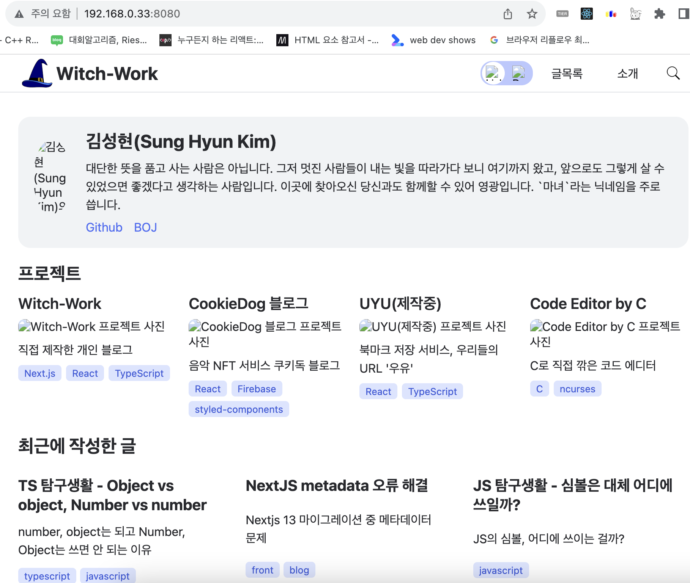

> 서버 구축은 처음이고 저보다 조금 먼저 서버를 구축한 [불칸](https://vulcan.site/)님의 많은 도움을 받아가며 만들어진 글이라 많이 부족할 수 있습니다. 틀리거나 보충해야 할 부분이 있다면 댓글로 알려주시면 감사하겠습니다.

> 이 글을 보고 홈서버를 세팅하려는 분이 계실지도 모르겠습니다. 제가 알고 있는 부분의 지식은 많은 생략이 있었기 때문에 네트워크에 대한 아주 기본적인 지식은 가지고 있어야 읽을 수 있습니다.

[홈 서버 만들기 - 초기 세팅, proxmox, pfsense](https://witch.work/posts/blog-home-server)에서 이어지는 글입니다.

# 1. 기초 설정

## 1.1. 컨테이너 만들기

LXC 컨테이너를 만드는 작업은 [나만의 홈서버 구축하기 - 1](https://velog.io/@kisuk623/Proxmox-%EC%84%A4%EC%B9%98%ED%95%98%EA%B8%B0)글을 참고하였습니다.

나는 이 홈서버를 산 목적이 애초에 블로그를 배포하기 위한 것이었으므로 proxmox에서 컨테이너를 만들어주자. 위의 링크를 참고하면 된다.

ID는 적당히 1001로 하고 이름은 `blog`로 지었다. 템플릿 OS는 Ubuntu 20.04로 선택했다. 참고로 CT를 만들 때 `General`항목에서 `unprivileged container`라는 체크박스가 있는데 이는 절대 해제하면 안된다. 커널과 컨테이너를 분리해서 보안성을 높여주는 기능이다.

나머지는 디폴트로 놓고 진행해도 된다. 다만 나는 컨테이너에 좀 더 많은 성능을 할당해주고 싶어서 코어 4개, 메모리 4GB로 설정했다. 이는 나중에 수정할 수 있으므로 크게 신경쓰지 않아도 된다. 단, 이를 늘릴 수는 있어도 줄이는 건 절대 쉽지 않다고 하니 주의하자.

## 1.2. 컨테이너 설정

해당 컨테이너에 접속해서 Console 메뉴에서 start 후 아까 입력한 아이디와 비밀번호를 입력하면 콘솔이 띄워진다. 이제 이 컨테이너에 필요한 패키지들을 설치해주자.

```bash
sudo apt-get update
sudo apt-get install git
sudo apt install nginx
```

블로그는 nextjs로 되어 있으므로 clone해우면 된다.

```bash
git clone MY_BLOG_URL
cd MY_BLOG_DIR
yarn
sudo n lts # nodejs 버전을 lts로 설정
sudo n prune  
```

여기서 2가지 선택지가 갈린다. 하나는 static export로 빌드하여 배포하는 것이고 하나는 Nodejs의 프로세스 매니저인 pm2를 사용하여 nextjs 서버를 백그라운드 프로세스에 열어 놓고 특정 포트 번호로 접속할 시 해당 nextjs 서버로 연결해주는 것이다.


나는 pm2를 사용하는 걸로 선택했다.

여기서 WAN IP 트래픽을 빌드 결과물 혹은 내부망의 특정 포트로 포트포워딩하는 방식도 여러 가지 선택할 수 있는데 나는 HAProxy를 이용했다. 다른 방식들도 있는데 일단 쭉 배포를 설명한 이후에 간단히 소개하겠다.

# 2. pm2로 서버 실행

말 그대로 process manager인 pm2를 이용해서 배포에 쓰일 페이지를 백그라운드 프로세스에 띄워놓고 특정 포트로 접속할 시 해당 프로세스로 연결해주는 방식이다. 이 섹션에서는 일단 해당 페이지를 띄우는 걸 해보도록 하겠다.

## 2.1. 무엇을 할 것인가

위에서 `output: 'export'` 설정을 한 걸 되돌리고 다시 proxmox 콘솔에서 `yarn run build`를 해보자. 

그리고 `yarn start`를 한 후 `blog 컨테이너의 내부 ip주소:start된 포트번호`에 접속해보자. 나같은 경우에는 `192.168.0.33:3000`이었다.

블로그가 빌드된 페이지가 잘 로딩되는 것을 볼 수 있다. 만약 외부 도메인을 해당 주소의 해당 포트에 연결한다면, 외부 도메인 접속 시 이 페이지가 뜰 것이다.

그럼 pm2는 무엇을 하느냐? 우리가 `yarn start`를 하면 이 페이지가 뜨는데 지금은 이렇게 하면 콘솔 창에서 `yarn start`의 결과가 뜨고 다른 콘솔 입력을 받을 수 없다. node가 싱글스레드라서 그렇다.

우리는 pm2를 이용하여 이 `yarn start`를 백그라운드 프로세스로 넘길 것이다.

[이렇게 하는 것의 이점 하나는 무중단 배포가 가능하다는 것이다.](https://engineering.linecorp.com/ko/blog/pm2-nodejs)

## 2.2. pm2 설정

pm2를 설치하자. (만약 뭔가 안된다면 sudo를 붙여서 해보자)

```bash
sudo yarn global add pm2
```

이렇게 하면 pm2가 `blog`라는 이름의 프로세스를 시작하고 그 프로세스에서 `yarn start`를 한다.

```bash
pm2 start yarn --name "blog" -- start
```

이렇게 하면 백그라운드에서 `yarn start`가 실행된다. 그래서 콘솔 창에는 아무것도 뜨지 않는데 `192.168.0.33:3000`으로 향하면 페이지는 실행되고 있다.

`pm2 status`를 입력하면 현재 pm2가 관리하고 있는 프로세스들의 상태를 볼 수 있다. `pm2 stop blog`를 입력하면 `blog`라는 이름의 프로세스를 종료할 수 있고 `pm2 delete blog`를 입력하면 `blog`라는 이름의 프로세스를 삭제할 수 있다. 수많은 다른 기능들이 있지만 일단 당장 필요한 것들만 하자.

```bash
# pm2 status 입력시 보이는 것
witch@blog:~/witch-next-blog$ pm2 status
┌──┬───────┬─────┬───┬───────┬─────┬─────────┐
│id│name   │mode │↺  │status │cpu  │memory   │
├──┼───────┼─────┼───┼───────┼─────┼─────────┤
│0 │blog   │fork │0  │online │0%   │81.4mb   │
└──┴───────┴─────┴───┴───────┴─────┴─────────┘
```

pm2를 시스템 리부트 시 자동으로 실행하고 현재의 프로세스를 재현하도록 하자. 먼저 다음 명령어를 입력한다.

```bash
pm2 startup
```

그럼 다음과 같은 메시지가 뜬다. 여기서 witch는 내가 만든 유저 이름이다.

```bash
[PM2] Init System found: systemd
[PM2] To setup the Startup Script, copy/paste the following command:
sudo env PATH=$PATH:/usr/local/bin /usr/local/share/.config/yarn/global/node_modules/pm2/bin/pm2 startup systemd -u witch --hp /home/witch
```

하라는 대로 `sudo~`로 시작하는 명령어를 복붙해 실행해준다. 그러면 메시지들이 쭉 뜨는데 마지막에 보면 `Freeze a process list on reboot via: pm2 save`라고 뜬다. 우리가 원하는 것이므로 `pm2 save`를 입력해준다.

```bash
pm2 save
```

앞으로의 배포 작업은 이 pm2를 이용해서 시작된 프로세스로 진행할 것이다.

### 2.2.1. 추가작업

3000번 포트는 너무 많이 쓰이기 때문에 `yarn start`를 할 때 쓰이는 포트를 바꿔주자. 나는 3141로 바꿨다. 그냥 원주율의 첫 4자리라서 그렇고 8080이나 [Cloudflare의 프록시에서 지원하는 포트 중 하나로 해도 좋겠다.](https://developers.cloudflare.com/fundamentals/reference/network-ports/)

`package.json`의 `scripts`에서 `start`를 다음과 같이 바꿔주자.

```json
  "scripts": {
    // ...
    "start": "next start -p 3141",
    // ...
  },
```

이를 git에 push하고 나서 proxmox 콘솔에서 pm2를 재시작해주자. 이후에 모든 배포 프로세스가 끝나고 나서도 페이지 수정사항이 있을 시 다음과 같은 커맨드를 실행해 주면 된다.

```bash
git pull origin main
yarn run build
pm2 restart blog
```

그러면 이제는 `192.168.0.33:3141`에서 빌드된 페이지가 보인다.

# 3. 외부 접속 설정

[이 섹션은 이 글을 대부분 참고하여 작성하였다.](https://www.linkedin.com/pulse/configuring-pfsense-firewall-haproxy-maximum-security-goldhammer/)

하지만 내부망에서만 이렇게 보여서야 별 의미가 없다. 외부망에서도 이 페이지로 접속할 수 있도록 해주자.

나는 haproxy를 써서 이 작업을 진행할 것이다. `blog.witch.work`로 접속했을 때 HTTPS를 통해서 방금 내부망에 띄운 저 페이지로 갈 수 있도록 설정해주자. acme와 haproxy를 같이 이용하면 HTTPS 설정까지 쉽게 할 수 있다. nginx에서 하나하나 설정해 주는 것보다 편하다.(물론 IP 주소를 통한 접속에 대해서 HTTPS 설정을 하고 싶으면 nginx를 써야 한다)

나는 cloudflare에서 도메인을 관리하고 있고, haproxy에서는 cloudflare와 연동해서 설정할 수 있는 기능을 매우 잘 제공한다. 따라서 이를 사용한다. 다만 아직 실제 블로그 배포를 하기에는 해결해야 할 여러 문제가 있기 때문에 예전에 만들어둔 서브도메인을 통해서 실험하도록 하겠다.

[cloudflare에서 서브도메인을 만드는 것에 대해서는 이전에 쓴 글을 참고할 수 있다.](https://witch.work/posts/cloudflare-make-subdomain)

## 3.1. Cloudflare 설정

Cloudflare에 접속하여 내 도메인에 접속한다. 그러면 도메인에 연결된 DNS들이 나오는데 우리는 여기서 `blog`서브도메인을 사용할 것이다. 따라서 도메인 리스트에서 `blog`를 선택해 편집하자.


프록시를 끄고 Target을 `1.1.1.1`로 바꾼다. 이는 haproxy에서 cloudflare와 연동하면서 알아서 바꿔줄 것이다.


> 만약 자동으로 변경되지 않는다면 cloudflare에서 DNS IP를 내가 가진 WAN IP로 수동으로 다시 설정해주면 된다.

## 3.2. acme 세팅

pfsense에서 System - Advanced - Admin Access에서 TCP Port는 기본적으로 443으로 되어 있을 텐데 이를 다른 포트로 적당히 바꿔준다. 나는 12443으로 했다.

이렇게 바꿔주고 나면 pfsense 접속을 위해 12443 포트를 사용하게 된다. 원래는 `192.168.0.5`로 접속해서 pfsense를 사용했는데 `192.168.0.5:12443`으로 접속하는 것이다.

그리고 System - Package Manager - Available Packages에서 acme와 HAProxy를 설치한다. 나는 이전 글에서 했으니 생략한다.

Services - Acme Certificates - General settings에서 Cron entry를 체크하면 자동으로 인증서가 갱신되게 할 수도 있다. 원하면 체크하자.

그 다음 Services - Acme Certificates - Account keys에 들어가서 add를 누르고 account key를 생성하자. 적당히 이름과 설명을 입력하고 이메일을 입력한다. 그리고 `Create Account Key`를 누르면 account key가 생성된다. `Register ACME account key`를 누르면 이 key가 등록된다.


그다음 Services - Acme Certificates - Certificates에 들어가서 add를 누르고 이름과 설명을 적당히 입력하고 Acme Account는 방금 만든 것을 선택한다.

Private key는 384-bit ECDSA로 설정하고 OCSP Must Staple은 체크해준다.


Domain SAN list를 설정해 줘야 한다. `+ Add`를 클릭하고 method는 `DNS - Cloudflare`로 선택한다. 
나는 `witch.work`와 `*.witch.work`를 추가했다. 이렇게 하면 witch.work와 모든 서브도메인에 대한 인증서가 추가된다.


입력해야 할 Key가 많은데 Cloudflare API Keys는 Cloudflare에서 My profile에 들어간 후 왼쪽 메뉴의 API Tokens - Global API Key에서 찾을 수 있다. Email은 cloudflare에 등록한 이메일을 입력하면 된다.

Token은 API Token인데 역시 Cloudflare에서 My profile에 들어간 후 왼쪽 메뉴의 API Tokens - Create Token에서 만들 수 있다. 여기서는 `Edit zone DNS`를 체크해준다. 이 토큰은 한번 만들면 Cloudflare에서는 다시 볼 수 없으므로 한번 복사해서 잘 입력해두자. 하지만 한번 이렇게 잘 입력해 두면 pfsense에서 다시 볼 수 있으므로 굳이 어디 따로 저장해 둘 필요는 없다.

Account ID, Zone ID는 도메인 메뉴에 들어가서 우측 메뉴의 스크롤을 내리면 Quick Actions, Domain Registration, Active Subscriptions, Support Resourcesd 아래에 API라는 메뉴가 있는데 거기에서 둘 다 찾을 수 있다. 그걸 복붙해서 입력하면 된다.

그리고 Actions list에서 다음과 같은 커맨드를 추가하자. 이는 인증서 갱신 시에 자동으로 haproxy를 재시작해서 새 인증서가 적용되도록 하는 것이다.


이렇게 하고 저장한 후 메뉴에서 `Issue/Renew`를 클릭하면 뭔가 로딩되다가 초록색 알림 창에 많은 텍스트가 뜨는데 `Reload success`가 알림창 마지막에 나오면 성공이다.

이러면 `*.witch.work`에 해당하는 도메인 중 Cloudflare에서 DNS를 pfsense 쪽으로 연결해준 도메인들에 대해서 인증서가 사용된다.

`Issue/Renew`클릭시 다음과 같은 메시지가 뜰 수도 있는데 너무 많이 인증서를 요청해서 그런 것이다. 이때 메시지를 잘 읽어보면 언제 이후에 다시 시도하라는 말이 있는데 그렇게 하면 된다.

```
An unexpected error occurred:
There were too many requests of a given type :: Error creating new order :: too many certificates (5) already issued for this exact set of domains in the last 168 hours: <my-domain>: see https://letsencrypt.org/docs/rate-limits/
```

## 3.3. HAProxy 설정

### 3.3.1. Settings

이제 HAProxy를 설정해주자. Services - HAProxy - Settings에 들어가서 Global parameters에서 `Enable HAProxy`를 체크해주자.

그리고 Logging에서 Remote Syslog host를 `/var/run/log`로 한다. 안해도 큰 상관은 없다.

Max SSL Diffie-Hellman size는 2048로 되어 있을 텐데 이를 4096으로 바꾼다. SSL/TLS Compatibility Mode는 Intermediate로 설정한다.

### 3.3.2. Backend

Services - HAProxy - Backend에 들어가서 Add를 누르고 다음과 같이 이름을 적당히 지어준다.

Server list에는 앞으로 우리가 외부와 연결할 모든 서버들을 추가하면 된다. 여기서는 내가 연결할 내부 포트 IP와 포트번호(3141)를 적어주었다. 여기서 SSL 암호화를 안하더라도 내부 트래픽이 암호화되지 않을 뿐 여전히 프론트엔드 서버는 HTTPS이므로 상관없다.


health check는 딱히 안해도 잘 된다. 이렇게 하고 저장하자.

### 3.3.3. Frontend

Services - HAProxy - Frontend에 들어가자. 먼저 http를 https로 리다이렉션하는 규칙을 설정해주자. `Add`를 누르고 다음과 같이 이름과 설명을 적당히 적어 준다. 그다음 external address 포트를 80으로 적어주고 offloading SSL을 체크 해제한다. Type은 `http / https(offloading)`로 설정한다.


다른 프론트엔드 리스너를 하나 만들자. 이 리스너는 443포트로 들어온 https 트래픽을 핸들링하고 [SSL 오프로딩](https://minholee93.tistory.com/entry/SSL-offloading-%EC%9D%B4%EB%9E%80-%EB%AC%B4%EC%97%87%EC%9D%BC%EA%B9%8C)을 한다.

그러니 이는 포트를 443으로 지정하고 SSL 오프로딩을 체크한 후 Type은 `http / https(offloading)`로 설정한다. 역시 이름과 설명은 적당히.


Access Control List를 설정해줄 차례다. 어떤 도메인으로 들어오는지에 따라서 다른 서버로 연결해주기 위함이다.

우리가 해야 하는 건 `blog.witch.work`로 들어오는 트래픽을 방금 만든 `my-backend` 서버로 연결해주는 것이다.

Access Control list의 name과 Actions의 Condition acl names이 같은 것끼리 연결된다는 것에 주의해서 해당 섹션을 다음과 같이 설정해주자. `cs.witch.work`는 내가 이전에 설정한 것이니 무시하면 된다.


그렇게 설정 후 아래로 내려보면 Advanced settings 항목이 있는데 여기의 `Advanced pass thru`부분에 다음과 같은 값을 입력해준다. 응답 헤더를 추가해 주는 것이다.

```
http-response set-header strict-transport-security "max-age=31536000;includeSubDomains;preload;"
```

그다음 SSL Offloading에서는 Certificate을 아까 만든 acme 인증서로 추가하고 Add ACL for certificate Subject Alternative Names를 체크 후 Additional certificate을 추가한다. 이는 위의 certificate에서 추가한 것과 같은 인증서를 추가하면 된다.

Advanced ssl options에는 보안 강화를 위해 다음 문구를 작성한다.

```
curves secp384r1:secp521r1 ciphers ECDHE-RSA-AES256-GCM-SHA384:DHE-RSA-AES256-GCM-SHA384:ECDHE-RSA-CHACHA20-POLY1305:ECDHE-ECDSA-CHACHA20-POLY1305:ECDHE-ECDSA-AES256-GCM-SHA384 ciphersuites TLS_AES_256_GCM_SHA384:TLS_CHACHA20_POLY1305_SHA256
```

여기까지 설정하면 ssl offloading 설정이 완료된다.


## 3.4. rules 설정

이제 트래픽을 받을 규칙을 설정해 줘야 한다.

firewall - rules - WAN에 들어가서 rule을 추가하자.

이제 HTTP, HTTPS 요청을 받을 규칙을 만들어 줘야 한다. 원래 pfsense firewall은 외부에서 오는 모든 트래픽을 막는다. 이를 오버라이드해서 외부에서 오는 트래픽을 받을 수 있도록 하는 것이다. HTTP를 위한 80포트 규칙, HTTPS를 위한 443포트 규칙을 만들어주자.

Interface는 WAN으로 하고 프로토콜은 TCP/UDP로 한다.(TCP로 해도 별 상관은 없다) 그 다음 Destination을 `This firewall(self)`로 설정하고 포트번호는 http rule인지 https rule인지에 따라 80 혹은 443으로 한다. 설명은 `allow for http`, `allow for https`로 적었다. 예를 들어 allow for https의 경우 다음과 같이 설정하면 된다.


그러면 다음과 같이 규칙들이 생성되게 된다.


> 만약 잘 안되면 Destination을 `WAN address`로 설정해보자.

외부에서 pfsense가 트래픽을 받을 규칙도 설정해 줄 수 있다. 이는 pfsense가 트래픽을 받을 규칙이므로 Destination은 WAN address, 포트번호는 아까 만들었던 12443으로 한다. 설명은 `allow for pfsense ports`로 적었다. 다만 이렇게 하면 `WAN IP:12443`으로 나의 pfsense에 접속할 수 있게 되는 거라서 그렇게 좋지는 않다.

다음과 같이 rule이 만들어진다. 설정을 변경한 부분은 빨갛게 표시하였다.


여기까지 거치면 사용자가 내 도메인 `blog.witch.work`에 접속시 맨 처음 `yarn start`로 pm2에서 실행한 페이지로 도달하게 되는데 그 과정은 다음과 같다.


## 3.5. ssllab 테스트

[ssllabs에서는 웹서버의 ssl 설정을 테스트하고 점수를 매겨준다.](https://www.ssllabs.com/ssltest/index.html) 위처럼 설정한 사이트의 경우 A+를 받을 수 있다.


또한 [해당 페이지 링크](https://blog.witch.work/)에도 잘 접속되는 것을 볼 수 있었다.

## 3.6. 만약 안되면?

만약 안되면 pfsense를 한번 껐다 켜 보자. 나는 그러니까 해결된 문제들이 많았다.

pfsense에서 diagnotics - reboot에서 할 수 있다.


# 4. HTTP2 설정

haproxy는 기본적으로 HTTP1.1이다. 따라서 lighthouse 진단을 하게 되면 HTTP2를 쓰는 게 좋다는 진단을 내려준다.

Services - HAproxy - Frontend에서 내가 사용하는 Frontend Rule을 찾는다. 그리고 해당 rule의 `SSL Offloading`항목에 보면 Advanced certificate specific ssl options라는 곳이 있는데 거기 다음과 같은 문구를 입력하면 HAProxy가 HTTP2로 설정된다.

```
alpn h2,http/1.1 ciphers EECDH+aRSA+AES:TLSv1+kRSA+AES:TLSv1+kRSA+3DES ecdhe secp256k1
```

# 5. 번외 - 다른 방법들

## 5.1. static export 배포

위에서는 pm2를 이용해 백그라운드 프로세스에서 `yarn start`를 실행시키고 사용자가 해당 서버에 접속하도록 했다. 하지만 static export 형식으로 페이지를 빌드하여 사용자가 그렇게 빌드된 결과물 즉 `index.html`을 보도록 하는 것도 가능하다.

아까 클론한 블로그 폴더에서 `yarn run build`를 입력하면 빌드가 된다.

```bash
yarn run build
```

이때 nextjs의 기본 빌드 경로는 `.next`인데 [static export](https://nextjs.org/docs/pages/building-your-application/deploying/static-exports)로 배포할 것이므로 빌드 형식을 따로 지정해 줘야 한다.

`next.config.js`의 `nextConfig`에서 `output: 'export'` 프로퍼티를 추가해 주면 된다.

```js
// next.config.js
// nextjs 공식 문서에서 가져왔다.
const nextConfig = {
  output: 'export',
 
  // Optional: Change links `/me` -> `/me/` and emit `/me.html` -> `/me/index.html`
  // trailingSlash: true,
 
  // Optional: Prevent automatic `/me` -> `/me/`, instead preserve `href`
  // skipTrailingSlashRedirect: true,
 
  // Optional: Change the output directory `out` -> `dist`
  // distDir: 'dist',
}
```

이렇게 하면 `yarn run build`를 했을 때 `.next`가 아닌 `out` 폴더가 생성된다(물론 이것도 `distDir`프로퍼티로 바꿀 수 있다). 어쨌든 이렇게 빌드가 static export된 폴더를 nginx에 연결해주면 된다. 이를 위해서는 nginx 설정 파일을 좀 만져주자.

```bash
sudo nano /etc/nginx/sites-available/static.site
```

그리고 다음과 같이 작성해주자. 나는 빌드 파일 경로를 따로 바꿔주지 않았으므로 빌드폴더 경로는 `블로그_폴더_경로/out`이다. 그리고 git에는 안 올라가 있을 `.env`파일도 넣어주는 걸 잊지 말자.

```bash
server {
  listen PORT_NUMBER;
  server_name 0.0.0.0;
  charset utf-8;

  location / {
    root 빌드파일_경로;
    index index.html index.htm;
    try_files $uri $uri.html $uri/ =404;
  }
}
```

그리고 심볼릭 링크를 연결해 준 후 nginx 테스트, 성공시 리로드한다.

```bash
sudo ln -s /etc/nginx/sites-available/static.site /etc/nginx/sites-enabled/
sudo nginx -t
sudo service nginx reload
```

이제 `ip a`로 입력하면 나오는 내부망 ip + 포트번호로 접속하면 블로그가 뜬다. 외부망 접속도 해야 하지만 일단은 블로그를 띄우는 데 성공한 것이다.



이렇게 띄운 nextjs 페이지를 보면 이미지가 나와있지 않다. 이는 Nextjs의 이미지 컴포넌트가 static export에서 제대로 작동하지 않기 때문이다. 이를 해결하기 위해서는 따로 이미지 로더를 지정해 주어야 한다. 이는 공식 문서에 잘 설명되어 있으므로 링크로 대체한다.

[static export - Image Optimization](https://nextjs.org/docs/pages/building-your-application/deploying/static-exports#image-optimization)

## 5.2. 다른 포트포워딩 방법들

위에서는 HAProxy에서 외부의 특정 포트로 들어온 요청을 내부의 포트로 연결해 주었다. 그런데 pfsense에서도, nginx에서도 비슷한 일을 할 수 있어 방법을 간단히만 적어둔다. 대강 해본 것이라 완전히 잘 작동하지는 않을 수도 있다.

### 5.2.1. pfsense에서 포트포워딩

[pfsense에서 포트포워딩하는 방법에 대한 서버포럼 글이 있어 이를 참고하였다.](https://svrforum.com/svr/27343)

먼저 pfsense에 접속해서 상단 메뉴의 `Interfaces` -> `WAN` 를 클릭한다. 그리고 제일 하단으로 내려가서 `Block private networks and loopback addresses`를 체크 해제한다.

그다음에는 `Firewall` -> `NAT` -> `Port Forward`를 클릭한다. `Add(위쪽 방향 화살표)`를 눌러서 다음과 같이 입력한다.

이 포트포워딩의 목적이 WAN 주소의 특정 포트로 들어오는 접속을 내부 IP의 특정 포트로 연결해 주기 위한 것이므로 이 부분만 설정해 주면 된다. 나는 WAN IP의 8080 포트로 들어오는 접속을 내부 IP의 3141 포트로(내부 IP의 다른 포트를 사용하고 있다면 해당 포트로) 연결해 줄 것이다.


이를 설정하고 적용 후 WAN IP의 8080포트로 접속하면 아까 만들어진 블로그 페이지가 뜨게 된다.

### 5.2.2. nginx 포트포워딩

nginx에서도 포트포워딩 설정을 해줄 수 있다. 여기서 쓰이지는 않겠지만.

```bash
sudo nano /etc/nginx/sites-available/static.site
```

해당 파일을 다음과 같이 변경한다. 모든 IP에서 오는 8080 포트로 들어오는 접속을 내부망의 3141 포트로 연결해주는 것이다. 내 배포 방식에서는 HAProxy가 해당 역할을 해줄 것이므로 큰 의미는 없다.

```bash
server {
    listen 8080;
    server_name _;

    location / {
        proxy_pass http://localhost:3141;
        proxy_set_header Host $host;
        proxy_http_version 1.1;
        proxy_set_header Upgrade $http_upgrade;
        proxy_set_header Connection 'upgrade';
        proxy_cache_bypass $http_upgrade;
    }

    charset utf-8;
}
```

## 5.2.3. 트러블슈팅 - 내 컴퓨터에서만 접속이 안된다

그런데 문제가 생겼다. 다른 사람이 접속했을 때나 내 핸드폰 데이터, 아무튼 내가 배포하고 있는 서버 네트워크가 아닌 다른 네트워크에서는 접속이 잘 되는데 내 서버 네트워크, 그러니까 서버와 같은 IP를 쓰는 네트워크에서는 접속이 안된다. 

해결법은 내 IP로 접속할 때에 대한 설정을 해주면 된다. 이는 System - Advanced - Firewall & NAT에서 Network Address Translation에서 할 수 있다. 먼저 `NAT Reflection mode for port forwards`을 pure NAT로 바꾼다. 나는 원래 disabled로 되어 있었다.

이를 활성화하면 NAT 규칙만 사용하여 포트포워딩을 하게 되는데 여기 서버가 클라이언트와 동일한 서브넷에 있는 경우에 대한 옵션을 더 설정할 수 있다. 좀더 아래로 내리면 나오는 `Enable automatic outbound NAT for Reflection`을 체크하면 된다.


[이 옵션들에 대한 더 자세한 설명은 공식 문서를 참고할 수 있다.](https://docs.netgate.com/pfsense/en/latest/nat/reflection.html)

# 다음 글

아직 빌드도 자동이 아니고 방화벽 설정과 최적화 같은 것도 안되어 있어서 다음 섹션에서는 그런 부분들을 해결해보도록 하겠다.

- 방화벽 설정
- 빌드 자동화
- standalone 배포 등 최적화

# 참고

gatsby로 블로그 만들기 (https://vulcan.site/blog-gatsby/)

나만의 홈서버 구축하기 - 1 https://velog.io/@kisuk623/Proxmox-%EC%84%A4%EC%B9%98%ED%95%98%EA%B8%B0

Pfsense에서 포트포워딩(NAT)하기 https://svrforum.com/svr/27343

Nginx를 이용하여 https 적용하는 법 https://gist.github.com/woorim960/dda0bc85599f61a025bb8ac471dfaf7a

Configuring pfSense firewall and HAProxy for maximum security rating at SSLLabs
https://www.linkedin.com/pulse/configuring-pfsense-firewall-haproxy-maximum-security-goldhammer/

Installing HAProxy on pfSense with SSL access to web server https://gainanov.pro/eng-blog/linux/installing-haproxy-pfsense/

SSL 오프로딩 https://minholee93.tistory.com/entry/SSL-offloading-%EC%9D%B4%EB%9E%80-%EB%AC%B4%EC%97%87%EC%9D%BC%EA%B9%8C

How to Deploy a Next.js app to a Custom Server - NOT Vercel! (Full Beginner Tutorial) https://www.youtube.com/watch?app=desktop&v=HIb4Ucs_foQ

PM2를 활용한 Node.js 무중단 서비스하기 https://engineering.linecorp.com/ko/blog/pm2-nodejs

https://www.lesstif.com/javascript/pm2-system-rebooting-125305469.html

Setup a Next.js project with PM2, Nginx and Yarn on Ubuntu 18.04 https://www.willandskill.se/en/articles/setup-a-next-js-project-with-pm2-nginx-and-yarn-on-ubuntu-18-04

pfSense 와 함께 인터넷 사용하기
https://blog.skylightqp.kr/292

cloudflare network port https://developers.cloudflare.com/fundamentals/reference/network-ports/

Lawrence Systems -
How To Guide For HAProxy and Let's Encrypt on pfSense: Detailed Steps for Setting Up Reverse Proxy https://www.youtube.com/watch?v=bU85dgHSb2E

How to activate HTTP2 on pfsense haproxy https://techoverflow.net/2020/12/29/how-to-activate-http2-on-pfsense-haproxy/