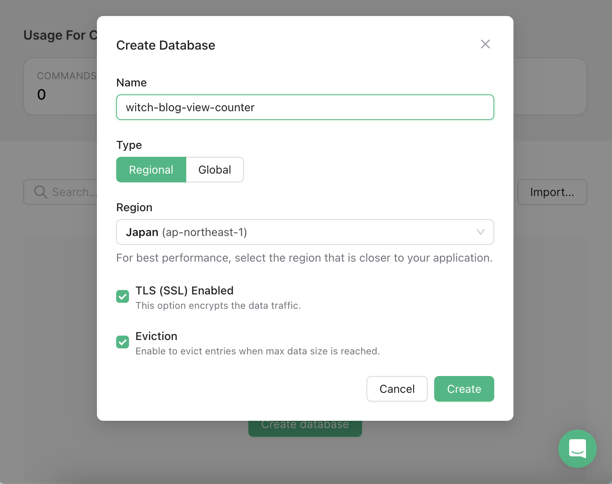

# 시작

이전에 블로그를 만들면서 [블로그 만들기 - 11. 글 조회수 달기](https://witch.work/posts/blog-remake-11)에서 조회수 카운터를 달았던 바 있다. 하지만 수많은 오류 등으로 인해 슬쩍 없애 버렸었다. 이를 다시 만들어 주도록 하겠다.

[Adding a View Counter to your Next.js Blog](https://upstash.com/blog/nextjs13-approuter-view-counter)라는 글을 참고하였다.

[upstash Redis](https://upstash.com/)가 하루에 10000회의 무료 사용량이 있고 NoSQL이라 key-value 기반이므로 조회수 카운터에 적합하다고 보았다. 또한 upstash 공식 블로그 글이라 신뢰도가 높다고 판단하였다.

# 1. 기본 설정

먼저 upstash 로그인을 하고(나는 구글 로그인을 썼다) [upstash 콘솔](https://console.upstash.com/)에서 새로운 데이터베이스를 만들어 주자. 이름은 `witch-blog-view-counter`로 하고 리전은 가장 가까울 것 같은 일본 리전으로 선택하였다.

트래픽 SSL 암호화와 max size를 초과하는 요청을 거부하는 설정이 있길래 켜두었다.



그리고 DB 대시보드에 나오는 REST 연결 정보 중 `.env`항목을 `.env.local`에 추가해 주자.

```ini
UPSTASH_REDIS_REST_URL=...
UPSTASH_REDIS_REST_TOKEN=...
```

그리고 redis 패키지를 설치하자. 이걸로 기본적인 준비는 끝났다.

```bash
yarn add @upstash/redis
```

# 2. 조회수 증가 로직

라우트 핸들러를 만들어서 조회수를 증가시키는 로직을 만들자. `app/viewcount/route.ts`를 만들어서 `/viewcount`에서 post 요청을 받도록 한다.

`Redis.fromEnv()`는 환경 변수에서 `UPSTASH_REDIS_REST_URL`, `UPSTASH_REDIS_REST_TOKEN`을 자동으로 읽어와서 Redis 인스턴스를 만들어 준다.

request body에서 `slug`를 받아서 `pageviews:projects:${slug}` 키의 값을 1 증가시킨다. `incr`은 키가 없을 경우 0으로 초기화하고 1을 더해주는 동작을 한다.

```ts
// app/viewcount/route.ts
import { Redis } from '@upstash/redis';
import { NextRequest, NextResponse } from 'next/server';

const redis = Redis.fromEnv();

export async function POST(request: NextRequest): Promise<NextResponse> {
  const body = await request.json();
  const slug = body.slug as string | undefined;

  // body에 slug가 없을 경우
  if (!slug) {
    return new NextResponse('Slug not found', { status: 400 });
  }

  await redis.incr(['pageviews', 'projects', slug].join(':'));
  return new NextResponse(null, { status: 202 });
}
```

## 2.1. 중복 방지

그런데 지금의 조회수 증가 로직은 중복 요청에 대한 처리가 없다. 이를 해결하기 위해 유저의 IP 주소를 기준으로 중복 요청을 막아주자.

이는 `request.ip` 혹은 `X-Fowarded-For` 헤더를 이용하여 구현할 수 있다. 이를 사용자가 변조할 수 있는 건 맞는데 조회수 카운터를 아주 정확하게 관리하려고 하는 것은 아니므로 이 정도로도 충분하다.

다만 IP 주소를 그대로 저장하면 보안 문제가 있을 수 있다고 하므로 해싱하여 저장하자. 이를 위해 `crypto` 패키지를 사용하자. ip의 해시값은 다음과 같이 만들 수 있다.

```ts
const ip = request.ip ?? request.headers.get('X-Forwarded-For');

if (ip) {
  // Hash the IP and turn it into a hex string
  const buf = await crypto.subtle.digest('SHA-256', new TextEncoder().encode(ip));
  const hash = Array.from(new Uint8Array(buf))
    .map((b) => b.toString(16).padStart(2, '0'))
    .join('');

  // ...
}
```

그리고 `deduplicate:`로 시작하는 키를 만들고 값을 true로 설정하는 `set`요청을 보내자. 또한 키가 `60*60`초 즉 1시간 동안 유지되며 키가 만료되었을 시에만 값을 쓰도록 하자. 이는 `NX`와 expire time을 나타내는 `EX` 옵션을 사용하여 구현할 수 있다.

또한 만약 ip 중복이 아니거나 ip가 없을 경우에만 조회수를 증가시키도록 하자. 이를 전부 구현한 `POST` 핸들러는 다음과 같다.

```ts
export async function POST(request: NextRequest): Promise<NextResponse> {
  const body = await request.json();
  const slug = body.slug as string | undefined;

  if (!slug) {
    return new NextResponse('Slug not found', { status: 400 });
  }

  const ip = request.ip ?? request.headers.get('X-Forwarded-For');

  if (ip) {
  // Hash the IP and turn it into a hex string
    const buf = await crypto.subtle.digest('SHA-256', new TextEncoder().encode(ip));
    const hash = Array.from(new Uint8Array(buf))
      .map((b) => b.toString(16).padStart(2, '0'))
      .join('');

    const isNewView = await redis.set(['deduplicate', hash, slug].join(':'), true, {
      nx: true,
      ex: 60 * 60,
    });
    if (!isNewView) {
      return new NextResponse(null, { status: 202 });
    }
  }

  await redis.incr(['pageviews', 'projects', slug].join(':'));

  return new NextResponse(null, { status: 202 });
}
```

## 2.2. 조회수 증가 컴포넌트

조회수를 증가시키는 작업을 하는 컴포넌트를 만들자. `ViewReporter` 라는 컴포넌트에서 props로 `slug`를 받아서 작업할 것이다. `useEffect` 훅을 사용하므로 클라이언트 컴포넌트로 만들어 줘야 하고, 특별히 렌더링할 것이 없으므로 `null`을 반환하도록 하자.

```tsx
// components/ViewReporter.tsx
'use client';

import { useEffect } from 'react';

function ViewReporter({ slug }: {slug: string}) {
  useEffect(() => {
    fetch('/viewcount', {
      method: 'POST',
      headers: {
        'Content-Type': 'application/json',
      },
      body: JSON.stringify({ slug }),
    });
  }, [slug]);

  return null;
}

export default ViewReporter;
```

# 3. 조회수 카운터 적용

그럼 조회수는 어디서, 무엇에 대하여 체크해야 할까? 일단 홈 페이지에서는 전체 방문자 수를 보여주고 각 글에 대해서는 조회수를 보여주도록 하겠다.

## 3.1. 전체 방문 수

블로그의 전체 방문자 수를 집계하려면 nextjs의 루트 레이아웃에 `ViewReporter`를 적용하면 된다. slug는 적당히 `witch-blog:total-views`로 했다.

```tsx
// app/layout.tsx
export const totalViewSlug = 'witch-blog:total-views';

export default async function RootLayout({
  // Layouts must accept a children prop.
  // This will be populated with nested layouts or pages
  children,
}: {
  children: React.ReactNode
}) {
  // await generateRssFeed();

  return (
    <html lang='en' style={{ colorScheme:'dark' }} suppressHydrationWarning>
      <body>
          <ViewReporter slug={totalViewSlug} />
          {/* ...생략... */}
      </body>
    </html>
  );
}
```

## 3.2. 전체 방문 수 보여주기

전체 방문 수를 보여주기 위한 단순한 컴포넌트를 만든다. `ViewCounter`라는 컴포넌트이다.

```tsx
function ViewCounter({ view }: {view: number}) {
  return (
    <p className={styles.counter}>전체 방문: {view}회</p>
  );
}
```

그리고 홈페이지에서는 전체 방문자 수에 해당하는 slug의 조회수 값을 가져와서 보여주도록 하자. 이때 라우트 캐시의 revalidate 시간도 60초로 설정해주자.

```tsx
const redis = Redis.fromEnv();

// cache revalidate time
export const revalidate = 60;

async function Home() {
  const totalViews = await redis.get<number>(['pageviews', 'projects', totalViewSlug].join(':')) ?? 0;
  return (
    <>
      <ViewCounter view={totalViews} />
      {/* ...생략... */}
    </>
  );
}
```

## 3.3. 글 조회수

현재 블로그의 글 내용을 보여주는 컴포넌트는 `app/posts/[slug]/page.tsx`에 있으므로 여기에서 `[slug]`에 대한 조회수를 늘려주고 또한 보여주면 된다.

```tsx
type Props={
  params: {slug: string}
};

const redis = Redis.fromEnv();

export const revalidate = 60;

async function PostPage({ params }: Props) {
  // 기타 블로그 로직 생략 

  const slug = params.slug;

  const totalViews = await redis.get<number>(['pageviews', 'projects', slug].join(':')) ?? 1;
  
  return (
    <>
      <ViewReporter slug={slug} />
      <ViewCounter view={totalViews} />
      {/* ...생략... */}
    </>
  );
}

export default PostPage;
```

블로그 글의 인기순 정렬이나 조회수가 높은 글을 보여주는 등 조회수를 통한 기능을 이후 추가할 수도 있을 것이다. DB 기준의 조회수가 좀더 쌓이면 고려해 보려고 한다.

# 참고

[Adding a View Counter to your Next.js Blog](https://upstash.com/blog/nextjs13-approuter-view-counter)

[Nextjs Route Handlers 공식 문서](https://nextjs.org/docs/app/building-your-application/routing/route-handlers)

[NextRequest 공식 문서](https://nextjs.org/docs/app/api-reference/functions/next-request)

[한 땀 한 땀 블로그 만들기 - 조회수 세기](https://solidw.github.io/posts/how-to-make-blog-views-count)

[upstash 공식 문서 - Quickstarts nextjs 13](https://upstash.com/docs/redis/quickstarts/nextjs13)

[upstash-redis README](https://github.com/upstash/upstash-redis)

[redis incr](https://redis.io/commands/incr/)

[redis set](https://redis.io/commands/set/)