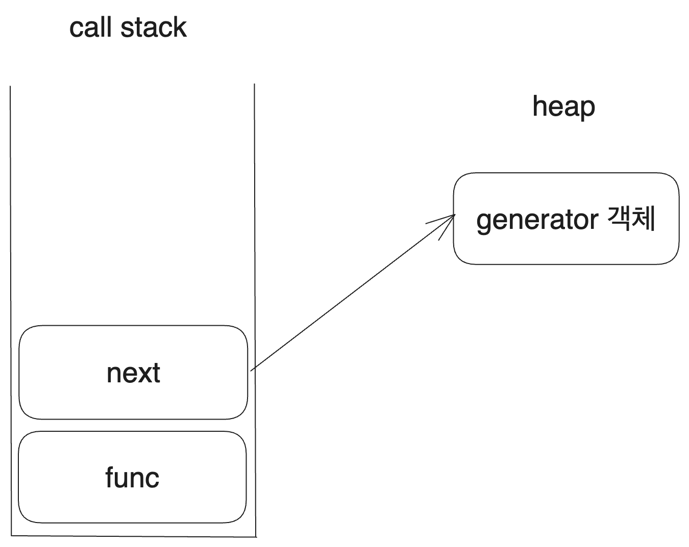

- 2023.7.27 작성
- 2024.4.23 수정

# 0. 개요

최근에 [What color is your function?을 읽고 글을 작성하였다. 비동기 프로그래밍과 콜스택 관리에 관한 글이었다.](https://witch.work/posts/callstack-and-async)

그런데 같은 블로그에 반복과 동시성의 연관관계를 다룬 [Iteration Inside and Out](http://journal.stuffwithstuff.com/2013/01/13/iteration-inside-and-out/), [그리고 해당 글의 2번째 시리즈](http://journal.stuffwithstuff.com/2013/02/24/iteration-inside-and-out-part-2/)도 상당히 흥미로워 이를 읽고 하나의 글을 더 쓴다.

해당 글에는 다른 언어로 된 예시가 꽤 많은데 JS로 최대한 바꿔 쓰도록 노력했다. 원문의 Ruby, C# 등을 잘 알지는 못하여 부족한 부분이 있을 수 있지만 글의 내용을 보아 저자가 말하고자 하는 바는 최대한 옮기고자 했다.

이 시리즈는 반복문이라는 간단해 보이는 작업을 스레드 간의 통신으로 해석할 수 있고 따라서 동시성에까지 가닿아 있다는 것을 알려준다. 동시성이라는 이슈가 생각도 못한 부분까지 닿아 있다는 걸 알 수 있는 글이었다.

**예시 코드의 언어는 특별한 언급이 없는 한 JS다.**

# 1. 시작

대부분의 개발자들은 어떤 것을 반복하는 문법이 프로그래밍 언어에서 아주 간단한 문제라고 생각할 것이다. 50년 전의 컴퓨터에서 작동하던 FORTRAN에서조차도 이러한 반복문이 이미 존재했을 정도니까 당연한 생각이다. 참고로 FORTRAN의 반복문은 다음과 같이 작동하였다.

```c
do i=1, 10
  print i
end do
```

그럼 우리가 새로운 프로그래밍 언어를 만들고 있고 반복문을 추가하고 있다면 이렇게 하면 되지 않을까?

1. 다른 언어들의 반복문을 조사한다.
2. 그중 가장 좋아 보이는 것을 고른다.
3. 그것을 내 프로그래밍 언어에 추가한다.

문제는 이렇게 반복문을 만드는 것이 단순히 몇 번 같은 작업을 반복하거나 특정 숫자 범위만 왔다갔다하는 문제가 아니라는 것이다.

원초적인 질문으로 돌아가서, 반복(iteration)이란 대체 무엇인가? 우리는 다음과 같은 간단한 반복문을 생각할 수 있다.

```js
for (let i = 0; i < 10; i++) {
  console.log(i);
}
```

하지만 이런 반복도 있지 않은가? JS에서는 `for..of`와 같이 객체의 원소 전체를 반복하는 반복문도 있다. JS가 특별한 것도 아니고 Python이나 C++도 이런 기능을 지원한다.

```js
const fruits=["사과", "바나나", "포도"];

for(const fruit of fruits){
  console.log(fruit);
}
```

그럼 꼭 for문의 형태를 해야 하는가? JS의 `forEach`같은 건 어떤가? 객체의 원소 전체를 반복하며, 그 원소들에 대해 콜백 함수를 실행한다.

```js
const fruits=["사과", "바나나", "포도"];

fruits.forEach((fruit)=>console.log(fruit));
```

반복을 어떤 추상적인 시퀀스에 대하여 그것을 순회하는 것으로 생각한다면 트리 형태로 되어 있는 객체를 순회하는 것은 어떤가? 아니면 소수 전체를 순회하면서 어떤 조건을 만족하는 소수가 나올 때까지 연산하는 것은? 이런 문제들을 전부 어떻게 처리할 것인가? 반복은 그렇게 쉬운 문제가 아니다.

먼저 반복문에는 2가지의 다른 스타일인 internal iteration과 external iteration이 있는데 이것들부터 알아보자. 각각은 서로의 명확한 장단점이 있다.

# 2. External Iteration : 함수가 객체를 호출한다

external iteration는 말 그대로 외부에서 반복자(iterator)를 제어하는 것이다. 객체에는 반복자가 있고, 다음 원소에 접근할 수 있는 방법이 있다. 그리고 외부에서는 그 반복자를 제어하면서 해당 반복자의 값에 어떤 조작을 가한다.

C++, Java, C#, Python, PHP등의 많은 언어에서 사용한다. for, foreach(`forEach`와 같은 메서드가 아니라 객체의 전체 원소를 순회하는 것을 일반적으로 칭한 단어이다) 문을 제공한다. JS라면 다음과 같을 것이다.

```js
for (let i = 0; i < 10; i++) {
  console.log(i);
}

const fruits = ["사과", "바나나", "포도"];
for (const i of fruits) {
  console.log(i);
}
```

위에서 `fruits` 배열을 순회하는 코드는 실제로는 잘 알려진 심볼 `[Symbol.iterator]()`메서드를 이용해 동작한다. 간단히 흉내내 보면 다음과 같다. 물론 이 흉내를 위해 제너레이터를 사용할 수도 있고 이 또한 이후에 다루겠지만 지금의 핵심은 아니다.

```js
let fruits = ["사과", "바나나", "포도"];
let iter = fruits[Symbol.iterator]();
let i;
while (i = iter.next()) {
  if (i.done) {
    break;
  }
  console.log(i.value)
}
```

핵심은 반복할 객체의 각 원소에 순차적으로 접근하기 위한 방법이 있고 그것이 외부로 노출되어 있다는 것이다. JS의 for문으로 예를 든다면 객체의 외부에 있는 `for..of` 문에서 객체의 각 원소에 순차적으로 접근한 후 어떤 연산을 가한다.

external iteration을 구현하기 위해서는 이러한 반복자를 외부에서 접근할 수 있는 방법을 정의해야 하고 이를 반복자 프로토콜이라고 한다. 이는 여러 언어에서 다양한 방식으로 존재한다. Python에서는 `__iter__`와 `__next__`를 구현하는 것이며 JS에서는 특정 구조를 가지는 객체를 반환하는 `next()` 메서드이다.

물론 이를 실제로 구현하는 반복자 프로토콜에 사용자가 접근해서 사용할 일은 많지 않다. 위같이 `next()`를 사용해서 반복자를 직접 제어할 일이 많지는 않고 그렇다고 해도 보통 추상화된 함수나 객체 등을 만들어 사용하기 때문이다.

# 3. Internal Iteration : 객체가 함수를 호출한다

internal iteration은 반대다. 반복할 객체에 함수 객체를 전달하고 객체에서 알아서 반복을 진행하면서 반복되는 각 원소를 인자로 하여 함수를 호출하는 것이다.

external iteration에서는 외부에서 반복자에 순차적으로 접근하면서 해당 원소에 어떤 연산을 가할지 제어한다. 반면 internal iteration에서는 콜백을 받은 후 객체가 알아서 각 원소에 대해 콜백을 실행한다.

```js
let fruits = ["사과", "바나나", "포도"];
fruits.forEach((fruit) => console.log(fruit));
```

Ruby, Smalltalk, 그리고 Lisp의 대부분이 이 방식을 사용한다. 물론 Python이나 JS와 같이 함수가 일급 객체로 취급되고 고차 함수가 많이 쓰이는 언어에서도 이 방식을 지원한다.

# 4. external vs internal iteration

프로그램에서의 반복문을 2가지 부분으로 나눈다면 이렇게 나눠볼 수 있다.

- 객체가 가진 원소들에 순차적으로 접근하는 부분
- 접근한 원소들에게 어떤 연산을 가하는 부분

external/internal iteration을 가르는 기준은 이 두 단계 중 어느 쪽이 반복의 핵심 제어권을 갖는지이다.

external iteration에서는 원소에 연산을 가하는 부분이 제어권을 갖는다. 반복자를 통해 원소에 순차적으로 접근하고 언제 해당 값을 불러올지도 본문에서 결정하고 연산에 사용한다. 다음 코드를 보면 `fruit`는 그저 `for..of`문에서 불러와져서 본문에서 사용될 뿐이다. 해당 값을 언제 사용할지는 반복자를 통해 원소에 접근하는 부분에서 전혀 제어할 수 없다.

```js
for (const fruit of fruits) {
  console.log(fruit);
}
```

반면 internal iteration에서는 각 원소들에 순차적으로 접근하는 부분에서 해당 원소를 사용할 콜백 함수를 제어한다. 콜백을 언제 호출할지는 반복자를 통해 원소들을 순회하는 `forEach`에서 정하게 된다.

```js
fruits.forEach((f) => console.log(f));
```

## 4.1. 각각의 강점

각각의 반복 방식은 강점이 있다. 그리고 그 강점이란 반복문의 제어권을 가진 쪽의 기능이 클 때 처리하기 쉽다는 것이다.

external iteration의 경우 반복자를 세심하게 조작해야 하는 부분에서 강점이 있다. 예를 들어서 두 리스트를 번갈아가면서 반복해야 하는 경우는 어떤가? external iteration에서 그렇게 어렵지 않다.

참고로 여기 쓰인 이름은 이 글을 쓰는 시점에 스터디 디스코드에 접속해 있는 친구들의 이름에서 따왔다.

```js
let fruits = ["사과", "바나나", "포도", "딸기"];
let people = ["김성현", "김유진", "전지수", "안재현", "이진호"];

let fruit_iter = fruits[Symbol.iterator]();
let people_iter = people[Symbol.iterator]();

let fruit = fruit_iter.next();
let person = people_iter.next();

while (!fruit.done || !person.done) {
  if (!fruit.done) {
    console.log(fruit.value);
    fruit = fruit_iter.next();
  }

  if (!person.done) {
    console.log(person.value);
    person = people_iter.next();
  }
}
```

internal iteration은 반복자에 접근하는 것 그러니까 `next()` 메서드가 다음 원소를 불러오는 것 자체가 복잡한 연산일 때 강점을 지닌다. 예를 들어서 객체가 이진 트리일 때를 가정해 보자. 어떻게 트리를 순회할 것인가? 트리를 중위 순회하며 어떤 작업을 해줘야 한다면?

internal iteration에서는 쉽다. forEach에서 이를 구현하면 되기 때문이다. 에러 처리 등은 생략하였다.

```js
class Tree{
  // 이진 트리의 insert 메서드 등은 생략한다
  inorder(node, callback){
    if(node.left){
      this.inorder(node.left, callback);
    }
    callback(node);
    if(node.right){
      this.inorder(node.right, callback);
    }
  }

  forEach(callback){
    this.inorder(this.root, callback);
  }
}
```

## 4.2. 각각의 약점

앞서 보았던 각각의 강점은 반대의 방식의 약점이다. external iteration은 `next()` 메서드가 다음 원소를 불러오는 것 자체가 복잡한 연산일 때 약점을 지닌다. 앞서 보았던 이진 트리를 중위 순회하는 코드를 생각해 보자. external iteration에서 이를 어떻게 처리할 것인가?

제너레이터를 사용하지 않고 일반적인 반복자 프로토콜만 쓴다는 전제 하에, 이는 스택을 사용해서 하나하나 작업을 저장하면서 진행해야 한다. 물론 이는 기초적인 알고리즘이므로 아주 어려운 작업은 아니다. 하지만 그냥 재귀를 이용한 중위 순회를 하기만 하면 되는 internal iteration에 비해 복잡한 구조가 된다는 건 분명하다.

```js
// 콜스택 구조를 구체적으로 작성함으로써 구현한 inorder traversal iterator 코드
// 실제로는 yield*를 써서 더 쉽게 구현할 수 있지만 구조를 보이기 위한 예시이다
[Symbol.iterator]() {
  const stack = [];
  let currentNode = this.root;

  return {
    next() {
      while (currentNode !== null) {
        stack.push(currentNode);
        currentNode = currentNode.left;
      }

      currentNode = stack.pop();
      const value = currentNode.value;
      currentNode = currentNode.right;

      return {
        value,
        done: false
      }
    }
  }
}
```

반면 internal iteration은 다른 반복자와 함께 사용하는 등 한번 순회를 시작한 반복자를 떠나는 게 거의 불가능하다. 앞서 본 external iteration의 예시에서는 두 리스트를 번갈아가면서 출력하는 간단한 예시조차 internal iteration 방식으로는 매우 어렵다. 반복 중에 다른 스레드로 작업을 옮겨가는 등의 코드를 통해 몇몇 언어에서 가능할 수 있지만, 스레드 접근은 일반적으로 이 정도의 조작을 위해서 쓸 정도의 가벼운 기능이 아니다.

이렇게 순회를 하다가 떠나기 어렵다는 점에서 오는 internal iteration의 또다른 약점은 short circuit이 어렵다는 것이다. 리스트에서 특정 원소를 찾다가 찾으면 바로 반환하고 싶다고 하자. external iteration에서는 아주 간단하다. 찾는 원소를 찾은 순간 return하거나 break하면 된다.

```js
// 함수 내부라면 바로 return할 수 있다
for (let i of arr) {
  if (i === target) {
    return i;
  }
}
// 아니면 break로 루프를 빠져나가기만 하면 된다
for (let i of arr) {
  if (i === target) {
    console.log("찾았다!");
    break;
  }
}
```

하지만 internal iteration에서는 어떤가? break문 같은 게 없기 때문에 모든 원소에 대해서 다 콜백을 실행해야 한다. flag 같은 걸 만들어야 할 수도 있다. 그리고 flag를 만든다고 해도 순회 중간에 빠져나가기는 여전히 쉽지 않다.

```js
let found = false;
arr.forEach((i) => {
  if (i === target) {
    found = true;
  }
});
```

Kotlin이나 Ruby 같은 언어에서는 바깥에 있는 다른 블록에서 반환하게 하는 non-local return을 지원하기에 internal iteration에서도 short circuit이 가능하다. 하지만 많은 대중적인 언어들에서 그런 건 없기 때문에 이런 short circuit이 필요한 경우에는 일반적으로 external iteration이 더 강점을 지닌다.

```ruby
=begin
non-local return을 사용하여 리스트에서 어떤 원소를 찾을 때 short-circuit을 할 수 있도록 한 코드. Ruby로 작성되었다.
=end
def contains(arr, target)
  arr.each { |item| return true if item == target }
  false
end
```

## 4.3. JS의 forEach의 조기 종료

참고로 JS에서는 [forEach의 조기 종료가 쉽지 않다.](https://developer.mozilla.org/en-US/docs/Web/JavaScript/Reference/Global_Objects/Array/forEach?v=control) 그래서 `Array.prototype.some` 등 대부분의 JS 배열 메서드들은 external iteration을 사용한다.

```js
// 이런 시도를 해 보았으나 안 된다
function some(arr, callback) {
  let targetItem;
  forEach((item) => {
    if (callback(item)) {
      targetItem = item;
      continue loopBreak;
    }
  });
  loopBreak:
    return targetItem;
}
```

JS의 [forEach를 조기종료하기 위해서는 에러를 throw하는 방법밖에 없는데](https://developer.mozilla.org/en-US/docs/Web/JavaScript/Reference/Global_Objects/Array/forEach?v=control#description) 이게 그렇게 좋은 방식이 아니라는 것은 확실하다.

```js
// forEach의 throw를 통해 조기 종료를 구현한 코드
function some(arr, callback) {
  let targetItem;
  try {
    forEach((item) => {
      if (callback(item)) {
        targetItem = item;
        throw new Error();
      }
    });
    // item을 못 찾았다
    return null;
  } catch {
    return targetItem;
  }
}
```

이 섹션 내용을 함께 고민해주신 [CreeJee](https://github.com/CreeJee)님께 감사를 전한다.

## 4.4. 분석

그럼 왜 이런 차이가 발생하는가? 어째서 external iteration은 반복자를 얻은 후 연산을 가하는 데에 강점이 있고 internal iteration은 반복자를 잘 얻어오는 데에 강점이 있는가?

콜스택에 작업이 쌓이는 순서가 다르기 때문이다.

external iteration에서는 반복자에 가할 연산 작업이 먼저 콜스택에 쌓이고 그 다음에 반복자를 얻는 작업이 쌓인다. 반면 internal iteration에서는 반복자를 얻는 작업이 먼저 콜스택에 쌓이고 그 다음에 반복자에 가할 연산 작업이 쌓인다.

무슨 의미인지 좀더 구체적으로 보기 위해 다음과 같이 두 스타일의 반복을 실행하는 코드를 보자.

```js
// external iteration
for (let i of arr) {
  func(i);
}

// internal iteration
arr.forEach((i) => func(i));
```

그럼 두 코드를 실행할 때 콜스택에 쌓이는 순서는 각각 다음과 같다. `next`는 for문에서 다음 반복자를 얻어 오는 동작을 의미한다. JS의 경우 실제 `Symbol.iterator`에 정의되어 있는 제너레이터 함수가 리턴하는 객체의 `next` 메서드를 호출한다. 

하지만 C#의 `MoveNext` 등 다른 언어에서 external iteration을 구현하는 데 쓰이는 메서드를 생각해도 상관없다.


문제는 콜스택에서 아래쪽에 있는 함수가 어떤 동작을 하기 위해서는 콜스택의 위쪽에 들어 있는 함수들이 모두 빠진 상태여야 한다는 것이다.

그리고 콜스택의 위쪽에 있는 함수에서는 아래쪽에 있는 함수의 동작을 제어하기가 일반적으로 힘들다. 따라서 콜스택에서 아래쪽에 있는 함수가 반복문에서 주도권을 갖는다.

왜 external iteration은 다음 원소를 얻는 것이 복잡할 때(더 엄밀하게 제한하면 단순히 복잡한 연산이 필요할 때라기보다는 다음 원소를 얻어내기 위해서 콜스택에서 어떤 재귀적으로 유지되고 있던 맥락이 필요할 때) 문제가 있는가? 위와 같은 콜스택 구조를 가지기 때문이다. 

반복문의 본문을 의미하는 `func`가 실행되기 위해서는 반복자를 얻는 `next`가 실행이 완료되어 콜스택에서 빠져야 한다. 이 말은 `next`가 콜스택에서 유지하고 있던 맥락이 모두 사라져야 한다는 뜻이다. 재귀적으로 구현한 inorder traversal이 제너레이터 없이 external iteration의 반복자에 쓰일 수 없는 이유다.

```js
// 콜스택 구조를 구체적으로 작성함으로써 구현한 inorder traversal iterator 코드. 
// 실제로는 yield*를 써서 더 쉽게 구현할 수 있지만 구조를 보이기 위한 예시이다
[Symbol.iterator]() {
  const stack = [];
  let currentNode = this.root;

  return {
    next() {
      while (currentNode !== null) {
        stack.push(currentNode);
        currentNode = currentNode.left;
      }

      currentNode = stack.pop();
      const value = currentNode.value;
      currentNode = currentNode.right;

      return {
        value,
        done: false
      }
    }
  }
}
```

반면 internal iteration은 반대로 원소를 얻어오는 역할을 하는 `forEach`가 콜스택에서 상대적으로 아래쪽에 있다. 따라서 `func`가 각 원소에 대해서 실행되는 동안 콜스택 내부의 필요한 맥락을 유지할 수 있다. 재귀적인 연산으로 다음 원소를 얻어와도 되는 이유이다.

하지만 두 반복 가능한 객체의 반복자를 섞는다거나 하는 것은 internal iteration에서는 불가능하다. 해당 동작은 `func`에서 이루어져야 하는데 이는 forEach보다 콜스택에서 위쪽에 있고 따라서 `forEach`에 해당하는 동작인 다음 원소를 얻어오는 작업을 제어할 수 없기 때문이다.

즉 콜스택에서 더 아래쪽에 놓이는 함수가 작업의 맥락을 가져갈 수 있게 된다. 위쪽에 있는 함수는 아래쪽에 있는 함수가 실행되기 전에 전부 종료되어서 콜스택에서 빠져야 하기 때문이다.

그럼 이게 최선일까? 더 나은 방식은 없을까?

# 5. 한 걸음 더 나아가기

## 5.1. 제너레이터를 이용한 개선

제너레이터를 이용하면 external iteration에서 값을 불러오는 작업의 맥락을 저장할 수 없다는 문제를 해결할 수 있다.

JS를 어느 정도 배운 사람이라면, 위의 external iteration의 예시에서 inorder traversal을 개선할 수 있는 방법을 알고 있을 것이다. 어쩌면 이미 위의 코드를 보며 답답함을 느끼고 있었을지도 모른다.

몇 번 언급했듯이 그 방법은 제너레이터이다. 제너레이터 위임까지 쓰면 위 코드를 정말 간단히 개선할 수 있다. 제너레이터를 이용해서 이진 트리의 inorder traversal을 구현해 보자.

코드의 길이는 `Node` 클래스와 같은 것들 때문에 좀더 길어졌을지 모르나 반복의 핵심 로직은 재귀를 이용해서 더 간단하게 구현되었다.

```js
// 이진 트리의 노드 클래스 정의
class Node {
  constructor(value) {
    this.value = value;
    this.left = null;
    this.right = null;
  }
}

// 이진 트리 클래스 정의
class BinaryTree {
  constructor() {
    this.root = null;
  }

  // 이진 트리의 다른 기능을 위한 메서드는 생략하였다

  // 중위 순회를 수행하는 제너레이터 함수
  *inorderTraversal(node) {
    if (node !== null) {
      // 왼쪽 서브트리 순회
      yield* this.inorderTraversal(node.left);
      // 현재 노드의 값을 반환
      yield node.value;
      // 오른쪽 서브트리 순회
      yield* this.inorderTraversal(node.right);
    }
  }

  // 중위 순회를 위한 이터레이터 프로토콜 구현
  [Symbol.iterator]() {
    return this.inorderTraversal(this.root);
  }
}

// 이진 트리 만드는 과정은 생략

for(let i of bTree){
  console.log(i);
}
```

그런데 이건 대체 어떻게 동작하는가? external iteration인 건 똑같으니까 콜스택의 구조는 똑같을 것이다. `next`를 이용해서(실제 위 코드에 `next`는 없지만 논리적으로 그렇다는 뜻이다)값을 먼저 불러오고 그 값을 이용해서 무언가를 할 것이다.

그럼 왜 제너레이터를 사용할 때는 이와 같은 문제가 없는가? 어떻게 위 코드에서 제너레이터는 중위 순회를 하면서 값을 불러오던 작업의 흐름을 콜스택의 명시적인 구현 없이도 유지할 수 있는가?

## 5.2. 분석

제너레이터 함수는 실행되면 제너레이터 객체를 반환한다. 이 제너레이터 객체는 `next()`메서드와 현재 반복의 진행 상태를 담고 있다. 따라서 `next`가 호출되면 이전 진행 상태에서 다음 yield까지 함수를 진행하고 yield된 값을 반환한다.

다음 코드를 보면 제너레이터 함수를 실행할 때마다 새로운 제너레이터 객체를 반환하는 것을 알 수 있다.

```js
function* gen() {
  yield "first";
  yield "second";
  yield "third";
  yield "last";
}

let iter = gen();
// {value: "first", done: false}
console.log(iter.next());
// {value: "second", done: false}
console.log(iter.next());
// {value: "third", done: false}
console.log(iter.next());

let iter2 = gen();
// {value: "first", done: false}
console.log(iter2.next());
// {value: "second", done: false}
console.log(iter2.next());
```

JS의 external iteration `for..of`도 이터러블의 `[Symbol.iterator]()`를 호출하고 반환된 제너레이터 객체의 `next()`를 호출하면서 동작한다. 언제까지? `next()`에서 반환된 객체의 `done`이 `true`가 될 때까지.

아무튼 이 제너레이터 객체가 값을 불러오는 작업의 흐름을 콜스택 외부에 저장하고 있다. 그러니까 원래는 작업의 흐름이 스택 프레임에 담겨서 콜스택에 쌓여 있어야 했는데 이 스택 프레임에 저장되어야 할 정보를 제너레이터 객체가 가지고 힙에 저장되어 있는 것이다. 즉 `next()`가 종료되어도 해당 흐름은 힙에 있는 제너레이터 객체에 남아 있기 때문에 콜스택에서 작업의 흐름이 날아가는 것을 신경쓸 필요가 없다.



그런데 프로그램 내에서의 작업의 흐름...어디선가 많이 들어본 것 같지 않은가? 우리는 제너레이터 객체를 스레드와 같이 볼 수 있다. 

기능은 실제 스레드에 비해 좀 제한적이지만 작업의 흐름을 저장하며 `yield*`를 이용하여 다른 제너레이터에 작업을 위임할 수도 있으며 `return`을 이용해 종료도 가능하다. 또한 제너레이터 함수 안에 명시함으로써 지역 변수를 만들 수도 있다.

결국 제너레이터 객체가 마치 다른 스레드가 하나 더 있는 것처럼 작업의 흐름을 저장하고 있어 주기 때문에 external iteration에서도 반복자를 불러오는 복잡한 작업의 흐름을 유지할 수 있다. 물론 internal iteration에서도 `forEach`함수를 재정의해 주면 이런 제너레이터를 이용해서 반복할 수 있다.

## 5.3. 반복에 대한 다른 시각

앞서 우리는 반복문을 값에 순차적으로 접근하는 것, 그 값을 사용하는 것의 두 부분으로 나누어 보았다. 그리고 둘 중 어떤 부분이 제어권을 쥐는지에 따라 external/internal iteration으로 나누었다. 이는 각각의 강점과 약점이 있었는데 이는 결국 콜스택의 구조에서 오는 문제였다. 이 문제, 특히 external iteration의 약점은 값에 순차적으로 접근하는 흐름을 스택 프레임 대신 제너레이터 객체에 저장함으로써 약간 해결할 수 있었다.

여기까지 왔으면 이제 반복을 좀 다른 시각으로 볼 수 있다. 이제 우리는 반복을 값을 사용하는 메인 스레드와 값에 접근하는 제너레이터 객체 스레드 간의 통신이라고 볼 수 있다.

꼭 제너레이터 객체를 이용하지 않더라도, 한쪽에서는 값에 접근하고 한쪽에서는 값을 사용하며 둘 간에는 값이라는 정보를 주고 받는다. 이런 관점에서 보면 반복은 결국 동시성을 다루는 것이다!

# 6. 결론

우리는 처음에 반복이라는 굉장히 간단해 보이는 주제로 시작했지만, 어느새 꽤나 깊은 주제인 동시성에 도달해 있다. Ruby에서 제너레이터와 같은 역할을 하는 fiber의 경우 실제로 동시성 메커니즘이다!

제너레이터는 콜스택에 쌓일 하나의 스택 프레임에 들어갈 정보, 그러니까 하나의 순회에 대한 작업 정보만 저장하고 있지만 fiber는 콜스택 그 자체와 같은 정보를 저장한다.

그러니, 우리가 반복을 하는 것은 사실 동시성을 다루는 것이다. 우리는 값을 생성하는 스레드와 값을 사용하는 스레드가 있고 이들 간의 통신을 제어한다. 각 반복 스타일의 장단점을 극복하면서 어떻게 더 나은 반복 제어를 할 수 있을지에 대한 열쇠는 결국 반복의 작업 흐름을 어떻게 주고받을지에 대한 설계인 것이다.

[물론 언어에서 워낙 잘 처리해 주기 때문에 이를 생각하거나 직접 제어할 일은 거의 없지만 동시성이라는 이슈가 반복이라는, 우리가 동시성이 존재할 거라고 생각지도 못한 부분까지 닿아 있다는 시사점이 있는 글이었다.](https://journal.stuffwithstuff.com/2013/02/24/iteration-inside-and-out-part-2/)

# 참고

https://stackoverflow.com/questions/224648/external-iterator-vs-internal-iterator

https://witch.work/posts/dev/javascript-symbol-usage

https://journal.stuffwithstuff.com/2013/02/24/iteration-inside-and-out-part-2/