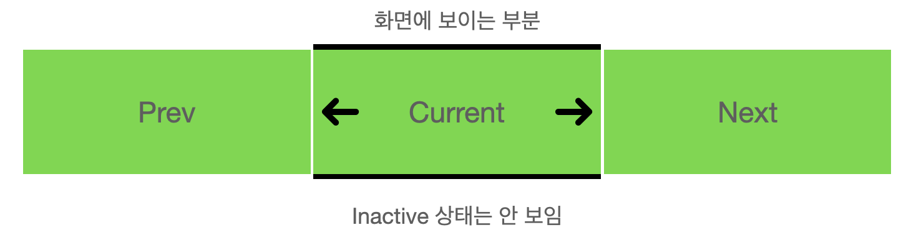

# 1. 문제를 개선한 캐로셀 만들기 시작

지난 글(https://www.witch.work/carousel-1/)에서는 tailwind를 써서 캐로셀을 만들었다. 하지만 다음과 같은 문제가 있었다.

1. 화면에 보이는 게 이미지 하나일 뿐 결국 모든 이미지를 렌더링해야 한다.
2. translate 너비를 구하기 위한 객체를 하드코딩해야 한다. 혹은 Tailwind 외에 다른 style을 사용해야 한다.

이번 글에서는 그걸 개선하고 좀 더 코드가 깔끔하며 렌더링이 덜 일어나는 캐로셀을 제작해 본다.

# 2. 현재 보이는 사진과 그 전후 사진만 렌더링해 주기

캐로셀에서 이미지를 더 적게 렌더링하려면 어떻게 해야 할까? 보이는 이미지만 렌더링해주면 된다. 따라서 현재 화면에 보이고 있는 사진, 바로 그전 차례의 사진, 바로 다음 차례의 사진만 렌더링하게 해보자. 여기서 이전과 다음 차례 사진도 렌더링해주는 이유는 추후 캐로셀의 화면 전환시 이전/다음 슬라이드로 넘어가는 애니메이션을 넣어 주기 위해서이다.

다음과 같은 타입을 먼저 정의해 주자.

```tsx
interface CarouselIndexType {
  prevIndex: number;
  currentIndex: number;
  nextIndex: number;
}
```

## 2.1 CarouselItem component

그럼 이 타입을 사용해서 어떻게 캐로셀의 이미지들을 렌더링할 것인가? `CarouselItem`컴포넌트에 현재 상태를 전달하고, 그 상태에 따라서 요소를 다른 방식으로 렌더링하는 방식을 생각해 보았다. 따라서 먼저 캐로셀이 현재 보여줘야 하는 인덱스와 캐로셀 아이템의 인덱스를 인수로 받아서 캐로셀 내부에서 아이템의 상태가 어떤지를 반환해 주는 함수를 만들었다.

```tsx
const CarouselItemStates = {
  PREV: "prev",
  CURRENT: "current",
  NEXT: "next",
  INACTIVE: "inactive",
} as const;
type CarouselItemStateType =
  typeof CarouselItemStates[keyof typeof CarouselItemStates];

function determineCarouselItemState(
  itemIndex: number,
  carouselIndex: CarouselIndexType
): CarouselItemStateType {
  switch (itemIndex) {
    case carouselIndex.prevIndex:
      return "prev";
    case carouselIndex.currentIndex:
      return "current";
    case carouselIndex.nextIndex:
      return "next";
    default:
      return "inactive";
  }
}
```

enum type을 사용하는 것보다 union type을 사용하는 것이 낫다고 해서 union type을 사용했다. enum type은 Javascript에는 존재하지 않는 기능이라 typescript 컴파일러는 즉시 실행 함수를 만들게 되는데 이렇게 되면 tree-shaking이 되지 않아서 좋지 않다고 한다. 이때 참고한 글은 LINE 엔지니어링 기술 블로그의 글인데 밑의 참고에 올려 놓겠다.

그럼 이제 `CarouselItem` 컴포넌트를 현재 아이템이 가져야 하는 상태를 인자로 받아 이에 따른 스타일을 적용해 주는 방식으로 작동하게 하자. 위의 `determineCarouselItemState`의 반환값을 이용할 것이므로 상태는 prev, current, next, inactive 를 사용할 것이다.

우리가 만들어 주고자 하는 상태는 다음과 같다.

    * prev: 왼쪽으로 이동하면 보여지는 이미지
    * current: 현재 보여지는 이미지
    * next: 오른쪽으로 이동하면 보여지는 이미지
    * inactive: 현재 보여지지 않는 이미지



이를 위해서 다음과 같은 방식을 생각해 주었다. 먼저 각 사진을 absoulte position으로 설정한다. 그리고 각 사진의 위치를 다음과 같은 className으로 설정한다.

- prev: `-translate-x-full`(transform: translateX(-100%); 와 동일)
- current: `translate-x-0`(transform: translateX(0); 와 동일. 평행이동해줄 필요가 없으므로 빈 문자열로 설정해도 된다)
- next: `translate-x-full`(transform: translateX(100%); 와 동일)
- inactive: 렌더링 안함

그리고 부모 컴포넌트를 relative position으로 설정하고 item width를 100%로 설정하면 current 상태의 item만 화면에 보여지게 될 것이다. 이전/다음 슬라이드는 각각 화면의 왼쪽과 오른쪽에 숨겨지게 될 것이다. 나머지 inactive 상태의 item은 렌더링 되지 않을 것이다.

이를 구현한 `CarouselItem` 컴포넌트는 다음과 같다.

```tsx
function CarouselItem({
  item,
  itemState,
}: {
  item: CarouselItemType;
  itemState: CarouselItemStateType;
}) {
  const carouselItemTranslateX = {
    [CarouselItemStates.PREV]: "-translate-x-full",
    [CarouselItemStates.CURRENT]: "",
    [CarouselItemStates.NEXT]: "translate-x-full",
  };

  return itemState !== CarouselItemStates.INACTIVE ? (
    <div
      className={`absolute w-full h-full shrink-0 ${carouselItemTranslateX[itemState]}`}
    >
      
    </div>
  ) : null;
}
```

이때 position이 absolute가 되면서 부모 컴포넌트의 높이에도 자동으로 들어가지 않는다. 따라서 가용 높이에 item이 맞춰서 들어갈 수 있도록 className에 `h-full`도 추가해 주었다.

## 2.2 Carousel Component

이제 `Carousel` 컴포넌트에서 `CarouselItem` 컴포넌트를 렌더링해 주면 된다. 기존의 translation state를 삭제하고 현재 캐로셀이 렌더링하고 있는 사진의 인덱스를 나타내는 `carouselIndex` state를 추가해 주었다. `prevClick` `nextClick` 함수도 거기에 맞게 수정했다. 그리고 `CarouselItem` 컴포넌트들이 렌더링되는 레벨의 상위에 relative position을 설정해서 캐로셀의 개별 요소들이 Carousel 컴포넌트가 렌더링되는 위치에 맞춰서 움직이게 했다.

```tsx
function Carousel({ items }: { items: CarouselItemType[] }) {
  const [carouselIndex, setCarouselIndex] = useState<CarouselIndexType>({
    prevIndex: items.length - 1,
    currentIndex: 0,
    nextIndex: 1,
  });

  const prevClick = (e: React.MouseEvent<HTMLButtonElement>) => {
    e.preventDefault();
    if (carouselIndex.currentIndex === 0) {
      setCarouselIndex({
        prevIndex: items.length - 2,
        currentIndex: items.length - 1,
        nextIndex: 0,
      });
    } else if (carouselIndex.currentIndex === 1) {
      setCarouselIndex({
        prevIndex: items.length - 1,
        currentIndex: 0,
        nextIndex: 1,
      });
    } else {
      setCarouselIndex({
        prevIndex: carouselIndex.currentIndex - 2,
        currentIndex: carouselIndex.currentIndex - 1,
        nextIndex: carouselIndex.currentIndex,
      });
    }
  };

  const nextClick = (e: React.MouseEvent<HTMLButtonElement>) => {
    e.preventDefault();
    if (carouselIndex.currentIndex === items.length - 1) {
      setCarouselIndex({
        prevIndex: items.length - 1,
        currentIndex: 0,
        nextIndex: 1,
      });
    } else if (carouselIndex.currentIndex === 0) {
      setCarouselIndex({
        prevIndex: 0,
        currentIndex: 1,
        nextIndex: 2,
      });
    } else {
      setCarouselIndex({
        prevIndex: carouselIndex.currentIndex,
        currentIndex: carouselIndex.currentIndex + 1,
        nextIndex: carouselIndex.currentIndex + 2,
      });
    }
  };

  return (
    <section>
      <div className="overflow-hidden">
        <div className={`relative flex flex-row w-full h-[50vh]`}>
          {items.map((item, index) => (
            <CarouselItem
              key={item.id}
              item={item}
              itemState={determineCarouselItemState(index, carouselIndex)}
            />
          ))}
        </div>
      </div>
      <button onClick={prevClick} className="p-3 border border-gray-500">
        이전 슬라이드
      </button>
      <button onClick={nextClick} className="p-3 border border-gray-500">
        다음 슬라이드
      </button>
    </section>
  );
}
```

이를 실행해 보면 우리가 의도한 대로 잘 작동하는 것을 확인할 수 있다. 또한 지난 글의 경우와 달리 tailwind style만을 적절히 사용했고 하드 코딩을 해주지도 않았다. 다음 글에서는 애니메이션을 넣고 이를 좀 꾸며 보자.

# 참고

enum type보다는 union type을 쓰자 https://engineering.linecorp.com/ko/blog/typescript-enum-tree-shaking/
