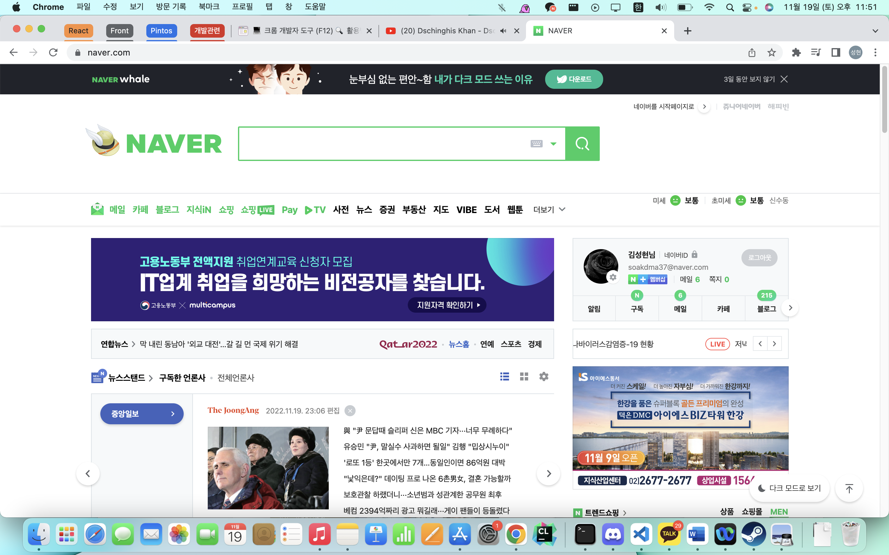
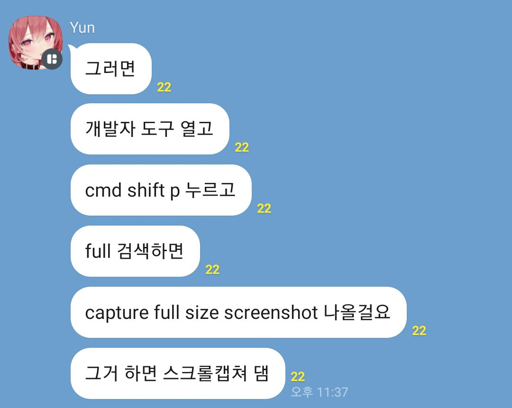
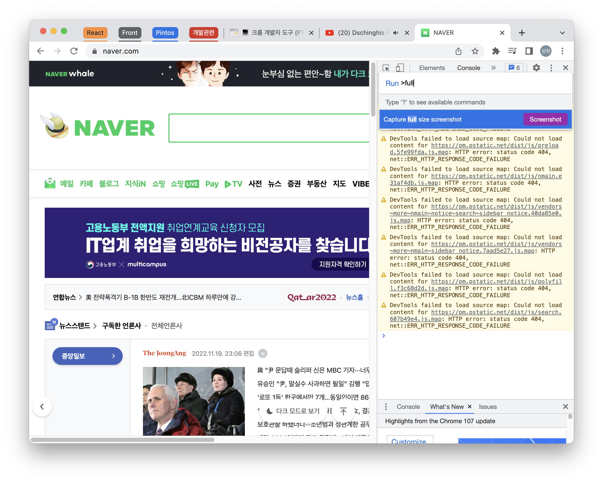

# 크롬 페이지 전체 캡처하기

발표 자료를 만들다가 페이지 전체를 캡처해야 할 일이 생겼다. 하지만 맥의 모니터에는 페이지 모두가 들어오지는 않는다. 예를 들어서 네이버 페이지 전체를 캡처해야 한다면? 일단 맥에서 기본 제공하는 `shift+command+3`을 눌러서 전체화면 캡처를 해본다. 하지만 이렇게 하면 네이버 페이지 전체가 아니라 맥의 전체 화면이 캡처된다.

`shift+command+4`를 이용해서 마우스로 드래그하면 상단 바 등을 제외하고 내가 선택한 부분을 캡처할 수도 있다. 스페이스바를 같이 누르면 특정 창을 캡처하기도 가능하다. 하지만 역시 내가 원하는, 페이지 전체 캡처는 안된다..

오픈채팅방에서 조언을 구하니 신뢰의 애니프사를 한 사람이 답을 가르쳐 주었다.

`command + option + i`로 개발자 도구를 열고, `command + shift + p`로 command palette를 열어서 `capture full size screenshot`을 검색하면 된다.

이렇게 하면 페이지 전체가 캡처된다.

다운로드된 사진 파일을 보면 네이버 페이지가 정상적으로 전체 캡처된 것을 볼 수 있다.

