어느 날, `witch.work` 도메인이 있지만 가령 `abc.witch.work`로 접속되는 페이지를 가지고 싶어졌다. 사람들에게 물어보니 서브도메인이라는 걸 달면 된다고 했다.

# 1. 무작정 레코드 달아보기

내 도메인인 `witch.work`는 cloudflare page에서 관리되고 있다. 따라서 cloudflare에서 서브도메인을 설정해야 한다.

한번 무작정 설정해 보자. cloudflare dashboard에서 `witch.work`를 선택하고 들어간다. 그리고 메뉴에서 DNS를 선택한다.

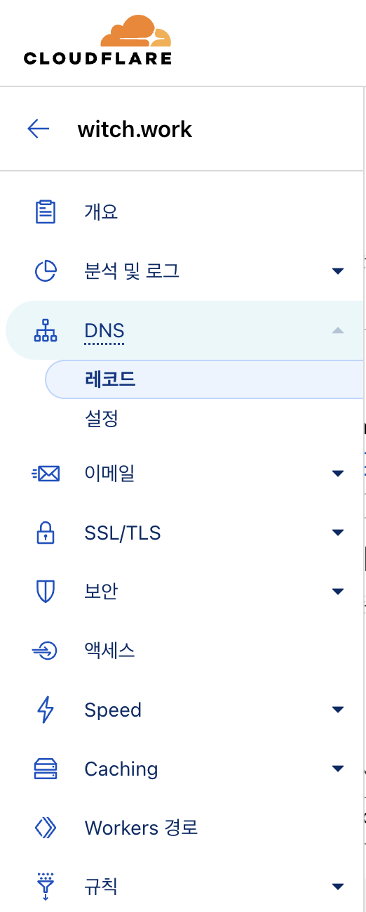

그리고 DNS 레코드 추가를 클릭한 후 유형을 CNAME으로 선택한 후 이름은 쓰고 싶은 서브도메인, 콘텐츠는 리다이렉트하고자 하는 페이지 주소로 설정한다. 또한 프록시는 켜놓는다.

`naver.witch.work`를 `https://naver.com`으로 리다이렉트하고 싶다면 다음과 같이 설정하면 된다. 

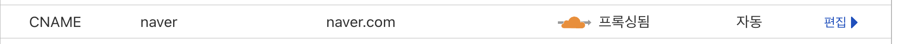

하지만 이렇게 해도, origin policy등에 의해서 완전히 동일한 페이지를 보는 것은 아니다. CORS 정책에 의해 자원 공유가 제한되기 때문이다.

만약 특정 서브도메인으로 접속했을 시 다른 페이지의 주소로 완전히 넘어가고 싶다면, cloudflare page에서 제공하는 page rule이나 redirection rule을 적용해야 한다.(공식 문서를 보고 하면 별거 아니다)

# 2. 원리

네트워크의 내용을 깊이 들어가면 말할 게 수도 없지만 기본적인 부분만 살펴본다. 

네트워크 통신은 기본적으로 IP 기반으로 돌아간다. 만약 내 집의 컴퓨터에서 `www.naver.com`에 접속한다고 하자. 그러면 내 컴퓨터는 DNS(도메인 네임 서버)에 `www.naver.com`에 연결된 IP 정보를 조회한다. 

그렇게 DNS에서 전달받은 IP에 HTTP 요청을 보내게 되면 네이버에 접속된다.(중간중간 수많은 이야기들이 있지만 모두 생략. 자세한 이야기는 [여기](https://inpa.tistory.com/entry/WEB-%F0%9F%8C%90-DNS-%EA%B0%9C%EB%85%90-%EB%8F%99%EC%9E%91-%EC%99%84%EB%B2%BD-%EC%9D%B4%ED%95%B4-%E2%98%85-%EC%95%8C%EA%B8%B0-%EC%89%BD%EA%B2%8C-%EC%A0%95%EB%A6%AC)나 [여기](https://parksb.github.io/article/36.html)참고)

그리고 이렇게 도메인 이름과 IP를 매핑하는 가장 기본적인 DNS 레코드가 A타입 레코드이다. `www.naver.com`에 접속 시 IP `223.130.200.104`에 연결해야 한다면, 이 둘을 연결시켜 주는 것이다.

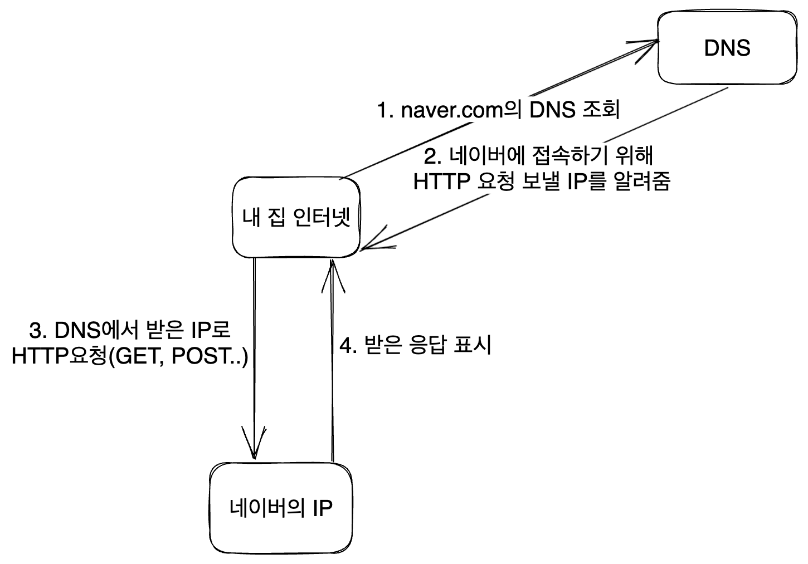

이제 위에서 설정한 CNAME 레코드가 나온다. CNAME 레코드는 도메인을 다른 도메인의 별칭으로 설정할 경우 A레코드 대신 사용한다. CNAME인 이유도 Canonical Name의 약자이기 때문이다.

DNS가 CNAME 레코드를 설정한 도메인에 도달할 시 해당 도메인에 연결된 CNAME 레코드 도메인을 찾아가서 다시 DNS를 조회하게 되고, 그렇게 A 레코드가 나올 때까지 조회한 후 해당 IP로 연결하게 된다.

위에서 우리가 설정한 CNAME 레코드의 경우 `naver.witch.work`를 `naver.com`의 별칭으로 설정한 것이다. 따라서 naver.com에 연결된 DNS 레코드를 따라가게 된다. 

DNS조회가 한 번 더 이루어지므로 비효율적이기는 하겠지만.(하지만 사실 DNS 캐싱도 요즘 잘 되어 있고, 또한 DNS 조회는 빠르게 이루어지기 때문에 그렇게까지 비효율적이지도 않다)

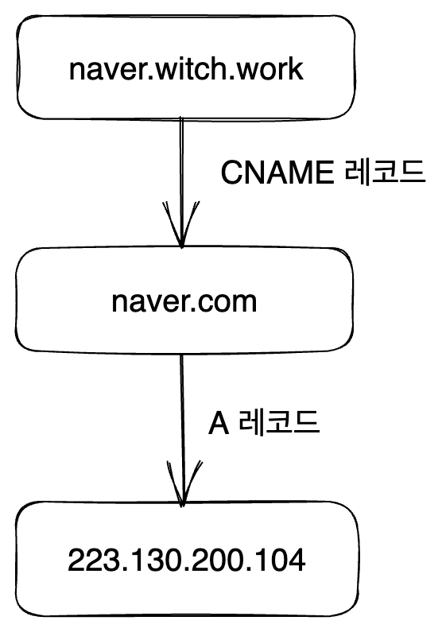

그러나 위에서 언급했듯이, 이렇게 하면 완전히 동일한 페이지를 보게 되는 것은 아니다.

내 컴퓨터에서 `naver.witch.work`에 접속하면 결과적으로 네이버의 IP에 HTTP 요청을 하게 되지만, 요청을 하는 출처는 `naver.witch.work` 그대로이다. 

하지만 네이버의 서버는 이 출처에서 온 요청을 허용하지 않는다. 따라서 CORS 정책에 의해서 네이버 페이지의 자원을 요청하는 것은 차단되고, 네이버 페이지의 일부만 표시된다.

# 3. vercel 페이지 연결하기

다시 돌아와서, 처음에 내가 서브도메인 페이지를 만들고자 한 건 네이버로 리다이렉트하는 주소를 갖고 싶어서는 당연히 아니었다. 뭔가 새로 만들고자 하는 페이지가 있었는데 거기로 연결되는 URL을 미리 만들어 놓고 싶어서였다.

최근에 NextJS를 배운다고 배운다고 공식 문서의 튜토리얼을 따라한 일이 있었다. 이 페이지를 좀 개조해서 뭔가 컨텐츠를 넣어 놓고 싶었던 것이다.

이 페이지는 현재 [NextJS 문서의 배포 가이드](https://nextjs.org/docs/app/building-your-application/deploying)를 따라 vercel로 배포되어 있다. [여기](https://nextjs-example-weld.vercel.app/)에 내가 만든 페이지를 배포해 놓았다. `cs.witch.work`가 여기로 리다이렉트되게 해보자.

그럼 위에서 한 것처럼 하면 되겠지? CNAME 레코드의 이름을 `cs`로 설정하고 위의 주소를 내용으로 넣어본다. 

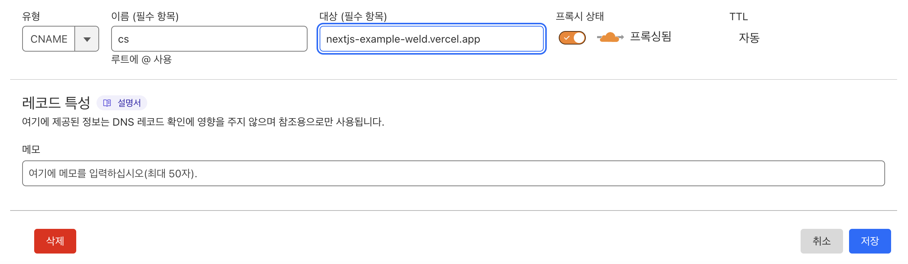

하지만 이렇게 하면 안 된다! `DEPLOYMENT_NOT_FOUND`라는 코드와 함께, 우리가 원하는 페이지와 연결이 안 되는 것을 볼 수 있다.

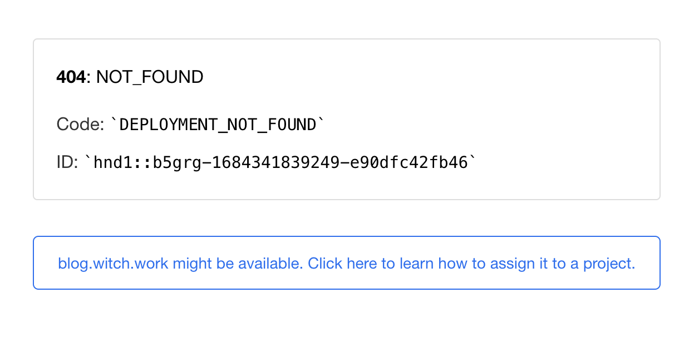

이는 vercel 배포가 동작하는 방식 때문이다. vercel로 배포한 페이지는 A 레코드를 통해 IP `76.76.21.21`로 연결된다. 그리고 해당 IP 서버에서 요청을 한 도메인을 보고 적절한 페이지를 보내주는 방식으로 동작한다.

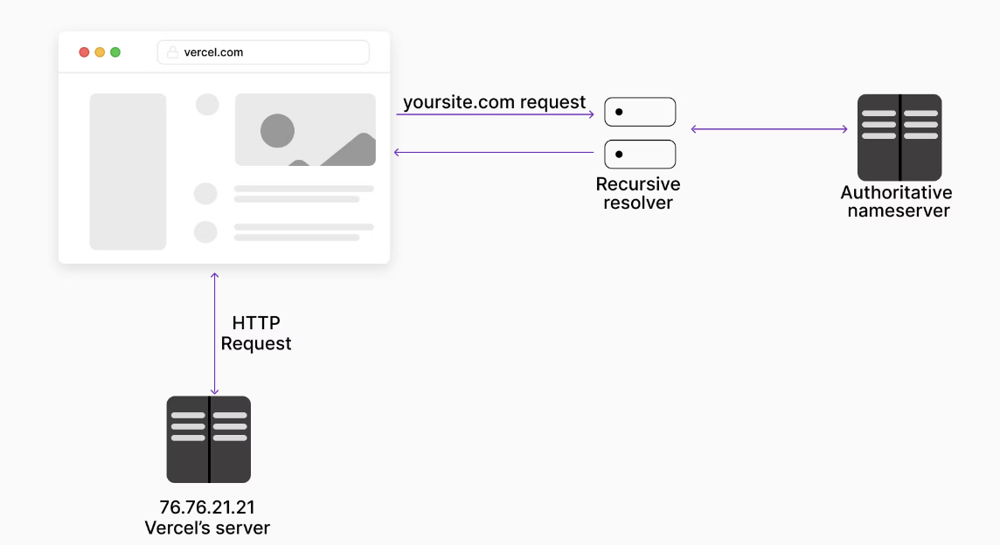

따라서, 우리가 아까 추가한 서브도메인 `cs.witch.work`으로 접속하게 되면 vercel 서버 `76.76.21.21`까지는 잘 접속된다. 하지만 vercel 서버에서 해당 도메인에 대해서 어떤 페이지를 보내 줄지 모르는 상태이다. 그래서 위처럼 `DEPLOYMENT_NOT_FOUND`라는 에러가 발생하는 것이다.

이를 해결하기 위해서는 vercel 서버에 해당 도메인을 등록하면 된다. vercel dashboard로 가자. 거기서 `Domains` 메뉴를 선택한 후 `Add` 버튼을 누른다.

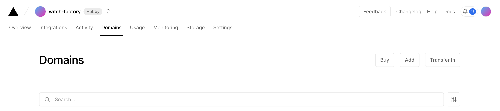

그리고 `Add`을 누른 후 내가 배포한 프로젝트를 선택한다. 나는 `nextjs-example`프로젝트의 도메인을 추가하고 싶으므로 해당 프로젝트를 선택했다.

그리고 continue를 누르면 내가 vercel 서버에 해당 프로젝트 도메인으로 추가하고 싶은 도메인을 선택하는 창이 뜬다. 거기에 내가 추가하고 싶은 도메인을 입력한다. 나는 `cs.witch.work`를 입력했다.

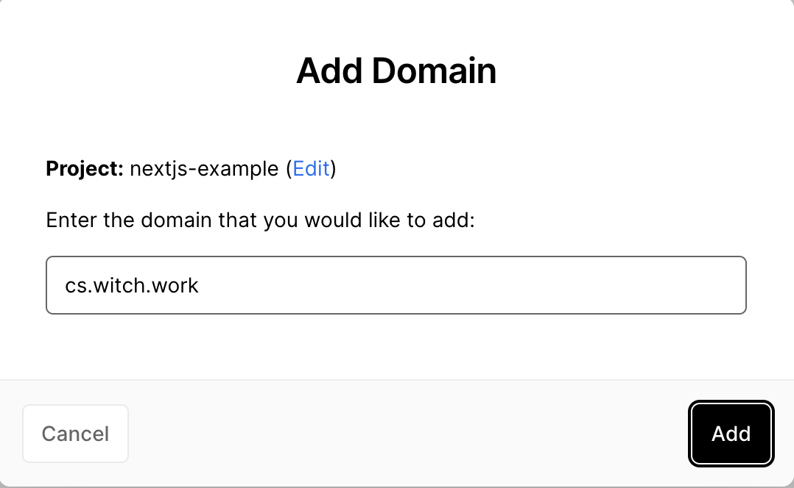

이걸 완료하고 나면 해당 페이지를 vercel 서버에 추가하는 작업이 진행되는데, 거기까지 하고 나면 `cs.witch.work`에 접속할 시 내가 만든 프로젝트 페이지로 연결된다.

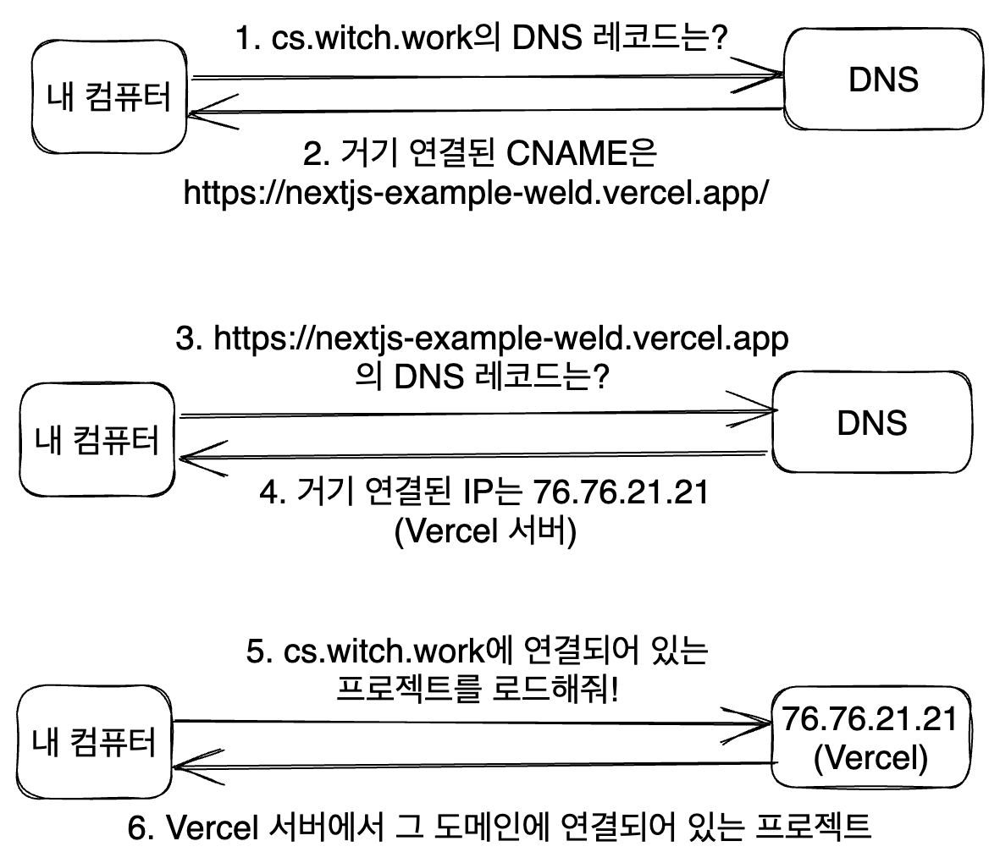

# 4. 1단계 개선

하지만 굳이 CNAME을 1번 거칠 필요는 없다. 내가 연결할 서브도메인을 곧장 vercel 서버에 연결하면 된다.

물론 요즘은 DNS 조회가 그렇게 오래 걸리는 작업도 아니고, DNS 캐싱도 잘 이루어지기 때문에 획기적인 시간 개선이 되지는 않는다. 

하지만 원칙적으로 여러 번의 DNS 조회를 거쳐서 페이지에 도달하는 건 지양되는 게 맞다. 따라서 이를 개선해 보도록 하자.

그냥 cloudflare에서 cs.witch.work 서브도메인의 내용을 설정할 때 A레코드로 설정한 후 바로 vercel 서버의 IP `76.76.21.21`을 입력하면 된다.

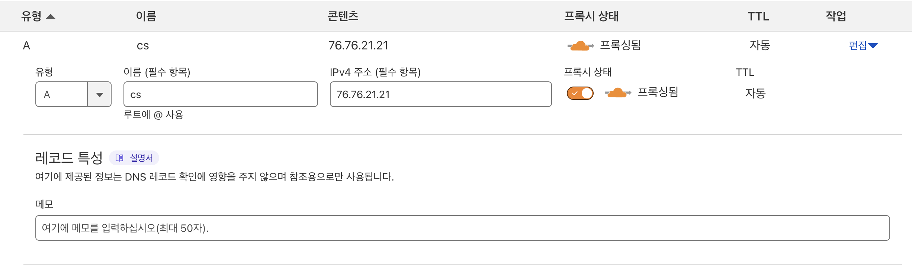

이제 `cs.witch.work`로 접속하면, 물론 똑같이 아까와 같은 페이지로 연결되지만 DNS 조회 1번이 줄어들게 된다.

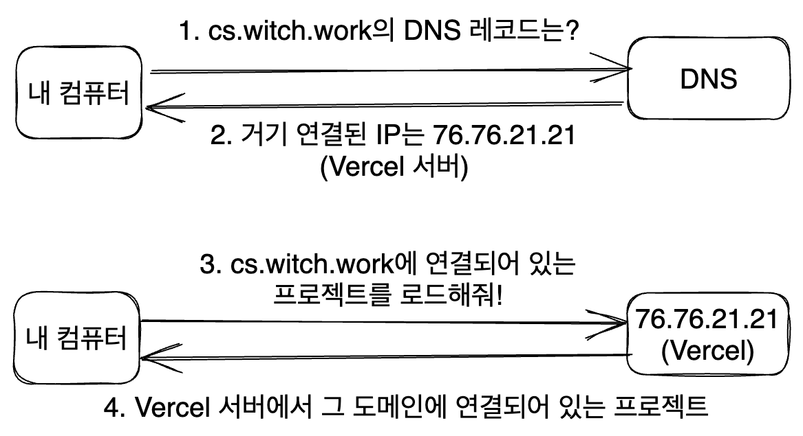

[cs.witch.work](https://cs.witch.work/) 서브도메인에 다른 페이지를 연결시키는 걸 완료했다.

# 5. 기타 - 아예 도메인을 이동하기

위처럼 하면 페이지 주소는 그대로지만 다른 페이지의 컨텐츠가 표시된다. 페이지 주소는 `cs.witch.work`로 표시되지만 사실 https://nextjs-example-weld.vercel.app/과 같은 컨텐츠가 표시되는 것이다.

하지만 이런 식으로 다른 페이지의 컨텐츠만 표시하는 게 아니라, 아예 다른 도메인으로 넘어가고 싶을 수 있다. 대표적으로, www 서브도메인이 붙은 도메인을 apex 도메인(root도메인)으로 리다이렉트시키고 싶은 경우를 들 수 있겠다. 이렇게 같은 페이지로 오는 모든 요청을 apex 도메인으로 통일시키는 게 SEO나 조회수 집계 등에도 좋다.

예를 들어, `www.witch.work`로 접속했을 때 `witch.work`로 아예 넘어가게 하고 싶다면?

이럴 때는 cloudflare에서 redirection rule을 설정하면 된다. 혹은 page rule을 설정하거나, bulk redirect를 설정하면 된다. 뒤쪽으로 갈수록 닭 잡는 데에 소 잡는 칼을 쓰는 일이 된다고 본다.

## 5.1. redirection rule

일단 cloudflare dashboard에서 내 도메인 `witch.work`관련 페이지에 들어간 후 www 서브도메인에 A 레코드로 `192.0.2.1`을 추가하거나 AAAA 레코드로 `100::`을 추가한다.

그 다음 `witch.work` 대시보드의 왼쪽 메뉴에서 `규칙(혹은 rules)` 메뉴를 찾고, 그곳의 서브메뉴에서 `리디렉션 규칙`을 선택한다.

리디렉션 규칙을 생성하는 버튼을 누른 후 규칙 이름을 입력하고, 어떤 요청에 대해서 어떤 URL로 리디렉션할지를 설정한다.

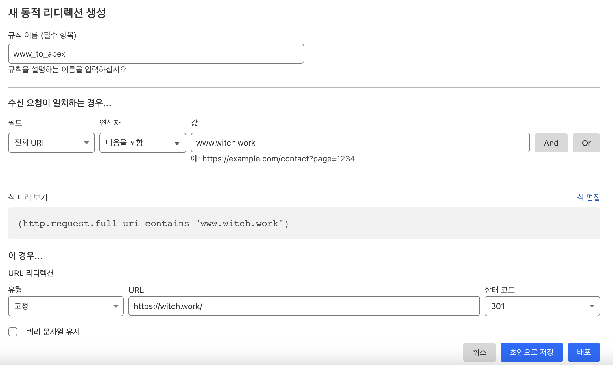

이를 저장하면 끝이다. 이렇게 하면 www.witch.work 로 접속할 시 이는 A 레코드에 의해 cloudflare 서버에 연결되고, cloudflare 서버에서는 내가 설정한 리디렉션 규칙에 따라 witch.work로 리디렉션하라는 응답(코드 301)을 보내게 된다. 아예 다른 도메인으로 가는 것이다.

## 5.2. page rules

cloudflare dashboard에서 내 도메인 `witch.work`관련 페이지에 들어간 후 www 서브도메인에 A 레코드로 `192.0.2.1`을 추가하거나 AAAA 레코드로 `100::`을 추가하는 부분까지는 위와 동일하다.

그 다음 `witch.work` 대시보드의 왼쪽 메뉴에서 `규칙(혹은 rules)` 메뉴를 찾고, 그곳의 서브메뉴에서 `페이지 규칙`을 선택한다.

여기서 Page rule 생성을 선택한다.

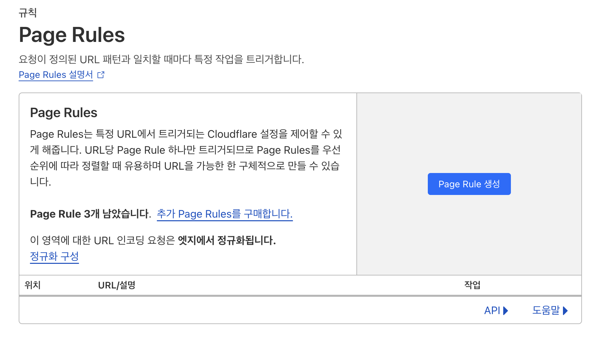

그리고 똑같은 일을 하면 된다. URL은 내가 접속했을 시 다른 곳으로 리디렉션시키고 싶은 URL을 입력하면 된다. 나는 `www.witch.work`를 apex 도메인으로 리디렉션시키고 싶었으므로 www.witch.work 를 입력했다.

이때 URL 전체 중 해당 도메인이 포함되어 있을 경우 모두 리디렉션시키고 싶었기 때문에 `*`을 사용했다. 또한 그때의 동작은 URL을 이동하고 싶은 것이므로 '전달 URL'을 선택하고 `https://witch.work/`을 설정했다.

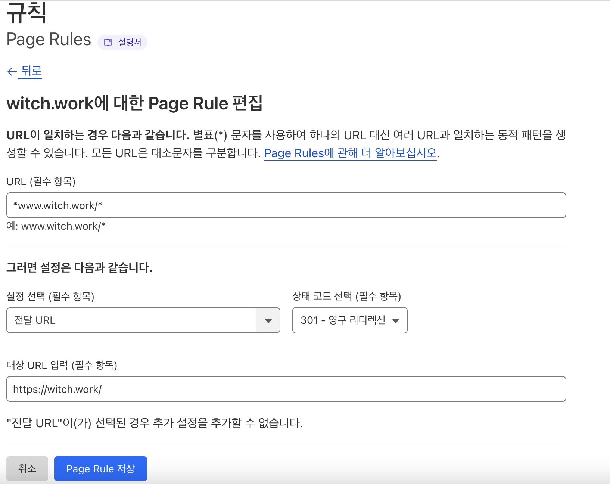

이렇게 하면 www.witch.work로 접속했을 시 witch.work로 리디렉션되는 것을 볼 수 있다. 역시 cloudflare 서버의 엣지에서 처리하는 부분이다.

## 5.3. bulk redirect

cloudflare dashboard에서 내 도메인 `witch.work`관련 페이지에 들어간 후 www 서브도메인에 A 레코드로 `192.0.2.1`을 추가하거나 AAAA 레코드로 `100::`을 추가하는 것은 역시 위와 동일하다.

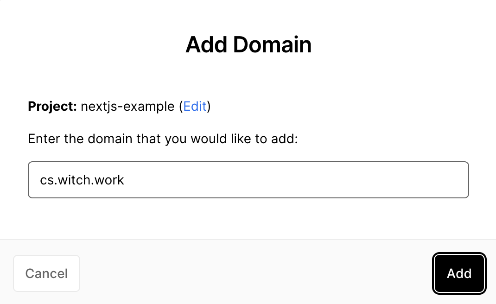

그 다음 `witch.work` 대시보드의 왼쪽 메뉴에서 `규칙(혹은 rules)` 메뉴를 찾고, 그곳의 서브메뉴에서 `리디렉션 규칙`을 선택한다. 그리고 아래로 내려보면 `대량 리디렉션`메뉴가 있다. 

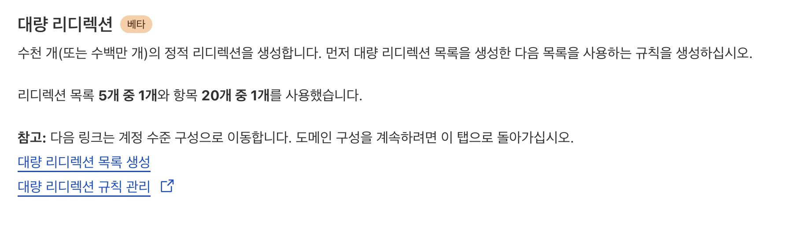

그곳에서 `대량 리디렉션 목록 생성`을 택한 후 이름, 설명을 적당히 입력하고 다음을 누른다.

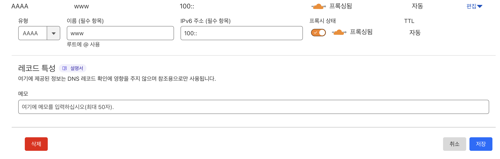

다음 화면에서 URL 리디렉션 수동 추가를 택한 후 원본 URL(나같은 경우 www.witch.work )과 대상 URL(나같은 경우 witch.work)를 입력한다. 대상 URL로 영구 리디렉션을 시킬 것이므로 상태는 301을 선택한다.

매개변수 편집에서는 쿼리 문자열 유지, 하위 경로 일치, 경로 접미사 유지 를 선택한다. 그리고 `리디렉션 추가`를 누른다. 그리고 다음 버튼을 누르다 보면 대량 리디렉션 목록이 생성된다.

이제 이 리디렉션 목록을 실현할 규칙을 만들면 된다. 대량 리디렉션 메뉴로 이동한 후 `대량 리디렉션 규칙 생성`을 선택. 그러면 규칙의 이름과 이 규칙에서 어떤 리디렉션 목록을 실현할지를 선택할 수 있다.  

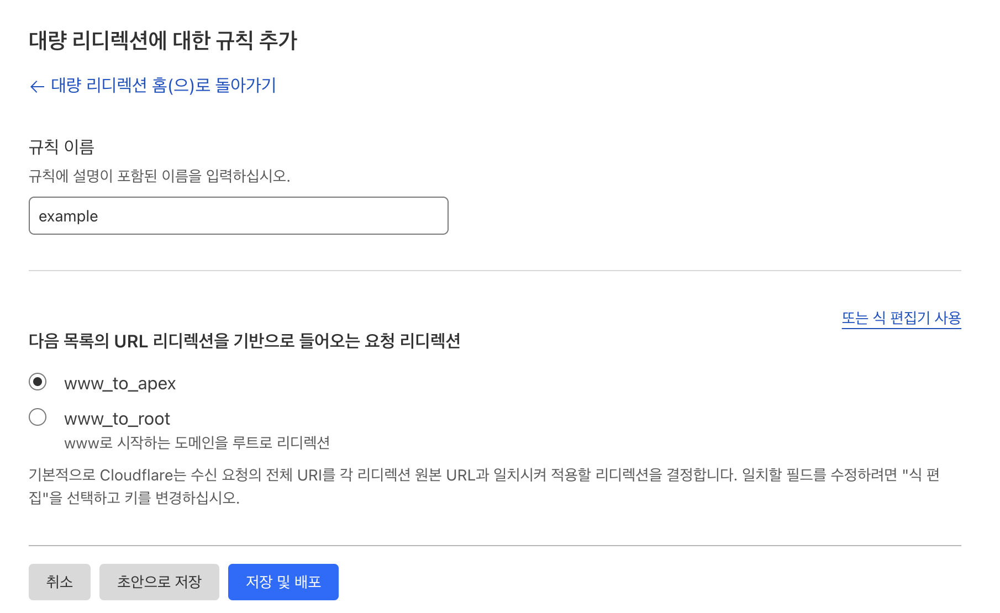

이를 적당히 선택하고 저장 및 배포를 누르면 된다.

# 참고

https://alwnsxo.com/entry/Vercel%EC%97%90-%EB%82%B4-%EB%8F%84%EB%A9%94%EC%9D%B8-%EC%A0%81%EC%9A%A9%ED%95%98%EB%8A%94-%EB%B0%A9%EB%B2%95-Next-JS-on-Vercel-with-Custom-Domain

https://www.cloudflare.com/ko-kr/learning/dns/dns-records/dns-cname-record/

https://vercel.com/docs/concepts/projects/domains/troubleshooting

https://evan-moon.github.io/2020/05/21/about-cors/

https://developers.cloudflare.com/pages/how-to/www-redirect/