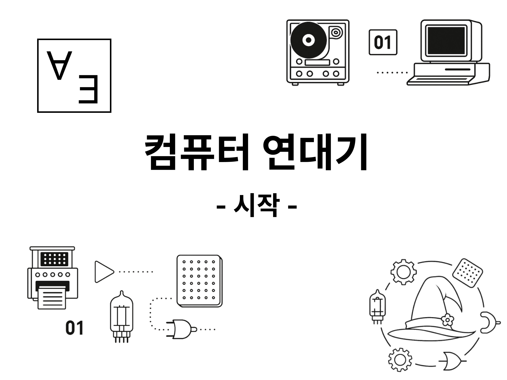

# 서문

새삼스레 말하자면 컴퓨터는 신기한 물건이다. 타고 다니기 위한 자동차라거나 무언가를 자르기 위한 가위처럼 뚜렷한 목적을 가진 물건들과는 조금 다르게 다가온다.

컴퓨터 화면 속에서는 무엇이든 할 수 있는 것처럼 보인다! 지금에 와서는 당연하게 느껴지지만 우리는 컴퓨터로 엄청나게 큰 수의 계산을 할 수도 있고 친구와 이야기를 나누거나 정보를 검색할 수도 있다. 그림을 그릴 수도 있고 음악을 듣거나 만들 수도 있다. 그야말로 마술 같은 기계다.

어쩌다 보니 나는 컴퓨터공학과를 복수전공하게 되었고 프로그래머의 길을 걷고 있다. 컴퓨터를 내가 원하는 대로 다루기 위해 시간을 들여 지식을 쌓아왔다. 그 과정에서 문득 의문이 들고는 했다. 내가 지금 당연하게 사용하는 이 프로그램들과 공학적 개념들은 어떻게 세상에 등장했을까?

그 의문들 중 아주 작은 조각들이나마 풀기 위해 조사하여 몇 편의 글도 썼었다.

[JS의 소리를 찾아서 - Javascript의 초기 실수와 선택들](https://witch.work/ko/posts/javascript-history-initial-decisions)

[JS 탐구생활 - 클로저 시리즈 2. 수학자들의 꿈에서 JS의 스타가 되기까지](https://witch.work/ko/posts/javascript-closure-deep-dive-history)

그런데 이런 조사를 하다 보면 가장 근본적인 질문에 다다르곤 했다. 이 모든 것들은 어디서 시작해서 어떤 과정을 거쳐 우리 앞에 도달했을까? 이 컴퓨터라는 작은 기계가 세상에 등장하기까지 어떤 시간과 사람들과 꿈과 좌절과 깨달음들이 세상에서 반짝였을까?

관련된 조사를 하며 파편적인 지식들이 쌓여갔다. 하지만 이를 정리해 글로 쓰는 일은 늘 망설여졌다. 얽히고 설킨 방대한 이야기들을 내가 빠짐없이 담아낼 수 있을 거라는 자신이 도저히 생기지 않았기 때문이다.

그러나 돌이켜보면 모든 걸 알 필요는 없었다.

가령 누가 최초의 컴퓨터를 만들었는가는 아직도 논란이 있다. 그런데 그 답이 정말 내게 중요할까? 내게 중요하게 여겨지는 건 누가 1년 더 빨리 컴퓨터를 만들었는지가 아니다. 컴퓨터가 등장하기까지 필요했던 발상들이 어떤 계기로 나왔고 사람들은 어떻게 거기 도달했으며 이후에 어떻게 발전시켜 나갔는지가 내게는 더 중요하게 다가왔다.

그들이 갔던 생각의 길을 익히다 보면 언젠가 나 또한 세상에 없던 생각을 떠올릴 수 있지 않을까. 나는 그렇게 믿는다.

그래서 이제 컴퓨터의 역사에 관한 시리즈를 시작한다. 지식을 많이 담아낸 글이 되리라 생각하지만 지식을 나열하려는 목적은 아니다. 나는 이전에 없었던 걸 세상에 내놓은 사람들이 밟았던 생각의 궤적을 좇고자 한다. 이 시리즈는 생각의 흐름을 따라가려는 기록이다.

틀린 정보를 쓰지 않기 위해 최선을 다하겠지만 빠진 내용은 신경쓰지 않으려 한다. 내가 이 글을 통해 하고 싶은 건 컴퓨터가 지금 이 모습으로 우리 앞에 나타나기까지 흘러온 수백 년의 시간 속에 단 하나라도, 내가 이해할 수 있는 얇은 선을 긋는 일이기 때문이다.

기술에 얽힌 이야기에 관심이 있는 나 같은 사람들이라면 설렐 수 있는 이야기들이 기다리고 있다. 우리에게 친숙해진 개념들, 때로는 낯설고 약간은 전문적인 지식들, 과거에 지나와 버려 지금은 많이 잊혀진 혁신들.

수많은 이들이 이야기의 씨앗을 뿌렸다. 고대 그리스의 아카데미아에서, 감리교회 근처 들판에서, 산업 혁명기 연기 자욱한 공장에서, 대학 캠퍼스의 칠판 앞과 전쟁터의 참호와 암호 해독실과 레이더 기지와 냉전기 연구소와 지금까지도 건재한 회사의 사무실과 잊혀진 이들의 허름한 차고에서. 그 모든 곳에서 수많은 사람들이 자신이 속한 시대와 공간에서, 내가 지금 글을 쓰고 있는 이 작은 기계에 한 조각씩 숨결을 불어넣었다.

나도 아직 다 조사하지 못한 이야기들이 많다. 논리적 추론, 부울 대수, 집합론, 대각선 논법, 튜링 기계, 방직기, 전기 스위치, 트랜지스터, 마우스, GUI... 어떤 에피소드들이 이야기를 이어나갈 나를 기다리고 있을까 설레는 마음으로 기대해본다.

그 흐름을 좇으며 내가 머릿속에서 이해의 선을 긋기 위해 애썼던 시간들과 그 선들이 어렴풋이나마 이어질 때마다 느꼈던 기쁨을 조금이나마 나눌 수 있는 글이 되길 바란다. 자 그럼, 시간을 거슬러 올라가 보자.

# 시리즈 목록

기본적으로는 2주에 한번씩 연재할 계획이다. 다만 취미로 하는 작업이기 때문에 사정에 따라 연재가 늦어지거나 주기가 바뀔 수 있다.

| 시리즈 | 링크 |
| --- | --- |
| 컴퓨터 연대기 0. 시작 | [링크](/ko/posts/computer-history-from-scratch-0) |
| 컴퓨터 연대기 1. 추론의 기초를 세운 사람들 | [링크](/ko/posts/computer-history-from-scratch-1) |