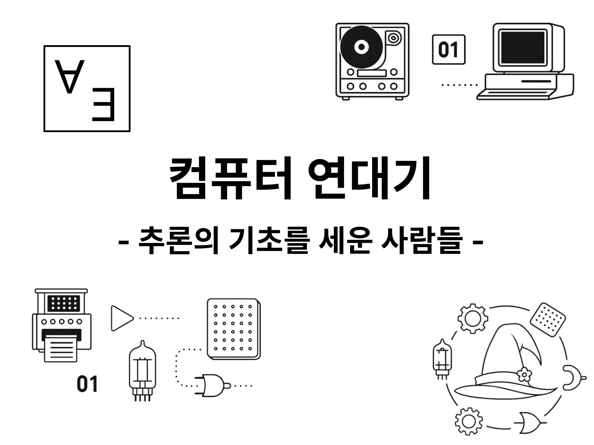
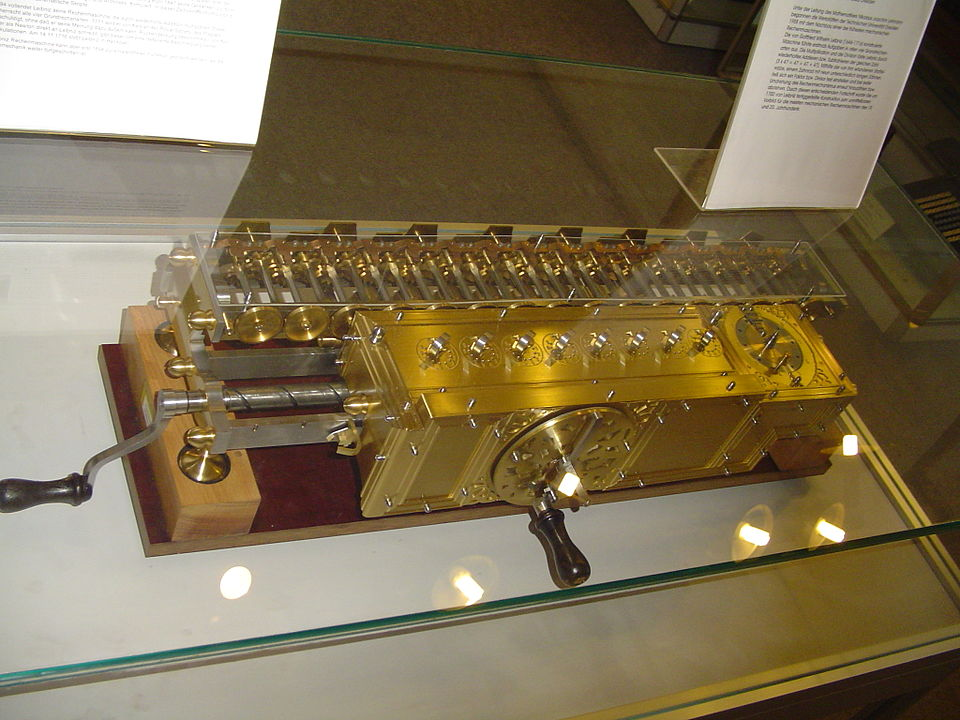

# 컴퓨터 연대기 시리즈 목록

기본적으로는 2주에 한번씩 연재할 계획이다. 다만 취미로 하는 작업이기 때문에 사정에 따라 연재가 늦어지거나 주기가 바뀔 수 있다.

| 시리즈 | 링크 |
| --- | --- |
| 컴퓨터 연대기 0. 서문 | [링크](/ko/posts/computer-history-from-scratch-0) |
| 컴퓨터 연대기 1. 생각하는 기계를 향한 첫걸음, 추론의 기초를 세운 사람들 | [링크](/ko/posts/computer-history-from-scratch-1) |

* 조사를 위해 노력했지만, 혹시 틀린 부분이 있다면 댓글 등을 통한 지적을 환영합니다.

# 시작에 관한 논의

> 컴퓨터는 영리해 보이지만 그 똑똑함이란 속임수이다. 엄청난 속도와 무한 반복 능력이 만들어 낸 교묘한 재주일 뿐이다. (...) 컴퓨터에서 벌어지는 것 중에 예측 불가능한 것이 없는 이유가 여기에 있다.
>
> 마이클 A. 힐트직 지음, 이재범 옮김, "제록스 팔로알토 연구소", 131p

> 컴퓨터는 트랜지스터가 켰다, 껐다 작업을 빠르게 반복하는 어리석고 어려운 방식으로 일을 처리한다. 스위치의 속도가 1초에 한 번 작동한다면, 컴퓨터는 필요 없을 것이다. 1초의 1,000번의 속도도 실용적이지 않다. 스위치의 속도가 1초에 100만 번 정도가 되어야, 컴퓨터는 비로소 가치 있는 도구가 된다. 1초에 10억 번의 속도 정도가 되면(...) 컴퓨터는 세상을 뒤바꿀 수 있는 도구가 되는 것이다.
>
> T. R. 리드 지음, 김의동 옮김, "디지털 세상의 지배자 칩", 26p

컴퓨터가 어떻게 나왔는지 따지려면 역사의 거의 모든 지점에서 이야기를 시작할 수 있다. 수의 발명, 인쇄술, 문자, 숫자 0, 천문학의 계산, 주판이나 더 거슬러 올라간다면 동물의 뼛조각과 같은 계산 보조 도구들 등등. 컴퓨터와 연관지으려면 그럴듯하게 할 수 있는 출발점은 얼마든지 있다.

하지만 그런 모든 이야기들을 다루는 건 불가능하다. 애써 시도한다고 해도 오히려 더 흥미를 잃게 만들 뿐이라고 생각한다. 위키피디아의 [Timeline of computing](https://en.wikipedia.org/wiki/Timeline_of_computing) 문서를 보면 수많은 사람들과 사건들이 나열되어 있다. 하지만 내가 그 긴 목록을 반복하는 것이 과연 어떤 의미를 줄 수 있을까?

나의 목적은 그런 사실들의 나열이 아니다. 그 사실들이 어떻게 연결되어 있고 어떻게 인류가 컴퓨터라는 물건에 도달했고 발전시켰는지를 파헤치는 것이다.

그러니 우리에게 컴퓨터란 어떤 의미인지부터 생각해 보자. 고작 커다란 계산기나 정보 저장소일 뿐인가? 역사의 어느 한때에는 많은 사람들이 컴퓨터를 그런 존재로 여겼다.

하지만 지금 우리에게도 그런가? 지금 이 글을 읽는 데 쓰고 있는 기기가 단순한 계산기로 보이는 사람은 많지 않을 거라고 본다. 우리는 키보드 입력이나 마우스나 터치를 통한 GUI 조작 등으로 컴퓨터에게 우리가 원하는 걸 명령하면 컴퓨터는 그걸 이해한 후 거기에 맞는 동작을 마술처럼 수행하고 결과를 화면에 보여준다.

하지만 사실은 정교한 트릭이 숨겨져 있는 마술처럼, 컴퓨터 또한 내부를 들여다보면 그저 전압의 크기에 따라 켜짐과 꺼짐을 구분하는 스위치를 엄청나게 많이 조합한 기계에 불과하다. 그러니까 컴퓨터를 처음 배우는 사람에게 흔히 말하듯 컴퓨터는 0과 1, 논리로 말하자면 true와 false밖에 모르는 기계라고도 할 수 있다.

컴퓨터는 마술 같은 물건이기도 하고 믿을 수 없을 만큼 단순한 스위치 덩어리이기도 하다. 하지만 이 두 가지 설명 사이에는 거대한 간극이 느껴진다. 두 가지 값밖에 표현 못 하는 스위치로 이루어진 기계가 어떻게 우리의 명령을 이해하고 심지어는 결과를 보여주는 이 모든 과정을 수행할 수 있는 걸까?

나는 수의 기원이나 태엽 장치 같은 와닿지 않는 이야기를 하지 않겠다. 앞서 말한 이 간극을 메우기 위한 과정을 이야기하려고 한다. 

어떤 빛나는 발상들을 통해 사람들이 오늘날의 컴퓨터라는 개념에 도달했고 그걸 어떻게 만들었으며 현실에서 이를 사람들에게 와닿게 하기 위해 무엇이 만들어졌는지를 말이다. 스위치가 어떻게 우리에게 마술같은 존재로 변해 도달했는지 이해하기 위해서.

그 이야기는 크게 두 흐름으로 나눌 수 있다.

하나는 개념의 역사다. 컴퓨터는 수많은 사람들이 쌓아올린 개념에서 태어났다. 사람들은 20세기 초 추론을 형식화하여 모든 걸 계산해낼 수 있는 완전한 체계의 꿈을 꾸었지만 이내 좌절을 겪었다. 그 좌절의 자리에서 컴퓨터가 만들어졌다. 이후에도 컴퓨터가 이런 모습으로 우리 눈 앞에 도달하고 사용할 수 있기까지 여러 발전들이 있었다. 튜링 기계뿐 아니라 회로 이론과 폰 노이만 아키텍처, 사용자 인터페이스 같은 이후의 이야기들까지가 이 흐름에 속한다.

다른 하나는 기계의 역사다. 컴퓨터가 머릿속의 아이디어에 머무르지 않고 현실의 우리 책상 위에 놓일 수 있었던 이유는 물리적 장치가 함께 발달해왔기 때문이다. 스위치부터 시작해 진공관과 트랜지스터, 손으로 레버를 돌리던 계산기와 천공 카드를 읽던 자동 계산기, 그리고 회로를 집적한 칩과 화면까지. 오늘날 하드웨어라고 부르는 것들이 이 흐름에 속한다.

이 두 가지 흐름은 각각 발전하고 어떤 계기로는 결합되고 또 언제부턴가는 자연스럽게 함께 흘러간다. 그렇게 컴퓨터는 시간을 넘어 아이디어와 금속, 스위치와 기호, 회로와 언어가 뒤셖여 우리에게 다가온다.

**그럼 어디서부터 시작할까?**

가장 첫 실마리가 될 만한 걸 꼽는다면 역시 추론일 것이다. 인간은 오랜 세월 동안 알고 있는 사실들로부터 새로운 진리를 이끌어내는 방식을 고민해 왔다. 생각이라는 과정을 정형화하고, 나아가 그것을 계산으로 바꾸려는 욕망. 컴퓨터는 그 욕망의 끝에서 탄생했다. 그럼 추론에서 이야기의 첫걸음을 떼보자.

# 최초의 추론을 세운 아리스토텔레스

> 추론이란, 거기에서 몇 가지 것이 규정됨으로써 그 규정된 것들과 다른 무언가가 필연적으로 그 규정된 것들을 통해 따라 나오는 논의이다.
>
> 아리스토텔레스, "토피카" 제1권 제1장 100a25-27[^1]

## 삼단 논법

현재 알고 있는 사실들로부터 새로운 판단을 이끌어낼 수 있는 형식을 고안한 건 철학사의 중요한 전환점이었다. 그 출발선에는 철학에 관심이 없는 사람이라도 한번쯤은 들어보았을 고대 그리스의 철학자, 아리스토텔레스(Aristotle)가 있다.

아리스토텔레스는 오늘날 삼단논법이라고 부르는 다음과 같은 형식의 추론을 연구했다. 이 진술을 아리스토텔레스가 직접 한 것인지는 명확하지 않지만 대표적인 예시는 다음과 같다.

> 전제 1: 인간은 누구나 죽는다.
> 
> 전제 2: 소크라테스는 인간이다.
> 
> 결론: 그러므로 소크라테스는 죽는다.

정형화된 두 개의 명제(전제)로부터 새로운 명제(결론)를 도출해냈다. 언뜻 보기에는 단순하고 당연한 이야기처럼 보인다. 소크라테스는 인간이고 인간은 누구나 죽으니, 소크라테스도 죽는 게 당연한 거 아니겠는가?

하지만 이런 형식의 추론은 어떤 명제가 맞는지를 따지는 문제가 아니었다. 사고의 법칙을 통해 기존의 사실에서 필연적으로 따라나오는 새로운 무언가를 알아낼 수 있는 방법을 만들어냈다는 게 핵심이었다.

아리스토텔레스는 이러한 추론이 일정한 형식을 가질 수 있다고 보았다. 그래서 다음 네 가지 종류 중 하나의 형식을 취하는 문장들을 이용해 결론을 도출하는 규칙을 정리했다[^2].

| 문장 형태 | 예시 |
| --------- | ---- |
| 모든 $X$는 $Y$이다 | 모든 사람은 죽는다 |
| $X$는 $Y$가 아니다 | 나무는 동물이 아니다 |
| 어떤 $X$는 $Y$이다 | 어떤 말은 순종이다 |
| 어떤 $X$는 $Y$가 아니다 | 어떤 말은 순종이 아니다 |

이건 "논리를 통해 새로운 사실을 만들어내는 규칙"이라는 아이디어의 시작이었다. 이런 논리 체계를 확장하고 모순이 없도록 다듬기 위한 이후의 시도들이 컴퓨터의 이론적 기반을 이룬다.

이후 전개될 여러 이야기들, 예컨대 라이프니츠와 같은 이들의 시도 역시 아리스토텔레스의 이 논리학을 바탕으로 시작한다. 하지만 그 이야기를 시작하기 앞서 그 이전에 있었던 시도들을 간략히 알아보자. 이 논리를 좀더 정교하게 다듬고 새로운 사실을 더 이끌어내보려는 몇 가지 시도들이 있었다.

## 이후의 발전 시도

크리시포스(Chrysippus)를 비롯한 기원전의 스토아학파 철학자들은 이 논리학에 '만약 ...이면 ...이다'와 같은 조건문을 비롯한 새로운 연결사들을 도입했다. 이렇게 논리 구조를 확장해 오늘날 명제 논리로 알려진 것과 비슷한 논의를 이어갔다.

중세의 스콜라 철학자들은 "그만큼(in as much as)", "제외하고(except)"와 같은 표현들의 논리적 기능을 탐구했다. 스콜라 철학자들은 주로 이런 논리를 신에 대한 철학적 논증에 활용했다.

그런 철학자들 중 흥미로운 인물로 13세기의 철학자이자 시인이었던 라몬 류이(Ramon Llull)가 있다. 그는 선함, 위대함, 영원 등 18가지 근본적인 개념을 조합하여 새로운 질문과 사실들을 만들어내는 방법을 제시했다. 이러한 추론을 돕는 Lullian Circle이라는 도구를 직접 만들기도 했다.

라몬 류이의 목표가 현대적인 의미의 논리학 발전은 아니었다. 그는 이런 추론을 통해 누구나 동의할 수 있는 신에 대한 완벽한 논리를 만들고자 했다. 그런 논리로 무슬림들을 설득해 기독교로 개종시키는 게 그의 목표였다. 하지만 그의 의도가 무엇이었건 그가 논리적 추론을 기계적으로 수행하려는 시도를 한 초기의 인물임은 분명하다.[^3]

# 완벽한 추론의 꿈을 꾼 라이프니츠

> 우리의 추론을 바로잡는 유일한 방법은 추론을 마치 수학 기호처럼 분명하게 적어서 오류를 단박에 알아차릴 수 있도록 하는 것입니다. 그렇게 된다면 사람들 사이에 논쟁이 생겼을 때 우리는 말다툼을 하는 대신 이렇게 말할 수 있을 겁니다. "계산해보죠!" 그러면 누가 옳은지 알 수 있을 테니까.
>
> 고트프리트 빌헬름 라이프니츠, P. P. Wiener, "Leibniz Selections"(1951)에서 인용됨

## 라이프니츠의 꿈

아리스토텔레스가 논리학을 정립한 지 2천 년이 지난 1646년 라이프니츠(Gottfried Wilhelm Leibniz)가 태어난다. 훗날 그는 역사상 가장 위대한 수학자 중 한 명으로 불리게 되지만 그에게 처음으로 수학을 가르친 건 라이프치히의 평범한 선생님들이었다.

그 선생님들은 2천년 전 아리스토텔레스의 논리학을 라이프니츠에게 가르쳤다. 여기서 라이프니츠는 스스로 '놀라운 생각'이라고 부른 상상을 했다. 아리스토텔레스가 개념을 몇 가지 범주로 나눈 것에서 착안한 생각이었다.

라이프니츠는 영어의 모든 단어를 26개의 알파벳만으로 나타낼 수 있는 것처럼 세계 전체를 기술하는 기호 체계를 만들고 각각에 의미를 부여하는 상상을 했다. 그 상상 속 기호 체계에서는 법칙을 이용해 계산하기만 하면 문장에 대한 참/거짓 판단을 하고 논리적 관계를 발견할 수 있었다.

그때부터 라이프니츠는 평생 이 꿈을 꾸면서 살았다. 논리적인 추론을 기호의 계산으로 대체하고 이러한 계산을 수행하는 기계를 만드는 것. 이 꿈의 일부로 1673년 그는 톱니가 달린 원통들을 이용해 사칙연산을 할 수 있는 기계식 계산기를 만들었다. 현대에 재현된 버전이긴 하지만 다음 사진처럼 생겼다.

여기 사용된 기계식 장치는 훗날 '라이프니츠 휠'이라고 불리며 1900년대까지도 일부 사용된다. 이전에도 덧셈과 뺄셈을 하는 계산기는 있었으나 곱셈과 나눗셈까지 가능한 계산기를 만든 건 라이프니츠가 최초였다.

비록 실제로 구현된 것은 사칙연산이 가능한 기계뿐이었지만 라이프니츠는 더 멀리 보고 있었다. 계산기를 만든 다음 해에는 연립 방정식의 해를 구하는 기계를 구상했다. 또 그 다음 해에는 논리적 추론을 일종의 계산으로 대체하고 그 계산을 수행하는 기계를 만드는 게 목표라고 적었다.

라이프니츠가 상상한 계획은 이렇다. 먼저 전 인류의 지식을 총 망라할 수 있는 지식 요약집을 만든다. 그 다음으로는 이 모든 지식의 기초를 구성하는 몇 개의 의미를 뽑아 적절한 기호를 부여한다. 그러면 지식을 추론하는 법칙을 이 기호들을 조작하는 걸로 대체할 수 있으리라고 라이프니츠는 믿었다. 현대에 와서는 이를 '기호 논리'라고 부른다. 라이프니츠는 이 기호 논리를 통해 세상의 모든 것을 설명할 수 있을 거라고 믿었다.[^4]

> 우리는 실생활에는 쓸모없지만 지적으론 흥미로운 문제, 예를 들면 정다면체의 개수를 세는 방법 등을 만든 사람들을 흔히 칭찬합니다. (...) 그렇다면 우리가 갖고 있는 가장 대단한 능력, 즉 인간의 사고를 수학적인 법칙으로 끌어내는 것은 얼마나 더 가치 있는 일이겠습니까?
>
> 라이프니츠[^5]

그는 또한 이 기호 논리를 다루는 규칙들도 만들었다. 여기에는 이후 여러 학자들이 독립적으로 발견한 불 대수 속 몇몇 법칙들도 포함되어 있다. 라이프니츠는 논리항의 결합을 표현하기 위해 $\oplus$를 사용했는데 이 기호를 사용하여 $A \oplus B = B \oplus A$, $A \oplus A = A$로 표현할 수 있는 규칙들을 제안했다.

## 라이프니츠의 믿음과 이후의 방향

라이프니츠는 신이 분명한 의지를 가지고 세상의 모든 걸 완벽하게 결정했다고 믿었다. 그래서 이 세상의 구성을 기호의 철저한 조작으로 추론할 수 있다고 보았다. 이러한 사고가 남긴 것 중 하나가 바로 우리가 쓰는 적분 기호 $\int$와 같은 것들이다.

우리는 $\int$ 기호를 그 자체로 적분의 의미로 받아들이고 적분을 안다면 그 기호가 포함된 식을 자연스럽게 계산해낼 수 있다. 라이프니츠에게는 세상 모든 것이 이러한 보편적 의미를 지닌 기호의 계산으로 설명해낼 수 있는 걸로 보였다. 또한 그는 이러한 계산을 언젠가는 기계가 대신할 수 있을 거라고 믿었다.

13세기의 라몬 류이가 기본적인 개념들을 통해 신의 논증을 만들어내려고 했듯 라이프니츠는 세상 모든 것을 기호로 표현하고 앞서 언급한 법칙들을 통해 추론하고자 했다.

라이프니츠의 이러한 논리학적 사유는 그가 살아 있는 동안에는 대부분 알려지지 않았고 19세기 말에 이르러서야 발견되었다. 때문에 라이프니츠는 당대나 그 직후 시기의 논리학자들에게는 큰 영향을 끼치지 못했다.

하지만 논리학은 결국 라이프니츠가 바라보았던 방향으로 흘러갔다. 사람들은 세상의 더 많은 명제들을 논리와 기호로 표현하고 이를 조작하는 법칙을 세우기 위해 노력했다. 더 이후의 사람들은 여기서 더욱 기초가 되는 법칙들을 뽑아 정리하면 자동으로 새로운 명제들을 술술 만들어낼 수 있을 거라 믿기도 했다.

이 과정에서 조지 불이 등장한다. 명제들을 제대로 다루기 위해서는 이를 수학적인 형식으로 표현할 수 있어야 한다. 이렇게 명제들을 표현하고 다룰 수 있는 체계를 역사 속에서 처음으로 제대로 세운 사람이 바로 조지 불이다. 라이프니츠가 꿈꾼 가능성을 처음으로 조금이나마 실현시킨 인물이라고 할 수 있다.

# 기호 논리를 처음 제대로 세운 불

> 추상대수학 이론에 익숙한 사람이라면 분석 과정의 타당성은 사용하는 기호들의 해석이 아니라 그 기호들이 결합되는 법칙에만 달려 있다는 사실을 알고 있다.
>
> 조지 불, "The Mathematical Analysis of Logic", Introduction 중

## 집단을 기호로 표현하다

시간이 지나 1815년, 아직 라이프니츠의 꿈이 어딘가의 서랍에서 침묵에 싸여 있던 시절 영국 링컨에서 구두 수선공 존 불의 아들 조지 불(George Boole)이 태어난다.

조지 불은 16세가 되기도 전부터 교사로 일하면서 수학을 공부했다. 책을 살 돈은 너무나 부족한데 수학 책은 한번 사면 푸는 데에 오랜 시간이 걸리므로 그에게는 수학 책이 가성비가 좋은 투자였다고 한다. 그러던 어느 날 조지 불은 들판을 걷던 중 논리적인 관계를 대수학적인 법칙으로 표현하는 게 가능하리라는 영감을 처음으로 떠올렸다고 전해진다.

이후 불은 고향에서 학교를 운영하면서 동료 수학자들과 교류하던 중 이 영감을 더 발전시킨다. 그는 "어떤 강아지는 검다"와 같은 문장에 등장하는 "강아지"나 "검은 것들"와 같이 종류를 나타내는 단어가 논리에서 중요하다는 걸 깨달았다.

그리고 이런 속성이나 집단을 영문 기호로 표현할 수 있다는 아이디어를 떠올린다. 그렇게 하면 논리적인 요소들을 수학적인 계산에서처럼 다룰 수 있다고 생각했다. 그리고 바로 다음 섹션에서 설명할 것이지만 그의 생각은 맞았다.

불의 아이디어는 예를 들어 "강아지"를 나타내기 위해 $x$를, "검은 것"을 나타내기 위해 $y$를 사용하는 식이었다. 또한 불은 오늘날의 교집합과 같은 연산을 표현하는 방법을 만들었다. $x$와 $y$가 둘 다 집단을 가리키는 기호라면 $xy$를 써서 두 가지에 모두 포함되는 것을 나타냈다. 앞서 강아지와 검은 것을 표현하는 기호를 생각하면 $xy$는 "검은 강아지"다.

그렇다면 $xx$는 무엇인가? 앞의 예시처럼 $x$가 "강아지"라면 $xx$는 "강아지이면서 강아지" 즉 "강아지"와 같다. 이 $xx = x$라는 규칙은 불의 전체 논리 체계의 기초가 된다. 또한 그는 오늘날 합집합과 차집합으로 알려진 연산도 만들었는데 이러한 연산을 표현하기 위해 각각 $x+y$와 $x-y$를 사용했다.

또한 불은 오늘날 컴퓨터가 이진법으로 모든 걸 나타내는 것과 비슷한 아이디어를 떠올렸다. 논리의 대수학은 0과 1로만 구성된 수학 체계와 같다는 것이다. 이는 어찌 보면 직관적인 흐름이었다. 앞서 불은 $xx=x$을 자신의 논리 체계의 기초적인 규칙 중 하나로 보았는데, 일반적인 수학에서 언제 $xx=x$가 성립하는지 생각해 보면 $x$가 0이나 1일 경우밖에 없기 때문이다.

## 불이 세운 기호 체계

불의 가장 큰 업적은 제한된 추론 형식만을 다루던 아리스토텔레스의 체계에서 한 발 더 나아갔다는 점이다. 삼단 논법으로 포괄할 수 없는 논리들을 다루기 위해 기호를 사용해 집단을 표현하고 이를 조작하는 법칙을 세운 것이다. 불은 이러한 기호 체계를 통해 논리적 관계를 수학적으로 다룰 수 있는 방법을 제시했다.

앞서 보았던 아리스토텔레스의 삼단 논법은 제한된 형식의 전제들에서 역시 형식에 맞춘 결론을 이끌어내는 방식이었다. 전제와 결론은 네 가지 형식 중 하나를 지켜야 했다.

하지만 불은 이러한 네 가지 형식으로 표현되지 않는 문제들이 많으며 또한 삼단논법에서 포괄할 수 없는 전제들 간의 관계로 표현되는 논리가 많다고 지적했다. 그리고 집단들을 나타내기 위해 스스로 제시했던 영문 기호를 사용해 이런 전제들 간의 관계를 표현했다. 이를 풀어서 결론을 끌어내는 방법도 새롭게 제시했다.

예를 들어 이런 식의 전제들이 있다고 하자.[^6]

- 케이크를 먹은 건 엄마나 동생이다.
- 엄마는 케이크를 먹지 않았다.

아주 간단한 전제들이므로 논리를 조금 갖춘 사람이라면 여기서 "동생이 케이크를 먹었다"는 결론을 쉽게 이끌어낼 수 있다. 하지만 아리스토텔레스의 삼단 논법 형식으로는 이 전제들을 표현할 수 없다. 불이 세운 논리 체계에서는 가능하다! 다음과 같이 위 전제들의 구성 요소가 되는 명제를 기호로 표현할 수 있다.

- $A$: 케이크를 먹은 건 엄마다.
- $B$: 케이크를 먹은 건 동생이다.

그리고 $0$을 거짓, $1$을 참으로 표현하고 불의 논리합, 논리곱 기호를 사용하면 위 전제들을 다음과 같이 표현할 수 있다.

- $A + B = 1$
- $A = 0$

그럼 자연스럽게 우리는 $B = 1$이라는 결론을 이끌어낼 수 있다. 즉 케이크를 먹은 건 동생이다. 불은 논리들을 기호로 표현하고 이를 풀어내는 방법을 제시했다. 이로써 좀더 많은 걸 논리 체계가 포괄할 수 있게 되었다. 이는 이후 컴퓨터의 기초가 되는 논리 연산을 기호로 표현하는 데 큰 영향을 미쳤다.

하지만 불이 세운 체계에는 아직 완전하지 않은 부분들이 있었다. 실제로 컴퓨터에 대한 발상에 도달하기까지는 이러한 빈 부분을 채우려는 노력과 이런 식의 체계가 본질적으로 깰 수 없는 한계를 품고 있다는 사실을 깨닫는 일이 필요했다.

하지만 불이 제시한 이 새로운 형식은 분명 이후에 나올 논리 체계를 준비하는 기초가 되었다. 그럼 다음 글에서는 이러한 체계의 공백을 채우기 위해 노력했던 사람들에 대해 이어서 알아보자.

# 참고문헌

일반적인 컴퓨터공학 전공수업에서 다루는 지식들도 조사한 내용을 이해하는 데 많은 도움이 되었다. 

## 도서

마틴 데이비스 지음, 박상민 옮김, "오늘날 우리는 컴퓨터라 부른다", 인사이트

아리스토텔레스 지음, 김재홍 옮김/주석, "아리스토텔레스의 분석론 전서", 서광사

앤서니 케니 지음, 김영건 외 옮김, "서양 철학사", 이제이북스

카와조에 아이 지음, 이영희 옮김, "컴퓨터는 어떻게 만들어졌나요?", 로드북

아포스톨로스 독시아디스, 크리스토스 H. 파파디미트리우 글, 알레코스 파파다토스, 애니 디 도나 그림, 전대호 옮김, "로지코믹스", 알에이치코리아

## 웹사이트

Wikipedia, Ramon Llull

https://en.wikipedia.org/wiki/Ramon_Llull

위키백과, 논리사 - 특히 스토아 논리학, 중세 서구의 논리학 섹션

https://ko.wikipedia.org/wiki/%EB%85%BC%EB%A6%AC%EC%82%AC

안녕, 스토아 부엉이!

https://brunch.co.kr/@nomadia/49

Stanford Encyclopedia of Philosophy, Aristotle’s Logic, 5. The Syllogistic 문단

https://plato.stanford.edu/entries/aristotle-logic

Stanford Encyclopedia of Philosophy, George Boole

https://plato.stanford.edu/entries/boole/

Jonathan Gray, "Let us Calculate!" Leibniz, Llull, and the Computational Imagination

https://publicdomainreview.org/essay/let-us-calculate-leibniz-llull-and-the-computational-imagination/

[^1]: 아리스토텔레스 지음, 김재홍 옮김/주석, "아리스토텔레스의 분석론 전서", 서광사, 2024, 34쪽에서 재인용

[^2]: 이 규칙에 대해서는 마틴 데이비스 지음, 박상민 옮김, "오늘날 우리는 컴퓨터라 부른다" 43~45쪽을 참고할 수 있다. 아리스토텔레스가 제안한 규칙들에 대한 더 자세한 설명은 "분석론 전서"의 해제에서 볼 수 있다.

[^3]: Ramon Lull Invents Basic Logical Machines for the Production of Knowledge, https://www.historyofinformation.com/detail.php?id=1973

[^4]: 마틴 데이비스 지음, 박상민 옮김, "오늘날 우리는 컴퓨터라 부른다", 인사이트, 19-20p 내용

[^5]: G.H.R. Parkinson, "Leibniz-Logical Papers", Oxford University Press, New York, 1966, p. 105

[^6]: 카와조에 아이 지음, 이영희 옮김, "컴퓨터는 어떻게 만들어졌나요?"의 128-137쪽에 나온 예제 거의 그대로이다.