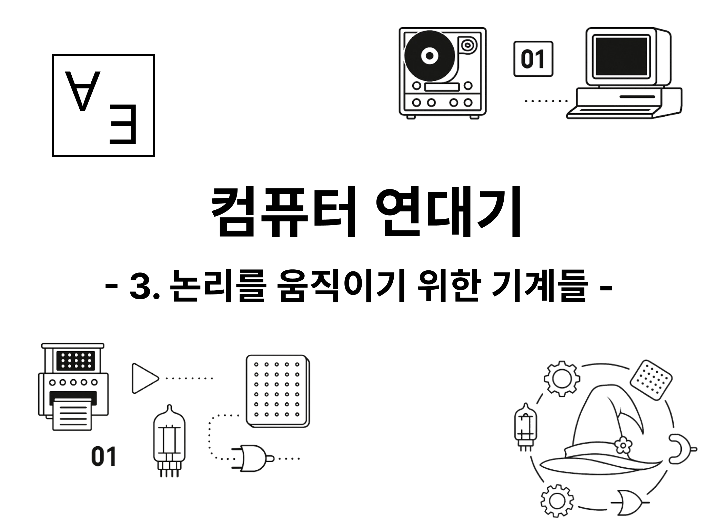
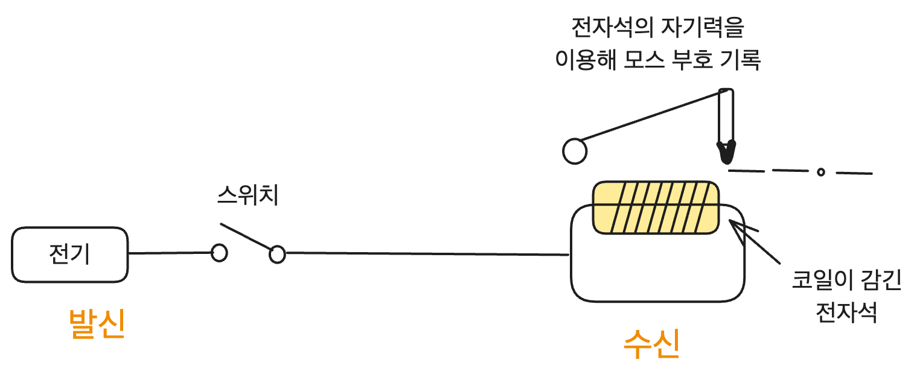
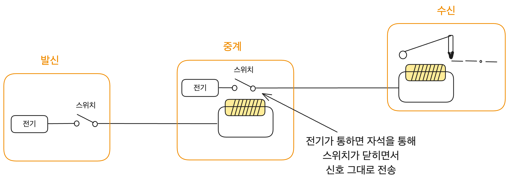

# 이 글은 작성 중입니다.

# 생각을 움직이게 하기 위하여

오늘날의 컴퓨터는 계산만을 위한 장치가 아니다.[^1] 명령에 따라 정보를 처리하고 상태를 기억하고 복잡한 제어가 가능한 시스템이다. 그 이론적 시작점은 앞서 보았듯 1936년 튜링의 논문이다. 하지만 컴퓨터가 실제로 구현되기까지는 여러 기술의 축적이 있었다.

인간은 오랫동안 반복적인 일을 쉽게 하기 위한 도구를 만들어왔다. 주판이나 톱니바퀴 계산기처럼 계산을 돕는 장치부터 미리 설계된 패턴을 반복하는 방직기와 같은 장치들. 그리고 중요한 정보를 멀리서 전달하기 위한 방법들도 만들었다. 봉화나 수기 신호 같은 것들.

이 기술들이 탄탄한 이론적 토대를 기반으로 한 건 아니었다. 당장의 필요를 위한 기계들이었다. 그러나 오히려 그런 당장의 필요에 의했기 때문에 실험을 통한 더욱 빠른 발전이 가능했다.

그럼 이제 튜링 이전까지 세상을 움직였던 기계들을 따라가 보자. 그 기계들은 어떻게 사람을 대신했으며 어떻게 계산과 제어와 통신을 만들어 나갔는지. 현실 속 컴퓨터의 조각들을 찾아보자.

# 전기의 시대

전기는 오랫동안 인간에게 신비한 자연현상이었다. 그러나 18세기 중후반부터 사람들은 전기를 분석하고 다루기 위한 시도를 시작했다. 그리고 이러한 발전이 쌓여서 19세기에 절정을 이룬다. 바야흐로 전자기학의 시대였다.

전기에 대한 기술이 엄청나게 발전했다. 1800년에는 볼타가 볼타 전지를 발명했고 1807년 험프리 데이비가 아크 램프를 발명했다. 전기에 대한 지식도 쌓여갔다. 외르스테드와 앙페르가 전자기 개념의 단초를 제공했고 패러데이와 맥스웰 같은 과학자들이 전기공학을 정립했다. 이 기술들은 2차 산업 혁명까지 견인하게 된다.

전기에 의해서 새로운 것들이 가능해졌다. 에디슨은 전구를 통해 전기 조명의 시대를 열었다. 전기 모터와 발전기는 산업의 심장이 되었다. 또한 전신과 전화는 전기를 통해 소통까지 가능함을 보였다.

이외에도 수많은 천재들의 빛나는 발명들이 있었다. 그런데 이것들이 대체 컴퓨터와 무슨 상관일까? 그때까지 만들어온 도구들의 발전이 전기로 인해서 날개를 달았고 결국 컴퓨터의 기초가 되었기 때문이다.

전기는 단지 새로운 동력원에 그치지 않았다. 전기는 정보를 전달했고 장치를 제어하는 수단이 되었다. 사람의 손을 거치지 않고도 기계가 전기를 통해 스스로 반응할 수 있게 되었다. 컴퓨터로 가는 길이 열렸다.

# 패턴을 읽는 기계들

## 자카르의 방직기

> 1801년 드디어 조셉 마리 자카르는 완전히 자동화된 천에 무늬 넣는 기계를 발명했다. (...) 이전까지는 씨실이 날실을 가로지르기 전 방직공이 고리들을 재설정해야 했으나, 이제는 미리 그려진 패턴을 한 줄씩 천공카드에 새기면 기계를 반복해 동작시킬 수 있었다.
>
> 더멋 튜링 지음, 김의석 옮김, "계산기는 어떻게 인공지능이 되었을까?", 한빛미디어, 41p

프랑스의 직조공 조셉 마리 자카르(Joseph Marie Jacquard)는 천공 카드를 이용해서 무늬를 자동으로 넣을 수 있는 자카르 방직기를 만들었다.

기존에 직물을 짤 때는 베틀 하나에 2명이 붙어서 일했다. 베틀 앞에는 수석 직공이 앉았다. 조수는 베틀 가로대에 기어 올라가 수석 직공의 꼭두각시처럼 베틀의 수많은 실들을 움직였다.

그러나 자카르가 만든 방직기가 이 조수를 대체했다. 이제는 천공 카드에 구멍을 뚫어 놓고 카드가 기계에 들어가면 베틀의 위쪽에 있는 제어 장치가 자동으로 날실을 올리고 내렸다. 이전에 만들어진 자동 장치들이 종이에 새겨진 구멍 등을 통해 일정한 움직임을 반복하는 방식을 참고한 거였다.[^2]

자카르 이전까지 자동 장치들은 주로 구멍이 뚫린 종이 테이프를 사용했다. 그러나 자카르 방직기는 연결된 천공 카드 뭉치를 사용했다.

천공 카드는 안정적인 방식이었다. 자카르가 24000장의 천공 카드를 사용해서 자신의 초상화를 그릴 수 있을 정도로 말이다. 그걸 증명이라도 하듯 자카르 방직기는 널리 사용되었고 천공 카드도 이후 오래도록 사용되었다.

## 찰스 배비지

> 검산하면 할수록 잘못된 결과가 자꾸 나타나자 배비지는 화가 나서 말했다. "신이시여, 증기기관을 이용해서 수치 계산을 할 수 있었으면 좋겠습니다!"
>
> 박민규, "세상을 발칵 뒤집어 놓은 IT의 역사", 19p

컴퓨터의 역사를 서술한 글에서는 이즈음의 진도에서 배비지(Charles Babbage)의 시대를 앞선 도전을 언급한다. 크랭크만 돌리면 자동으로 계산을 해주던 차분 기관과 오늘날의 컴퓨터와 비슷한 구조를 가졌던 해석 기관의 꿈에 대하여 말이다. 전기도 표준 부품도 컴퓨터 구조 비슷한 것도 없던 시절이었다는 걸 생각하면 정말 놀라운 시도였다.

하지만 냉정하게 말해서 배비지의 시도는 전혀 성공적이지 못했다. 그는 20세기 중반에 재발견될 때까지 사람들에게 잊혀졌다. 이후 컴퓨터 발전의 흐름에도 실질적인 영향을 주지 못했다. 따라서 그의 선구적이지만 외로웠던 시도들은 부록과 같은 글에서 다루도록 하자.[^3] 대신 좀더 역사에 직접적인 영향을 미쳤던 홀러리스의 태뷸레이터를 다루겠다.

## 홀러리스의 태뷸레이터

> 배비지와는 달리 홀러리스는 그의 명성을 빛내는 수많은 유용한 혁신을 이루어냈고 그 대부분이 그에게 상당한 부와 이 세상에서 결코 잊혀지지 않을 명성을 안겨주었다.
>
> 조엘 셔킨 지음, 과학세대 옮김, "컴퓨터를 만든 영웅들", 80p

미국 헌법은 10년마다 한번씩 인구 조사를 실시하도록 규정하고 있다. 첫 조사는 1790년 9월 2일 시작되었으며 약 390만명 정도의 주민이 있다는 사실을 보여주었다. 하지만 인구는 계속 늘어났고 인구 조사는 엄청난 대사업이 되었기에 이를 더 빨리 처리할 방법이 필요했다.

첫번째 해결책은 1870년의 인구 조사 책임자였던 찰스 W. 시톤이 자료를 취합하는 걸 돕는 간단한 기계를 만들면서 시작되었다.[^4] 하지만 여전히 느렸다. 1880년의 인구조사는 약 5천만 명을 대상으로 진행되었으며 정리하는 데에 8년이 걸렸다. 이 추세대로라면 다음 인구조사를 정리하는 데에는 10년이 넘게 걸릴 걸로 예상되었다.

이때 허먼 홀러리스(Herman Hollerith)가 등장한다. 그는 인구 조사 업무를 효율적으로 처리하기 위해 천공 카드를 사용하는 기계를 만들었다. 그리고 천공 카드를 전기를 이용해 처리하도록 했다.

사람의 정보를 카드 한 장에 뚫린 구멍들로 요약해서 저장하고 그 구멍을 전기적으로 판독하도록 하는 장치를 만드는 거였다. 금속 핀이 카드 위로 움직이면서 구멍이 뚫린 부분을 통해서 전기를 흘리고, 그러면 기계가 작동해서 카드를 적절한 통에 분류하는 방식이었다. 가령 카드의 특정 위치에 구멍이 뚫려 있으면 이 카드가 기록하는 사람은 남자라고 분류하는 거였다.

그는 광산 기사 일을 하고 있었는데 미시간의 광산들을 철도로 여행하면서 이 생각을 떠올렸다고 전해진다. 당시의 기차 탑승권은 머리 색깔 등 개인적인 특성을 승차권에 구멍을 뚫어 놓는 방식이었다. 또한 앞서 언급한 자카르 방직기도 여러 공장에서 사용하고 있었고 홀러리스의 처남도 비단 직조공으로 이 방직기를 사용했기에 그 영향이 있었을 거라는 추측도 가능하다.

아무튼 홀러리스는 이 기술로 특허를 신청하고 인구조사 또한 훨씬 빠르게 마칠 수 있도록 만들었다. 홀러리스의 기계는 특정 위치에 구멍이 있는 카드를 고르도록 프로그래밍할 수도 있었다. 처음에는 배선판을 이용해서 프로그래밍을 했으나 이후에는 천공 카드를 통해 프로그래밍할 수 있게 개선되었다.

그리고 이걸 바탕으로 홀러리스는 제표기회사(Tabulating Machine Company)를 설립한다. 제표기회사는 다른 국가들의 인구조사에서도 홀러리스의 기계를 사용하도록 계약을 맺었다. 그리고 이 기술이 인구조사 외에도 농업 통계, 철도 사업의 통계 등에도 활용될 수 있도록 확장하였다.

이후 제표기회사는 찰스 란레트 플링트(Charles Ranlett Flint)라는 경영자에게 인수된다. 플링트는 그가 시계회사들을 통합하여 만든 국제 타임 레코딩 사를 비롯한 여러 회사들을 통합해 컴퓨팅-태뷸레이팅-레코딩 사(Computing-Tabulating-Recording Company, CTR로 널리 알려짐)를 설립하며 홀러리스는 여기서 자문역으로 활동한다.

이 회사는 1924년 이름을 바꾸게 되는데 그게 바로 오늘날에도 건재한 IBM이다.

# 전기부터 전신까지

## 전선을 타고 흐르는 언어, 전신

> 인간은 선천적으로 발견과 혁신에 대한 갈망을 가지고 있다. 패러데이, 맥스웰 등이 전자기 세계의 자연법칙들을 밝혀내기 훨씬 전부터 이미 사라들은 전기를 다른 용도로 쓰려고 시도해 왔다.
>
> 데릭 청, 에릭 브랙 지음, 홍성완 옮김, "전자정복", 57p

전기는 신호를 전하는 매개체로도 쓰이기 시작했다.

사실 전기를 이용해 메시지를 전송하려는 시도는 꽤 오래되었다. 1746년에도 장 앙투안 놀레(Jean Antoine Nollet)라는 프랑스 사제가 전기를 이용한 메시지 전송에 대한 실험을 한 기록이 있다. 그는 200명의 사제들에게 놋쇠 막대기를 쥐고 1마일(약 1.6km)에 걸쳐 연결되어 있도록 한 후 전기를 흘려보냈다.

불쌍한 사제들은 전기를 흘려보내는 순간 전기 충격을 받아 마비 상태가 되어버렸다. 이걸 본 놀레는 전기가 퍼져나가는 속도가 무한히 빠르다는 결론을 내린다. 광속에 대한 정확한 인식이 없었던 시대라는 걸 생각하면 충분히 합리적이었다. 또한 이건 오늘날에는 한심해 보일 수 있지만 전기를 이용한 통신의 가능성을 보여준 실험이었다.

시간이 흘러 미국의 새뮤얼 모스(Samuel Morse)가 등장한다. 그는 미술을 공부했는데, 풍경화를 전공하다가 전공을 초상화로 바꿨다. 당시 상류층의 초상화를 그리면 돈을 꽤 벌 수 있었기 때문이다. 모스는 초상화가로서 괜찮은 수입을 올렸지만 초상화를 그리기 위해서는 의뢰인이 살고 있는 곳으로 가서 머물러야 할 때가 많았다.

그렇게 일을 위해 집을 비운 사이 모스의 아내가 사망한다. 하지만 빨리 소식을 전할 수 있는 방법이 마땅치 않던 시절이라 모스는 집에 거의 다 와서야, 아내의 장례식까지 끝나고 나서야 그 소식을 듣게 된다.

이후 전시를 위해 유럽에 다녀오던 모스는 배에서 우연히 전기를 이용한 통신에 대한 이야기를 듣게 된다. 당시 유럽에서는 전기를 이용한 통신이 활발히 연구되고 있었다. 모스는 이 이야기를 듣고 전기 신호를 이용한 통신 장치를 만들기로 결심한다. 그렇게 몇 년 간의 연구와 여러 조언, 협업을 통해 1837년 모스는 전신을 발명하게 된다.

1844년 워싱턴-볼티모어 간의 전신 개통을 시작으로 모스의 전신은 엄청나게 빠르게 미국 전역으로 퍼져나갔다. 1846년 말에는 워싱턴과 볼티모어를 잇던 44마일의 전신선이 전부였지만 1855년에는 42,000마일에 달하는 전신선이 미국을 가로지르고 있었다.

또한 모스는 전신을 통해 통신하기 위한 부호 체계인 모스 부호(Morse Code)도 만들었다. 모스 부호는 짧은 신호와 긴 신호를 조합하여 알파벳과 숫자를 표현하는 방식으로, 오늘날에도 여전히 사용되고 있다.

## 신호를 잇는 스위치, 릴레이

> 릴레이는 매우 중요한 장치입니다. 일종의 스위치지만 사람의 손이 아닌 전류에 의하여 그 스위치를 제어하는 것이 특징입니다. 아마 이 장치를 이용해서 뭔가 놀라운 일을 할 수 있을 것 같습니다. 실제로 이 장치를 이용하여 컴퓨터와 같이 대단한 것도 만들어 낼 수 있습니다.
>
> 찰스 펫졸드 지음, 김현규 옮김, "CODE 2판", 85p

전신의 원리는 간단하다. 송신측에서 전선에 전기를 흘리면 전선으로 연결된 수신 측에서도 전기가 통한다. 그러면 수신측 전선에 연결된 전자석(금속 막대에 코일을 감아 만들 수 있다)이 자석이 되면서 펜 등의 기록 도구를 끌어당기고 모스 부호를 기록한다. 전기가 통할 때만 자석이 되는 원리를 이용한 것이다. 그림으로 나타내면 다음과 같다.

이렇게 모스 부호를 직접 기록하는 방식은 비효율적이고 복잡해서 이후 소리를 이용하는 방식 등으로 개량되지만 구체적인 방식은 중요하지 않다. 중요한 건 전기를 이용해서 정보를 전달할 수 있는 방법이 생겼다는 사실이다. 당시에 전기를 이용한 다른 통신 방식들도 있었지만 모스의 전신 시스템이 가장 안정적으로 동작하여 널리 사용되었다.

하지만 모스의 전신 시스템도 한계는 있었다. 전선 또한 저항이 있는 물체이기 때문에 전선의 길이가 너무 길어지면 전기가 약해져서 신호를 수신하는 곳까지 전기를 제대로 전달할 수 없었다. 이 문제를 어떻게 해결할 수 있을까?

이렇게 장거리 전신에서 신호가 약해지는 걸 해결하는 가장 직관적인 방식은 신호의 전달 경로 중간중간에 중계소를 두는 것이다. 가령 서울에서 부산까지 전신을 보낸다고 하자. 그러면 대구쯤에 작은 전신국을 둔다. 그리고 서울에서 대구 전신국까지 먼저 전신을 보낸 후 대구 전신국의 직원이 부산 전신국에 그대로 전신을 보내면 된다.

그런데 굳이 직원을 둘 필요가 있을까? 다음 그림처럼 전자석의 자기력을 이용해서 중계소의 스위치를 켜고 끄도록 하면 직원 없이도 그대로 신호를 중계할 수 있다.

이렇게 전자석을 이용한 중계기를 릴레이라고 했다. 말 그대로 신호를 릴레이하듯이 보낸다는 의미였다. 모스가 바로 이 릴레이를 사용해서 장거리 전신의 문제를 해결했다. 릴레이를 이용해 신호가 전달되는 거리를 획기적으로 늘릴 수 있었고 모스의 기술을 차별화하는 장점이 되었다고 한다. 당시 스미소니언 연구소장이었던 조지프 헨리(Joseph Henry)가 이 릴레이를 발명했으며 그 개념을 모스에게 알려주었다고 전해진다.

그런데 릴레이의 의미는 단순히 신호 전달에서 끝나지 않았다. 이건 일종의 제어 장치였다. 사람의 손 대신 전류를 통해 스위치를 제어할 수 있게 되었고 회로를 구현할 수 있게 되었다. 이는 오늘날 컴퓨터를 구성하는 AND, OR, NOT 같은 논리 연산을 구현하는 물리적 기반이었다.

이 시리즈에서 자세히 다룰 예정은 아니지만 실제로 이후 독일의 콘라트 추제(Konrad Zuse)의 Z3나 하버드 대학교의 하버드 마크 1 등 초기의 몇몇 컴퓨터들이 릴레이를 기반으로 만들어졌다. 구조만 놓고 보면 오늘날의 컴퓨터도 릴레이만으로 구성할 수 있다. 물론 그러려면 엄청나게 많은 부품과 공간이 필요할 것이다.[^5]

즉, 이론적으로는 전신에 쓰이던 릴레이만으로도 컴퓨터를 구현할 수 있었다. 하지만 현실적으로는 큰 문제가 있었다. 너무 느렸고, 너무 컸다. 전자석이 스위치를 당겨서 물리적으로 접점을 붙이는 방식은 작동 속도가 느렸고, 금속 접점은 마모되기 쉬웠다.

좀 더 실용적인 컴퓨터를 위해서는 릴레이보다 더 빠르고 작은 스위치가 필요했다. 이 문제를 해결해 준 것이 바로 진공관이었다.

# 진공관에서 라디오까지

물리적인 방식이 아니라 전기를 통해 작동하는 스위치가 필요했다.

## 진공관의 등장

> 진공관 소자는 증폭, 스위치, 정류, 발전, 발광, 수광 등 반도체 소자가 나오기 전까지 현재 반도체 소자가 하는 모든 일을 하고 있었다.
>
> 최리노, ["[반도체의 이해 1편] 반도체를 이해하기 위해 알아야 할 역사적 사건들 (1/7)"](https://news.skhynix.co.kr/rino-choi-column-1/)

1882년의 어느 날, 우리가 익히 알고 있는 발명왕 에디슨(Thomas Edison)은 전구의 필라멘트에서 발생하는 탄소 입자 부스러기가 내벽을 그을리는 문제를 해결하기 위해 실험을 하고 있었다. 그러던 중 필라멘트 위에 구리판을 설치해서 내벽을 탄소 입자에서 보호하려는 시도를 한다. 여기서 에디슨은 전혀 기대하지 않았던 발견을 했다. 구리판에 적용된 전압이 필라멘트보다 더 양성(+)이면 필라멘트에서 구리판으로 전류가 흐른다는 사실이었다. 오늘날에는 이 현상을 정류(rectification)라고 부른다.

하지만 에디슨은 새로운 전기 현상을 발견하는 데 큰 관심이 없었다. 또 당시에는 전기에 대한 이해가 부족했기 때문에(전자가 발견되기도 전이었다) 이 현상을 제대로 설명할 수 있는 사람도 없었다. 에디슨은 이 장치에 대해 특허만 출원한 후 다른 실험에 몰두했다.

시간이 지나 1900년 존 앰브로스 플레밍(John Ambrose Fleming)은 무선 전신 시스템에서 무선 신호 수신에 대한 연구를 하고 있었다. 당시에는 대서양 횡단 무선 전신이 계획되고 있었는데 기존에 쓰이던 신호 감지기는 너무 감도가 낮고 느려서 사용할 수 없었다.

마침 플레밍은 Edison-GE의 영국 지사 기술 자문이었기에 에디슨의 실험 결과에 대해 알고 있었다. 그는 에디슨이 알아낸 걸 바탕으로 새로운 장치를 만들기로 한다. 그렇게 1904년 플레밍은 2극 진공관을 발명하게 된다. 이건 당연히 정류 작용을 할 수 있었다. 그리고 무선 전파가 안테나에 도달하면 발생하는 약한 교류 신호를 감지할 수 있는 장치로 사용되었다. 이건 무선 전신 시스템을 엄청나게 개선했으며 전력 공급 설계에서도 교류를 직류로 변환할 때 사용되었다.

그리고 1906년, 리 드 포레스트(Lee De Forest)라는 청년이 등장한다. 그는 플레밍의 2극 진공관을 어떻게 개량할 수 있지 않을까 하고 여러 실험을 진행했다. 그 과정에서 3극 진공관을 발명한다. 플레밍의 2극 진공관에 그리드(Grid)라는 전극을 추가한 것이다. 이 그리드는 음극과 양극 사이에 위치하여 전류의 흐름을 조절할 수 있었다. 즉, 작은 전류로 큰 전류를 제어할 수 있는 증폭기 역할을 할 수 있었다.

3극 진공관은 릴레이보다 훨씬 효율적인 스위치로도 사용할 수 있었다. 그리드에 전압을 가하기에 따라 전류 흐름을 on/off할 수 있었기 때문이다. 비싸고 전력 소모가 심하고 열도 많이 나고 수명도 짧았지만, 릴레이보다 작았고 전기의 속도로 동작했으므로 릴레이보다 1000배 이상 빨랐다.

## 전화에서의 활용

> "왓슨, 이리 와주게. 자네가 필요해." 이제 늙은이가 된 벨이, 거의 40년 전에 보스턴에서 전화를 발명한 날 왓슨에게 했던 말을 흉내 내면서 말했다.
>
> "지금 거기까지 가려면 1주일이 걸릴 텐데요." 왓슨이 대답했다.
> 
> 존 거트너 지음, 정향 옮김, "벨 연구소 이야기", 38p, AT&T의 대륙 횡단 회선 개통 기념식에서 벨이 미국 대륙 반대쪽에 있는 왓슨과 통화하면서.

1876년 알렉산더 그레이엄 벨(Alexander Graham Bell)이 전화기에 대한 특허를 출원한다.[^6] 그리고 벨은 이 특허를 기반으로 그의 장인인 가디너 허버드와 함께 벨 전화 회사를 설립하고 전화 사업을 시작한다. 이 회사는 1907년쯤에는 전화 시장을 호령하는 거대 기업이 되어 있었고 이름도 AT&T(American Telephone and Telegraph Company)로 바뀐 상태였다.

하지만 전화의 특허가 만료되고 수많은 경쟁사들이 난립하면서 AT&T의 시장 점유율은 급격히 떨어지는 중이었다. 그래서 AT&T는 경쟁사들과의 차별화를 위해 미국 전역을 연결하는 대규모 전화 네트워크를 구축하기로 한다.

그러려면 당연히 신호를 전달하는 길이가 엄청나게 길어졌다. 그만큼 먼 거리에 걸쳐 신호를 전송하려면 전신이 맞닥뜨렸던 것과 같은 문제, 전선의 저항에 의해 신호가 약해지는 문제를 해결해야 했다. 이때 AT&T의 자회사였던 웨스턴 전기의 엔지니어 한 명이 리 드 포레스트의 3극 진공관을 사용해서 신호를 증폭하자는 아이디어를 낸다. 이 설계는 아주 잘 동작했고, 3극 진공관을 이용해 전화 서비스는 전국으로 확장될 수 있었다.

그렇게 1914년 AT&T는 뉴욕부터 샌프란시스코를 잇는 대륙 횡단 전화 회선 개통식을 열고, 이제 노인이 된 벨과 그의 파트너 왓슨을 초대해 통화하는 행사를 열었다. 벨은 전화를 처음 발명하던 40년 전처럼 "왓슨, 이리 와주게. 자네가 필요해."라고 말했다. 40년 전에는 옆방에서 대답하던 왓슨이었지만 이제는 대륙을 가로질러 대답하고 있었다.

이후 AT&T는 3극 진공관에 적극적으로 투자했고 관련 사업도 빠르게 성장했다. 머지않아 3극 진공관에 대한 다양한 시도가 이루어졌고, 무선으로 음성과 음악을 전달한다는 아이디어 그러니까 라디오로 이어졌다.

## 라디오와 RCA

> 수백 개의 다른 종류 진공관 모델이 자세한 특징과 함께 나와 있었던 RCA사의 카탈로그는 기술자들과 취미로 기계를 다루는 사람들 사이에서는 필수였다.
>
> 마틴 데이비스 지음, 박상민 옮김, "오늘날 우리는 컴퓨터라 부른다", 258p

3극 진공관의 등장은 통신의 가능성을 비약적으로 넓혔다. 전파는 더 멀리까지 전달될 수 있었고 아주 작은 신호만 감지해도 그 신호를 증폭하고 제어할 수 있었다. 그리고 에드윈 H. 암스트롱(Edwin H. Armstrong)이 3극 진공관 기반으로 음성 신호를 전달하는 방식을 개발했다. 이로 인해 GE, AT&T 등 당시 전자 산업의 공룡들이 라디오를 개발하기 시작한다.

라디오 기술은 군사적인 필요성에 의해서 더욱 급격히 발전했다. 전투기 조종사들은 라디오를 이용해서 통신을 주고받았고 해군도 마찬가지였다. 당시 미국 해군은 무선 기술을 국가 안보의 핵심 자산으로 보았고 많은 지원을 했다. 또한 해군에서 무선 산업을 통제하려고 시도했다.

민간 산업을 군의 관리 하에 두려는 이 시도는 실패했지만 여전히 해군과 미국 정부는 안보에 위협이 되지 않는 방향으로 라디오 기술을 활용하는 방식을 고민했다. 그래서 정부는 민간 기업이지만 어느 정도 통제를 받는 새로운 회사를 설립하기로 한다.

그렇게 GE, AT&T, 웨스팅하우스 등의 회사들이 조금씩 투자하여 1919년에 설립한 회사가 RCA(Radio Corporation of America)였다. 여기서 국가 안보에 관한 사안의 경우 미 해군이 일부 권한을 행사할 수 있도록 했다.

RCA는 단순한 제조사가 아니었다. 이 회사는 여러 이해 당사자들의 기술과 특허를 묶는 방식으로 구성되었고 미국 정부의 지원 아래 거의 독점으로 운영되었으며 그 이점을 잘 살리는 법을 알고 있었다. RCA는 방송 네트워크를 구축하고 경쟁사들을 적극적으로 인수하는 등 미국 중심의 무선 통신 체계를 구축하는 데 혁혁한 공헌을 한다.

AT&T의 전화와 RCA의 라디오 산업 발전으로 인해 진공관은 점점 개선되었고 가격도 저렴해졌다. 진공관은 이제 단순한 물리학적인 장치가 아니라 새로운 미디어 환경의 심장이었다. 이런 영향력은 1930년대에 절정에 달했는데 RCA에서 발행하는 진공관 카탈로그가 전자공학 매니아들에게는 필수품으로 여겨질 정도였다.

# 튜링이 진공관과 만나다

그리고 1943년의 어느 날, 미국을 몇 달 간 방문하고 돌아가는 튜링의 손에도 RCA 카탈로그가 들려 있었다. 그는 벨 연구소에서 클로드 섀넌(Claude Shannon, 불 대수를 스위치 회로로 구현할 수 있다는 사실을 증명)과의 교류를 통해 진공관이 논리 회로를 구현하는 데 사용될 수 있다는 사실을 알고 있었다.

튜링은 한순간도 범용 기계의 구현에 관한 생각을 놓지 않았기에 진공관을 이용하면 자신이 생각하는 범용 기계를 만들 수 있을 거라는 확신을 빠르게 가지게 된다. 그가 보던 RCA 카탈로그는 부품 정보의 지루한 나열이 아니라 종이 위에서만 존재하던 범용 기계를 현실에 불러낼 수 있는 명세서였던 셈이다.

전기로부터 시작된 실험들이 컴퓨터 앞으로 모여들고 있었다. 전혀 관련 없어 보이는 발견들이 이어져서 기계의 기억과 제어를 가능하게 했고, 현실 속의 튜링 기계-컴퓨터-로 이어지는 길을 열었다. 그럼 다음 글에서는 마침내 현실에 나타난 첫 번째 컴퓨터들의 이야기, 그리고 그 탄생에 얽힌 전쟁과 사람들의 이야기를 따라가 보자.

# 참고문헌

일반적인 컴퓨터공학 전공수업에서 다루는 지식들도 조사한 내용을 이해하는 데 많은 도움이 되었다. 이 글 같은 경우에는 특히 디지털회로, 컴퓨터구조와 같은 수업이 크게 도움이 되었다.

## 도서

조엘 셔킨 지음, 과학세대 옮김, "컴퓨터를 만든 영웅들", 1992, 풀빛

마틴 데이비스 지음, 박상민 옮김, "오늘날 우리는 컴퓨터라 부른다", 인사이트

더멋 튜링 지음, 김의석 옮김, "계산기는 어떻게 인공지능이 되었을까?", 2019, 한빛미디어

알렉산더 R. 갤러웨이 지음, 이나원 옮김, "계산할 수 없는: 장기 디지털 시대의 유희와 정치", 2023, 장미와동백

도런 스웨이드 지음, 이재범 옮김, "톱니바퀴 컴퓨터", 2016, 지식함지

찰스 펫졸드 지음, 김현규 옮김, "CODE 2판", 2023, 인사이트

이광근 지음, "컴퓨터과학이 여는 세계: 세상을 바꾼 컴퓨터, 소프트웨어의 원천 아이디어 그리고 미래", 인사이트

데릭 청, 에릭 브랙 지음, 홍성완 옮김, "전자정복", 2015, 지식의날개

최리노 지음, 최세나/최태환/홍예은 그림, "최리노의 한 권으로 끝내는 반도체 이야기", 2022, 양문

## 위키피디아 문서

- [Relay](https://en.wikipedia.org/wiki/Relay)
- [Thermionic emission](https://en.wikipedia.org/wiki/Thermionic_emission)
- [Joseph Marie Jacquard](https://en.wikipedia.org/wiki/Joseph_Marie_Jacquard)
- [History of computing hardware](https://en.wikipedia.org/wiki/History_of_computing_hardware)
- [Tabulating machine](https://en.wikipedia.org/wiki/Tabulating_machine)
- [1880 United States census](https://en.wikipedia.org/wiki/1880_United_States_census)
- [Punched card](https://en.wikipedia.org/wiki/Punched_card)
- [Herman Hollerith](https://en.wikipedia.org/wiki/Herman_Hollerith)
- [Charles Ranlett Flint](https://en.wikipedia.org/wiki/Charles_Ranlett_Flint)
- [Computing-Tabulating-Recording Company](https://en.wikipedia.org/wiki/Computing-Tabulating-Recording_Company)
- [전기](https://ko.wikipedia.org/wiki/%EC%A0%84%EA%B8%B0)
- [Harvard Mark I](https://en.wikipedia.org/wiki/Harvard_Mark_I)
- [Flip-flop (electronics)](https://en.wikipedia.org/wiki/Flip-flop_(electronics))

## 기타 자료

나폴레옹과 컴퓨터...허먼 홀러리스

https://www.sedaily.com/NewsView/1KSO8TYTRJ

최리노 교수의 반도체의 이해 시리즈

https://news.skhynix.co.kr/series/choirino-column/

What is the difference between a Latch and a Flip-Flop?

https://www.reddit.com/r/AskElectronics/comments/cm0fs2/what_is_the_difference_between_a_latch_and_a/

[^1]: 기존에 컴퓨터라는 단어는 오늘날 우리가 생각하는 컴퓨터가 아니라 계산을 맡아서 수행하는 사람의 의미로 사용되었다. 특히 20세기의 여성 컴퓨터들에 대한 이야기가 많이 알려져 있다. "사라진 개발자들", 그리고 좀 더 극적인 방식으로는 "히든 피겨스" 등을 참고할 수 있다. 그 이전의 인간 컴퓨터들에 대한 이야기들에 대해서는 참고문헌의 도서들에서 찾아볼 수 있다.

[^2]: 자카르가 완전히 새로운 걸 바닥부터 만들었다기보다는 부숑 등이 아이디어를 낸 기존의 기술을 재발견하여 결합한 것이기는 하다. 이에 대해서는 위키피디아의 "History of computing hardware" 문서와 알렉산더 R. 갤러웨이의 "계산할 수 없는" 94-95쪽을 참고.

[^3]: 필요하다면 조엘 셔킨의 "컴퓨터를 만든 영웅들", 도런 스웨이드의 "톱니바퀴 컴퓨터" 등을 참고할 수 있다.

[^4]: 이 자세한 동작에 대해서는 조엘 셔킨의 "컴퓨터를 만든 영웅들" 79쪽을 참고

[^5]: 이에 대해서는 찰스 펫졸드의 "CODE" 등을 참고

[^6]: 벨이 전화기를 최초로 발명한 건 아니라는 게 중론이다. 긴 이야기가 있지만 이 글의 전개에는 관련이 없으므로 생략하자. 흥미가 있다면 세스 슐만, "지상 최대의 과학 사기극" 등의 도서를 참고할 수 있겠다.

[^7]: 플립플롭(Flip-flop)이라고도 한다. 자료에 따라 래치와 플립플롭을 구분하기도 하고 구조도 다르게 설명하는 경우도 있지만 여기서의 핵심은 정보를 저장할 수 있는 장치의 존재 그 자체이기 때문에 엄격하게 구분하지 않겠다. 이 구체적인 차이를 다룬 문서에 대해서는 [전자공학 StackExchange의 질문과 답변](https://electronics.stackexchange.com/questions/21887/difference-between-latch-and-flip-flop), [UCR 강의 자료](https://cs.ucr.edu/~ehwang/courses/cs120b/flipflops.pdf) 등을 참고