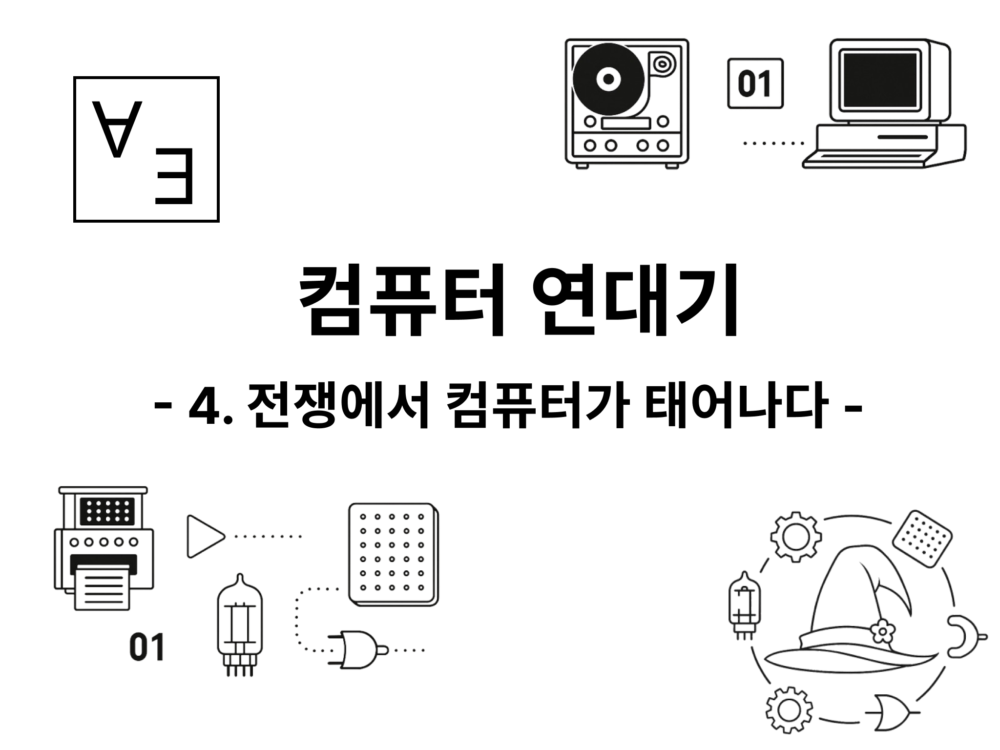

# 이 글은 작성 중입니다.

# 컴퓨터가 필요해지다

힐베르트는 그 자체로 완벽하며 모든 것을 설명할 수 있는 논리 체계를 만들고 싶어했다. 괴델이 그 꿈을 좌절시켰다. 튜링은 그 좌절의 자리에서 범용 튜링 기계라는 개념을 만들어냈다. 비록 이 정도로 대단한 만능 기계도 할 수 없는 일이 있다는 걸 보이기 위해서였지만 어쨌든 그건 인간이 만들어낸 논리 이론의 모든 계산 가능한 문제를 풀 수 있었다.

그러나 그 기계는 실제로 존재할 수도 없었고 존재할 필요도 없었다. 무한한 길이의 테이프가 대체 어디에 있단 말인가? 테이프 한 칸씩만 읽을 수 있는 기계가 어디에 쓰일 수 있단 말인가? 튜링 기계는 결정 불가능 문제에 대한 증명 재료일 뿐이었다.

하지만 그로부터 몇 년 후 전쟁이 시작되었다. 이 전쟁에서는 이전과 달리 암호 통신이 아주 중요한 역할을 했다. 적국의 암호를 해독하는 데에 필요한 계산은 더 이상 인간의 손으로 감당할 수 없을 만큼 복잡해졌다. 빠르고 정확한 계산을 어떻게 해낼지가 전쟁의 승패를 좌우하게 되었다.

그런 계산을 위해 여러 자동 기계가 만들어졌다. 거기 참여한 사람들은 스스로 자각하고 있지는 못했지만 컴퓨터로 향하는 길을 열고 있었다.

# 2차 세계 대전

> 전격전! 전격전! 전격전! 프랑스의 패망과 영국에 대한 대규모 폭격작전이 개시된 몇 주 동안 이 단어는 사방에서 우리의 귓가에 울리고 있다. (...) 폴란드, 노르웨이, 네덜란드, 벨기에 그리고 프랑스 전역에서의 역사적 사건을 설명할 때 적합한 단어는 오직 '전격전'뿐이다. 번개 같은 속도와 살상력으로 우리 독일군은 위대한 승리를 쟁취했으며, 어떤 장애물도 우리를 막을 수 없었다.[^1]
>
> 칼 하인츠 프리저 지음, 진중근 옮김, "전격전의 전설", 36p에서 《전격전의 심리적 충격》 부분

## 전쟁에서의 암호 통신

1939년 9월 1일, 독일군이 폴란드를 침공하면서 제2차 세계 대전이 시작되었다. 독일군은 폴란드 이외에도 프랑스, 영국 등의 나라와 전쟁을 벌이게 된다. 전쟁의 전개에 대해서는 이야기에 필요한 부분만 다룰 예정이다. 다만 어떤 전투가 어떻게 진행되었건 간에 확실한 건 이 전쟁에서 신호와 통신이 아주 중요한 역할을 했다는 사실이다.

독일은 전격전(Blitzkrieg) 전술을 사용하여 빠르게 진격했다. 전차 부대가 돌진했고 항공기가 하늘에서 지원했다. 신속한 기동과 집중된 화력이 적을 무너뜨리면서, 말 그대로 번개처럼 전선을 밀어붙였다. 이 전술은 정말 성공적이어서 전력상으로는 대체로 우세했던 폴란드와 프랑스를 순식간에 무너뜨릴 수 있었다.

대서양에서도 독일 해군의 잠수함 전술이 선전했다. 독일군의 유보트 잠수함들은 울프팩(Wolfpack)이라 불리는 전술로 연합군의 수송선들을 괴롭혔다. 한 대의 유보트가 적 수송선을 발견하면 즉시 신호를 보냈다. 그러면 근처의 다른 유보트들이 모였고 호위함에 비해 우세하다고 판단되면 여러 잠수함이 합동으로 공격을 시작했다. 이 전술은 전쟁 초기에 매우 잘 먹혀서 연합군의 물자 수송을 힘들게 했고, 특히 섬나라인 영국에 심각한 위협으로 작용했다.

서로를 직접 볼 수 없는 거리에 있는 전차와 잠수함들이 어떻게 서로를 인식하고 명령을 주고받으며 이런 신속한 전술을 펼칠 수 있었을까? 당연히 무선 통신 덕분이었다. 독일군은 전선에서 실시간으로 정보를 주고받았다. 공중을 날아다니는 신호 속 명령들이 독일군 부대들을 유기적으로 엮었다.

## 에니그마

연합국 측에서는 어떻게든 이런 공격에 대응해야 했다. 명령을 전달하는 신호들은 공기 중에 넘쳐났기 때문에 연합국에서도 이를 들을 수 있었다. 그저 안테나를 세워 신호를 잡기만 하면 되었다. 실제로 "Y 서비스"라는 작전으로 연합군은 독일군 통신을 감청하고 있었다.

문제는 신호의 해독이었다. 당연하지만 독일군도 중요한 정보가 담긴 신호를 그냥 주고받지는 않았기 때문이다. 독일군에서는 암호화 장비인 에니그마(Enigma)를 사용하여 통신을 암호화했다.[^2] 

에니그마는 전기를 이용해서 동작했던 장치로, 내부의 회전자를 회전시키면서 암호화된 신호를 만들어냈다. 이 회전자는 한 글자를 입력할 때마다 또 회전했기 때문에 매번 다른 암호화된 신호가 나왔다. 또한 회전자의 동작을 설정값을 통해 바꿀 수도 있었다.

독일군의 설정값은 매일 바뀌었으며 이론상 에니그마의 설정값은 $1.58 \times 10^{20}$가지가 가능했다. 에니그마의 이런 철저한 암호화 과정을 거치면 독일군의 신호는 완전히 무작위처럼 보이는 알파벳의 나열이 되었다. 에니그마 암호화의 자세한 과정이 궁금하다면 [에니그마 기계는 어떻게 작동했나요?](https://www.youtube.com/watch?v=ybkkiGtJmkM) 영상에서 볼 수 있다.

이 에니그마는 당시 기준으로 아주 잘 만들어진 암호화 장치였다. 에니그마는 완전히 기계적으로 동작했으므로 설정값만 알고 있다면 심지어 사람이 직접 해독할 수도 있었다. 알고리즘에 따른 지루한 계산 과정이 필요하긴 했겠지만 말이다. 하지만 설정값을 모른다면 우주의 수명이 끝날 때까지 시도해도 해독할 수 없었다. 심지어 오늘날의 컴퓨터로도 그렇다.

당연히 연합군 입장에서는 안 좋은 일이었다. 독일군의 신호를 아무리 도청해 봤자 에니그마 암호를 해독할 수 없다면 아무 소용이 없었기 때문이다. 어떻게든 이를 해독해야만 했다. 특히 영국은 섬이기 때문에 많은 물자를 해상에 의존했는데 독일군 잠수함에게 수송선이 족족 침몰당하고 있었다. 이대로는 영국 전체가 말라죽을 위기에 처했다.[^3]

## 폴란드의 암호 해독

에니그마의 해독은 결국 전쟁의 판도를 바꿀 중요한 열쇠였다. 그 문을 처음으로 연 건 폴란드였다.

1930년대 초반에 폴란드의 군 정보국은 독일의 암호화 동향을 예의주시하고 있었다. 폴란드 국경은 독일과 맞닿아 있었기에 당시 독일의 재무장 움직임은 폴란드에게 위협적으로 다가왔다. 폴란드는 여기에 대비하기 위해 독일군이 사용하는 걸로 알려진 에니그마의 해독을 시도했다.

여기에 핵심적인 기여를 한 건 수학과 학생이었던 마리안 레예프스키(Marian Rejewski)였다. 그는 에니그마의 구조를 수학을 이용해 분석했고 에니그마의 기계적 약점을 알아냈다.

거기에는 직관이 큰 힘을 발휘했다. 사실 독일군이 에니그마의 설정을 잘 사용하고 있었다면 아마도 레예프스키는 에니그마를 분석할 수 없었을 것이다. 하지만 레예프스키는 독일군이 설정을 위한 문자열에 아주 단순한 값을 사용하지 않을까 하는 상상을 했다.

그리고 "ABCD"를 설정으로 사용한다고 가정하고 에니그마를 분석해 보았다. 놀랍게도 이게 맞아떨어졌다. 군대에서 매우 단순한 비밀번호를 사용하는 건 우리나라에서도 흔한 일인데, 이런 허점이 독일군에게도 있었던 것이다.

이런 약점 분석을 통해 레예프스키와 동료들은 기계의 배선을 전혀 모른 채로도 설정값을 유추해내는 방법도 고안했다. 이후에도 폴란드의 암호 해독 팀은 독자적으로 에니그마의 복제품을 제작했고, 매일 변경되는 설정값을 빠르게 추론하기 위해 봄바(Bomba)라는 반자동 기계도 개발했다.

그리고 독일이 위협이 될 거라는 폴란드의 예상은 맞아떨어졌다. 1939년 폴란드 침공이 일어났다.앞서 언급했듯 폴란드는 장비와 전술의 차이로 인해 패배했다.

탈출한 일부 군대와 관료들은 프랑스 파리에 시코르스키(Władysław Sikorski)를 수반으로 하여 망명 정부를 세우고 독일에 계속 항전했다. 독일이 프랑스를 침공했을 때도 남은 폴란드군들이 함께 싸웠다. 또 프랑스마저 무너지자 폴란드 망명정부도 영국 런던으로 옮겨졌다.

이때 폴란드 정부는 그때까지 에니그마 해독을 위해 연구한 자료들을 연합군에 전달했다. 이 자료들은 이후 영국에서 에니그마 해독을 하는 데에 많은 도움이 되었고 곧 다룰 영국의 봄브(Bombe) 개발에도 직접적인 영감을 주게 된다. 또 이러한 암호 해독 시도는 "울트라(Ultra)" 작전으로 이어져 전쟁의 양상을 연합군 쪽으로 기울게 만드는 데에 큰 기여를 했다.

# 블레츨리 파크 프로젝트

> "이론상 콜로서스를 사용해 일반적인 연산은 모두 할 수 있었어요. (...) 물론 일반적인 연산은 기계 설정에도 상당한 시간이 걸렸고 꼭 필요한 일은 아니었어요. 암호해독 작업애서는 곱셈 같은 복잡한 연산을 할 필요 없이 단순히 숫자 세는 것만으로도 대개 충분했기 때문이죠. (...) 어쨌든 곱셈도 할 수 있었어요."
>
> 더멋 튜링 지음, 김의석 옮김, "계산기는 어떻게 인공지능이 되었을까?", 82p 어빙 존 굿의 인터뷰에서

새로운 무기가 필요했다. 총이나 전차가 아니라 암호를 푸는 기계가. 영국군은 큰 특징 없는 도시 외곽의 작은 저택 블레츨리 파크(Bletchley Park)를 암호 해독 프로젝트 본부로 삼았다.

한적했던 블레츨리 파크에 수많은 사람들이 들어왔다. 수학자, 언어학자, 엔지니어, 타이프라이터, 심지어 십자말풀이 애호가까지. 그들은 에니그마의 구조와 암호 통신을 분석하고 해독하기 위해 노력했다. 여기에 집결되는 수많은 정보들을 관리하기 위해서는 앞선 글에서 언급한 홀러리스의 천공 카드 기계가 많이 사용되었다. 그리고 블레츨리 파크에, 앨런 튜링도 있었다.

물론 블레츨리 파크의 자잘한 성과와 전쟁에의 기여 등이 이 글의 핵심은 아니다. 중요한 건 튜링 기계가 하는 것과 비슷한 작업이 실제로 필요해졌고 그때까지의 기계 발전에 힘입어 드디어 비슷하게 만들어졌다는 것이다. 이렇게 블레츨리 파크에서 이루어진 역사적 진전 두 가지가 봄브(Bombe)와 콜로서스(Colossus)다.[^4]

## 봄브(Bombe)

에니그마는 제대로 쓰인다면 우주의 수명이 끝날 때까지 분석해도 해독할 수 없는 암호를 만드는 기계였지만 이를 사용하는 건 결국 인간이었다. 이를 이용하면 에니그마의 설정값에 대한 가능성을 충분히 계산 가능한 수준으로 줄일 수 있었다.

가령 설정값을 "AAA"나 "BBB" 처럼 성의없이 설정하는 독일군 책임자들도 있었다. 아니면 반복되는 표현들도 있었다. 영화 "이미테이션 게임"에서는 튜링이 독일군 통신이 "하일 히틀러"로 시작할 거라는 가정으로 해독을 시작하는 장면이 나온다. 실제로도 비슷했다. "일기예보"라는 뜻의 독일어 "wettervorhersage"와 같은 단어들은 당연히 독일군 통신에서 많이 사용되었고 이런 갖가지 패턴들을 이용하면 계산해야 하는 설정값을 줄일 수 있었다.

튜링은 이런 계산을 할 수 있는 알고리즘을 알아냈다. 하지만 알고리즘만으로는 충분하지 않았다. 수천만 가지의 설정값을 시도하는 계산을 하루 안에 할 수 있어야 했다. 독일군 통신의 에니그마 설정값은 매일 바뀌었기 때문이다.

그래서 튜링은 이 계산을 자동화할 장치를 설계한다. 앞서 이야기한 폴란드의 자료에서 도움을 받았으며 구체적인 구현은 엔지니어 해럴드 킨(Harold Keen)이 담당했다.

봄브는 수십 개의 가상 에니그마 기계를 병렬로 돌려서 설정값을 시도하는 기계였다. 에니그마에 해당 설정값이 들어가 있다고 가정했을 때 논리적 모순이 발생하는지를 탐지하여 가능한 조합만을 빠르게 걸러내고 적절한 후보값만을 제시했다.

봄브는 디지털 방식으로 가능한 조합을 판단했으며 한번 프로그램을 실행하면 완전히 자동으로 동작했다. 또한 고든 웰치맨(Gordon Welchman)의 제안으로 에니그마의 대칭성을 이용한 대각선 배선을 추가한 경우와 같이, 설정에 따라 성능이 크게 개선될 수 있었다.

거창한 이름도 아니었고 범용성도 갖추지 못했지만 분명 그건 논리적 조건에 따라 추론을 자동으로 수행하는, 컴퓨터의 첫걸음이었다. 튜링의 발상이 실용적인 장치로 현실화되는 첫걸음이기도 했다.

## 콜로서스

하지만 1941년부터 독일군 무선통신문이 다른 방식으로 작성되기 시작했다. "암호화 부가장치"라는 뜻의 "로렌츠 슐뤼셀추자츠(Lorenz Schlüsselzusatz)"라는 장치를 사용한 방식이었다. 이 장치는 문자 단위로 처리되던 에니그마와 달리 각 문자를 5자리 이진 숫자[^5]로 나타낸 통신문을 암호화해 전송하는 데에 쓰였다.

기존에 상업용으로도 생산된 적이 있었고 폴란드 학자들에 의해서도 해독 시도가 있었던 에니그마와 달리 이건 아예 새로운 방식이었다. 자세한 방식을 다루지는 않겠지만 이 암호화 방식에서는 텔레프린터 부호로 나타낸 원문과 설정값을 XOR 연산하여 암호화했다. 설정값을 모른 채로는 완전히 무작위로 보이는 비트의 흐름만 볼 수 있을 뿐이었다.

이런 방식의 암호는 문자 간의 조합 가능성만 분석하던 봄브로는 해독할 수 없었다. 새로운 뭔가가 필요했다.

그러던 1941년 6월 독일군 작전 요원들의 실수로 같은 메시지가 같은 기계 설정으로 암호화된 2가지 버전의 암호문이 감청되었다. 이때 수학자였던 윌리엄 텃(William Thomas Tutte)이 이걸 이용해서 암호화 방식의 구조를 분석하고, 통계적인 방식으로 이걸 풀 수 있음을 알아냈다.

그 통계적인 방식에도 봄브에서처럼 엄청난 양의 계산이 필요했다. 사람이 직접 계산할 경우 암호문 하나를 해독하는 데에 수백 년이 걸릴 거였다. 이때 튜링이 불완전성 원리에 대한 리뷰 강의를 진행했던 맥스 뉴먼(Max Newman)도 블레츨리 파크에 와 있었는데, 그가 기계를 사용해서 이 계산 작업을 하자는 아이디어를 낸다.

물론 이걸 현실에 구현하기까지는 여러 장애물들이 있었다. 하지만 엔지니어 토미 플라워스(Tommy Flowers)가 우체국의 전자 시스템을 개발하던 경험을 살려 결국 1500개의 진공관[^6]을 사용해 콜로서스 마크 1(Mark 1 Colossus)을 만들었다. 콜로서스는 종이 테이프에 기록된 암호문을 초당 수천 비트씩 읽으며 통계 계산을 수행했다.

콜로서스가 완전한 범용 컴퓨터는 아니었다. 또한 콜로서스는 전쟁이 끝난 후 기밀 유지를 위해 완전히 파괴되었으므로 직접적으로 컴퓨터의 역사를 장식하고 있지는 않다. 그럼에도 콜로서스는 간단한 프로그래밍이 가능한 디지털 기계였다. 그리고 콜로서스가 직접적으로 

그럼에도 간단한 프로그래밍이 가능한 디지털 기계였으

# 최초의 컴퓨터들

튜링의 기계를 실현하기 위한 조건은 모두 갖춰졌다. 필요한 이론들은 모두 갖춰졌고[^7] 계산하는 기계도 만들어졌다. 미사일의 궤적, 핵폭탄과 수소폭탄에 대한 계산 등등 빠른 계산에 대한 수요도 여전히 넘쳐났다.

그래서 튜링에게 직접 영향을 받았건 그렇지 않건 수많은 사람들이 컴퓨터를 만들기 시작했다. 마치 컴퓨터의 시대가 왔다는 선언 같았다. 누가 정말로 최초였는지는 논란이 너무 많기에 따지지 않겠다. 다만 그 시기에 있었던 진보들을 일부 소개하고자 한다. 우리가 아는 컴퓨터의 개념은 이미 이때 완성되었으니까.

초기의 다른 컴퓨터 구상과 구현들, 가령 아타나소프-베리 컴퓨터, Z4 등에 관해서는 참고 문헌에 있는 도서들을 참고하기 바란다.

## 에니악

> 이 새로운 장식품이 어떠한가? 멋지게 대답하는 에니악
>
> 30t의 기계 두뇌를 사용해 사칙연산을 할 수 있다네
>
> 시카고 데일리 트리뷴, "에니악 예찬", 1946년 2월 18일[^8]

콜로서스가 만들어지고 있을 무렵, 대서양 건너 미국에서도 또 하나의 계산 기계가 조용히 만들어지고 있었다. 미사일 궤적 계산을 위한 컴퓨팅 기계를 만드는 프로젝트가 1943년 승인되면서부터였다.

진공 상태에서 물체가 날아가는 것은 1차 미분 방정식으로 나타낼 수 있다. 이걸 푸는 건 그다지 어렵지 않아서 대학교 1학년들도 손으로 풀 수 있을 정도이다. 하지만 실제 미사일의 궤적을 계산하는 건 훨씬 더 복잡하다. 미사일의 무게와 속도, 풍속, 공기 밀도, 항력 등등 여러 가지 요소들이 복잡하게 얽힌 미분 방정식을 엄청나게 풀어야 한다.

미국의 과학자들은 이런 복잡한 식을 계산하기 위해 진공관을 사용한 계산 기계를 만들었다. 존 모클리(John W. Mauchly)와 프레스퍼 에커트(John Presper Eckert)가 설계를 맡았다.

비록 전쟁이 끝나고 나서야 개발이 완수되었지만 무려 30톤에 달하는 기계가 만들어졌다. 17468개의 진공관이 사용되었으며 농구장 크기의 방을 가득 채웠다. 에니악(ENIAC, Electronic Numerical Integrator and Computer)이었다.

지금 보기에는 아주 무식하고 비효율적으로 보이지만 당시에는 엄청난 혁신이었다. 마치 원자폭탄이 모든 재래식 무기를 초라해 보이게 만들었듯이 에니악은 기존에 쓰이던 계산자, 미분 해석기 등 다른 모든 계산 장치를 골동품처럼 보이게 만들었다.

그 구조는 지금 우리가 아는 컴퓨터와는 조금 달랐다. 에니악은 튜링 기계처럼 하나의 프로그램을 유연하게 받아들이는 구조가 아니었다. 프로그램을 바꾸려면 전선을 다시 꽂고 스위치를 다시 세팅해야 했다. 컴퓨터는 프로그램을 전혀 기억하지 못했다.

그러니 에니악이 진짜 컴퓨터가 되기 위해서는 마지막 퍼즐이 필요했다. 바로 프로그램도 데이터처럼 메모리에 저장할 수 있다는 생각. 이 생각을 현실로 만든 사람, 그 유명한 폰 노이만이었다.

## 폰 노이만 구조

> 에니악? 우리 컴퓨터에 비하면 번드레한 계산기에 불과했다. 그건 한 가지 선율만 틀 수 있는 오르골이었다. 뭔가 새로운 걸 하려면 물리적으로 전선을 갈아야 했다. (...) 우리가 만든 건 악기 자체였다. (...) 우리의 기계에는 새로운 지시만 내리면 되었다. 하드웨어에 손대지 않고 소프트웨어만 바꾸는 거다.
>
> 벵하민 라바투트 지음, 송예슬 옮김, "매니악", 189p

에니악은 대단했지만 불편했다. 분명히 엄청나게 빠른 계산기였지만 계산기가 다른 동작을 하도록 만드는 속도는 여전히 느렸다. 전선을 복잡하게 연결하고 다이얼로 숫자를 입력해야 했다. 문제를 푸는 데는 몇 시간 걸리지 않았으나 프로그래밍에는 며칠씩 걸렸고 최고 수준의 기술자만이 그 작업을 할 수 있었다.

당시 에니악 팀에 있던 허먼 골드스타인(Herman Goldstine)은 우연히 기차역에서 폰 노이만과 대화를 나누게 된다. 폰 노이만은 당시 세계 최고의 수학자 중 한 명이었으며 1930년대에 튜링과 함께 일한 적도 있었다.

골드스타인은 에니악의 불편한 점을 이야기했고 폰 노이만은 그걸 듣고 내장형 프로그램을 입력할 수 있는 기계가 이런 문제를 해결할 수 있을 거라고 생각했다. 이후 노이만은 에니악 개발 팀과 만나 자신의 아이디어를 제안한다. 이게 받아들여져서 노이만은 에니악을 개발한 모클리, 에커트와 함께 작업하여 프로그램을 저장할 수 있는 에드박(EDVAC, Electronic Discrete Variable Automatic Computer) 설계를 구체화했다.

노이만의 아이디어는 데이터뿐 아니라 프로그램 그 자체도 데이터처럼 메모리에 저장하자는 거였다. 명령어를 통해 다른 튜링 기계의 동작을 그대로 할 수 있는 범용 튜링 기계처럼 말이다. 그렇게 하면 회로를 다시 배치하지 않아도 저장된 프로그램을 읽어서 실행하면 컴퓨터가 다른 동작을 할 수 있었다. 즉, 프로그램을 바꾸는 속도가 계산 속도와 비슷해질 수 있었다.

폰 노이만 구조의 핵심은 모든 정보를 메모리에 저장하고, CPU에서 입출력을 처리하며 프로그램을 실행하는 것이다. CPU는 메모리에서 명령어를 읽고 그 명령어에 따라 데이터와 상호작용하여 연산을 수행하며 결과를 메모리에 저장하거나 출력한다. 이 구조는 프로그램을 바꾸는 데에 전혀 물리적인 조작이 필요하지 않으며, 프로그램을 메모리에 저장하고 언제든지 불러와서 실행할 수 있다.

이 구조가 도입되면서, 컴퓨터는 더 이상 하나의 문제만을 풀기 위한 기계가 아니게 되었다. 프로그램을 바꾸기만 하면 전혀 다른 일을 할 수 있는 기계, 지금 우리가 알고 있는 컴퓨터가 시작된 것이다.

다만 이때 모든 지식 결과물은 발표되어야 한다는 폰 노이만의 원칙에 따라 이를 담은 "에드박 보고서 1차 초안"은 아무런 제약 없이 공개되었다. 게다가 여기에는 폰 노이만 혼자의 이름만 있었다. 그가 어떤 생각으로 이렇게 했는지는 알 수 없는 일이다. 이는 이후 특허와 권리에 대한 엄청난 분쟁을 불러일으키지만 여기서 중요한 사실은 아니다.

중요한 건 이렇게 프로그램을 내장하는 컴퓨터의 구조가 만들어졌다는 것이다. 여기에 "폰 노이만 구조"라는 이름이 붙은 건 여러 사람에게 억울할 만한 일이지만, 어쨌든 이 구조는 오늘날 우리가 아는 컴퓨터의 기본 구조가 되었다.

# 마무리

그렇게 컴퓨터의 시대가 열렸다. 전쟁은 더 빠르고 다양한 계산을 필요로 했고 튜링과 노이만을 비롯한 수많은 사람들이 함께 나아간 결과였다.

기계는 이제 명령을 기억했고 기억한 명령에 따라서 데이터를 처리했다. 그리고 명령 그 자체조차 데이터가 되어서 언제든지 쉽게 바꿀 수 있었다. 이 구조는 지금 이 글을 읽고 있는 당신의 컴퓨터 그리고 이걸 쓰고 있는 내 컴퓨터에도 똑같이 적용되어 있다.

하지만 컴퓨터는 여전히 전문가와 과학자들의 도구였다. 이걸 모두의 책상 위로 옮겨 오기 위해서 사람들은 새로운 언어, 운영체제와 프로그램들을 만들었다.

다음 글에서는 컴퓨터가 어떻게 대중의 도구가 되었는지, 그리고 개인용 컴퓨터의 시대가 어떻게 시작되었는지에 대해 다루겠다.

# 참고문헌

일반적인 컴퓨터공학 전공수업에서 다루는 지식들도 많은 도움이 되었다.

## 도서

마틴 데이비스 지음, 박상민 옮김, "오늘날 우리는 컴퓨터라 부른다", 인사이트

더멋 튜링 지음, 김의석 옮김, "계산기는 어떻게 인공지능이 되었을까?", 한빛미디어

조엘 셔킨 지음, 과학세대 옮김, "컴퓨터를 만든 영웅들", 풀빛

### 2차대전 관련 도서

칼 하인츠 프리저 지음, 진중근 옮김, "전격전의 전설", 일조각

마틴 폴리 지음, 박일송/이진성 옮김, "지도로 보는 세계전쟁사 - 제2차 세계대전", 생각의나무

## 위키피디아 문서

- [Wolfpack (naval tactic)](https://en.wikipedia.org/wiki/Wolfpack_(naval_tactic))
- [Cryptanalysis of the Enigma](https://en.wikipedia.org/wiki/Cryptanalysis_of_the_Enigma)
- [Enigma machine](https://en.wikipedia.org/wiki/Enigma_machine)
- [Bomba (cryptography)](https://en.wikipedia.org/wiki/Bomba_(cryptography))
- [Bombe](https://en.wikipedia.org/wiki/Bombe)
- [Colossus computer](https://en.wikipedia.org/wiki/Colossus_computer)
- [Y service](https://en.wikipedia.org/wiki/Y_service)
- [Teleprinter](https://en.wikipedia.org/wiki/Teleprinter)
- [Lorenz cipher](https://en.wikipedia.org/wiki/Lorenz_cipher)
- [Fish (cryptography)](https://en.wikipedia.org/wiki/Fish_(cryptography))
- [Tommy Flowers](https://en.wikipedia.org/wiki/Tommy_Flowers)
- [ENIAC](https://en.wikipedia.org/wiki/ENIAC)
- [EDVAC](https://en.wikipedia.org/wiki/EDVAC)

## 기타 자료

2차 세계 대전 당시 에니그마 해독을 다룬 다큐멘터리, "Station X - World War 2 Codebreakers"

https://www.youtube.com/watch?v=OOTCHg2uKWg

에니그마 기계는 어떻게 작동했나요? (친절하게 한국어 더빙도 되어 있다)

https://www.youtube.com/watch?v=ybkkiGtJmkM

건들건들 유튜브, 궁극의 전쟁사 14. 독일의 전투본능, 전격전의 신화를 만들다 feat.베르사유조약을 넘어

https://www.youtube.com/watch?v=YdlUDQxH5eI

건들건들 유튜브, 궁극의 전쟁사 15. '전차를 주목하라!'(Achtung-Panzer!) - 하인츠 구데리안과 독일기갑부대의 아버지들

https://www.youtube.com/watch?v=CRAovEWNdcw

과학기술정보통신부 블로그, "컴퓨터의 구조는 어떻게 생겼을까? 폰 노이만 구조"

https://m.blog.naver.com/with_msip/221981730449

[^1]: 사실 '전격전(Blitzkrieg)'은 독일군의 공식 교리가 아니었다. 이 인용문도 독일군의 프로파간다일 뿐이다. 전격전이란 독일군의 전통적인 기동전 전술에 전차와 공군이 효과적으로 결합된 결과를 연합군이 뒤늦게 해석해 붙인 이름이다. 이 점을 분석하고 전격전이 실체가 있는 게 아니라 신화였음을 밝힌 것이 바로 위에서 인용한 "전격전의 전설"이다. 제목의 '전설'은 찬사가 아니라 '존재하지 않는 이야기'라는 뜻에 가깝다. 그럼에도 불구하고 1990년대까지도 이 개념은 마치 실제 군사 전략처럼 널리 통용되었고, 연합군 역시 당시에는 '전격전'이 실제 존재한다고 믿었다. 중요한 것은 전격전이라는 용어의 실체 여부보다도, 그 신속한 작전과 해상에서 독일이 사용했던 울프팩(잠수함대) 전술 모두가 '신호와 통신'에 깊이 의존했다는 점이다. 이 글에서 전격전 교리의 존재 여부는 중요하지 않다. 독일군의 작전들이 정보전, 암호 해독, 통신 감청을 중심으로 펼쳐졌다는 사실이 핵심이다.

[^2]: 실제 사실이야 어쨌든 전격전을 사용한 사람 중 하나로 알려진 독일군의 하인츠 구데리안 또한 에니그마 옆에서 찍힌 사진들이 남아 있다.

[^3]: 시기상 블레츨리 파크의 암호 해독 프로젝트는 대서양 전투 이전에 시작되었다. 독일군의 유보트 울프팩 전술 사용 이전에도 연합국의 암호 해독 프로젝트는 진행중이었고 이미 소기의 성과를 거두기도 했다. 다만 독일군도 계속 암호 체계를 보강했고 독일 육군과 해군의 암호 체계는 또 달랐기 때문에 암호 해독 프로젝트 진행에 영향이 있기는 했다. 또한 계속되는 암호의 창과 방패 대결이 이 글의 핵심은 아니기 때문에 적당히 넘어갔다. 암호 해독의 전개에 대해서는 참고문헌의 다큐멘터리 "Station X"를 참고할 수 있다.

[^4]: 폴란드의 암호 해독 시도부터 시작하는 봄브의 역사적인 맥락과 봄브, 콜로서스의 구체적인 구조 등은 이 글의 범위를 넘어서므로 다루지는 않겠다. 필요하다면 다큐멘터리 "Station X" 혹은 위키피디아의 "Cryptanalysis of the Enigma", "Bombe" 등의 문서를 참고할 수 있다.

[^5]: 텔레프린터 부호라고 불린다.

[^6]: 진공관의 수명이 짧고 잘 고장났기 때문에 예비 진공관들도 들어 있었다. 또한 플라워스는 진공관 고장 비율을 낮추기 위한 아이디어도 냈다. 단순히 콜로서스를 끄지 않음으로써 진공관 온도가 급격히 변하는 충격을 피하도록 하여 고장 비율을 낮추는 것이었다.

[^7]: 정확히는 논리 연산을 모두 스위치로 표현할 수 있다는 사실까지 필요했다. 이 역시 1937년 클로드 섀넌(Claude Shannon)이 자신의 석사논문에서 증명한 상태였다.

[^8]: 더멋 튜링 지음, 김의석 옮김, "계산기는 어떻게 인공지능이 되었을까?", 99p에서 재인용
