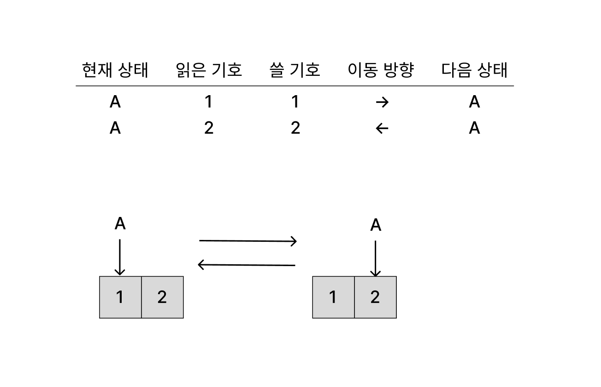
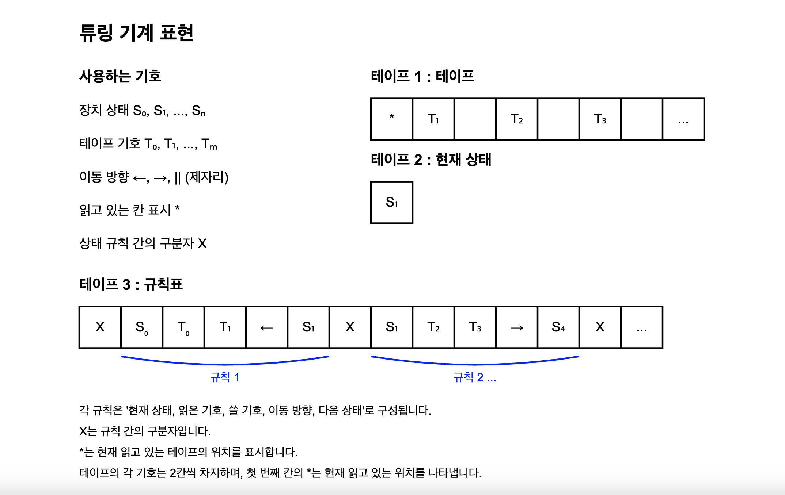

# 시작

컴퓨터의 역사에 얽힌 이야기들을 여러 개의 글로 풀어내 왔다. 조사하면서 알게 된 역사 속 사람들의 이야기는 감동적이었다. 하지만 정말 컴퓨터를 어떻게 이론적으로 구상하고 뚝딱뚝딱 만들 수 있었는지를 이해하는 데에는 부족했다. 사실 컴퓨터 역사에 얽힌 이야기들을 조사하던 초반에는 이런 의문이 떠나지 않았다.

**그래서, 정말로 컴퓨터는 어떻게 만들어지고 구성되는가?**

조사를 하며 이 부분에 대한 답을 조금은 얻을 수 있었다. 그래서 컴퓨터의 역사 시리즈를 쓰기 위해 조사한 내용을 기반으로 한 걸음 더 깊이 나아가서 알아보는 글을 써본다. 정말로 컴퓨터가 구성될 수 있었는지에 대하여. 역사를 다룬 글들만큼 매끄러운 연결을 중시하지는 않았다. 튜링 기계, 논리 회로 구현 등 개별적인 주제들을 좀 더 파고든 글들이라고 이야기할 수 있다.

논리 게이트와 회로 구성, 기본적인 수학 증명 등 일반적인 컴퓨터공학과 2-3학년 정도 지식이 선행되어야 매끄럽게 읽히지 않을까 생각한다.

물론 실제 컴퓨터에서는 중요한 최적화더라도 생략한 부분들이 있다. 나는 컴퓨터 코어를 개발하는 개발자도 아니고 오히려 그쪽에서 가장 멀리 있다고 할 수 있는 프론트엔드의 평범한 개발자이기 때문에 한계가 있다. 더 자세한 내용을 찾고자 한다면 참고문헌에 있는 도서들이나 해당 학자들의 원본 논문을 읽어 볼 수 있겠다.

변명은 이쯤하고, 이 글에서는 컴퓨터의 모태가 된 "튜링 기계"가 이론적으로 구성되기까지의 내용을 알아보겠다. 역사적인 내용은 컴퓨터 연대기 시리즈에서 다루고 있으므로 여기서는 튜링 기계의 이론적인 이해에 대해서만 간략히 쓴다.

# 대각선 논법

> 누구도 칸토어가 이루어 놓은 낙원에서 우리를 쫓아낼 수는 없다.
>
> 다비드 힐베르트, "Über das Unendliche(무한에 관하여)", Mathematische Annalen 95, 1926

컴퓨터라는 개념이 나오기까지 중요한 이정표 중 하나는 칸토어의 대각선 논법이다. 이건 무한 집합에 대한 고찰에서 시작되며 언뜻 보면 컴퓨터와는 전혀 관련이 없어 보인다. 하지만 이후 앨런 튜링이 범용 튜링 기계로도 결정 불가능한 문제가 있다는 증명을 할 때 쓰이게 된다. 그러니 먼저 칸토어의 대각선 논법에 대해 알아보자.

## 집합의 크기 비교와 무한

특정 조건을 만족시키는 대상의 모임을 "집합"으로 정의한다고 하자. 그럼 두 집합의 크기는 어떻게 비교할 수 있을까? 예를 들어 $\{Red, Green, Blue\}$라는 집합과 $\{1, 2, 3\}$라는 집합의 원소들은 서로 다르지만 두 집합의 크기는 3으로 같다. 이걸 수학적으로 어떻게 정확히 표현할까?

이는 "두 집합의 원소들 간에 일대일 대응이 존재한다"는 조건을 만족시키면 된다. 두 집합의 원소들 간에 서로 다른 원소를 남김없이 1대1로 대응시킬 수 있다면 두 집합의 크기는 같다는 뜻이다. 예를 들어 $\{Red, Green, Blue\}$와 $\{1, 2, 3\}$라는 집합이라면 $1$은 $Red$, $2$는 $Green$, $3$은 $Blue$와 대응시킬 수 있고 따라서 두 집합의 크기는 같다.

직관적이다. 하지만 이를 원소 갯수가 무한한 집합에 적용시키면 어떨까? 예를 들어 자연수 집합과 짝수 집합 간에 적용시켜 보자. 임의의 자연수 $n$에 대해 $2n$이라는 짝수와 대응시킬 수 있으므로 자연수 집합과 짝수 집합 간에는 일대일 대응이 존재하고 따라서 두 집합 간의 크기는 같다. 이제 어떤가? 이것도 직관적인가?

논리적으로 분명 맞지만 직관적으로 받아들여지지는 않는다. 자연수 집합과 짝수 집합의 크기가 같다고 하면 홀수들은 다 어디로 갔단 말인가? 이걸 받아들이기 힘든 건 19세기의 수학자들도 마찬가지였다. "전체"는 그 일부분보다 크다는 게 유클리드 시절부터 받아들여지던 믿음이었다. 그래서 칸토어 이전의 수학자들은 무한 집합의 갯수라는 건 일관성이 없으며 세는 것이 불가능하다고 생각했다.

## 칸토어의 용기

1845년 태어난 독일계 러시아인 수학자 게오르크 칸토어는 할레의 대학교에서 무급의 사강사로 임용되면서 교수로 입문했다. 당시 대부분의 수학자들은 칸토어처럼 무급의 강사로 시작했기 때문에 후원을 받거나 어떤 업적을 통해 재원을 마련할 방법을 찾아야 했다.

이때 칸토어의 수학적 능력을 알아본 당시의 저명한 수학자 에두아르트 하이네가 칸토어에게 삼각급수(삼각함수 형태가 들어간 무한급수)에 대한 연구를 권했다. 그렇게 칸토어는 무한에 관련된 연구를 시작한다.

이러한 연구를 하면서 무한을 다루게 된 칸토어 또한 앞서 언급했던 무한 집합의 반직관적인 성질에 부딪치게 된다. 자연수 집합과 짝수 집합의 크기가 같다니? 이런 어려움에 부딪친 선대의 수학자들은 무한을 제대로 다루기를 포기했다.

하지만 칸토어는 직관에 반하는 길을 택했다. 그는 일대일 대응 함수를 만들 수 있는 두 집합의 크기는 무한집합의 경우에도 같으며 따라서 자연수 집합과 짝수 집합도 크기가 같다고 주장했다.

그리고 자연수 집합과 다른 몇몇 수 집합들에 대해서도 일대일 대응이 존재함을 증명해 나갔다. 정수, 유리수, 대수적 수(어떤 대수 방정식의 해로 나타나는 수)와 자연수 사이에는 일대일 대응이 존재했다. 즉 이들 집합은 모두 크기가 같았다. 이 증명의 구체적인 내용과 엄밀성에 대해서는 "오늘날 우리는 컴퓨터라 부른다" 86-87쪽과 [슈뢰더-베른슈타인 정리](https://en.wikipedia.org/wiki/Schr%C3%B6der%E2%80%93Bernstein_theorem)를 참고하라.

칸토어는 자연스럽게 실수 집합에 대해서도 생각하게 된다. 자연수 집합과 실수 집합 간에도 일대일 대응이 존재할까? 그렇지 않았고, 칸토어가 이를 증명하기 위해 사용한 방법이 대각선 논법이다.

## 대각선 논법의 아이디어

그럼 어떤 집합이 다른 집합보다 크다는 건 어떻게 알 수 있을까? 두 집합의 원소를 어떻게 대응시켜도 일대일 대응이 존재하지 않는다는 걸 증명하면 된다. 예를 들어 $A$라는 집합의 원소를 $B$라는 집합의 원소에 하나하나 대응시켰을 때 $B$에 남는 원소가 생긴다면 $B$의 크기가 $A$보다 크다고 할 수 있다.

칸토어는 이를 이용해 실수 집합이 자연수 집합보다 더 크다는 걸 증명했다. 이를 위해서 실수 구간 $(0,1)$에 있는 실수들이 자연수 집합과 일대일 대응될 수 없다는 걸 증명한다.

$(0,1)$은 실수 집합 $\mathbb{R}$과 일대일 대응될 수 있으므로 이게 가능하다. 이 사실은 다음과 같은 함수 $f : (0, 1) \to \mathbb{R}$를 정의함으로써 알 수 있다.

$$
f(x) = \tan\left(\pi x - \frac{\pi}{2}\right)
$$

그럼 이제 $(0,1)$의 실수들을 자연수 집합의 원소들과 일대일 대응시키는 함수 $f: \mathbb{N} \to (0, 1)$가 존재한다고 하자. 그러면 각 $n$에 대해 $f(n)$은 다음과 같이 나타날 것이다. $a_{ij}$는 0-9사이의 정수라고 하자.

$f(1) = 0.a_{11}a_{12}a_{13}a_{14}\cdots$

$f(2) = 0.a_{21}a_{22}a_{23}a_{24}\cdots$

$f(3) = 0.a_{31}a_{32}a_{33}a_{34}\cdots$

$\vdots$

$f(n) = 0.a_{n1}a_{n2}a_{n3}a_{n4}\cdots$

$\vdots$

그러면 우리는 어떤 실수 $x$를 다음과 같이 정의할 수 있다. 각 $f(n)$과 소수점 아래 $n$번째 자리수가 다른 수로 말이다. 이런 수를 구성하는 방법은 여러 가지가 있겠지만 소수점 아래 $n$번째 자리수가 $(a_{nn} + 1) \mod 10$인 수라고 하자. 예를 들어 1은 2로, 2는 3으로,..., 9는 0으로 바꿔준다. 소수점 아래 $i$번 자릿수를 $d_i$라고 한다면 다음과 같이 쓸 수 있다.

|       | $d_1$      | $d_2$      | $d_3$      | $d_4$      | $d_5$      | $\cdots$      |
|-------|--------|--------|--------|--------|--------|--------|
| $f(1)$  | $\textcolor{red}{a_{11}}$   | $a_{12}$    | $a_{13}$    | $a_{14}$    | $a_{15}$    | $\cdots$       |
| $f(2)$  | $a_{21}$    | $\textcolor{red}{a_{22}}$  | $a_{23}$    | $a_{24}$    | $a_{25}$    | $\cdots$       |
| $f(3)$  | $a_{31}$    | $a_{32}$    | $\textcolor{red}{a_{33}}$    | $a_{34}$    | $a_{35}$    | $\cdots$       |
| $f(4)$  | $a_{41}$    | $a_{42}$    | $a_{43}$    | $\textcolor{red}{a_{44}}$    | $a_{45}$    | $\cdots$       |
| $f(5)$  | $a_{51}$    | $a_{52}$    | $a_{53}$    | $a_{54}$    | $\textcolor{red}{a_{55}}$    | $\cdots$       |
| $\vdots$     | $\vdots$      | $\vdots$      | $\vdots$      | $\vdots$      | $\vdots$      | $\ddots$      |
| $x$     | $(a_{11}+1) \% 10$ | $(a_{22}+1) \% 10$ | $(a_{33}+1) \% 10$ | $(a_{44}+1) \% 10$ | $(a_{55}+1) \% 10$ | $\cdots$ |

그러면 이 $x$는 모든 자연수 $n$에 대해 $f(n)$과 소수점 아래 $n$번째 자리수가 다르다. 우리는 자연수 집합과 $(0,1)$의 실수들 간에 일대일 대응이 존재한다고 가정했으므로 $x$는 어떤 자연수 $m$에 대해 $f(m)$이어야 하는데 그렇지 않다! 따라서 모순이 발생하므로 $(0,1)$의 실수들과 자연수 집합 간에 일대일 대응은 존재하지 않는다.

그러므로 $(0,1)$ 구간의 실수 집합은 자연수 집합보다 크고 $(0,1)$ 구간의 실수 집합은 실수 전체 집합과 일대일 대응이 존재하므로 실수 집합은 자연수 집합보다 크다.

이때 사소한 문제가 있다. 어떤 유리수는 두 가지 방법으로 표현될 수 있다는 점이다. 예를 들어 $0.10000\cdots$와 $0.09999\cdots$는 같은 유리수 $1/10$을 표현한다. 하지만 이건 모든 유리수의 집합 또한 자연수 집합과 일대일 대응이 존재한다는 사실을 통해 극복할 수 있다.

# 불완전성 정리

> 젊은이, 수학은 모든 걸 이해하는 게 아니야. 그저 익숙해지는 법을 배우는 거지.(Young man, in mathematics you don't understand things. You just get used to them.)
>
> [존 폰 노이만](https://www.mathrecreation.com/2010/01/most-loved-and-hated-theorem.html?utm_source=chatgpt.com)

## 수학자들의 꿈

20세기 초 힐베르트를 비롯한 수학자들은 수학을 그 자체로 완전한 체계로 세우고자 했다. 수학을 잘 정의된 기호의 언어로 표현하고, 뜻을 알고 언어의 내부에서 보면 수학으로서 각각의 추론 단계가 아주 명확하지만 언어 외부에서는 단순한 수식과 기호의 조작으로서 완전히 다룰 수 있는 그런 체계, 또한 그렇게 다루어도 모순이 없는 그런 체계로 만들고자 한 것이다.

기호의 조작만으로 완전하다는 걸 예시로 설명하면 이렇다.

$A \implies B$라는 명제가 참이라고 하자. 그리고 나는 $A$가 참이라는 걸 알게 되었다. 그럼 $B$도 참이라는 걸 알 수 있다. 이건 $A$와 $B$가 어떤 의미를 가지는지와는 상관이 없다.

나중에 알고 보니 $A$가 "$x$는 짝수이다"였고 $B$가 "$x$는 2로 나누어 떨어진다"였다고 하자. 나는 $A$가 참이고 $A \implies B$임을 이용해서 $B$ 즉 "$x$는 2로 나누어 떨어진다"도 참임을 알 수 있었다. 하지만 이러한 추론을 위해서 $A$와 $B$의 의미를 알 필요는 없었다. 그저 규칙에 따른 기호의 조작만으로 도출해 낼 수 있는 거였다.

수학 내부적으로는 의미를 갖는 명제들이지만 그 외부에서는 단순한 기호의 조작으로 새로운 사실을 추론할 수 있었던 것이다. $A$, $B$가 다른 어떤 의미였더라도 상관없이 마찬가지다. 만약 $A$가 선택 공리였고 $B$가 바나흐-타르스키 역설(구 한 개를 유한 번 자른 후 재조립하여 같은 크기의 구 2개를 재구성할 수 있다는, 선택 공리에서 따라나오는 대표적인 비직관적 결과다. 자세한 수학적 내용은 상관없다)이었다고 해도, 선택 공리와 바나흐-타르스키 역설이 어떤 의미인지 전혀 모른다고 해도 $A$가 참이고 $A \implies B$라는 사실을 알게 되었다면 $B$도 참이라는 걸 알 수 있다.

수학자들이 꾸었던 꿈이란 수학의 모든 요소들을 이런 식으로 나타내고 모순 없이 조작할 수 있는 체계로서 수학을 세우는 거였다. 여기서 나온 것이 화이트헤드와 러셀의 "수학 원리", 페아노 산술과 같은 체계들이었다. 힐베르트는 1928년의 수학자 회의에서 페아노 산술의 완전성을 증명하자고 외쳤다.

## 괴델의 증명

그로부터 2년 후 1931년 쿠르트 괴델은 "수학 원리와 그에 관련된 체계에서 결정불가능 명제들에 관하여"라는 논문을 내면서 이 문제를 해결한다. 힐베르트가 원하던 것과는 다른 방향이었고 괴델의 논문은 힐베르트의 꿈 전체를 뒤흔든다. 그럼 이 충격을 뒤로하고, 튜링 기계 바로 이전 걸음이었던 괴델의 이 증명이 어떤 방식으로 이루어졌는지 살펴보자.

괴델은 앞으로 사용할 십진수 형태의 인코딩 대신 자연수의 소인수분해 형태가 유일하다는 걸 이용해 기호를 정수로 변환했던 등 조금 다른 기법을 사용했다. 필요하다면 [괴델 부호화](https://en.wikipedia.org/wiki/G%C3%B6del_numbering)에 대해서 찾아볼 수 있겠다. 다만 괴델의 증명 원형을 따라가는 게 목적이 아니므로 이 글에서는 이를 좀 더 풀어서 설명한 마틴 데이비스의 "오늘날 우리는 컴퓨터라 부른다"의 내용을 바탕으로 설명한다.

수학을 논리 체계로 세우고자 한 시도들은 수학의 모든 요소를 한정된 갯수의 기호들을 이용해 표현하고자 했다. 그리고 이 기호들을 조작하는 규칙을 정해서, 체계 외부에서는 해당 규칙을 통한 기호의 조작만으로 수학을 다룰 수 있도록 하려고 했다.

예를 들어 페아노 산술(Peano Arithmetic, 이하 PA)에서는 다음 16개의 기호만으로 구성된다.(물론 문서에 따라 다른 기호로 구성하는 경우도 있지만 이 맥락에서 중요한 건 아니다)

$$
\begin{align*}
\supset \; \neg \; \land \; \lor \; \forall \; \exists \; 1 \; \oplus \; \times \; x \; y \; z \; ( \; ) \; ` \; =
\end{align*}
$$

그럼 우리는 이 체계가 불완전하다는 것을 증명할 수 있다. 시작해보자.

이런 부호를 이용해 표현한 문자열들 중 대부분은 의미가 없다. 예를 들어 $\exists + \neg$는 아무 의미도 없다. 하지만 어떤 문자열들은 참/거짓을 가릴 수 있는 명제로 해석할 수 있다. 예를 들어 $\forall x \exists y (x \oplus y = 1)$는 "모든 $x$에 대해 $y$가 존재하여 $x$와 $y$를 더하면 1이 된다"는 의미로 해석할 수 있다. 만약 1이 항등원이라면 역원의 존재성에 대한 명제라고 할 수 있다.

그리고 자연수의 집합을 정의하는 단항(unary) 문자열이라고 불리는 문자열도 있다. 기호 $x$의 성질을 정의함으로써 어떤 집합을 정의하는 것이다. 짝수를 정의하는 문자열은 다음과 같다.

$$
(\exists y)(x=((1 \oplus 1) \times y))
$$

이걸 좀 더 풀어쓰면 다음과 같다.

$$
\{x \in \mathbb{N}\,|\,\exists y \in \mathbb{N}\;such\;that\;x = 2y\}
$$

이때 단항 문자열의 형태를 잘 생각해 보면, 단항 문자열이 설명하는 기호(위의 예시에서는 $x$)를 특정한 수로 대체하면 그 문자열은 특정한 수에 대한 명제가 된다. 예를 들어 위의 단항 문자열에서 $x=2$로 대체하면 이렇게 쓸 수 있다. $\exists y ((1 \oplus 1) = (1 \oplus 1) \times y)$는 "2는 짝수다"라는 명제이다.

그럼 이제 우리는 단항 문자열 $A$에 대해 $[A:n]$을 정의할 수 있다. $A$의 변수 $x$를 $n$으로 대체해서 만든 명제로 말이다. 예를 들어 $A$가 "모든 $x$에 대해 $x$는 짝수다"라는 단항 문자열이라면 $[A:2]$는 "2는 짝수다"라는 명제가 된다.

괴델의 아이디어는 이렇다. 중요한 건 이 기호들이 어떻게 생겼는지가 아니다. 이 기호들이 내포하는 의미가 똑같다면 사실 정수로 표현해도 상관없다는 것이다. 예를 들어 $\supset$는 1, $\neg$는 2, $\land$는 3,..., $=$는 16으로 쓰는 식이다. 어차피 체계의 외부에서 본다면 정수는 일종의 기호로서 아무 의미도 가지지 않고 따라서 $\supset$이나 1이나 상관 없다. 물론 내가 쓴 숫자들도 예시일 뿐이고 $\supset$을 2394로 표현해도 의미는 같다.

그리고 이걸 이용하면 체계의 안에서는 절대로 증명할 수 없는 명제를 만들 수 있다.

이런 단항 문자열들을 정수로 인코딩했다고 하자. 그러면 이건 체계 밖에서는 아무 의미 없지만 체계 내에서는 정수라는 의미를 가진다. 따라서 모든 단항 문자열들을 정수 인코딩의 크기 순으로 정렬할 수 있다.

모든 형태의 단항 문자열들은 정수로 인코딩할 수 있으므로 단항 문자열의 수는 자연수 집합과 일대일 대응이 존재한다. 그러면 이렇게 작은 크기의 정수 인코딩을 갖는 순서로 정렬한 단항 문자열들을 $A_1, A_2, A_3, \cdots$라고 명명할 수 있다. 이때 $A_n$은 $n$번째로 작은 크기의 단항 문자열이다.

그럼 우리는 각 $A_n\;(n\in\mathbb{N})$에 대해 $[A_n:n]$을 정의할 수 있다. 즉 $A_n$의 변수 $x$를 $n$으로 대체해서 만든 명제이다. $A_n$은 단항 문자열이므로 $[A_n:n]$은 어떤 자연수에 대한 명제가 된다. 그럼 각 $n$에 대해서 무언가를 조작해서 새로운 걸 형성했던 대각선 논법의 흐름과 비슷하게 $[A_n:n]$을 체계 내에서 증명할 수 없는 $n$들의 집합을 $K$라고 하자.

$$
K = \{n \in \mathbb{N}\,|\,\text{$[A_n:n]$는 PA에서 증명할 수 없는 명제이다}\}
$$

여기서 증명할 수 있다는 건 공리가 되는 문장들에서 체계 내의 규칙들만을 통해 도출할 수 있다는 의미이다.

이때 $K$의 원소가 얼마나 있는지에 상관없이 $K$라는 집합은 존재한다. 왜냐 하면 PA 내에서는 명제의 증명을 서술하는 문장조차도 PA의 기호로 표현할 수 있고 따라서 $P(x, y)$와 같은 형태를 정의해서 인코딩이 $x$인 명제의 증명을 서술하는 문장의 인코딩이 $y$라는 식으로 표현할 수 있기 때문이다. 그러면 $K$의 원소$n$는 $n=\neg \exist xP(n,x)$ 처럼 나타날 것이다.

아무튼 이렇게 $K$라는 집합을 정의했다. 그럼 $K$를 정의하는 단항 문자열도 분명 있을 것이고 이 또한 단항 문자열이므로 $A_1, A_2, A_3, \cdots$에 속할 것이다. 따라서 $K$를 정의하는 단항 문자열을 특별히 $A_k$라고 하자. 그럼 임의의 $q\in\mathbb{N}$에 대해서 $[A_k:q]$은 "$[A_q:q]$는 PA에서 증명할 수 없는 명제이다"라는 의미를 가진다. 그럼 $[A_k:k]$는 "$[A_k:k]$는 PA에서 증명할 수 없는 명제이다"라는 의미를 가진다.

즉 자기 자신을 증명할 수 없다는 명제가 바로 $[A_k:k]$인 것이다. 그리고 이건 참이다. 왜냐 하면 $[A_k:k]$를 거짓이라고 하면 $[A_k:k]$ 자신은 PA에서 증명할 수 있는 명제가 되고 따라서 참이므로 모순이 발생하기 때문이다. 즉 $[A_k:k]$는 PA 외부에서는 분명 참이지만 PA 체계 내에서 증명할 수 없는 명제이다.

## 추가적인 부분

힐베르트는 완전한 수학 시스템이 충족해야 할 조건으로 다음 세 가지를 제시했다.

- 일관성: 모순이 없어야 한다. 어떤 명제와 그 부정을 동시에 증명할 수는 없다.
- 완전성: 모든 명제는 체계 안에서 참 혹은 거짓으로 증명할 수 있다.
- 결정성: 명제를 증명할 수 있는 일반적인 과정이 있다.

그런데 앞선 괴델의 증명으로 인해 완전성이 불가능해졌다. 그리고 다음과 같은 서술을 통해 일관성 또한 불가능하다는 걸 알 수 있다.

우리가 만들었던 명제 $[A_k:k]$는 참이지만 PA에서 증명할 수 없는 명제였다. 그럼 그 부정을 생각해 보자. 표기의 편의성을 위해 $B=[A_k:k]$라고 하면 $\neg B$이다. 그럼 $B$의 본래 의미를 생각해 볼 때 $\neg B$는 자기 자신을 증명할 수 있다는 명제이다. 그리고 $B$가 참이었으므로 배중률에 의해 $\neg B$는 거짓이다.

즉 $\neg B$를 증명할 수 있다는 명제는 거짓이고 따라서 $\neg B$도 증명 불가능하다. $B$는 증명 불가능하고 $\neg B$도 증명 불가능하므로 일관성 또한 불가능해졌다.

# 튜링의 범용 기계까지

> 미분 방정식을 푸는 계산기와 백화점 영수증을 발행하는 데 쓰이는 기계의 기본적인 원리가 같다면, 나는 내가 만난 가장 놀라운 우연의 일치라 여기겠다.
>
> 하워드 에이컨(오늘날 우리는 컴퓨터라 부른다 212p)

앞서 설명한 괴델의 불완전성 정리는 수학의 완전성과 일관성을 부정했다. 하지만 아직 결정성이 남아 있었다. 어떤 명제에 대해서 유한 번의 계산을 거쳐서 해당 명제의 참/거짓을 결정할 수 있는 일반적인 알고리즘이 있는가? 이 질문을 힐베르트의 결정 문제라고 불렀다. 튜링은 그런 알고리즘이 존재하지 않는다는 걸 증명하기 위해 튜링 기계를 고안했다.

먼저 튜링은 계산할 수 있는 알고리즘을 최소한의 것으로 표현하려고 했다. 중요하지 않은 세부 사항, 예를 들어 계산에 사용하는 기호의 구체적인 형태나 계산을 위한 기계의 구조 따위는 전부 무시하고 계산을 위해 필요한 최소한의 요소들만 남겨두는 것이다. 그 결과 튜링은 다음과 같은 생각에 도달했다.

- 계산의 각 단계에서는 한정된 개수의 기호만을 다루게 된다.
- 각 단계에서 취하는 행동은 현재 다루고 있는 기호들과 계산하고 있는 기계의 상태에 따라서만 결정된다.

튜링은 이 두 가지를 더 단순화하여 다루고 있는 기호와 기계의 상태를 단 하나씩만으로 한정했다. 여러 개를 동시에 다루는 계산은 한 번에 한 개씩 여러 번을 계산하는 방식으로 대체할 수 있기 때문이다. 그리고 이 두 가지를 조합하여 튜링 기계를 만들었다. 그리고 이것만으로도 모든 계산 가능한 알고리즘을 표현할 수 있다는 걸 증명했다. 이를 처치-튜링 정리라고 한다.

## 튜링 기계의 구성

튜링 기계의 계산은 다음과 같은 요소들로 구성된다.

- 기계가 읽고 쓸 수 있는 기호가 칸마다 적힌, 한 칸 너비와 무한한 길이를 가진 테이프
- 테이프를 읽고 쓸 수 있는 장치
- 현재 테이프에서 보고 있는 칸에 적힌 기호
- 장치의 상태를 나타내는 기호
- 장치의 작동 규칙(현재 장치 상태, 테이프에서 읽은 기호, 테이프에 쓸 기호, 이동 방향, 새로운 장치 상태로 구성)

이 간단한 장치가 테이프를 읽고 작동 규칙에 따라 왔다갔다하면서 테이프에 적힌 기호를 읽고 쓰는 방식으로 계산을 수행한다. 이때 테이프에 쓰이는 기호와 장치 상태 기호가 얼만큼이고 무슨 뜻인지는 그다지 중요하지 않다. 기호를 추가하는 건 튜링 기계의 본질적인 능력을 바꾸지 않는다는 게 증명되어 있다.

이해를 돕기 위해 간단한 튜링 기계를 한번 다음과 같이 구성해 보자. 이 기계는 1을 읽으면 1을 쓴 후 오른쪽으로 이동하고 2를 읽으면 2를 쓴 후 왼쪽으로 이동한다. 그리고 이 기계의 계산은 1,2가 쓰인 테이프에서 1을 가리킨 상태에서 시작한다. 그러면 이 기계는 2칸을 왔다갔다하면서 1,2를 읽고 쓰는 동작을 무한히 반복한다. 실제 테이프의 길이는 무한하지만 편의상 동작 설명에 필요한 2칸만 그렸다.

또 주어진 수가 짝수인지 판별하는 것, 사칙연산 등 더 복잡한 계산도 튜링 기계로 구현할 수 있다. 앞서 말했듯이 모든 계산을 모델링 가능하니까 당연하다. 다만 튜링 기계로 뭔가를 실제로 구현하는 게 목적이 아니므로 이 정도로 넘어가도록 하자. 참고문헌의 도서들에서 더 복잡한 예시들도 볼 수 있다.

## 범용 튜링 기계

어떤 계산 알고리즘이 있다면 그 알고리즘을 구현한 튜링 기계를 만들 수 있다. 그런데 튜링의 대단한 점은 여기서 끝이 아니다. 튜링은 모든 튜링 기계의 계산을 하나의 튜링 기계를 통해 흉내낼 수 있다는 걸 증명했다. 임의의 튜링 기계의 동작을 테이프와 거기 적힌 기호들만으로 표현할 수 있고 이걸 읽어서 해당 튜링 기계의 동작을 흉내내는 튜링 기계를 만들 수 있다는 것이다. 튜링은 이런 기계를 구성해 보인 후 범용 기계(universal machine)라고 불렀다.

그럼 이 범용 기계는 대체 어떻게 구성되었는지 알아보자. 이광근 교수님의 "컴퓨터과학이 여는 세계"를 바탕으로 설명하겠다.

먼저 하나의 테이프 대신 3개의 테이프를 사용해서 임의의 튜링 기계를 표현하도록 하자. 이 테이프는 이후 하나로 합칠 것이다.

그러면 첫번째 테이프에는 튜링 기계에 주어질 테이프와 튜링 기계가 가리키는 테이프 칸을 담자. 테이프의 각 기호는 2칸씩 차지하도록 한다. 칸의 왼쪽에 `*`기호를 넣음으로써 현재 읽고 있는 칸임을 나타낼 것이기 때문이다.

그리고 두번째 테이프에는 장치의 상태를 담는다. 세번째 테이프에는 `X`로 구분된 장치의 상태 규칙표를 담는다. 이때 장치 상태를 나타내는 기호와 테이프 기호는 모두 유한 개이므로 각각 $S_0, S_1, \cdots, S_n$과 $T_0, T_1, \cdots, T_m$이라고 하자. 그러면 다음과 같이 3개의 테이프를 구성할 수 있다.

기호의 추가가 튜링 기계의 능력을 바꾸지 않으므로 $n, m$이 몇인지는 아무래도 좋다.

우리는 임의의 튜링 기계를 테이프로 표현하는 방법을 알게 되었다. 그럼 이 테이프를 읽고 해당 튜링 기계의 동작을 흉내낼 수 있는 튜링 기계는 어떻게 구성할까? 이 기계는 다음과 같은 방식으로 동작한다.

1. 테이프 2에서 현재 장치 상태를 읽는다.
2. 테이프 1에서 현재 읽고 있는 테이프의 기호를 읽는다. `*`기호를 탐색하고 그 오른쪽 칸을 읽음으로써 가능하다.
3. 현재 장치 상태와 읽은 기호에 해당하는 규칙을 테이프 3에서 탐색한다.
4. 해당 규칙이 발견되면 규칙의 지시대로 테이프에 쓸 기호를 테이프 1에 쓰고 다음 장치 상태를 테이프 2에 쓴다. 그리고 이동 방향에 따라 테이프 1의 `*` 기호를 왼쪽 혹은 오른쪽으로 이동시킨다.
5. 1~4를 반복한다.

이 반복 작업을 튜링 기계 규칙표로 표현하면 된다. 특정 기호를 찾는 것과 기호를 복사해서 옮기는 것뿐이므로 긴 규칙이 되기야 하겠지만 어쨌건 가능하다. 이 기계는 임의의 튜링 기계의 동작을 흉내낼 수 있는 범용 튜링 기계가 된다.

하지만 아직 문제가 남아 있다. 임의의 튜링 기계를 표현하기 위해 테이프 3개를 사용한다는 것이다. 이건 테이프 3개의 기호를 번갈아가면서 씀으로써 하나의 테이프로 표현할 수 있다.

하나의 테이프에 "테이프 1의 기호, 테이프 2의 기호, 테이프 3의 기호"를 번갈아가면서 적는 것이다. 각 기호는 `*`을 고려하여 2칸을 차지하도록 한다. 테이프는 훨씬 길어지겠지만, 무한한 테이프니까 아무래도 좋다. 이렇게 하면 임의의 튜링 기계를 하나의 테이프만으로도 구현할 수 있다.

## 결정 불가능 문제

튜링의 범용 기계는 모든 계산 알고리즘을 표현할 수 있다. 하지만 튜링이 왜 이 범용 기계라는 걸 정의했었는지 생각해 보자. 이런 범용 기계로도 결정 불가능한 문제가 있다는 걸 증명하기 위해서였다. 그럼 이제 마지막으로, 그걸 따라가 보자. 이 역시 귀류법을 사용하며 대각선 논법의 아이디어를 빌려오는 방식이다.

먼저 모든 명제를 결정할 수 있는 알고리즘이 있다고 가정한다. 그러면 이 알고리즘을 표현하는 튜링 기계는 당연히 존재하며 이를 $A$라고 하자. 그러면 우리는 다음과 같은 결정을 하는 튜링 기계 $H$를 만들 수 있다.

> 주어진 알고리즘과 해당 알고리즘에 대한 입력이 주어졌을 때 그 계산은 최종적으로 멈추는가?(정지 문제 Halting Problem)

그럼 $H$는 다음과 같은 방식으로 동작한다.

1. 튜링 기계 $A$를 테이프에 표현한다.
2. $A$를 통해 주어진 알고리즘을 표현하는 튜링 기계가 해당 입력에 대해 멈추는지 결정한다.
3. 주어진 알고리즘이 멈춘다면 1을 테이프에 적고 멈춘다. 그렇지 않다면 0을 테이프에 적고 멈춘다.

예를 들면 1, 2가 적힌 테이프를 무한히 왕복하는 위에서 본 튜링 기계는 멈추지 않을 것이다. 이 경우 $H$는 1을 적고 멈출 것이다. 반면 1이 적힌 테이프에서 영원히 제자리를 가리키며 멈춰 있는 튜링 기계도 쉽게 구성할 수 있는데, 이 경우에 대해서는 $H$가 0을 적고 멈출 것이다.

하지만 $H$와 같은 기계는 존재할 수 없다는 걸 튜링이 대각선 논법으로 증명해낸다.

먼저 앞서 보았던 것처럼 모든 튜링 기계는 하나의 테이프에 표현할 수 있다. 그리고 가능한 모든 테이프의 기호 표현은 자연수에 대응시킬 수 있다. 앞서 불완전성 정리에서 보았던 것처럼 각 기호들에 대해서 특정한 정수를 대응시키는 방식으로 정수 인코딩을 할 수 있기 때문이다. 따라서 모든 튜링 기계와 모든 튜링 기계 입력은 자연수에 대응시킬 수 있다. 그러면 모든 튜링 기계 $M_1, M_2, M_3, \cdots$이 각각 모든 가능한 입력 $I_1, I_2, I_3, \cdots$에 대해 계산을 수행했을 때 최종적으로 멈추는지 여부를 $H$를 통해 결정할 수 있다.

이런 식으로 표를 구성해볼 수 있다.

|  | $I_1$ | $I_2$ | $I_3$ | $I_4$ | $\cdots$ |
|---|---|---|---|---|---|
| $M_1$ | 1 | 1 | 0 | 1 | $\cdots$ |
| $M_2$ | 1 | 0 | 1 | 1 | $\cdots$ |
| $M_3$ | 0 | 1 | 0 | 1 | $\cdots$ |
| $M_4$ | 1 | 1 | 1 | 1 | $\cdots$ |
| $\vdots$ | $\vdots$ | $\vdots$ | $\vdots$ | $\vdots$ | $\ddots$ |

그런데 이렇게 되면 우리는 모든 튜링 기계와 다른 동작을 하는 튜링 기계를 구성할 수 있다. $M_i$가 $I_i$에 대해 멈춘다면 0을 적고 멈추고, 멈추지 않는다면 1을 적고 멈추는 튜링 기계를 구성하는 것이다. 대각선 논법에서 모든 $f(n)$과 다른 실수를 구성했던 방식과 비슷하다.

이는 모순이다. 모든 튜링 기계과 다른 동작을 하는 튜링 기계가 존재할 수는 없기 때문이다. 따라서 $H$는 존재할 수 없다. 정리하면 어떤 알고리즘으로도 모든 명제의 참/거짓을 결정할 수 없다는 것이다.

여기서 파생되는 개념들도 많다. NP-hard, $N$개의 상태를 갖는 튜링 기계가 정지하기까지 필요한 최대 동작 횟수를 나타내는 바쁜 비버 함수(Busy Beaver function)-튜링 기계를 통해 임의의 튜링 기계의 정지 가능성을 판별할 수 없으므로 당연히 튜링 기계로 계산할 수 없다-등이 있으니 흥미가 있다면 찾아볼 수 있다. 다만 컴퓨터의 발전과는 직접적인 관계가 없으므로 여기서는 생략하도록 하겠다.

# 마무리

지금까지 튜링이 고안한 범용 기계가 어떻게 계산 가능한 알고리즘을 표현할 수 있는지 그리고 그런 기계로조차 풀 수 없는 결정 불가능 문제를 어떻게 구성하는지 살펴봤다. 이 튜링 기계가 컴퓨터의 이론적 기반이 되었다.

그런데 이렇게 만들어진 기계를 실용적으로 구현하는 건 쉽지 않다. 무한한 길이의 테이프부터가 현실에 없고, 한 번에 테이프 한 칸씩만 읽을 수 있는 기계는 쓸모가 없었다. 튜링 기계는 본질적으로 수학적인 모델일 뿐이었다.

하지만 놀랍게도 이 추상적인 모델을 실제 물리적인 장치로 구현할 수 있었다. 이건 0과 1을 전기 신호로 나타낼 수 있는 스위치의 등장 그리고 스위치로 논리 회로를 구성할 수 있다는 클로드 섀넌의 증명에 그 기반을 둔다. 이 스위치의 구현이 점점 발전하면서 우리가 아는 컴퓨터는 점점 작아지고 빨라질 수 있었다.

그러니 '컴퓨터 연대기 한 걸음 더'의 다음 글에서는 아마도, 수학적 상상에 불과했던 컴퓨터를 현실에 등장시켜준 스위치의 등장과 발전을 훑어보려고 한다. 또 그다음 글에서는 스위치를 통한 좀 더 구체적인 컴퓨터 뼈대의 구현을 다룰 수 있기를 기대한다.

# 참고문헌

일반적인 컴퓨터공학 전공수업에서 다루는 지식들도 많은 도움이 되었다.

## 도서

마틴 데이비스 지음, 박상민 옮김, "오늘날 우리는 컴퓨터라 부른다", 인사이트

이광근, "컴퓨터과학이 여는 세계: 세상을 바꾼 컴퓨터, 소프트웨어의 원천 아이디어 그리고 미래", 인사이트

아포스톨로스 독시아디스, 크리스토스 H. 파파디미트리우 글, 알레코스 파파다토스, 애니 디 도나 그림, 전대호 옮김, "로지코믹스", 알에이치코리아

## 위키 문서

나무위키, "대각선 논법"

https://namu.wiki/w/%EB%8C%80%EA%B0%81%EC%84%A0%20%EB%85%BC%EB%B2%95

- [Church–Turing thesis](https://en.wikipedia.org/wiki/Church%E2%80%93Turing_thesis)
- [Georg Cantor](https://en.wikipedia.org/wiki/Georg_Cantor)

## 기타 자료

고등과학원 HORIZON, 튜링과 정지문제: 인간, 수학, 컴퓨터

https://horizon.kias.re.kr/19364/