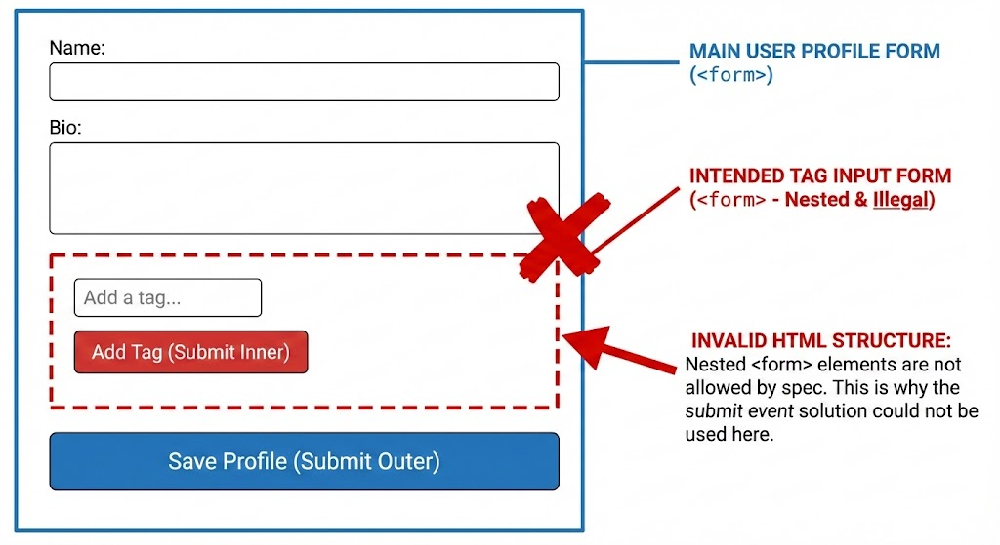

# 문제 상황

사이드 프로젝트에서 사용자 입력을 받는 페이지를 제작하고 있었다. 그러다가 input 입력 후 엔터키를 누를 시 keydown 핸들러를 통해 input의 값을 저장하고자 했다. 이때 keydown 핸들러가 마지막 글자에 대해서 1번 더 실행되는 문제를 겪었다.

예를 들어 내가 좋아하는 곡 중 하나인 '소문의 그애'[^1]를 입력하고 엔터를 누르면 '소문의 그애'가 저장되고 입력값의 마지막 글자인 '애'도 저장되는 식이었다.

## 상황 재현 코드

`<input>` 요소로 만들어진 입력창이 있고 해당 입력창에서 '추가'를 누르거나 엔터키를 누르면 해당 입력창에 있는 문자열 값이 저장되는 게 의도였다.

그 의도로 당시 작성한 코드 중 해당 이슈에 관련된 부분만 간단히 재현해 보자면 다음과 같았다.

추가 버튼을 누르거나 input 창에서 엔터키를 누르면 `handleAddItem`을 통해 input에 담긴 값을 `items`에 반영하는 식이었다.

```tsx
function App() {
  const [items, setItems] = useState<Item[]>([]);
  const [inputValue, setInputValue] = useState("");

  const handleAddItem = () => {
    if (inputValue.trim() === "") return;

    const newItem: Item = {
      id: Date.now(),
      text: inputValue,
    };

    setItems([...items, newItem]);
    setInputValue("");
  };

  return (
    <div>
      <input
        type="text"
        value={inputValue}
        onChange={(e) => setInputValue(e.target.value)}
        placeholder="새 항목을 입력하세요"
        onKeyDown={(e) => {
          if (e.key === "Enter") {
            handleAddItem();
          }
        }}
      />
      <button onClick={handleAddItem}>추가</button>
      {/* items 항목들을 표시하는 코드 */}
    </div>
  );
}
```

이때 영어나 숫자가 아닌 한글을 입력한 후 엔터키를 통해 항목을 추가하려고 하면 앞서 설명한 문제가 발생했다. `inputValue`뿐 아니라 해당 값의 마지막 글자에 대해서도 `handleAddItem`이 한번 더 호출되면서 `items`에 2개의 항목이 추가되는 현상이었다.

# 원인과 해결

## IME API

원인은 한글이 조합형 문자라는 데에서 발생한다. 마찬가지로 일본어, 중국어 같이 조합형 문자를 통해 표기되는 언어들도 같은 현상을 겪는다. 히라가나에서 한자로 변환하는 과정 등에서 같은 문제가 생긴다.

그럼 왜 조합형 문자가 이런 문제를 만들까? 특정한 방식의 키보드 입력을 하면 조합을 통해 해당 글자를 띄워주는 데 사용되는 IME(Input Method Editor) API가 원인이다. IME API는 CJK 문자 입력, 터치스크린의 손글씨 인식기를 통한 문자 입력 등에 사용되고 보통 OS에서 담당한다.[^2]

IME API가 쓰이는 예시를 들면 `ㄱ + ㅏ`를 치면 해당 글자들을 조합해 `가`가 되는 걸 들 수 있다. 이런 식으로 우리가 타이핑하는 한글 글자 하나하나에 IME API가 쓰이고 있다. 각종 텍스트 에디터에서도 한글을 타이핑할 때, 현재 치고 있는 글자에 밑줄이 그어지는 걸 볼 수 있는데 이것도 IME API의 작품이다.

여기까지만 보면 IME API는 우리가 한글을 입력하게 해주는 고마운 API인 듯 하다. 그런데 왜 이게 keydown 핸들러가 2번 실행되도록 하는 원인인 걸까? IME composition 과정에서 엔터키를 누르는 이벤트가 일어나면 os와 브라우저 둘 모두에서 해당 이벤트가 처리되기 때문이다.

다음 섹션에서 해당 문제가 발생하는 원인을 IME API 동작 기반으로 좀 더 자세히 알아보자.

## 그래서 왜 엔터가 2번 인식될까?

keydown 이벤트의 기본 동작에는 text composition system의 실행이 포함되어 있다.[^3] 여기엔 IME도 포함되어 있으므로 조합형 문자인 한글을 타이핑할 때도 엔터 keydown을 통해 composition을 완료할 수 있다.

이 composition 이벤트들에는 순서도 있는데 다음과 같다.[^4]

- compositionstart: 조합형 문자가 타이핑되기 시작되었을 때
- compositionupdate: 새로운 문자 입력으로 조합이 업데이트되었을 때
- compositionend: 조합이 완성되어 한 글자가 만들어졌을 때

예시로 '김'이라는 글자를 친다고 하자. 그럼 '김'의 'ㄱ'이 쳐질 때 compositionstart 이벤트가 발생한다. 그리고 이어 'ㅣ'와 'ㅁ'이 입력되면서 문자는 '기'와 '김'으로 바뀌는데 이때마다 compositionupdate 이벤트가 실행된다. 그 다음 'ㅅ'을 입력하면 입력값은 '김ㅅ'이 되고 '김'이라는 글자는 완성된다. 문자 하나가 확정되었으므로 compositionend 이벤트가 발생한다.

참고로 compositionstart 이벤트 이후, 그에 대응하는 compositionend 이벤트가 발생하기 전까지의 기간을 composition session이라고 한다.

즉 한글 하나하나를 칠 때마다 keydown 이벤트를 통해 조합 시스템이 동작하고 있다. 그런데 여기서 엔터는 일반적으로 조합을 확정하는 Accept의 의미를 가진다.[^5]

따라서 위 코드에서 내가 input창에 '소문의 그애'라는 한글 텍스트를 입력하고 엔터를 눌렀을 때 동작은 다음과 같다.(정확한 동작 순서는 브라우저에 따라 약간씩 다를 수 있다)

1. '소문의 그애'의 마지막 글자인 '애'가 조합중이다.
2. "Enter" keydown 이벤트가 발생한다. composition session동안 발생한 keydown 이벤트도 처리되어야 하기 때문이다. 단 이때의 엔터는 composition의 "Accept" 역할을 한다.[^6]
3. "Enter"를 통해 발동된 composition 'accept' 이벤트를 통해 조합이 확정된다. 이건 OS에서 일어난다.(compositionend)
4. 브라우저에서 Enter keydown 이벤트가 다시 한번 처리된다.

이렇게 OS와 브라우저에서 각각 keydown을 다른 의미로 처리한다. OS에서는 문자 조합의 합성 완료로, 브라우저에서는 Enter keydown 이벤트(예를 들어 줄바꿈을 한다든지) 그 자체로 처리된다. 이런 이유로 keydown 핸들러가 2번 호출되는 이런 현상이 일어나는 것이다. 반면 영어처럼 조합형이 아닌 문자들은 이런 문제가 없다.

## isComposing 플래그로 해결

원인을 길게 설명했지만 해결방법은 단순하다.

keyboardEvent에는 현재 조합 세션 중에 이 이벤트가 발생했는지를 나타내는 `isComposing` 속성이 있다.[^7] 이 속성을 체크해서 조합중이 아닐 때만 내가 원하는 이벤트 즉 input 창의 값을 저장하는 함수를 실행하도록 코드를 짜면 된다.

코드로 보면 이렇다. `input`의 `onKeyDown` 이벤트 핸들러에서 `handleAddItem` 실행 조건문에 `isComposing` 속성 체크를 추가한 게 전부다.

```html
<input
  type="text"
  value={inputValue}
  onChange={(e) => setInputValue(e.target.value)}
  placeholder="새 항목을 입력하세요"
  onKeyDown={(e) => {
    if (e.key === "Enter" && !e.nativeEvent.isComposing) {
      handleAddItem();
    }
  }}
/>
```

혹은 `isComposing` 플래그를 두고 input의 `onCompositionStart` 와 `onCompositionEnd` 를 이용하는 방법도 있다. React의 합성 이벤트(Synthetic Event)에서 `isComposing`이 지원되지 않는 버전도 있는데 그럴 경우 이걸 쓰면 된다고 한다.

```tsx
const [isComposing, setIsComposing] = useState(false);

// ...

<input
  // ...
  onCompositionStart={() => setIsComposing(true)}
  onCompositionEnd={() => setIsComposing(false)}
  onKeyDown={(e) => {
    if (e.key === "Enter" && !isComposing) {
      handleAddItem();
    }
  }}
/>;
```

이렇게 `isComposing` 상태를 직접 만들어 관리하면 브라우저 호환성 문제나 `nativeEvent` 접근 없이도 제어할 수 있다.

# 대안 고려

## HTML Form의 submit 이벤트를 활용하기

다른 방법도 있을까? 이렇게 엔터키를 눌러서 정보를 제출하는 건 사실 상당히 흔한 동작이다. 인터넷을 이용하다 보면 로그인 페이지 같은 곳에서 엔터를 눌러서 로그인하는 경험을 한번쯤은 했을 테니까.

당연히 정보 제출에 쓰라고 만들어진 HTML `<form>` 태그와 submit 이벤트를 사용하면 이런 엔터 입력을 매끄럽게 처리할 수 있다.

따라서 위 코드의 입력 부분을 이렇게 고치면 간단히 해결된다. `e.preventDefault();`를 넣은 까닭은 폼 제출 시 페이지가 새로고침되는 게 기본 동작인데 그럴 경우 react state가 날아가기 때문이다.

ajax가 일반화되면서 폼 제출 시 새로고침을 하는 게 필수는 아니기도 하고 해서 꺼놓았다. 만약 DB도 사용하는 실제 프로젝트였다면 `e.preventDefault();`를 하지 않아도 되었을 수 있다. 하지만 이 글의 핵심적인 부분은 아니므로 자세히 설명하지는 않겠다. 중요한 건 form을 사용해서 이걸 매끄럽게 처리할 수 있다는 사실이다.

```tsx
<form
  onSubmit={(e) => {
    e.preventDefault();
    handleAddItem();
  }}
>
  <input
    type="text"
    value={inputValue}
    onChange={(e) => setInputValue(e.target.value)}
    placeholder="새 항목을 입력하세요"
  />
  <button type="submit">추가</button>
</form>
```

## 선택하지 않은 이유

실제 프로젝트에서는 이렇게 적용하지는 않았다. 이 입력창이 더 큰 폼의 일부였기 때문이다.

프로젝트 구조 상에서, 일종의 태그 목록을 입력하는 게 이 입력창의 목적이었다. 해당 입력창을 통해 추가한 태그 목록이 포함된 여러 정보들을 form으로 제출하면 DB에 저장되는 구조였다. 따라서 해당 입력창의 값 저장에 form 태그를 사용할 경우 form 내에 form을 포함시켜야 했다.

하지만 HTML 표준에서는 nested form을 허용하지 않고 있다.

> 4.10.3 The form element
>
> Content model: Flow content, but with no form element descendants.
>
> HTML Living Standard, https://html.spec.whatwg.org/multipage/forms.html#the-form-element



따라서 nested form을 사용하지 않기 위해서 그냥 `isComposing`을 쓰는 방법을 사용하였다.

물론 정말 form의 submit 이벤트를 활용하고 싶다면, `input`과 `button`의 form 속성을 이용해서 외부 form과 연결해 주는 방식으로 nested form을 피할 수 있다.

```tsx
<input
  form="my-form"
  type="text"
  value={inputValue}
  onChange={(e) => setInputValue(e.target.value)}
  placeholder="새 항목을 입력하세요"
/>
<button type="submit" form="my-form">
  추가
</button>

<form
  id="my-form"
  onSubmit={(e) => {
    e.preventDefault();
    handleAddItem();
  }}
/>
```

하지만 이런 식으로까지 form 태그를 활용하고 싶지는 않았다. 또한 input 태그의 form 속성이 널리 쓰이고 있는 속성도 아니기 때문에 더욱 선택하지 않았다.

# 마무리

엔터를 쳤는데 keydown 이벤트 핸들러가 의도치 않게 2번 실행되는 것의 원인을 알아보았다. 원인이 OS와 브라우저가 텍스트를 조합하는 IME(Input Method Editor) API에 있다는 것을 이해함으로써, `isComposing`이라는 표준 속성을 활용한 더 깔끔하고 근본적인 해결책을 찾을 수 있었다.

`form`의 submit 이벤트를 통해 좀 더 HTML 표준을 고려하고 일반적인 해결책을 찾으려 시도도 해보았다. 구현을 위해서는 HTML 표준에서 허용하지 않는 nested form을 만들거나 트리키한 방법을 써야만 했기에 결국 채택하지는 않았다.

하지만 작은 버그 하나에서 시작해 CJK 입력 처리, form의 동작, HTML 표준 스펙 등을 파볼 수 있었다.

# 참고

Input Method Editor API

https://www.w3.org/TR/ime-api/

UI Events

https://w3c.github.io/uievents/#events-composition-input-events

React, 한글 입력시 keydown 이벤트 중복 발생 현상

https://velog.io/@dosomething/React-%ED%95%9C%EA%B8%80-%EC%9E%85%EB%A0%A5%EC%8B%9C-keydown-%EC%9D%B4%EB%B2%A4%ED%8A%B8-%EC%A4%91%EB%B3%B5-%EB%B0%9C%EC%83%9D-%ED%98%84%EC%83%81

Improving Japanese Input UX in Multilingual Applications: Properly Handling IME Conversion

https://dev.to/oikon/improving-japanese-input-ux-in-multilingual-applications-properly-handling-ime-conversion-2ild

Event order between "compositionend" and "input"

https://github.com/w3c/uievents/issues/202

엔터 키로 전송 시 끝 글자만 전송되는 문제 해결하기

https://velog.io/@chichi2/%EC%97%94%ED%84%B0%ED%82%A4%EC%98%A4%EB%A5%98%ED%95%B4%EA%B2%B0%ED%95%98%EA%B8%B0

Understanding Composition Browser Events

https://medium.com/square-corner-blog/understanding-composition-browser-events-f402a8ed5643

Handling IME events in JavaScript

https://www.stum.de/2016/06/24/handling-ime-events-in-javascript/

MDN Glossary, Input method editor

https://developer.mozilla.org/en-US/docs/Glossary/Input_method_editor

MDN, Element: compositionstart event

https://developer.mozilla.org/en-US/docs/Web/API/Element/compositionstart_event

MDN, Element: compositionend event

https://developer.mozilla.org/en-US/docs/Web/API/Element/compositionend_event

Wikipedia, Input method

https://en.wikipedia.org/wiki/Input_method

HTML spec 4.10.3 The form element

https://html.spec.whatwg.org/multipage/forms.html#the-form-element

Can you nest HTML forms?

https://stackoverflow.com/questions/379610/can-you-nest-html-forms

[^1]: 무라사키 이마 - 소문의 그 애 https://www.youtube.com/watch?v=-tO9d1Nwd0M

[^2]: https://developer.mozilla.org/en-US/docs/Glossary/Input_method_editor

[^3]: [W3C UI Events, 3.7.5. Keyboard Event Types](https://w3c.github.io/uievents/#events-keyboard-types)

[^4]: 필요하면 [MDN, Element: compositionstart event](https://developer.mozilla.org/en-US/docs/Web/API/Element/compositionstart_event) 문서에서 이벤트 로그를 찍어볼 수도 있다.

[^5]: [W3C UI Events, 4.3.3. Input Method Editors](https://w3c.github.io/uievents/#keys-IME)

[^6]: [W3C UI Events, 3.8.5. Key Events During Composition](https://w3c.github.io/uievents/#events-composition-key-events)

[^7]: [W3C UI Events, 3.7.1.1. KeyboardEvent](https://w3c.github.io/uievents/#idl-keyboardevent)