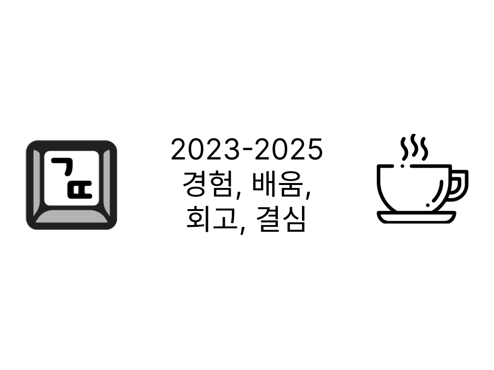
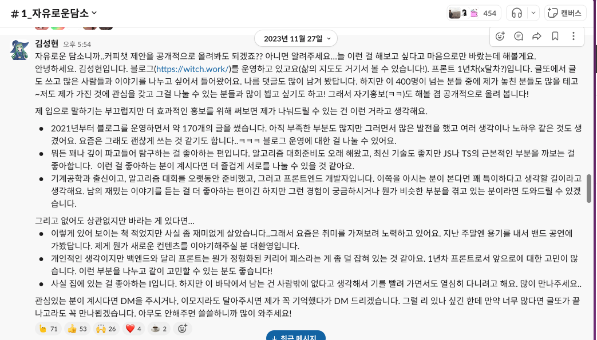

# 시작

[돌아보며 쓰는 삶의 지도](https://witch.work/ko/posts/my-life-map)를 쓴지 벌써 1년 반 가까이 지났다. 그때 들어갔던 첫 직장은 작년 9월에 퇴사했다. 아직 새로운 자리를 찾고 있어서 이력서를 고치고 넣고 그러고 있다.

한두 곳의 집단에 끼어 보려고 했고 어느 정도의 결실도 또 상처들도 얻었다. 벌써 그 위에 시간이 많이 쌓여버린 느낌이 들지만 돌아보면 여러 일이 있었다.

친한 개발자가 알려주어서 글또라는 커뮤니티에도 참여할 수 있었다. 나는 9기와 10기에 참여했다. 이 글을 제출함으로써 패스 없이 모든 회차의 글을 제출할 수 있었다. 참여한 기수마다 각 4개의 글이 글또 큐레이션에 올랐으며 9기 때 썼던 글 중 하나는 네이버 FE 큐레이션에 올랐다. 40번이 넘는 커피챗을 진행했고 그걸 주제로 글또에서 발표도 했다. 그걸 포함하여 이런저런 곳에서 4번의 발표를 할 수 있었다.

글또는 10기를 마지막으로 끝난다고 한다. 이건 그 10기의 마지막 회차 글이다. 글또에서 했던 것들에 대한 후회는 별로 없다. 나는 내가 할 수 있는 것들을 충분히 했다. 아쉬운 점들도 있지만 내가 어쩔 수 없었던 부분들이라고 생각한다. 하지만 그 기간 동안 얻은 걸 한번은 정리하고 넘어가는 게 좋겠다.

겪었던 일들을 하나하나 구체적으로 정리할 생각은 없다. 중요한 건 거기서 무엇을 얻었고 어떤 생각을 더 다듬었는지, 그리고 그 영향을 받아서 앞으로 어떻게 할지가 훨씬 더 나 스스로에게 중요할 것이다. 그러니 그동안 한 일이 아니라 1년이 넘는 시간 동안 벼린 생각들을 정리하고자 한다. 그냥 넘어가기는 아쉬우니까.

그리고 커피챗이라는 이름으로 편하게 이야기를 나누어주신 많은 분들 덕분에 회고 글에 들어갈 생각들을 할 수 있었다. 그분들과 함께 만든 이야기들이 다 망각 속으로 흐르기 전에 적어야겠다 싶었다. 나와 이야기 나눈 분들 중 이 글을 읽는 사람이 있다면 이 글은 당신 덕분이니 정말 감사하다고 전하고 싶다.

또한 정말 핵심적인 계기들을 제공해 주신 분들에 대해서는 영향을 가장 크게 미치신 섹션에 언급해 두었다. 물론 그분들의 입장에서 나와 나눈 이야기들이 어땠을지는 알 수 없다. 하지만 어떤 맥락에서 던지신 질문이나 이야기건 간에 내게 엄청나게 크게 와 꽂혔기에 이 글에서나마 감사를 표하고 싶었다.

그러니 나와 커피챗을 했던 상대분들과 내가 보냈던 시간이 내게 던진 질문들, 또 내가 거기에 대해 열심히 생각했던 답변과 얻었던 생각들을 조금이나마 글로 남긴다. 누군가에게 도움이 되면 좋겠고, 정말 감사하게도 나 혹은 나의 경험이 궁금한 분이 있다면 나를 보여주는 글이 되었으면 한다. 누군가는 필요한 부분만 읽을 수 있도록 주제별로 분류해 보았다.

또한 이 글은 나의 경험을 바탕으로 한 글이다. 다른 분들은 완전히 다른 생각을 할 수 있으며 내 생각들이 호불호가 갈릴 수 있다는 걸 잘 알고 있다. 하지만 나는 누가 봐도 좋은 것만 보여주는 회고는 쓰고 싶지 않다. 그 누구라도 성장, 개선, 최고만 있을 수는 없는 게 뻔한데 그런 척을 하는 글쓰기를 나는 하고 싶지 않다.

내 스타일을 싫어할 수 있다. 그럼에도 훌륭한 개발자라는 감탄보다는 사람의 감정을 불러일으키는 회고이기를, 적어도 나라는 사람을 보여주는 회고이기를 바란다. 나 스스로도 후에 이 글을 보고 나의 생각을 되짚을 수 있도록.

# 커피챗

> 언제나 상대와 뭔가를 공유하고 싶다, 두 사람의 생활 속에 뭔가 공통된 의미를 갖고 싶다고 바란 것도 망막한 세상에 확실한 못을 박고 싶은, 그것을 한 개 한 개 박음으로써 단조로운 시간의 흐름이 아닌 역사라고 부를 만한 것을 만들고 싶기 때문이었어. (...) 어려운 일일지도 모르지만, 추구하지 않고 지나칠 수는 없는 일이야.
>
> 시바타 쇼, "그래도 우리의 나날", 186쪽

이 글 전체에 쓰여 있는 생각들이 커피챗이라는 이름의 기회들이 없었다면 얻지 못했을 이야기들이다. 하지만 나는 적극적으로 커피챗을 통해 사람들을 만나고 인연을 만들고자 한 편이다. 감사하게도 다른 분들 또한 나를 그런 적극적인 모습으로 봐주셨다. 그래서 직접적으로 이렇게 사람을 만나는 경험에 관해 했던 생각과 이야기들도 좀 있었다. 그런 것들을 여기 적는다.

## 왜 커피챗을 이렇게 많이 했는가

나는 글또 9기를 처음 시작했을 때, 채널의 모든 인원인 약 400명이 있는 "자유로운담소" 채널에서 상당한 어그로를 끌었다. 아래 스크린샷처럼 공개적으로 커피챗을 제안드렸다. 나는 어떤 사람이고 어떤 분을 만나고 싶은지 나는 무엇을 전해드릴 수 있는지를 떠들었다. 서로 관심을 주고받을 사람들을 좀 만들고 싶었기에 이렇게 해봤다.

위의 메시지를 보면 이모지가 70개가 넘게 눌려 있다. 열심히 만났지만 아직도 못 만나뵌 분들이 아주 많이 남아 있다. 변명이기는 하지만 모든 만남에 진심을 다하려고 노력했기에 중간에 지쳐버렸다. 내 그릇이 작은 탓이다. 하지만 적어도 그 당시에는 굉장히 많은 분들이 호응해주셨고 그만큼 많은 커피챗을 했다.

사실 이런 용감한 행동 하나보다는 그 행동을 하기 위해 어떤 일이 있었는지가 더 중요하다고 생각한다. 나는 원래 새로운 사람을 만나는 걸 그렇게 좋아하지 않는다. MBTI도 I고, 갤럽 강점 검사에서는 사교성이 강점 34개중 32위에 위치하고 있다. 대부분의 커피챗을 1대1로 진행했었는데 그 이유도 많은 사람들과 어울리는 게 힘들어서였다. 그럼에도 불구하고 이런 시도를 했던 건 이제부터 이야기할 이유들 때문이었다.

먼저, 나는 프론트 개발자들을 잘 모른다. 나는 알고리즘과 함께 프로그래밍을 시작했고 알고리즘 학회에서 얻은 기회로 개발자의 길을 걷게 되었다. 그래서 내 주변 대부분은 컴퓨터공학 전공자다. 지나친 일반화일 수도 있지만 그런 사람들은 대부분 백엔드 개발자가 된다. 심지어 커피챗을 많이 하고 나서인 지금도 내 주변엔 백엔드 개발자가 더 많다. 그래서 글또를 통해서 이런저런 프론트 개발자들을 만나고 싶은 마음이 컸다. 비슷한 연차의 다른 프론트 개발자들은 어떻게 살고 있을까? 내가 자연스레 만날 일이 없었던 그 사람들은 어떤 사람들일까? 글또에 많으니 만나 보자! 이런 것이다.

그리고 이건 내가 보았던 분의 행동을 따라한 부분도 크다. 그게 나라는 사람의 임팩트를 크게 줄 수 있는 방법이라고 생각했기 때문이다. 나는 소프트웨어 마에스트로라는 개발자 양성 프로그램 같은 것의 13기 출신이다. 거기서 이전 기수 사람들을 모아 네트워킹하게 해주는 홈커밍데이가 있었다. 거기의 자유 네트워킹 시간에 사람들이 각자 몇몇씩 모여 떠들고 있는 중이었다. 그런데 한 사람이 갑자기 단상에 나가서 마이크를 잡더니 자기소개를 했다! 솔직히 별 내용은 아니었다. 자기 이름은 뭐고 무엇에 관심이 있으며 지금 새로운 자리를 찾는 중이다, 관심 있으신 분은 나 몇번 자리에 있으니 편하게 말 걸어달라, 그런 내용이었다.

하지만 누가 시키지도 않았는데 그렇게 나가서 자기소개라도 하는 건 엄청난 깡이었고 아주 인상적이었다. 감히 판단하건대 거기 있던 어떤 시니어 어떤 CTO도 또 어떤 연차의 개발자도 그 단상에 올라간 분만큼 그 자리에서 임팩트를 주지 못했다. 그분은 3년차셨고 그분보다 연차가 높은 개발자는 거기 수십 명은 있었음에도 불구하고. 평범한 3년차 개발자가 거기서 명함 돌리고 돌아다녀서 얻을 수 있는 것보다(심지어 명함 돌리고 돌아다니는 것조차 용기가 필요한 일인데도) 훨씬 더 큰 임팩트를 더 많은 사람들에게 전한 거다.

내게는 글또라는 집단에서 그런 기회가 생긴 걸로 보였다. 메시지를 보내는 것과 같은 작은 액션으로 나를 공개적으로 어필할 수 있는 기회. 어떤 고수 개발자나 어떤 외향인이라도 얻기 힘들, 몇백명에게 한번에 나를 전할 수 있는 기회. 심지어 단상에도 안 올라가도 되고 슬랙에 메시지만 쓰면 되고 보는 사람은 더 많다. 그래서 시도를 했다. 다행히 많은 사람들이 나의 그런 행동을 좋게 기억해 주셨다. 나와 처음 만나는 분들 중에도 그 메시지의 임팩트를 기억해 주시는 분이 계셨다.

결국 모든 건 작은 노력으로 큰 임팩트를 주기 위해서였다. 조금 덧붙이자면 나는 늘 외향적인 사람들을 부러워했다. 그 사람들을 둘러싸고 있는 사람들과 그가 받는 관심과 사랑. 좀더 정확하게 짚는다면 외향적인 성격 자체를 부러워하는 게 아니라 그 성격이 그들에게 가져다주는 좋은 것들을 부러워했다. 사람들에게 쉽게 다가가고 어울리고 타인의 마음에 흔적을 남기고 좋은 이미지와 관계를 얻고 지속하는 것 등등.

하지만 내가 갑자기 완전 외향적인 성격으로 180도 바뀔 수 있을 리 없다. 그럼 내가 할 수 없는 건 조금 미뤄둔다고 치고, 어떻게 하면 외향적인 사람들이 얻은 것들을 나도 조금이나마 뜯어서 얻어 볼 수 있을까? 그런 고민에서 저런 공개적인 행동으로 관심을 끌었고 커피챗을 시작했다. 내가 가지지 못한 요소들을 가진 분들을 만나기 위해서. 다행히도 다들 열린 마음으로 만나 주셔서 여러 기회를 얻을 수 있었다.

## 사람들을 만나며 얻은 것

커피챗에서 사람들을 만나며 그래서 무엇을 얻었는가? 물론 사람을 얻었다. 하지만 이런 질문을 받을 때면 그게 어떤 의도를 가졌는지 어느 정도는 짐작할 수 있었다. 커피챗에서만 사람을 만나는 게 아니니까. 개발자끼리 이렇게 만나서 커리어나 인생에 관한 이런저런 이야기 하는 자리들을 통해서 무엇을 얻을 수 있었는가? 를 묻는 걸 거라 예상한다.

커피챗을 통해 노려볼 수 있었다고 생각하는 건 2가지 정도로 요약할 수 있겠다. 첫째는 다양한 사람들을 많이 만날 수 있다는 그 자체였다. 둘째로는 사람들을 통해서 나를 돌아보는 기회를 얻을 수 있었다.

### 새로운 사람들

내게 커피챗은 타인의 세계를 엿보고 거기서 무언가를 배울 수 있었던 자리였다. 특히 나를 뒤흔들었던 세상을 보여주신 [홍유진](https://medium.com/@howyoujini) 님, [남희정](https://nami-socket.tistory.com/) 님께 감사한다.

잠깐 글또 밖의 이야기. 군대 가기 전 잠시 알았던 사람을 몇 년이 지나서 2023년에(글또는 하기 전이었다) 만날 수 있는 기회가 있었다. 그분은 마케팅에 관한 진로를 잡고 취업 준비를 하고 있는 사람이었다. 고기를 먹으러 갔었는데, 그분이 내 입장에서는 매우 차려입고 나오셨다. 셔츠에 코트 차림으로. 만약 내가 그 복장으로 회사를 갔다면 오늘 약속 있냐는 질문을 받았을 그런 차림이었다.

그래서 내가 물었다. 저희가 오랜만이기는 하지만 편하게 만나는 자리인데 왜 이렇게까지 차려입고 오셨냐고. 그랬더니 그분이 되물었다. "이게요?" 그분에게는 그런 차림이 너무 당연한 거였다. 그리고 그분의 옷장에는 그런 옷들만 가득하기 때문에 편하게 트레이닝복 같은 걸 입고 올 수 있는 선택지가 아예 없었다고 했다. 와, 이런 사람이 있다고? 싶었다. 그분은 쓰레기를 버리러 나갈 때도 니트를 입는 게(다른 옷이 없으니까) 일상이었다.

그런 순간들을 통해 나와 완전히 다른 사고방식과 행동양식을 가지고 사는 사람들이 많다는 걸 어렴풋이 알았다. 나는 그런 사람들이 어떻게 하고 있는지, 나와 완전히 노는 물이 다른 그런 사람들이 어떤 고민과 생각을 하고 무엇으로 삶을 채워나가고 있는지가 궁금했다. 그들이 구체적인 대상으로 내 앞에 많이 나타나서 나와 이야기나누어 줬으면 했다. 그리고 내가 커피챗을 걸 수 있는 사람들 중에는 그런 사람들이 아주 많았다.

개발 분야는 다른 이공계 분야에 비해 상대적으로 전공자가 적고 출신도 각자의 경험도 다채롭다. 통계적으로 정확한지는 모르겠지만 느낌이 그랬다. 더욱 궁금했다. 나는 상당히 재미없게 살아온 사람이니까. 활발하고 쾌활하게 사는 사람들이 보고 싶었다. 공연도 다니고 취미도 확실하고 옷도 (내가 좋아하는) 후드티 같은 것보다는 셔츠나 슬랙스나 크롭티나 코트를 입으며 말도 잘하고 새로운 사람 만나는 것도 좋아하고 텐션도 높고 아무튼 개성과 매력이 넘치는 그런 사람들. 내가 갖지 못한 것들을 가진 사람. 나는 그런 사람들을 만나 그렇게 되는 법을 배우고 싶었다.

그래서 다른 사람들을 만났고 그들의 이야기를 들을 수 있었다. 어떻게? 그도 나도 이제는 개발자고 이건 커피챗이니까. 재미있었다. 원래였다면 나는 이런 재밌고 다채로운 사람들과 섞일 일도 거의 없었을 것이다. 나는 기계공학과의 아싸로, 그 사람들은 원래 출신(디자이너라든지 기자라든지 패션 쪽의 어떤 직업이라든지 등등)으로 살면서 만날 일이 없었을 테니까. 또 공통점이란 게 없으니 만나도 대화가 쉽지 않았을 거다. 공통점이라는 게 별로 없으니까. 하지만 우리는 개발자가 되었고 서로 주고받을 수 있는 게 생겼다. 내게는 기쁜 일이었다.

물론 사람이 근본적으로 변하기는 쉽지 않다. 나도 사람을 대하는 게 사실 아직 어렵다. 커피챗을 많이 하다 보니 1번의 만남 정도는 어떻게든 메꿀 수 있을 거 같은 느낌이 이제는 들지만 그 다음부터가 문제다. 더 친해지려면 어떻게 해야 할까? 어떻게 이 사람의 장점을 더 닮을 수 있을까? 어떻게 이 사람처럼 살아볼 수 있을까? 상대 쪽에서 나를 제대로 간택해 주지 않으면 다음으로 넘어가기 힘들었다. 아직도 부드러운 관계를 자연스럽게 이어나가는 법을 고민하고 있다. 어떻게 하면 상대와 마음을 더 잘 나눌 수 있을지.

하지만 그건 따지고 보면 "이런 사람들을 일단 만날 수 있었으니" 가능했던 생각이다. 나는 커피챗을 하는 그 순간들에도 생각했다. "아, 그래도 개발자를 해서 이런 사람들을 만나게 됐구나. 내가 감히 꿈도 꾸지 못했던 사람들과 이야기를 나누고 있구나." 그 자체가 내게는 얻음이었다.

### 나를 돌아보는 기회

커피챗은 기본적으로 관계의 지속성이 많이 떨어진다. 하지만 좀 더 많은 사람들을 만나볼 수 있다. 나는 그런 활동들을 통해 나를 바꾸고 상대방들의 좋은 점을 배울 수 있기를 기대했다. 하지만 사실 내가 나아가거나 개선해야 할 부분들은 내 안에 더 많았다. 

내가 커피챗을 통해 할 수 있는 대부분은 사실 그런 걸 찾는 거였다. 상대에게 직접적으로 뭔가 배우기보다는 그를 통해 나를 비춰보고 돌아보는 일. 이 사람은 이렇게 생각하는구나. 그럼 여기에 비춰서 내 생각에 모난 부분은 뭘까? 아니면 이 사람의 사고를 통해 내 생각의 결에서 메울 수 있는 구멍이 있을까? 이런 것들.

내가 만났던 모든 분들은 배울 점이 있었다. 나도 그런 분들에게 커피챗을 청하려고 하기도 했고. 하지만 그분들의 장점이라는 게 당연히, 몇 시간 대화 나누는 정도로 배울 수 있는 건 아니었다. 그럴 수 있다고 생각하는 게 오히려 그분들의 노력을 얕보는 일이라고 생각한다. 내가 할 수 있었던 건 그분들과 스쳐지나가는 순간을 통해 이미 내 안에 있던 답들을 좀 더 선명하게 엿보는 거였다.

나는 이제 내가 무엇을 하고 싶은지 더 잘 알게 되었고, 어떤 것을 잘하고 어떤 부분이 부족한지 잘 알게 되었다. 내가 원한다고 생각했던 것들 중 진짜로 원하는 것과 아닌 걸 좀더 잘 구분할 수 있게 되었다. 마음 속 우선순위에도 많은 변동이 있었고 우선순위를 정하는 기준도 조금은 바뀌었다. 다른 분들과 이야기를 나누고 서로를 비춰보지 못했다면 선명하게 알지 못했을, 정제된 답들이었다. 몇몇에게는 감탄을 불러일으킬 만큼 진한 메타인지를 갖게 되었다.

그 기회가 없었다면 나는 여전히 내 안의 모순과 불만족에서 억지로 눈을 돌리고 모른척하면서 원하지 않는 것을 좇고 있는 척 하며 훨씬 더 괴로워하고 있었을 테다.

### 사람을 얻기

위의 것들은 내가 제어할 수 있는 영역에서 어떻게든 다른 사람을 통해 무언가 얻어보려고 발버둥친 흔적이다. 나는 언제부턴가 커피챗을 통해 사람을 얻는 것에 대해 약간은 기대를 접었었다. 그럼에도 불구하고 내 마음을 울려준 [최민주](https://velog.io/@judy_choi/posts)님과 [최경민](https://medium.com/@radiantchoi)님께 감사드린다. 이외의 분들은 내가 소개해서 남들이 알게 되면 질투날 것 같아서 쓰지 않았다.

사람을 얻는 건 사실 쉽지 않다. 그건 내가 어떻게 하는지도 중요하지만 상대방 쪽, 그러니까 내가 전혀 마음대로 할 수 없는 쪽에도 영향을 받으니까. 또 나는 좋은 점은 아니지만 사람을 받아들이는 허들이 정말 높은 편이기에 그런 사람을 얻는 건 더더욱 힘들었다.

하지만 그럼에도, 이 커피챗이라는 얄팍한 자리에서조차 앞으로 길게 나아갈 수 있을 듯한 사람들을 몇은 얻을 수 있었다. 나도 칭찬도 많이 받아 보았지만 나는 그런 것보다는 사실 앞으로 오래 보고 싶다는 말이 훨씬 더 감동적이었다. 누군가의 말마따나 동경은 이해에서 가장 먼 감정이고 나는 동경 같은 거 필요 없다.

사람들을 만나서 얻을 수 있었던 건 단연코 사람이다. 다만 나도 많은 이들을 놓쳤고 이건 운에 기대는 면도 크며 일부러 노릴 수 있는 건 아니기에 무언가 길고 당당하게 쓸 것도 별로 없다. 그저 내 옆에 소중한 사람들이 생겼으니 그래, 최고다, 하는 거다.

## 인상깊었던 커피챗과 그렇지 않았던 커피챗

커피챗을 많이 하셨는데 가장 좋았던 자리와 최악이었던 자리는 어떤 자리였나요? 몇몇 분들이 궁금해하셨었다. 하긴 나도 사람이니 결이 안 맞는 분들이 있었던 건 사실이다. 하지만 다들 충분히 배울 점들이 있었기에 최악이라고 표현하는 건 실례이기도 하고 그 정도의 단어가 어울리는 분은 실제로 없었다. 그래서 인상 깊었던 커피챗과 약간 부담스러웠던 자리는 어떤 것이었는지 간단히 돌아보는 정도로 충분할 듯 하다.

처음에는 내가 경험하지 못한 유형의 사람을 만나 닮아볼 수 있다는 자체로 좋았다. 하지만 나중에는 결국 내게 확실한 임팩트를 안겨주는 사람이 인상에 남았다. 나와 엄청나게 비슷하거나, 아니면 나와 엄청나게 다르거나. 비슷하다면 초면치고는 강한 유대감을 갖고 비슷한 생각의 길에서 서로가 얻었던 것들을 나눌 수 있었다. 완전히 다르다면 그 사람 또한 그 모습으로 얻어온 것들이 있다는 걸 알기에 손짓 눈빛 하나까지 내가 배울 점이었다.

물론 전제조건이 있는데 어느 정도 생각의 결은 비슷해야 했다. 그래야 나와 비슷한 결에서 어떻게 저런 다른 사람이 있을 수 있고 저 사람처럼 되려면 어떻게 해야 하는지 내가 참고할 수 있으니까. 또한 그런 사람이어야 내게 자신의 이야기를 좀 더 잘 전해줄 수 있었다. 상대분도 내가 편해야 이야기를 잘 하니까.

반대로 부담스러웠던 자리란 그런 차이가 자연스러운 것으로 다가오지 않는 자리였다. 나와 너무 다른 것까지는 괜찮다. 하지만 그럼에도 생각의 흐름은 약간 통하는 데가 있어야 대화가 진행되는데 그렇지 않아서 뚝뚝 끊기는 어색한 정적이 이어지면 부담스러웠다. 정적 사이를 차지하는 대화에서 배울 점이 있었지만 그런 자리에 다녀오면 지치곤 했다. 내가 커피챗에서 얻을 수 있었던 건 배움과 사람이었는데 그 중 배움만 있는 자리가 사람으로서는 약간 힘든 자리였다.

# 시도와 꿈과 돌아봄과 깨달음

> 어처구니없던 나의 어린 꿈 가질 수 없음을 알게 되던 날
> 두드러기처럼 돋은 심술이 끝내 그 이름 더럽히고 말았네
>
> 잔나비, "꿈과 책과 힘과 벽" 중

사람들을 새로 만나는 것은 말했듯 나를 비춰볼 수 있는 시간이었다. 또한 상상도 하지 못했던 순간들을 접하고 깨달음을 얻을 수 있었다. 뭔가 대단한 순간들이었던 건 아니다. 마케팅 직무의 취준을 하던 지인의 옷장에는 트레이닝복 같은 옷이 없다는 게 내게 충격이었던 것처럼 타인들의 작은 한마디 그리고 행동 하나가 내게는 번뜩였다.

그런 순간들이 쌓여서 아까 말했던 진한 메타인지를 갖게 되었다. 여전히 헷갈리지만 그래도 내가 꿈꿨던 자리들 중 몇 개에는 엑스표를 칠 수 있게 되었다. 새로운 생각과 동기부여를 몇 개 얻었다. 그래서 그것들 중 남기고 싶은 몇 개를 골라 순서 없이 적는다. 특히 [김채은](https://chaerangja.tistory.com/) 님과 선택에 관한 이야기를 나누면서 생각을 정리할 수 있었기에 감사드린다.

## 먼저 다가가는 건 귀하다

위에서 내가 공개적으로 커피챗을 모집한 메시지를 보면, 70명이 넘는 사람들이 내 메시지에 이모지를 눌러주셨다. 내 연락을 호의적으로 여겨주실 거라는 제스처였다고 생각한다. 그런데 그럼 내게 먼저 연락을 주신 분은 몇 명이나 될까? 몇 명에게 이 질문을 했었는데, 대부분은 "당연히 70명보다는 훨씬 적겠지만 두 자릿수 정도는 되지 않을까"라는 대답을 하셨다.

기준에 따라 다르겠지만 먼저 연락을 주신 분은 2-3분이었다. 대략 20명 중 1명 꼴이니 나를 포함한 모두가 생각했던 것보다 훨씬 적은 숫자다. 그럼 반대로 말하면 적극적으로 연락을 취하고 다가가는 모습만 보이더라도 20명 중 1명 꼴로 돋보일 수 있다는 거 아닌가? 나만 해도 수십 명을 만났지만 내게 먼저 연락을 주셨던 [이서인](https://velog.io/@seoin1002/posts)님과 같은 분들에게는 특별한 감사함을 가지고 있다.

적극적인 자세가 중요하다는 건 원래부터 알고 있었다. 다른 사람들에게 배우려고 노력하는 게 좋다는 걸 모르는 사람이 있을까? 하지만 그게 얼마나 좋을까? 어느 정도의 힘이 될까?에 대해서는 모호했다. 내가 직접 이런 경험을 하면서 관찰한 20명 중 1명, 이라는 숫자는 내게 "적극성이라는 게 얼마나 희소한지"를 정량적으로 느낄 수 있는 기회였다.

연차 차이가 너무 난다든지, 이성이라든지 하면 망설이게 될 때가 있긴 하다. 하지만 그분들도 사람인데 먼저 연락받는 게 반가울 거 같다. 또한 모두가 그렇게 망설일 텐데 내가 한 번 이겨내야 돋보이는 거 아닌가? 라고 생각한다.

그리고 나는 처음에 내가 대단한 개발자는 아니니까 그 정도 비율의 분들만 연락을 주신 거라고 생각했다. 하지만 다른 시니어 분들이나 꽤 유명한 분, 혹은 커뮤니티 내에서 입지가 굉장한 분들에게 여쭤보아도 비율은 비슷했다. 적극적인 모습을 보이는 사람은 5%도 안된다는 건 나보다 훨씬 대단한 분들에게도 똑같이 적용되었다.

개발자 중에 상위 5%가 되는 건 쉽지 않은 일이다. 많은 시간과 노력이 필요하겠지. 하지만 내가 조금의 두려움을 이기는 것만으로 상위 5%급으로 돋보일 수 있다면? 그건 상대적으로 꽤 쉬운 일이 아닐까? 적극적인 접근에 대한 확실한 동기부여를 얻을 수 있었다.

## 시도하기

그 시간 동안 이런저런 시도들을 해보았다. 커피챗부터 시작해서 발표 같은 기회가 생길 때마다 그걸 잡으려고 했다. 글또에서 진행했던 발표 때는 마녀 옷을 입고 사람들에게 굉장한 인상을 남기려고 해보았다. 후배들 사이에 끼어 보려고 노력하기도 하고 스터디를 조직하기도 했다.

상처를 줬던 이들도 있었고 상처를 받기도 했다. 나도 언젠가는 일이 그렇게 되리라는 걸 알고 있었지만 모르는 척 하고 시도한 적도 있었다. 상처를 받을 때 받더라도 뭔가 이뤄보고 싶어서.

어째서 그런 시도들을 했는가? 그에 대해 돌아보며 생각도 많이 했고 누군가 물어보기도 했다. 일단 첫번째로는 스스로가 달라진다는 게 생각보다 별거 아니라는 느낌이 들어서였다. 나는 내가 변한다는 건 뭔가 모든 사고방식이 천지개벽하듯 변하고 원래는 전혀 할 수 없었던 생각을 하게 되는 그런 엄청난 일이라고 생각했다. 실제로 사람의 근본이 변한다는 건 그런 걸지도 모른다. 하지만 남들이 보는 나를 변하게 하는 건, 누구나 면접에서는 자신있는 척을 해보려고 하듯이 그런 작은 시도들이 만드는 거 아니겠는가 하는 생각이다.

어디선가 들은, 내가 굉장히 좋아하는 말이 있다. 슈퍼히어로들이 나오는 이야기에서 선배 히어로가 후배에게 조언을 하는 내용이다. 대략 이런 소리였다. "사람들은 슈퍼히어로라면 모든 순간에 영웅적일 거라고 생각하지. 이를 닦을 때도 영웅, 바지를 입을 때도 영웅. 하지만 그런 게 아냐. 다른 모든 순간에 평범하더라도 한두 번, 정말로 영웅적일 수 있는 순간에 영웅에 걸맞는 행동을 하면 영웅이 되는 거야."

그래 딱 한두 번이다. 사람들은 진짜 나 같은 건 모르고 몇 번 나를 본 순간으로 나를 판단한다. 내가 마녀 옷을 입고 발표를 멋지게 해낸 걸 본 사람들은 나를 매우 용기있고 말 잘하고 자존감 높은 느낌으로 기억할 수도 있지 않을까? 그런 순간 몇 번이면 진짜 나는 몰라도 사람들이 보는 나는 바뀔 수 있다. 어쩌면-그게 진짜 내가 바뀔 때까지 한 걸음씩 나아가보는 과정일지도 모르지 않은가? 그래서 계속 시도해보게 되었다.

둘째는 사실 중요한 건 대부분의 순간에 맞는지 아닌지가 아니라 자기가 맞도록 만드는 몇 번의 빛나는 터닝포인트라는 생각이 들어서였다. 나는 꽤나 현실적인 사람이기에 대부분의 순간 맞았다. 내가 떨어졌다고 생각하면 떨어졌고 차일 거라고 생각하면 차였다. 일단 비관적으로 생각하면 그건 대부분 현실이 되었다.

하지만 그게 중요한 건 아니지 않은가? 나를 99명이 싫어하더라도 1명이 좋아해 준다면, 100번 불합격해도 나를 찾는 회사 하나가 있는 게 중요한 거 아닐까? 100번 중 99번 떨어질 거니까 지원 안 해! 하면 아무 일도 일어나지 않는다. 나를 만들었던 순간들은 내가 맞았던 순간들이 아니라 비관적인 예상 따위를 모두 뒤엎고 원하는 걸 손에 넣을 수 있었던 몇 번 안 되는 순간들이었다.

비관주의자들의 말은 대부분 맞지만 실제로 세상을 바꾸는 건 꽉 닫힌 커튼 사이 작게 비추는 햇살같은 희망에도 눈을 빛낼 수 있는 낙관주의자들이다. 나는 이번에도 100번 실패할 거라고 죽상을 하는 사람보다는 100번 중 100번 다 실패해도 또 용기내서 100번 시도하고 이번에는 한 번 성공시키고 깔깔 웃는 사람이 되고 싶었다.

성공도 하고 싶었지만 그보다는 성공을 위해 가는 길에서 누구나 마주하는 실패들에 대처할 수 있는 연습을 하고 싶었다. 앞으로도 수많은 실패를 겪겠지만 다음에는 더 용감하게 뛰어들 수 있도록. 자, 또 시도를 하고 기꺼이 찢기자.

## 목표와 꿈에 대하여

목표가 무엇인가, 돈이 많으면 무엇을 할 것인가, 인간으로서 이루고 싶은 꿈이 무엇인가. 많이 물었고 많이 들었던 질문이다. 처음에는 머뭇거리면서 잘 답을 하지 못했지만 이제 조금은 말할 수 있다.

나는 다른 사람의 마음을 울리고 싶다. 잘한다고 존경받는 게 아니라 동등한 위치에서 서로를 이해하면서 울림을 주고 받을 수 있는 그런 사람이고 싶다. 비루해지고 싶지도 않지만 대단해져야만 하는 것도 아니다. 가까운 사람들과 사랑과 소속감을 주고받으며 살 수 있다면 그것으로 족하다. 애초에 소속감이 없는 집단에 속해서 비즈니스 성격이 강하고 선이 명확한 관계를 많이 만드는 건 내게 상당한 피로를 주었다.

내가 개발을 시작할 때를 떠올려 보았다. 나는 개발이 좋다고 망설임 없이 말하며 눈을 빛내는 사람들에게 반해서 개발자가 되었다. 그 사람들이 무슨 대단한 실력자들이었던가? 잘하는 축이기는 했지만 고작 학생이거나 주니어 개발자였다. 그 사람들의 실력이 아니라 그 사람들의 진심이 내 마음을 울렸다. 또 그 사람들은 나를 흔쾌히 받아주고 소속감을 주었기에 나도 그들을 사랑할 수밖에 없었다.

존경이 아니라 울림이 있는 사람이었으면 좋겠다. 내가 개발자로서 얼마나 멀리까지 갈 수 있는지는 상관 없다. 나는 홀로 끝까지 가는 외로운 영웅이고 싶지 않다. 친구라고 부를 수 있는 사람들이 있고 그들과 함께 울고 웃으며 서로를 이해하고 사랑할 수 있는 사람이고 싶다. 내가 원하는 사람들이 나를 사랑해 주었으면 좋겠다. 나도 그들을 사랑하면서 어디까지든 함께 갈 수 있도록.

내 갤럽 강점검사 2등 테마가 절친(Relator)이고 이 특성이 내 관계 형성에 대해 잘 설명해 준다고 생각한다. 이걸 나도 알기에 이렇게 타인에게 울림을 주는 사람이 되고 그런 걸 주고받을 수 있는 사람이 되고자 하는 목표를 강하게 세웠다.

> 자신의 강점으로 인해 당신은 우여곡절을 당신과 함께했던 친구들과 당신을 속속들이 아는 친구들과 시간을 보내는 것을 선호할 것입니다. 일반적으로 그러한 목록에는 소중한 몇 명의 친구가 있습니다.
>
> CliftonStrengths 34, Gallup, 절친(Relator) 테마가 고유한 이유

그런 사람이 되어보려고 여러 인간적인 시도를 한 것이고 발표에서 마녀 옷을 입은 것이고 사람들을 만나면서 내 이야기를 갈고닦은 것이다. 난 멀리 떨어져 있고 싶지 않다. 사람들의 가까이서 이해와 사랑과 울림을 주고받는 이들을 만들기 위해 전력을 다할 것이고 사람과 이뤄지는 게 내 꿈이다.

> 당신은 진실되고 상호 보완적인 일대일 관계를 형성합니다. 당신의 진정성은 신뢰와 자신감을 형성하는 긴밀하고 장기적인 관계를 구축할 수 있습니다. 
>
> CliftonStrengths 34, Gallup, 절친(Relator) 테마를 사용하여 성공할 수 있는 이유

## 막연한 생각 제거하기

사람들을 만나면서 가장 많이 주고받았던 질문은 결국 "왜?" 였던 것 같다. 왜 개발자가 되었고 왜 이런 걸 하고 싶으며 왜 그런 선택을 했었고 왜 그게 터닝포인트가 되었는지 등등. 나도 내가 했던 일들에 대해 "왜?"라는 질문을 받았고 고민을 해야만 했다.

그러면서 느낀 건 나도 또 다른 사람들도 막연하게 하고 싶어했던 것들이 많았다는 거다. "왜?" 라는 질문을 받았을 때 나오는 대답들의 연결이 제대로 되지 않는 경우가 많았다. 예를 들어 나는 대부분 글또에서 커피챗을 했으니 글에 대한 이야기도 많이 나누었다. 많은 사람들이 글을 잘 쓰고 개발 블로그를 꾸준하게 운영하고 싶다고 했다.

하지만 왜 블로그를 꾸준히 운영하고 글을 잘 써야 하는가? 그럼 잘하는 개발자의 이미지를 얻는 것에 대한 이야기가 많이 나오곤 했다. 하지만 그런 이미지를 위해서라면 다른 선택지도 많다. 토이 프로젝트도 있고 개발 연합동아리도 있다. 스터디를 할 수도 있을 것이다. 왜 꼭 개발 블로그여야 하는가? 이쯤 도달하면 정말 맥락들 간의 연결을 생각할 수밖에 없다.

나도 수없이 그런 "왜?"의 세례를 받았고 그걸 통해 나도 나의 선택들에 대해 고민을 해보았다. 그 과정에서 막연한 바람들을 많이 쳐낼 수 있었다. 가령 나는 인기가 많아지고 싶어했고 모두가 나를 좋아했으면 좋겠다고 생각했다. 하지만 사실 내 마음은 그런 게 아니었다.

나는 타인을 마음에 들이는 데에 있어서 허들이 매우 높은 사람이었고 누군가에게는 내가 배타적인 사람으로 비춰질 정도였다. 그리고 나는 그럼에도 불구하고, 내가 세운 그런 높은 벽들을 뚫고 사랑할 사람을 찾고 있는 거였다. 그런 사람들 소수가 있다면 나머지는 어떻게 되든 사실 상관 없었다. 나는 인기가 많으면 그런 사람들도 쉽게 구할 수 있을 거라 생각했던 거 같은데 막연한 기대일 뿐이었다.

어떻게 하면 좋겠다, 무엇을 잘하면 좋겠다는 생각을 많이 했다. 하지만 그런 건 정말 막연한 생각일 뿐이다. 모든 걸 잘할 수는 없지 않은가? 나는 내가 가진 한정된 자원을 어디에 투입할지 결정해야 하고 그 과정에서 실제로 내가 원하는 것과 거리가 먼 것들을 걸러내야 한다. 그것을 추구하는 건 그 다음이다. 그리고 각자의 삶에서 단맛 쓴맛을 조금씩 보고 다양한 경험을 해보고 온 사람들과 "왜?" 라는 질문을 주고받는 건 내 머리에서 그런 막연함을 조금이나마 걷어내는 데 도움이 되었다.

# 글쓰기

> 나는 차가운 머리로 새로운 말을 하기보다 뜨거운 혀로 평범한 말을 하는 게 살아 있는 거라고 믿고 있거든. 피의 힘으로 몸이 움직이기 때문이지. 말이 공기에 파동을 전할 뿐 아니라 좀 더 강력한 것에 좀 더 강하게 작용할 수가 있기 때문이야.
>
> 나쓰메 소세키, "마음", 165쪽

난 글을 쓰는 데에 상당한 노력과 시간을 들였다. 글또라는 작은 세상에서였지만 약간의 결과들도 있었다. 나는 9기 1회차부터 큐레이션을 꿰찼고, 정말로 공을 들인 글들은 대부분 큐레이션에 올랐다.

그래서 글에 관한 질문들도 꽤 받았고, 덕분에 나도 어렴풋하던 생각들을 정리할 수 있었다. 내 배경이 된 경험들과 배우고 만들어왔던 생각들을 정리해보는 기회라고 생각하고 적어본다. 이 생각을 만들 수 있는 기회가 된 질문을 주신 [이홍빈](https://thoughtprovo-king.tistory.com/) 님, 이야기를 통해 더 선명한 생각을 가질 수 있게 해주신 [이형걸](https://velog.io/@friedchicken/posts) 님께 감사한다.

## 나와 글

나는 기술을 설명하기 위해 글쓰기를 시작하지 않았다. 나는 원래부터 글을 써왔고 이건 내게 익숙한 일이다. 누군가에게는 어릴 때 반 친구들과 축구를 하는 게 자연스러웠듯이 내게는 글쓰기가 그랬다. 내가 가질 수 있었던 몇 안 되는 해자 같은 능력이라고 생각한다.

부모님은 책을 좋아하시는 분이었고 아버지는 취미로 글을 가끔 쓰셨다. 나도 어머니가 도서관에서 빌려다 주는 책을 읽었고 10살 정도부터 글을 쓰기 시작했다. 생명의 소중함, 우정의 의미, 어떤 사람이 되고 싶은지, 세상이 어떻게 돌아가야 하는지. 어린 시절이라 철없는 생각 투성이였지만 당시의 경험과 고민을 담아 글을 썼다. 아버지가 글을 보고 조언을 해주셨다.

아버지는 작가를 키우려는 게 아니었고 글쓰기는 언제나 수단이었다. 글은 너를 너 자신에 가깝게 표현하기 위한 수단이다. 특별한 기술은 필요치 않다. 많이 쓰고 경험하고 생각하며 생각의 깊이를 더하는 게 중요하다. 글은 네가 보고 느낀 것을 가장 날카로운 감각으로 타인에게 최대한 그대로 전달하기 위해 쓰는 것이니 먼저 풍부하게 보고 느껴라. 얕은 생각을 화려한 말로 포장하려 할 필요 없다. 아니 그래서는 안 된다.

멋진 단어, 쉬운 설명, 세밀한 묘사, 짧은 문장, 비유 같은 도구를 사용하되 너무 신경쓰지 마라. 본질은 네가 경험하고 생각한 바다. 글은 고치면서 좋아지는 것이니 글빨로 무엇인가를 해보려 하기 전에 세상에 부딪치고 머리를 굴려라.

창밖을 보아라. 어떤 간판이 보이는가? 네게는 치킨집이 먼저 보였지만 누군가에게는 청과물 가게가 먼저 보일 것이다. 가진 경험에 따라 어떤 사람에게는 길의 보도블럭 배치가 눈에 띌지도 모른다. 누군가가 네게 와서 "길의 보도블럭에서 이런 패턴이 보인다."라고 말해주면 그건 네가 보지 못한 세상의 한 조각이 아니겠는가? 네가 할 수 있는 모든 생각도 타인에게는 그런 것이다. 그것을 글로 전하면 충분하다.

그 말을 들으며 새기고 글쓰기를 배웠다. 칭찬 혹은 피드백 속에서 많은 글을 썼다. 타인에게 내 생각을 그대로 전하는 글을 위하여 초안을 다 찢다시피 하고 누더기를 기워가며 완성하곤 했다. 가끔 사람들은 내게 글을 잘 쓴다고 하게 되었다. 사실 말뿐인 칭찬도 많았던 거 같은데 그때는 잘 몰랐다. 나중에 알게 되자 그 공허함도 그대로 글이 될 수 있었다. 내게 글이란 건 곧 나였으니까.

글은 내게 있어서 내가 살아가고 배우며 흘린 피를 모아 그대로 부어 쓰는 것이다. 내가 남들의 이야기에 묘한 쾌감을 느끼듯 내가 쓰는 글자들에 내 땀과 눈물과 관점이 듬뿍 묻어 있다면 그걸로 됐다. 나는 나를 보여준 것이고 사람들이 그게 나인 줄 안다면.

나는 그 생각과 함께 오랜 시간을 보냈다. 고3때, 대학 새내기 때 정도의 2-3년을 제외하면 나는 10살 때부터 꾸준히 글을 써왔다. 글이 내가 가진 도구라면 개발자 중에 나만큼 그 도구에 내 마음에서 흐른 피를 많이 묻힌 사람은 흔치 않다고 자부한다. 내게 노력을 들인 글이란 멋진 말로 쓰인 글이 아니라 내가 걸어온 길을 제대로 전하는 글이다.

중요한 건 어휘력 따위가 아니다. 그런 건 쓰고 읽으면 는다. 내가 도망치지 않고 내 앞에 닥쳐온 문제와 생각들에 계속 맞서 싸우고 살아남아 무언가를 글로 남긴다는 그 자체다. 사람들이 사설 오케스트라를 거느렸던 금수저 멘델스존보다 청각장애를 처절하게 딛고 일어난 베토벤의 이야기에 더 열광하는 까닭이 단순히 베토벤의 음악이 더 위대하기 때문만은 아닐 것이다.

나는 사람을 만난다. 공부를 한다. 새로운 경험을 하고는 한다. 상처를 주기도 하고 받기도 하고 슬퍼하기도 화내기도 한다. 누구나 그렇게 살지만 사람들마다 눈코입의 모양이 다르듯 이 또한 그렇고 나도 나의 방식으로 살아가고 있다. 나는 그 사실을 크게 외치고 표현하고 전하기 위해서 글을 쓴다.

만약 나를 따라하고 싶다면 내게 묻는 것보다 먼저 스스로의 마음을 찔러야 한다. 나는 순조롭게 상처 없이 쓰이는 글을 믿지 않는다. 나는 무해하게 위대해지는 신화를 믿지 않는다. 누구에게도 상처주지 않고 아무 어려움도 겪지 않고 아무것도 돌아보지 않고 누군가의 가슴을 울릴 수는 없다고 믿는다. 내가 겪어온 모든 어둠과 상실과 고통과 슬픔과 기쁨과 사랑과 분노와 상처와 온갖 더럽지만 인간적인 감정들과 배움이 바로 나이고 그걸 정제한 걸 글에 담기 위해 노력한다.

## 기술적 글쓰기를 하기 위하여

블로그에 어떻게 하면 글을 꾸준히 올리냐고 다른 분들이 물으면, 위에서 길게 쓴 것처럼 글은 나를 표현하는 수단일 뿐이니 당신 스스로가 존재하기만 한다면 두려워할 필요가 없다는 생각을 말해드린다. 하지만 글을 열심히 쓰는 것과 체계를 가지고 글을 쓰는 것은 약간 다른 영역이라고 생각하기에 내가 기술적인 글을 어떻게 엮어내는지를 스스로도 정리할 겸 정리해보려고 한다.

일단 이건 내가 타고난 것에 어느 정도 영향을 받았다. 난 어릴 때부터 언제나 생각이 많고 맥락을 궁금해하는 사람이었다. 갤럽 강점 검사에서도 내 강점 1위는 "회고(Context)"다.

> 당신은 과거를 돌이켜 봄으로써 현재를 이해합니다. 과거 지나온 길과 앞으로 나아갈 길 간의 관계를 파악하는 당신의 독특한 능력은 계획을 세우고 의사 결정을 내릴 때 아주 큰 힘을 발휘합니다.
>
> CliftonStrengths 34, Gallup, 회고(Context) 테마를 사용하여 성공할 수 있는 이유

내가 기술 블로그에 글을 쓰는 방식도 이것과 같다. 뭔가를 파고들기 위해서는 그 개념 자체를 파고들 수도 있지만 그 개념이 관통하고 있는 흐름을 이해하는 방법도 있다. 그게 내 방식이다. 특히 컴퓨터공학의 경우 자연이라는 탐구 대상이 있었던 다른 이공계 학문들과 달리 온전히 인간이 만들어낸 체계이기에 더욱 그런 흐름이 존재한다고 본다. 이 분야에서 그냥 갑자기 나온 건 없다고 생각한다.

스티브 잡스가 구석기시대에 태어났다면 그는 스마트폰을 만드는 대신 아마도 동굴에 그림을 그리거나 불을 피우는 방법을 연구했을 것이다. 그의 재능은 어느 시대라도 같았겠지만, 그가 그 재능으로 무엇을 했는지는 그가 태어난 시대와 환경이 만든다. 모든 개념과 새로운 것은 서로 연결되어 있다. 그래서 어떤 개념이 어디에서 나왔고 어디에 연결되어 있는지 탐구하고 풀어내기 위해 노력하는 게 내가 글의 구조를 만드는 방법이다.

결국 계속 "왜?" 라는 질문을 던지는 것이다. 가령 프론트로 예를 든다면, JS를 좀 공부했다는 사람 치고 Promise를 못 들어본 사람은 없다. 그럼 그 Promise라는 건 왜 나왔을까? 이 질문이 나오게 되면 웬만한 개발자들은 기계처럼 콜백 지옥이라고 답한다.

하지만 이상하지 않은가? 콜백 지옥의 예시로 흔히 나오는 게 그 수없이 중첩된 인덴트 콜백 사이로 아도겐을 쏘는 짤이다. 이건 누가 봐도 이상하고 불편한 코드다. 근데 Promise 이전의 개발자들은 다 바보라서 그걸 못 알아보고 콜백 지옥 코드를 짰을까? 상식적으로 그럴 리 없지 않나. 그럼 그전에는 어떻게 했을까? 혹은 왜 Promise 같은 게 필요 없었을까? 찾아보면 다 이유가 있고 최소한 실마리가 있다.

그런 것들을 이으려고 노력하고 중간중간에 난 흐름의 구멍들을 메우고 그렇게 하나의 선을 완성하는 글을 써보려고 한다. 그걸 성공하면 다른 사람들이 잡고 따라갈 수 있는 실 같은 흐름이 이어지는 괜찮은 글이 나온다. 꼭 역사에 관한 이야기일 필요 없다. 핵심은 내가 전하고 싶은 모든 흐름에 이유를 댈 수 있도록 노력하는 일이다. 연습이 필요하며 그걸 연습한 결과들이 내 블로그에 있는 몇몇 글들이다. 노력이 들지만 시작은 누구나 해볼 수 있는 방법이라고 생각한다.

## 글쓰기와 선택

글쓰기 능력을 가진 자들을 칭송하는 말들이 많다. 앞으로는 세상이 글쓰는 사람과 아닌 사람으로 나뉠 거라든지 하는 말들 말이다. 나는 별로 그렇게 생각하지 않는다. 나는 글쓰기를 꾸준히 해왔지만 이건 내가 타고난 것과 사고방식을 인지하고 그에 따라 내가 할 것을 선택한 결과일 뿐이다.

나는 원래부터 글쓰기에 익숙한 사람이며 흐름을 만들고 글을 통해 풀어내는 건 내 강점이다. 또 나는 반대로, 스스로 어떤 아이디어를 내고 빠르게 만들어보고 하는 걸 재미있어하지 않는 편이다. 잘하지도 못한다. (남의 번뜩이는 아이디어에 감화되어 따라가는 건 그럭저럭 한다) 그런 상황 속에서 나는 내가 잘할 수 있고 좀 더 하고 싶은, 이 블로그를 통해 나를 어필하기를 선택했을 뿐이다.

내가 배우고 싶어 만난 분들 중에는 글쓰기를 굉장히 힘들어하시는 분도 많았다. 하지만 그렇다면 왜 글을 써야 하는가? 나는 글쓰기로 이 바닥에서 좀 더 돋보일 수 있을 거 같아 이렇게 했다. 하지만 개발이 그저 문제 해결 도구이며 세상에 가치를 전하는 수단일 뿐이라면 기술적인 글을 쓰기 위해 노력할 이유가 크게 없다고 생각한다.

그 시간에 하고 싶은 프로젝트를 하는 게 그분이 훨씬 빛나는 일일 거 같다. 나는 사실 글을 잘 쓰고 싶다고 말하는 분들 중 일부는, 글또라는 집단에 속해 있으니 충분한 고찰 없이 막연하게 바라는 걸지도 모른다고 감히 생각한다. 또한 글쓰기를 선택했더라도 이 길에서 무엇을 얻고 싶은지 생각해보는 과정이 필요하다고 본다.

나는 글쓰기를 선택했고, 다른 사람들은 또다른 길을 선택해 각자의 빛나는 점들을 만들었다. 솔직히 내가 만났던 분들 중에 나보다 블로그를 꾸준히 운영해 온 분들은 몇 분 없었다. 하지만 내가 보았던 분들은 다 존경스러웠고 그분들의 빛은 내가 쌓아온 것과는 또 다른 방식으로 빛났다. 모든 건 선택일 뿐이다. 선택을 언제나 마음대로 할 수 없기에 불합리한 부분이 있다는 걸 알지만, 난 기본적으로 모두가 꼭 글을 위해 노력할 건 없다는 입장이다. 각자 이 바닥에서 원하는 게 다르니까 말이다.

# 내 길 찾기

> 그러니 중요한 건 이루어낸 로망보다는 아직 이루지 못한 로망이 얼마나 남아 있는가, 앞으로 얼마나 더 많은 꿈을 품게 될 것인가 하는 점일 것이다. 다행히 내게는 로망이 아직 몇 개 더 남아 있고 앞으로도 조금 더 생길 수 있을 것도 같다. 그리고 그것들은 힘닿는 대로, 비록 실망하는 한이 있더라도 시도해볼 것이다. 왜냐고?
>
> 로망이니까.
>
> 이석원, "보통의 존재", 265쪽

수많은 시도와 생각들을 했지만 결국 남들과 이야기하고 성찰하는 건 내 갈 길을 찾기 위해서였다. 어떻게 해야 내 마음속 중심을 잡고 좋은 삶을 향해 나아갈 방향을 찾을 수 있을지. 수많은 경험과 실패들은 행복한 삶으로 가는 길을 비춰보려는 시도였다.

## 의문투성이 세상

다 큰 척 회사를 다니고 살아 보고 사람들을 대해 왔다. 하지만 그건 내게 언제나 의문투성이인 일이었다. 내 작은 그릇으로는 납득할 수 없는 일이 너무나 많았다.

분명 같은 활동을 했는데 왜 저 사람은 친구도 애인도 만들어졌는데 난 외톨이로 남은 걸까? 나는 할 일만 잘하면 멋있고 훌륭하고 매력적인 사람이 될 수 있을 거라 생각했는데 왜 그렇지 않을까? 또 저 사람은 나보다 훨씬 못한 것 같은데 어떻게 저렇게 사랑받을 수 있는 걸까? 왜 나는 회사에서 고작 이 정도 사람이 되어야 하는가? 왜 나는 개발을 이렇게 못할까? 아-그러니까, 내 마음대로 되는 일이란 왜 이렇게 없을까? 그리고 나라는 사람은 왜 이렇게 약하여 그 사실을 흔쾌히 받아들이고 넘어가지 못할까?

생각 많은 사람들이 쓸데없는 환상에 빠져 가질 만한 질문들이 이불 속에 숨은 나를 스쳤다. 돌아보면 나는 많은 선택들에서 최선이라고 생각되는 걸 골랐다. 누구나 그렇듯이 말이다. 만약 기억이 지워진 채로 그때로 돌아간다고 해도 비슷한 선택을 할 거라고 예상한다. 하지만 그 선택들이 결국 나를 행복하게 만들지는 않았다. 그건 나의 마음보다는 나의 이력서를 채우는 행동이었다.

나는 계속 내 나름대로는 열심히 했고 앞으로도 열심히 할 거라 믿는다. 이건 더 어릴 때도 마찬가지였다. 그래서 그런지 나는 시간이 지나고 나이를 먹고 더 큰다는 게 내가 노력해서 얻는 성공과 상승의 과정일 거라고 생각했다. 이걸 이루고 저걸 이루고, 대학에 가고 다들 부러워할 만한 곳에 취업을 하고 결혼 잘했다 싶은 사람이랑 결혼을 하고.

어른되기라는 어떤 능력 수치가 있어서 내가 노력하여 그걸 10, 20 이렇게 올리고 그렇게 100이 되면 진짜 강한 어른이 되는 거임! 이런 식의 예상이었다.

하지만 점점 빨라지는 시간 속에서 얻는 건 그런 상승이 아니었다. 의문은 늘어만 갔고 내 감정은 밑바닥에서 박박 굴렀으며 열정은 꺼지곤 했다. 어려움들 속에서 스스로가 무너지는 걸 막는 것도 벅찼다. 가끔은 무너져 버리기도 했고 그럼에도 완전히 죽어버리지 않을 거라면 어쩔 수 없이 그 순간들을 시간과 함께 마셔 알약 삼키듯 넘겨야 했다.

나는 분명 돈을 벌기도 했고 좀 더 많은 걸 알게 되었으며 스무살 때에 비한다면 훨씬 나은 생각을 할 수 있게 되었다. 하지만 내가 꿈꿨던, 1학년을 무사히 마치고 2학년이 되는 듯한 그런 격의 승급 같은 건 없었다. 커간다는 일이란 그저 견디고 견디면서 조금씩 깎여나가는 눈빛을 갖는 것뿐인 듯 했다.

하지만 그럼에도 뭔가 한다면-

## 완벽한 영웅을 꿈꾸지 않기

기술 블로그에 회고를 쓰는 걸 좋아하지 않는다. 하지만 그건 블로그 운영에 관한 취향일 뿐이다. 나는 스스로 돌아보는 회고를 아주 많이 하는 편에 속한다. 나는 어떻게 했더라? 내가 달리 했다면 어떻게 되었을까? 좀 더 잘 할 수는 없었을까? 이런 생각들을 매일같이 한다.

그런 셀프 회고의 순간들마다 나는 영웅이기를 꿈꾸곤 했다. 그런 사람들 있지 않은가. 모두가 비난을 쏟아붓는 상황에서도 결국 모든 걸 해내고 새로운 커리어까지 열어버린 사람. 꽉 막혀 있던 팀 문화를 하나하나 바꿔내며, 결국엔 모두의 신뢰와 좋은 팀을 만들어낸 사람.

나도 그런 대단한 무언가를 할 수 있지 않았을까? 아니 최소한 내가 했던 것보다는 좀 더 나은 선택을 할 수 있지 않았을까? 그랬다면 좀 더 많은 걸 얻고 많은 사람을 남길 수 있었을 텐데.

하지만 이제 와서 시간을 되돌릴 수 있는 것도 아니고 그런 상상을 계속 붙잡고 있는 게 무슨 의미가 있을까 싶다. 나는 영웅이 되지 못한 나를 깎아내리기보다는 영웅만이 고칠 수 있었을 법한 힘든 상황에 놓이고도 버텨낸 나를 칭찬하겠다. 슈퍼히어로는 칭송받아 마땅하지만 슈퍼히어로가 되지 못했다고 비난받을 일은 아니니까. 결국 우리는 거의 모두, 슈퍼히어로가 아니지 않은가.

나는 이것도 하고 싶었고, 저 사람도 지키고 싶었고, 모든 걸 내 품에 안은 채 아무것도 잃지 않고 끝까지 가고 싶었다. 세상 모든 걸 이겨내는 영웅이라면 그런 모습일 거라 믿었기에 그렇게 되고 싶었다. 하지만 그런 건 없다. 세상은 나를 포함한 수많은 것들의 복잡한 관계로 얽혀 있다. 하나를 얻으면 하나를 잃어야 한다.

그런 '영웅적인 사람들'을 찾아 만나보았다. 그런데 그들도 무슨 초인적인 힘이 있어 모든 장애물을 한 방에 뚫고 나간 게 아니었다. 그들도 수많은 실패 속에서 울며 복잡한 매듭을 하나하나 풀어냈고 그 시간 동안 다른 가능성들은 포기해야 했다. 결국에 겨우 매듭 하나를 푼 것이다.

나는 그들이 흘린 눈물과 잃어버린 것들을 보지 못한 채 "오! 이 복잡한 매듭을 너무 잘 풀어내셨네요. 당신은 완전무결한 영웅이에요!"라고 외쳤다. 그건 나의 착각이었다. 그들의 이면을 엿보고 나니 훨씬 더 분명하게 이해할 수 있었다.

나는 잘해 왔는가? 잘할 수 있는가? 사실 모르겠다. 내가 판단할 수 있는 영역이 아닐지도 모른다. 중요한 건 내가 무언가를 해나가는 그 모든 과정 속에서 나를 지키는 것이다. 남도, 다른 무엇도 아닌 나를. 모든 것을 안고 지키는 완전무결한 영웅을 꿈꾸지 말자. 그런 건 현실에 없고 있더라도 내가 꿈꿀 수 있는 자리가 아니니.

선택을 하고 무언가를 잃는 것은 결국 해야 하는 일이다. 둘 중에 하나를 버릴 수밖에 없는 상황이었다면 어떤 걸 버렸든 버린 것 자체를 잘못이라고 할 수는 없지 않은가. 내가 할 수 있는 건 그 선택을 한 나를 지키고 그 선택을 한 나를 사랑하는 일이다.

둘 중 하나를 버려야 하는 상황에서 완전히 패러다임을 바꿔서 두 개 모두 쥐고 갈 방법을 찾는 그런 대단한 영웅 따위 되지 못해도 괜찮다. 이상적인 영웅이라는 게 내 머릿속에서 고작 나를 비교하고 깎아내리는 데밖에 쓰이지 않는다면 그런 모습 따위 무슨 소용인가? 그리고 나는 누가 나를 영웅을 보는 눈으로 보는 것보다 사람으로서 사랑받는 게 훨씬 행복하지 않았는가? 그렇게 앞으로도 나를 계속 설득하고 지키고자 한다.

## 빠른 시도

난 백전백승하는 영웅이 될 수 없고 이제 꿈꾸지도 않는다. 그럼 현실 속에서 무엇을 해야 하는가? 빠르게 시도하고 빠르게 실패하고 일어나는 법을 배우는 것. 성공은 내가 원한다고 해서 붙잡을 수 있는 게 아니다.

나는 10점 만점에 한 9점쯤 되는 선택을 하려고 애썼다. 무언가를 덜 잃어 보려고 머리를 싸맸다. 하지만 고민하는 동안에도 시간은 흘러간다는 걸 간과했다. 결국 나는 고민만 하다 아무것도 하지 못한 0점짜리 선택을 한 녀석이 되어버리곤 했다. 그 시간 동안 1, 2점짜리라도 빠르게 잡아본 사람들은 그 작은 선택들을 모아 거목을 키웠다. 적어도 나보다는 나아졌다.

그럼 그렇게 빠른 선택과 시도를 하기 위해서 중요한 게 뭘까? 좀 더 최적의 선택을 빠르게 하는 능력? 나는 그렇게 생각하지 않는다. 이걸 고르나 저걸 고르나 비슷하다. 나는 실패를 두려워하며 망설이지 않고 일단 손에 닿는 걸 잡기 위해 당장 뛰어드는 게 가장 중요하다고 생각한다.

잃어버리고 실패하고 찢기는 걸 두려워하지 않기로 하자. 뭔가를 얻기 위해선 겪을 수밖에 없는 일이다. 그리고 찢겨봤자지. 정말로 병원에 박혀서 끙끙대던 그때, 바닥까지 떨어졌던 그때처럼 아프고 힘들지는 않을 것이다. 전공에 대한 흥미를 완전히 잃고 길을 헤매던 그때만큼 외롭고 깜깜하진 않을 것이다.

내가 정말로 힘들 때 나를 아끼던 형이 말했다. "지금은 정말 힘들 테고 이 또한 지나간다는 말밖에 해줄 수 없다. 하지만 장담컨대 지금 이렇게 힘든 순간이 나중에 네 정말 큰 자산이 될 거다. 그렇게 자신의 밑바닥을 긁어본 사람은 많지 않아." 그래 나는 다 겪고 살아남아 지나오지 않았나.

그냥 해보자. 빠르게 도전하고 실패하자. 두려워하지 말자. 안 좋은 일을 겪는 것도, 사람을 잃는 것도, 아무것도 남지 않는 것도 두렵다. 하지만 그걸 두려워하지 않는 사람은 없다. 그걸 없애는 게 아니라 이겨내는지가 관건이다.

잃으면 좀 어떤가? 아직 다른 가능성들이 남아 있는데. 딱 하나의 가능성의 불꽃만 살리면 되는 건데. 99번의 실패가 나를 구성하는 게 아니다. 그걸 이겨낸 경험이, 그리고 그걸 딛고 일어나 일궈낸 작은 빛들이 나를 만든다.

성공, 좋다. 그걸 꿈꾸지 않는 이가 있을까? 하지만 털끝 하나 다치지 않고 성공만 해내는 이는 없다. 남들이 뭐라고 하든 내가 꿈꾸는 갈래에 뛰어들어 추하게 찢기고 부서지자. 진지한 실패 앞에서 완벽하게 의연할 수 있는 사람은 없다. 중요한 건 그 추한 순간을 견디는 용기다. 상처받고 잃어버리고 때로는 어쩔 수 없이 상처를 주기도 하면서 그 모든 것들 속에서 나를 지켜내는 것. 이번에 죽지 않는다면 다음엔 더 용감하게 뛰어들 수 있을 거고 어쩌면 성공할지도 모른다.

잘하지 못한 걸 부끄러워하지 말자. 그보다는 도전조차 제대로 하지 못하고 좀 더 깨지고 울고 부딪치고 바보같이 달려들지 못한 걸 부끄러워하자. 100번 중 100번 다 실패해도 또 용기내어 100번 시도하고 한번쯤 성공시킨 다음에 실패 따위는 흘려보내며 깔깔 웃도록 하자.

자 그러면 내일도 찢기고, 좀 더 햇빛을 쐬고 나를 돌보다가 일어나서 또 한번 무언가를 시도하는 하루가 되기를. 나는 마치 두려움을 모르는 것처럼 자신이 좋아하는 것에 무작정 달려들며 눈을 빛내는 바보들에게 반했었다. 그러니 좀 더 그들을 닮을 수 있는 하루가 되기를. 이제 내 친구가 된 그들은 이제 스무살도 아니고 그렇게 무작정 뛰어들기 힘들어졌다고 말하고는 한다. 그건 거꾸로 말하면 뛰어들기만 하면 다시 그때처럼 살 수 있다는 거다. 가는 것이다.