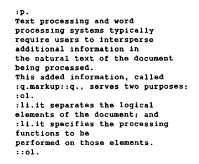

최근에 면접을 보며 블로그 이야기를 꺼낼 일이 몇 번 있었다. 그래서 요즘은 인기가 급격히 떨어진 민속놀이 "코드 읽기"를 오랜만에 해보았다. 그러던 중 문득 궁금해진 게 있어서 최대한 끝까지 파고들어 본 후 기록을 남긴다. 실질적인 효용은 적지만 나는 그런 게 재밌더라.

# 시작

블로그에서 이런 컴포넌트가 눈에 띄었다. 목차를 나타내는 컴포넌트이며 목차도 일종의 목록이기에 `<ul>`을 쓴 걸 볼 수 있다.[^1]

```tsx
function TableOfContents({ nodes }: { nodes: TocEntry[] }) {
  return (
    <ul>
      {nodes.map((node) => (
        <li key={node.url}>
          <a href={node.url}>{node.title}</a>
        </li>
      ))}
    </ul>
  );
}
```

여기서뿐 아니라 목록을 나타내야 할 경우 나는 보통 `<ul>`을 써왔다. 그런데 오랜만에 보니 의문이 들었다. 왜 `<ul>`을 습관적으로 썼을까?

목록을 나타내는 태그는 `<ol>`도 있다. 나도 알고 있었다. 하지만 써본 기억이 거의 없다. 더 인지도가 낮은 `<dl>`과 같은 태그들은 몇 번 썼음에도 `<ol>`은 거의 사용하지 않았다. 실토하자면 언제 써야 할지도 헷갈리고 있었다. 이 글은 거기서 이상함을 느껴 시작되었다.

# 목록의 순서에 관한 의문

어째서 나는 `<ol>`을 쓸 생각을 거의 하지 못했을까? 내가 아는 것에서부터 생각을 이어나갔다.

`<ul>` 요소는 순서가 중요하지 않은 목록을 나타내고 `<ol>` 요소는 순서가 있는 목록을 나타낸다. 애초에 태그 이름부터가 'unordered list'와 'ordered list'의 줄임말이니까 말 그대로다.

그런데 순서가 있다는 게 대체 무슨 뜻일까? 순서가 있는 목록, `<ol>`을 쓸 만한 좋은 예시로는 요리법이 있겠다.[^2] 요리법의 순서는 보기 편하라고 정렬해 놓은 게 아니라 그 자체가 하나의 정보다.

```html
<h1>치킨난반 만들기</h1>
<ol>
    <li>닭다리살의 두꺼운 부분을 펴고 소금과 후추로 밑간한다.</li>
    <li>닭다리살에 밀가루를 얇게 묻힌 뒤 풀어둔 달걀에 담근다.</li>
    <li>...</li>
</ol>
```

물론 이렇게 순서가 중요한 목록의 예시를 들자면 많다. 설명서, 랭킹 등등.

하지만 나는 프론트 개발을 해오며 누가 봐도 명확하게 순서를 강조해야 하는 목록을 마주칠 일이 많지 않았다. `<ol>`을 쓸까 하다가도 딱히 순서가 엄청 중요하지는 않으니 `<ul>`을 써야겠다는 결정을 한 기억만 몇 번 있다. 거기서 2가지의 의문이 시작되었다.

- 대체 어떤 목록이 '순서가 필요한 목록'인가?

화면에 나타나는 목록 대부분은 어떤 식으로든 순서가 있다. 완전히 순서가 없는 목록이 더 흔치 않다. 가령 이 블로그의 게시글은 최신순이고 내 폰의 연락처 목록은 이름 가나다순이다. 그럼 이들은 순서가 있는 건가? 하지만 조회수순으로 게시글을 정렬하거나 연락 많이 하는 순으로 연락처를 정렬한다고 문제가 생기는 건 아니다. 그럼 순서가 필요한 목록의 기준은 뭔가?

- `<ol>`을 썼을 때 이점이 있나?

내가 `<ol>`을 처음 배울 때는 `<ol>`을 쓰면 내부 `<li>` 항목들에 자동으로 번호를 매겨줘서 나중에 목록 중간에 뭘 끼워넣을 때 편하다든지 하는 이야기를 들었다. 하지만 CSS로 떡칠을 하는 요즘 세상에 그게 실질적인 이점이라고 하기는 어렵다. 그럼 순서가 중요한 목록에 `<ol>`을 썼을 때 뭐가 좋은가?

# 실무적인 결론

항목의 순서를 바꿨을 때 목록의 의미도 달라진다면 `<ol>`을 사용한다. 그렇지 않다면 `<ul>`을 사용한다. MDN 문서, [HTML 표준](https://html.spec.whatwg.org/dev/grouping-content.html#the-ol-element) 등이 이를 뒷받침한다.

또한 `<ol>`을 썼을 때 생기는 큰 이점은 없다. 굳이 따지자면 `<ol>`에는 `reversed`, `start` 등 순서의 의미 표현에 도움이 되는 몇 가지 속성들이 있어 좀더 의미있는 코드를 짤 수 있다는 정도? 하지만 그런 속성들은 거의 잊혀졌다. 또 `<ol>`을 의미에 맞게 쓴다고 해서 SEO에 막대한 영향을 준다고 보기도 어렵다.

따라서 오늘날 개발을 할 때는 '이 목록 순서를 바꾸면 목록에 문제가 생기는가?' 정도만 잠깐 고민하고 결정하면 그만이라고 생각한다. 내가 지금까지 `<ul>`을 목록 태그의 기본값처럼 사용한 것도 아주 이상한 건 아니었다고 본다. 실제 웹에서도 `<ul>`이 `<ol>`보다 훨씬 많이 사용된다.[^3]

# 쓸데없는 탐구 시작

하지만 조사하면서 뭔가 손에 잡히는 느낌이 들지 않았다. 오늘날에는 위의 구분법을 써야 하는 게 확실하지만, 찾아낸 과거 자료들이 미묘하게 서로 엇나가는 경우들이 있었기 때문이다.

> 목록의 표현은 여기서 정의하지 않는다. 하지만 순서 없는 목록에는 bulleted list, 순서가 매겨진 목록은 번호 달린 문단의 나열이 꽤 적절할 것이다.
>
> W3C의 역사 문서, HTML Tags, 1992. 11[^4]

> `OL` 요소를 이용해 만들어지는 ordered list는 요리법과 같이 순서가 강조되어야 하는 정보를 포함해야 한다.
>
> HTML 4 명세, 10. Lists[^5]

이외에도 `<ol>`은 정렬된(sorted) 목록이라는 의미가 아니라거나, 두 개의 구분을 명확하게 표현하기 힘든 브라우저에서는 `<ul>`과 `<ol>`을 똑같이 구현해도 된다는 등의 내용들을 오래전 문서에서 많이 찾았다. 아예 `<ol>`이 필요하냐는 의문 제기도 있었다.

그래서 궁금해졌다. 이런 목록 태그 구분은 어쩌다 생겼을까? 또 `<ul>`과 `<ol>`의 차이에 대한 자료들이 서로 약간씩 다른 이유는 뭘까? 먼저 정리를 한다면 이렇다.

HTML은 이름(HyperText Markup Language)답게 마크업 언어의 일종이다. 마크업은 문서 조판에서 시작했지만 이내 문서를 제목, 목록처럼 문서의 의미 구조 기반으로 구성하려는 노력으로 흘러갔다. 그 속에서 `OL`, `UL` 등 목록 요소가 생겼고 이후 SGML로도 이어졌다.

팀 버너스 리가 HTML을 만들 때도 당시 사람들에게 익숙했던 SGML이라는 언어의 문법을 상당히 받아들였다. 그렇게 `<ol>`, `<ul>`도 HTML의 일부가 되었다. 그러나 처음에는 그 둘의 용도를 구분하는 기준이 오늘날처럼 명확하지 않았다. HTML5에 이르러서야 "순서를 바꾸었을 때 문서의 의미가 달라지는가"라는 기준이 명세에 들어갔다.

이렇게 요약할 수 있겠지만 이대로 끝내기엔 자료 조사한 게 아까워서 조금 더 풀어본다.

# 조판에서 마크업까지

[JS 탐구생활 - 클로저 시리즈 2. 수학자들의 꿈에서 JS의 스타가 되기까지](https://witch.work/ko/posts/javascript-closure-deep-dive-history)처럼 HTML이 나오기까지의 모든 과정을 하나하나 섹션으로 삼아서 자세히 적을까 했다. 그러나 그렇게 하면 글도 지루해지고 나도 괴로울 게 보여서 적당히 요약한다.

마크업은 원래 인쇄에서 쓰던 말이다. 편집자가 원고에 "여기는 굵은 글씨로"와 같은 표시를 남기면 식자공(typesetter)이 그걸 보고 책을 만드는 일을 수행했다.[^6]

컴퓨터 조판이 시작되면서 이게 그대로 명령어로 만들어졌다. 예를 들어 가운데 정렬로 인쇄하도록 하고 싶으면 `.center`라는 명령을 쓰는 식이었다. 1960년대의 RUNOFF라는 프로그램이 시초 중 하나였고 이후 유닉스 메뉴얼을 작성하는 데에도 쓰인 roff 등으로 이어졌다. 핵심은 텍스트가 어떤 의미를 가지는지가 아니라 어떤 서식으로 인쇄될지를 명령했다는 것이다.[^7] 오늘날로 치면 TeX와 비슷한 방식이다.

그런데 절차적인 조판 언어는 여러 가지 문제가 있었다.

첫째로 정보가 손실된다. 다른 내용보다 글씨가 크고 굵거나, 가운데 정렬이 되어 있다면 사람은 보통 그게 제목이거나 좀더 중요한 내용이라는 걸 직관적으로 안다. 하지만 조판 시점에는 그저 "이 부분을 굵게" 혹은 "가운데 정렬"이라는 정보만 남아 있게 된다. 그러면 어떤 게 제목이고 어떤 게 중요한지 구조와 의미를 읽을 수 있는 단서가 없어진다. 원본 문서에는 있었던 정보가 조판으로 옮겨지면서 사라지는 것이다.

둘째로 문서가 특정 장치와 표현 방식에 종속된다. 당시에는 출력 장치나 방식이 여러 가지였기 때문에 이런 명령들을 절차적으로 처리하게 되면 한 종류의 장치에서밖에 쓸 수 없게 되었다. 이러한 종속이 일으키는 문제의 예를 들자면 초안은 저렴한 출력 장치로 출력하고, 완성본은 비싼 장치에서 출력하는 식의 절약이 불가능해진다.

절차적인 조판 명령어들이 더 배우기 어렵다는 등 다른 문제들도 있었다.

그래서 1969년 절차적인 명령 대신 문서의 구조와 속성을 선언적으로 기술하는 GML(Generalized Markup Language)이 만들어진다. 1981년 IBM의 C. F. Goldfarb가 이를 논문으로 정리한다.[^8]

다음 사진과 같이 썼다. `:q` 같이 콜론 하나가 붙은 게 요소를 여는 기호였고, `::q` 처럼 콜론 2개가 붙으면 요소를 닫는 기호였다. `:p`, `:ol`, `:li` 등 오늘날의 HTML과 비슷한 것들도 있다. 당시 `:q`는 quotation으로 오늘날의 `<blockquote>`와 비슷하겠다. 



이외에도 Scribe 등 선언적인 마크업을 정의하려는 다른 시도들도 있었다. 누가 처음이었는지는 여기서 중요하지 않고, 문서를 폰트 크기 등의 서식이 아니라 제목, 문단 등 의미를 가진 요소들로 나타내려는 변화가 시작되고 있었다는 게 중요하다.

또한 이때는 `:ol`과 같은 순서 있는 목록이 꽤 유용한 문법이었다. 당시에는 CSS도 없었고, 다양한 번호 지원이나 항목 추가 시 번호를 전부 바꿔야 하는 등의 일들이 실질적으로 필요했기 때문이다.

이후 SGML, [ODA](http://word.tta.or.kr/dictionary/dictionaryView.do?subject=open%20document%20architecture) 등 마크업에 대한 수많은 표준화 시도가 있었다. 그런 시기에 팀 버너스 리가 HTML과 웹을 설계하기 시작했다.

# HTML이라는 마크업 언어를 만들기까지

팀 버너스 리가 웹과 브라우저라는 걸 창조하며 마주한 선택들은 여러 가지였는데 그중에는 문서들을 어떻게 나타낼지도 있었다.[^9] 그리고 그는 선언적인 마크업, 그 중에서도 SGML을 쓰는 선택을 한다.

우선 선언적인 마크업을 쓴 건 절차적으로 문서를 표시하는 방식이 실질적으로 잘 동작하기 힘든 환경이었기 때문이다. 팀 버너스 리는 NeXT 컴퓨터(스티브 잡스가 애플에서 나와있을 당시 만든 그거 맞다)에서 첫 브라우저를 만들었지만 그 이외에도 수많은 환경과 컴퓨터 종류가 있었다. 텍스트만 출력하는 단말기와 거기서 쓰이던 line mode 브라우저가 대표적이다. 오늘날 이해하기로는 터미널에서 돌아가는 브라우저의 느낌으로 생각하면 된다.

굵은 글씨조차 표현하지 못하는 브라우저가 있는 상황에서 "이 글자는 굵게"로 제목을 표현한다는 건 불가능하다. 이외의 어떤 서식도 일관된 의미를 지니기 힘들었다. 그래서 "이건 제목이다" 처럼 요소들의 의미를 기술하고 어떻게 보여줄지는 브라우저에 맡기는 게 현실적인 선택이었다.

그리고 SGML을 택한 건 크게 2가지 이유가 있었는데 하나는 당시 표준화 시도 중이었던 여러 언어 중 SGML의 진영이 가장 크다고 팀 버너스 리가 판단했기 때문이고, 또 당시 팀이 속해 있던 CERN에서 이미 SGML을 쓰고 있었기 때문이다. 

> SGML은 CERN을 고려한 외교적 선택이기도 했다. SGML은 괄호 속에 일련의 특정한 태그들을 표시하는 방법으로 CERN의 IBM 컴퓨터에서 사용되고 있었기 때문에 HTML 역시 가능한 한 같은 태그를 사용했다. (...) 내가 이런 전략을 선택한 것은 CERN 고위층이 HTML의 괄호를 접하고 '그래, 이건 나도 할 수 있어'라고 느끼게끔 만들자는 것이었다.
>
> 팀 버너스 리 지음, 우종근 옮김, "월드와이드 웹", 71p

팀 버너스 리는 새로운 방식을 제안하는 입장이었으니, 기존 기기들에서 범용적으로 쓸 수 있고 원래부터 쓰던 형식과 비슷해서 사람들이 쉽게 받아들일 수 있는 선택지들을 골랐던 것이다. 그렇게 위 인용문에서 말하는 것처럼, HTML의 태그들도 대부분 CERN 내부에서 쓰던 SGML의 문법을 따른다.

`ul`, `ol`의 경우에도 그렇다. SGML은 태그 목록을 명시적으로 정의하는 게 아니라 태그를 정의하는 방법을 정하는 메타 언어라서, 목록 태그가 꼭 `ul`, `ol`일 필요는 없다. 실제 SGML 예시에도 `list` 태그를 이용하는 방식이 있다. 하지만 CERN 내부에서 사용하던 SGML 문법이 `ul`과 `ol`을 사용하고 있었고 그게 HTML에 그대로 들어왔다. 우리가 익히 알고 있는 꺾쇠 괄호로 태그를 감싸는 방식도 CERN의 SGML에서 왔다.

# HTML에서의 ol 태그 변천사

목록 태그인 `<ul>`, `<ol>`은 HTML 이전의 CERN SGML 문서에도 사용되었을 정도로 오래되었다. [현존하는 가장 초기 HTML 문서 중 하나인 1990년의 문서](https://www.w3.org/History/19921103-hypertext/hypertext/Conferences/ECHT90/)에도 해당 태그가 쓰인 게 보인다.

그러나 둘 중 `<ol>`은 한동안 찬밥 신세였다. 이에 대한 단서는 상당히 많이 남아 있다.

- [1991년 HTML 테스트 문서](https://www.w3.org/History/1991-WWW-NeXT/Implementation/Test/backup_of_test.html)에서는 `<ol>` 태그를 `<ul>`과 똑같이 표시한다는 서술이 있다.
- [1992년 1월 팀 버너스 리가 작성한 HTML 문서](https://ksi.cpsc.ucalgary.ca/archives/WWW-TALK/www-talk-1992.messages/0.html)에서는 `OL`이 현재 쓰이고 있지 않다고 적는다.
- [1992년 11월 3일의 HTML 태그 목록 문서](https://www.w3.org/History/19921103-hypertext/hypertext/WWW/MarkUp/Tags.html)에서도 목록 태그에 `UL`, `MENU` `DIR`밖에 없다. ordered list에 대한 언급은 있지만 `OL` 태그는 보이지 않는다.

이외에도 당시 문서와 메일링 리스트를 뒤져보면 `<ol>`의 설명 누락은 물론이고 관련된 건의와 질문들도 많이 남아 있다.

왜 그랬을까? 당시 컴퓨터 환경이 너무 다양해서 순서 있는 목록을 제대로 표현할 수 없는 브라우저가 있었던 건 사실이다.[^10] 그래픽 환경까지 제공하는 NeXT용 브라우저가 있었던 반면 텍스트만 표시 가능한 브라우저도 있었다. 팀 버너스 리가 직접 `ol`과 `ul`을 구별할 수 없는 프로그램에서는 둘을 똑같이 구현해도 된다고 했던 적도 있다.

그러나 그보다 직접적인 이유가 있었다. 초기 웹에서 번호가 매겨진 순서 있는 목록이 맡던 역할이 하이퍼링크에 의해 상당히 대체되었다는 데에 있었다. 적어도 팀 버너스 리는 그렇게 생각했다.

종이 문서에서는 "3번 항목을 보라"와 같이 번호와 순서를 이용해서 특정 항목을 참조하는 일이 흔하다. 하지만 HTML에는 링크가 있기 때문에 참조를 위해서는 그냥 링크를 걸면 된다는 논지였다.

다만 [해당 발언을 한 메일](https://lists.w3.org/Archives/Public/www-talk/1992NovDec/0072.html)에서 곧바로 `<ol>`을 남겨야 할 이유도 덧붙였다. 순서가 있는 목록과 여러 가지를 한 자리에 모아 놓은 것 사이에는 추상적인 차이가 있다는 이유였다. 그래서 `<ol>`은 HTML2 명세에 겨우 다시 들어갔다.

브라우저가 표현할 때는 `<ol>`과 `<ul>`이 같을 수도 있지만 문서의 구조 상에서는 둘이 갖는 의미와 정보가 다르다고 본 셈이다.

이 구분이 확실하게 자리잡지는 않았다. 1990년대의 메일링 리스트에는 ordered list가 표준이 맞냐거나, 대체 어떻게 구별해야 하냐는 질문 등이 여전히 많다.[^11] 브라우저 구현자 등 상당한 전문성을 가진 사람들도 이런 질문을 많이 남겼다. 둘의 의미 차이가 있기에 HTML에서 구별되었지만 실제 구현과 관련 생태계에서는 그 차이가 여전히 희미했다는 것이다.

둘의 구분이 아무 의미가 없었다기보다는, 기존 마크업에서 물려받은 `<ul>`과 `<ol>`의 구분이 웹이라는 새로운 환경에서 다시 해석되고 웹에서의 고유한 필요성과 기준을 정립해나가는 시기였다고 본다.

어쨌든 이런 과도기를 거쳐 HTML 명세는 점차 이 차이를 구체적으로 설명하기 시작한다. HTML4 명세에서는 `<ol>`이 순서가 중요한 목록이라고 하며 요리법이라는 예시까지 제시한다. HTML5에서도 이 구분에 대한 논의는 반복된다. 순서가 중요한 것의 기준이 모호하다는 것이다. 예를 들어 대화문은 순서가 중요하지만 그건 문서 속 다른 문단의 순서도 마찬가지이며 대화의 순서가 목록 자체에서 특별히 강조해야 하는 건 아니라는 주장이었다.[^12]

이후 비슷한 의견이 이어지자 2008년 HTML5 명세에서 드디어 `<ol>`을 "순서가 바뀌면 문서의 의미도 달라지는 목록"으로 정의하게 되었다.[^13] 이게 지금 우리가 쉽게 찾아볼 수 있는 기준이다.

# 정리

찾아낸 자료들이 서로 조금씩 엇갈렸던 이유는 목록 태그에 대해 처음부터 지금과 같은 명확한 기준이 있었던 게 아니기 때문이다.

순서 있는 목록과 순서 없는 목록이라는 구분은 웹을 위해 설계된 게 아니었다. 이 HTML의 존재 자체가 문서 조판에서 시작해 GML, SGML과 CERN의 내부 상황을 거쳐 이어져온 것이다. 기존 형식에 익숙하던 사람들이 HTML을 받아들이도록 하기 위한 선택이었다. 그러나 목록 태그의 입장에선 그 의미와 구분 용도를 새로 찾아나가야 했다. 번호가 가진 역할 일부가 웹에서 중요성을 잃었기 때문이다.

그럼에도 `<ol>`은 그때그때의 이유로 어떻게든 살아남았다. 처음에는 항목들 사이에 순서가 있다는 것 자체가 의미있는 정보일 수 있다는 이유였다. 이후에도 목록을 굳이 `<ul>`과 `<ol>`로 구분해야 하냐, `<list>`로 통합하고 attribute를 통해 순서 여부를 구분하자는 등 개편에 대한 건의가 간간이 있었다. 그러나 내가 찾아본 범위 내에서는 전부 거부되었다. "그러한 개편을 통해 추가적으로 해결하는 문제가 없다"는 게 이유였다. 이런 표준은 하위 호환성을 중시하기 때문에 breaking change를 만드는 건 불가능에 가까웠으리라고도 개인적으로 생각한다.

아무튼 기존 요소들은 그대로 남았고 대신 두 요소를 언제 구분해서 사용할지가 점점 구체적으로 개선되었다. HTML5에 이르자 현재 쓰이는 것과 같은 기준으로 정리되었다.

> `<ol>`은 목록의 순서를 변경하면 목록의 의미 또한 변경된다는 것을 내포한다. 반면 `<ul>` 목록의 순서는 단순히 미적인 것이다.[^14]

물론 아주 엄밀한 정의는 아니라서 여전히 감으로 판단해야 하는 부분은 남아 있다. 예를 들어 일반적인 글 또한 문단의 목록으로 볼 수 있고, 문단의 순서를 바꾸면 글의 의미도 변경될 수 있다.

이에 대해서는 HTML 표준 작성자가 말한 기준을 생각하는 게 도움이 될 걸로 보인다. 어떤 항목들의 나열로 쓰는 게 자연스럽다면 목록 태그를 사용하며, 숫자를 붙여 읽는 게 자연스럽다고 보이면 `<ol>`, bullet point를 붙여 쓰는 게 자연스럽다고 보이면 `<ul>`을 사용하라는 것이다.[^15]

그리고 `<ol>`을 썼을 때의 이점이라면 CSS, JS가 동작하지 않는 상황에서 기본 HTML로 폴백되었을 때에도 순서가 보인다는 정도 이상으로는 찾지 못했다.

결국 이러한 기준으로 블로그에 있는 목록 중 몇 개를 `<ol>`로 바꿨다. 암묵적인 번호가 붙은 것들은 `<ol>`로 바꾸고, 최신순 게시글 등은 특정한 순서로 정렬되어 있지만 그 순서 자체가 목록의 의미는 아니라고 봐서 `<ul>`로 유지했다. 위에서 예시로 들었던 목차는 `<ol>`로 바뀌었다.

생각보다 바꿀 게 많지는 않았다. 이전에 내가 일하며 다뤘던 목록들도 돌아봤지만 순서 자체가 목록의 의미였던 경우는 거의 없었다. 아마 이렇게 용도가 상대적으로 적다 보니 나도 `<ul>`을 거의 기본값처럼 사용해 왔던 것 같다.

처음에는 왜 내가 `<ol>`을 많이 써본 적 없는지 스스로 의문을 가졌다. 물론 `<em>` 등 잘 쓰이지 않는 태그는 많지만 `<ol>`은 상당히 유명하기 때문이다. 그런데 조사하면서 목록의 순서에 대한 기준이 자료마다 말하는 게 달랐고 그게 더 큰 의문을 불렀다. 그래서 찾다 보니 HTML에서 초기 웹과 SGML, 조판까지 가버렸다.

물론 실용적으로는 명세의 몇 줄만 읽었으면 끝났을지도 모를 일이지만 나는 역시 이런 맥락의 탐구가 재밌다..

# 참고

Dr. C. F. Goldfarb, "A Generalized Approach to Document Markup"

History of the Web, Oxford Brookes University 2002

https://www.w3c.it/education/2012/upra/documents/origins.pdf

팀 버너스리 지음, 우종근 옮김, "월드와이드 웹"

## HTML 관련 공식 문서

RFC 1866, Hypertext Markup Language - 2.0

https://www.rfc-editor.org/rfc/rfc1866.html

HTML Living Standard, (2026.9.17 기준)

https://html.spec.whatwg.org/multipage/

HTML 4 standard, 10 Lists

https://www.w3.org/TR/html4/struct/lists.html

HTML 초기의 HTML Tags 문서

https://www.w3.org/History/19921103-hypertext/hypertext/WWW/MarkUp/Tags.html

WWW 메일링 리스트, Re: A few questions about sgml

https://lists.w3.org/Archives/Public/www-talk/1992SepOct/0000.html

Re: Is there a paper which describes the www protocol?

https://ksi.cpsc.ucalgary.ca/archives/WWW-TALK/www-talk-1992.messages/0.html

Re: HTML DTD issues

https://lists.w3.org/Archives/Public/www-talk/1992NovDec/0072.html

The World Wide Web: Past, Present and Future 

https://www.w3.org/People/Berners-Lee/9610-IEEE-Computer.html

A Complete Set of Constructs

https://www.w3.org/History/19921103-hypertext/hypertext/WWW/MarkUp/Connolly/complete.html

`[whatwg] <ol> semantics (and dialogue)`

https://lists.whatwg.org/pipermail/whatwg-whatwg.org/2006-October/049621.html

Suggest making <dt> and <dd> valid in <ol>

https://lists.whatwg.org/pipermail/whatwg-whatwg.org/2012-July/078902.html

several messages about <ol>, <ul>, <dl>, and related subjects

https://lists.w3.org/Archives/Public/public-whatwg-archive/2008Feb/0211.html

Proposal: List attributes-- <UL>, <OL>, <LI>

https://lists.w3.org/Archives/Public/www-html/1996May/0366.html

Re: ol, ul, nl, dl, oh my!

https://lists.w3.org/Archives/Public/www-html/2005Jun/0020

[html5] the limit of lists?

https://lists.whatwg.org/pipermail/help-whatwg.org/2014-September/004027.html

Re: Questions and comments

https://lists.w3.org/Archives/Public/www-talk/1992NovDec/0121.html

## 웹 문서

MDN `<ul>` 문서

https://developer.mozilla.org/ko/docs/Web/HTML/Reference/Elements/ul

MDN `<ol>` 문서

https://developer.mozilla.org/ko/docs/Web/HTML/Reference/Elements/ol

Web platform project, HTML lists

https://webplatform.github.io/docs/guides/html_lists/

The difference between ul and ol elements in HTML

https://www.jkorpela.fi/HTML/ul-ol.html

Information Management: A Proposal. 팀 버너스 리가 처음 CERN에 제안한 문서

https://www.w3.org/History/1989/proposal.html

A history of HTML: 목록 태그 이외에도 HTML 관련 이야기들을 많이 제공한다.

https://www.w3.org/People/Raggett/book4/ch02.html

Brief History of Document Markup

https://chnm.gmu.edu/digitalhistory/links/cached/chapter3/link3.19a.documentmarkup.html

A Brief History of the Development of SGML

https://www.w3c.it/talks/2012/lpw/historySGML.html

Ordered vs Unordered List

https://talk.commonmark.org/t/ordered-vs-unordered-list/1945


[^1]: 실제로는 재귀적인 구조와 데이터 필터링도 붙어 있는 조금 더 복잡한 컴포넌트다. 정말로 이게 전부였다면 컴포넌트로 분리를 하지 않았을 것이다. 여기서 중요한 건 목록을 나타내는 컴포넌트라는 사실이고, 예시를 위해 필요한 부분만 남겼음을 감안하자.

[^2]: HTML4 공식 명세에서도 요리법(원문은 recipe)을 "순서가 강조되어야 하는 정보"로 `<ol>`을 쓸 만한 예시로 든다. https://www.w3.org/TR/html4/struct/lists.html

[^3]: 태그 사용량 통계 https://almanac.httparchive.org/en/2024/markup#top-elements

[^4]: https://www.w3.org/History/19921103-hypertext/hypertext/WWW/MarkUp/Tags.html

[^5]: https://www.w3.org/TR/html401/struct/lists.html

[^6]: https://chnm.gmu.edu/digitalhistory/links/cached/chapter3/link3.19a.documentmarkup.html

[^7]: 초기 컴퓨터 조판 프로그램이 만들어지던 시절 이야기는 [Man의 계보](https://witch.work/ko/translations/the-lineage-of-man), 도서 "유닉스의 탄생" 등에서 더 접할 수 있다.

[^8]: Dr. C. F. Goldfarb, "A Generalized Approach to Document Markup"

[^9]: 어떤 다른 배경과 선택들이 있었는지는 팀 버너스 리가 직접 쓴 책 "월드와이드 웹"을 참고할 수 있다.

[^10]: "I suggest everyone  implement OL as UL in programs which, like the line mode browser, can't differentiate."라고 팀 버너스 리가 언급한 적도 있다. https://lists.w3.org/Archives/Public/www-talk/1992NovDec/0072.html

[^11]: [Re: HTML todo list](https://ksi.cpsc.ucalgary.ca/archives/WWW-TALK/www-talk-1993q1.messages/64.html), [Re: Questions and comments](https://lists.w3.org/Archives/Public/www-talk/1992NovDec/0121.html) 등

[^12]: https://lists.whatwg.org/pipermail/whatwg-whatwg.org/2006-October/049621.html

[^13]: https://lists.w3.org/Archives/Public/public-whatwg-archive/2008Feb/0211.html

[^14]: https://lists.whatwg.org/pipermail/whatwg-whatwg.org/2012-July/078902.html

[^15]: https://lists.whatwg.org/pipermail/help-whatwg.org/2014-September/004027.html