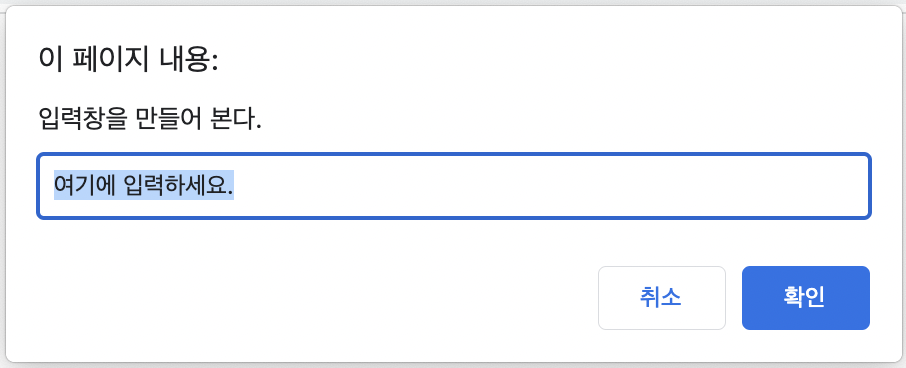

[모던 자바스크립트 튜토리얼](https://ko.javascript.info/)을 정리한다.

# 1. 변수와 상수

변수는 데이터를 저장하는 공간이다. `let`키워드를 이용하여 생성한다.

```js
let a;
```

`=`로 할당할 수 있고 이렇게 할당한 데이터에는 변수명을 통해 접근 가능하다.

이전에는 `var`키워드를 사용해서 변수를 선언했지만 `let`키워드를 사용하는 것이 좋다. `var`의 차이는 나중에 따로 설명한다.

단 엄격 모드가 적용중이지 않다면 `let`없이도 값 할당을 통해 변수를 생성할 수 있다.

```js
a = 5;
```

단 위 코드는 엄격 모드에선 에러를 발생시키므로 주의한다.

## 1.1 변수명

변수명은 문자, 숫자, `$`, `_`로 구성할 수 있다. 그리고 숫자로 시작할 수 없다. 특이한 점으로 `$` 기호를 쓸 수 있다는 것을 기억해 두자. 이 `$`기호는 인터프리터에게 어떤 의미를 갖는 것은 아니지만 흔히 제이쿼리 객체나 앵귤러 프레임워크 변수 등 특별한 의미를 갖는 변수명에 사용될 때가 있다.

## 1.2 상수

상수는 한번 할당하면 값을 변경할 수 없는 변수이다. `const`키워드를 사용하여 생성한다.

단 이는 절대로 거기 담긴 값을 변경할 수 없다는 게 아니라 변수가 가리키고 있는 참조를 변경할 수 없다는 의미임에 주의한다.

이때 매직 넘버를 지정해 주는 상수 변수의 경우 대문자로 변수명을 쓰는 컨벤션이 있다. 다음과 같이.

```js
const MAX_COUNT = 5;
```

# 2. 자료형

JS는 동적 타이핑 언어이다. 즉 변수에 할당된 값에 따라 변수의 자료형이 결정된다. 하지만 그렇다고 자료형이 존재하지 않는 건 아니다. JS는 총 8가지의 기본 자료형이 있다.

## 2.1. 숫자형

정수 및 부동소수점을 나타낸다. 또한 `Infinity`, `-Infinity`, `NaN`과 같은 특수 숫자값도 존재한다.

이 숫자형은 $2^53 -1$ 범위를 가진 정수까지 나타낼 수 있다. 그리고 그 이상의 큰 숫자를 표현하기 위한 BigInt형이 있는데 이건 정수 리터럴 끝에 `n`을 붙여 표현한다.

```js
const bigInt = 1234567890123456789012345678901234567890n;
```

## 2.2. 문자형

문자열을 나타낸다. 큰따옴표나 작은따옴표로 감싸서 표현한다.

또 다른 방식으로는 백틱을 쓰는 것이 있다. 이 백틱으로 싸인 문자열은 템플릿 리터럴이라고 하며 여러 줄 문자열과 문자 보간을 사용할 수 있다.

변수나 표현식을 `${}`로 감싸서 문자열 안에 넣으면 된다.

```js
alert(`my number is ${5 + 10}`);
```

이 템플릿 리터럴에 관한 더 많은 내용은 [여기](https://www.witch.work/javascript-template-literal/)에 정리하였다.

char타입은 js에 없다. 문자열 뿐이다.

## 2.3. 부울형

boolean 타입은 true, false 두 가지 값만을 가진다.

## 2.4. null

null 타입은 값이 없음을 나타내며 앞의 어떤 자료형에도 속하지 않는다. null 타입의 변수는 null 값만을 가질 수 있다.

또한 다른 언어에서는 null을 0이나 빈 문자열로 취급하지만 js에서의 null은 존재하지 않거나 비어 있는 값, 알 수 없는(unknown) 값을 나타낸다.

## 2.5. undefined

undefined 타입의 변수는 undefined 값만을 가질 수 있다. 이는 값이 아직 할당되지 않은 상태를 나타낸다. 예를 들어 변수를 선언하고 할당하지 않으면 undefined가 할당된다.

```js
let a;
console.log(a); // undefined 출력
```

## 2.6 객체, 심볼

객체는 여러 값을 하나의 단위로 구성한 복합적인 자료구조이다. 객체를 사용하여 좀더 복잡한 데이터 구조를 표현할 수 있다. 

심볼은 객체의 고유한 식별자를 만들 때 사용한다. 이 둘은 이후에 자세히 다룰 것이다.

## 2.7 typeof

typeof 연산자는 피연산자의 자료형을 반환한다. `typeof x`와 같이 연산자 형태로 쓰거나 `typeof(x)`와 같이 함수 형태로 쓸 수 있다. 여기서는 기억해 두어야 할 부분만 알아보겠다.

```js
typeof(null); // object

function add(a, b) {
  return a + b;
}
console.log(typeof add); // function
```

먼저 null은 object 형으로 출력된다. 이는 ECMA 문서에도 그렇게 하라고 나와 있다. 이는 JS의 버그로 여겨지고 있지만 이를 고치는 것은 호환성을 해칠 수 있기 때문에 고치지 않는다. 그 이유에 대해서는 다음 문단에서 간단히 설명하겠다.

그리고 js에서 함수는 일급 객체이지만 typeof를 함수에 적용하면 function이라는 문자열을 반환한다. 함수 타입이라는 건 js에 존재하지 않으므로 이상한 방식이지만 오래전의 규칙이기 때문에 이렇게 동작한다. 이때 함수도 객체인데 어떻게 구분해서 function 타입으로 알려주는지에 대해서는 [여기](https://www.howdy-mj.me/javascript/why-does-typeof-function-return-function)에 잘 정리되어 있었다.

## 2.8. typeof(null)의 이유

아주 오래 전 js의 첫 버전이 나올 때, 값은 32비트 워드에 저장되었다. 그런데 이 32비트를 온전히 값 저장에만 쓰지 않았다. 하위의 몇 비트를 타입을 나타내는 type tag에 할애하였고 나머지를 진짜 값을 저장하는 데에 사용했다. 다음과 같은 타입 태그가 있었다.

| 타입      | 태그  |
| ------- | --- |
| object  | 000 |
| integer | 1   |
| double  | 010 |
| string  | 100 |
| boolean | 110 |

typeof 연산자는 위와 같이 하위 태그를 통해 각 값의 타입을 구분하였다.

그런데 특별한 2가지 값이 있었다. 그게 바로 null과 undefined였다. 이때 undefined는 $-2^30$ 값을 갖는 `JSVAL_VOID`로 정의하였고 null은 널 포인터를 나타내는 값 `JSVAL_NULL`로 정의하였다.

그런데 널 포인터 값은 0이므로 당연히 하위 비트가 000이 되었고 따라서 typeof연산자는 null을 object로 판단하게 되었다.

# 3. 브라우저와 간단한 상호작용

## 3.1. alert

alert 함수는 브라우저에서 경고창을 띄워주는 함수이다. 인자로 받은 문자열을 경고창에 띄워주며, 경고창은 사용자가 확인 버튼을 누르면 사라진다.

```js
alert("저는 김성현입니다.");
```

## 3.2. prompt

prompt는 2개의 인수를 받아서 브라우저에 입력창을 띄운다. 첫번째 인수는 입력창에 표시될 문자열이고, 두번째 인수는 입력창에 기본으로 표시될 문자열이다. 두번째 인수는 없어도 된다.
사용자가 입력창에 입력한 값을 반환한다.

사용자가 확인을 누르면 사용자가 입력한 값이 prompt의 반환값으로 들어간다. 그리고 취소나 ESC키를 누르면 prompt의 값으로 null이 들어간다. 다음과 같은 코드를 보자.

```js
let result = prompt("입력창을 만들어 본다.", "여기에 입력하세요.");
alert(result);
```

이 코드를 실행시키면 다음과 같은 입력창이 뜬다.



여기에 `김성현`을 입력한 후 확인 버튼을 누르면 다음과 같이 김성현이라고 적힌 경고창이 뜨게 된다.


만약 취소를 눌렀다면 null이 적힌 경고창이 뜨게 된다.

이때 주의할 점은, IE의 경우 prompt의 두번째 인수가 없을 경우 undefined를 두번째 인수로 자동으로 넣어 주는 동작을 한다는 것이다. 그래서 IE를 고려한다면 prompt의 두번째 인수를 생략하면 안 된다. 빈 문자열이라도 넣어주자.

## 3.3. confirm

confirm은 인수로 받은 질문과 함꼐 사용자에게 확인 또는 취소를 묻는 창을 띄워준다. 사용자가 확인을 누르면 true, 취소를 누르면 false를 반환한다.

```js
let result = confirm("당신이 김성현인가요?");
alert(result);
```

위처럼 쓸 수 있다. 컨펌 창에서 사용자의 선택에 따라 true 혹은 false가 적힌 alert창이 뜬다. 단순히 경고창에 결과를 띄워 주는 것만이 아니라 사용자의 선택에 따라 어떤 동작을 취하게 하는 데에 사용할 수 있다.

## 3.4. 제약사항

위 함수들은 모두 모달 창을 띄운다. 이 모달이 떠있는 동안은 스크립트 실행이 일시 중단되고 사용자가 나머지 페이지가 상호작용이 불가능하게 된다.

또한 이 함수들의 모달 창 위치와 모양은 브라우저에서 알아서 결정하며 개발자는 이를 제어할 수 없다. 간결성을 위한 대가이다.

# 4. 형변환

원시 타입의 형변환에 대해서만 다룬다. 객체 타입의 형변환은 나중에 다룰 예정이다.

## 4.1. 문자형으로의 변환

String 함수를 사용하면 어떤 값을 문자형으로 변환할 수 있다.

```js
let booleanValue = true;
console.log(typeof booleanValue);
let StringValue = String(booleanValue);
console.log(typeof StringValue); // 문자열로 변환되어 string을 출력한다.
```

또한 문자열 타입을 기대하는 곳에 다른 타입이 오면 자동으로 문자열로 변환된다. 예를 들어서 alert는 인수로 받은 값을 문자열로 변환하여 출력한다. 그리고 문자열과 다른 타입의 덧셈에서 다른 타입은 문자열로 변환된다.

```js
console.log(10 + "문자열"); 
//10이 문자열로 변환되어 처리되어서 10문자열 이라고 출력된다.
```

## 4.2. 숫자형으로 변환

위와 마찬가지로 숫자형으로 변환하는 방법은 Number 함수를 사용하는 것이다.`Number(target)`과 같이 사용한다.

또한 숫자로의 형변환은 수학과 관련된 함수나 표현식에서 자동으로 일어난다. 숫자가 기대되는 곳에 다른 타입의 값이 오면 자동으로 숫자형으로 변환되는 것이다. 만약 숫자가 아닌 값을 숫자로 변환하려고 하면 NaN이 된다.

예를 들어서 뺄셈에는 숫자만 오기 때문에 뺄셈에 문자열이 오면 자동으로 숫자형으로 변환된다.

```js
console.log(10 - "5");
//"5"가 5로 변환되어 결과는 5가 된다.
```

단 문자열을 숫자로 변환할 때는 숫자로 변환할 수 없는 문자가 포함되어 있으면 NaN이 된다.

```js
console.log(10 - "김성현"); //NaN
```

숫자형으로 변환하는 규칙은 다음과 같다.

- undefined는 NaN이 된다.
- null은 0이 된다.
- true나 false는 1 혹은 0이 된다.
- 문자열은 처음과 끝 공백이 제거되고 공백 제거 후 빈 문자열이 된다면 0이 된다. 공백을 제거한 문자열이 숫자로 변환될 수 있으면 숫자로 변환한다. 그게 실패하면 NaN이 된다.

## 4.3. 불린 형으로의 변환

불린형을 요구하는 연산에 쓰일 때 자동으로 불린형으로 변환된다. 또는 Boolean 함수를 사용해서 불린형으로 변환할 수 있다.

```js
console.log(Boolean(0)); //false
```

규칙은 간단하다. falsy한 값이면 false로 변환되고 나머지는 true로 변환된다.

falsy한 값은 숫자 0, -0, 0n, 빈 문자열, null, undefined, NaN이다.

<span style="color:red">빈 배열은 falsy한 값이 아님에 주의한다.</span>

# 5. 기본 연산자와 수학

## 5.1. 수학 연산자

수학 연산자는 +, -, *, /, %, **가 있다. %는 나머지 연산자이고 **는 거듭제곱 연산자이다. 알아둬야 할 건 거듭제곱 연산자는 정수가 아닌 숫자에 대해서도 동작한다는 것이다. `3**(1/2)`와 같은 것도 가능하다.

### 5.1.1. 나머지 연산자와 음수

나머지 연산자의 피연산자가 둘 모두 양수일 때는 명확하다. 5%3의 결과는 당연히 2일 것이다. 하지만 -5%-3은 어떨까? 실험해 보면 -2가 나오는 것을 알 수 있다.

이 나머지 연산자의 결과 부호는 항상 왼쪽 피연산자의 부호를 따르게 되어 있다.

```js
5%3 //2
5%-3 //2
-5%3 //-2
-5%-3 //-2
```

만약 나머지가 0이라도 왼쪽 피연산자가 음수라면 결과가 `-0`이 된다.

```js
-4 % -2 // -0
```

NaN의 나머지는 NaN이다. 또한 Infinity의 나머지도 NaN이다.

### 5.1.2. 연산자와 형변환

덧셈을 제외한 모든 수학 연산자는 오직 숫자형만 받는다. 따라서 덧셈 연산자가 아닌 수학 연산자의 피연산자가 숫자형이 아닌 경우 자동으로 숫자형으로 변환된다.

```js
10 - '3' //7
'10' / '3' //3.3333333333333335
```

또한 덧셈 연산자는 단항 연산자로도 쓰일 수 있다. 만약 숫자에 `+`를 붙이면 아무런 변화가 없다. 피연산자가 숫자형이 아니라면 숫자형으로 변환된다. `+`를 Number 함수 대신 숫자형 변환에 사용할 수도 있는 것이다.

```js
+"123" // 123
```

## 5.2. 할당 연산자

할당 연산자 `=`는 오른쪽 피연산자의 값을 왼쪽 피연산자에 할당한다. 그런데 덧셈 연산자가 값을 반환하듯이 이 할당 연산자 또한 값이 평가된다. 왼쪽 피연산자에 할당된 값을 반환하는 것이다.

```js
let a = 1;
let b = 2;
// c=2+3과 같다. 그리고 a엔 2가, b엔 3이 할당된다.
let c = (a = 2) + (b = 3);
console.log(a, b, c);
```

또한 체이닝을 이용해서 여러 변수를 한번에 할당할 수도 있다.

```js
a=b=c=3;
```

이렇게 할당 연산자의 평가를 이용하는 코드는 사용하지 않는 게 권장되기는 한다.

## 5.3. 복합 연산자

복합 연산자는 연산자와 할당 연산자를 결합한 것이다. 예를 들어 `+=`는 덧셈 연산자와 할당 연산자를 결합한 것이다.

## 5.4. 증감 연산자

++, --로 나타나는 증감 연산자는 피연산자의 크기를 1 증가/감소시킨다. 전위형, 후위형이 있다. C언어에서와 같이 전위형은 피연산자의 값을 먼저 증가/감소시키고 사용하고, 후위형은 먼저 값을 사용하고 피연산자의 값을 나중에 증가/감소시킨다.

그리고 증감 연산자는 대부분의 연산자보다 우선순위가 높기 때문에 평가가 먼저 이루어진다.

## 5.5. 비트 연산자

비트를 다루는 연산자이다. &, |, ^, ~, `<<`, `>>`가 있다. 여기까지는 C언어와 같다. 그리고 부호 없는 오른쪽 시프트 연산자로 `>>>`가 있다. 이 연산자는 부호 비트를 0으로 채운다.

## 5.6. 쉼표 연산자

쉼표 연산자는 여러 표현식을 코드 한 줄에서 실행하고 평가할 수 있게 한다. 그리고 쉼표로 연결된 표현식 중 마지막 표현식의 평가 결과만 반환한다.

주의할 점은 쉼표 연산자는 우선순위가 낮기 때문에 제대로 사용하려면 괄호로 감싸 줘야 한다는 것이다.

```js
// (3,7) 중 마지막 것만 평가되어서 a는 5가 된다.
let a = (1,2,3,4,5);
```

가독성 때문에 권장되는 코드는 아니지만 여러 동작을 하나의 줄에서 처리하려는 구조에서 쉼표 연산자를 사용한다. 사용 예시는 다음과 같다.

```js
for(let l=0,r=0;r<s;l++,r++){
  if(left[l]!=right[r]){
    if(diff){p=0;break;}
    r--; diff++;
  }
}
```

# 6. 비교 연산자

JS에도 당연히 비교 연산자가 있다. C언어에 있는 것과 같은 기능을 하는 부등호와 같은지 나타내는 등호가 있다.

## 6.1. 평가값

비교 연산자 식은 그 결과에 따라 true 혹은 false로 평가된다. 예를 들어 `2>1`은 true로 평가된다.

## 6.2. 문자열 비교

JS에서 문자열은 사전순으로 비교된다. 사전 뒤쪽의 문자열이 더 크다고 판단되는 것이다. 이 비교 알고리즘은 문자열을 한 글자씩 비교하면서 같으면 넘어가고 다른 문자가 나오면 그걸 비교하여 결과를 반환한다. 그런데 이렇게 한 글자씩 비교하다가 문자열 둘 중 하나가 끝나버리면 길이가 더 긴 문자열이 크다고 판단된다.

이때 각 문자들은 사실 사전순으로가 아니라 유니코드 값으로 비교된다. 따라서 'a'가 'A'보다 크고 '가'가 'a'보다 크다. 유니코드 값이 더 크기 때문이다.

## 6.3. 다른 타입 비교

비교 연산자의 피연산자 자료형이 다르면 숫자형으로 변환된다. 예를 들어서 `'2'>1`과 같은 식을 평가한다면 문자열 '2'는 숫자형으로 변환되어 `2>1`과 같은 식이 될 것이고 당연히 결과값은 true이다. 다른 타입의 비교에 관한 자세한 글은 [여기](https://www.witch.work/javascript-compare-different-types/)로.

또한 이런 상황은 동등 연산자 `==`를 사용할 때도 벌어진다. JS에서 `0=='0'`이 true라는 건 널리 알려진 사실이다. 이는 ==가 비교할 때 숫자형으로 변환해서 비교하기 때문이다. 똑같은 이유로 `0==false`도 참이다.

이를 해결하기 위해서는 `===, !==`를 사용하면 된다. 이는 일치 연산자로 동등 연산자의 더 엄격한 버전이다. 자료형의 동등 여부까지 검사해 준다.

## 6.4 null과 undefined

비교 연산자가 null, undefined에 작용할 때는 어떻게 될까?

```js
null===undefined
```

위 식은 false를 반환한다. 두 값의 타입이 다르기 때문이다. 앞에서 살펴보았듯이 null은 널 타입이고 undefined는 undefined 하나로 이루어진 타입을 가진다.

```js
null==undefined
```

그런데 위 식은 true를 반환한다. `==`는 null, undefined에 특별한 규칙을 적용하여 둘이 동등하다고 판단한다. 이는 [명세서](https://262.ecma-international.org/5.1/#sec-11.9.3)에 나와 있는 부분이다.

```js
null > 0 //false
null < 0 //false
null >= 0 //true
null == 0 //false
```

null을 비교 연산자 >,<,>=,<=에 사용하면 0으로 변환되어 사용된다. 따라서 `null>0`은 `0>0`이 되어 false이고 `null>=0`은 `0>=0`이 되어 true가 되는 것이다.

그런데 `null==0`과 같이 `==`이 쓰일 때는 피연산자가 null일 때 형변환을 안한다. null을 `==`로 비교할 땐 다른 쪽이 null, undefined일 때만 결과가 true이고 나머지는 모두 결과가 false이다.

```js
undefined > 0 //false
undefined < 0 //false
```

undefined는 비교 연산자와 함께 쓰이면 NaN으로 변환된다. NaN이 피연산자로 쓰일 경우 비교 연산자는 무조건 false를 반환하게 되므로 위와 같은 결과가 나온다.

```js
undefined == 0 //false
```

undefined를 `==`로 비교하면 상대가 null, undefined일 때 true이고 나머지는 모두 false이다.

따라서 비교 연산자를 쓸 때 피연산자에 null이나 undefined가 들어갈 가능성이 있을 때 각별히 주의하자.

# 7. if와 삼항 연산자 ?:

JS에도 다른 언어와 마찬가지로 if 조건문이 있다. 이는 if()의 괄호 안의 조건식을 평가하고 그 평가값을 boolean으로 변환한 게 true이면 중괄호 내의 코드블록이 실행되는 방식으로 동작한다.

앞의 형변환에서 본 것과 같이 boolean으로 변환될 때 false로 변환되는 falsy value는 0, 빈 문자열, null, undefined, NaN밖에 없음을 기억하자.

```js
if(NaN){
    //이 블록은 절대 실행되지 않는다.
}
```

else, else if도 다른 언어와 똑같이 작동한다.

또한 삼항 연산자 `?:`도 C언어와 똑같은 기능을 한다. 하지만 가독성을 위해 매우 간단한 경우 외에는 if문을 사용하는 것이 권장된다.

# 8. 논리 연산자

논리 연산자에는 ||, &&, ! 이 있다. 각각의 기본적인 기능은 다른 언어들에서와 비슷하다. 

## 8.1. OR

OR 연산자 `||`는 두 피연산자 중 하나라도 true이면 그 연산식을 true로 평가한다. 다른 언어에서와 똑같다. 하지만 좀 다른 활용을 할 수 있다.

OR연산자는 피연산자를 왼쪽에서 오른쪽으로 평가하고, 피연산자 중 첫 번째 truthy value를 반환한다. 만약 피연산자가 모두 falsy이면 맨 마지막 피연산자를 반환한다. 이는 변수들 중 참인 값을 찾는 데에 사용될 수 있다.

```js
0 || "" || NaN // 모두 falsy이므로 마지막 피연산자 NaN 반환
null || "김성현" || "a" //피연산자 중 첫번째 truthy인 "김성현"반
```

또한 다른 언어에 있는 기능 중 short circuit 기능이 js에서도 지원된다. truthy 피연산자를 만나면 그 뒤의 연산자들은 평가하지 않는 것이다. 이는 왼쪽 조건이 falsy일 때만 어떤 명령을 실행하고자 할 때 쓸 수 있다.

```js
let me="Alex"
me==="Ben" || console.log("You are not Ben.")
```

간단한 예시지만 이름이 벤이 아니면 특정 메시지가 출력되도록 하는 코드이다.

## 8.2. AND

AND 연산자 `&&`는 두 피연산자 모두 truthy일 때 연산식이 truthy로 평가된다.

또한 위의 `||`과 같이 피연산자를 왼쪽에서 오른쪽으로 평가하는데 이때 첫번째 falsy value를 반환한다. 만약 모두 true이면 마지막 피연산자가 반환된다.

```js
1 && 2 && null && 3 //첫번째 falsy인 null 반환
```

이 또한 왼쪽 명령이 true일 때 어떤 명령을 실행하는 데에 쓸 수 있다.

```js
let me="Ben"
// me가 Ben일 때만 콘솔 로그가 찍힌다.
me==="Ben" && console.log("You are Ben!")
```

단 이런 AND, OR의 기능을 if대신 쓰는 건 가독성을 해치기 때문에 용도에 맞게 써야 한다.

## 8.3 우선순위

`&&`가 `||`보다 우선순위가 높다. 즉 `&&`가 먼저 평가된다.

따라서 `null || 2 && 3 || 4`와 같은 표현식이 있다면 `2 && 3`이 먼저 평가되어 `null || 3 || 4`가 되고 이 평가 결과는 3이 된다.

## 8.4 NOT

NOT 연산자 `!`은 말 그대로 피연산자를 bool로 변환한 후 그 역을 반환한다. 예를 들어 `!0`은 0을 boolean으로 변환하면 false가 되고 그 역이므로 `!0`은 true이다.

이 원리로 `!`을 2번 쓰면 피연산자를 불린으로 변환한 값의 역의 역을 반환하게 되므로 피연산자를 불린으로 변환한 값이 반환된다. Boolean 함수를 쓴 것과 같은 결과이다.

또한 NOT은 AND, OR보다 우선순위가 높기 때문에 가장 먼저 평가된다. NOT > AND > OR 순으로 우선순위가 높다(먼저 실행된다).

# 9. nullish ??

??는 왼쪽 피연산자가 null이나 undefined면 오른쪽 피연산자를 반환하고 그렇지 않으면 왼쪽 피연산자를 반환한다. 그리고 왼쪽에서 오른쪽으로 평가된다.

즉 피연산자 중 첫 번째로 정의된 값을 반환하는 것이다. 이것이 `||`와의 차이를 만든다. 예를 들어서 변수에 기본값을 할당하는 데에 `||`를 쓴다고 하자. 다음과 같이 말이다.

```js
let result=count || 1; 
```

만약 count가 falsy한 값이면 result에는 기본값 1이 할당될 것이다. 하지만 count가 지금 갖고 있는 어떤 물건의 개수라면 0도 충분히 의미있는 값으로 취급되어야 한다. 하지만 ||를 사용한다면 0은 falsy value로 취급되고 result에는 기본값 1이 들어가고 만다. 이럴 때 ??를 써야 한다.

```js
let count=0;
let result=count ?? 1;
console.log(result); // 0이 출력된다
```

`??`의 우선순위는 5로 대부분의 연산자보다 낮기 때문에 괄호와 함께 사용하는 게 좋다.

왼쪽 피연산자가 null이나 undefined가 아닌 게 판명되면 오른쪽 피연산자는 평가되지 않는 short circuit도 똑같이 작동한다.

그리고 주의할 점은 `??`와 `&&, ||`는 같이 쓰일 수 없다는 것이다. 만약 같이 쓰면 에러가 발생한다.

```js
true || undefined ?? "foo"; // SyntaxError 발생
```

단 괄호를 써서 우선순위를 명시적으로 나타내면 괜찮다. 

```js
true || (undefined ?? "foo") // 잘 동작하여 true 반
```

# 참고

[js에서 변수명에 쓰이는 달러 표시의 의미](https://stackoverflow.com/questions/846585/what-is-the-purpose-of-the-dollar-sign-in-javascript)

[MDN 템플릿 리터럴](https://developer.mozilla.org/ko/docs/Web/JavaScript/Reference/Template_literals)

[왜 js에서 null은 object인가?](https://stackoverflow.com/questions/18808226/why-is-typeof-null-object)와 [그 원본 글](https://2ality.com/2013/10/typeof-null.html)

[JS falsy value](https://developer.mozilla.org/ko/docs/Glossary/Falsy)

[나머지 연산자](https://developer.mozilla.org/ko/docs/Web/JavaScript/Reference/Operators/Remainder)

[Nullish coalescing operator - JavaScript | MDN](https://developer.mozilla.org/ko/docs/Web/JavaScript/Reference/Operators/Nullish_coalescing)