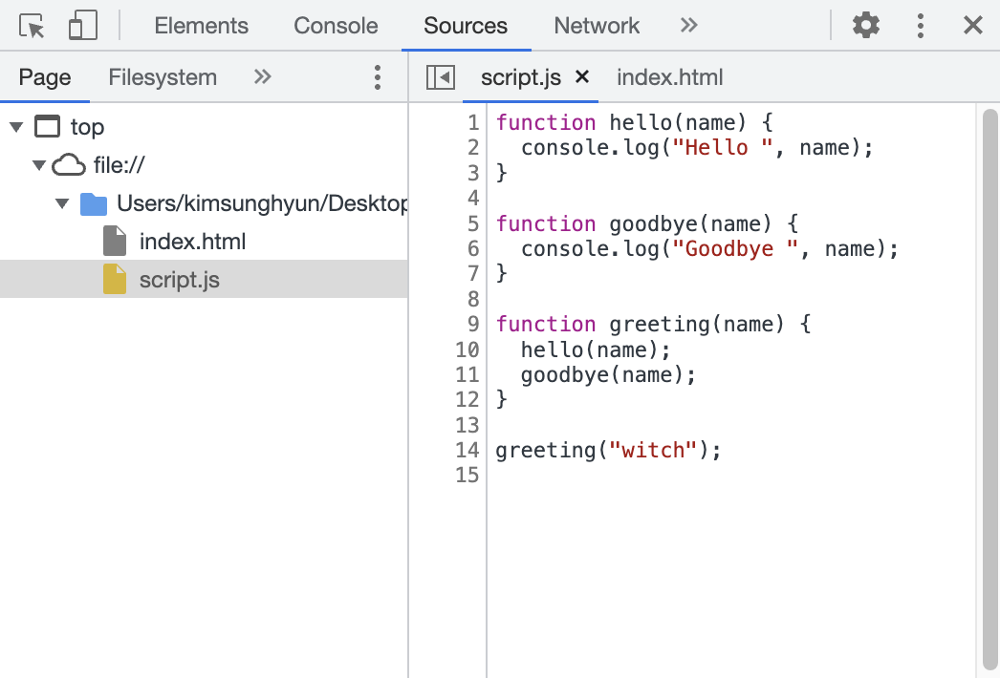
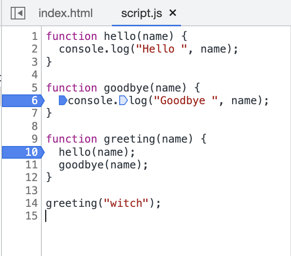
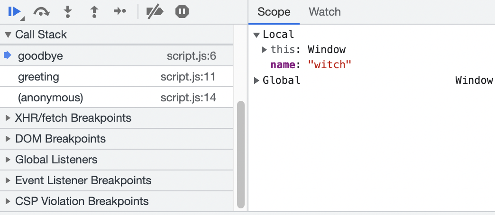
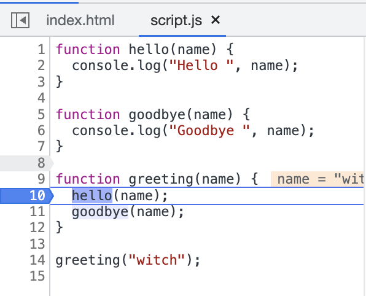

# 1. 크롬에서의 디버깅

크롬에서 `F12`를 누르거나 맥에서는 `Ctrl + Shift + I`를 누르면 개발자 도구가 열린다. 여기에는 Sources 패널이 있다. 이 패널에서는 로딩된 페이지의  코드를 보고 디버깅할 수 있다. 페이지를 구성하는 데 쓰인 모든 리소스를 트리 형태로 보여주고 그 소스도 볼 수 있게 해준다.

예시를 통해 알아보자. 먼저 index.html을 다음과 같이 작성한다. 

```html
<!DOCTYPE html>
<html>
  <head>
    <meta charset="utf-8" />
    <title>Study Page</title>
  </head>
  <body>
    <script src="./script.js"></script>
  </body>
</html>
```

그리고 script.js를 다음과 같이 간단한 코드로 작성해본다.

```js
function hello(name) {
  console.log("Hello ", name);
}

function goodbye(name) {
  console.log("Goodbye ", name);
}

function greeting(name) {
  hello(name);
  goodbye(name);
}

greeting("witch");
```

이렇게 한 후 index.html을 실행하면 콘솔에 'Hello witch' 와 'Goodbye witch'가 찍히는 것을 볼 수 있다. 

## 1.1. 중단점 설정하기

이제 개발자 도구를 열어보자. Sources 패널에서 script.js를 클릭하면 다음과 같이 코드가 보인다.



소스가 보이는 곳에서 줄 번호를 클릭하면 중단점이 설정된다. 다음과 같이 6번 줄과 10번 줄에 중단점을 설정했다.



이제 새로고침을 하면 중단점이 설정된 곳에서 코드 실행이 멈춘다. 페이지에 `Paused in debugger`라는 문구가 뜨고 다음 중단점까지 실행하거나 하는 등의 기능을 사용할 수 있다.

예를 들어 위와 같은 코드에서는 `greeting("witch")`에서 코드의 실행이 시작되고 바로 greeting 함수 내부로 이동하여 10번 줄에서 첫 중단점이 걸린다. 다음 중단점은 goodbye함수가 호출될 때 goodbye 함수 내부인 6번 줄에서 걸린다.

또한 중단점을 걸어 두면 중단점까지 코드가 실행된 시점에서의 콜스택(중단점까지 오면서 호출된 함수의 경로), 현재 정의된 모든 변수(scope에서 확인 가능)등 다양한 정보를 확인할 수 있으므로 디버깅에 도움이 된다. 

예를 들어 다음과 같이 콜스택과 현재 정의된 변수들을 확인 가능하다. greeting 함수 -> goodbye 함수를 거쳐 6번 줄의 중단점에 도달했다는 것을 알 수 있다. 또한 현재 정의된 변수는 name이 있다.



또한 코드 중간에 `debugger`라는 키워드를 사용하면 코드가 실행되는 시점에서 중단점이 걸린다. 에디터를 떠나지 않고도 중단점을 설정할 수 있다는 장점이 있다.

```js
function greeting(name) {
  hello(name);
  debugger;
  goodbye(name);
}
```

## 1.2. 실행 추적시 동작

디버깅할 때 다음 중단점으로 이동하기, 바로 다음 명령어 실행하기 등의 기능을 알아보자.

### 1.2.1. Resume

스크립트 실행을 다시 시작하여 다음 중단점까지 실행한다. 다음 중단점이 없으면 스크립트 실행이 끝날 때까지 실행한다. 단축키는 `F8`이다.

### 1.2.2. Step

바로 다음 문을 실행한다. 만약 함수 호출이 있다면 호출된 함수 내부로 이동해서 다음 문을 실행한다. 즉 스크립트 전체를 문 하나씩 실행하는 것이다. 단축키는 `F9`이다.

### 1.2.3. Step over

다음 문을 실행하는데 Step과 달리 함수 내부로 들어가지는 않는다. 다음과 같은 상황으로 예를 들어 보자. 10번 줄의 hello 호출에서 중단점이 걸려 있다.



이 상태에서 step을 실행하면 호출된 hello함수 내부로 이동하여 2번 줄을 실행한다. 그러나 step over를 실행하면 hello 함수 내부로 들어가지 않고 바로 11번 줄의 goodbye 함수 실행으로 이동하게 된다. 단축키는 `F10`이다.

### 1.2.4. Step out

실행 중인 함수의 실행이 끝날 때까지 실행하고 함수가 끝난 후의 명령어로 이동한다. 가능한 빨리 함수 실행을 끝내고 다음으로 넘어가고자 할 때 사용한다. 단축키는 `Shift + F11`이다.

### 1.2.5. Step into

step과 같이 다음 명령어를 실행한다. 그러나 비동기 함수 호출에서 차이가 있다. step은 비동기 동작을 무시하지만 step into는 비동기 동작 코드로 진입하고 필요하다면 비동기 동작 완료까지 대기한다. 단축키는 `F11`이다.

# 2. 주석 작성하기

코드에서 무슨 일이 일어나는지를 다 설명하는 주석을 다는 것은 그렇게 좋지 않다. 함수를 적절히 분리하고 그 함수의 이름을 잘 지어서 주석 없이도 동작이 눈에 들어오는 코드를 짜는 것이 원칙적으로는 가장 좋다.

그러나 주석이 있는 것이 좋을 때가 몇 개 있는데 먼저 아키텍처를 설명하는 주석이다. 고차 컴포넌트나 컴포넌트 간 상호작용을 설명하는 주석은 코드 구조를 파악하는 데 도움을 주므로 좋다.

또한 직관적이지 않은 무언가가 있다면 작성해 주는 게 좋다. 예를 들어서 switch문에서 break 없이 fall-through를 의도적으로 하는 코드가 있다면 주석이 있는 게 좋다.

그리고 어떤 문제를 해결하기 위해 작성한 코드가 있다면 그 방식을 적어주는 것도 추후에 코드를 이해하는 데에 좋다. 문제 해결을 위해 넣어 둔 부분을 리팩토링하면서 고쳐 버릴 수도 있기 때문이다.

## 2.1 JSDoc

JSDoc이라는 문법을 사용하여 함수에 관한 문서를 작성하는 주석도 쓰면 좋다. 각 함수의 용례, 매개변수, 리턴값 정보 등이 들어간다. 

이를 쓰면 API를 설명하는 주석을 더 쉽게 달 수 있고 IDE에서도 함수나 클래스의 정보를 보여준다. 이를 기반으로 API 문서를 자동으로 생성해 주는 도구도 있다.

JSDoc은 주석을 `/** */`으로 감싸서 작성할 수 있다. 그리고 `@`로 시작하는 키워드를 사용하여 작성한다.

```js
/**
 * @author witch
 * @param {string} name 인사를 할 이름
 * @version 1.0.0
 */
function hello(name) {
  console.log("Hello ", name);
}
```

유명한 태그들은 다음과 같다.

### 2.1.1. @author

작성자를 나타낸다.

### 2.1.2. @constructor

함수가 클래스 생성자임을 나타낸다. 생략하더라도 어차피 constructor 함수는 생성자로 인식한다.

### 2.1.3. @deprecated

함수가 더 이상 사용되지 않는 것임을 나타낸다.

### 2.1.4. @exception

함수가 어떤 에러를 던지는지 나타낸다. `@exception {InvalidArgumentException} description`  와 같이 쓸 수 있다.

### 2.1.5. @exports

export되는 함수임을 나타낸다. exports 객체를 사용한다면 이 태그는 굳이 쓸 필요가 없다. exports나 module.exports에 외에 다른 모듈을 export하는 경우에만 쓴다. @export modulename 과 같이 쓸 수 있다.


### 2.1.6. @param

함수의 매개변수를 설명한다. `@param {string} name 인사를 할 이름` 와 같이 매개변수 타입과 매개변수명, 설명을 쓸 수 있다.

### 2.1.7. @private

함수가 private 접근 제한임을 나타낸다.

### 2.1.8. @return, returns

함수의 리턴값을 설명한다. `@return {string} 리턴값에 대한 설명` 와 같이 리턴값의 타입과 설명을 쓸 수 있다.

### 2.1.9. @see

다른 개체와의 연관성을 나타낸다. 예를 들어서 bar 함수가 foo 함수와 관련이 있다면 foo의 JSDoc에 `@see {@link bar}` 와 같이 쓸 수 있다.

### 2.1.10. @throws

@exception과 같은 역할을 한다.

### 2.1.11. @todo

함수에 대한 TODO를 나타낸다. `@todo 할 일` 와 같이 쓸 수 있다.

### 2.1.12. @this

다른 심볼 내에서 쓰일 때 this 키워드가 가리키는 것을 나타낸다. 예를 들어서 `@this {Foo}` 와 같이 쓰면 이 객체가 Foo 내에서 쓰일 때 이 함수 내의 this는 Foo 객체를 가리킨다는 것을 나태난다.

JSDoc 문서의 예시는 다음과 같이 나타난다. setName 함수가 Greeter 클래스 내에서 쓰일 때 this는 Greeter 클래스의 인스턴스를 가리킨다는 것을 나타낸다.

```js
/** @constructor */
function Greeter(name) {
    setName.apply(this, name);
}

/** @this Greeter */
function setName(name) {
    /** document me */
    this.name = name;
}
```

### 2.1.13. @version

버전을 나타낸다. `@version 1.0.0` 와 같이 쓸 수 있다.

# 참고

위키 JSDoc 문서 https://en.wikipedia.org/wiki/JSDoc

JSDoc see https://jsdoc.app/tags-see.html

JSDoc this https://jsdoc.app/tags-this.html