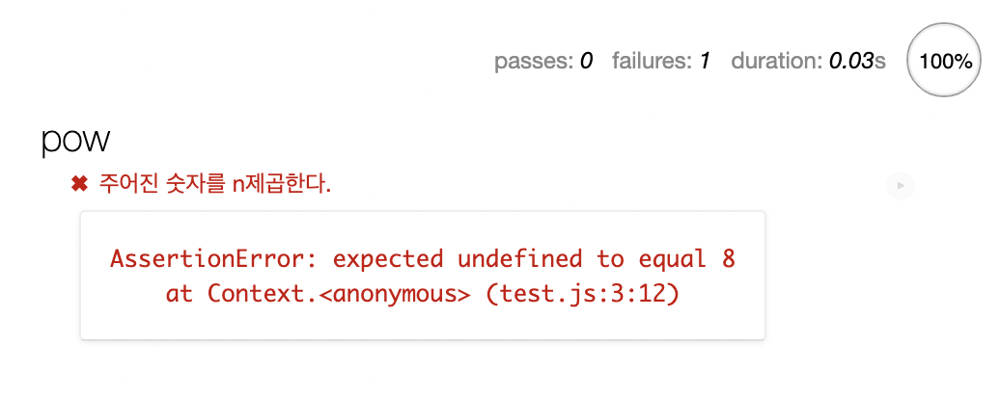
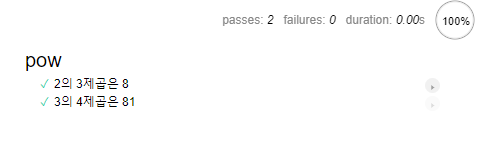
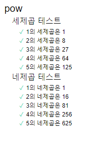

# 1. 테스트 자동화와 Mocha

우리는 개발하면서 끊임없이, 내가 개발한 기능이 잘 동작하는지 테스트한다. 이를 통해 우리는 코드를 개선하고, 새로운 기능을 추가할 수 있다. 이러한 테스트를 수동으로 진행하는 것은 귀찮고, 시간이 오래 걸린다. 

그래서 우리는 자동화된 테스트를 만들어야 한다. 많은 테스트 케이스를 만들어서 함수를 수정할 때마다 이 테스트를 통과하는지를 시험하는 것이다.

여기서는 예를 들어 x의 n제곱을 반환하는 함수 pow(x, n)을 만드는 상황을 생각해보자. 코드를 바로 작성하기 전에 먼저 명세서를 작성해야 한다.

명세서는 decribe, it, assert 3가지 요소로 이루어진다. 이 요소들의 기능은 다음과 같다.

- describe는 테스트를 그룹화한다. 그리고 구현하고자 하는 기능에 대한 설명을 적는다.
- it는 특정 기능에 대한 설명이 들어가고 2번째 인수에는 테스트를 수행하는 함수가 들어간다.
- assert는 테스트를 수행하는 함수 내부에 들어간다. 이 함수는 테스트를 통과하지 못하면 에러를 반환하도록 되어 있다. 예를 들어 assert.equal(pow(2, 3), 8)은 pow(2, 3)과 8이 같은지를 체크하여 다르면 에러를 반환한다.

```javascript
describe("pow", function() {
  it("주어진 숫자를 n제곱한다.", function() {
    assert.equal(pow(2, 3), 8);
  });
});
```

이 명세서를 이용해 함수를 테스트하는 데에는 Mocha라는 테스트 프레임워크가 사용된다.

## 1.1. 실행해보기

[보고 있는 글](https://ko.javascript.info/testing-mocha)에 나와 있는 대로 HTML 페이지를 작성해보자.

```html
<!DOCTYPE html>
<html>
  <head>
    <meta charset="utf-8" />
    <title>Test Page</title>
    <!-- 결과 출력에 사용되는 mocha css를 불러옵니다. -->
    <link
      rel="stylesheet"
      href="https://cdnjs.cloudflare.com/ajax/libs/mocha/3.2.0/mocha.css"
    />
    <!-- Mocha 프레임워크 코드를 불러옵니다. -->
    <script src="https://cdnjs.cloudflare.com/ajax/libs/mocha/3.2.0/mocha.js"></script>
    <script>
      mocha.setup("bdd"); // 기본 셋업
    </script>
    <!-- chai를 불러옵니다 -->
    <script src="https://cdnjs.cloudflare.com/ajax/libs/chai/3.5.0/chai.js"></script>
    <script>
      // chai의 다양한 기능 중, assert를 전역에 선언합니다.
      let assert = chai.assert;
    </script>
  </head>
  <body>
    <script>
      function pow(x, n) {
        /* 코드를 여기에 작성합니다. 지금은 빈칸으로 남겨두었습니다. */
      }
    </script>

    <!-- 테스트(describe, it...)가 있는 스크립트를 불러옵니다. -->
    <script src="test.js"></script>

    <!-- 테스트 결과를 id가 "mocha"인 요소에 출력하도록 합니다.-->
    <div id="mocha"></div>
    <!-- 테스트를 실행합니다! -->
    <script>
      mocha.run();
    </script>
  </body>
</html>
```

그리고 아까 작성한 명세서를 test.js에 넣는다.

```javascript
//test.js
describe("pow", function () {
  it("주어진 숫자를 n제곱한다.", function () {
    assert.equal(pow(2, 3), 8);
  });
});
```

이 상태로 위의 HTML 파일을 크롬에서 열면 아래와 같은 결과를 볼 수 있다. 당연하지만 테스트가 통과되지 않았다고 한다. 아직 함수를 전혀 작성하지 않았으니 당연하다.



## 1.2. 테스트 개선

그런데 아직 우리는 테스트를 하나밖에 작성하지 않았다. 만약 pow함수가 무조건 8을 리턴하는 함수라면 우리가 작성한 테스트를 통과해 버릴 것이다. 따라서 몇 가지 테스트를 더 추가해 보자. 

추가는 describe 블록 내에 it 블록을 더 추가하면 된다. 물론 같은 it 블록 내에 여러 개의 assert를 넣을 수도 있다. 하지만 기존 it 블록에 assert를 추가하는 방식은 하나의 assert가 실패했을 시 그 뒤의 테스트 결과를 알 수 없다는 단점이 있다. 따라서 it블록 하나(하나의 테스트)에서는 한 가지만 확인하자.

```js
//test.js
describe("pow", function () {
  it("2의 3제곱은 8", function () {
    assert.equal(pow(2, 3), 8);
  });

  it("3의 4제곱은 81", function () {
    assert.equal(pow(3, 4), 81);
  });
});
```

이제 pow 함수를 제대로 작성해서 테스트해 보자. pow 함수를 다음과 같이 수정한다.

```js
function pow(x, n) {
  let r=1;
  for(let i=0;i<n;i++){
    r*=x;
  }
  return r;
}
```

그리고 나서 테스트 페이지를 다시 열면 2개의 테스트를 모두 통과한 것을 볼 수 있다.



하지만 이렇게 모든 테스트를 하나씩 작성하면 힘이 든다. 따라서 여러 개의 테스트를 반복문을 통해서 만드는 것도 가능하다. 예를 들어 1부터 5까지의 네제곱에 대해서 pow 함수를 테스트하는 코드를 다음과 같이 만들 수 있다.

```js
//test.js
describe("pow", function () {
  it("2의 3제곱은 8", function () {
    assert.equal(pow(2, 3), 8);
  });

  function makeTest(x) {
    let result = x * x * x * x;
    it(`${x}의 네제곱은 ${result}`, function () {
      assert.equal(pow(x, 4), result);
    });
  }

  for (let i = 1; i <= 5; i++){
    makeTest(i);
  }
});
```

## 1.3 테스트 그룹화

위에서는 네제곱에 대해서만 테스트했지만 당연히 여러 가지의 테스트가 있을 수 있다. 네제곱뿐 아니라 세제곱에 대해서도 테스트를 만든다거나, 숫자가 아닌 입력에 대해 제대로 대처하는지에 대한 테스트들을 생각할 수 있다. 이를 위해서 중첩 describe를 사용할 수 있다.

먼저 세제곱 테스트 그룹을 새로 만들어 보자.

```js
//test.js
describe("pow", function () {
  describe("세제곱 테스트", function () {
    function makeTest(x) {
      let result = x * x * x;
      it(`${x}의 세제곱은 ${result}`, function () {
        assert.equal(pow(x, 3), result);
      });
    }

    for (let i = 1; i <= 5; i++){
      makeTest(i);
    }
  })
    

  describe("네제곱 테스트", function () {
    function makeTest(x) {
      let result = x * x * x * x;
      it(`${x}의 네제곱은 ${result}`, function () {
        assert.equal(pow(x, 4), result);
      });
    }

    for (let i = 1; i <= 5; i++){
      makeTest(i);
    }
  })
});
```

이렇게 정의된 테스트 그룹은 테스트 결과 페이지에 들여쓰기된 상태로 출력된다.



그리고 pow 함수에선 수많은 예외가 발생할 수 있다. 예를 들어서 인자로 문자열이 들어온다면? 이런 예외들을 처리하는 테스트도 있어야 한다. 여기서는 일단 `pow(x,n)`에서 n이 음수일 때 혹은 n이 정수가 아닐 때에 적절히 대처하는지에 대한 테스트를 작성해 본다. 


앞에서 말한 예외적인 경우 리턴값은 NaN이 되어야 한다. `assert.isNaN`을 사용하여 다음과 같이 테스트를 작성하자.  

```js
describe("네제곱 테스트", function () {
  function makeTest(x) {
    let result = x * x * x * x;
    it(`${x}의 네제곱은 ${result}`, function () {
      assert.equal(pow(x, 4), result);
    });
  }

  for (let i = 1; i <= 5; i++){
    makeTest(i);
  }
})

describe("예외 처리", function () {
  it("n이 음수면 결과는 NaN", function () {
    assert.isNaN(pow(2, -1));
  });

  it("n이 정수가 아니면 결과는 NaN", function () {
    assert.isNaN(pow(2, 1.5));
  })

  it("n이 정수가 아니면 결과는 NaN - 2", function () {
    assert.isNaN(pow(2, "Hi"));
  })
})
```

아직 우리는 pow함수에서 예외처리를 해주지 않았으므로 예외 처리 테스트들은 모두 실패한다. 이를 pow 함수에서 수정해 보자. 다음과 같이 할 수 있다.

```js
function pow(x, n) {
  if(typeof(n)!="number" || Math.round(n) != n){
    return NaN;
  }
  if(n<0){
    return NaN;
  }
  let r=1;
  for(let i=0;i<n;i++){
    r*=x;
  }
  return r;
}
```

pow 함수를 이렇게 수정한 후 다시 페이지를 로드하면 모든 테스트가 통과되는 것을 볼 수 있다. 이런 식으로 테스트 명세서를 작성한 후 그 테스트들을 통과하는 코드를 구현하는 것은 기존에 구현된 기능에 영향을 주지 않고 안전하게 코드를 개선하거나 변경하게 해준다. 그리고 에러 발생 여부를 쉽게 테스트할 수 있으므로 수정과 개선을 기피하지 않게 된다.

그리고 구현 전에 테스트를 먼저 작성하므로, 코드 전에 스펙을 상세히 정의하게 되어 더 나은 아키텍처를 구성할 수 있다.

마지막으로, 하나의 it블록에 명확한 입력, 출력을 가진 하나의 테스트만 작성하는 것이 좋음에 유의하자.

# 2. 폴리필

JS는 계속 바뀌는 언어이다. 계속 새로운 제안이 등록되고 레벨이 어느 정도 올라가면 정말 JS 표준에 포함되기도 한다. 그런데 표준에 포함된 지 얼마 안 되는 기능은 특정 엔진에서 작동하지 않기도 한다. 모든 엔진이 표준을 완벽하게 구현하는 건 아니기 때문이다.

## 2.1. 트랜스파일

이럴 때 모던 JS코드를 구 표준 코드로 바꾸어 주는 트랜스파일러인 바벨을 사용할 수 있다. 웹팩 같은 프로젝트 빌드 시스템은 코드 수정시마다 자동으로 트랜스파일해준다. 예를 들어서 ES6 코드를 ES5로 바꾸어 주는 것도 트랜스파일이다.

## 2.2. 폴리필

명세서에는 새로운 내용이 추가되기도 한다. 이때 새 문법이 추가된 경우 트랜스파일러가 구 표준 코드로 바꿔 주면 된다. 그런데 새 내장 함수가 추가된 경우 명세서에 있는 함수가 구현되어 있어야 사용할 수 있다. 이렇게 새롭게 만들어진 표준을 준수할 수 있게 기존 함수의 동작을 수정하거나 새롭게 구현한 함수 스크립트를 폴리필(polyfill)이라고 한다.

예를 들어서 [Temporal API](https://xo.dev/js-temporal-api/)를 사용할 수 있도록 해주는 폴리필은 [여기](https://github.com/js-temporal/temporal-polyfill)를 참고해 설치할 수 있다.