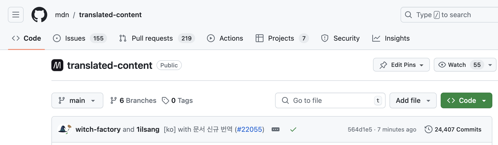
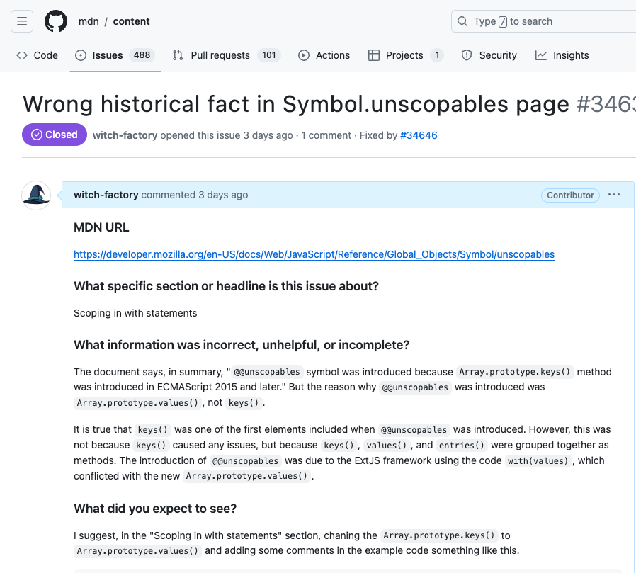
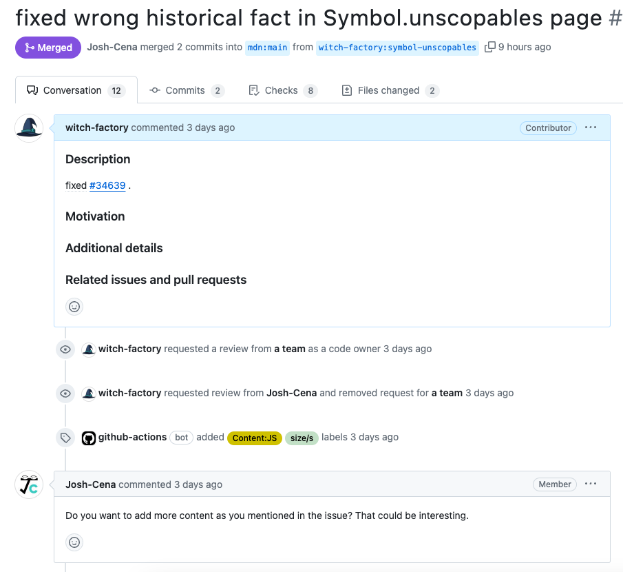
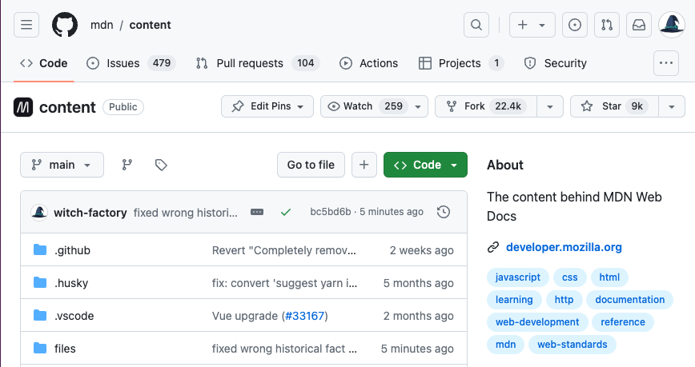

# 시작

내가 글감을 찾고 탐구하는 과정에 대해서 최근 생각해 보았다. 나는 기술 블로그를 몇 년간 운영해 왔으므로 어떻게 하면 차별화된 글을 쓸 수 있을지 고민하고는 했다. 그러던 중 예전에 썼던 글이 생각났다.

[JS 탐구생활 - with문에 대하여](https://witch.work/posts/javascript-with-statement)와 [JS 탐구생활 - 말썽쟁이 with문과 Symbol.unscopables 연대기](https://witch.work/posts/javascript-with-statement-2) 글이었다. 제목에서 알 수 있다시피 JavaScript의 오래된 문법인 `with`문에 대해 탐구한 글이다.

그런데 이 글들이 내가 블로그에 글을 쓰거나 공부하면서 추구하는 부분을 상당히 잘 달성했다고 생각한다. 또 어느 정도 만족스런 결과라는 게 으레 그렇듯이 시간과 노력을 꽤나 들였다. 그래서 이런 과정을 기억나는 대로 여기에 남기려고 한다.

내가 제대로 탐구했다고 생각하는 방법이란, 그것을 완전히 이해하려고 노력하고 머릿속에 기존에 있던 것과 연결이 되지 않거나 미심쩍은 부분을 찾고 완전히 시원해질 때까지 파고드는 것이다. 그러다 보면 지식과 이해와 PR, 블로그 글 등이 따라온다고 생각한다. 이를 따라 `with`문을 탐구한 결과가 위에 링크된 글들이고, 그 과정을 정리한 것이 이 글이다.

다만 `with`문의 구체적인 문법이나 문제 등을 다룬 글은 아니므로 이해를 위해서는 위에 링크한 블로그 글을 참고하길 바란다.

# 탐구의 계기

나는 JavaScript의 역사에 관심이 많다. 그래서 오래된 JavaScript 책이나 자료를 찾아보고는 한다. 그런데 악셀 라우슈마이어의 "자바스크립트를 말하다"라는 책을 읽다가 다음과 같은 문장을 발견했다. `with`문의 문제에 관해서 이야기하는 섹션이었다.

> 이것은 사고실험이 아닙니다. 배열 메서드 values()가 파이어폭스에 추가되면서 TYPO3 콘텐츠 관리 시스템의 코드가 엉킨 일이 있었습니다. 브렌던 벤비가 이 문제의 원인을 밝혀냈습니다(http://mzl.la/1jCrXti).
>
> 악셀 라우슈마이어 지음, 한선용 옮김, "자바스크립트를 말하다", 248p

이 문장을 보고 나니 궁금해져서 해당 주소에 들어가 보았다. 그러자 책에 서술된 버그에 관한 Bugzilla 리포트 페이지가 떴다. 하지만 처음 볼 때는 맥락을 거의 이해할 수 없었다.

# MDN 문서 번역

버그 리포트 페이지의 코멘트들을 읽어 보니 `with(values)`라는 코드가 문제를 일으킨 듯 했다. 또 연관된 링크과 다른 버그 문서들을 읽어 보니 `Symbol.unscopables`이라는 잘 알려진 심볼과 연관이 있었다. 이전에 [심볼의 용도에 대해 알아본 글](https://witch.work/posts/javascript-symbol-usage)에서 이름을 들어본 적은 있었지만 잘 몰랐던 부분이었다.

이 버그 리포트를 이해하려면 `with`와 `Symbol.unscopables`에 대해 알아야 했다. 그래서 먼저 MDN에 있는 `with`와 `Symbol.unscopables`에 대한 문서를 찾아보았다. 개발하면서 실질적으로 쓸 일은 거의 없는 개념에 대한 문서라 그런지 번역은 되어 있지 않았다 (놀랍게도 `Array.prototype[@@unscopables]`는 번역이 되어 있었다).

그래서 나도 어차피 이해를 위해서는 문서를 여러 번 읽어야 할 것 같아서 이를 번역하였다.

이전에 나는 JavaScript의 역사에 관한 문서인 [Javascript: The First 20 Years를 번역하고 배포](https://js-history.vercel.app/)한 적이 있었다. 그래서 번역을 하는 건 그렇게 어렵지 않았다. 또한 [MDN Web Docs contribution guide](https://github.com/mdn/content/blob/main/CONTRIBUTING.md)같은 공식 가이드도 너무 친절해서 따라하기만 하면 됐다. MDN 문서 번역은 오픈소스에 처음 기여하는 사람들이 많이 건드려 보는 프로젝트라서 앞선 기여자들의 후기와 가이드도 많았기에 그것들도 참고하여 번역과 PR까지 쉽게 완료할 수 있었다.

PR한 것은 [[ko] with 문서 신규 번역](https://github.com/mdn/translated-content/pull/22055), [[ko] Symbol.unscopables 문서 신규 번역](https://github.com/mdn/translated-content/pull/22078) 두 개였다. 리뷰가 빠르게 달렸고 리뷰어 분들이 이런저런 가이드도 해주시고 어떤 부분에서는 나의 의견을 물어보시기도 했다. 거기에 적절히 대답하고 수정하기 위해 내가 원래 이해하고자 했던 부분도 다시 탐구했고 또 더 정확하게 이해할 수도 있었다.

그렇게 수정을 몇 번 하고 리뷰까지 완료되자 PR이 머지되었다. 나도 많은 도움을 받았던 사이트에 내 흔적을 아주 작게나마 남긴다는 건 뿌듯한 일이었고 원래 하던 탐구에도 큰 도움이 되었다.



솔직히 MDN 번역은 누구나 할 수 있는 쉬운 일이라고 생각했던 부분이 있었다. 아무래도 가장 진입 장벽이 낮은 기여 중 하나가 문서 번역이고 그 중 하나가 MDN이니까. 하지만 고작 지명도 낮은 문서 2개의 번역을 하면서도 꽤 많은 걸 생각해야 했기에 이전의 내 생각이 부끄러워졌다.

물론 지금이라고 해서 MDN 문서 번역이 아주 난이도 높고 선택받은 사람들만이 할 수 있는 일이라고 생각하지는 않는다. 하지만 누구나 운동을 할 수 있다고 해서 그게 쉬운 건 아니지 않는가? 또한 그런 누구나 할 수 있는 일들이 쌓이면 큰 일이 되기도 하지 않는가? 작은 기여나마 해보니, 이러한 누구나 할 수 있는 작은 일들이 모여서 아무나 쉽게 넘볼 수 없는 지식들이 되는 거라고 느꼈다.

아무튼 번역을 하면서 확실히 문서를 이해했기에 원래 보던 버그 리포트도 다시 보면서 쉽게 이해할 수 있었다. 그걸 기반으로 역사적인 부분들을 조사하여 [JS 탐구생활 - 말썽쟁이 with문과 Symbol.unscopables 연대기](https://witch.work/posts/javascript-with-statement-2)를 썼다.

# MDN 원문에 기여

그런데 그렇게 MDN 문서 번역과 버그 리포트 관련 탐구를 병행하다 보니 이상한 부분을 찾았다. MDN 문서에는 `Symbol.unscopables`가 `Array.prototype.keys()` 때문에 나왔다고 적혀 있었다. 그런데 아무리 찾아봐도 `Symbol.unscopables`는 `Array.prototype.values()` 때문에 나왔다는 사실이 계속 확실해졌다.

`Symbol.unscopables`가 처음 나올 때 `keys`도 포함되어 있었던 것은 맞다. 하지만 이는 `keys()`, `values()`, `entries()` 배열 메서드가 함께 나왔기 때문이었고 실제로 버그를 발생시킨 것은 `values()`였다.

물론 내가 모르는 어떤 사정이 있을 수 있다. 그리고 MDN 문서 기여자들은 대부분 전문가들이니 내가 모르는 어떤 막후 사정을 알 수도 있었다. 그래서 `Symbol.unscopables`의 MDN 문서에 기여한 사람을 찾아보았다. 하지만 그 분의 이력 등을 보니 `with`와 관련된 TC39의 논의 등에 참여하거나 막후 사정을 알 만한 사람은 아니라고 예상했다.

[그래서 내 주장을 뒷받침할 만한 출처들을 최대한 찾아서, 문서에 틀린 정보가 있다고 이슈를 올렸다. PR을 올려도 되냐는 질문과 함께.](https://github.com/mdn/content/issues/34639)



'당연히 PR해도 된다'는 댓글이 생각보다 엄청 빠르게 달렸다. 따라서 `Symbol.unscopables`이 `keys()`가 아니라 `values()` 때문에 나왔다고 내용을 고쳐 [PR을 올렸다.](https://github.com/mdn/content/pull/34646#issuecomment-2209978411)

그런데 리뷰어가 댓글에 재밌을 거 같다면서 이슈에 언급한 컨텐츠를 더 추가할 생각이 있냐고 물었다.



나는 당연히 더 기여할 기회니까 좋았다. 그런데 그러려면 `Array.prototype[@@unscopables]` 문서도 고쳐야 할 것으로 보였고 이를 댓글로 언급했다. 그러자 내 PR의 리뷰어이자 메인테이너가 마음대로 하라고 했다.

그래서 간단하게 내가 조사한 사실을 작성해서 PR을 올렸다. 역시 아주 빠르게 리뷰가 되었고 리뷰를 받아서 PR을 수정하자 이내 머지되었다.



비록 사람들이 많이 찾는 내용에 대한 건 아니었다. 하지만 프론트에서 그래도 가장 공신력 있는 걸로 평가받는 MDN 문서가 완전한 정보를 제공하도록 도운 것은 크게 기쁜 일이었다.

# with와 관련된 논문

이렇게 쓴 글들을 트위터에 올렸더니 어떤 분이 [All about the with statement in JavaScript: Removing with statements in JavaScript applications](https://dl.acm.org/doi/10.1145/2578856.2508173)이라는 논문을 달아주셨다.

다행히 12쪽밖에 안 되는 논문이었고, `with`문을 재작성하여 프로그램의 효율을 높이는 정적 분석기를 만드는 내용이었다. 나는 프로그램 정적 분석에 대해 잘 알지 못하기 때문에 주제 자체가 알고 싶었던 내용은 아니었다. 하지만 논문에 나온 사전 조사 부분에 `with`의 기존 사용에 대한 정리가 있었다.

이를 참고하자 `with`문의 다른 사용법에 대한 것을 알 수 있었다. 예를 들어 생성자 함수 내부에서 `this`를 `with`문으로 감싸서 `this`를 생략하고 프로퍼티에 접근하는 방법이 있었다. 이는 "Secrets of the JavaScript Ninja"라는 책에 언급된 내용이라고 한다.

논문의 예시는 다음과 같이 생성자 함수를 이용한 `with`문의 사용법을 보여준다.

```javascript
function simpleCons(x) {
  var privateVar = 1;
  this.publicVar = x;
  this.copyvalue = function() {
    privateVar = this.publicVar;
  };

  // copyvalue는 with문을 사용해 이렇게 바꿀 수 있다.
  this.copyvalue = function() {
    with(this) {
      privateVar = publicVar;
    }
  };
}
```

이외에도 여러 패턴이 소개되지만 `with`문이 더 이상 사용되는 것도 아니고 글이 `with`문의 실제 코드에 대한 것도 아니므로 생략한다. 하지만 이 논문을 통해 `with`문의 거의 모든 사용법을 알 수 있었다.

# 마치며

JavaScript 책에 작게 실린 한 문장에서 시작해서 MDN 번역, MDN 원문 기여, 논문까지 올 수 있었다. `with`문 자체는 별로 중요하지 않을 수 있다. 나도 개발하면서 `with`문을 직접 쓰거나 상용 코드에서 본 적은 한 번도 없다. 앞으로 개발하면서도 `with`문이 쓰인 코드 같은 걸 평생 볼 일 없을지도 모른다.

하지만 그게 중요한 건 아니라고 생각한다. 나는 어차피 앞으로도 많은 문제를 마주하게 될 것이다. 같은 문제를 똑같이 마주하지만은 않을 것이고 완전히 새로운 문제도 마주하게 될 수밖에 없다. 그때마다 중요한 것은 무엇을 탐구해 봤는지가 아니라 어떻게 파고들어 해결해 나갔고 어떤 생각의 흐름을 만들어 보았는지 중요하다고 생각한다.

책의 한 문장에서 시작해서 전세계 사람들이 볼 수 있는 문서에 작게나마 기여했다. 거의 쓰이지 않는 오래된 문법이 어떻게 ES6에서야 나온 잘 알려진 심볼에 영향을 미치게 되었는지 알 수 있었다. 내가 이전에 심볼에 대한 의문을 가지고 약간이나마 공부해 보았기에 더 쉽게 이해할 수 있었다.

그리고 논문까지 이르러서는 생성자 함수나 `this`등의 개념이 없으면 이해하기 어려운 부분도 마주하게 되었다. 내가 한 번도 써본 적 없고 써볼 일 없을지 모를 문법을 제대로 공부하기 위해 대체 얼마나 많은 것들을 알아야 했는가? 얼마나 많은 것들이 여기 저기 연결되어 있는가? 이런 연결고리를 찾고, 이해하고, 또 다른 연결고리를 찾아가는 것이 내가 탐구하고자 하는 방법이다. 언젠가는 내 머릿속 모든 것들이 그렇게 체계를 가지고 연결되어 있을지도 모른다.

# 참고

악셀 라우슈마이어 저, 한선용 옮김, "자바스크립트를 말하다"

All about the with statement in JavaScript: Removing with statements in JavaScript applications

https://typeset.io/pdf/all-about-the-with-statement-in-javascript-removing-with-31zttjdgy3.pdf