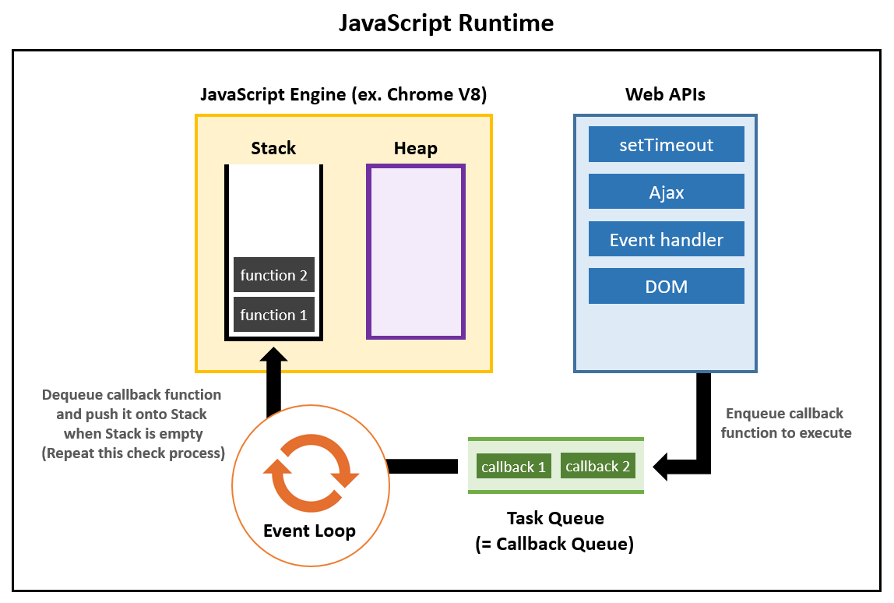

setTimeout이 정확하지 않은 이유를 찾다가 이벤트 루프가 나왔고, 이것이 너무 길어져 글이 분리되었다.

# 1. 웹 표준

JS 명세서를 눈을 씻고 찾아봐도 setTimeout, setInterval과 같은 비동기 메서드들이 없다. console.log 같은 것도 마찬가지다. 하지만 시중에 나와 있는 거의 모든 JS 호스트 환경이 이런 메서드를 제공한다. 

이는 W3C에서 지정하는 JS 표준(ECMAScript)이 아니라 WHATWG에서 지정하는 WebAPI 표준에 포함되어 있다. 브라우저에서 동작하게 만들어진 API의 묶음 같은 거라고 생각하면 된다. 브라우저 외에도 대부분의 JS 호스트 환경이 이를 지원한다.

setTimeout 이외에도 console, fetch, XMLHttpRequest 등이 WebAPI에 포함된다.

# 2. WebAPI와 JS 엔진

우리는 각 함수들이 어떤 표준에 포함되는지 딱히 신경쓰며 사용하지 않는다. setTimeout이 어떤 표준에 포함되든지 일반적으로 JS를 쓸 때 사용할 수 있지 않은가?

하지만 내부적으로는 이를 관리해 줘야 한다. WebAPI와 JS엔진은 어떻게 상호작용할까?



## 2.1. JS엔진 영역

콜스택은 JS 엔진이 관리하는 영역이다. JS에서 실행되는 코드에서 함수들은 실행 순으로 스택에 쌓이고, 스택 자료구조가 그렇듯이 맨 위부터 하나씩 실행된다. 실행이 종료된 함수는 스택에서 제거된다.

JS는 싱글스레드이기 때문에 한 번에 한 가지 일만 할 수 있다. 따라서 콜스택은 하나뿐이고 호출되는 함수들을 이 하나뿐인 콜스택으로 관리한다. 이 콜스택 크기에는 제한이 있어서 만약 콜스택 크기가 제한을 넘어가면 'Maximum call stack size exceeded'에러가 발생한다.

그리고 힙은 변수, 객체들이 저장되는 영역인데 콜스택의 함수들이 실행될 때 필요한 데이터를 제공하는 곳이다.

## 2.2. WebAPI에 대하여

위에서, JS는 싱글스레드이기 때문에 한 번에 한 가지 일만 할 수 있다고 했다. 그런데 우리는 브라우저에서 작업을 동시에 진행할 수 있다. 이는 브라우저 또는 JS호스트 환경이 제공하는 API들 덕분이다. 이를 webAPI라고 한다.

webAPI는 setTimeout, fetch, XMLHttpRequest 등 비동기로 실행되는 API를 관리한다. 이런 API들은 JS 플랫폼 자체에서 관리되어서 JS 콜스택의 진행을 막지 않는다. 즉 한 번에 한 가지 일만 할 수 있는 JS 인터프리터와 별개로 실행되기 때문에 webAPI가 관리하는 API들은 동시에 실행될 수 있는 것이다.

또한 webAPI는 JS로 작성된 게 아니라 C 등 다른 언어로 작성되었기 때문에 일반적인 JS에서 할 수 없는 것들도 하게 해준다. AJAX 요청을 보낸다든지, DOM을 조작한다든지 하는 것들이 모두 WebAPI의 영역이다.

## 2.3. 태스크 큐(콜백 큐)

webAPI를 통해서 우리는 JS 인터프리터(한 번에 한 가지 일만 가능)와 별개로 다른 작업을 동시에 진행할 수 있다. 그런데 WebAPI와 JS 코드는 어떻게 상호작용하는가? ajax 요청으로 서버에서 받아온 정보로 무언가를 해야 하는데 이를 JS는 어떻게 처리하는가? 바로 태스크 큐를 통해서 처리한다.

WebAPI 함수들은 전부 비동기로 동작하기 때문에 콜백 함수를 가지고 있다. webAPI는 API 호출이 끝난 이후에 이 콜백의 코드를 실행하도록 해준다.

다음 코드를 실행하면 a,c,b가 차례대로 출력된다.

```js
console.log("a");
setTimeout(() => {
  console.log("b");
}, 0);
console.log("c");
```

이는 setTimeout의 동작 때문이다. setTimeout은 JS 인터프리터가 다음 명령을 실행하는 동안 동시에 실행된다. 지정한 delay가 지나면 콜백 함수는 실행될 것이다.

그런데 이 콜백 함수는 당연히 JS로 쓰여 있을 것이다. 그러므로 JS 인터프리터가 이 콜백 함수를 실행해야 할 것이다. 콜백 함수가 콜스택에 들어가야 한다는 말이다. 

그런데 콜스택에는 이미 다른 함수가 실행되고 있을 수 있다. 그러므로 콜백 함수는 대기열에 들어가게 된다. 이 대기열을 태스크 큐라고 한다.

setTimeout의 처리는 다음과 같다.

1. setTimeout이 실행된다.
2. 이 setTimeout은 WebAPI에 전달된다.
3. WebAPI는 setTimeout이 지정한 delay가 지나면 setTimeout의 콜백 함수를 태스크 큐로 전달한다.
4. 이벤트 루프가 돌다가 콜스택이 비어있으면 태스크 큐의 top에 있는 콜백 함수를 꺼내서 콜스택에 넣는다.

예를 들어 다음과 같은 코드가 있다고 하자.

```js
setTimeout(foo, 1000);
```

그러면 setTimeout은 1초 뒤에 콜백 함수를 실행하라는 정보와 콜백 함수 `foo`를 WebAPI에 전달한다.

WebAPI는 이 정보를 이용해서 1초 이후에 콜백 함수를 태스크 큐로 보낸다. setTimeout 외에 다른 비동기 메서드라면 해당하는 정보에 따라 특정 시점에 콜백함수를 태스크 큐로 보낼 것이다. 그리고 이벤트 루프는 콜스택이 비어있을 때 태스크 큐의 top에 있는 콜백 함수를 콜스택으로 보낸다.

## 2.4. 최적화 필요성

만약 콜스택이 현재 어떤 코드를 실행시키고 있다면 이벤트 루프는 block된다. 이 말은 콜스택에서 수행되고 있는 작업이 있다면 그것이 끝나고 콜스택이 완전히 비기 전까지 태스크 큐의 작업들은 콜스택에 전달되지 못한다는 것이다. 그리고 큐의 구조를 생각해 볼 때 콜백 함수들은 큐에 쌓인 순서대로 실행되어야 한다.

이런 것 때문에 최적화가 필요하다. 만약 콜스택에 너무 많은 코드를 실행시키거나 태스크 큐에 너무 많은 작업들을 할당하면 태스크 큐의 작업들을 처리하느라 새로운 작업이 실행되지 못할 것이다. 

예를 들어 스크롤을 내릴 때는 이벤트가 태스크 큐에 엄청나게 많이 추가된다. 스크롤 이벤트 처리에 시간이 좀 걸린다면 태스크 큐에 쌓인 수많은 스크롤 이동 이벤트를 순서대로 처리하느라, 이후에 태스크 큐에 쌓이는 사용자의 클릭 이벤트 등을 빠르게 처리하기 힘들 것이다. 

따라서 함수 호출이 일정 시간 간격 미만으로 이루어지지지 않게 하는 기법인 디바운싱, 연달아 호출되는 함수 중 마지막 혹은 처음만 호출하는 쓰로틀링 등의 기법을 사용해야 한다.

## 2.5. 비동기 메서드

어떤 작업을 비동기로 실행하고 싶다면 그 작업을 콜백 함수로 만들어서 setTimeout에 넘긴 후 setTimeout(func, 0)처럼 사용하면 된다.

그러면 func에 해당하는 작업은 다음 이벤트 사이클에 가능한 빨리 실행될 것이다. 그런데 꼭 비동기 작업 이후에 실행해야 하는 작업도 있다. 예를 들어서 DB에서 데이터를 가져온 후 프론트에서 어떤 가공을 하는 경우이다.

그런 경우 setTimeout을 중첩하여 사용하면 된다.

```js
function A() {
  console.log("A");
}

function B() {
  console.log("B");
}

function C() {
  console.log("C");
}

setTimeout(() => {
  A();
  setTimeout(() => {
    B();
    setTimeout(() => {
      C();
    });
  });
});
```

물론 이런 방식으로 코드를 짜면 익히 알려진 콜백 지옥이 생기고 이런 걸 해결하는 여러 방법으로 Promise, async/await 등이 있다. 하지만 여기서 자세히 다룰 내용은 아니다. 다음에 Promise 작동 방식은 보겠지만, Promise의 사용 패턴 등은 이 글을 벗어난다.

# 3. Promise의 작동

그런데 우리는 JS에서 비동기를 실현하는 방법을 하나 더 알고 있다. 이 방법도 순서를 강제할 수 있다. 바로 Promise이다. 이 Promise는 어떻게 처리되는 걸까?

## 3.1. Promise는

우리는 앞서 setTimeout을 이용해서 비동기 코드를 짤 수 있다고 보았다. 이런 걸 Promise를 이용해서도 비동기로 짤 수 있다.

```js
new Promise((res, rej) => {
  res();
})
  .then(() => {
    A();
  })
  .then(() => {
    B();
  })
  .then(() => {
    C();
  });
```

물론 async/await을 이용할 수도 있고 같은 Promise를 사용해도 다르게 짤 수도 있다. 하지만 여기서 중요한 건 Promise는 어떻게 작동하는지 이해하는 것이다. 위 코드는 어떻게 비동기로 작동하는가?

## 3.2. job queue

Promise는 콜백을 이용한 방식과 다르게 작동한다. 프로미스는 자신들만의 큐를 따로 가지고 있고 이는 job 큐나 프로미스 큐라고 불린다. 

이는 태스크 큐에 비해 우선순위를 가지고 있어서 태스크 큐에 비해 더 우선적으로 다루어진다. 그 말은 이벤트 루프가 프로미스 큐를 먼저 처리하고 난 후 태스크 큐를 처리한다는 뜻이다.

다음 코드를 보자.

```js
function A() {
  console.log("A");
}

function B() {
  console.log("B");
}

function C() {
  console.log("C");
}

A();
setTimeout(B, 0);
new Promise((resolve, reject) => {
  resolve();
}).then(() => {
  C();
});
console.log("D")
```

위 코드는 A,D,C,B를 순서대로 출력한다. B,C의 출력은 비동기로 처리되므로 A,D가 가장 먼저 출력되는 것은 당연하다. 그리고 이벤트 루프에서 프로미스 큐가 더 우선 처리되므로 C가 먼저 출력된다. 그리고 나서 태스크 큐가 처리되므로 B가 출력된다.

이에 관한 내용은 다음과 같은 링크에 더 있지만 아직 지식이 부족해 후로 미룬다.

https://ko.javascript.info/microtask-queue
https://ko.javascript.info/event-loop

# 참고

https://developer.mozilla.org/ko/docs/Web/API/setTimeout#%EB%94%9C%EB%A0%88%EC%9D%B4%EA%B0%80_%EC%A7%80%EC%A0%95%ED%95%9C_%EA%B0%92%EB%B3%B4%EB%8B%A4_%EB%8D%94_%EA%B8%B4_%EC%9D%B4%EC%9C%A0

https://ssocoit.tistory.com/249

https://ko.javascript.info/settimeout-setinterval

https://negabaro.github.io/archive/js-async-detail

https://velog.io/@seongkyun/fetch-setTimeout%EC%9D%80-%ED%91%9C%EC%A4%80-API%EC%9D%BC%EA%B9%8C-len7n3gc

https://joooing.tistory.com/entry/%EC%9D%B4%EB%B2%A4%ED%8A%B8%EB%A3%A8%ED%94%84-setTimeout%EC%9D%98-%EC%8B%9C%EA%B0%84%EC%9D%80-%EC%A0%95%ED%99%95%ED%95%A0%EA%B9%8C

https://felixgerschau.com/javascript-event-loop-call-stack/#web-apis

https://www.youtube.com/watch?v=8aGhZQkoFbQ

https://atoz-developer.tistory.com/94