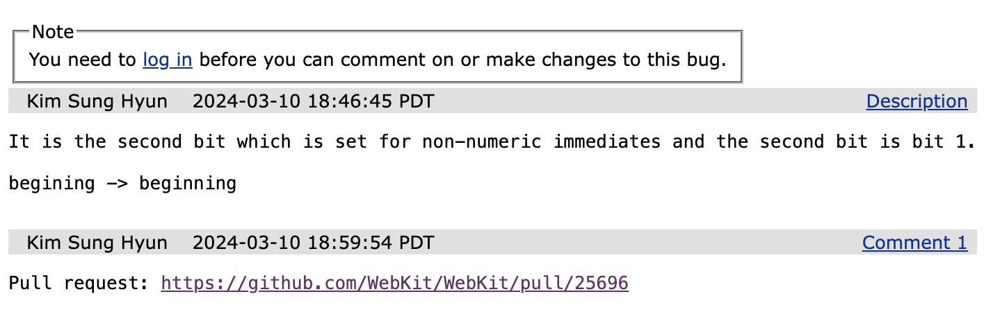
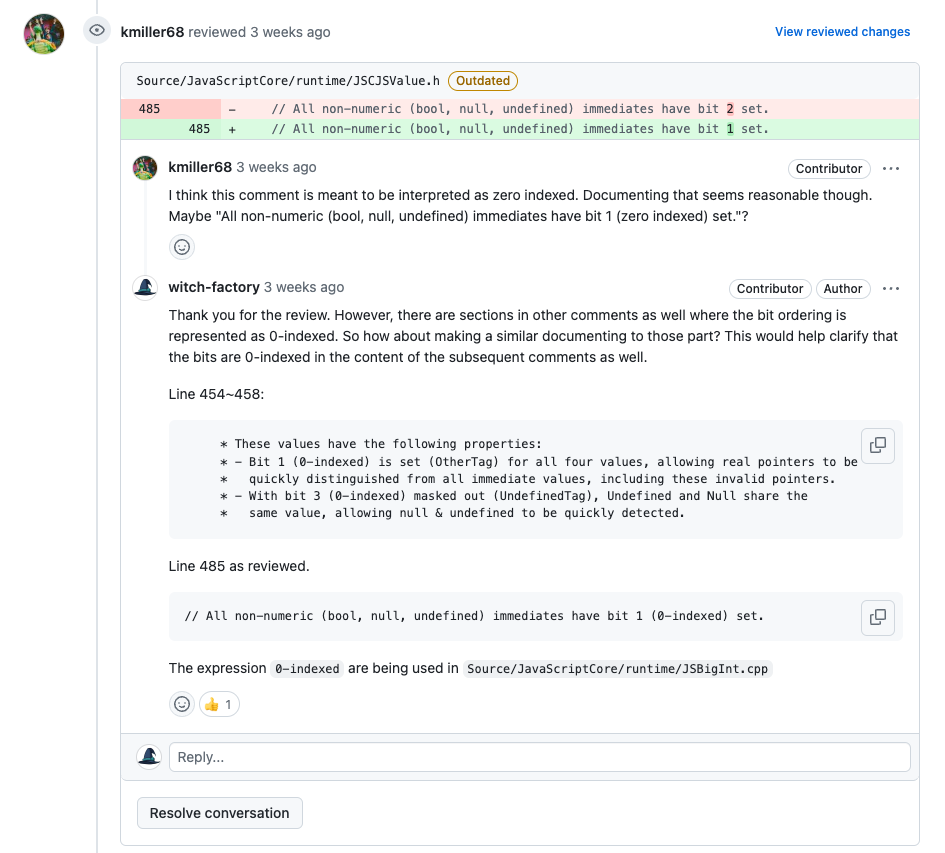
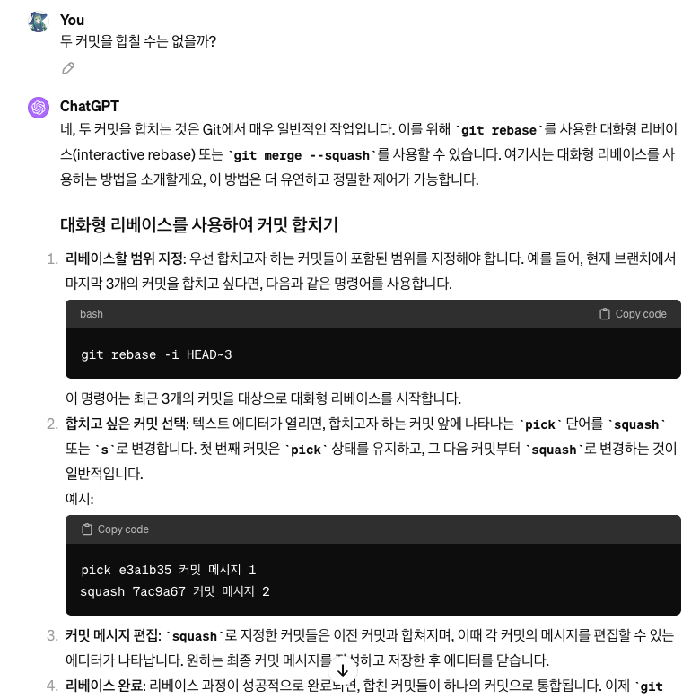
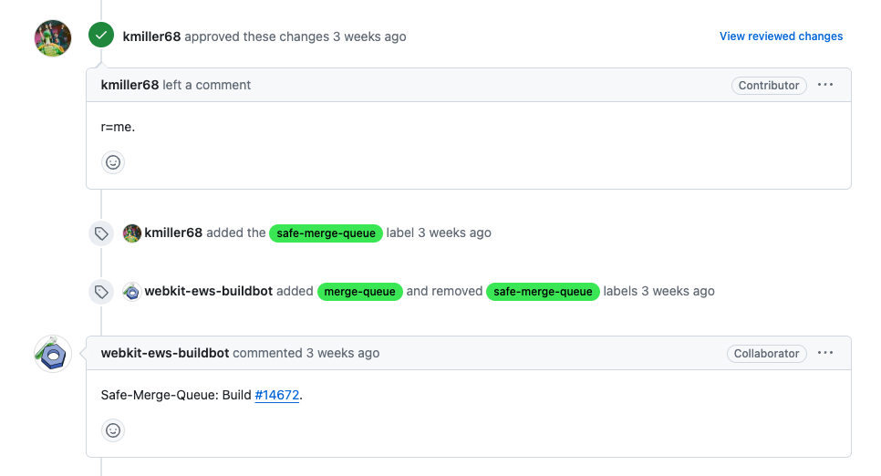

글을 쓰기 위해 자료조사를 하던 중 WebKit의 JavascriptCore 엔진 코드 주석에 사소하나마 기여하게 되었다. 대단한 기여는 아니지만 내가 Javascript 생태계에 기여했다는 것이 생각보다 더 의미있고 뿌듯한 경험이었기 때문에 그 과정을 여기 간략하게 정리한다.

# 1. 문제점 발견과 준비

[JS 탐구생활 - JS 엔진이 값을 저장하는 방법, tagged pointer와 NaN boxing](https://witch.work/posts/javascript-trip-of-js-value-tagged-pointer-nan-boxing)글과 후속 글을 작성하면서 Javascript 엔진들이 값을 저장하는 방식에 대해 조사하고 있었다.

## 1.1. 문제점 발견

WebKit의 JavascriptCore 엔진(Safari 브라우저에서 사용)의 코드를 보던 중 이상한 점이 있었다. 이건 `Webkit/Source/JavaScriptCore/runtime/JSCJSValue.h`의 코드 일부다.

IEEE 754 규격으로 나타낸 double precision 값 중 NaN의 표기에서 쓰이지 않는 비트 표현들을 이용해서 값을 저장하는 방식을 설명한 주석이다. NaN boxing이라고 불리며 이 개념에 대해서는 이전에 작성한 [JS 탐구생활 - JS 엔진이 값을 저장하는 방법, tagged pointer와 NaN boxing](https://witch.work/posts/javascript-trip-of-js-value-tagged-pointer-nan-boxing)을 참고할 수 있다.

```cpp
/*
* (생략)
* The top 15-bits denote the type of the encoded JSValue:
*
*     Pointer {  0000:PPPP:PPPP:PPPP
*              / 0002:****:****:****
*     Double  {         ...
*              \ FFFC:****:****:****
*     Integer {  FFFE:0000:IIII:IIII
*
* The scheme we have implemented encodes double precision values by performing a
* 64-bit integer addition of the value 2^49 to the number. After this manipulation
* no encoded double-precision value will begin with the pattern 0x0000 or 0xFFFE.
* Values must be decoded by reversing this operation before subsequent floating point
* operations may be performed.
*
* 32-bit signed integers are marked with the 16-bit tag 0xFFFE.
*
* The tag 0x0000 denotes a pointer, or another form of tagged immediate. Boolean,
* null and undefined values are represented by specific, invalid pointer values:
*
*     False:     0x06
*     True:      0x07
*     Undefined: 0x0a
*     Null:      0x02
*
* These values have the following properties:
* - Bit 1 (OtherTag) is set for all four values, allowing real pointers to be
*   quickly distinguished from all immediate values, including these invalid pointers.
* - With bit 3 masked out (UndefinedTag), Undefined and Null share the
*   same value, allowing null & undefined to be quickly detected.
*
* (생략)
*/
// ... 생략 ...

// All non-numeric (bool, null, undefined) immediates have bit 2 set.
static constexpr int32_t OtherTag       = 0x2;
static constexpr int32_t BoolTag        = 0x4;
static constexpr int32_t UndefinedTag   = 0x8;
```

그런데 이 주석을 잘 읽어보면 bool, null, undefined같은 특별한 값들을 비트열로 나타내기 위해 붙는 OtherTag는 2번째 하위 비트를 set하는 데에 쓰인다. 그런데 다른 주석과 코드를 보면 최하위 비트는 bit 0부터 시작하는 것으로 보이므로 이 주석은 오타인 것 같다. 다음과 같이 수정해야 맞다고 보인다.

```cpp
// All non-numeric (bool, null, undefined) immediates have bit 1 set.
```

[해당 주석이 처음 생겼을 당시의 커밋](https://github.com/WebKit/WebKit/commit/6e689e040d4fc2df6270ea09585605a0fb5e5f11)에도 `OtherTag`의 역할을 하던 `TagBitTypeOther`는 second bit를 사용하고 있었고 당시에도 bit 0부터 비트를 세었다는 것을 알리는 주석이 꽤 있기 때문에 정말 오타로 보인다.

```c
// The second bit set indicates an immediate other than a number (bool, null, undefined).
#define TagBitTypeOther 0x2ll
```

따라서 이 오타를 고치고 PR하기로 했다.

## 1.2. 준비

WebKit 공식 홈페이지에 [코드 기여에 관한 안내](https://webkit.org/contributing-code/)가 있어서 따라갔다.

먼저 git clone을 했다.

```bash
git clone git@github.com:WebKit/WebKit.git WebKit
```

그리고 버그 리포트를 만들었다. [WebKit Bugzilla](https://bugs.webkit.org/)에서 버그 리포트를 작성할 수 있다. 내가 만든 리포트는 다음과 같다.



WebKit에는 이미 기여자를 위한 여러 가지 자동화 스크립트가 `Tools/Scripts/`에 짜여 있다. 한번 시험해 보았다. 예를 들어 코드 스타일을 체크하는 스크립트는 다음과 같이 실행할 수 있다.

```bash
Tools/Scripts/check-webkit-style
```

이후 PR을 올리는 과정에서도 이러한 자동화 스크립트가 많이 쓰이므로 적었다.

# 2. 수정과 PR

주석을 수정하는 작업은 간단했다. `Webkit/Source/JavaScriptCore/runtime/JSCJSValue.h` 파일을 열어서 해당 주석을 수정했을 뿐이기에 수정 내용을 굳이 다시 적지 않는다.

## 2.1. PR 올리기

자동화 스크립트가 잘 되어 있다. 따라서 git status, git diff 등을 통해 수정 내용을 확인하고 다음 스크립트 실행 후 시키는 대로 하면 된다. 이름, 이메일, 연관된 버그 리포트 등을 입력하고 커밋 메시지 자동 생성 등을 해준다.

```bash
Tools/Scripts/git-webkit setup
```

`git commit -a`로 커밋한 후에 다음 스크립트를 실행한다. 말 그대로 PR을 생성해준다.

```bash
Tools/Scripts/git-webkit pull-request
``` 

## 2.2. 리뷰와 수정

JavascriptCore는 하루에 두 자릿수는 수정사항이 올라갈 정도로 매우 활발하게 유지보수되고 있는 라이브러리이다(지금도 2시간 전에 수정사항이 올라왔다). Apple에서 관리하고 있기도 하고. 내 수정사항이 그렇게 복잡한 것도 아니라서 빠르게 리뷰가 올라왔다.

최하위 비트를 0부터 시작하는 것이 맞으며, 단순히 비트 인덱스만 수정하는 것보다는 비트 인덱스가 0부터 시작한다는 것을 명시하는 것이 낫지 않겠냐는 내용이었다. 그래서 다른 주석들과 비교해서 이렇게 고치는 게 어떻겠냐고 제안하였다.



리뷰어가 좋다는 듯한 이모지로 반응했기에 그렇게 PR을 수정하였다. 그러자 커밋을 하나로 합치라는 요청이 왔다. 그래서 커밋을 합치고 다시 PR을 올렸다. 여기에는 우리의 친구 GPT의 도움이 좀 있었다.



이렇게 하고 리뷰어에게 확인을 부탁했다. 빠른 리뷰가 있었고(`r=me`) PR 머지 처리가 되었다. 바로 머지되는 건 아니었고 리뷰어가 PR에 머지 큐에 들어간다는 뜻의 뱃지를 달면 알아서 봇이 처리하는 방식이었다.



하루 정도의 시간이 지나 PR이 머지되었고 내가 작게나마 기여한 코드가 WebKit에 반영되었다.


자료 조사를 위해 코드를 읽다가 수정하게 되었을 뿐이고 대단한 기여는 아니지만, 할 수 있는 걸 어떻게든 했다는 건 생각보다 괜찮은 기분이었다. 특히 WebKit은 문서와 자동화가 매우 잘 되어 있어서 프로젝트의 크기에 비해 PR을 올리는 과정이나 코드를 수정하는 과정이 쉬웠다. 앞으로도 문제를 발견하면 내가 할 수 있는 범위 내에서 기여를 해보려고 한다.