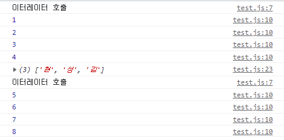

# 1. 스프레드 구문

스프레드라고 불리는 `...`구문은 배열, 문자열과 같이 반복 가능한 객체에 쓸 수 있다. 0개 이상의 인수가 기대되는 함수 호출이나 배열 리터럴의 내부에 쓰여서 반복 가능한 객체를 확장해 준다. 

예를 들어 스프레드 구문을 이용해 배열 원소들을 전부 함수 인수로 전달할 수 있다.

```js
const numbers = [1, 3, -8, 37, 5, -324, 623];

console.log(Math.max(...numbers)); //623
```

또한 객체 리터럴에도 쓰일 수 있는데 그렇게 사용하면 스프레드 구문은 객체의 프로퍼티를 열거(enumerate)하고 생성되는 객체에 키-값 쌍을 더한다.

이때 나머지 구문과는 다르다. 물론 같은 `...`이지만 나머지 구문은 여러 원소들을 모아서 하나의 원소(배열)로 만드는 역할을 한다. 

여기서 다루는 `...`의 역할은 요소 스프레드(SpreadElement) 즉 `let arr=[a,b,...c]`와 같이 새로운 이터러블에 들어가는 이터러블을 확장하는 것, 그리고 인수 스프레드, `func(a,b,...c)`와 같이 요소들을 개별적으로 함수 인수로 전달하기 위해 이터러블을 확장하는 것을 말한다.

# 2. 스프레드 연산자?

인터넷을 찾아보면 스프레드 연산자라고 쓰인 문서를 많이 발견할 수 있다. 그러나 이는 절대로 연산자가 아니다. 이유들은 다음과 같다.

## 2.1. 연산자의 조건 불만족

연산자는 기본적으로 인수를 받고 그 결과가 `하나의 값`으로 평가되는 함수이다. 그 결과값은 그냥 값(rvalue)이거나 할당을 허용하는 객체(lvalue)이다. 예를 들어서 `2+3`은 인수 2,3을 받고 5라는 결과값으로 평가될 것이다.

그런데 `...`는 하나의 값으로 평가되지 못한다. `...arr`는 이터러블 arr의 원소들을 하나하나 펼치고 결국 여러 개의 값으로 평가된다. 따라서 `...`은 연산자의 기본적인 조건부터 만족하지 못한다.

또한 `...`은 단독으로 쓰일 수 없다. 배열이나 함수 호출의 맥락에서만 쓰일 수 있다. 그런 맥락에서만 `...`이 배열이나 객체 등을 확장한 여러 값들을 받아낼 수 있기 때문이다. 따라서 다른 맥락에서 사용하는 것은 허용되지 않는다. 예를 들어 다음 코드는 `...`에 대한 에러를 발생시킬 것이다.

```js
let a=[1,2,3];
b=...a;
```

만약 `...`이 연산자였다면 당연히 피연산자와 함께 단독으로 쓰일 수 있었을 것이다. 이렇게 연산자로서 단독으로 쓰일 수 없다는 것도 `...`이 연산자가 아니라는 것을 뒷받침한다.

## 2.2. 표준에서

그리고 `...`이 연산자라면 단항에 prefix 연산자일 것이다. 그런데 ECMA 표준 문서의 [단항 연산자 부분](https://tc39.es/ecma262/#sec-unary-operators)을 눈을 씻고 찾아봐도 `...`에 대한 언급은 없다. 물론 연산자에 대한 다른 내용들을 보아도 `...`은 없다. 이때 이 표준은 `...`이 처음 소개되었을 때를 기준으로 한다.

`...`이 언급되는 곳은 배열 리터럴에 대한 부분 그리고 함수 호출에 대한 부분뿐이다. 이런 맥락이 있어야만 `...`을 쓸 수 있다는 것이다. 따라서 표준에도 `...`은 연산자로 언급되어 있지 않으며 특정 맥락에서만 쓰일 수 있다고 되어 있다.

하지만 연산자는 앞에서 말했듯 단독으로 쓰여서 평가받을 수 있어야 하므로 `...`은 연산자라 할 수 없다. 

## 2.3. 맥락에 따라 달라지는 작동방식

연산자는 언제나 같은 방식으로 동작한다. `2+3`을 어떤 맥락에서 하든지 간에 결과는 똑같을 것이다. 그러나 `...`구문이 스프레드와 나머지 인수 2가지로 해석된다는 것은 이미 너무 잘 알려져 있다. 

```js
const arr=[1,2,3];
console.log(Math.max(...arr)); //스프레드로 사용
console.log([...arr]);
function foo(arg1, ...rest){} // 나머지 인수로 사용
```

즉 `...`이 어떻게 작동하는지가 쓰이는 맥락에 따라 달라지는 것이다. 어떨 때는 원소들을 펼쳐주고 어떨 때는 모아 준다. 연산자는 이렇게 맥락에 따라 실행 결과가 달라지면 안 된다.

앞서 말한 이유들로 인해 `...`은 스프레드 연산자가 아니라 스프레드 구문으로 쓰는 게 맞을 것이다. syntax라는 용어를 쓰자는 주장도 있다. 하지만 어떤 용어를 쓰던지 간에 연산자가 아니라는 것은 똑같다.

## 2.4. 그럼 왜 스프레드 연산자라는 말이 쓰이는가?

`...a`꼴로 쓰이는 게 단항 prefix 연산자처럼 보여서 그런 듯 하다. 또한 [이 글](https://stackoverflow.com/questions/37151966/what-is-spreadelement-in-ecmascript-documentation-is-it-the-same-as-spread-synt/37152508#37152508)에서는, `...`을 이용해 함수 인수를 전달하는 것에 대한 이름이 공식 문서에는 존재하지 않는데 이를 부르는 이름으로 사람들이 '스프레드 연산자'라는 말을 만들어낸 게 아닐까 추측하고 있다.

# 3. 배열에서의 작동 방식

`...`이 이터러블에 쓰여서 함수 호출이나 배열 리터럴 내에서 펼쳐지는 즉 SpreadElement 목적으로 쓰인다고 하자. 그럼 이것의 내부 동작은 어떻게 될까?

`...args`가 감지되면 js엔진은 args의 이터레이터를 가져오려고 한다. 이는 이터레이터 프로토콜이며 `Symbol.iterator`를 통해 정의된 값이다. 만약 args가 이터러블 객체가 아니라면 타입 에러가 발생할 것이다. 단 객체 리터럴은 예외인데 이는 따로 설명한다.

```js
console.log(...100);
```

100은 이터러블이 아니므로 당연히 에러가 발생할 것이다. 이 에러 메시지를 보면 우리가 앞에서 이야기한 `Symbol.iterator`가 `...`사용에 요구된다는 것을 명확히 언급하고 있다.

```
Uncaught TypeError: Spread syntax requires ...iterable[Symbol.iterator] to be a function
```

아무튼 `...args`가 호출되면 엔진은 args의 이터레이터에 접근해서 반복이 끝날 때까지 iterator.next를 호출할 것이다. 예를 들어서 다음 코드를 보자.

```js
let cnt = 1;

const it = {
    [Symbol.iterator]() {
        const arr = ["김", "성", "현"];
        let idx = arr.length;
        console.log("이터레이터 호출");
        return {
            next() {
                console.log(cnt++);
                return {
                    value: arr[--idx],
                    done:idx<0
                }
            }
        }
    }
}

function func() {}

let temp = [...it];
console.log(temp);
func(...it);
```

이 코드의 실행 결과는 다음과 같다. `...it`를 js엔진이 감지하면, it의 Symbol.iterator가 호출되고 반복이 끝날 때까지 next가 호출되는 것을 알 수 있다. arr이 temp에 담긴 순서도 이를 뒷받침한다. 이는 for..of의 작동 방식과 같다.



# 4. 객체 스프레드

우리는 `...`이 이터러블에만 사용될 수 있다고 지금까지 다뤄왔다. 그런데 다음 코드를 보자.

```js
let me = {
    name: "김성현",
    blog:"witch.work"
}

let meCopy = { ...me };
console.log(meCopy); // 객체가 잘 복사되었다
```

`me`객체에는 Symbol.iterator 같은 게 없다. 그런데 스프레드가 잘 동작하는 것을 볼 수 있다. 대체 어떻게?

이는 스프레드 프로퍼티 프로포절에 객체 리터럴에 대해서도 스프레드 문법을 사용할 수 있도록 [제안](https://github.com/tc39/proposal-object-rest-spread)되었고 이게 받아들여졌기 때문이다. 그럼 이건 어떤 내부 동작을 가지고 있는 걸까?

그전에 이 제안이 어떤 건지 한번 알아보자. 객체를 스프레드하는 건 뭘까? 프로포절 문서에 들어가 보았다.

## 4.1. 기본

### 4.1.1. 나머지 문법

나머지 프로퍼티 문법은 구조 분해 할당에서 아직 할당되지 않은 프로퍼티들 중 enumerable 속성을 갖는 프로퍼티들을 모아 준다. key, value들은 copy된다.

```js
let temp = {
    x: 1,
    y: 2,
    z: 3,
    a: 6,
    b: 7,
}

let { x, y, ...rest } = temp;
let { ...c } = temp; //c는 temp를 copy한다
console.log(x, y, rest); // 1 2 {z: 3, a: 6, b: 7}
console.log(c, temp);
console.log(c === temp); // c는 temp의 복사본이므로 false
```

단 이는 깊은 복사를 뜻하는 건 아니다. 내부 객체 등은 참조 복사된다.

```js
let temp = {
    x: 1,
    y: 2,
    z: 3,
    obj: {
        a:10, b:20,
    }
}

let { ...t } = temp;
console.log(t === temp);
console.log(t.obj === temp.obj);
//true이다. t는 temp의 shallow copy이기 때문
```

또한 함수 선언시에도 사용할 수 있다. 객체가 함수 인수로 전달되면 그 객체의 프로퍼티 중 키가 함수의 인수명과 같은 인수들이 자동으로 함수에 인수로 전달된다. 그리고 `...`이 들어간 인수에는 그 외 나머지들이 모이는 것이다.

아래 코드를 보면 temp가 foo 함수에 전달되었는데 temp의 x,y는 같은 이름의 인수를 foo에서 구조 분해 할당하고 있으므로 foo에 인수로 잘 전달된다. 그리고 그 외의 인수들은 rest에 객체 형태로 저장되는 것을 알 수 있다.

```js
let temp = {
    x: 1,
    y: 2,
    z: 3,
    a: 12,
    b: 17,
}

function foo({ x, y, ...rest }) {
    console.log(x, y, rest);
}

foo(temp); // 1 2 {z: 3, a: 12, b: 17}
```

또한 이렇게 나머지 문법으로 받은 객체에 스프레드를 사용하여 객체를 재구조화할 수도 있다. 이 말은 나머지 문법으로 만든 객체도 스프레드하여 다른 객체에 넣을 수 있다는 것이다.

```js
let temp = {
    x: 1,
    y: 2,
    z: 3,
    a: 12,
    b: 17,
}

let { x, y, ...rest } = temp;
let reassembled = { x, y, ...rest };
console.log(reassembled);
```

주의할 점도 언급하는데 나머지 문법으로 쓰일 때도 프로토타입 체이닝을 사용하기 때문에 다음 2가지는 같지 않다고 한다.

```js
let { x, y, ...z } = a;
// is not equivalent to
let { x, ...n } = a;
let { y, ...z } = n;
// because x and y use the prototype chain
```

### 4.1.2. 스프레드 문법

객체를 얕은 복사해서 스프레드해 준다.

```js
let objCopy={...obj}
```

이는 `Object.assign`을 이용하면 다음처럼도 할 수 있다.

```js
let objCopy=Object.assign({}, a);
```

당연히 두 객체를 합칠 때도 쓸 수 있다.

```js
let ab={...a, ...b}
```

그리고 스프레드하는 객체와 다른 프로퍼티를 함께 넣을 수도 있다.

```js
let temp = {
    x: 1,
    y: 2,
    z: 3,
    a: 12,
    b: 17,
}

let objWithDefaults = { x: 10, y: 20, k: 5, ...temp };
console.log(objWithDefaults);
```

## 4.2. 작동 방식

그럼 이렇게 객체를 스프레드할 때는 어떤 방식이 사용되는가? 이터러블이 아닌 객체에 대해서는 위처럼 `Symbol.iterator`를 사용할 수 없다.

여기에는 ECMAScript에서 정의하는 추상 연산인 [CopyDataProperties](https://tc39.es/ecma262/#sec-copydataproperties)가 사용된다. 이 연산의 형태는 다음과 같다.

```js
CopyDataProperties(target, source, excludedItems)
```

source를 target에 복사하는데 이때 excludedItems는 제외하고 복사하는 것이다. 세부 동작도 좀 살펴보자.

### 4.2.1. CopyDataProperties

이 함수의 동작은 다음과 같다.

먼저 source가 null이나 undefined이면 함수를 끝내고 target을 그대로 리턴한다.

그리고 `ToObject(arg)`를 통해 source를 객체로 변환하는데 이 동작은 다음과 같다.

1. arg가 null, undefined이면 TypeError. 그러나 여기서는 source가 null/undefined인 경우를 미리 걸렀으므로 상관없다.

2. arg가 불린, 숫자, 문자열, 심볼, BigInt이면 해당하는 자료형의 객체를 만들고 내부 슬롯을 arg로 세팅한다. 예를 들어 arg가 Number형이면 Number 객체를 생성하고 그 객체의 내부 `[[NumberData]]`슬롯을 arg로 설정한 후 리턴한다.

3. arg가 객체면 그대로 리턴한다.

이렇게 ToObject(source)가 리턴한 객체에서 enumerable한 요소들을 모두 target에 쓴다. 그러면 target은 source의 enumerable 요소들을 모두 얕은 복사한 새로운 객체가 되는 것이다.

### 4.2.2. 작동 예시

요약하면 객체 스프레드는 다음과 같이 진행된다. 먼저 스프레드 대상은 객체로 변환된다. 그렇게 변환된 객체 중 enumerable한 요소들이 얕은 복사가 되어 스프레드 자리에 들어간다. 당연히 일반적인 객체에는 잘 작동할 것이다.

```js
let temp = {
    x: 1,
    y: 2,
    z: 3,
    a: 12,
    b: 17,
}

let obj = { ...temp };
console.log(obj);
```

하지만 위의 동작을 자세히 보면, ToObject에 들어갈 수 있는 어떤 형이든 다 스프레드 대상이 될 수 있다. 만약 null이나 undefined가 스프레드된다면 스프레드의 동작 중 `CopyDataProperties`가 스스로의 source가 null/undefined인 걸 감지하고 그대로 끝나버릴 것이므로 아무 일도 일어나지 않을 것이다.

```js
let obj = { ...null, ...undefined };
console.log(obj); // 빈 객체
```

그리고 숫자, 불린, 심볼형의 래퍼 객체는 아무런 프로퍼티를 갖지 않으므로 이것들을 스프레드해도 아무 일도 없을 것이다.

```js
let obj = { ...1, ...true, ...Symbol() };
console.log(obj); // 빈 객체
```

하지만 문자열의 래퍼 객체는 length와 인덱스-문자를 키-값으로 하는 쌍을 프로퍼티로 가지며 그중 인덱스-문자 쌍은 enumerable이다. 따라서 스프레드를 사용하면 문자열의 인덱스-문자 쌍을 갖는 객체를 만들 수 있다.

```js
let obj = { ..."witch" };
console.log(obj); // {0: 'w', 1: 'i', 2: 't', 3: 'c', 4: 'h'}
```

객체의 특정 프로퍼티의 enumerable 플래그를 조작하면 이 객체의 스프레드에 포함되지 않도록 할 수도 있다.

```js
let obj1 = {
    x: 1,
    y: 2,
}

let obj2 = Object.defineProperties({}, {
    name: {
        value: "김성현",
        enumerable: true,
    },
    blog: {
        value: "witch.work",
        enumerable: false,
    },
    age: {
        value: 26,
        enumerable: true,
    }
});

// {x: 1, y: 2}
console.log({ ...obj1 });
// {name: '김성현', age: 26}
// enumerable이 아닌 항목은 빠진 것을 확인할 수 있다
console.log({ ...obj2 });
```

# 5. 결론

이터러블에 쓰이는 `...`은 이터레이터 프로토콜 즉 `Symbol.iterator`를 호출하여 이터러블의 요소들을 하나씩 복사한다.

객체의 `...`은 추상 연산 `CopyDataProperties`에 의존하여 객체의 요소들 중 enumerable한 것들을 얕은 복사하는 방식이다.

# 참고

객체 스프레드의 프로포절 https://github.com/tc39/proposal-object-rest-spread

스프레드는 연산자가 아니다 https://stackoverflow.com/questions/44934828/is-it-spread-syntax-or-the-spread-operator/44934830#44934830

객체의 작동 방식을 잘 설명한 스택오버플로우 질답 https://stackoverflow.com/questions/64603492/i-dont-understand-about-spread-syntax-inside-objects

spread의 기본적 이해 https://developer.mozilla.org/ko/docs/Web/JavaScript/Reference/Operators/Spread_syntax

프로퍼티 플래그에 대해 https://ko.javascript.info/property-descriptors

`...`사용에 대한 구분 https://stackoverflow.com/questions/37151966/what-is-spreadelement-in-ecmascript-documentation-is-it-the-same-as-spread-synt/37152508#37152508