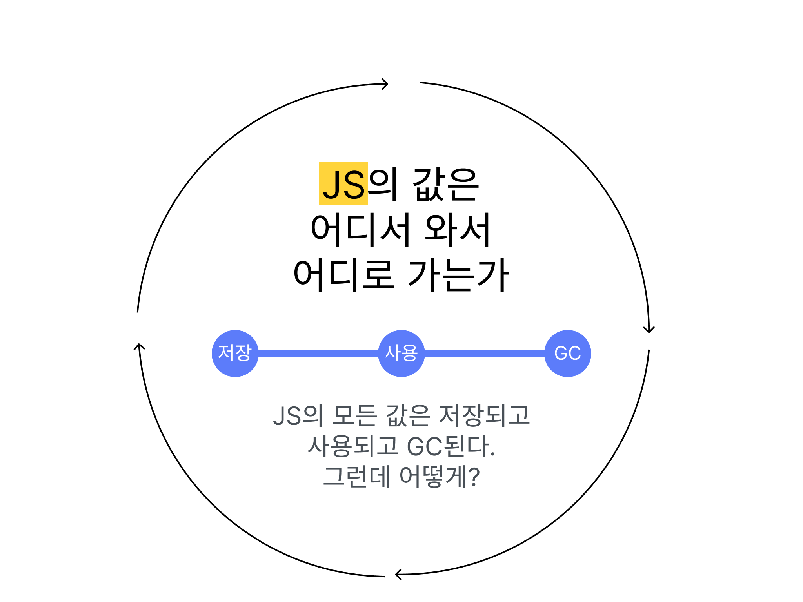

어느 날 [파차님의 트윗](https://twitter.com/finalchildmc/status/1751818395669106722)을 보았다. 파차님이 트위터에서 Javascript 엔진이 어떻게 값을 저장하는지에 대해서 설명하셨고 여기에 영감을 받아 추가적인 조사를 통해 이 시리즈를 작성한다.

# 개요

Javascript의 모든 값은 저장되고 다루어지다가 언젠가 쓰이지 않게 되어 가비지 컬렉션된다. 그럼 이 과정은 어떻게 이루어질까? 이에 대한 답은 물론 간단하게 답할 수도 있겠지만 구체적으로는 그렇게 간단하지 않다.

앞서 언급한 Javascript의 값이 거치는 과정은 3가지로 나눌 수 있을 것이다.

1. 값이 저장된다
2. 값이 사용된다
3. 값이 가비지 컬렉션된다

따라서 이 각각에 대해서 다루는 글들을 써 볼 예정이다. Javascript에서 내부적으로 값이 어떻게 저장되고 사용되고 청소되는지 그리고 각 엔진들에서 이를 어떻게 구현했는지에 대해 가능한 한 많이 조사하여 다룰 것이다.

이 시리즈에서 다룰 모든 주제에 대해서, 각 엔진들은 자신만의 특수한 기법들을 많이 사용한다. 하지만 그것을 모두 깊이 파기에는 시간도 지식도 부족하기 때문에 각 글은 대부분 거의 모든 엔진에 적용되는 전반적인 부분을 다룬 후 V8과 SpiderMonkey(주요 2개 엔진)에 대해서만 다룰 것이다. 이제 Edge 브라우저에서도 V8을 사용하게 되었기 때문에 사실상 대부분의 경우에 대해 다룰 수 있을 것이다.

# 값의 저장

값이 저장되는 것에 대한 이야기는 지금까지의 조사를 토대로 3가지 정도로 나누어 볼 수 있다.

먼저 값은 '어디에' 저장되는가? 우리는 프로그램이 사용하는 메모리가 대표적으로 스택과 힙으로 나뉜다는 사실을 알고 있다. 물론 V8등의 엔진에서는 가비지 컬렉션을 위해서 값을 여러 공간에 나누어서 저장한다. 하지만 그것은 엔진에 특화된 이야기이고 기본적으로는 스택과 힙으로 나뉜다. 따라서 우리는 JS의 값이 어디에 저장되는지에 대해 다룰 것이다.

그 다음 값은 '어떤 형식으로' 저장되는가? 에 관해 다룬다. 아무래도 값이든 포인터 주소든 비트 형식으로 메모리에 저장되겠지만 그래도 더 적은 메모리를 사용하고 더 빨리 불러올 수 있는 형식으로 저장하기 위해 쓰이는 기법들이 있다. tagged pointer, NaN boxing 등의 메모리 기법에 대한 이야기가 될 것이다. 그리고 각 엔진에서 적용하는 몇몇 최적화에 대해서도.

그런데 문자열이나 객체 등, 포인터를 통해서 저장되는 값들도 있다. 그럼 그 포인터를 따라가면 어떤 식으로 값이 저장되어 있을까? 즉 값이 저장되어 있다고 하는 포인터를 따라가면 실제 값은 어떤 형식일까?

- 값은 어디에 저장되는가? 스택 vs 힙

[JS 탐구생활 - JS의 값은 스택과 힙 중 어디에 저장되는가?](https://witch.work/posts/javascript-trip-of-js-value-where-value-stored)

- 값은 어떤 형식으로 저장되는가? tagged pointer, NaN boxing

[JS 탐구생활 - JS 엔진이 값을 저장하는 방법, tagged pointer와 NaN boxing](https://witch.work/posts/javascript-trip-of-js-value-tagged-pointer-nan-boxing)

- 포인터로 저장된 값은 어떤 형식인가? 히든 클래스

# 값의 사용

값이 사용되는 과정에 대해서는 저장된 값을 꺼내 씀에 있어서 캐싱 등 어떤 최적화가 이루어지는지에 집중하여 다룰 것이다.

작성 중...

- 인라인 캐싱